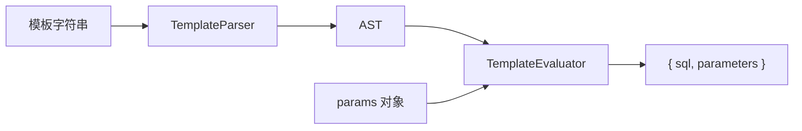

# SqlTemplateParser 技术规格（SPEC）

## 设计目标

- 在 `packages/core`（`@novel-master/core`）实现 PRD 定义的动态 SQL 模板解析，**零运行时第三方依赖**（仅 Node 20+ 与 TypeScript 标准库）。
- 对外提供稳定、可类型检查的 API：`parse` → `{ sql, parameters }`。
- 解析与求值分离：模板字符串 → AST → 在参数上下文中求值输出，便于单测与错误定位。
- 满足 PRD 验收：五种标签、`#{` / `${` 占位、JS 子集 `test` 表达式、类型化错误；`apps/cli` 本期不改。

## 现状与约束（代码探索结论）

| 项 | 现状 | 影响 |
|----|------|------|
| `packages/core/src` | 仅 `index.ts`（`greet`） | 全新模块，无历史 SQL 代码 |
| `packages/core/package.json` | 无 `test` 脚本 | 需新增 `test` 与测试目录 |
| 根 `package.json` | `npm run test` 透传 workspace | core 加 `test` 后根命令即可跑 |
| TS 配置 | `strict`、`NodeNext`、ESM | 新代码须 ESM 导出、严格类型 |
| 测试框架 | 仓库未引入 vitest/jest | 采用 Node 内置 `node:test` + `node:assert` |
| `apps/cli` | 依赖 core，仅用 `greet` | 不修改；新 API 从 `index.ts` 导出即可 |

**兼容性**：仅新增导出，不删除/不改 `greet` 签名，对 cli 无破坏性影响。

## 总体方案

### 架构（两阶段）



1. **TemplateParser（纯语法）**  
   扫描模板，识别动态标签与占位符，构建 AST。此阶段**不访问** `params`，仅校验标签名、闭合、属性必填项。

2. **TemplateEvaluator（语义）**  
   遍历 AST，维护**求值上下文栈**（根 `params` + `foreach` 注入的 `item`/`index`），计算 `test` 表达式，拼接 SQL 片段，收集 `#{...}` 对应值到 `parameters`，将 `#{...}` 替换为 `?`。

### 关键设计决策

| 决策 | 选择 | 理由 |
|------|------|------|
| SQL 中 `<` 歧义 | 仅当 `<` 后匹配**已知动态标签名**（不区分大小写）才进入标签解析 | 与 MyBatis 一致；比较运算符 `a < b` 在静态文本中保留 |
| `test` 表达式 | 预处理 MyBatis 关键字 `and`/`or`/`not`/`null` 等 → JS，再用 `new Function` + 单一 `__ctx__` 参数求值 | PRD 要求 JS 子集且示例含 `and`；避免 `with`；上下文用 Proxy 使未定义属性读为 `undefined` |
| 缺失属性 | **不抛错**，读为 `undefined`（`foo != null` 为 false） | PRD 要求测试统一策略；与 MyBatis OGNL 常见行为一致 |
| `#{name}` | 输出 `?`，按出现顺序 push `resolvePath(ctx, name)` | PreparedStatement 风格 |
| `${name}` | `String(resolvePath(...))` 直接嵌入，**不入** `parameters` | PRD 明确 |
| 路径解析 | 支持 `user.id`、`item`、foreach 内 `id` 指当前 item | 覆盖 PRD 用例 |
| 未知标签 | 解析期 `SqlTemplateError`（`UNKNOWN_TAG`） | PRD |
| `foreach` 空集合 | **不输出** `open`/`separator`/`close` 及体内内容（整体为空串） | 避免 `IN ()`；比 MyBatis 更保守，测试锁定 |
| `foreach` collection | `null`/`undefined` 视同空集合 | 与空数组一致 |
| 静态文本空白 | **不**做全局规范化，原样保留（仅 `where`/`trim` 规则内裁剪） | PRD：空白约定由测试固定 |
| 占位符默认 | `?`（可通过 `SqlTemplateParser` 构造选项 `placeholder: '?'` 预留，默认 `?`） | 便于未来支持 `$1` |

### AST 节点类型

```typescript
type AstNode =
  | { type: "text"; value: string }
  | { type: "bind"; kind: "hash" | "dollar"; path: string } // #{path} ${path}
  | { type: "if"; test: string; children: AstNode[] }
  | { type: "where"; children: AstNode[] }
  | { type: "foreach"; attrs: ForeachAttrs; children: AstNode[] }
  | { type: "trim"; attrs: TrimAttrs; children: AstNode[] }
  | { type: "choose"; whens: { test: string; children: AstNode[] }[]; otherwise?: AstNode[] };

interface ForeachAttrs {
  collection: string; // 属性名字符串，求值时从 context 取
  item: string;
  index?: string;
  open?: string;
  close?: string;
  separator?: string;
}

interface TrimAttrs {
  prefix?: string;
  suffix?: string;
  prefixOverrides?: string; // 如 "AND |OR "
  suffixOverrides?: string;
}
```

### 标签语义（求值）

| 标签 | 行为 |
|------|------|
| `<if test="expr">` | `evaluateTest(expr)` 为真则渲染 `children`，否则跳过 |
| `<where>` | 渲染 children 得片段 `s`；若 `s` 去空白后为空则输出空；否则去掉首部重复 `AND`/`OR`（忽略大小写、多余空白），再前缀 `WHERE ` + 余下内容 |
| `<foreach>` | 解析 `collection` 为数组（`Array.isArray`；对象用 `Object.values`；非可迭代且非对象则视为空）；空则 `""`；否则 `open + join(separator) + close`，每项在子上下文中设 `item`/`index` |
| `<trim>` | 先渲染 children 得 `s`，按 `prefixOverrides`/`suffixOverrides`（`|` 分隔，大小写不敏感）剥除首尾 token，再拼 `prefix`/`suffix` |
| `<choose>` | 按序第一个真 `when` 渲染并返回；否则渲染 `otherwise`；皆无则 `""` |
| `<when>` / `<otherwise>` | 仅作为 `choose` 子节点，由 parser 归入 `choose` 结构，**不**单独出现在顶层 AST |

### 表达式子集（`test`）

**支持（经预处理后可被 JS 执行）：**

- 字面量：数字、单/双引号字符串
- 标识符与点路径：`id`、`user.name`
- 比较：`==` `!=` `===` `!==` `<` `>` `<=` `>=`
- 逻辑：预处理 `and`→`&&`，`or`→`||`，`not`→`!`（整词匹配，避免误伤 `name`）
- 括号、一元 `!`
- `null`、`undefined`、`true`、`false`

**不支持（解析/求值抛 `EXPRESSION_ERROR`）：**

- 函数调用、赋值、逗号运算符、`new`、模板字符串
- 访问不存在的全局（除 `__ctx__` 代理上的属性）

**安全：** 仅对 `test="..."` 属性值求值，不对整段模板 `eval`。

### 错误类型

```typescript
export class SqlTemplateError extends Error {
  readonly code:
    | "UNKNOWN_TAG"
    | "UNCLOSED_TAG"
    | "MALFORMED_TAG"
    | "EXPRESSION_ERROR"
    | "INVALID_COLLECTION";
  readonly offset?: number;
  readonly tagName?: string;
}
```

- 解析阶段：`UNKNOWN_TAG`、`UNCLOSED_TAG`、`MALFORMED_TAG`（缺少 `test`/`collection` 等）
- 求值阶段：`EXPRESSION_ERROR`（`test` 语法/运行时错误）、`INVALID_COLLECTION`（`foreach` 的 collection 既非数组也非 plain object，可选严格模式；**首期**对 string/number 视为空集合而非抛错，与空数组一致，减少惊愕）

## 最终项目结构

基础设施类能力统一放在 `src/infra/`；`SqlTemplateParser` 位于其子目录 `sql-template/`。

```
packages/core/
  package.json                 # 新增 test 脚本；devDependencies 增加 tsx（与 cli 一致，用于跑 TS 测试）
  src/
    index.ts                   # 导出 SqlTemplateParser、类型、SqlTemplateError
    infra/
      sql-template/
        index.ts               # 模块 barrel
        types.ts               # SqlParseResult, ParseOptions, Ast 类型
        errors.ts              # SqlTemplateError
        parser.ts              # TemplateParser
        evaluator.ts           # TemplateEvaluator
        expression.ts          # normalize + evaluateTest
        context.ts             # ContextStack, resolvePath
        placeholder.ts         # appendParam, renderBind
        tags/
          where.ts             # stripLeadingAndOr, wrapWhere
          trim.ts              # applyTrimOverrides
          foreach.ts           # iterateCollection（可选，逻辑也可放 evaluator）
  test/
    infra/
      sql-template/
        parser.test.ts
        evaluator-if-where.test.ts
        evaluator-foreach.test.ts
        evaluator-trim-choose.test.ts
        expression.test.ts
        errors.test.ts
```

> 若 `tags/` 下单文件过少，可将 `where`/`trim` 辅助函数留在 `evaluator.ts`，**不强制**拆目录；实现时以单文件 <300 行为宜。

## 变更点清单

| 文件 | 操作 |
|------|------|
| `packages/core/src/infra/sql-template/**` | **新增** 解析器实现 |
| `packages/core/src/index.ts` | **修改** 导出 `SqlTemplateParser`、`SqlParseResult`、`SqlTemplateError`、`ParseOptions` |
| `packages/core/package.json` | **修改** 增加 `"test": "tsx --test test/**/*.test.ts"`；`devDependencies.tsx` |
| `packages/core/test/**` | **新增** 单元测试 |
| `apps/cli` | **无改动** |
| 根 `package.json` | **无改动**（已有 test 透传） |

## 详细实现步骤

### 步骤 1：基础设施

- 新增 `errors.ts`、`types.ts`（`SqlParseResult`、`ParseOptions`）。
- 实现 `context.ts`：`ContextStack`（push/pop）、`resolvePath(ctx, "user.id")`。
- 实现 `expression.ts`：`normalizeExpression(expr)`、`evaluateTest(expr, ctx)` + 单元测试。

**验证：** `expression.test.ts` 覆盖 `and`/`or`、`!= null`、undefined 属性。

### 步骤 2：模板解析器

- `parser.ts`：从 `offset=0` 递归扫描：
  - 读取普通文本直至 `<`；
  - 若匹配 `</(if|where|...)` 结束当前 children；
  - 若匹配已知开标签，解析属性（`name="value"`，双引号为主，单引号可选），递归 children，校验闭合标签名一致；
  - 若匹配 `#{...}` / `${...}`（正则 `\#\{([^}]+)\}` / `\$\{([^}]+)\}`），生成 `bind` 节点；
  - 若 `<` 后非已知标签且非闭合标签 → `UNKNOWN_TAG`。
- `<choose>` 特殊处理：子节点仅允许 `when`/`otherwise`，构建 `choose` 节点。

**验证：** `parser.test.ts` 对嵌套 `if`、错误标签、未闭合标签建 AST 或抛错（可导出 `parseTemplateToAst` 仅用于测试，或测 `SqlTemplateParser` 内部行为）。

### 步骤 3：求值器

- `evaluator.ts`：`evaluate(nodes, stack)` → `{ parts: string[], parameters: unknown[] }`。
- `text`：追加原文。
- `bind`：`hash` → `?` + push；`dollar` → 直接 append 字符串。
- `if`/`choose`/`foreach`/`where`/`trim` 按上文语义实现；`where`/`trim` 逻辑可抽 `tags/where.ts`、`tags/trim.ts`。

**验证：** 分文件集成测试，对齐 PRD Given/When/Then。

### 步骤 4：公共 API

```typescript
// packages/core/src/infra/sql-template/index.ts
export interface SqlParseResult {
  sql: string;
  parameters: unknown[];
}

export interface ParseOptions {
  /** 默认 "?" */
  placeholder?: string;
}

export class SqlTemplateParser {
  constructor(options?: ParseOptions);
  parse(
    template: string,
    params: Record<string, unknown>,
  ): SqlParseResult;
}
```

- 构造时缓存 `TemplateParser` 实例（无状态，可选）。
- `parse`：`const ast = parser.parse(template)` → `evaluator.evaluate(ast, params)` → `trimEnd` 仅当需要时（**默认不 trim 整体 sql**）。

**验证：** 端到端用例 `SELECT ... <if>...</if>`。

### 步骤 5：导出与构建

- `src/index.ts` 增加 `export { SqlTemplateParser, ... } from "./infra/sql-template/index.js";`
- `npm run build -w @novel-master/core`
- `npm run test -w @novel-master/core`

### 步骤 6：知识库与 APM（流程项）

- 实现完成后 `apm dynamic write` 记录进度（编码阶段，非本 SPEC 交付物）。

## 测试策略

### 运行方式

```json
// packages/core/package.json
"scripts": {
  "test": "tsx --test test/**/*.test.ts"
},
"devDependencies": {
  "tsx": "^4.21.0"
}
```

根目录执行：`npm run test`。

### 测试用例（与 PRD 对齐）

| # | 场景 | 断言要点 |
|---|------|----------|
| 1 | 纯静态 SQL | `parameters.length === 0`，sql 一致 |
| 2 | `#{col}` | sql 含 `?`，`parameters === [10]` |
| 3 | `${orderBy}` | sql 含 `id DESC`，parameters 为空 |
| 4 | `<if test="enabled">` 真/假 | 含/不含 `AND status = 1` |
| 5 | `<if test="missing != null">` | 不含该段（undefined 不抛错） |
| 6 | `<where><if test="id">AND id = #{id}</if></where>` | `WHERE id = ?`，无前导 `AND` |
| 7 | where 内全假 | 无 `WHERE` |
| 8 | foreach `[1,2,3]` | `IN (?,?,?)`，parameters `[1,2,3]` |
| 9 | foreach `[]` / null | 片段为空（无 `IN ()`） |
| 10 | trim `prefixOverrides="AND"` | 首部 `AND` 被剥除并按 prefix 输出 |
| 11 | choose 第二 when 为真 | 仅第二段 body |
| 12 | choose 全假 + otherwise | 输出 otherwise 内容 |
| 13 | `<unknown>` | `SqlTemplateError`，`code === "UNKNOWN_TAG"` |
| 14 | 未闭合 `<if>` | `UNCLOSED_TAG` |
| 15 | 非法 `test`：`test=")"` | `EXPRESSION_ERROR` |
| 16 | 嵌套 foreach + `#{item}` | 参数顺序正确 |
| 17 | 静态文本 `a < b` | 保留 `a < b`（非标签） |

### 非目标测试

- 不测真实 DB 驱动、不测 CLI。
- 不测 `<sql>`/`<include>`/`<bind>`/`<set>`。

## 风险与回滚方案

| 风险 | 缓解 | 回滚 |
|------|------|------|
| SQL 中 `<` 与标签歧义 | 已知标签白名单；用例 17 | 文档说明：动态比较用 `&lt;` 或拆静态 SQL |
| `new Function` 表达式安全 | 仅 `test` 属性、预处理拒绝 `[;{}]` 等 | 后续可换自研表达式 AST |
| `foreach` 空集合行为与 MyBatis 不一致 | SPEC 明确为空串；测试锁定 | 增加 `emptyBehavior` 选项 |
| 无现有 test 基建 | 仅用 `node:test` + `tsx` | 删除 `test` 脚本与 `test/` 目录即可回滚 |
| `${}` SQL 注入 | 类型/文档注释 `@remarks 调用方负责` | 无代码回滚需求 |

**回滚：** 删除 `src/infra/sql-template/` 与 `test/infra/sql-template/`，恢复 `index.ts` 仅导出 `greet`；不影响 cli。

---

**文档路径**：`.apm/kb/docs/Iterations/SqlTemplateParser/spec.md`  
**前置 PRD**：`.apm/kb/docs/Iterations/SqlTemplateParser/prd.md`  
**编码门禁**：用户确认本 SPEC 后再实现。
