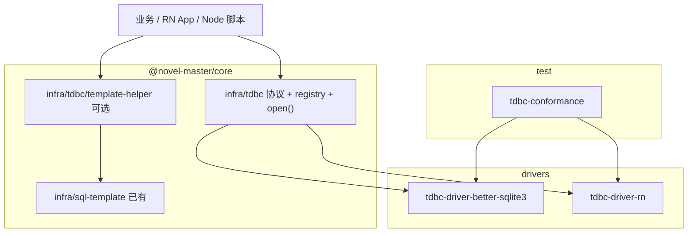

# TDBC 技术规格（SPEC）

## 设计目标

- 在 `@novel-master/core` 的 `infra/tdbc` 定义 **零原生依赖** 的异步 TDBC 协议，与现有 `infra/sql-template`（`SqlParseResult`: `{ sql, parameters }`）对齐。
- 同期交付 **`@novel-master/tdbc-driver-better-sqlite3`**（Node）与 **`@novel-master/tdbc-driver-rn`**（RN），通过共享 **conformance** 套件验收。
- RN 选型锁定为 **`react-native-quick-sqlite`**（社区常用、原生异步 API、非 Expo 独占）；通过 **适配器接口** 隔离，便于后续增加 `expo-sqlite` 适配器而无需改协议。
- 不改变 `SqlTemplateParser` 行为；可选 template helper 置于 core，不进入 Driver 包。

## 现状与约束（代码探索）

| 项 | 现状 | 对 TDBC 的影响 |
|----|------|----------------|
| `packages/core/src/index.ts` | 已导出 `SqlTemplateParser`、`SqlParseResult` | helper 可依赖同包 `parse()` 结果直接 `execute` |
| `infra/sql-template` | 默认占位 `?`，`parameters: unknown[]` | TDBC canonical 绑定与此一致，无需转换 |
| `packages/core` | 无 `tdbc`、无 DB 依赖；`test` 用 `tsx --test` | 协议与 conformance 测 core；Driver 各自 `test` |
| Monorepo | `workspaces: packages/*, apps/*` | 新增 `packages/tdbc-driver-*`、`packages/tdbc-conformance` |
| `apps/cli` | 仅 `greet` | 本期不修改 |
| Node | `>=20`，ESM，`strict` | Driver 使用 `node:test`；better-sqlite3 需 `@types` 或自带类型 |

**兼容性**：纯新增模块与包；不破坏现有导出。

---

## 总体方案

### 分层架构



### 核心抽象

1. **`TdbcDriver`**：注册名 + `open(options) → Connection`。
2. **`TdbcConnection`**：异步 `execute` / `query` / `batch` / `transaction` / `close`。
3. **`registerDriver` + `open(url)`**：URL 解析选择 Driver；未知 driver → `TdbcError`（`UNKNOWN_DRIVER`）。
4. **Driver 内部**：better-sqlite3 用 **串行化队列** 包装同步调用；RN 用 quick-sqlite 异步 API + 可选 **Adapter** 注入（便于测试）。

### 关键设计决策

| 决策 | 选择 | 理由 |
|------|------|------|
| 异步 | 协议仅 Promise | PRD；RN 无异步例外 |
| 占位符 | `?` + `readonly unknown[]` | 与 `SqlTemplateParser` 一致 |
| `null` / `undefined` 绑定 | 均绑定为 SQL `NULL` | conformance 锁定 |
| `execute` vs `query` | `execute` 不返回行；`query` 仅用于 `SELECT` 类 | 语义清晰；driver 可用 `all`/`get` 优化 |
| `batch` | 同一 SQL + `paramsList[][]`，**单事务内顺序执行**，任一条失败则 **整批回滚** | PRD 全成功或全失败 |
| 事务 | `transaction(fn)`：`BEGIN` → `fn(tx)` → `COMMIT`；`fn` reject/throw → `ROLLBACK` | PRD |
| `tx` 连接 | `tx` 与父连接共享底层 DB，仅事务深度为 1（**禁止嵌套** `transaction()`） | 首期无 SAVEPOINT |
| URL | `tdbc:sqlite:<path>` 或 `tdbc:sqlite:file:<path>` | 可扩展 query（`?mode=memory`） |
| RN 实现 | `react-native-quick-sqlite` | SPEC 锁定；Expo 非必须 |
| RN CI | conformance 对 RN 包使用 **MockSqliteAdapter** 跑通；真机清单为集成验收 | 无 RN 运行时于 Node CI |
| 类型行 | `Row = Record<string, SqlValue>` | 简单可测 |
| `SqlValue` | `null \| number \| string \| bigint \| Uint8Array` | 覆盖 SQLite 存储类 |

### 协议类型（实现依据）

```typescript
/** SQLite 列值在 JS 侧的规范表示 */
export type SqlValue = null | number | string | bigint | Uint8Array;

export type Row = Record<string, SqlValue>;

export interface ExecuteResult {
  /** sqlite3_changes() */
  changes: number;
  /** sqlite3_last_insert_rowid()；无插入时为 0 */
  lastInsertRowid: number | bigint;
}

export interface BatchResult {
  /** 每组参数执行后的 changes 之和 */
  totalChanges: number;
  /** 批次数 */
  count: number;
}

export interface OpenOptions {
  /** 覆盖 URL 中的路径，如 `:memory:` */
  filename?: string;
  /** 只读打开 */
  readOnly?: boolean;
  /** 显式 driver 名，优先于 URL 解析 */
  driver?: string;
}

export interface TdbcConnection {
  execute(
    sql: string,
    parameters?: readonly unknown[],
  ): Promise<ExecuteResult>;

  query<T extends Row = Row>(
    sql: string,
    parameters?: readonly unknown[],
  ): Promise<T[]>;

  /**
   * 对同一 prepared SQL 顺序执行多组参数；全部在同一事务中。
   * 任一组失败则回滚并抛错，不保留部分成功。
   */
  batch(
    sql: string,
    parametersList: readonly (readonly unknown[])[],
  ): Promise<BatchResult>;

  transaction<T>(fn: (tx: TdbcConnection) => Promise<T>): Promise<T>;

  /** 幂等；关闭后所有方法抛 CONNECTION_CLOSED */
  close(): Promise<void>;
}

export interface TdbcDriver {
  readonly name: string;
  open(options: OpenOptions & { url?: string }): Promise<TdbcConnection>;
}
```

### 错误模型

```typescript
export class TdbcError extends Error {
  readonly code:
    | "UNKNOWN_DRIVER"
    | "INVALID_URL"
    | "CONNECTION_CLOSED"
    | "SQLITE_ERROR"
    | "BATCH_FAILED"
    | "NESTED_TRANSACTION";
  readonly driver?: string;
  /** SQLite 扩展错误码（若有） */
  readonly sqliteCode?: number;
  readonly cause?: unknown;
}
```

- 底层驱动错误统一包装为 `SQLITE_ERROR`，保留 `cause`。
- `batch` 中途失败：`BATCH_FAILED` + 回滚后抛出。

### URL 与注册

```typescript
// core/infra/tdbc/registry.ts
export function registerDriver(driver: TdbcDriver): void;
export function getDriver(name: string): TdbcDriver | undefined;

// core/infra/tdbc/open.ts
export function open(url: string, options?: OpenOptions): Promise<TdbcConnection>;
```

| URL 示例 | 解析 |
|----------|------|
| `tdbc:sqlite:./data/app.db` | driver=`sqlite` → 注册名 `better-sqlite3` / `rn` 由 `options.driver` 或默认 |
| `tdbc:sqlite:file::memory:` | 内存库 |
| 非法 scheme | `INVALID_URL` |

**默认 driver 策略（首期）**：

- Node 环境：`registerDriver` 由 consumer 显式注册；`open` 时若仅注册一个 driver 则自动选用。
- RN 应用启动时注册 `rn` driver；Node 脚本注册 `better-sqlite3`。
- 未注册且无法推断 → `UNKNOWN_DRIVER`（避免静默连错库）。

> 实现时提供 `registerBuiltinDrivers()` **不在 core 自动调用**（避免 core 拉 native），由各 driver 包的 `register.ts` 导出一行注册函数。

### Template helper（可选，core 内）

```typescript
// infra/tdbc/template-helper.ts
export async function executeTemplate(
  connection: TdbcConnection,
  parser: SqlTemplateParser,
  template: string,
  params: Record<string, unknown>,
): Promise<ExecuteResult>;

export async function queryTemplate<T extends Row = Row>(
  connection: TdbcConnection,
  parser: SqlTemplateParser,
  template: string,
  params: Record<string, unknown>,
): Promise<T[]>;
```

实现：`const { sql, parameters } = parser.parse(template, params)` → `connection.execute` / `query`。

---

## Driver 设计

### `@novel-master/tdbc-driver-better-sqlite3`

| 项 | 说明 |
|----|------|
| 依赖 | `better-sqlite3`（runtime）、`@novel-master/core`（workspace） |
| 注册名 | `better-sqlite3` |
| 并发 | 单连接上 **AsyncMutex** 队列：所有 `execute/query/batch/transaction` 串行入队，内部同步调用 |
| `open` | `new Database(filename, { readonly })` |
| `execute` | `stmt.run(...bind)` → `{ changes, lastInsertRowid }` |
| `query` | `stmt.all(...bind)` + 行映射为 `Row` |
| `batch` | `db.transaction(() => { for (params of list) stmt.run(...) })()` |
| `transaction` | `db.transaction(fn)()` 包装为 Promise；`tx` 对象复用同一 `Database`，设置 `inTransaction` 标志 |
| BLOB | `Buffer` → `Uint8Array` 输出 |

### `@novel-master/tdbc-driver-rn`

| 项 | 说明 |
|----|------|
| 依赖 | `react-native-quick-sqlite`（**peerDependency**）、`@novel-master/core` |
| 注册名 | `rn` |
| 适配器 | `RnSqliteAdapter` 接口，默认 `QuickSqliteAdapter` 调用 `open`/`executeAsync`/`executeBatch` 等 |

```typescript
/** 隔离 quick-sqlite，供 conformance mock */
export interface RnSqliteAdapter {
  open(options: { name: string; location?: string }): Promise<void>;
  close(): Promise<void>;
  execute(sql: string, params?: unknown[]): Promise<QuickSqliteResult>;
  // 若库无原生 batch，adapter 内用 transaction + 循环 execute 实现
}
```

| 能力 | 实现 |
|------|------|
| `execute` | `executeAsync` + 绑定数组 |
| `query` | `executeAsync` 且解析 `rows`/`columnNames`（按 quick-sqlite 返回形状映射） |
| `batch` | 优先 native batch（若有）；否则 `transaction` + 循环 |
| `transaction` | `executeAsync('BEGIN')` / `COMMIT` / `ROLLBACK` |
| CI | `MockRnSqliteAdapter` 内存实现，跑完整 conformance |

**真机集成验收**（不阻塞 Node CI）：示例 App 或文档中的 checklist 执行 5 条 smoke（open、insert、select、transaction rollback、close）。

---

## 最终项目结构

```
packages/core/src/infra/tdbc/
  index.ts              # barrel + 模块头注释
  types.ts              # SqlValue, Row, ExecuteResult, ...
  errors.ts             # TdbcError
  connection.ts         # TdbcConnection 接口
  driver.ts             # TdbcDriver 接口
  registry.ts           # registerDriver / getDriver
  open.ts               # parseUrl + open()
  normalize-bindings.ts # undefined/null → null
  template-helper.ts    # executeTemplate / queryTemplate

packages/tdbc-driver-better-sqlite3/
  package.json
  tsconfig.json
  src/
    index.ts            # export driver + registerBetterSqlite3Driver()
    driver.ts
    connection.ts
    mutex.ts
    row-mapper.ts
  test/
    driver.test.ts
    conformance.test.ts # imports shared suite

packages/tdbc-driver-rn/
  package.json          # peerDependencies: react-native-quick-sqlite
  src/
    index.ts
    driver.ts
    connection.ts
    adapter.ts            # RnSqliteAdapter
    quick-sqlite-adapter.ts
  test/
    mock-adapter.ts
    conformance.test.ts

packages/tdbc-conformance/
  package.json          # 仅 dev：core + 被测 driver
  src/
    suite.ts            # runConformanceTests(factory)
    cases/
      lifecycle.ts
      crud.ts
      transaction.ts
      batch.ts
      types.ts
```

根 `package.json` workspaces 已含 `packages/*`，新包自动纳入。

---

## 变更点清单

| 路径 | 操作 |
|------|------|
| `packages/core/src/infra/tdbc/**` | **新增** |
| `packages/core/src/index.ts` | **修改** 导出 TDBC 类型、`open`、`registerDriver`、template helper |
| `packages/tdbc-driver-better-sqlite3/**` | **新增** workspace 包 |
| `packages/tdbc-driver-rn/**` | **新增** workspace 包 |
| `packages/tdbc-conformance/**` | **新增** 共享测试 |
| `packages/core/package.json` | **无** 新增 runtime 依赖 |
| `apps/cli` | **无改动** |
| `.apm/kb/docs/monorepo.md` | **可选** 后续补充三包包名（非本期阻塞） |

---

## 详细实现步骤

### 步骤 1：协议骨架（core）

- 新增 `errors.ts`、`types.ts`、`connection.ts`、`driver.ts`、`registry.ts`、`open.ts`、`normalize-bindings.ts`。
- 单元测试：`open` 非法 URL、`UNKNOWN_DRIVER`、关闭后 `CONNECTION_CLOSED`。

**验证：** `npm run test -w @novel-master/core`（仅新增 tdbc 测试文件）。

### 步骤 2：Template helper

- `template-helper.ts` + 测试：mock `TdbcConnection` 断言 `parse` 结果被传入。

### 步骤 3：Conformance 套件

- `packages/tdbc-conformance` 实现 `runConformanceTests(createConnection)`。
- 用例覆盖 PRD：生命周期、CRUD、`SqlTemplateParser` 输出执行、事务提交/回滚、batch 全失败回滚、BLOB/NULL 类型。

**验证：** 先用 **内存 mock connection** 在 conformance 包内自测 harness。

### 步骤 4：better-sqlite3 Driver

- 实现 mutex、connection、driver、`registerBetterSqlite3Driver()`。
- `conformance.test.ts` 使用 `:memory:`。

**验证：** `npm run test -w @novel-master/tdbc-driver-better-sqlite3` 全绿。

### 步骤 5：RN Driver + Mock 适配器

- 定义 `RnSqliteAdapter`，实现 `MockRnSqliteAdapter`（内存 Map 表或简化 SQL 子集 **不推荐** —— 用 **better-sqlite3 仅测试 adapter 契约** 不可行在 RN 包；Mock 实现最小 SQL：CREATE/INSERT/SELECT/UPDATE/DELETE/事务原语即可）。
- 实现 `QuickSqliteAdapter` 薄封装。
- `conformance.test.ts` 仅跑 Mock（CI）；文档列真机 smoke。

**验证：** `npm run test -w @novel-master/tdbc-driver-rn` 全绿。

### 步骤 6：导出与文档

- 更新 `core/src/index.ts` 导出。
- 各包 `README.md` 片段：注册 driver、`open`、与 `SqlTemplateParser` 组合示例。

**验证：** 根目录 `npm run build`、`npm run test`。

---

## 测试策略

### 运行矩阵

| 包 | 命令 | 内容 |
|----|------|------|
| core | `npm run test -w @novel-master/core` | registry、open、helper、normalize |
| tdbc-conformance | （被 driver 引用） | 不单独跑，或 `test` 用 mock 自检 |
| tdbc-driver-better-sqlite3 | `npm run test` | conformance + mutex |
| tdbc-driver-rn | `npm run test` | conformance（MockAdapter）+ adapter 单元 |

### Conformance 用例（必过）

| # | 场景 | 断言 |
|---|------|------|
| C1 | open → execute → close → 再 execute | `CONNECTION_CLOSED` |
| C2 | INSERT `?` 绑定 + SELECT | 行数据一致 |
| C3 | `null` / `undefined` 参数 | 读回 `null` |
| C4 | BLOB `Uint8Array` 往返 | 字节相等 |
| C5 | `transaction` 成功 | 提交可见 |
| C6 | `transaction` 内 throw | 回滚，计数不变 |
| C7 | `batch` 3 组成功 | `totalChanges` / `count` 正确 |
| C8 | `batch` 第 2 组违反约束 | 全回滚，`BATCH_FAILED` |
| C9 | 嵌套 `transaction()` | `NESTED_TRANSACTION` |
| C10 | Parser 产出 `INSERT ... ?` | `execute` 成功 |
| C11 | 未知 driver URL + 无注册 | `UNKNOWN_DRIVER` |

### RN 集成（文档清单，非 CI 阻塞）

- [ ] 真机 open 文件库
- [ ] INSERT/SELECT
- [ ] transaction rollback
- [ ] batch 10 条
- [ ] close 后调用失败

### SKIP 策略

| 用例 | Driver | 说明 |
|------|--------|------|
| 无 | better-sqlite3 | 无 SKIP |
| 无 | rn (CI) | Mock 跑满 C1–C11 |
| 真机性能 | rn | 仅 manual |

---

## 风险与回滚方案

| 风险 | 缓解 | 回滚 |
|------|------|------|
| quick-sqlite API 变更 | `RnSqliteAdapter` 隔离 | 锁 peer 版本 |
| better-sqlite3 阻塞事件循环 | mutex 串行 + 文档勿超大 batch | 拆 worker（二期） |
| Mock 与真机行为漂移 | 真机 smoke 清单；集成测试记录 | 加强 adapter 集成测试 |
| conformance Mock 过简 | Mock 用 sql.js 或嵌入 better-sqlite3 仅用于 **RN 包的 node 测试** | — |

**可选增强（二期）**：RN conformance 在 macOS CI 用 Detox 跑真库。

**回滚**：删除 `infra/tdbc`、三个新包、core 导出改动；不影响 `sql-template`。

---

**文档路径**：`.apm/kb/docs/Iterations/TDBC/spec.md`  
**前置 PRD**：`.apm/kb/docs/Iterations/TDBC/prd.md`  
**编码门禁**：用户确认本 SPEC 后再实现。
