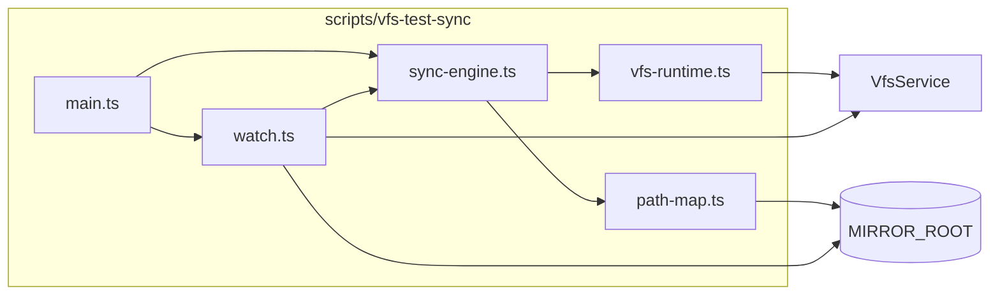

# vfs-test-sync-script 技术规格（SPEC）

## 设计目标

- 交付 **dev-only** 脚本包 `scripts/vfs-test-sync/`，在 VFS 与本地镜像目录之间提供 **全量 force 同步**。
- 命令仅 **`push`**、**`pull`**、**`watch`**；**无** baseline、**无** `.sync-state.json`、**无** dry-run。
- **不修改** `packages/core`、`apps/cli` 公开 API。

## 现状与约束（代码探索）

| 项 | 现状 | 影响 |
|----|------|------|
| `createVfsService` / `bootstrapVfs` | 已从 `@novel-master/core` 导出 | 脚本 bootstrap 与 CLI 相同 |
| `VfsService.write` | 更新默认需 `expectedVersion`；`versionCheck: false` 可强制覆盖 | **`pull` 更新一律 `versionCheck: false`** |
| `VfsService.glob` | `glob('**/*', { cwd: prefix })` | **`push` / VFS 快照** 列举 path |
| `VfsService.delete` | 单 path 非 recursive | 删 VFS 孤儿 path（均为文件行） |
| CLI `runtime.ts` | DB 路径：`NOVEL_MASTER_DB` > `--db` > `./.novel-master/novel.db` | 脚本复制该逻辑 |
| 根 workspaces | `packages/*`、`apps/*` | 增加 `scripts/*` |

**兼容性**：纯新增；无 schema 变更。

---

## 总体方案

### 架构



### 命令语义（全部为 force）

| 命令 | 等价旧称 | 算法概要 |
|------|----------|----------|
| `push` | force from vfs | VFS glob → 写磁盘；删磁盘多余文件 |
| `pull` | force from disk |  walk 磁盘 → 写 VFS；删 VFS 多余 path |
| `watch` | — | 磁盘监听 + VFS 轮询 → 触发 pull / push |

### push 算法

```
pathsVfs = await vfs.glob("**/*", { cwd: prefix })
for path in pathsVfs:
  { content } = await vfs.read(path)
  writeFile(mirrorPath(path), content)
pathsDisk = walkMirror()
for rel in pathsDisk:
  if toVfsPath(prefix, rel) not in pathsVfs:
    unlink(mirrorFile(rel))
```

### pull 算法

```
pathsDisk = walkMirror()  // relative paths
for rel in pathsDisk:
  vfsPath = toVfsPath(prefix, rel)
  content = readFile(mirrorFile(rel))
  try read existing
  if exists: vfs.write(vfsPath, content, { versionCheck: false })
  else: vfs.write(vfsPath, content)
pathsVfs = await vfs.glob("**/*", { cwd: prefix })
for path in pathsVfs:
  if path not in mappedDiskSet:
    await vfs.delete(path)
```

### watch 算法

**磁盘侧**：`fs.watch(mirrorRoot, { recursive: true })`（Node 20+ Windows 支持 recursive）；若不可用则 **chokidar** 作为 devDependency fallback（SPEC 锁定：先原生，失败再 chokidar）。

**VFS 侧**：轮询间隔默认 **500ms**（`--poll-ms`），快照 `Map<path, { version, mtimeMs }>`（自 `glob` + `read` 或仅 `glob` + 批量 query——为简单起见对每个 path `read` 仅取 version/mtime 过重；**优化**：轮询时对 glob 结果逐个 `read` 只取 version+mtimeMs，path 数量大时测试仍够用）。

**触发**：

| 事件 | 动作 |
|------|------|
| 磁盘 change（非 suppress） | 防抖后 `pull()` |
| VFS 快照相对上次变化 | 防抖后 `push()` |
| 同一 debounce 窗口两侧都变 | **先 `pull()` 再 `push()`** |

**回声抑制**：

```typescript
let suppressUntil = 0;
async function pull() {
  suppressUntil = Date.now() + 100;
  await engine.pull();
}
// watch 回调内 if (Date.now() < suppressUntil) return;
```

`push` 写磁盘后同样设置 suppress，避免立即触发 pull。

**生命周期**：`watch` 为前台进程，Ctrl+C exit 0；可选 `--once` 仅跑一轮 poll（测试用，可选）。

---

## 最终项目结构

```text
scripts/vfs-test-sync/
  package.json
  tsconfig.json
  README.md                 # dev 用法，非产品文档
  src/
    main.ts                 # argv: push | pull | watch
    config.ts
    vfs-runtime.ts
    path-map.ts
    mirror-walk.ts          # 递归列举磁盘文件
    sync-engine.ts          # push / pull
    watch.ts                # 监听 + 防抖 + 调度
    errors.ts
  test/
    path-map.test.ts
    sync-engine.test.ts
    watch.test.ts           # mock timer / 假 vfs
```

**移除**（相对上一版 SPEC）：`sync-state.ts`、baseline 相关测试、dry-run。

---

## 变更点清单

| 路径 | 变更 |
|------|------|
| 根 `package.json` | `workspaces`: `"scripts/*"`；可选 `"vfs:sync": "npm run start -w @novel-master/vfs-test-sync --"` |
| `scripts/vfs-test-sync/**` | 新增 |
| `packages/core`、`apps/cli` | 无 |

---

## CLI 接口

```text
vfs-test-sync <push|pull|watch> [options]

Options:
  --db <path>           NOVEL_MASTER_DB > --db > ./.novel-master/novel.db
  --mirror <dir>        必填（或 env VFS_TEST_MIRROR）
  --prefix <vfsPath>    默认 /
  --debounce-ms <n>     watch 防抖，默认 300
  --poll-ms <n>         watch VFS 轮询，默认 500
  --verbose             stderr 打印每个 create/update/delete
```

**Exit codes**：`0` 成功；`1` 运行时错误；`2` 参数错误。

---

## 路径映射（`path-map.ts`）

与上一版相同：

- VFS path 必须以 `/` 开头；禁止 `..`
- `toVfsPath(prefix, rel)` / `toMirrorRelative(prefix, vfsPath)` / `toMirrorFile(root, rel)`
- walk 镜像时 **跳过** 目录 `.git`（若存在）；不写入 `.git` 到 VFS

---

## 详细实现步骤

### 1. 脚手架

- 创建 `scripts/vfs-test-sync` package，`dependencies`: `@novel-master/core`, `@novel-master/tdbc-driver-better-sqlite3`
- 可选 `chokidar` 仅当 `fs.watch recursive` 不可用时启用
- 根 workspaces 加入 `scripts/*`

### 2. `vfs-runtime.ts`

与 `apps/cli/src/vfs/runtime.ts` 对齐；`main` 结束 `conn.close()`。

### 3. `sync-engine.ts`

导出 `push(vfs, config)`、`pull(vfs, config)`；内部共用 `mirror-walk.ts`。

### 4. `watch.ts`

- 启动磁盘 watcher + VFS poll 定时器
- 共享 debounce 函数（leading: false, trailing: true）
- `syncing` 互斥锁：pull/push 执行中忽略新触发

### 5. `main.ts`

解析子命令，调用 engine 或 watch；捕获 `VfsError` 打印 message 后 exit 1。

### 6. 测试

| ID | 断言 |
|----|------|
| T1–T4 | sync-engine 与 PRD 一致 |
| T5 | push → 改 mirror → pull |
| T6–T7 | watch：fake fs events / 改 in-memory vfs（缩短 poll-ms） |
| T8 | 手工 |

---

## 测试策略

- **单元**：path-map、mirror-walk（跳过 `.git`）
- **集成**：temp dir + `:memory:` sqlite（复用 core 测试模式）
- **watch 单测**：不依赖真实 OS watch；注入 `WatchDriver` 接口

---

## 风险与回滚

| 风险 | 缓解 |
|------|------|
| watch 回声振荡 | suppress + debounce + syncing 锁 |
| 两侧同时改 | 文档声明测试级；debounce 内先 pull 再 push |
| push 误删 mirror 外文件 | 仅删 walk 相对 prefix 映射内的孤儿 |
| Windows `fs.watch` 行为 | chokidar fallback |

**回滚**：删除 `scripts/vfs-test-sync` 与 workspace 行。

---

## 实现计划

- [ ] 1. 脚手架 + workspace
- [ ] 2. vfs-runtime + config + main
- [ ] 3. path-map + mirror-walk
- [ ] 4. sync-engine push/pull
- [ ] 5. watch + debounce
- [ ] 6. 单测 T1–T7
- [ ] 7. README 用法示例

**预估**：约 250–400 行 TS（含测试），较上一版减少 ~30%（无 state 模块）。
