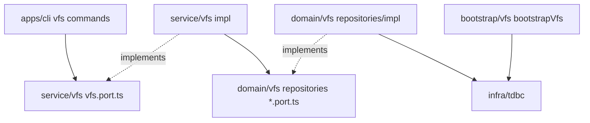

# VFS 与数据分层 技术规格（SPEC）

## 设计目标

- 在 `@novel-master/core` 实现 **VFS 业务分层**（`domain/vfs`、`service/vfs`、`bootstrap/vfs`）；**repositories 与 service 统一 port + impl 风格**，`impl/` 与 repository port **不导出**。
- 存储首期 **SQLite 内联**（经已有 `TdbcConnection`），表结构 **预留** external 字段，不实现外置文件。
- 提供 **乐观锁**（`version` + `UPDATE … WHERE path AND version`），`versionCheck` 可 per-call 关闭。
- CLI（`novel-master vfs …`）仅依赖 **service** + **better-sqlite3 driver** 注册。
- 不修改 `infra/tdbc`、`infra/sql-template` 行为；VFS **不**引入连接池。

## 现状与约束（代码探索）

| 项 | 现状 | 影响 |
|----|------|------|
| `packages/core/src` | 仅有 `infra/tdbc`、`infra/sql-template`、`index.ts`（`greet`） | 新增 `domain/vfs`、`service/vfs`、`bootstrap/vfs`、`errors` |
| `TdbcConnection` | `execute` / `query` / `transaction` / `close` | repository 全部 SQL 经此接口 |
| `packages/core` exports | `.` 与 `./tdbc`；**无** repository 导出惯例 | service/model/errors 从 `.` 导出 |
| `apps/cli` | 仅 `greet`；依赖 core，**无** tdbc-driver | 需加 driver 依赖与子命令路由 |
| 测试 | core `tsx --test`；cli **无** test 脚本 | CLI 增加 E2E 测试脚本 |
| PRD | 无 `update`；**replace**；list/delete 递归 | SPEC 锁定语义 |

**兼容性**：纯新增；现有 TDBC/SqlTemplateParser 导出不变。

---

## 总体方案

### 目录与分层约定（定稿）

```text
packages/core/src/
  infra/                    # 通用协议：tdbc、sql-template（与业务 VFS 无关）
  domain/vfs/               # VFS 模块：模型 + 仓储契约 + 实现
  service/vfs/              # 对外应用服务（Application）：port + impl，与 repositories 同风格
  bootstrap/vfs/            # VFS 表结构幂等初始化
  errors/                   # VfsError（包级共享错误）
```

**依赖规则（port + impl 统一）**：

- `domain/vfs/model`、各 `*.port.ts`（含 `service/vfs/vfs.port.ts`）**不** import 任何 `impl/`。
- `domain/vfs/repositories/impl/*` 依赖 `vfs-entry.port.ts` + `infra/tdbc`。
- `service/vfs/impl/*` 依赖 `vfs.port.ts` + `vfs-entry.port.ts`（经构造函数注入，不直接 import repository impl 文件）。
- `create-vfs-service.ts` **唯一**组装点：`SqliteVfsEntryRepository` → `DefaultVfsService`。
- `bootstrap/vfs` 仅 DDL + `infra/tdbc`。

### 分层与依赖方向



| 路径 | 职责 | 可见性 |
|------|------|--------|
| `domain/vfs/model` | `VfsEntry`、`WriteOptions` 等 DTO | 类型可导出 |
| `domain/vfs/repositories/*.port.ts` | 仓储 **接口** `VfsEntryRepository` | **仅 core 内部** |
| `domain/vfs/repositories/impl/*` | SQLite 仓储实现 | **仅 core 内部** |
| `service/vfs/*.port.ts` | 应用服务 **接口** `VfsService` | **导出类型**（interface） |
| `service/vfs/impl/*` | `DefaultVfsService` 等实现 | **不导出** |
| `service/vfs/glob-match.ts` | glob 工具（无 port） | 仅 core 内部 |
| `service/vfs/create-vfs-service.ts` | 工厂 | 导出 `createVfsService` |
| `bootstrap/vfs` | DDL `IF NOT EXISTS` | 导出 `bootstrapVfs(conn)` |
| `errors` | `VfsError` | 可导出 |

**防腐（两层统一 port + impl）**：

| 层 | port | impl（首期） |
|----|------|----------------|
| repositories | `vfs-entry.port.ts` → `VfsEntryRepository` | `sqlite-vfs-entry.repository.ts` |
| service | `vfs.port.ts` → `VfsService` | `vfs.service.ts` → `DefaultVfsService` |

`createVfsService(conn)`：`new SqliteVfsEntryRepository(conn)` → `new DefaultVfsService(repo)`，返回类型 **`VfsService`**（接口）。包外 **不** export 任一 `impl/` 具体类。

### 路径约定

- 统一 **POSIX 风格**：以 `/` 开头，无尾斜杠（根 `/` 除外）；`normalizePath(path)` 在 repository 入口执行。
- **目录**不在表内单独存行：目录隐式存在（有以 `dir/` 为前缀的路径即视为有子项）。
- **list** 针对「目录路径」：返回该目录下**条目路径**（含文件路径；不返回目录占位行，除非未来显式存 `kind=directory` 行——**首期不存目录行**）。

### 表结构（DDL）

表名：`vfs_entry`

| 列 | 类型 | 说明 |
|----|------|------|
| `path` | `TEXT PRIMARY KEY` | 规范化绝对路径 |
| `content` | `TEXT NOT NULL` | UTF-8 正文 |
| `version` | `INTEGER NOT NULL DEFAULT 1` | 每次成功写 +1 |
| `mtime_ms` | `INTEGER NOT NULL` | `Date.now()` 写时更新 |
| `storage_kind` | `TEXT NOT NULL DEFAULT 'inline'` | 预留：`inline` \| `external` |
| `external_uri` | `TEXT` | 预留，首期恒 `NULL` |

索引：`CREATE INDEX IF NOT EXISTS idx_vfs_entry_path_prefix ON vfs_entry(path);`（辅助 `LIKE` 前缀查询；SQLite 对前缀 `path LIKE '/a/%'` 可用）。

`bootstrapVfs(conn)` 在事务内执行上述 DDL（`conn.execute`）。

### 版本与写语义（repository）

**创建**（路径不存在）：

```sql
INSERT INTO vfs_entry (path, content, version, mtime_ms, storage_kind)
VALUES (?, ?, 1, ?, 'inline');
```

**更新**（`versionCheck: true`，默认）：

```sql
UPDATE vfs_entry
SET content = ?, version = version + 1, mtime_ms = ?
WHERE path = ? AND version = ?;
```

- `changes === 0` → 再 `SELECT version FROM vfs_entry WHERE path = ?`：无行 → `VfsNotFoundError`；有行 → `VfsConflictError`（带 `actualVersion`）。

**更新**（`versionCheck: false`）：

```sql
UPDATE vfs_entry SET content = ?, version = version + 1, mtime_ms = ? WHERE path = ?;
```

- 若仍 0 行 → `NotFound`（用于 replace 前路径必须存在）。

**replace**（`DefaultVfsService`）：`read` → 内存 `replace`（首处 / `replaceAll`）→ 无匹配抛 `VfsReplaceNotFoundError` → `write` 带读到的 `expectedVersion`（**始终 OCC**）。

### list 语义（锁定 PRD 风险项）

| 模式 | CLI | 行为 |
|------|-----|------|
| 默认 | 无 `-r` | **仅直接子路径**（相对 `dir` 的深度 = 1 段） |
| 递归 | `-r` / `--recursive` | 所有后代路径 |
| 限深 | `-r --depth N` | 相对 `dir` 的路径深度 ≤ N（N≥1）；无 `-r` 时 `--depth` 忽略 |

示例：条目 `/a`、`/a/b`、`/a/b/c`  
- `list /a` → `['/a/b']`（仅一段子路径；`/a` 自身若在表中为文件则也返回——**路径既是文件又是前缀时**：表中 `/a` 为文件且存在 `/a/b` 时，list `/` 返回 `/a`，list `/a` 返回子项不含自身文件内容冲突——**首期约定**：同一路径不能既是文件又有子路径；`write` 创建 `/a` 后若再 `write /a/b`，允许；若 `/a` 已是文件（有 content 行），再创建 `/a/b` **允许**（Unix 不冲突）。list `/a` 时：匹配 `path LIKE '/a/%'`，直接子级 = `'/a/'` 后第一段，返回 `/a/b` 等。）

实现：`SqliteVfsEntryRepository.list(dir, { recursive, maxDepth })`  
- SQL 基：`SELECT path FROM vfs_entry WHERE path LIKE ? ESCAPE '\'`（prefix = `dir === '/' ? '/%' : dir + '/%'`）  
- 非递归：过滤 `relativePath` 不含 `/`  
- 递归 + depth：过滤 `relativePath.split('/').length <= maxDepth`

### delete 语义（锁定）

| 模式 | 行为 |
|------|------|
| 默认（非递归） | 仅删除 **精确 path** 一行；若存在 `path LIKE ? || '/%'` 的其他行 → `VfsDirectoryNotEmptyError` |
| `--recursive` | `DELETE FROM vfs_entry WHERE path = ? OR path LIKE ? || '/%'` |

不存在 → `VfsNotFoundError`（精确 delete 无行且无子路径时）。

### glob / grep

| API | 实现（首期） |
|-----|----------------|
| **glob** | `repository.listAllPaths()` 或 `SELECT path FROM vfs_entry`，在 service 用 **无第三方** 的 `matchGlob(pattern, path)`（支持 `*`、`**`、`?`，规则对齐 minimatch 子集并单测） |
| **grep** | `SELECT path, content FROM vfs_entry`（可选 `WHERE path LIKE ?` 缩小范围）；子串匹配；返回 `{ path, line, column, excerpt }[]`；**首期不支持正则**（PRD 可二期 `-E`） |

### 错误类型（导出）

```typescript
export class VfsError extends Error {
  readonly code:
    | "NOT_FOUND"
    | "CONFLICT"
    | "REPLACE_NOT_FOUND"
    | "DIRECTORY_NOT_EMPTY"
    | "INVALID_PATH";
  readonly path?: string;
  readonly expectedVersion?: number;
  readonly actualVersion?: number;
}
```

---

## 对外 API（port 为契约，impl 不导出）

**`service/vfs/vfs.port.ts`**（包外通过 `index.ts` 再导出）：

```typescript
export interface VfsReadResult { path: string; content: string; version: number; mtimeMs: number; }
export interface WriteOptions {
  expectedVersion?: number;
  versionCheck?: boolean;
}
export interface VfsGrepMatch { path: string; line: number; column: number; excerpt: string; }

/** 应用服务契约；由 DefaultVfsService 实现 */
export interface VfsService {
  list(dir: string, options?: { recursive?: boolean; maxDepth?: number }): Promise<string[]>;
  read(path: string): Promise<VfsReadResult>;
  write(path: string, content: string, options?: WriteOptions): Promise<{ version: number }>;
  replace(
    path: string,
    oldString: string,
    newString: string,
    options?: { replaceAll?: boolean },
  ): Promise<{ version: number; replacements: number }>;
  glob(pattern: string, options?: { cwd?: string }): Promise<string[]>;
  grep(pattern: string, options?: { pathPrefix?: string }): Promise<VfsGrepMatch[]>;
  delete(path: string, options?: { recursive?: boolean }): Promise<void>;
}
```

**`service/vfs/impl/vfs.service.ts`**（内部）：

```typescript
export class DefaultVfsService implements VfsService {
  constructor(private readonly repo: VfsEntryRepository) {}
  // …方法实现，委托 repo + glob-match
}
```

**工厂与 bootstrap**：

```typescript
export function bootstrapVfs(conn: TdbcConnection): Promise<void>;
export function createVfsService(conn: TdbcConnection): VfsService;
```

`packages/core/src/index.ts` 导出：

- **类型**：`VfsService`、`VfsReadResult`、`WriteOptions`、`VfsGrepMatch`、model 类型  
- **函数**：`createVfsService`、`bootstrapVfs`  
- **错误**：`VfsError`  

**不导出**：`DefaultVfsService`、`SqliteVfsEntryRepository`、任一 `impl/` 路径。

---

## CLI 设计

### 依赖

```json
// apps/cli/package.json
"dependencies": {
  "@novel-master/core": "*",
  "@novel-master/tdbc-driver-better-sqlite3": "*"
}
```

### 启动链（共享模块 `apps/cli/src/vfs/runtime.ts`）

```typescript
registerBetterSqlite3Driver();
const conn = await open(resolveDbUrl(), { driver: "better-sqlite3" });
await bootstrapVfs(conn);
const vfs: VfsService = createVfsService(conn);
```

- DB 路径：`NOVEL_MASTER_DB` 环境变量 > `--db <path>` > 默认 `./.novel-master/novel.db`
- URL：`tdbc:sqlite:file:` + 绝对路径

### 命令路由（`apps/cli/src/main.ts` 重构）

```
novel-master vfs <subcommand> [options] [args]
```

| 子命令 | 参数 / 选项 | 映射 service |
|--------|-------------|--------------|
| `list` | `<dir>` | `list(dir, { recursive: -r, maxDepth: --depth })` |
| `read` | `<path>` | `read` → stdout 内容 |
| `write` | `<path>` | `--file` 或 stdin；`--version`；`--no-version-check` |
| `replace` | `<path> <old> <new>` | `--all` → `replaceAll` |
| `glob` | `<pattern>` | `--cwd` |
| `grep` | `<pattern>` | `--path-prefix`；输出 `path:line:excerpt` |
| `delete` | `<path>` | `-r` / `--recursive` |

- 保留原 `greet`：`novel-master [name]` 或移至 `novel-master greet`（**首期**：`argv[2]==='vfs'` 走 vfs，否则 greet 兼容）。
- 退出码：0 成功；1 用法错误；2 `VfsError` / `TdbcError`。
- 解析：**首期手写 `process.argv`**（不新增 commander 依赖）；`apps/cli/test/vfs-e2e.test.ts` 用 `node:child_process` 调二进制。

### CLI 与 version

- `write`：更新已存在路径时 **必须** `--version <n>`，除非 `--no-version-check`。
- `replace`：内部 read+write，**不需**用户传 version。
- `read`：可选 `--meta` 输出 JSON（含 version）供脚本使用。

---

## 最终项目结构

```
packages/core/src/
  infra/
    tdbc/
    sql-template/

  domain/vfs/
    model/
      vfs-entry.ts
      vfs-options.ts
    repositories/
      vfs-entry.port.ts              # 接口 VfsEntryRepository
      impl/
        sqlite-vfs-entry.repository.ts

  service/vfs/
    vfs.port.ts                      # interface VfsService（+ 相关 DTO 可放 model 或此文件）
    impl/
      vfs.service.ts                 # class DefaultVfsService implements VfsService
    glob-match.ts                    # 内部工具，无 port
    create-vfs-service.ts            # SqliteRepo → DefaultVfsService

  bootstrap/vfs/
    vfs-schema.ts
    vfs-bootstrap.ts

  errors/
    vfs-errors.ts

  index.ts                           # 导出 VfsService（interface）、工厂；不导出 impl

packages/core/test/
  vfs/
    bootstrap.test.ts
    sqlite-vfs-entry.repository.test.ts
    default-vfs.service.test.ts
    glob-match.test.ts

apps/cli/src/
  main.ts
  vfs/
    runtime.ts
    commands/
      list.ts
      read.ts
      write.ts
      replace.ts
      glob.ts
      grep.ts
      delete.ts

apps/cli/test/
  vfs-e2e.test.ts

apps/cli/package.json
```

> `infra/` 仅放跨业务协议；VFS 业务代码 **不**使用 `infra/vfs` 命名，避免与 `infra/tdbc` 混淆。

---

## 变更点清单

| 路径 | 操作 |
|------|------|
| `packages/core/src/domain/vfs/**` | 新增（model、repositories、impl） |
| `packages/core/src/service/vfs/**` | 新增 |
| `packages/core/src/bootstrap/vfs/**` | 新增 |
| `packages/core/src/errors/vfs-errors.ts` | 新增 |
| `packages/core/src/index.ts` | 修改：VFS 导出 |
| `packages/core/test/vfs/**` | 新增 |
| `apps/cli/src/**` | 重构入口 + vfs 命令 |
| `apps/cli/package.json` | 修改：依赖、test 脚本 |
| `apps/cli/test/vfs-e2e.test.ts` | 新增 |

---

## 详细实现步骤

### 步骤 1：错误、model、bootstrap

- `errors/vfs-errors.ts`、`domain/vfs/model/*`、`bootstrap/vfs/vfs-schema.ts`、`bootstrapVfs`。
- 测试：空库 bootstrap 两次成功；表存在。

### 步骤 2：port + impl

- `domain/vfs/repositories/vfs-entry.port.ts`（`VfsEntryRepository` 接口）。
- `domain/vfs/repositories/impl/sqlite-vfs-entry.repository.ts`：`normalizePath`、CRUD SQL。
- 单测 `:memory:`：经 `registerBetterSqlite3Driver` + `open` + `bootstrapVfs`。

### 步骤 3：service/vfs（port + impl）

- `vfs.port.ts`：`VfsService` 接口与对外 DTO。
- `impl/vfs.service.ts`：`DefaultVfsService`；`replace` / `glob` / `grep` 编排。
- `create-vfs-service.ts` 组装 repository impl → service impl。
- 单测：可对 `DefaultVfsService` 注入 mock `VfsEntryRepository`；集成测走 `createVfsService`。

### 步骤 4：core 导出

- `index.ts` 仅 re-export port 类型与工厂；`dist/index.d.ts` 中 **无** `DefaultVfsService`、`SqliteVfsEntryRepository`。

### 步骤 5：CLI runtime + 子命令

- `runtime.ts`、7 个子命令、main 路由。
- `package.json` 依赖 driver。

### 步骤 6：CLI E2E

- 临时目录 + `novel-master vfs …` 全流程；version 冲突退出码。

**验证**：`npm run build`；`npm run test -w @novel-master/core`；`npm run test -w @novel-master/cli`。

---

## 测试策略

### core 单测（:memory: TDBC）

| # | 场景 |
|---|------|
| T1 | bootstrap 幂等 |
| T2 | write 创建 version=1 |
| T3 | write expectedVersion 成功/冲突 |
| T4 | write versionCheck=false |
| T5 | replace 首次 / --all / not found |
| T6 | list 非递归 / recursive / depth=2 |
| T7 | delete 非空目录失败 / recursive 清空 |
| T8 | glob `**/*.md` |
| T9 | grep 命中行 |
| T10 | normalizePath 非法路径 |

### CLI E2E

| # | 场景 |
|---|------|
| E1 | write + read 往返 |
| E2 | list -r --depth |
| E3 | replace + read |
| E4 | glob / grep |
| E5 | delete -r |
| E6 | write 错误 version → 非 0 退出 |

---

## 风险与回滚方案

| 风险 | 缓解 |
|------|------|
| 路径前缀与文件路径语义混淆 | 文档 + 测试；二期可加 `kind` 列 |
| grep 全表扫描慢 | 首期接受；FTS 二期 |
| glob 自研与 minimatch 差异 | 单测对齐常见模式 |
| CLI 无 commander  argv 脆弱 | 集成测试覆盖；二期可加依赖 |

**回滚**：删除 `domain/vfs`、`service/vfs`（含 `impl/`）、`bootstrap/vfs`、`errors/vfs-errors.ts`、`apps/cli/vfs`；恢复 cli 单文件 greet；无 TDBC 变更。

---

**文档路径**：`.apm/kb/docs/Iterations/VFS/spec.md`  
**前置 PRD**：`.apm/kb/docs/Iterations/VFS/prd.md`  
**编码门禁**：用户确认本 SPEC 后再实现。
