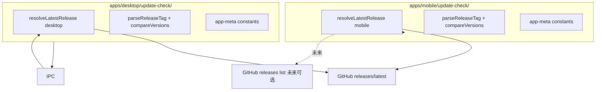

# 关于页与版本更新检查 技术规格（SPEC）

> 需求：[prd.md](./prd.md)  
> 仓库：`bloodycrownD/novel-master`（`git remote`）  
> Release workflow：[release.yml](../../../../.github/workflows/release.yml)（**本迭代不修改**）

## 设计目标

- 在 **不改动** GitHub Release workflow 的前提下，为 Mobile / Desktop 增加「关于」页与更新检查。
- **不修改 `@novel-master/core`**：更新检查属于客户端交付层，且未来 workflow 分端发版后，Desktop / Mobile 的「何为最新版」策略可能分化（按 asset 过滤、不同 API 路径等），逻辑 **各端自包含**。
- 复用现有 **Client UI KKV**（`nm-mobile-ui` / `nm-desktop-ui`）与 Desktop **IPC** 模式；Mobile 直连 `fetch`。
- 不引入 `electron-updater`、不新增重量级 RN 依赖（如 `react-native-device-info`）。
- 允许两端 **少量重复**（semver 解析、仓库 URL 常量，各 ~30 行），换取独立演进空间。

---

## 现状与约束（代码探索）

| 项 | 现状 | 影响 |
|----|------|------|
| 更新检查 | **无** | 全新能力 |
| Mobile 版本 | `novel-master-context.tsx` 读 `apps/mobile/package.json`（`0.0.1`）；CI 仅 `-PversionName` 注入 Gradle | Release APK 的 `versionName` 可能与 JS 包版本 **不一致**，须对齐 |
| Desktop 版本 | `preload.ts` 硬编码 `version: "0.0.0"`；CI `npm version` 只改 desktop `package.json` | Renderer 读 bridge.version **不准**；须从 `app.getVersion()` 经 IPC 暴露 |
| Client UI KKV | Mobile：`app-ui-keys.ts` + `createAppUiPreferences`；Desktop：`app-ui-prefs.ts` + `ipcAppUiGet/Set` | 更新偏好沿用此模块，键名新增即可 |
| `nm-preferences` | `llmStream`、`session-fs.versionCheck` 等跨端业务配置 | **禁止**把 `updates.autoCheck` 放这里 |
| Desktop 设置 | `settings-nav.ts` + `SettingsOverlay.tsx` + `settings-ui.tsx` 组件 | 新增 `about` 顶栏项与 `AboutView` |
| Mobile 导航 | `RootNavigator.tsx` + `types.ts` + `header-config.ts` + `ProfileTabScreen` | 新增 `About` stack 路由与入口 |
| `@novel-master/core` | 领域层、零平台依赖 | **本迭代零改动** |
| GitHub API | 公开仓匿名 `60 req/h/IP` | 24h 节流 + 启动延迟足够 |
| Preload 约束 | Renderer **不得** import `@novel-master/core` | 更新 fetch 在 **main**；semver 比较可在 renderer 经 IPC 结果返回 |

---

## 总体方案

### 为何不进 core

| 维度 | 放 core | 各端自包含（采用） |
|------|---------|-------------------|
| 与 core「零平台依赖」原则 | 冲突（即使纯函数也扩大 core 表面积） | 不碰 core |
| 未来分端 workflow | Desktop / Mobile 须共用一个「找最新 release」抽象，改一处牵两端 | 各端独立改 `resolveLatestRelease()` |
| 本迭代 | `releases/latest` 够用 | 两端实现相同，代码可镜像 |
| 维护成本 | 低重复 | semver 等小函数各一份（可接受） |

**本迭代**：两端均用 `releases/latest` + tag 比较（与 PRD 一致）。  
**未来示例**（仅说明扩展点，不在本迭代实现）：

- Mobile `resolveLatestRelease()`：遍历 releases，取 **含 `*-universal.apk` 或当前 ABI apk** 的最新一条。
- Desktop `resolveLatestRelease()`：取 **含 `*-windows-setup.exe` 或 `*-macos.dmg`**（按 `process.platform`）的最新一条。

两端 **UI、KKV 键名、IPC 契约** 可保持一致；仅 `update-check/` 内部解析策略分化。



### 数据流

1. **读本地版本**：Desktop main `app.getVersion()`；Mobile 读 `apps/mobile/package.json`（发版前 CI 同步版本，见下文）。
2. **读远程（本迭代）**：各端 `resolveLatestRelease()` → `GET …/releases/latest`。
3. **比较**：各端本地 `compareAppVersions(local, parseReleaseTag(tag_name))` → `-1 | 0 | 1`。
4. **持久化**（`nm-*-ui`）：

| Key | 默认 | 说明 |
|-----|------|------|
| `updates.autoCheck` | `"true"` | 自动检查开关 |
| `updates.lastCheckAt` | 空 | ISO-8601，24h 节流 |
| `updates.lastCheckStatus` | 空 | `up-to-date` \| `available` \| `error`（关于页行内展示） |
| `updates.lastCheckRemoteVersion` | 空 | 最近一次远程版本 |
| `updates.dismissedVersion` | 空 | 用户「稍后」的版本 |

---

## 最终项目结构

```text
apps/desktop/
  src/main/update-check/
    app-meta.ts              # GITHUB_REPO、URL builders、本地无 UI 常量
    parse-release-tag.ts
    compare-app-versions.ts
    resolve-latest-release.ts  # 本迭代: latest API；未来: 按 exe/dmg 过滤
    types.ts
    check-for-updates.ts       # orchestrate: local + remote + compare
  src/main/services/           # 或 check-for-updates 即 service，二选一
  src/main/ipc/handlers/app-info.ts
  test/update-check/*.test.ts
  …（About UI、IPC、app-ui-prefs 同前）

apps/mobile/
  src/update-check/
    app-meta.ts              # version + 外链（import package.json）
    parse-release-tag.ts     # 与 desktop 镜像实现
    compare-app-versions.ts
    resolve-latest-release.ts  # 本迭代: latest API；未来: 按 apk 过滤
    types.ts
    check-for-updates.ts
  src/storage/app-ui-keys.ts
  src/screens/stack/AboutScreen.tsx
  src/hooks/useAutoUpdateCheck.ts
  __tests__/update-check/*.test.ts
  …（导航、Profile 入口同前）

.github/workflows/release.yml   # 仅增补 mobile npm version（见变更清单）
```

**明确不新增**：`packages/core/**` 下任何 update-check 相关文件。

---

## 变更点清单

| 文件 | 变更 |
|------|------|
| `apps/desktop/src/main/update-check/*` | 新增（semver、resolve、check 编排） |
| `apps/desktop/test/update-check/*` | 新增 |
| `apps/desktop/shared/ipc-types.ts` | `APP_GET_INFO`, `APP_CHECK_FOR_UPDATES` + 请求/响应 DTO |
| `apps/desktop/src/main/ipc/handlers/app-info.ts` | 新增 |
| `apps/desktop/src/main/services/update-check.service.ts` | 新增 |
| `apps/desktop/src/main/ipc/register-handlers.ts` | 注册 handler |
| `apps/desktop/src/main/storage/app-ui-prefs.ts` | 更新 key 常量 + defaults |
| `apps/desktop/renderer/ipc/client.ts` | `ipcAppGetInfo`, `ipcAppCheckForUpdates` |
| `apps/desktop/renderer/features/settings/AboutView.tsx` | 新增 |
| `apps/desktop/renderer/features/settings/settings-nav.ts` | `SETTINGS_NAV` 增加「应用 → 关于」 |
| `apps/desktop/renderer/layout/SettingsOverlay.tsx` | `case "about"` |
| `apps/desktop/renderer/App.tsx` 或 `NovelMasterProvider` | 挂载 `useAutoUpdateCheck` |
| `apps/desktop/renderer/features/settings/settings-ui.tsx` 或 `settings.css` | 关于页样式（头部 logo、链接行） |
| `apps/mobile/src/storage/app-ui-keys.ts` | 更新 keys + defaults |
| `apps/mobile/src/update-check/*` | 新增（与 desktop 镜像，可独立演进） |
| `apps/mobile/src/screens/stack/AboutScreen.tsx` | 新增 |
| `apps/mobile/src/hooks/useAutoUpdateCheck.ts` | 新增 |
| `apps/mobile/src/navigation/*` | 注册 `About` |
| `apps/mobile/src/screens/tabs/ProfileTabScreen.tsx` | 「关于 Novel Master」入口 |
| `apps/mobile/src/runtime/novel-master-context.tsx` | 可选：`app-meta` 统一版本源 |
| `.github/workflows/release.yml` | `android-release` job 在 Gradle 前增加 `npm version … -w @novel-master/mobile` |

**明确不改**：`nm-preferences`、CLI、**`packages/core`（零改动）**、Release 分端逻辑。

---

## 详细实现步骤

### Step 1 — 各端 `update-check/` 模块（Desktop 先做，Mobile 镜像）

在 `apps/desktop/src/main/update-check/` 与 `apps/mobile/src/update-check/` 各放一套（**不跨 app import**）：

**`app-meta.ts`**

```typescript
export const GITHUB_REPO = { owner: "bloodycrownD", name: "novel-master" } as const;
export const githubRepoUrl = () => `https://github.com/${owner}/${name}`;
export const githubReleasesUrl = () => `${githubRepoUrl()}/releases`;
export const githubLatestReleaseApiUrl = () =>
  `https://api.github.com/repos/${owner}/${name}/releases/latest`;
export const licenseUrl = () => `${githubRepoUrl()}/blob/main/LICENSE`;
// Mobile 另 export APP_VERSION from package.json
```

**`compare-app-versions.ts`** / **`parse-release-tag.ts`**

- 输入：semver 字符串（已去 `v`、无 `-mobile` 等后缀）。
- 按 `major.minor.patch` 数字比较；预发布后缀本迭代单测覆盖即可。
- 输出：`-1`（local 旧）、`0`（相等）、`1`（local 新）。

**`resolve-latest-release.ts`**

- **本迭代**：`fetch(githubLatestReleaseApiUrl())` → 映射 `{ tagName, version, htmlUrl, body }`。
- **预留**：导出 `resolveLatestReleaseFromList(releases, platform)` 供未来分端 workflow 替换实现，About UI 与 IPC 无感。

**`check-for-updates.ts`**

- 入参：`localVersion: string`；内部调 `resolveLatestRelease` + compare；返回与 IPC DTO 一致的结构。

### Step 2 — Desktop Main + IPC

**`app-info.ts` handler**

- `handleAppGetInfo()` → `{ version: app.getVersion(), platform: process.platform, name: app.getName() }`
- `handleAppCheckForUpdates()` → 调用 `update-check.service.ts`，返回：

```typescript
type UpdateCheckResponse = {
  ok: true;
  data: {
    localVersion: string;
    remoteVersion: string;
    tagName: string;
    releaseUrl: string;
    releaseNotesExcerpt: string; // body 前 300 字符，去 markdown 可简单截断
    status: "up-to-date" | "update-available";
  };
} | { ok: false; error: { code: string; message: string } };
```

**`app-info.ts` 内调用 `check-for-updates.ts`**

- `fetch` + 10s timeout（`AbortController`）。
- 404 / 网络错误 → 可读 `message`。

**注册**：`register-handlers.ts` 增加两路 `ipcMain.handle`。

### Step 3 — Desktop About UI

**`settings-nav.ts`**

```typescript
{
  label: "应用",
  items: [{ id: "about" as const, label: "关于", icon: "ℹ️" }],
}
```

**`AboutView.tsx`**（对齐 `WorkspaceSettingsView` 模式）

- 头部：logo（`/icon.webp` 或现有 assets）+ 标题 + `ipcAppGetInfo().version`。
- `SettingsSwitchRow`：自动检查更新 → `ipcAppUiGet/Set("updates.autoCheck")`。
- `SettingsRow`：检查更新 → 调 `ipcAppCheckForUpdates`，onClick 显示 loading。
- 链接行：`SettingsRow` + `window.open(url)` 或 shell 经 IPC `APP_OPEN_EXTERNAL`（若已有则用现有；无则 `ipcAppOpenExternal` 一行封装 `shell.openExternal`）。
- 状态行：展示 `updates.lastCheckStatus` / 远程版本（只读）。

**`useAutoUpdateCheck.ts`**

- 依赖：`NovelMasterProvider` ready 后 `setTimeout(2000)`。
- 读 `updates.autoCheck`；读 `lastCheckAt` 节流 24h。
- 调用 `ipcAppCheckForUpdates`；写回 lastCheck* keys。
- `update-available` 且 `remoteVersion !== dismissedVersion` → `showToast` + action 打开 `ConfirmModal` 或 toast 按钮。
- 「稍后」写 `dismissedVersion`。

### Step 4 — Mobile

**`app-meta.ts`（mobile）**

- `APP_VERSION` from `package.json`；`APP_LINKS` 使用本目录 URL 常量。

**`check-for-updates.ts`（mobile）**

- RN `fetch`；写 `appUi` prefs（与 desktop 相同 key 名）。

**`AboutScreen.tsx`**

- 复用 `ProfileMenuItem` / `ProfileSwitchItem` 视觉。
- 外链：`Linking.openURL`。
- 手动检查：`Alert.alert` 展示新版本（RN 无 ConfirmModal 组件库，用 `Alert` 三按钮：前往下载 / 稍后 / 取消）。

**`useAutoUpdateCheck.ts`**

- 挂在 `RootNavigator` 内、`NovelMasterProvider` ready 之后（与 `novel-master-context` status `ready` 联动）。
- 轻提示：复用 `useToast`（`ToastHost`）。

**`ProfileTabScreen`**

- 「数据」或底部新增 section「应用」→ `ProfileMenuItem`「关于 Novel Master」→ `navigation.navigate('About')`。

### Step 5 — Mobile 发版版本对齐（workflow 最小改动）

在 `release.yml` → `android-release` → `Install npm dependencies` 之后增加：

```yaml
- name: Set mobile package version
  run: npm version ${{ needs.resolve-version.outputs.name }} --no-git-tag-version --workspace=@novel-master/mobile
```

保证 JS `package.json.version`、`versionName`、更新检查 **三者一致**。  
（Desktop 已有等价 `npm version` step。）

### Step 6 — Preload version 字段（可选清理）

`preload.ts` 的 `version: "0.0.0"` 改为构建时注入或标记 deprecated；About 页 **只** 走 `ipcAppGetInfo`，避免误用。

---

## 测试策略

### 单元测试（各端 `update-check/`，用例镜像）

| 用例 | 输入 | 期望 |
|------|------|------|
| parse `v1.2.3` | tag | `1.2.3` |
| parse 非法 | `latest` | throw |
| compare | `0.1.0` vs `0.2.0` | `-1` |
| compare | `0.2.0` vs `0.2.0` | `0` |
| compare | `0.3.0` vs `0.2.9` | `1` |
| resolve mock fetch | latest JSON fixture | 正确映射 tag / url |

### Desktop 集成

| 用例 | 方式 |
|------|------|
| IPC handler 返回结构 | handler 单测 mock `check-for-updates` |

### Mobile 集成

| 用例 | 方式 |
|------|------|
| `check-for-updates` mock `global.fetch` | Jest |
| `AboutScreen` 渲染版本文案 | 浅渲染 + mock navigation |

### 手工验收

1. 关于页入口、外链可开。
2. 手动检查：断网 / 已最新 / 有新版本（可临时 mock local version 为 `0.0.0`）。
3. 自动检查：开关关不请求；24h 内不重复；「稍后」抑制同版本弹窗。
4. Release 产物：关于页版本与 tag 一致。

---

## 风险与回滚方案

| 风险 | 缓解 |
|------|------|
| GitHub API 限流 | 24h 节流；手动检查不批量触发 |
| Mobile dev 包版本 `0.0.1` 与 tag 不一致 | 仅影响 dev 自测；Release CI 同步 `npm version` |
| `releases/latest` 无本端 asset（未来分端发版） | **本迭代不改 workflow**；后续 **只改** 各端 `resolve-latest-release.ts`，About UI 不变 |
| Renderer 直接 fetch CORS | Desktop 坚持 main 进程请求 |
| 自动检查打扰用户 | 默认 Toast 非模态；可关开关；可「稍后」 |

**回滚**：删除 About 路由/视图与各端 `update-check/`；移除 IPC channel。workflow 新增 `npm version` 一步可单独 revert。

---

## 实现顺序建议

1. Desktop `update-check/` + 单测  
2. Desktop IPC + AboutView + 手动检查  
3. Desktop 自动检查 hook  
4. Mobile `update-check/`（镜像 desktop）+ AboutScreen + 手动检查  
5. Mobile 自动检查 hook  
6. workflow mobile `npm version`  
7. 手工 + CI 冒烟  

---

请确认本 `spec.md` 后再进入编码。
