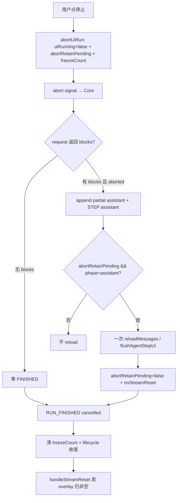

# 停止后保留可见内容（Abort Retain Partial）技术规格（SPEC）

> **PRD**：`.apm/kb/docs/Iterations/agent-chat-ux-bugfix/change/abort-retain-partial/prd.md`  
> **父级 SPEC**：[`../../spec.md`](../../spec.md)（Bug 2 冻结守卫 **保持**）  
> **Supersede（部分）**：  
> - 父 SPEC Bug 2 中「Core abort 后 skip partial append」「UI abort 后禁止一切 reload」条款  
> - 父 SPEC 对 [`abort-partial-persist`](../../../chat-workspace-agent-sync/bugs/abort-partial-persist/spec.md) 的 supersede 方向——**恢复 partial 落库 + 一次 UI reload**  
> **保持**：双信号模型、`activeRunId` 至 FINISHED、`transcriptFreezeCount` 停后禁增列表、late delta/STEP/tool_results 丢弃  
> **建议分支**：`fix/abort-retain-partial`

## 设计目标

1. **停止快照保留**：abort 时 LLM 已返回的 thinking/text/tool_use blocks **落库**为 partial assistant，UI **允许一次** reload 进列表；overlay-only 内容通过 Core partial 或 UI fallback 固化。
2. **未完成工具标失败**：无 tool_result 的工具卡展示 **「失败」**（`error` 态）；已有终态工具 **不变**。
3. **停后不新增**：abort 固化完成后，同 run 迟到 STEP / FINISHED / stream delta **仍禁止**增列表 reload（父 Bug 2 **不退化**）。
4. **双端 parity**；改动最小；不重构 lifecycle 双信号、不实现 toolRunner 中断、不写 synthetic tool_result。

## 需求来源

| 项 | 路径 |
|----|------|
| PRD | `.apm/kb/docs/Iterations/agent-chat-ux-bugfix/change/abort-retain-partial/prd.md` |
| 父迭代 | `agent-chat-ux-bugfix` PRD/SPEC |
| 历史参考 | `abort-partial-persist` PRD/SPEC（partial 落库语义） |

## 总体方案

**核心思路**：在现有 freeze 模型上增加 **「abort 一次固化」** 例外通道，与 `shouldApplyTranscriptReload` 正交。

```text
用户点停止
  → uiRunning=false（≤300ms Composer 停态；stream ingress 丢弃）
  → abortRetainPending=true + transcriptFreezeCount=freezeAt
  → 不立即 onStreamReset（defer 至固化后）
  → Core: signal.aborted && blocks.length>0 → append partial assistant + STEP(assistant)
  → UI: STEP(assistant) + abortRetainPending → 允许一次 reload
  → reload 后: abortRetainPending=false + onStreamReset
  → 后续 STEP(tool_results)/FINISHED/delta: shouldApplyTranscriptReload=false → 不增列表
  → FINISHED: 清 freezeCount + activeRunId；若未发生 retain reload 则 handleStreamReset
```



### 变更 1 — Core partial append on abort

**文件**：`packages/core/src/service/agent/impl/agent-runner.ts`

**现状**（L277–280）：`signal.aborted` → 直接 `break`，丢弃 `result.blocks`。

**目标**：

```ts
if (signal?.aborted) {
  stopReason = "cancelled";
  if (result.blocks.length > 0) {
    await session.append("assistant", { blocks: result.blocks }, { raw: result.raw });
    assistantAppendCount += 1;
    if (publishRunLifecycle) {
      bus.publish(EVENT_AGENT_STEP_COMMITTED, { sessionId, projectId, runId, phase: "assistant" });
    }
    // stepsExecuted 不计入：abort break 在 stepsExecuted += 1 之前，保持 0（与现网 T-AC2-2 / agent-runner.test.ts 一致）
  }
  break; // 禁止进入 tool 执行与 tool_results
}
```

**保持不动**：

- L406–409：abort 后 **不** append `tool_results`
- L334–337：assistant 已落库、abort 在工具前 → 不跑 `runParallel`（现有）
- step 循环开头 abort（无 partial）→ 0 append

**LLM 层**：adapter 已在 abort 时返回 partial blocks（含 thinking/text/tool_use），**无需改 adapter**。

### 变更 2 — UI「一次固化」reload 例外

**新增 lifecycle 状态**（双端 `useAgentRunLifecycle.ts`）：

| 字段 / API | 类型 | 语义 |
|------|------|------|
| `abortRetainPendingRef` | `boolean` | abort 后等待 **一次** assistant STEP reload |
| `getAbortRetainPending()` | `() => boolean` | bus 回调同步读 |
| `clearAbortRetainPending()` | `() => void` | retain reload 或 FINISHED fallback 完成后清除 |

**`AgentRunLifecycle` 类型扩展**（双端 `useAgentRunLifecycle.ts` 导出类型须同步）：

```ts
export type AgentRunLifecycle = {
  // ...既有字段...
  getAbortRetainPending(): boolean;
  clearAbortRetainPending(): void;
};
```

**修订 `abortUiRun(freezeAt?)`**：

```ts
abortUiRun(freezeAt?: number) {
  uiRunningRef.current = false;
  setRunning(false);
  abortRetainPendingRef.current = true;
  transcriptFreezeCountRef.current = freezeAt ?? null;
  // 不调用 onStreamReset — defer 至 retain reload 或 FINISHED fallback
}
```

**修订 `shouldApplyTranscriptReload`**（**Step 2 必做**：从 Desktop 导出 **下沉** 至 `packages/core/src/service/agent/logic/agent-run-lifecycle-helpers.ts`，双端 re-export）：

```ts
export function shouldApplyTranscriptReload(
  uiRunning: boolean,
  freezeCount: number | null,
  opts?: { abortRetainPending?: boolean; phase?: "assistant" | "tool_results" },
): boolean {
  if (
    opts?.abortRetainPending === true &&
    opts.phase === "assistant"
  ) {
    return true; // 一次固化例外；不受 freezeCount 约束
  }
  if (!shouldReloadTranscriptOnRunEvent(uiRunning)) return false;
  if (freezeCount != null) return false;
  return true;
}
```

**STEP(assistant) handler**（Desktop `ConversationPanel` / Mobile `useChatStreamRuntime`）：

```ts
const allow = shouldApplyTranscriptReload(uiRunning, freezeCount, {
  abortRetainPending: getAbortRetainPending(),
  phase: "assistant",
});
if (!allow) return;
// flushAgentStepUi / reload...
clearAbortRetainPending();
onStreamReset(); // 固化后清 overlay
```

**STEP(tool_results) / FINISHED / FAILED**：**不得**传 `abortRetainPending` 例外；维持 `shouldApplyTranscriptReload=false`（freeze + !uiRunning）。

**FINISHED(cancelled) fallback**（`abortRetainPending===true` 时 **defer overlay clear**）：

当 Core 无 blocks、未发 assistant STEP，`getAbortRetainPending()` 仍为 true：

1. **先**执行 UI overlay fallback commit（变更 1b；保留 `streamingText/Thinking` 直至 commit 完成）
2. **再** `clearAbortRetainPending()` + `onStreamReset()` / `handleStreamReset()`

**禁止**：`onRunFinished` 在 `abortRetainPending===true` 时 **同步** `setStreamingText('')` / `setStreamingThinking('')`（现网 ConversationPanel L237–238 须修订）。overlay 清除 **仅**在 retain reload 完成或 FINISHED fallback commit 完成之后。

**Desktop `ConversationPanel.onRunFinished` 修订时序**：

```ts
const onRunFinished = (payload) => {
  if (!finishUiRun(payload)) return;
  if (getAbortRetainPending()) {
    // defer overlay clear：先 fallback commit（若有 overlay），再 clear + reset
    void commitAbortOverlayFallbackIfNeeded().then(() => {
      clearAbortRetainPending();
      onStreamReset();
    });
  } else {
    onStreamReset();
  }
  // vfsMutated / reloadMessages 等既有逻辑保持；abort 后 shouldReload=false
};
```

**Mobile `useChatStreamRuntime`**：`RUN_FINISHED(cancelled)` 对称：若 `getAbortRetainPending()` 为 true，先 WebView `commitAbortOverlaySnapshot`，再 `clearAbortRetainPending` + stream reset。

**`UseChatStreamRuntimeParams` 扩展**（`useChatStreamRuntime.ts`）：

```ts
export type UseChatStreamRuntimeParams = {
  // ...既有字段...
  getAbortRetainPending: () => boolean;
  clearAbortRetainPending: () => void;
};
```

**`ChatTabProvider.tsx`**：从 `useAgentRunLifecycle` 取出 `getAbortRetainPending` / `clearAbortRetainPending` 传入 `useChatStreamRuntime`。

**`beginUiRun` / `resetUiForSessionChange`**：清 `abortRetainPending`（Desktop 已有清 freeze；Mobile 对齐）。

### 变更 1b — Overlay fallback（Core 无 blocks 时）

当 abort 极早、adapter 返回 `blocks=[]` 但 UI overlay 非空：

| 端 | 策略 |
|----|------|
| **Mobile WebView** | `commitAbortOverlaySnapshot({ text, thinking })`：复用 `streamCommit` promote `#stream-tail` 为 message row（**不含 tools**）；无 tail 则 skip |
| **Mobile RN legacy** | 乐观更新 `chatMessages` 或 skip（WebView 为主路径） |
| **Desktop** | **主路径**：Core partial append + `reloadMessages`（含 tool_use blocks 时工具卡由 DB reload 展示）。**Fallback**（仅极早 abort、overlay 有 text）：调 `ipcMessagesAppend` 写入 **text-only** partial assistant；**不写** thinking / tool_use IPC。**不在范围**：blocks-aware IPC、synthetic optimistic row 长期驻留 |

**边界**：

- overlay fallback **不写 tool_use**（Desktop fallback 仅 text IPC；Mobile stream tail 不含 tools）
- 工具卡 **仅**当 Core partial 含 `tool_use` blocks 并由 reload 进列表时出现
- 极早 stop（`blocks=[]` 且 overlay 空）→ 无新行（与现网一致）

**持久化**：Mobile/Desktop **优先**依赖 Core partial append；overlay fallback 为 **best-effort**。手工验收须标注：极早 stop 可能 **仅保留 overlay 文本、无工具卡、thinking 可能丢失**（Desktop fallback 限制）。

### 变更 3 — 未完成工具标「失败」

**策略**：展示层以 **Composer 停态** 判定 unpaired 工具终态，与 `agentActive` 时序 **解耦**（父 SPEC T-AC2-7 **`agentActive` 仍至 FINISHED 才 decrement** — **保持不动**）。

**`buildChatListItems` 扩展**（双端 `message-blocks.ts`）：

```ts
export interface BuildChatListItemsOptions {
  readonly agentRunning?: boolean;
  /** true 当 uiRunning=false（Composer 已停）；与 agentRunning 正交 */
  readonly runUiStopped?: boolean;
}
```

**调用方**（双端消息列表 / WebView transcript 构建）传入 `runUiStopped: !getUiRunning()`（或等价 `!uiRunning`）。

**`resolveUnpairedToolStatus` 修订**：

```ts
function resolveUnpairedToolStatus(
  assistant: ChatMessage,
  messages: readonly ChatMessage[],
  agentRunning: boolean,
  runUiStopped: boolean,
): ToolCallStatus {
  if (runUiStopped) return "error"; // Composer 已停 → 直接「失败」，不等 agentActive false
  return isTurnToolExecuting(assistant, messages, agentRunning)
    ? "pending"
    : "error"; // 原 interrupted；文案走 ToolCallCard「失败」
}
```

**`ToolCallStatus` 枚举**：保留 `interrupted` 类型别名或移除未使用分支；`ToolCallCard` / WebView `toolStatusLabel` 中 `interrupted` 分支可保留作兼容，主路径不再产出。

**与 PRD ≤500ms 对齐**：`abortUiRun` 设 `uiRunning=false` 后，列表重绘即传 `runUiStopped=true`，unpaired 工具 **立即** `error`（「失败」），**不**等待 `agentActive` 回落或 FINISHED accept。

**历史 orphan 工具**：非 executing 的 unpaired 一律 `error`（「失败」）——PRD 已接受与 abort 语义统一。

### 变更 4 — 停后 freeze 不退化

| 事件 | abort 固化后行为 |
|------|------------------|
| `STEP_COMMITTED(tool_results)` | `shouldApplyTranscriptReload` → false |
| `RUN_FINISHED(cancelled)` | lifecycle 收尾；**不** flushRunUi 增列表 |
| `STREAM_*_DELTA` | `!getUiRunning()` → 丢弃 |
| `vfsMutated` notify | **仍允许**（非列表增行） |

**禁止**：将 `freezeCount != null` 改为 `currentCount > freezeCount` 比较（父 SPEC P1-C）。

## 最终项目结构

```text
packages/core/src/
  service/agent/impl/agent-runner.ts                    # 变更 1
  service/agent/logic/agent-run-lifecycle-helpers.ts     # 可选：导出 shouldApplyTranscriptReload 签名文档

apps/desktop/renderer/
  hooks/useAgentRunLifecycle.ts                         # abortRetainPending + AgentRunLifecycle 类型扩展
  features/chat/ConversationPanel.tsx                   # STEP/FINISHED 守卫 + fallback + onRunFinished defer
  features/chat/MessageList.tsx                         # buildChatListItems 传 runUiStopped
  features/chat/message-blocks.ts                       # 变更 3

apps/mobile/src/
  hooks/useAgentRunLifecycle.ts                         # 同 Desktop + AgentRunLifecycle 类型
  screens/tabs/chat-tab/useChatStreamRuntime.ts         # STEP/FINISHED 守卫 + UseChatStreamRuntimeParams
  screens/tabs/chat-tab/ChatTabProvider.tsx             # abort 接线；传 getAbortRetainPending 等至 runtime
  components/chat/message-blocks.ts                     # 变更 3
  components/chat/ChatTranscriptWebView.tsx               # overlay fallback commit（可选 helper）

packages/core/src/
  service/agent/logic/agent-run-lifecycle-helpers.ts     # shouldApplyTranscriptReload 下沉（Step 2 必做）

packages/core/test/agent/agent-runner.test.ts           # T-ARP-C1–C4
apps/mobile/__tests__/use-chat-stream-runtime.test.ts   # T-ARP-M1–M5 + T-AC2-R 回归
apps/mobile/__tests__/use-agent-run-lifecycle.test.ts     # T-ARP-L1–L4
apps/desktop/test/use-agent-run-lifecycle.test.ts       # 镜像 T-ARP-L
apps/mobile/__tests__/message-blocks.test.ts            # T-ARP-U1–U3
apps/desktop/test/message-blocks.test.ts                # 镜像 T-ARP-U
apps/mobile/__tests__/chat-transcript-webview.test.tsx  # T-W4 修订
apps/desktop/test/conversation-panel-abort.test.ts      # T-ARP-D1–D3
```

## 变更点清单

| 文件 | 变更 |
|------|------|
| `agent-runner.ts` | L277 abort 分支：有 blocks → append + STEP → break；`stepsExecuted` 保持 0 |
| `agent-run-lifecycle-helpers.ts` | **Step 2 必做**：`shouldApplyTranscriptReload` 下沉 Core 导出（含 `abortRetainPending` opts） |
| 双端 `useAgentRunLifecycle.ts` | `abortRetainPending` ref；`getAbortRetainPending` / `clearAbortRetainPending`；`AgentRunLifecycle` 类型扩展；`abortUiRun` defer `onStreamReset`；`beginUiRun`/reset 清 flag |
| `shouldApplyTranscriptReload` | 双端 re-export Core 版；新增 `opts.abortRetainPending + phase` 例外 |
| `ConversationPanel.tsx` | STEP assistant retain reload；`onRunFinished` defer overlay clear（`abortRetainPending` 时先 fallback 再 reset）；FINISHED fallback |
| `MessageList.tsx` | `buildChatListItems(..., { agentRunning, runUiStopped: !uiRunning })` |
| `useChatStreamRuntime.ts` | 对称 STEP/FINISHED；`UseChatStreamRuntimeParams` 增 `getAbortRetainPending` / `clearAbortRetainPending`；tool_results 仍 hard false |
| `ChatTabProvider.tsx` | abort 接线；将 lifecycle abort-retain API 传入 `useChatStreamRuntime` |
| 双端 `message-blocks.ts` | `BuildChatListItemsOptions.runUiStopped`；`resolveUnpairedToolStatus` → `runUiStopped` 优先 `error` |
| `ChatTranscriptWebView.tsx` | 可选 `commitAbortOverlaySnapshot` |
| Desktop fallback | 极早 abort：`ipcMessagesAppend` text-only（无 thinking/tool_use IPC） |
| 单测 | 见测试策略 |

## 兼容性与迁移

| 项 | 说明 |
|----|------|
| 数据库 | 无 schema 变更；abort 时多写 partial assistant 行 |
| IPC | 无签名变更 |
| 重进会话 | Core partial 落库 → reload 后可见；满足 PRD |
| 父 Bug 2 | 停后 reload 闸门保持；仅多 **一次** assistant STEP 例外 |
| `interrupted` 文案 | 未配对工具统一「失败」；发布说明注明 |
| 极早 abort | 无 blocks 且无 overlay → 无新行（与现网一致）；有 overlay 时 fallback **best-effort**（Desktop 仅 text IPC） |

## 详细实现步骤

- Step 1 — phase-core-abort-retain — blocking: yes — qa: auto：Core `agent-runner.ts` abort 分支 partial append + STEP；`stepsExecuted` 保持 0；**修订** `agent-runner.test.ts` T-AC2-2 → T-ARP-C1/C2；新增含 tool_use partial 用例 T-ARP-C3/C4
- Step 2 — phase-lifecycle-abort-retain — blocking: yes — qa: auto：双端 lifecycle 增加 `abortRetainPending` + `getAbortRetainPending` / `clearAbortRetainPending` + `AgentRunLifecycle` 类型；`abortUiRun` defer `onStreamReset`；**`shouldApplyTranscriptReload` 下沉 Core**（`agent-run-lifecycle-helpers.ts`）；双端 re-export；双端 lifecycle 单测 T-ARP-L1–L4
- Step 3 — phase-desktop-abort-retain — blocking: yes — qa: auto：`ConversationPanel` STEP assistant retain reload；`onRunFinished` **defer overlay clear**（`abortRetainPending` 时先 fallback 再 reset）；`MessageList` 传 `runUiStopped`；极早 abort `ipcMessagesAppend` text-only fallback；新增 `conversation-panel-abort.test.ts` T-ARP-D1–D3
- Step 4 — phase-mobile-abort-retain — blocking: yes — qa: auto：`ChatTabProvider` 接线 abort-retain API 至 `useChatStreamRuntime`；`UseChatStreamRuntimeParams` 扩展；对称 STEP/FINISHED defer；WebView overlay fallback；**修订** T-AC2-4 为「允许一次 retain、禁止后续 flush」
- Step 5 — phase-ui-tool-failed — blocking: yes — qa: auto：双端 `message-blocks.ts` `runUiStopped` + unpaired → `error`；**修订** message-blocks 测 T-ARP-U1–U3
- Step 6 — phase-test-regression — blocking: yes — qa: auto：**保留** T-AC2-R1–R5 回归（setup 改为先完成 retain）；Desktop stream ingress 守卫测 T-ARP-D3
- Step 7 — phase-verify-full — blocking: yes — qa: auto：根目录 `npm test` 绿
- Step 8 — phase-manual-smoke — blocking: no — qa: manual_user：双端手动验收 PRD Given/When/Then + 重进会话 T-ARP-10

## 测试策略

### 分层

| 层 | 命令 |
|----|------|
| Core | `npm run test:fast -w @novel-master/core -- test/agent/agent-runner.test.ts` |
| Mobile | `npm test -w @novel-master/mobile -- __tests__/use-chat-stream-runtime.test.ts __tests__/use-agent-run-lifecycle.test.ts __tests__/message-blocks.test.ts __tests__/chat-transcript-webview.test.tsx` |
| Desktop | `npm test -w @novel-master/desktop -- test/use-agent-run-lifecycle.test.ts test/message-blocks.test.ts test/conversation-panel-abort.test.ts` |
| 全量 | `npm test` |

### 测试用例

#### Core（T-ARP-C）

| ID | Step | blocking | 描述 |
|----|------|----------|------|
| T-ARP-C1 | 1 | yes | abort + text/thinking blocks → DB 有 partial assistant；`stopReason=cancelled`；无 tool_results user 行 |
| T-ARP-C2 | 1 | yes | abort + tool_use blocks → assistant 含 tool_use；**不**跑 `runParallel`；无 tool_results |
| T-ARP-C3 | 1 | yes | abort 后无第二次 model request；`stepsExecuted===0`（partial append **不计入**，与现网 T-AC2-2 一致） |
| T-ARP-C4 | 1 | yes | abort 后无第二次 model request；abort 在 tool 执行完成后、append 前 → **仍无** tool_results（L406 保持） |

#### Lifecycle（T-ARP-L）

| ID | Step | blocking | 描述 |
|----|------|----------|------|
| T-ARP-L1 | 2 | yes | `abortUiRun` 设 `abortRetainPending=true`；**不**同步调 `onStreamReset` |
| T-ARP-L2 | 2 | yes | `shouldApplyTranscriptReload(false, freezeCount=2, { abortRetainPending:true, phase:'assistant' })===true` |
| T-ARP-L3 | 2 | yes | 同上但 `phase:'tool_results'` → false |
| T-ARP-L4 | 2 | yes | `getAbortRetainPending` / `clearAbortRetainPending`；retain reload 后 clear；`FINISHED` 清 freeze；`AgentRunLifecycle` 类型含新 API |

#### Mobile runtime（T-ARP-M）

| ID | Step | blocking | 描述 |
|----|------|----------|------|
| T-ARP-M1 | 4 | yes | abort 后 `STEP(assistant)` → **一次** `flushAgentStepUi` + stream reset |
| T-ARP-M2 | 4 | yes | retain 完成后 late `STEP(tool_results)` → 不 `onMessagesChanged`（原 T-AC2-9） |
| T-ARP-M3 | 4 | yes | retain 完成后 late delta → overlay 不增长（原 T-AC2-8） |
| T-ARP-M4 | 4 | yes | `RUN_FINISHED(cancelled)` 不额外 `flushRunUi` 增列表 |
| T-ARP-M5 | 4 | yes | 无 Core STEP 时 FINISHED：`abortRetainPending` 仍 true → **先** overlay fallback commit **再** clear + stream reset（**不**提前清 overlay） |

#### Desktop（T-ARP-D）

| ID | Step | blocking | 描述 |
|----|------|----------|------|
| T-ARP-D1 | 3 | yes | ConversationPanel：abort + STEP assistant → 一次 reload + overlay clear |
| T-ARP-D2 | 3 | yes | 镜像 T-ARP-M2/M3 守卫 |
| T-ARP-D3 | 3/6 | yes | Desktop stream ingress：`getUiRunning()===false` 后 `onTextDelta`/`onThinkingDelta` 丢弃；retain 完成前 overlay 不被 `onRunFinished` 提前清空 |

#### 展示层（T-ARP-U）

| ID | Step | blocking | 描述 |
|----|------|----------|------|
| T-ARP-U1 | 5 | yes | 2 工具：tu1 success、tu2 无 result + `runUiStopped=true` → tu1 success、tu2 **error** |
| T-ARP-U2 | 5 | yes | unpaired + `runUiStopped=true` → **error**（即使 `agentRunning=true`） |
| T-ARP-U3 | 5 | yes | `ToolCallCard` / WebView label：`error` → 「失败」 |

#### 持久化（T-ARP-P）

| ID | Step | blocking | 描述 |
|----|------|----------|------|
| T-ARP-10 | 8 | no | **重进会话**：abort retain 完成（Core partial 或 fallback）后退出并重新打开同会话 → 列表仍含保留的 assistant 正文/思考（若有）与工具卡；unpaired 工具显示「失败」；**不**出现整条消失或回退为「执行中」 |

#### 回归集（T-AC2-R，须保持 green）

| ID | 描述 |
|----|------|
| T-AC2-R1 | `shouldReloadTranscriptOnRunEvent` 正反（T-AC2-1） |
| T-AC2-R2 | retain **完成后** late STEP assistant 不二次 reload |
| T-AC2-R3 | retain **完成后** late tool_results 不 reload |
| T-AC2-R4 | `resetUiForSessionChange` 清 freeze + abortRetainPending |
| T-AC2-R5 | abort 后 `agentActive` 仍至 FINISHED 才 decrement（T-AC2-7） |

### 验收矩阵（Step ↔ 测试）

| Step | 覆盖 T |
|------|--------|
| 1 | T-ARP-C1–C4 |
| 2 | T-ARP-L1–L4 |
| 3 | T-ARP-D1–D3 |
| 4 | T-ARP-M1–M5 |
| 5 | T-ARP-U1–U3 |
| 6 | T-AC2-R1–R5 + T-ARP-D3 |
| 7 | 全量 |
| 8 | PRD 手工 + T-ARP-10 |

## 风险与回滚方案

| 风险 | 缓解 | 回滚 |
|------|------|------|
| 停后仍出 tool call | retain 例外 **仅** `phase=assistant`；tool_results 永不例外 | revert Step 1–4 |
| 双次 reload | retain 后立刻 `clearAbortRetainPending` | lifecycle flag |
| overlay 与 DB 不一致 | Core partial 优先；fallback 仅 best-effort（Desktop text-only IPC） | 文档 + 手工验 |
| 极早 abort 无工具卡 | adapter `blocks=[]` 时 fallback 不写 tool_use | PRD 风险表 + T-ARP-10 边界说明 |
| 历史 orphan 变「失败」 | PRD 已接受 | revert Step 5 |
| Desktop 无 streamCommit | Core partial + reload 为主路径 | — |

**回滚**：按 Step 1→5 逆序 revert；无 migration。

## Context Bundle

```yaml
iteration_name: abort-retain-partial
requirement_path: .apm/kb/docs/Iterations/agent-chat-ux-bugfix/change/abort-retain-partial/prd.md
spec_path: .apm/kb/docs/Iterations/agent-chat-ux-bugfix/change/abort-retain-partial/spec.md
explore_summary: |
  Core L277 恢复 abort partial append（stepsExecuted 保持 0）；UI 新增 abortRetainPending 允许一次 assistant STEP reload；
  FINISHED 时 defer overlay clear 至 fallback 完成；shouldApplyTranscriptReload 下沉 Core；
  buildChatListItems.runUiStopped 解耦 agentActive；unpaired 工具 interrupted→error（失败文案）
impact_files:
  - packages/core/src/service/agent/impl/agent-runner.ts
  - packages/core/src/service/agent/logic/agent-run-lifecycle-helpers.ts
  - apps/desktop/renderer/hooks/useAgentRunLifecycle.ts
  - apps/mobile/src/hooks/useAgentRunLifecycle.ts
  - apps/desktop/renderer/features/chat/ConversationPanel.tsx
  - apps/desktop/renderer/features/chat/MessageList.tsx
  - apps/mobile/src/screens/tabs/chat-tab/useChatStreamRuntime.ts
  - apps/mobile/src/screens/tabs/chat-tab/ChatTabProvider.tsx
  - apps/desktop/renderer/features/chat/message-blocks.ts
  - apps/mobile/src/components/chat/message-blocks.ts
constraints:
  - 不放宽 freezeCount 对 tool_results/FINISHED 的禁止
  - toolRunner 不可中断
  - 不写 synthetic tool_result
blocking_steps: [1, 2, 3, 4, 5, 6, 7]
```
