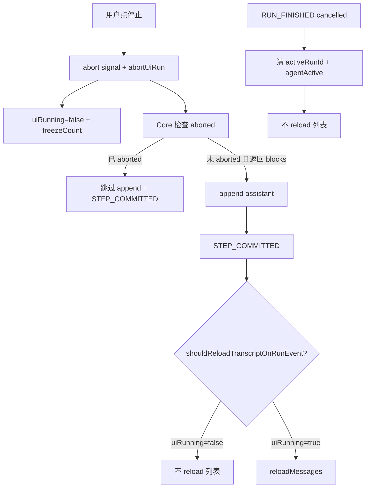

# Agent 聊天与设置 UX Bugfix 技术规格（SPEC）

> **PRD**：`.apm/kb/docs/Iterations/agent-chat-ux-bugfix/prd.md`  
> **Supersede（部分）**：
> - [`message-set-floor/spec.md`](../message-set-floor/spec.md) — 置位锚点资格由 `user|assistant` 收窄为 **仅 user**（T-SF10、T-SF4b 等 assistant 正向用例失效）
> - [`abort-partial-persist/spec.md`](../chat-workspace-agent-sync/bugs/abort-partial-persist/spec.md) — **用户可见** reload 语义：abort 后 transcript **不增长**；Core append 在 abort 后 **跳过**（修订 T2 / partial 落库测）
> **保持**：[`agent-run-lifecycle-unify/spec.md`](../chat-workspace-agent-sync/bugs/agent-run-lifecycle-unify/spec.md) 双信号、`activeRunId` 保留至 FINISHED、refcount 时序  
> **建议分支**：`fix/agent-chat-ux-bugfix`

## 设计目标

1. **Bug 1**：置位锚点 **仅 `user`**；三处 UI 菜单 + Core `isSetFloorAnchorRole` 一致；assistant/system 拒绝。
2. **Bug 2**：用户点停止后 **同 run 聊天列表可见条目数不增加**（停 = 真停）；Composer ≤300ms 停态保持；`agentActive` / lifecycle 收尾语义不变。
3. **Bug 3**：Mobile 单条删除确认展示 **显示名**（`definition.name`），对齐 Desktop `删除 Agent「{name}」？`。
4. **双端 parity**；改动最小；不重构 lifecycle 双信号、不实现 toolRunner 执行期可中断。

## 需求来源

| 项 | 路径 |
|----|------|
| PRD | `.apm/kb/docs/Iterations/agent-chat-ux-bugfix/prd.md` |
| 前置 | `message-set-floor`、`agent-run-lifecycle-unify`、`mobile-agent-nav-refactor` PRD |

## 总体方案

三个 bug 独立切片，建议 **M1 Core 置位 → M2 UI 置位+测 → M3 Core/UI 停止冻结 → M4 Mobile 删除文案+测**。可单 PR 交付，每步 `npm test` 绿。

### Bug 1 — 置位仅 user

```text
isSetFloorEligibleMessage / buildMenuItems.showSetFloor
  role === 'user'（非 tool-card 区域）

isSetFloorAnchorRole(role)
  role === 'user'

setMessageFloorAtMessage
  assistant / system → chatInvalidArgument（文案仅允许 user）
```

**不变**：`computeSetFloorRanges`、hide/show 区间、Agent 运行中门禁、应用层 capture + reload、`user_vfs_turn` / tool-card 排除。

### Bug 2 — 停止后 transcript 冻结（Core + UI 双保险）

**根因**：abort 后 `activeRunId` 仍 accept 同 run 的 `STEP_COMMITTED` / `RUN_FINISHED` → `reloadMessages`；Core 在 abort 竞态窗口仍 append assistant 并发 STEP。

**策略（方案 C）**：

| 层级 | 手段 |
|------|------|
| **Core** | `modelRequests.request` 返回后、**append assistant 前**检查 `signal.aborted`；已 aborted 则 **不 append、不 publish STEP_COMMITTED(assistant)**。`runParallel` 后 append tool_results 前已有 abort 检查，保持。 |
| **UI 共享 helper** | 新增 `shouldReloadTranscriptOnRunEvent(uiRunning: boolean): boolean` → 仅 `uiRunning === true` 时允许 STEP/FINISHED 触发 **增列表** 的 reload；自 `packages/core/src/public/agent.ts` 导出供双端 import。 |
| **UI 快照（双保险）** | `abortUiRun(freezeAtMessageCount?: number)` 在 abort 瞬间快照 `transcriptFreezeCount`；**`transcriptFreezeCount != null` 时禁止一切增列表 reload**（不仅 `currentCount > freezeCount`；防 Core 竞态漏网）。abort 时设置；`RUN_FINISHED` / `RUN_FAILED` accept 后 **或** `resetUiForSessionChange` 清空。 |
| **调用方层守卫（写死）** | **采用 ConversationPanel / `useChatStreamRuntime` 层守卫**；**不改** Desktop `flush-run-ui.ts` 签名。Mobile 保留既有 `prevCount` 形参，守卫在 runtime 于调用 `flushRunUi` / `flushAgentStepUi` / 直调 `onMessagesChanged` **之前** 统一判定。 |
| **uiRunning 同步读（写死）** | 所有 transcript reload / stream ingress 守卫 **必须** 读 `uiRunningRef.current`（或 lifecycle 暴露 `getUiRunning(): boolean`）；**禁止** 仅读 React `running` state（bus 回调可能早于 re-render，state 仍为 `true`）。 |
| **FINISHED 收尾** | `RUN_FINISHED(cancelled)` 仍 accept 以清 `activeRunId` / decrement `agentActive`；accept 后清空 `transcriptFreezeCount`；`!getUiRunning()` 时 **仅** 清 stream overlay / vfs，**不** `reloadMessages`。 |
| **Stream ingress** | `useAgentStream`（Desktop）与 `useChatStreamRuntime`（Mobile）的 text/thinking delta 入口：在 `!getUiRunning()` 时 **丢弃**（不更新 overlay、不写 metrics），与 abort 后 `onStreamReset` 一致。Desktop ingress 守卫在 `ConversationPanel` 提供的 callback 内，**非** `useAgentStream` hook 内部。 |
| **VFS** | `STEP_COMMITTED.vfsMutated` → `notifyWorkspaceMutated` **可保留**（非聊天列表增行）。 |



**与 abort-partial-persist 关系**：Core **不再**在 abort 后 append partial assistant（修订 `agent-runner.test.ts` 对应用例）；UI **不再**在 abort 后 flush 增列表。DB 中 abort 前已落库行保留；停止瞬间之后无新增可见行。

#### Desktop reload 守卫矩阵（Step 5，写死：ConversationPanel 层）

> **uiRunning 同步读（P1-A）**：下表及 stream ingress 守卫入口 **首行** 须 `const uiRunning = getUiRunning()`（或 `uiRunningRef.current`），**禁止** 直接读 React `running` state。

守卫函数（伪码，双端 runtime 同构）：

```ts
function shouldApplyTranscriptReload(
  uiRunning: boolean,
  freezeCount: number | null,
): boolean {
  if (!shouldReloadTranscriptOnRunEvent(uiRunning)) return false;
  // P1-C：freezeCount 非 null 即禁止一切增列表 reload（不仅 currentCount > freezeCount）
  if (freezeCount != null) return false;
  return true;
}
```

| 回调 | 触发时机 | `reloadMessages` | stream overlay | `vfsMutated` notify | lifecycle |
|------|----------|------------------|----------------|---------------------|-----------|
| `onStepCommitted` | `assistant` / `tool_results` STEP | **仅** `shouldApplyTranscriptReload===true` 时经 `flushAgentStepUi` reload；否则跳过 reload | `assistant` phase 且已 reload 时 `onStreamReset`；abort 后跳过 reload 时 overlay 已由 `abortUiRun` 清 | **始终**（与 reload 无关） | — |
| `onRunFinished` | `RUN_FINISHED`（含 cancelled） | **仅** `shouldApplyTranscriptReload===true`；abort 后 `getUiRunning()===false` → **跳过** | **始终** `setStreamingText/Thinking('')` | payload / run 内 vfs 标记 | `finishUiRun` **必须**执行（清 `activeRunId`）；accept 后 **清空** `transcriptFreezeCount` |
| `onRunFailed` | `RUN_FAILED` | 同 `onRunFinished` | 同左 + `setComposerError` / Toast | 同左 | `failUiRun` **必须**执行；accept 后 **清空** `transcriptFreezeCount` |

> **签名决策（P1-1 闭合）**：Desktop **不改** `flush-run-ui.ts`；上表守卫全部在 `ConversationPanel` 回调内、调用 `flushAgentStepUi` / `reloadMessages` **之前** 判定。Mobile 对称逻辑集中在 `useChatStreamRuntime`（含 `tool_results` 直调 `onMessagesChanged` 分支）。

#### freezeCount 接线（Step 5/6）

lifecycle 除 `getUiRunning(): boolean` 外，暴露 `getTranscriptFreezeCount(): number | null`（或扩展 `lifecycleRef` 同字段）；守卫与 `getMessageCount` 并列读取。

| 端 | abort 快照来源 | 传递路径 |
|----|--------------|----------|
| Desktop | `messages.length` | `ConversationPanel` 向 `ChatComposer` 传 `abortUiRun={() => abortUiRun(messages.length)}`（或等效包装）；lifecycle 存 `transcriptFreezeCount`；三回调 / stream ingress 经 `getUiRunning()` + `getTranscriptFreezeCount()` 守卫 |
| Mobile | `chatMessageCountRef.current` | `ChatTabProvider` 维护 ref（`handleMessagesChanged` / `useEffect` 同步）；包装 `abortUiRun(() => abortUiRun(chatMessageCountRef.current))` 传给 `ChatComposer`；`useChatStreamRuntime` 经 `getMessageCount` + **`getTranscriptFreezeCount()`** 守卫（P1-B） |
| 双端 | freeze 清空 | abort 时设置 `transcriptFreezeCount`；`RUN_FINISHED` / `RUN_FAILED` accept 后 **或** `resetUiForSessionChange` **必须** 置 `null` |

#### Mobile `tool_results` 与 stream ingress（Step 6）

> **uiRunning 同步读（P1-A）**：handler 首行须 `const uiRunning = getUiRunning()`，**禁止** 读 React `running` state。

`useChatStreamRuntime` 内 `EVENT_AGENT_STEP_COMMITTED`  handler：

```ts
const uiRunning = getUiRunning();
const freezeCount = getTranscriptFreezeCount();
if (payload.phase === 'tool_results') {
  if (!shouldApplyTranscriptReload(uiRunning, freezeCount)) return;
  void onMessagesChanged({ immediate: true });
  return;
}
```

`EVENT_AGENT_STREAM_TEXT_DELTA` / `THINKING_DELTA`：在 `acceptRunEvent` 之后增加 `if (!getUiRunning()) return;`，abort 后迟到 delta **不** 进入 `handleIngressText/Thinking`（T-AC2-8）。

#### Desktop stream ingress（Step 5）

> **uiRunning 同步读（P1-A）**：callback 首行须 `const uiRunning = getUiRunning()`，**禁止** 读 React `running` state。

`useAgentStream` 的 `onTextDelta` / `onThinkingDelta` 由 `ConversationPanel` 提供；在 **ConversationPanel callback 入口**（非 `useAgentStream` hook 内部）增加 `if (!getUiRunning()) return;`，与 Mobile `useChatStreamRuntime` 对称（T-AC2-8）。


### Bug 3 — 删除确认 name

Mobile 两处 Alert 复用列表/编辑器已有 name 解析：

| 文件 | 改法 |
|------|------|
| `AgentList.tsx` | `handleDelete` 内 `rows.find(r => r.id === agentId)?.name ?? agentId` |
| `AgentEditorForm.tsx` | invalid 分支 load 时存 `displayName`（`agentDisplayNameFromWire`），删除确认用该字段 |

文案：`删除 Agent「${displayName}」？`（与 Desktop 一致）。Desktop 列表 **不改**；失效编辑器无确认 **不在范围**。

## 最终项目结构

变更限于下列路径（**无**新目录、无 migration）：

```text
packages/core/src/
  domain/chat/logic/message-set-floor-range.ts          # Bug1
  service/chat/impl/message-transcript-effects.service.ts # Bug1 错误文案
  service/agent/logic/agent-run-lifecycle-helpers.ts     # Bug2 新增 helper
  public/agent.ts                                       # Bug2 导出 shouldReloadTranscriptOnRunEvent
  service/agent/impl/agent-runner.ts                    # Bug2 abort 守卫前移

apps/desktop/renderer/
  features/chat/message-edit.ts                         # Bug1
  hooks/useAgentRunLifecycle.ts                         # Bug2 freezeCount
  hooks/useAgentStream.ts                               # Bug2 不改（ingress 守卫在 ConversationPanel callback）
  features/chat/ConversationPanel.tsx                   # Bug2 freezeCount + 三回调/stream ingress 守卫
  features/chat/flush-run-ui.ts                         # Bug2 不改签名（守卫在 ConversationPanel）

apps/mobile/src/
  components/chat/message-edit.ts                       # Bug1
  web/chat-transcript/main.ts                           # Bug1 buildMenuItems
  hooks/useAgentRunLifecycle.ts                         # Bug2
  screens/tabs/chat-tab/useChatStreamRuntime.ts         # Bug2
  screens/tabs/chat-tab/ChatTabProvider.tsx               # Bug2 传 messageCount
  components/chat/flush-run-ui.ts                       # Bug2
  components/chat/ChatComposer.tsx                      # Bug2 freezeCount
  components/agent/AgentList.tsx                          # Bug3
  components/agent/AgentEditorForm.tsx                  # Bug3

packages/core/test/chat/                                # Bug1
packages/core/test/agent/agent-runner.test.ts           # Bug2
apps/mobile/__tests__/                                  # Bug1–3
apps/desktop/test/                                      # Bug1–2 + Bug3 防回归
```

## 变更点清单

### Bug 1

| 文件 | 变更 |
|------|------|
| `message-set-floor-range.ts` | `isSetFloorAnchorRole` → 仅 `'user'`；返回类型 `'user'` |
| `message-transcript-effects.service.ts` | 错误文案 `set-floor anchor role must be user, got: …` |
| Desktop/Mobile `message-edit.ts` | `isSetFloorEligibleMessage` → `role === 'user'` |
| `web/chat-transcript/main.ts` | `showSetFloor` 去掉 `assistant` 分支 |
| 单测 | 见测试策略 |

### Bug 2

| 文件 | 变更 |
|------|------|
| `agent-run-lifecycle-helpers.ts` | 新增 `shouldReloadTranscriptOnRunEvent(uiRunning: boolean): boolean` |
| `public/agent.ts` | 自 `agent-run-lifecycle-helpers` **re-export** `shouldReloadTranscriptOnRunEvent`（与 `shouldAcceptRunEvent` 同级） |
| `agent-runner.ts` | request 返回后、append 前：`if (signal?.aborted) { stopReason='cancelled'; break; }` |
| 双端 `useAgentRunLifecycle.ts` | `transcriptFreezeCount: number \| null`；`abortUiRun(freezeAt?: number)` 设 freeze；`getUiRunning(): boolean` + `getTranscriptFreezeCount(): number \| null`；`RUN_FINISHED` / `RUN_FAILED` accept 后 **或** `resetUiForSessionChange` 清空 `transcriptFreezeCount` |
| 双端 `ChatComposer.tsx` | 停止时传入 freeze 快照：Desktop 由 `ConversationPanel` 包装 `abortUiRun(() => messages.length)`；Mobile 由 `ChatTabProvider` 包装并读 `chatMessageCountRef.current`（**或** Composer 新增 `getMessageCount` prop，二选一与父级接线一致即可） |
| `useChatStreamRuntime.ts` | STEP_COMMITTED / FINISHED / FAILED：经 `getUiRunning()` + `getTranscriptFreezeCount()` 守卫；text/thinking ingress 在 `!getUiRunning()` 丢弃 |
| `ConversationPanel.tsx` | `onStepCommitted` / `onRunFinished` / `onRunFailed` reload 守卫（**不改** `flush-run-ui.ts` 签名）；`onTextDelta` / `onThinkingDelta` callback 入口 `!getUiRunning()` 丢弃（**非** `useAgentStream` 内改） |
| `ChatTabProvider.tsx` | 向 `useChatStreamRuntime` 传 `getMessageCount` + `getTranscriptFreezeCount`（或 `lifecycleRef`）；包装 `abortUiRun` 传 freezeCount |
| `flush-run-ui.ts`（Mobile） | **签名不变**；`prevCount` 由 `useChatStreamRuntime` 在守卫通过后传入 |

### Bug 3

| 文件 | 变更 |
|------|------|
| `AgentList.tsx` | 确认文案用 `displayName` |
| `AgentEditorForm.tsx` | 新增 state `displayName`（invalid 分支 `loadAgent` 时由 `agentDisplayNameFromWire` 写入）；`handleDeleteBrokenAgent` 确认文案用 `displayName ?? agentId` |

## 兼容性与迁移

| 项 | 说明 |
|----|------|
| 数据库 | 无 schema 变更 |
| IPC | 无签名变更 |
| 置位 API | assistant 锚点由成功变为 **拒绝**；CLI/绕过 UI 调用需处理错误 |
| abort partial | supersede：abort 后不再 append / 不再 UI 增列表；重进会话若 DB 有 abort 前已落库行，行为与「停止瞬间快照」一致 |
| hidden assistant 置位 | 入口移除（PRD 已接受） |

## 详细实现步骤

- Step 1 — phase-core-set-floor-user — blocking: yes — qa: auto：Core `isSetFloorAnchorRole` 仅 user + 服务错误文案；跑 `message-set-floor-range.test.ts` / `message-transcript-effects.test.ts` 更新
- Step 2 — phase-ui-set-floor-user — blocking: yes — qa: auto：Desktop/Mobile `message-edit.ts` + WebView `main.ts` 菜单资格收窄；同步 `chat-transcript-set-floor-menu.test.ts` 镜像逻辑
- Step 3 — phase-test-set-floor — blocking: yes — qa: auto：更新 Mobile `message-action-items.test.ts`、Desktop `messages-set-floor-handler.test.ts`（**T-SF18 锚点改 user**：幂等第二次置位对 **user** message seq 调用，不再用 assistant 锚点）；修订 Core `message-transcript-effects.test.ts` **T-SF7** 断言为 `set-floor anchor role must be user`；新增 Desktop `message-action-items.test.ts`（可选但推荐）
- Step 4 — phase-core-abort-guard — blocking: yes — qa: auto：`agent-run-lifecycle-helpers` 新增 `shouldReloadTranscriptOnRunEvent` 并 **export 至 `public/agent.ts`**；`agent-runner.ts` append 前 abort 检查；**必改测**：`agent-runner.test.ts` 原「abort 后 request 返回仍落库 assistant partial」改为断言 **不 append**；`agent-run-lifecycle-helpers.test.ts` 覆盖 `shouldReloadTranscriptOnRunEvent`
- Step 5 — phase-desktop-abort-freeze — blocking: yes — qa: auto：**守卫须读同步 uiRunning**：lifecycle 暴露 `getUiRunning()` + `getTranscriptFreezeCount()`；`transcriptFreezeCount` + `abortUiRun(freezeAt?)`；`ConversationPanel` 包装 `abortUiRun` 传 `() => messages.length`；三回调 / stream ingress callback 首行 `getUiRunning()`（**禁止** 读 React `running` state）；`freezeCount != null` 禁止一切增列表 reload；`RUN_FINISHED`/`FAILED` accept 后清 freeze；**不改** `flush-run-ui.ts` 签名；**不改** `useAgentStream.ts`
- Step 6 — phase-mobile-abort-freeze — blocking: yes — qa: auto：**守卫须读同步 uiRunning**：`ChatTabProvider` 传 `getMessageCount` + `getTranscriptFreezeCount` + 包装 `abortUiRun`；`useChatStreamRuntime` **含 `tool_results` 直调 reload 分支** 经 `getUiRunning()` + `getTranscriptFreezeCount()` 守卫（`freezeCount != null` 禁止增列表 reload）；text/thinking ingress `!getUiRunning()` 丢弃；`RUN_FINISHED`/`FAILED` accept 后清 freeze
- Step 7 — phase-test-abort-freeze — blocking: yes — qa: auto：**必改测**：`use-chat-stream-runtime.test.ts`（含 `tool_results` phase、abort 后 late delta）、`use-agent-run-lifecycle.test.ts`（freezeCount + `resetUiForSessionChange` 清 freeze）；Desktop 镜像 lifecycle/stream 测；修订 `flush-run-ui.test.ts` 断言 abort 后无增列表 reload
- Step 8 — phase-mobile-agent-delete-name — blocking: yes — qa: auto：`AgentList` + `AgentEditorForm` 确认文案
- Step 9 — phase-test-agent-delete — blocking: yes — qa: auto：新增 Mobile 删除文案测 + Desktop settings 防回归测
- Step 10 — phase-verify-full — blocking: yes — qa: auto：根目录 `npm test` 绿
- Step 11 — phase-manual-smoke — blocking: no — qa: manual_user：双端手动验收三 bug（置位 assistant 无入口；运行中停止列表不增；Mobile 删除见 name）

## 测试策略

### 分层

| 层 | Bug | 命令 |
|----|-----|------|
| Core | 1, 2 | `npm run test:fast -w @novel-master/core -- test/chat/message-set-floor-range.test.ts test/chat/message-transcript-effects.test.ts test/agent/agent-runner.test.ts test/service/agent/agent-run-lifecycle-helpers.test.ts` |
| Mobile | 1–3 | `npm test -w @novel-master/mobile -- __tests__/message-action-items.test.ts __tests__/chat-transcript-set-floor-menu.test.ts __tests__/use-chat-stream-runtime.test.ts __tests__/use-agent-run-lifecycle.test.ts` + 新增 agent 测 |
| Desktop | 1–2, 3 回归 | `npm test -w @novel-master/desktop -- test/messages-set-floor-handler.test.ts test/use-agent-run-lifecycle.test.ts` + 新增 stream 守卫测 |
| 全量 | 全部 | `npm test` |

### 必改测试 checklist（Step 4 / 7，blocking）

| 文件 | Step | 变更要点 |
|------|------|----------|
| `packages/core/test/agent/agent-runner.test.ts` | 4 | 「abort 后 request 返回文本块仍落库 assistant partial」→ 断言 **msgs.length 仍为 1**（仅 user） |
| `packages/core/test/service/agent/agent-run-lifecycle-helpers.test.ts` | 4 | 新增 `shouldReloadTranscriptOnRunEvent` 正反用例 |
| `packages/core/test/chat/message-transcript-effects.test.ts` | 1/3 | **T-SF7** 断言 `/set-floor anchor role must be user/` |
| `apps/desktop/test/messages-set-floor-handler.test.ts` | 3 | **T-SF18** 幂等锚点由 assistant 改为 **user** message |
| `apps/mobile/__tests__/use-chat-stream-runtime.test.ts` | 7 | abort 后 `STEP_COMMITTED(assistant)`、`STEP_COMMITTED(tool_results)`、`RUN_FINISHED(cancelled)` 不增列表；late text/thinking delta 不测（或 mock ingress） |
| `apps/mobile/__tests__/use-agent-run-lifecycle.test.ts` | 7 | `abortUiRun(n)` 设 freeze；`RUN_FINISHED` / `RUN_FAILED` accept 后 **或** `resetUiForSessionChange` 清 freeze |
| `apps/desktop/test/use-agent-run-lifecycle.test.ts` | 7 | 镜像 Mobile lifecycle freeze 测（**新增**若不存在） |
| `apps/mobile/__tests__/flush-run-ui.test.ts` | 7 | 确认守卫在 runtime 层后，abort 场景不触发「无条件 reload」回归 |
| `apps/desktop/test/flush-run-ui.test.ts` | 7 | 同上（Desktop flush 本身仍 always reload，守卫在 ConversationPanel） |

### 测试用例

#### Bug 1 — 置位（T-AC1）

| ID | Step | blocking | 描述 |
|----|------|----------|------|
| T-AC1-1 | 1 | yes | `isSetFloorAnchorRole('user')===true`；`'assistant'/'system'===false` |
| T-AC1-2 | 1 | yes | `setMessageFloorAtMessage` assistant 锚点抛错，transcript 不变 |
| T-AC1-3 | 2 | yes | Mobile `buildMessageActionItems`：user 含 `set-floor`；assistant 不含 |
| T-AC1-4 | 2 | yes | WebView mirror：assistant message 行不含 set-floor |
| T-AC1-5 | 3 | yes | Desktop IPC **T-SF18**：幂等第二次置位锚点改为 **user** message（非 assistant）；仍断言零变更 counts + Toast「上下文已是最新状态」 |
| T-AC1-6 | 2 | yes | hidden user 仍含置位；Agent 运行中拦截（既有测保留） |
| T-AC1-7 | 1/3 | yes | Core **T-SF7**：`role=system` 抛错，断言 `/set-floor anchor role must be user/`（替换原 `/user or assistant/`） |

#### Bug 2 — 停止冻结（T-AC2）

| ID | Step | blocking | 描述 |
|----|------|----------|------|
| T-AC2-1 | 4 | yes | `shouldReloadTranscriptOnRunEvent(false)===false`；`true===true` |
| T-AC2-2 | 4 | yes | Core：abort 后 request 返回 blocks → **不** append assistant（原 partial 正向用例 **修订为反向**） |
| T-AC2-3 | 7 | yes | Mobile：`abortUiRun` 后 late `STEP_COMMITTED(assistant)` 不调用增列表 reload |
| T-AC2-4 | 7 | yes | Mobile：`RUN_FINISHED(cancelled)` 清 lifecycle 但不增 `messages.length` |
| T-AC2-5 | 5 | yes | Desktop：`useAgentRunLifecycle` freezeCount + STEP 守卫（镜像 T-AC2-3/4） |
| T-AC2-6 | 4–7 | yes | abort 后 `uiRunning` ≤300ms false（lifecycle-unify T8 不退化） |
| T-AC2-7 | 4–7 | yes | abort 后 `agentActive` 仍至 FINISHED 才 decrement（T14 不退化） |
| T-AC2-8 | 6–7 | yes | abort 后迟到 `STREAM_TEXT_DELTA` / `THINKING_DELTA`：`streamingText/Thinking` **不**再增长（overlay 冻结） |
| T-AC2-9 | 6–7 | yes | Mobile：`abortUiRun` 后 late `STEP_COMMITTED(tool_results)` 不调用 `onMessagesChanged({ immediate: true })` |
| T-AC2-10 | 7 | yes | `resetUiForSessionChange` 清空 `transcriptFreezeCount`；`RUN_FINISHED` / `RUN_FAILED` accept 后亦清空；切换 session 后下一步 STEP 可正常 reload |

#### Bug 3 — 删除 name（T-AC3）

| ID | Step | blocking | 描述 |
|----|------|----------|------|
| T-AC3-1 | 9 | yes | Mobile `AgentList`：Alert 文案含 `definition.name`，非裸 id |
| T-AC3-2 | 9 | yes | Mobile `AgentEditorForm` 失效删除：同上 |
| T-AC3-3 | 9 | yes | name 空 / wire 损坏 → 回退 `agentId` |
| T-AC3-4 | 9 | yes | Desktop 单条删除确认仍为 `删除 Agent「{name}」？`（防回归） |

### 验收矩阵（Step ↔ 测试）

| Step | 覆盖 T |
|------|--------|
| 1 | T-AC1-1, T-AC1-2, T-AC1-7 |
| 2–3 | T-AC1-3–6 |
| 4 | T-AC2-1, T-AC2-2 |
| 5–7 | T-AC2-3–10 |
| 8–9 | T-AC3-1–4 |
| 10 | 全量 |
| 11 | PRD Given/When/Then 手工 |

## 风险与回滚方案

| 风险 | 缓解 | 回滚 |
|------|------|------|
| abort-partial-persist 行为变更 | SPEC 已 supersede；双保险 Core+UI | revert agent-runner + lifecycle 改动 |
| WebView 镜像测试漂移 | 改 `main.ts` 必同步 `chat-transcript-set-floor-menu.test.ts` | — |
| freezeCount 与 truncate/rollback 交互 | `freezeCount != null` 禁止一切增列表 reload；abort 设、FINISHED/FAILED accept 或 session reset 清 | reset lifecycle on session change |
| 重进会话见 abort 前已落库行 | 与「停止瞬间快照」一致；非停止后新增 | 可选 follow-up：Core 禁止任何 abort 后 append |
| assistant 置位场景丢失 | PRD 已记录；hidden assistant 恢复需 user 锚点间接 | revert Bug1 三处 + Core |
| Mobile 无 Agent 删除单测 | Step 9 新增 | — |

**回滚**：按 M1→M4 逆序 revert 各 step 提交；无 DB migration，回滚无数据风险。

## Context Bundle

```yaml
iteration_name: agent-chat-ux-bugfix
requirement_path: .apm/kb/docs/Iterations/agent-chat-ux-bugfix/prd.md
spec_path: .apm/kb/docs/Iterations/agent-chat-ux-bugfix/spec.md
explore_summary: |
  Bug1: 三处 UI + Core 双角色 → 收窄 user only
  Bug2: abort 后 STEP_COMMITTED reload + Core late append → Core 守卫 + uiRunning/freezeCount 双保险
  Bug3: Mobile Alert 硬编码 agentId → 复用 row.name / wire 解析
impact_files:
  - packages/core/src/domain/chat/logic/message-set-floor-range.ts
  - packages/core/src/service/agent/impl/agent-runner.ts
  - packages/core/src/service/agent/logic/agent-run-lifecycle-helpers.ts
  - packages/core/src/public/agent.ts
  - apps/desktop/renderer/features/chat/message-edit.ts
  - apps/desktop/renderer/hooks/useAgentRunLifecycle.ts
  - apps/desktop/renderer/hooks/useAgentStream.ts
  - apps/desktop/renderer/features/chat/ConversationPanel.tsx
  - apps/mobile/src/components/chat/message-edit.ts
  - apps/mobile/src/web/chat-transcript/main.ts
  - apps/mobile/src/hooks/useAgentRunLifecycle.ts
  - apps/mobile/src/screens/tabs/chat-tab/useChatStreamRuntime.ts
  - apps/mobile/src/screens/tabs/chat-tab/ChatTabProvider.tsx
  - apps/mobile/src/components/agent/AgentList.tsx
  - apps/mobile/src/components/agent/AgentEditorForm.tsx
constraints:
  - 不重构 lifecycle 双信号
  - toolRunner.runParallel 不可中断（PRD 排除）
  - Desktop 失效编辑器删除无确认不在范围
blocking_steps: [1, 2, 3, 4, 5, 6, 7, 8, 9, 10]
```
