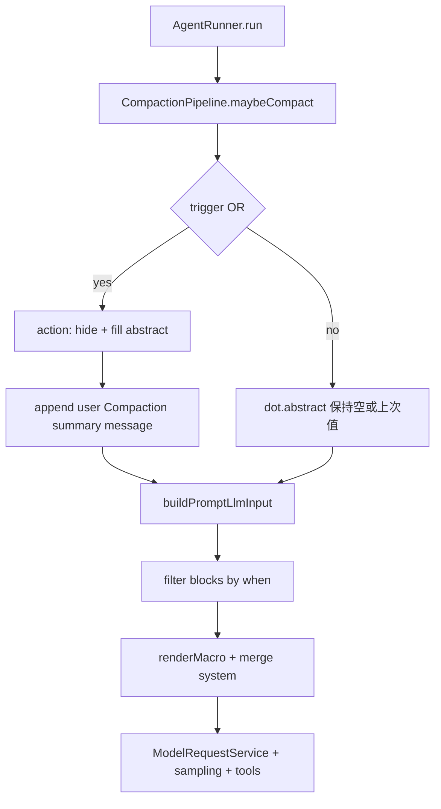

# Agent 配置化与压缩策略抽象 技术规格（SPEC）

## 设计目标

- **AgentDefinition**：可序列化配置（prompts、compact、model、runtime）；**Core 以对象为准**（`agentDefinitionFromJson` 为真相源）；**格式层**（YAML/JSON string）经 `agent-definition-io` 模块，**不**把「读磁盘路径」放进 Core。
- **压缩**：`trigger`（何时，扁平多键 OR）+ `action`（做什么：hide + 产出 `abstract`）；摘要**进入 prompt 管线**（`dot.abstract` + 条件块），不再拆 `agentSummary` / `prompt` 两套 executor。
- **Prompt 块 `when`**：声明式条件（如 `present: abstract`），避免在宏里使用 `if`（现 macro-scan 禁止 `if/range`）。
- **模型采样参数**按 protocol 传入 adapter。
- CLI：`--agent-config`；`--prompt-path` 仅测试捷径。

## 总体方案

### 现状（main，agent-system 已合并）

| 模块 | 现状 | 本 SPEC |
|------|------|---------|
| `DefaultCompactionService` | config 阈值 + hide + LLM 摘要 → `[Compaction summary]` user 消息 | **删除** → `CompactionPipeline` |
| `PromptBlock` | `text` \| `chat`，无 `when` | 扩展可选 **`when`** |
| `PromptRenderContext.dot` | 仅 `worktree` | 增加 **`abstract`**（字符串，默认 `""`） |
| `buildPromptLlmInput` | 所有 system text 块合并；无 condition | **先过滤 when → 再 renderMacro** |
| `renderMacro` | `dot` 缺字段抛 `UNKNOWN_FIELD` | `abstract` 等可选字段：**缺失视为 `""`**（见下） |
| `AgentRunOptions` | 散落 modelId、promptBlocks | **`definition: AgentDefinition`** |
| `parsePromptYaml` | 在 `infra/prompt-yaml/`，仅解析 prompts 数组 | **废弃**；由 `deserializeAgentDefinition` 替代；`--prompt-path` 可用 `loadPromptBlocksFromYaml` 薄封装 |

### 架构与每轮顺序



**边界（定稿）**：

| 层 | 职责 |
|----|------|
| **compact.action** | 改 session（hide）+ 产生 **`abstract` 字符串** |
| **session** | 可选 **双写** 一条 user 消息（可观测、与现 agent-system 一致） |
| **dot.abstract** | 供 **prompt 块** `{{.abstract}}` 与 **`when: present: abstract`** |
| **prompts** | 不生成摘要；只消费 `abstract` |

### AgentDefinition

```ts
interface AgentDefinition {
  readonly schemaVersion: 1;
  readonly name: string;
  readonly prompts: readonly PromptBlock[];
  readonly model: AgentModelConfig;
  readonly compact?: CompactConfig;
  readonly runtime?: { readonly maxSteps?: number };
}

interface AgentModelConfig {
  readonly applicationModelId: string;
  readonly params?: ModelSamplingParams; // protocol 判别 union，见下
}
```

公开 API：

| API | 职责 |
|-----|------|
| `agentDefinitionFromJson` / `agentDefinitionToJson` | 格式无关：校验 + 类型（**真相源**） |
| `deserializeAgentDefinition(source, { format?: 'yaml' \| 'json' })` | string → `AgentDefinition` |
| `serializeAgentDefinition(def, { format?: 'yaml' \| 'json' })` | `AgentDefinition` → string |
| `validateAgentDefinition` | 含 model protocol 与 sampling 一致性 |

Zod 在 `agent-definition.schema.ts`；**`yaml` 依赖仅允许出现在 `infra/agent-definition-io/`**（或同级 `agent-definition-io.ts`），禁止散落其它模块。

### CompactConfig

#### Trigger（扁平，OR）

```yaml
compact:
  trigger:
    tokenThreshold: 12000   # 可选；正整数
    floorThreshold: 20      # 可选；可见消息条数上限（不含 hidden）
```

```ts
interface CompactionTriggerConfig {
  readonly tokenThreshold?: number;
  readonly floorThreshold?: number;
}
```

- 至少一个键；`trigger: {}` → 校验失败；未知键 → Zod `.strict()` 失败。
- **OR**：任一条件满足 → 执行 `action`。
- `tokenThreshold`：`estimateTokens(visible) > N`（`token-estimate.ts`，字符/4）。
- `floorThreshold`：`visible.length > N`。

实现：`composite-trigger.ts` + `token-threshold.trigger.ts` + `floor-threshold.trigger.ts`。

#### Action（替代原 executor）

```yaml
compact:
  action:
    keepLastN: 6
    abstract:
      type: agent    # 或 text
```

```ts
interface CompactionActionConfig {
  readonly keepLastN: number;
  readonly abstract: CompactionAbstractConfig;
}

type CompactionAbstractConfig =
  | { readonly type: "text"; readonly content: string }
  | { readonly type: "agent"; readonly instruction?: string };
```

**`action` 执行步骤（定稿）**：

1. 取可见消息 `visible = session.list()`。
2. 若 `visible.length <= keepLastN` → **仅**更新 `dot.abstract = ""`（或跳过 hide），**不**调 LLM；仍可不 append summary（`when` 挡掉 abstract 块）。
3. 否则 `toHide = visible.slice(0, -keepLastN)`，`hideRange(fromSeq, toSeq)`。
4. 根据 `abstract.type` 生成 `abstractText`：
   - **`text`**：`abstractText = renderMacro(content, { dot, root })`（**不含** `dot.abstract`，避免递归）。
   - **`agent`**：对 `toHide` 拼 `role: body`，`modelRequests.request(definition.model, instruction + 正文, { stream: false, tools: undefined, sampling })`；**禁止 tools**；模型与 sampling **继承 `definition.model`**；可选 `instruction` 默认：`Summarize the following conversation history concisely:`。
5. 写入运行时：`dot.abstract = abstractText`。
6. **双写 session（定稿）**：`session.append("user", textBlocks("[Compaction summary]\n" + abstractText))` — 与现网行为一致，便于 `message list` / 调试。
7. 未触发 trigger 时：**不**改 `dot.abstract`（保持上一轮值或 `""`）；实现可在 Runner 每轮初置 `dot.abstract = ""` 若从未压缩。

**与旧 `agentSummary` 等价**：`tokenThreshold` + `action(keepLastN: 6, abstract: { type: agent })` + prompts 中含 `when: present: abstract` 块。

### PromptBlock 扩展与 `when`

```ts
type PromptBlockWhen =
  | { readonly present: string }   // dot 字段名，如 "abstract"
  | { readonly absent: string };

type TextPromptBlock = {
  readonly name: string;
  readonly type: "text";
  readonly role: PromptBlockRole;
  readonly content: string;
  readonly when?: PromptBlockWhen;  // 仅 text 块
};

type ChatPromptBlock = {
  readonly name: string;
  readonly type: "chat";
  // chat 块不支持 when（会话段始终注入）
};
```

**求值**（`evaluatePromptBlockWhen(when, dot): boolean`）：

| 形式 | 为 true 当 |
|------|------------|
| `present: abstract` | `typeof dot.abstract === "string"` 且 `trim()` 非空 |
| `absent: abstract` | 不存在或非字符串或 `trim()` 为空 |

- **不支持**自由表达式（无 `!.abstract == false`）。
- 未通过 when 的块：**不参与** `buildPromptLlmInput`（不 render、不并入 system）。

**宏与空 abstract**：

- `PromptRenderContext.dot`：`{ worktree, abstract: string }`，默认 `abstract: ""`。
- 对 **`abstract`** 字段：`renderMacro` 使用 **安全查找**（缺失或 null → `""`，不抛 `UNKNOWN_FIELD`）；其他 dot 字段行为不变。
- **顺序**：先 `evaluateWhen` → 再 `renderMacro`（避免空 abstract 块仍渲染标题行）。

### 配置示例（CLI YAML）

```yaml
schemaVersion: 1
name: writer
model:
  applicationModelId: zhipu/glm-4.6
  params:
    protocol: openai
    openai:
      temperature: 0.7
      top_p: 0.9
runtime:
  maxSteps: 20
compact:
  trigger:
    tokenThreshold: 12000
    floorThreshold: 20
  action:
    keepLastN: 6
    abstract:
      type: agent
prompts:
  blocks:
    - name: system
      type: text
      role: system
      content: "You are a helpful assistant."
    - name: abstract
      when:
        present: abstract
      type: text
      role: system
      content: |
        压缩后的内容如下：
        {{.abstract}}
    - name: history
      type: chat
```

### Model 采样参数

```ts
type ModelSamplingParams =
  | { protocol: "openai"; openai: { temperature?: number; top_p?: number; max_tokens?: number; ... } }
  | { protocol: "anthropic"; anthropic: { temperature?: number; top_p?: number; top_k?: number; max_tokens?: number } }
  | { protocol: "gemini"; gemini: { temperature?: number; topP?: number; topK?: number; maxOutputTokens?: number } };
```

传递链：`definition.model.params` → `ModelRequestOptions.sampling` → `LlmChatRequest.sampling` → adapter `buildBody` 展开。

`validateAgentDefinition(def, { getProtocolForModel })`：`params.protocol` 须与 model 对应 provider 一致。

CLI `--modelId` **覆盖** `definition.model.applicationModelId`（覆盖后按新 protocol 校验 sampling）。

### AgentRunner

```ts
interface AgentRunOptions {
  readonly definition: AgentDefinition;
  readonly promptContext: Omit<PromptRenderContext, "messages" | "abstract">;
  readonly maxSteps?: number;
  readonly stream?: boolean;
  readonly onStream?: (ev: LlmStreamEvent) => void;
}
```

循环内：

```ts
await pipeline.maybeCompact(session, definition); // 更新 dot.abstract + 可能 append summary
const dot = { worktree: ctx.worktreeDisplay, abstract: compactionState.abstract };
const llmInput = buildPromptLlmInput(definition.prompts, {
  ...ctx,
  messages: await session.list(),
  dot,
});
await modelRequests.request(definition.model.applicationModelId, "", {
  history: llmInput.messages,
  system: llmInput.system,
  tools,
  stream,
  onStream,
  sampling: definition.model.params,
});
```

`createAgentRunner({ session, modelRequests, registry, toolCtx })`；**无** `CompactionService` 注入。

### CLI

- **读文件**在 CLI：`readFile` → `deserializeAgentDefinition(content, { format })`（按扩展名 `.yaml`/`.yml`/`.json` 推断 format）。
- **不**在 CLI 重复实现 YAML parse 逻辑；**不**要求 core 移除 `yaml`。
- `nm agent run|continue --agent-config <path>`。
- `--prompt-path`：`loadPromptBlocksFromYaml(path)`（内部：读文件 → 解析 **仅** `prompts.blocks` 或等价片段）→ `buildMinimalDefinition({ prompts, model from --modelId, compact 默认无 })`。
- **删除**运行时读取 `agent.compaction.*`。

## 最终项目结构

```text
packages/core/src/
  domain/agent/
    agent-definition.ts
    agent-definition.schema.ts
    agent-config-errors.ts
    compaction/
      compaction-trigger.port.ts
      compaction-action.port.ts      # 替代 executor
      compaction-context.ts          # session, definition, dot, modelRequests
      triggers/...
      action/
        default-compaction-action.ts
    model/model-sampling-params.ts
  domain/prompt/
    model/prompt-block.ts            # + when?
    prompt-block-when.ts             # evaluateWhen
    prompt-blocks-validate.ts        # + when 校验
  service/prompt/
    render-prompt.ts                 # when 过滤 + dot.abstract
    macro-optional-dot.ts            # 或扩 renderMacro opts
  service/compaction/
    compaction-pipeline.port.ts
    create-compaction-pipeline.ts
    token-estimate.ts
  service/agent/...
  service/provider/...               # + sampling
  infra/llm-protocol/...             # + sampling on LlmChatRequest
  infra/agent-definition-io/
    deserialize-agent-definition.ts
    serialize-agent-definition.ts
    load-prompt-blocks-from-yaml.ts  # --prompt-path 专用；非主入口

packages/core/test/
  agent/agent-definition-io.test.ts
  agent/agent-definition.test.ts
  agent/compaction-trigger.test.ts
  agent/compaction-action.test.ts
  prompt/prompt-block-when.test.ts
  prompt/render-prompt-abstract.test.ts
  provider/model-request-sampling.test.ts

apps/cli/src/config/
  load-agent-config-file.ts        # readFile + deserializeAgentDefinition
  build-minimal-definition.ts
```

## 变更点清单

### 新增

- `AgentDefinition`、Zod、`CompactionPipeline`、`CompactionAction`、`CompositeTrigger`
- `PromptBlock.when` + `evaluatePromptBlockWhen`
- `dot.abstract` + 可选字段宏查找
- `ModelSamplingParams` + adapter 透传

### 删除

- `DefaultCompactionService`、旧 `CompactionService` port
- `infra/prompt-yaml/`、`parsePromptYaml` 公开导出（由 `agent-definition-io` 替代）
- 全局 `agent.compaction.*` 读取

### 修改

- `AgentRunner` / `agent.port.ts` / CLI `commands.ts`
- `validatePromptBlocks` / `buildPromptLlmInput`

## 详细实现步骤

### 阶段 1：AgentDefinition + PromptBlock.when

1. Zod schema + `agentDefinitionFromJson`（compact.trigger/action、model.params）。
2. 扩展 `PromptBlock` + `validatePromptBlocks`（`when` 仅 text；`present`/`absent` 互斥）。
3. `evaluatePromptBlockWhen` + 单测。

### 阶段 2：Compaction trigger + action

4. Triggers + composite OR。
5. `DefaultCompactionAction`（hide、abstract text/agent、双写 summary 消息）。
6. `CompactionPipeline`；删除 `DefaultCompactionService`。

### 阶段 3：Prompt 集成 abstract

7. `PromptRenderContext` 扩展；`buildPromptLlmInput` 过滤 when + `abstract` 安全宏。
8. 单测：无 abstract 时 `when: present: abstract` 块被跳过；有 abstract 时 system 含正文。

### 阶段 4：Model sampling

9. `ModelRequestOptions` / adapters / 单测 T7–T8。

### 阶段 5：AgentRunner + CLI

10. Runner 接 `definition`；CLI `--agent-config`；实现 `deserializeAgentDefinition` / `serializeAgentDefinition`；移除 `parsePromptYaml`。
11. 示例 `examples/agent-writer.yaml`。

### 阶段 6：回归

12. `npm run build`；core/cli 全测；agent-system 行为回归（含 summary 消息）。

## 测试策略

### 单元（Core）

| ID | 要点 |
|----|------|
| T1 | token 未超阈 → action 不执行 |
| T2 | token 超阈 + agent abstract → hide + summary 消息 + dot.abstract 非空 |
| T3–T4 | floorThreshold；hidden 不计 |
| T5 | `abstract.type: text` → dot 为 content |
| T6 | `when.present: abstract` 空则块跳过 |
| T7 | `when.present: abstract` 有值则 system 含 `{{.abstract}}` 渲染结果 |
| T8 | trigger 未知键 / 空 trigger → 校验失败 |
| T9 | OpenAI sampling 进 body |
| T10 | Anthropic top_k |
| T11 | Runner 不读 `agent.compaction.*` |
| T12 | agent 摘要请求 **无 tools** |

### CLI

| ID | 要点 |
|----|------|
| C1 | `--agent-config` 示例 yaml run |
| C2 | `--prompt-path` only |
| C3 | 非法 yaml |

## 迁移与兼容性

| 项 | 策略 |
|----|------|
| `agent.compaction.*` | 移除；改用 agent 文件 `compact` |
| `AgentRunOptions` | 破坏性变更 |
| `parsePromptYaml` import | 改为 `deserializeAgentDefinition` 或 `loadPromptBlocksFromYaml`（`--prompt-path`） |
| 占位压缩策略 | 文档标明 **可替换**；非最终产品策略 |

## 风险与回滚方案

| 风险 | 缓解 |
|------|------|
| `when` 与宏语义重复 | 禁止宏 `if`；文档只推荐 block 级 `when` |
| 双写 summary + dot 不一致 | 同一 `abstractText` 变量写两处 |
| abstract 块误用 chat type | validate 拒绝 |
| 旧 API 遗漏 | 全仓 `rg parsePromptYaml`；确认 `yaml` 仅 `agent-definition-io` |

**回滚**：恢复 `DefaultCompactionService` + 旧 `AgentRunOptions`；revert agent-definition 相关提交。

---

**已定稿摘要**（含序列化命名，2026-05-28）：

- `compact.trigger`：扁平 `tokenThreshold` / `floorThreshold`，**OR**。
- `compact.action`：`keepLastN` + `abstract.type`（`text` \| `agent`）。
- 摘要：**双写** `dot.abstract` + `[Compaction summary]` user 消息；prompt 用 `when: present: abstract` + `{{.abstract}}`。
- **无** `CompactionExecutor` / `agentSummary` / `prompt` executor 分型。
- **序列化**：Core 保留 `yaml`（仅 `agent-definition-io`）；主 API `deserializeAgentDefinition` / `serializeAgentDefinition`；`parsePromptYaml` 废弃。
