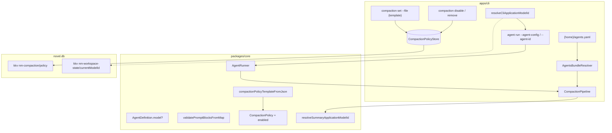

# Agent 配置形态整理 技术规格（SPEC）

## 设计目标

- **AgentDefinition**：`preferredModelId` 改名为可选 **`model: string`**；Zod `.strict()` 拒绝 `preferredModelId` 与旧嵌套 `model: { applicationModelId, params }`。
- **prompts.blocks**：配置层 **仅接受有序 map**（key = 块名）；运行时仍为 `readonly PromptBlock[]`（含 `name`，由 key 注入）。
- **工作区 agents 单文件**：`{novelMasterHome}/agents.yaml` 内嵌多 Agent；**移除** `agents/registry.json` 路径解析。
- **Compaction 模板与状态分离**：模板 schema **无 `enabled`**；`nm compaction set --file` 写入 `trigger`/`action` 且 **`enabled: true`**；**`disable`** / **`remove`**（`clear` 保留别名）。
- **摘要模型解析（PRD 修正现网）**：`--modelId` → 摘要 Agent.`model` → **工作区 current model**（**不再**回退对话 Agent 已解析 id）。
- **examples**：合并为 `examples/agents.yaml`；`compaction-policy.yaml` 无 `enabled`；无 `model` pin。

**不考虑**：自动迁移 CLI；`examples/mobile` UI；会话级 current model；provider.defaultModelId 参与解析。

---

## 现状与约束（代码探索）

| 模块 | 现状 | 本迭代 |
|------|------|--------|
| `AgentDefinition` | `preferredModelId?: string`（`agent-definition.ts`） | 改为 `model?: string` |
| `agentDefinitionDocumentSchema` | `blocks: z.array(...)`；每项含 `name` | `blocks: z.record(...)`；块内无 `name` |
| `validatePromptBlocks` | 仅接受数组（`prompt-blocks-validate.ts`） | 改为 `validatePromptBlocksFromMap`；数组 → 明确错误 |
| `agentDefinitionToJson` | `prompts.blocks` 序列化为数组 | 序列化为 **map**（key = `block.name`） |
| `resolveSummaryApplicationModelId` | 第三级为 `dialogueApplicationModelId`（`resolve-application-model-id.ts`） | 第三级为 **`workspaceModelId`** |
| `CompactionModelContext` | `dialogueApplicationModelId` + `cliModelId` | + **`workspaceModelId: string`**（Runner 由 CLI 注入） |
| `DefaultCompactionAction` L70–74 | `summaryDef.preferredModelId` + dialogue id | `summaryDef.model` + **workspace** |
| `file-agent-resolver.ts` | 读 `{home}/agents/registry.json` → 单文件路径 | 读 **`{home}/agents.yaml`** bundle |
| `compaction/commands.ts` | `show\|set\|clear`；`set` 整文档 `compactionPolicyFromJson` | + **`disable`/`remove`**；`set` 用 **模板 schema** + 强制 `enabled: true` |
| `compactionPolicyDocumentSchema` | 必填 `enabled` | **运行时**文档仍含 `enabled`；新增 **模板** schema 无 `enabled` |
| `nm agent run --agent-config` | `loadAgentConfigFile` → 单 Agent 根文档 | 支持 **bundle** + 新 flag **`--agent-id`** |
| `examples/` | 多文件 + `registry.json` + `enabled` / `preferredModelId` | 单 `agents.yaml` + 模板化 compaction |

**边界（不变）**：Core Runner / CompactionPipeline **不**读 `PersistentState`；工作区 model id 由 CLI 解析后传入。

**与 agent-model-decouple 的差异**：该 SPEC 摘要链第三级为对话 model；本 PRD 明确要求改为 **工作区 model**，属 **行为变更**，须更新 `resolve-application-model-id.test.ts` 与 `compaction.test.ts`。

---

## 总体方案

### 架构



### 领域模型（定稿）

```ts
/** 运行时 Agent（内存） */
interface AgentDefinition {
  readonly schemaVersion: 1;
  readonly name: string; // bundle 内由 agentId 注入；单文件文档用 YAML name
  readonly prompts: readonly PromptBlock[]; // 仍含 name，供渲染/诊断
  readonly model?: string; // applicationModelId pin
  readonly runtime?: { readonly maxSteps?: number };
}

/** 单 Agent 文件 / bundle 内 entry 的 prompts */
interface PromptsDocument {
  readonly blocks: Record<string, PromptBlockValue>; // 无 name 字段
}

/** Compaction 持久化（KKV，不变） */
interface CompactionPolicy {
  readonly schemaVersion: 1;
  readonly enabled: boolean;
  readonly trigger: CompactionTriggerConfig;
  readonly action: CompactionActionConfig;
}

/** 模板文件（set --file，无 enabled） */
interface CompactionPolicyTemplate {
  readonly schemaVersion: 1;
  readonly trigger: CompactionTriggerConfig;
  readonly action: CompactionActionConfig;
}

/** {home}/agents.yaml */
interface AgentsBundleDocument {
  readonly schemaVersion: 1;
  readonly agents: Record<string, AgentBundleEntryDocument>;
}

/** bundle 内单个 agent（无顶层 name） */
interface AgentBundleEntryDocument {
  readonly prompts: PromptsDocument;
  readonly model?: string;
  readonly runtime?: { readonly maxSteps?: number };
}

/** 传入 compaction 的模型上下文 */
interface CompactionModelContext {
  readonly workspaceModelId: string;
  readonly cliModelId?: string;
  /** @deprecated 仅保留至迁移完成；摘要链不再使用 */
  readonly dialogueApplicationModelId?: string;
}
```

### 模型 id 解析（纯函数）

```ts
// 对话（不变）
resolveApplicationModelId({
  cliModelId,
  agentModelId: definition.model, // 原 preferredModelId
  workspaceModelId,
}): string | undefined

// 摘要（变更）
resolveSummaryApplicationModelId({
  cliModelId,
  summaryModelId: summaryDef.model,
  workspaceModelId,
}): string  // 若 workspace 为空由宿主在 compaction 前报错
```

**优先级**：`--modelId` → Agent.`model` → `workspaceModelId` → 宿主报错。

### Compaction CLI 语义（定稿）

| 命令 | 行为 |
|------|------|
| `set --file <path>` | 解析 **模板**（无 `enabled`）；若含 `enabled` → **拒绝**（`INVALID_SCHEMA`）；`setPolicy({ ...template, enabled: true })` |
| `disable` | `getPolicy()`；若无策略 → 友好错误；否则 `setPolicy({ ...policy, enabled: false })` |
| `remove` | `clearPolicy()`（删除 KKV） |
| `clear` | **别名** → 调用与 `remove` 相同；help 文案标注 deprecated |
| `show` | 输出 `compactionPolicyToJson`（含 `enabled`）；无记录 → 现有文案 |

重新 `set --file`：**始终** `enabled: true`（覆盖 disable 状态）。

### agents.yaml 示例（目标）

```yaml
schemaVersion: 1
agents:
  writer:
    runtime:
      maxSteps: 20
    prompts:
      blocks:
        system:
          type: text
          role: system
          content: "You are a helpful assistant."
        abstract:
          type: abstract
          content: |
            压缩后的内容如下：
            {{.abstract}}
        history:
          type: chat
  summarizer:
    prompts:
      blocks: {}
```

路径：**`{novelMasterHome}/agents.yaml`**（与 `resolveNovelMasterHome(dbPath)` 一致）。

### compaction 模板示例

```yaml
schemaVersion: 1
trigger:
  tokenThreshold: 12000
  floorThreshold: 20
action:
  keepLastN: 6
  abstract:
    type: agent
    agentId: summarizer
    instruction: "Summarize the following conversation history concisely:"
```

---

## 最终项目结构

```
packages/core/src/
  domain/agent/
    agent-definition.ts                    # preferredModelId → model
    agent-definition.schema.ts             # blocks record; model; reject legacy keys
    agent-definition-from-json.ts          # map I/O; friendly errors
    agents-bundle.schema.ts                # NEW bundle Zod
    agents-bundle-from-json.ts             # NEW parse bundle → Map/id→AgentDefinition
    resolve-application-model-id.ts        # summary chain uses workspaceModelId
  domain/agent/compaction/
    compaction-model-context.ts            # + workspaceModelId
    action/default-compaction-action.ts    # summaryDef.model
  domain/compaction/
    compaction-policy-template.schema.ts   # NEW no enabled
    compaction-policy-template-from-json.ts# NEW
    compaction-policy.schema.ts            # unchanged runtime shape
  domain/prompt/
    prompt-blocks-validate.ts              # map in → PromptBlock[]
  infra/agent-definition-io/
    load-prompt-blocks-from-yaml.ts        # map at root / prompts.blocks
    deserialize-agent-definition.ts        # detect bundle vs single (optional)

apps/cli/src/
  compaction/
    file-agent-resolver.ts                 # REWRITE → agents-yaml-resolver.ts
    commands.ts                            # set/disable/remove; template parse
  agent/
    commands.ts                            # --agent-id; load bundle
    resolve-application-model-id.ts        # definition.model
  config/
    load-agent-config-file.ts              # bundle + agent id

examples/
  agents.yaml                              # NEW merged
  compaction-policy.yaml                   # remove enabled
  README.md                                # updated
  # REMOVE: agents-registry.example.json, agent-writer.yaml, agents/summarizer.yaml

.apm/kb/docs/Iterations/agent-config-shape/
  prd.md
  spec.md
```

---

## 变更点清单

### Core — Agent 字段

| 文件 | 改动 |
|------|------|
| `agent-definition.ts` | `preferredModelId` → `model` |
| `agent-definition.schema.ts` | `model` optional string；`prompts.blocks` → `z.record(z.string().min(1), blockValueSchema)`；块 schema **去掉 `name`**；`.strict()` 拒绝未知键 |
| `agent-definition-from-json.ts` | `documentToDefinition` 调用 map 校验；`agentDefinitionToJson` 输出 map；检测 `preferredModelId` / 对象型 `model` 并抛 `AgentConfigError` 友好文案 |
| `validateAgentDefinition` | pin 改为 `def.model` |

**友好错误（`agentDefinitionFromJson` 前置）**：

- 存在 `preferredModelId` → `AgentConfigError`: `preferredModelId is removed; use optional model: <applicationModelId>`
- `model` 为 object → `legacy nested model block is not supported`

### Core — blocks map

| 文件 | 改动 |
|------|------|
| `prompt-blocks-validate.ts` | 重命名/新增 `validatePromptBlocksFromMap(raw: unknown)`；`Array.isArray` → `PromptError`: `blocks must be a mapping (object), not an array` |
| `prompt-block.ts` | 类型不变（运行时仍有 `name`） |
| `load-prompt-blocks-from-yaml.ts` | 接受 map；`!Array.isArray(blocks) && typeof blocks === 'object'` |

**顺序**：对 map 使用 `Object.entries(blocks)` 顺序；`yaml` 包默认保留 mapping 顺序（实现后加单测固定）。

### Core — agents bundle

| 文件 | 改动 |
|------|------|
| `agents-bundle.schema.ts` | **新建** `agentsBundleDocumentSchema` |
| `agents-bundle-from-json.ts` | **新建** `agentsBundleFromJson` → `ReadonlyMap<string, AgentDefinition>` 或 `Record<string, AgentDefinition>`；`name = agentId` |
| `index.ts` | export 新 API |

**校验**：`compaction set` 与 resolver 使用 `Object.keys(bundle.agents)` 校验 `agentId`。

### Core — Compaction 模板

| 文件 | 改动 |
|------|------|
| `compaction-policy-template.schema.ts` | **新建**，字段同 policy 但 **无 `enabled`**；`.strict()` 若含 `enabled` 失败 |
| `compaction-policy-template-from-json.ts` | **新建** `compactionPolicyTemplateFromJson` |
| `compaction-policy-from-json.ts` | 保持运行时 `compactionPolicyFromJson`（含 `enabled`）供 store 内部/测试 |

### Core — 摘要模型链

| 文件 | 改动 |
|------|------|
| `resolve-application-model-id.ts` | `ResolveSummaryApplicationModelIdInput`: `summaryModelId?`, `workspaceModelId`；删除对 `dialogueApplicationModelId` 的依赖 |
| `compaction-model-context.ts` | 必填 `workspaceModelId`；移除 `dialogueApplicationModelId`（或保留 optional 一版 deprecated，Runner 仍传 workspace） |
| `default-compaction-action.ts` | `summaryDef.model` + `ctx.modelContext.workspaceModelId` |
| `agent-runner.ts` | 构造 `modelContext` 时传入 `workspaceModelId`（来自 `AgentRunOptions`，见下） |

| 文件 | 改动 |
|------|------|
| `agent.port.ts` / `AgentRunOptions` | 增加 `readonly workspaceModelId: string`（与 `applicationModelId` 一并由 CLI 注入）；或仅在 `cliModelId` 同层增加 `workspaceModelId` 供 compaction |

**推荐**：`AgentRunOptions` 增加 `workspaceModelId: string`（CLI 在 resolve 后传入当前 workspace id，即使用户靠 agent pin 解析了 dialogue model，workspace id 仍单独传入供摘要链使用）。

### CLI

| 文件 | 改动 |
|------|------|
| `compaction/file-agent-resolver.ts` | 重写为读 `{home}/agents.yaml`；`listAgentIds` → bundle keys；删除 registry.json |
| `compaction/commands.ts` | `set` 使用 template parser + `enabled: true`；`disable`；`remove`；`clear` → 调 `remove` |
| `agent/commands.ts` | `resolveDefinition`：若 `--agent-config` 为 bundle，要求 `--agent-id`；`run` 传 `workspaceModelId` 入 Runner |
| `agent/resolve-application-model-id.ts` | `definition.model`；错误文案更新 |
| `load-agent-config-file.ts` | 导出 `loadAgentFromConfig(path, agentId?)` |

### Examples & 文档

| 文件 | 改动 |
|------|------|
| `examples/agents.yaml` | 合并 writer + summarizer |
| `examples/compaction-policy.yaml` | 删除 `enabled` |
| `examples/README.md` | `cp agents.yaml` + `compaction set` + `disable`/`remove` |
| 删除 | `agents-registry.example.json`, `agent-writer.yaml`, `agents/summarizer.yaml` |

### 测试（全量更新）

| 文件 | 改动 |
|------|------|
| `agent-definition*.test.ts` | `model`；map blocks；拒绝 preferredModelId / array |
| `agent-definition-io.test.ts` | round-trip map |
| `prompt-blocks-validate.test.ts` | map cases |
| `load-prompt-blocks.test.ts` | map at root |
| `resolve-application-model-id.test.ts` | summary → workspace |
| `compaction.test.ts` | `CompactionModelContext.workspaceModelId` |
| `compaction-policy.test.ts` | template schema |
| `apps/cli/test/agent-config-e2e.test.ts` | preferredModelId → model |
| 新增 | `agents-bundle-from-json.test.ts` |
| 新增 | `compaction-policy-template.test.ts` |
| CLI compaction e2e（若无则 commands 层单测） | set/disable/remove |

### 明确不改（本期）

- `examples/mobile/app.js`（PRD 不含）
- `CompactionPolicyStore` KKV 键路径
- `ModelSamplingProfile` / provider 域

---

## 详细实现步骤

### 阶段 1：Core 域模型与解析（可独立单测）

1. `prompt-blocks-validate.ts`：实现 `validatePromptBlocksFromMap`；导出别名 `validatePromptBlocks` 指向 map 版本或删除旧名并全仓库替换 import。
2. `agent-definition.schema.ts`：blocks record + `model`；块 value schemas 无 `name`。
3. `agent-definition.ts` / `from-json` / `to-json`：字段更名；map 序列化；legacy 检测。
4. `resolve-application-model-id.ts` + `CompactionModelContext` + `DefaultCompactionAction`：摘要链改 workspace。
5. `AgentRunOptions` 增加 `workspaceModelId`；`agent-runner.ts` 传入 compaction。

### 阶段 2：Compaction 模板与 CLI 子命令

1. 新增 `compaction-policy-template.schema.ts` + `from-json`。
2. `compaction/commands.ts`：`set` / `disable` / `remove` / `clear` 别名。
3. `compactionPolicyFromJson` 仅在 store 读写与 `disable` 合并时使用。

### 阶段 3：agents.yaml bundle

1. `agents-bundle-from-json.ts` + schema + tests。
2. 重写 `file-agent-resolver.ts`（可重命名为 `agents-yaml-resolver.ts` 并更新 `runtime.ts` import）。
3. `compaction/commands.ts` 的 `validateAgentIdsInPolicy` 改用 bundle ids。

### 阶段 4：CLI agent run

1. `deserialize` 或 `load-agent-config-file`：检测 `agents` 根键 → bundle；`--agent-id` 必选。
2. 单 Agent 根文档（含 `name`）仍支持，便于局部测试。

### 阶段 5：Examples 与测试全绿

1. 新建/更新 `examples/*`。
2. 全量 `pnpm test`（或仓库约定命令）；更新 `.apm` 验收文档路径（可选）。

---

## 测试策略

### 单元测试（Core）

| ID | 用例 |
|----|------|
| T1 | `agentDefinitionFromJson` 含 `preferredModelId` → `INVALID_SCHEMA` 且消息含 `model` |
| T2 | `model: { applicationModelId: "a/b" }` → 失败 |
| T3 | `model: "mock/test"` round-trip |
| T4 | blocks map 顺序：三键写入顺序与 `definition.prompts` 顺序一致 |
| T5 | blocks 数组 → `blocks must be a mapping` |
| T6 | `resolveSummaryApplicationModelId` 无 pin、无 flag → `workspaceModelId`（**非** dialogue） |
| T7 | `compactionPolicyTemplateFromJson` 含 `enabled` → 失败 |
| T8 | `agentsBundleFromJson` 两 agent；`summarizer` prompts 空 map |

### CLI / 集成

| ID | 用例 |
|----|------|
| C1 | `compaction set --file`（无 enabled）→ `show` 中 `enabled: true` |
| C2 | `compaction disable` → `enabled: false`，trigger/action 保留 |
| C3 | `compaction remove` → show 无策略 |
| C4 | 模板含 `enabled: false` → set 失败 |
| C5 | policy 引用 `summarizer`，`agents.yaml` 存在 → set 成功 |
| C6 | 仅 `registry.json` 无 `agents.yaml` → set 或 run 时 agent 解析失败 |

### 回归

- `agent-runner.test.ts` compaction 路径传入 `workspaceModelId`。
- `render-prompt*.test.ts` 无需改断言（仍用 `PromptBlock[]`）。

---

## 兼容性与迁移说明

| 旧形态 | 结果 |
|--------|------|
| `preferredModelId` | 拒绝；手动改为 `model` |
| `prompts.blocks: [...]` | 拒绝；改为 map |
| `{home}/agents/registry.json` | 不再读取；迁移到 `agents.yaml` |
| `compaction-policy.yaml` 含 `enabled` | **set 拒绝**；从文件删除 `enabled` |
| 摘要模型依赖对话 agent | **行为变更**：无 summarizer pin 时用 **工作区** model，不再用对话已解析 id |
| `nm compaction clear` | 仍可用（= `remove`） |

**无**自动迁移命令。

---

## 风险与回滚方案

| 风险 | 缓解 |
|------|------|
| 用户本地 `.novel-master` 仍为 registry + 多文件 | `examples/README.md` 迁移说明；错误信息指向 `agents.yaml` |
| YAML 工具重排 map 键顺序 | 单测 + 文档注明「顺序以文件为准」；避免按字母排序的编辑器插件 |
| 摘要模型变更导致成本/行为变化 | PRD 已确认；单测锁定新链 |
| `AgentRunOptions` 增字段 | 所有 `createAgentRunner` 调用点编译器报错，逐一传入 `workspaceModelId` |

**回滚**：revert 本迭代提交；DB 中 policy JSON 仍兼容（仍有 `enabled` 字段），无需数据迁移。

---

## 实现检查清单（编码前）

- [x] 已读 `prd.md`
- [x] 已探索 `agent-definition*`、`prompt-blocks-validate`、`file-agent-resolver`、`compaction/commands`、`resolve-application-model-id`、`default-compaction-action`
- [ ] **用户确认本 `spec.md` 后再编码**
