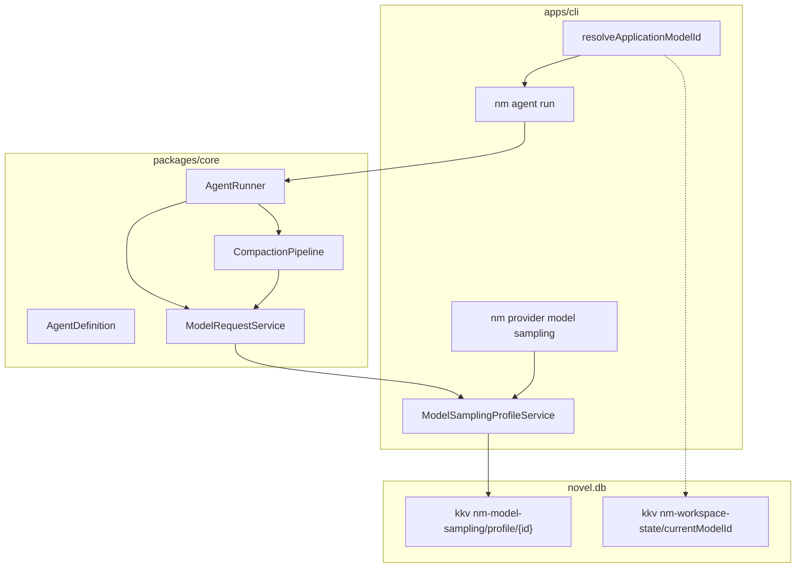

# Agent 与模型解耦 技术规格（SPEC）

## 设计目标

- **AgentDefinition** 移除 `model`；可选 **`preferredModelId`**；Zod `.strict()` 拒绝旧 `model:` 字段。
- **AgentRunner** 仅使用 `AgentRunOptions.applicationModelId`；采样由 **ModelRequestService** 按已保存模型档案自动合并。
- **模型采样档案** 持久化于 novel.db（KKV per model），经 **ModelSamplingProfileService** 读写；CLI `nm provider model sampling show|set|clear`。
- **CLI** 统一解析：`--modelId` → `preferredModelId` → `PersistentState.currentModelId` → 报错。
- **Compaction** 摘要 Agent 使用二级解析：`--modelId` → 摘要 Agent `preferredModelId` → 对话已解析的 `applicationModelId`。
- **`examples/mobile`**：Agent 无 model/温度；**单例** `workspaceCurrentModelId`；项目抽屉 +「我的」双入口；模型采样在服务商/模型侧配置。

**不考虑**：旧 Agent YAML 自动迁移；provider.`defaultModelId` 参与 Agent 解析；RN App；会话级独立 current model。

---

## 现状与约束（代码探索）

| 模块 | 现状 | 本迭代 |
|------|------|--------|
| `AgentDefinition` | 必填 `model: AgentModelConfig`（`agent-definition.ts`） | 删除 `model`；可选 `preferredModelId` |
| `agentDefinitionDocumentSchema` | 含 `model` + 内嵌 `modelSamplingParamsSchema` | 移除 `model`；采样 schema 迁至 provider 域 |
| `AgentRunOptions` | 仅 `definition` | + **`applicationModelId: string`** |
| `DefaultAgentRunner` | `definition.model.applicationModelId` / `params` | 用 `options.applicationModelId`；不传 `sampling`（交给 ModelRequestService） |
| `DefaultCompactionAction` | `summaryDef.model.applicationModelId` / `params` | 用 **解析后的** summary id；不传 sampling |
| `CompactionPipeline.maybeCompact` | `(session, worktreeDisplay)` | + **`CompactionModelContext`** |
| `ModelRequestService` | 仅使用 `options?.sampling` | 未传时查 **ModelSamplingProfileStore** |
| `SavedModel` / `llm_saved_model` | 无采样字段 | 不改表；采样走 **KKV**（见下） |
| `ProviderModelService` | save/list/edit/delete | 扩展或并列 **ModelSamplingProfileService**；`deleteSaved` 时清档案 |
| CLI `resolveDefinition` | 有 `--agent-config` 时不读 state；patch `definition.model` | 抽出 **`resolveApplicationModelId`**；不再 patch model |
| CLI `agent/commands.ts` L117–120 | 预读 agent 文件 model | 删除；统一 resolve |
| `buildMinimalDefinition` | 必填 `applicationModelId` | 仅 prompts，无 model |
| `validateAgentDefinition` | 校验 `model.params` 协议 | 仅校验 **`preferredModelId`**（可选注入 `assertSavedModel`） |
| `model-sampling-params.ts` | 路径 `domain/agent/model/` | **搬迁**至 `domain/provider/model/`（旧路径 re-export 一期可选） |
| `compaction.test.ts` CLI3 | `model: { applicationModelId }` | `preferredModelId` + `CompactionModelContext` |
| `examples/agent-writer.yaml` | 含 `model` + `params` | 删除 `model` 段 |
| Mobile `agentCatalog` | `definition.model` + 编辑器采样表单 | 移除；**`workspaceCurrentModelId`** 单例 |

**边界**：Core **不**读取 `PersistentState`；宿主（CLI）负责 resolve 后传入 `applicationModelId`。

---

## 总体方案

### 架构



### 领域模型

```ts
/** Agent 配置（可序列化） */
interface AgentDefinition {
  readonly schemaVersion: 1;
  readonly name: string;
  readonly prompts: readonly PromptBlock[];
  readonly preferredModelId?: string; // applicationModelId
  readonly runtime?: { readonly maxSteps?: number };
}

/** 单次 Agent 执行 */
interface AgentRunOptions {
  readonly definition: AgentDefinition;
  readonly applicationModelId: string;
  readonly promptContext: ...;
  readonly maxSteps?: number;
  readonly stream?: boolean;
  readonly onStream?: ...;
}

/** 模型采样档案（KKV JSON） */
interface ModelSamplingProfile {
  readonly schemaVersion: 1;
  readonly enabled: boolean;
  readonly params?: ModelSamplingParams;
}

/** 压缩步骤模型上下文（由 Runner 传入） */
interface CompactionModelContext {
  /** 对话 Agent 已解析的 applicationModelId */
  readonly dialogueApplicationModelId: string;
  /** 本次 CLI 传入的 --modelId（无则为 undefined） */
  readonly cliModelId?: string;
}
```

### 模型 id 解析（纯函数，放 Core 便于单测）

```ts
/** 对话 / 通用执行 */
function resolveApplicationModelId(input: {
  cliModelId?: string;
  preferredModelId?: string;
  workspaceModelId?: string;
}): string | undefined {
  return (
    input.cliModelId ??
    input.preferredModelId ??
    input.workspaceModelId ??
    undefined
  );
}

/** 压缩摘要 Agent */
function resolveSummaryApplicationModelId(input: {
  cliModelId?: string;
  summaryPreferredModelId?: string;
  dialogueApplicationModelId: string;
}): string {
  return (
    input.cliModelId ??
    input.summaryPreferredModelId ??
    input.dialogueApplicationModelId
  );
}
```

**优先级（PRD 已确认）**：flag 最高；对话链不含 provider.defaultModelId。

### 采样档案持久化

| 项 | 值 |
|----|-----|
| KKV module | `nm-model-sampling` |
| KKV key | `profile/${applicationModelId}`（`/` 保留，与 model id 一致） |
| Value | `JSON.stringify(modelSamplingProfileToJson(profile))` |
| 无记录 | 视为未配置：`enabled` 等价 false，请求不传 sampling |
| 删除已保存模型 | `ProviderModelService.deleteSaved` 内 **delete** 对应 KKV key |

实现：`DefaultModelSamplingProfileService`（内部 `KkvService`），与 `DefaultPersistentState` 同模式。

**为何不用 ALTER `llm_saved_model`**：当前 `bootstrapNovelMaster` 仅 `CREATE IF NOT EXISTS`，无迁移框架；KKV 与 `nm-compaction/policy` 一致，实现成本低。二期若需 SQL 查询可再迁表。

### ModelRequestService 合并规则

```ts
async request(applicationModelId, userContent, options?) {
  let sampling = options?.sampling;
  if (sampling === undefined) {
    const profile = await this.deps.samplingProfiles.get(applicationModelId);
    if (profile?.enabled && profile.params != null) {
      sampling = profile.params;
    }
  }
  // ... adapter.chat({ ..., sampling })
}
```

宿主 **显式** 传入 `options.sampling` 时 **覆盖** 档案（测试用）。

### Compaction 接线

`CompactionPipeline.maybeCompact(session, worktreeDisplay, modelContext?)`

- `DefaultAgentRunner` 每步调用前已 resolve 对话 `applicationModelId`，构造：
  ```ts
  { dialogueApplicationModelId: options.applicationModelId, cliModelId: options.cliModelId }
  ```
- `DefaultCompactionAction`：`abstract.type === "agent"` 时
  ```ts
  const summaryDef = await ctx.resolveAgent.resolve(agentId);
  const summaryModelId = resolveSummaryApplicationModelId({
    cliModelId: ctx.modelContext?.cliModelId,
    summaryPreferredModelId: summaryDef.preferredModelId,
    dialogueApplicationModelId: ctx.modelContext!.dialogueApplicationModelId,
  });
  await ctx.modelRequests.request(summaryModelId, ...);
  ```

`AgentRunOptions` 增加可选 **`cliModelId?: string`**（仅当宿主从 flag 解析时填入，供 compaction 复用；避免 pipeline 依赖 flags）。

---

## 最终项目结构

```
packages/core/src/
  domain/agent/
    agent-definition.ts                    # 改
    agent-definition.schema.ts             # 改
    agent-definition-from-json.ts            # 改
    resolve-application-model-id.ts        # 新增
  domain/provider/model/
    model-sampling-params.ts                 # 从 agent/ 迁入
    model-sampling-profile.ts                # 新增
    model-sampling-profile.schema.ts         # 新增
  service/provider/
    model-sampling-profile.port.ts           # 新增
    impl/model-sampling-profile.service.ts   # 新增
    impl/model-request.service.ts            # 改
    create-provider-services.ts              # 改
  service/agent/
    agent.port.ts                            # 改
    impl/agent-runner.ts                     # 改
  domain/agent/compaction/
    compaction-context.ts                    # 改
    action/default-compaction-action.ts      # 改
  service/compaction/
    compaction-pipeline.port.ts              # 改
    create-compaction-pipeline.ts            # 透传

apps/cli/src/
  agent/
    resolve-application-model-id.ts          # 新增（调 core + state）
    commands.ts                              # 改
  config/build-minimal-definition.ts       # 改
  provider/model/
    commands.ts                              # 改：分发 sampling
    sampling-commands.ts                     # 新增
  runtime.ts                                 # 暴露 modelSamplingProfiles（可选）

examples/
  agent-writer.yaml                          # 改
  mobile/
    app.js                                   # 改
    index.html                               # 改
    styles.css                               # 改
    docs/feature-inventory.md                # 改

.apm/kb/docs/Iterations/agent-model-decouple/
  test/cli-agent-model.md                    # 新增 CLI 验收记录（可选）
```

---

## 变更点清单

### Core

| 文件 | 改动 |
|------|------|
| `agent-definition.ts` | 删 `AgentModelConfig` 嵌套；`preferredModelId?` |
| `agent-definition.schema.ts` | 删 `model`；删内嵌 sampling schema（迁至 provider） |
| `agent-definition-from-json.ts` | 序列化/反序列化 `preferredModelId`；`validateAgentDefinition` 只验 pin |
| `resolve-application-model-id.ts` | 导出 `resolveApplicationModelId`、`resolveSummaryApplicationModelId` |
| `model-sampling-profile*.ts` | 领域 + `fromJson` / `toJson` |
| `model-sampling-profile.service.ts` | `get` / `set` / `clear` |
| `model-request.service.ts` | 注入 profile service，自动 merge |
| `create-provider-services.ts` | 创建 profile service；bundle 增加 `modelSamplingProfiles` |
| `agent.port.ts` | `applicationModelId` + 可选 `cliModelId` |
| `agent-runner.ts` | 用 `options.applicationModelId`；`maybeCompact(..., modelContext)` |
| `compaction-context.ts` | `modelContext: CompactionModelContext` |
| `default-compaction-action.ts` | 摘要 model 解析 |
| `compaction-pipeline.port.ts` | `maybeCompact` 第三参 |
| `index.ts` | 导出新类型/函数/服务工厂 |

### CLI

| 文件 | 改动 |
|------|------|
| `agent/resolve-application-model-id.ts` | flags + definition + `rt.state` |
| `agent/commands.ts` | 删除双路径 model 预读；`runner.run({ applicationModelId, cliModelId, definition })` |
| `build-minimal-definition.ts` | 去掉 `applicationModelId` |
| `provider/model/sampling-commands.ts` | show / set / clear |
| `provider/model/commands.ts` | `sampling` 子命令路由 |
| `runtime.ts` | `readonly modelSamplingProfiles`（或经 `providerModels` 扩展） |

### 示例与文档

| 文件 | 改动 |
|------|------|
| `examples/agent-writer.yaml` | 删除 `model:` |
| `examples/agents-registry.example.json` | 若有 agent 路径，确保样例 yaml 无 model |
| `.apm/.../test/cli-agent-model.md` | 记录 flag / pin / state / sampling 验收命令 |

### Mobile 原型

| 文件 | 改动 |
|------|------|
| `app.js` | `workspaceCurrentModelId` 单例 + `localStorage`；`agentCatalog` 去 model；编辑器去采样区；`renderProjectDrawer` 增加当前模型与切换；模型 picker 模态；「我的」增加当前模型入口；服务商模型详情页增加采样开关+表单（mock） |
| `index.html` | 抽屉区 DOM；`#modelPickerModal`；`profilePage` 菜单项 |
| `styles.css` | 抽屉模型行、modal、设置项 |
| `feature-inventory.md` | Agent 无 model；工作区当前模型；模型采样归属 |

---

## 详细实现步骤

### 阶段 1：Core 领域与采样档案

1. 新增 `domain/provider/model/model-sampling-params.ts`（从 agent 目录 **移动** 文件；`domain/agent/model/model-sampling-params.ts` 改为 re-export  deprecate 或删除并改全 import）。
2. 新增 `ModelSamplingProfile` + Zod schema + `modelSamplingProfileFromJson` / `toJson`。
3. 实现 `DefaultModelSamplingProfileService`（KKV module `nm-model-sampling`）。
4. `createProviderServices`：实例化 profile service；`DefaultModelRequestService` 增加 deps；`deleteSaved` 时调用 `profileService.clear(applicationModelId)`（在 `DefaultProviderModelService.deleteSaved` 内注入回调或并列 service）。

### 阶段 2：AgentDefinition breaking 变更

1. 修改 `agent-definition.ts` / schema / from-json。
2. 新增 `resolve-application-model-id.ts` 单测。
3. 更新 `validateAgentDefinition`：若 `preferredModelId` 存在，调用可选 `assertSavedModel(id)`（CLI 注入：查 `savedModels.find`）。
4. 改编 `packages/core/test/agent/agent-definition*.ts`、`agent-definition-io.test.ts`、所有 fixture YAML。

### 阶段 3：AgentRunner + Compaction

1. `AgentRunOptions` 增加 `applicationModelId`、可选 `cliModelId`。
2. `agent-runner.ts` 改用 `applicationModelId`；构造 `CompactionModelContext` 传入 `maybeCompact`。
3. 更新 `compaction-context`、`default-compaction-action`、`compaction-pipeline.port.ts`。
4. 改编 `agent-runner.test.ts`、`compaction.test.ts`（含 CLI3）。

### 阶段 4：CLI

1. `resolve-application-model-id.ts`（apps/cli）包装 core 函数 + state。
2. 重写 `agent/commands.ts` 的 resolve 流程。
3. `sampling-commands.ts`：
   - `show`：打印 JSON（enabled + params）
   - `set`：`--modelId` 必填；`--file <json|yaml>` 或 `--enabled true/false` + 协议相关 flag（最小实现：**仅 `--file`** 亦可满足 PRD）
   - `clear`：删除 KKV
4. 扩展 `provider/model/commands.ts` 路由 `sampling`。
5. 改编 e2e：`agent-config-e2e.test.ts` MINIMAL_AGENT_YAML 无 model；先 `model use` 再 run。

### 阶段 5：示例与 CLI 验收文档

1. 更新 `examples/agent-writer.yaml`。
2. 新增 `.apm/kb/docs/Iterations/agent-model-decouple/test/cli-agent-model.md`（`nm model use`、`nm provider model sampling set`、`nm agent run --modelId` 等）。

### 阶段 6：Mobile 原型

1. **状态**：`appState.workspaceCurrentModelId`；`loadWorkspaceModel()` / `setWorkspaceModel(id)` 同步 `localStorage`（key：`nm-mobile-workspace-current-model`）。
2. **Agent**：`agentCatalog` 条目删除 `model`；`buildDefinitionFromEditor` / `renderAgentEditor` 移除模型与采样 UI；YAML 预览无 `model:`。
3. **项目抽屉**（`#projectDrawer`）：在 `drawer-header` 下增加块：
   - 展示 `workspaceCurrentModelId` 短标签
   - 按钮「切换模型」→ 打开 `#modelPickerModal`
4. **模型 picker 模态**：列表 `mockSavedModels`（与现有 provider mock 一致）；选中调用 `setWorkspaceModel`；关闭后刷新抽屉 + `#chatPage .model-name` + 设置页展示。
5. **我的**：`profilePage` 增加菜单「当前模型」→ 跳转子页或复用 picker；与抽屉写 **同一** `setWorkspaceModel`。
6. **模型采样（mock）**：在服务商详情或模型列表项进入「模型配置」子界面：`enabled` toggle + 协议采样字段；存 `appState.modelSamplingProfiles[applicationModelId]`（localStorage 可选）；与 Core 概念对齐，不接真 DB。
7. 更新 `feature-inventory.md`。

### 阶段 7：导出面与全量测试

1. `packages/core/src/index.ts` 导出新 API。
2. `pnpm test`（core + cli）；修复断裂引用。

---

## 测试策略

### 单元测试（Core）

| ID | 场景 |
|----|------|
| R1 | `resolveApplicationModelId`：flag / pin / workspace 组合 |
| R2 | `resolveSummaryApplicationModelId`：摘要 pin、回退对话 id |
| D1 | 无 `model` 的 YAML 解析成功；含 `model` 失败 |
| D2 | `preferredModelId` 校验协议（params 在 profile 上验） |
| P1 | profile set/get/clear KKV |
| P2 | `ModelRequestService` 有 enabled profile 时合并 sampling |
| P3 | profile disabled 或 absent 时不传 sampling |
| P4 | `deleteSaved` 清除 profile |
| A1 | `AgentRunner` 使用 `options.applicationModelId` |
| C1 | compaction CLI3：摘要 `preferredModelId` + dialogue context |

### CLI 测试 / 文档

| ID | 场景 |
|----|------|
| E1 | 无 model 的 agent yaml + `model use` → run 成功 |
| E2 | `--modelId` 覆盖 agent `preferredModelId` |
| E3 | `sampling set --file` + `model request`（mock 适配器断言 temperature） |
| E4 | `sampling clear` 后无 sampling |

### Mobile（手工）

- 抽屉与「我的」改模型双向同步。
- Agent 编辑无温度字段。
- 模型配置页开关关闭后 mock 发送不再带温度（文案/控制台 log 即可）。

---

## 兼容性与迁移

| 项 | 策略 |
|----|------|
| Agent YAML `model:` | **Breaking**：strict schema 拒绝；更新仓库内所有示例与测试 fixture |
| `AgentModelConfig` 类型 | 删除；调用方改用 `applicationModelId` 字符串 |
| `domain/agent/model/model-sampling-params` | 迁至 provider；全仓库改 import（或短期 re-export） |
| global-compaction SPEC 文案 | 摘要「用 Agent B 的 model」→「preferredModelId + 解析链」；实现后改 cross-ref 即可 |
| 已有 novel.db | KKV 新 module 无需迁移；无 profile 即默认 API 采样 |

---

## 风险与回滚方案

| 风险 | 缓解 |
|------|------|
| Breaking 导致用户自有 agent yaml 失败 | 发布说明 + 示例更新；错误信息提示删除 `model:` |
| Compaction 摘要 model 解析遗漏 context | CLI3 单测 + 显式 `CompactionModelContext` 类型 |
| KKV key 与 model id 特殊字符 | key 使用完整 `applicationModelId`（含 `/`），与 state 存法一致 |
| Mobile 抽屉与 PRD「左侧」不一致 | 复用现有 `#projectDrawer`（由 `#drawerBtn` 打开），不新增右侧抽屉 |

**回滚**：恢复 `AgentDefinition.model` 与 runner 读 definition 的提交；KKV profile 可保留（无害）。CLI/mobile 回退 UI 改动。

---

## 公开 API 摘要（实现后）

| API | 说明 |
|-----|------|
| `resolveApplicationModelId` / `resolveSummaryApplicationModelId` | 纯函数 |
| `createModelSamplingProfileService(conn)` | 工厂 |
| `ModelSamplingProfileService` | `getProfile` / `setProfile` / `clearProfile` |
| `AgentRunOptions.applicationModelId` | 必填 |
| `AgentDefinition.preferredModelId?` | 可选 |
| CLI `nm provider model sampling show\|set\|clear` | 管理档案 |

---

**生成路径**：`.apm/kb/docs/Iterations/agent-model-decouple/spec.md`

编码前请确认本 SPEC；确认后再进入实现。
