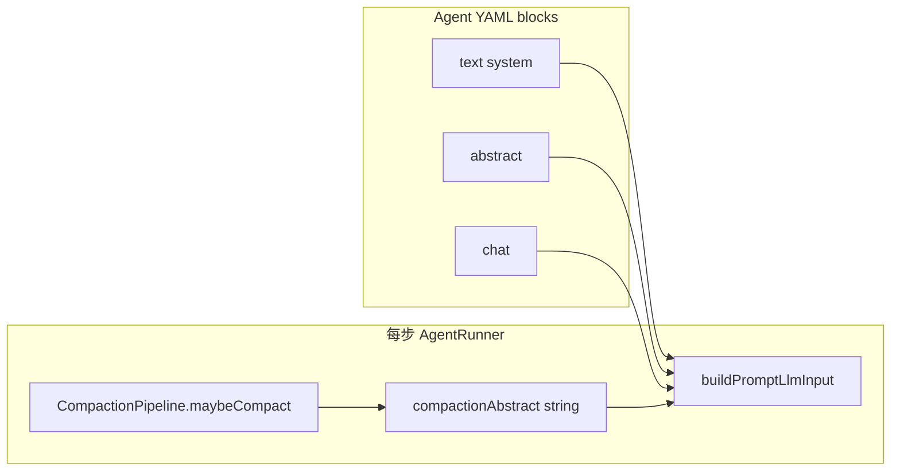

# Agent Prompt：移除 when、引入 abstract 块 技术规格（SPEC）

## 设计目标

- 用 **`type: abstract`** 专用块替代 **`when: present: abstract` + `type: text`**，降低配置与编辑器复杂度。
- **运行时语义不变**：压缩产出的 `abstract` 字符串仍经 `PromptRenderContext.abstract` 注入；无摘要时摘要段落不进 LLM `system`。
- **破坏性变更**：含 `when` 的 Agent 文档拒绝加载，并提示迁移为 `abstract` 块。
- **与 agent-config-and-compaction 关系**：压缩 `compact.*` 不变；仅 prompt 块模型与渲染路径调整；旧 SPEC 中 `when` 相关章节由本 SPEC **取代**（见 §兼容与文档）。

---

## 现状与差距分析（代码探索结论）

### 已实现（`packages/core`）

| 能力 | 文件 | 状态 |
|------|------|------|
| `PromptBlock` 含 `abstract`、无 `when` | `domain/prompt/model/prompt-block.ts` | ✅ |
| Zod：`abstractPromptBlockSchema`；`text` 无 `when`（`.strict()`） | `domain/agent/agent-definition.schema.ts` | ✅ |
| `validatePromptBlocks`：解析 `abstract`；`rejectWhen()` | `domain/prompt/prompt-blocks-validate.ts` | ✅ |
| `buildPromptLlmInput` / `formatPromptLlmInputForCli`：空 `abstract` 跳过 `abstract` 块 | `service/prompt/render-prompt.ts` | ✅ |
| Runner 每步传入 `abstract: compactionAbstract` | `service/agent/impl/agent-runner.ts` | ✅ |
| 宏 `{{.abstract}}` 可选字段 | `infra/prompt-template/macro-render.ts` + `optionalDotFields` | ✅ |
| 单测 T6/T7、abstract 校验、拒绝 when | `test/prompt/render-prompt-abstract.test.ts`、`prompt-blocks-validate.test.ts` | ✅ |
| Runner 集成 abstract 块 | `test/agent/agent-runner.test.ts`（`compactRunnerDefinition`） | ✅ |

`domain/prompt/model/prompt-block-when.ts` **已不存在**；`test/prompt/prompt-block-when.test.ts` 为**空文件**（应删除）。

### 示例

| 文件 | 状态 |
|------|------|
| `examples/agent-writer.yaml` | ✅ 已使用 `type: abstract`，无 `when` |

### 未完成

| 项 | 文件 | 状态 |
|----|------|------|
| UI 壳 mock 仍用 `when` + `text` | `examples/ui-shell-prototype/app.js` → `createWriterDefinition()` | ❌ |
| 编辑器仍有 when 表单项 | `app.js` → `renderPromptBlockCard` / `collectAgentDefinitionFromForm` | ❌ |
| 无「添加 abstract 块」入口 | `app.js` → `add-prompt-block` 仅 text/chat | ❌ |
| 旧迭代文档仍描述 `when` | `.apm/kb/docs/Iterations/agent-config-and-compaction/spec.md` | ❌ 需勘误注记 |
| `agentDefinitionFromJson` 全文档级 when 拒绝用例 | `test/agent/agent-definition.test.ts` | ⚠️ 可选补充（Zod strict 已挡） |
| 空测试文件 | `test/prompt/prompt-block-when.test.ts` | ❌ 应删除 |

**结论**：本迭代 **Core 主体已落地**；剩余工作集中在 **UI 原型对齐、测试/文档清理、可选集成测试补强**。

---

## 总体方案

### 块类型与渲染（定稿）



| `type` | 配置字段 | `buildPromptLlmInput` 行为 |
|--------|----------|----------------------------|
| `text` | `role`, `content` | 仅 `role === "system"` 宏展开后追加到 `system`（现状不变） |
| `chat` | `name` | `ctx.messages` 作为 LLM history（现状不变） |
| `abstract` | `content` | 若 `trim(ctx.abstract) === ""` → **跳过**；否则宏展开后追加到 `system` |

**空摘要判定**（与现码一致）：

```ts
function hasAbstractContent(abstract: string): boolean {
  return abstract.trim().length > 0;
}
```

### 解析与错误

两条入口均拒绝 `when`：

1. **完整 Agent 文档**：`agentDefinitionFromJson` → Zod `textPromptBlockSchema.strict()` → 未知键 `when` → `AgentConfigError` / `INVALID_SCHEMA`。
2. **仅 blocks 数组**（`--prompt-path`）：`loadPromptBlocksFromYaml` → `validatePromptBlocks` → `rejectWhen()` → `PromptError` / `INVALID_BLOCK`，文案：

   `when is no longer supported; use type abstract for conditional summary blocks`

**不要求**在 Zod 层复刻 `rejectWhen` 文案；可选在 `agent-definition-from-json` 对 Zod 错误做友好映射（非本期必须）。

### `abstract` 块 schema（与现码一致）

```yaml
- name: abstract
  type: abstract
  content: |
    压缩后的内容如下：
    {{.abstract}}
```

- **禁止**：`role`、`when`、未知键（Zod/validate 双重 `.strict()` 风格）。
- **允许宏**：`{{.abstract}}`、`{{.worktree}}`、`{{$time}}`、`{{$week_cn}}`（macro-scan 仍禁止 `if`/`range`）。

---

## 最终项目结构

无新顶层包；变更集中在：

```
packages/core/
  src/domain/prompt/model/prompt-block.ts          # 已含 abstract（维持）
  src/domain/prompt/prompt-blocks-validate.ts    # 已含 rejectWhen（维持）
  src/domain/agent/agent-definition.schema.ts      # 已含 abstractPromptBlockSchema（维持）
  src/service/prompt/render-prompt.ts              # 已含 abstract 分支（维持）
  test/prompt/render-prompt-abstract.test.ts       # 维持/补 T5 顺序用例
  test/prompt/prompt-blocks-validate.test.ts       # 维持
  test/prompt/prompt-block-when.test.ts            # 删除（空文件）

examples/
  agent-writer.yaml                                # 已对齐（维持）
  ui-shell-prototype/app.js                        # 改 mock + 编辑器
  ui-shell-prototype/docs/feature-inventory.md     # 可选：Prompt 块描述更新

.apm/kb/docs/Iterations/
  agent-prompt-abstract-block/prd.md               # 已有
  agent-prompt-abstract-block/spec.md              # 本文件
  agent-config-and-compaction/spec.md              # 顶部增加 superseded 注记
```

---

## 变更点清单

### A. Core（收尾，按需）

| 文件 | 操作 |
|------|------|
| `test/prompt/prompt-block-when.test.ts` | **删除** |
| `test/agent/agent-definition.test.ts` | **可选**：新增用例「blocks 含 when → AgentConfigError」；「`type: abstract` + `role` → 失败」 |
| `test/prompt/render-prompt-abstract.test.ts` | **可选**：补 PRD T6 多块顺序（system + abstract + chat） |
| `packages/core/src/index.ts` | **无变更**（确认未导出 `PromptBlockWhen`） |

**不修改**（除非发现回归）：`render-prompt.ts`、`prompt-block.ts`、`agent-definition.schema.ts`。

### B. UI 壳原型（必做）

| 位置 | 变更 |
|------|------|
| `createWriterDefinition()` | `abstract` 块：`{ name: 'abstract', type: 'abstract', content: '...' }`；删除 `when`、`role: system` |
| `renderPromptBlockCard()` | **text**：去掉 when 相关表单项；**abstract**：独立卡片（仅 `name` + `content` + 宏提示）；**chat**：不变 |
| `collectAgentDefinitionFromForm()` | 根据卡片类型 `abstract`/`text`/`chat` 组装；不再写 `block.when` |
| `add-prompt-block` 菜单 | 增加「摘要块 abstract」 |
| `definitionToYamlPreview` / 列表 meta | 无需改逻辑（结构随 definition 变） |

**UI 示意（abstract 卡片）**：

- 类型标签：`摘要`
- 字段：名称、内容（多行）
- 提示：`无压缩摘要时不拼接；可用 {{.abstract}}`

### C. 文档（必做）

| 文件 | 变更 |
|------|------|
| `agent-config-and-compaction/spec.md` | 文首增加 **Superseded**：Prompt `when` → 见 `agent-prompt-abstract-block`；保留压缩章节有效 |
| `agent-config-and-compaction/prd.md` | 可选一句指向新 PRD |
| `examples/ui-shell-prototype/docs/feature-inventory.md` §7.3 | `when` → `abstract` 块类型说明 |

---

## 兼容性与迁移

| 旧配置 | 处理 |
|--------|------|
| `when.present: abstract` + `text` + `system` | 改为 `type: abstract`，删 `when`/`role` |
| `when.absent: *` | **无自动迁移**；手动删块或改普通 `text` |
| 无 `when` 的 `text`/`chat` | 不变 |
| `compact.*` | 不变 |

**行为等价性**（迁移后）：

- 有压缩摘要时：`abstract` 块进 `system`，与旧 `when.present: abstract` 一致。
- 无摘要时：块跳过，与旧条件不满足一致。
- `[Compaction summary]` user 消息仍由 `CompactionPipeline` 写入（与 prompt 块无关，不变）。

---

## 详细实现步骤

### 阶段 0：确认 Core 基线（约 15 min）

1. 在仓库根执行：`npm test -w @novel-master/core`（或项目既定 core 测试命令）。
2. 确认 `examples/agent-writer.yaml` 可被 `agentDefinitionFromJson` / CLI `--agent-config` 加载。
3. 若失败，先修 Core 再进入阶段 1。

### 阶段 1：Core 收尾（约 30 min）

1. 删除 `packages/core/test/prompt/prompt-block-when.test.ts`。
2. （推荐）在 `agent-definition.test.ts` 增加：

   ```ts
   it("rejects text block with when in full document", () => {
     assert.throws(() => agentDefinitionFromJson({
       schemaVersion: 1,
       name: "x",
       prompts: { blocks: [{
         name: "a", type: "text", role: "system", content: "x",
         when: { present: "abstract" },
       }]},
       model: { applicationModelId: "openai/gpt-4" },
     }), (e) => e instanceof AgentConfigError);
   });
   ```

3. 全量 core 测试通过。

### 阶段 2：UI 壳原型（约 1–2 h）

1. 修改 `createWriterDefinition()` 与 `agent-writer.yaml` 结构对齐。
2. 重构 `renderPromptBlockCard`：三分支 `text` | `abstract` | `chat`。
3. 更新 `collectAgentDefinitionFromForm` 识别 `.prompt-block-type` 或 `data-block-kind`。
4. `add-prompt-block` BottomSheet 增加第三项「摘要块 abstract」。
5. 手工验收 U1/U2（见测试策略）。

### 阶段 3：文档（约 30 min）

1. `agent-config-and-compaction/spec.md` 顶部 superseded 注记 + 链接本 SPEC。
2. 更新 `feature-inventory.md`（若仍描述 when）。
3. `apm kb index rebuild`。

### 阶段 4：验收签字

对照 PRD 验收清单逐项勾选；请求产品/用户确认 SPEC 后再合并（若仍有未提交的 Core 变更一并纳入）。

---

## 测试策略

### 自动化

| 套件 | 命令（以仓库脚本为准） | 关注点 |
|------|------------------------|--------|
| Core unit | `npm test` @ `packages/core` | abstract 渲染、when 拒绝、agent 反序列化 |
| CLI（若有 agent 用例） | `apps/cli` 相关 test | `--agent-config examples/agent-writer.yaml` |

### 测试用例

| ID | 层级 | 场景 | 预期 |
|----|------|------|------|
| T1 | core | 合法 `abstract` 块 `validatePromptBlocks` | `type === "abstract"` |
| T2 | core | `text` + `when` | `PromptError` / `AgentConfigError`，消息含 when 不再支持 |
| T3 | core | `abstract` 空，`buildPromptLlmInput` | `system` 无 abstract 块文案 |
| T4 | core | `abstract` 非空 | `system` 含宏展开结果 |
| T5 | core | `abstract` 仅空白 | 同 T3 |
| T6 | core | system text + abstract + chat 顺序 | `system` 拼接顺序正确；`messages` 来自 session |
| T7 | core | `abstract` 块含 `role` | 校验失败 |
| T8 | core | `deserializeAgentDefinition(agent-writer.yaml)` | 含 1 个 abstract 块，无 when |
| T9 | core | `formatPromptLlmInputForCli` + 空 abstract | CLI 预览无摘要段 |
| T10 | core | Runner 压缩后 | `system` 含 `CTX=...`（现有 `agent-runner.test.ts` 覆盖） |
| U1 | ui | 添加 abstract 块并保存 | catalog 无 `when`；`type: "abstract"` |
| U2 | ui | writer mock 打开编辑 | 无 when 控件；abstract 卡片可见 |
| U3 | ui | 配置预览 JSON | `prompts.blocks` 中 abstract 结构正确 |

### 手工

1. 打开 `examples/ui-shell-prototype/index.html` → Agent → 编辑 writer → 确认 UI 与 YAML 示意一致。
2. `nm agent run --agent-config examples/agent-writer.yaml`（若环境具备 provider）确认加载无 schema 错误。

---

## 风险与回滚方案

| 风险 | 缓解 | 回滚 |
|------|------|------|
| 用户 YAML 仍含 `when` | 明确错误文案 + PRD 迁移表；示例仓库已改 | 临时可回退 Core 提交（不推荐）；或提供一次性迁移脚本（本期不做） |
| UI 与 Core 语义不一致 | writer mock 与 `agent-writer.yaml` 同源结构 | 仅回滚 `app.js` 不影响 Core |
| 旧 KB 文档误导 | superseded 注记 + `kb index rebuild` | 恢复 spec 注记即可 |
| `text`+`user` 块仍不进 LLM | 文档与 UI 提示保留（非本迭代回归） | N/A |

**回滚顺序**（若上线后问题）：

1. 回滚 UI 原型（无运行时影响）。
2. 若必须恢复 `when`：需恢复 `prompt-block-when`、过滤逻辑及 schema（与当前 main 方向相反，仅作灾难回滚）。

---

## 公开类型摘要（实现参考）

```ts
// packages/core/src/domain/prompt/model/prompt-block.ts（现状）
export type PromptBlock =
  | { name: string; type: "text"; role: PromptBlockRole; content: string }
  | { name: string; type: "chat" }
  | { name: string; type: "abstract"; content: string };
```

```ts
// buildPromptLlmInput 摘要逻辑（现状，无需改）
for (const block of blocks) {
  if (block.type === "text" && block.role === "system") { /* push */ }
  if (block.type === "abstract") {
    if (!hasAbstractContent(dot.abstract)) continue;
    systemParts.push(renderSystemMacroContent(block.content, ...));
  }
}
```

---

## 确认门禁

- [ ] 用户已阅读并确认本 `spec.md`
- [ ] 确认范围：**Core 仅收尾** + **UI 原型必改** + **文档注记**
- [ ] 确认不做：`when.absent` 自动迁移、新宏、per-agent tools

确认后再进入编码（优先阶段 2 UI，阶段 1 可与 2 并行）。
