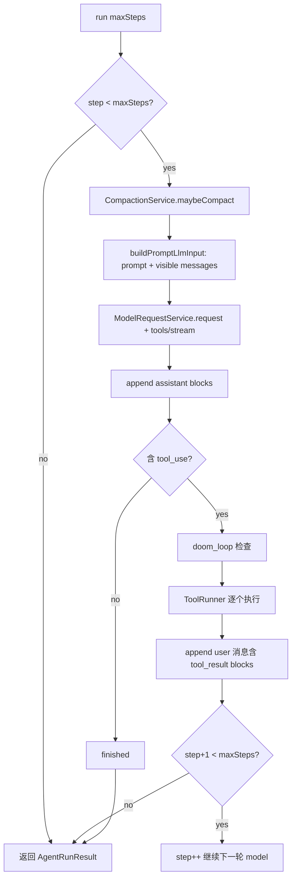

# Agent System 技术规格（SPEC）

## 设计目标

- 在 `@novel-master/core` 实现 **AgentRunner**：`run({ maxSteps })` 驱动多轮 **model round-trip**（一次 LLM 请求 + 本轮 `tool_use` 执行 + `tool_result` 写回）。
- **AgentSession** 端口 + `InMemory` / `ChatMessage` 适配器；Agent 核心不依赖 SQLite。
- 与 **Prompt 引擎**、**Tool 系统**、**scoped VfsService**、**Provider/Adapter** 集成。
- 同一迭代交付：**streaming**、**compaction**、**doom_loop**；**仅 CLI**（`nm agent`）作为应用入口。
- 单步调试与全自动共用实现：`maxSteps = 1` vs `N`，无 `autoContinue`。

**本迭代不考虑向后兼容**：可删除或原地改造现有 API（如 `renderPromptToText`、adapter 的 `chat` 签名）；CLI/单测随新契约一并改，不保留双路径。

## 总体方案

### 现状约束（代码探索）

| 模块 | 现状 | Agent 影响 |
|------|------|------------|
| `MessageService` | `listBySession` / `append`；`ChatMessage.hidden` | Chat 适配器直接复用；列表时过滤 `hidden` |
| `renderPromptToText` | text + chat → 纯文本预览 | **删除**，由 `buildPromptLlmInput` 替代（见下） |
| `ModelRequestService` | `request(..., { history })` | **原地扩展**：`system` / `tools` / `stream`；Agent 与 `nm model request` 共用 |
| `AnthropicProtocolAdapter` | `chat` + `history` | **扩展同一 `chat`**：tools + SSE stream |
| `OpenAiProtocolAdapter` | text-only | 请求含 `tools` 时 **报错 UNSUPPORTED** |
| `ToolRegistry` / `ToolRunner` | 已就绪；`vfs.*` + zod | Agent 构造时 `registerVfsTools` + session scoped VFS |
| `nm model request` | append user → request(history) → append assistant | 是 Agent 单轮的非工具参考实现 |
| `nm prompt render` | worktree + hidden 过滤 | Agent 与之 **语义一致** |
| Agent / compaction / stream | **不存在** | 本迭代新建 |

### 核心流程（AgentRunner.run）



**model round-trip 定义（实现口径）**：

1. 调用 LLM 一次（可流式）。
2. 将返回的 `ContentBlock[]` 写入 **一条** assistant 消息。
3. 对其中每个 `tool_use`：doom 检查 → `ToolRunner.call` → 写入 **一条** `role: user` 消息，内容为 `tool_result` block(s)（与 `anthropic-content-mapper` 一致）。
4. 若本轮无 `tool_use`，或已达 `maxSteps`，则结束本次 `run()`；否则 `step++` 回到 1（把 tool 结果送给模型）。

**与 `maxSteps = 1`（单步调试）**：一次 `run()` 内只做 **1 次** LLM 请求；若模型返回 tool，会执行 tool 并写入 `tool_result`，但 **不会** 自动发起第 2 次 LLM。用户补充输入后再次 `nm agent continue`。

### Prompt 引擎：升级 `buildPromptLlmInput`（替换 `renderPromptToText`）

在 **`packages/core/src/service/prompt/render-prompt.ts`**：**删除** `renderPromptToText`，**新增** `buildPromptLlmInput`：

| PromptBlock | 映射 |
|-------------|------|
| `type: text`, `role: system` | 拼入 `system`（`renderMacro` + dot/root） |
| `type: text`, 其他 role | 默认不进 messages |
| `type: chat` | `ctx.messages`（调用方已过滤 `hidden`） |

```ts
interface PromptLlmInput {
  readonly system?: string;
  readonly messages: readonly ChatMessage[];
}
```

- **Agent**：`parsePromptYaml` → `buildPromptLlmInput` → `ModelRequestService.request`。
- **`nm prompt render`**：`buildPromptLlmInput` → `formatPromptLlmInputForCli` → stdout。

### LLM 层：扩展 `ModelRequestService` + `adapter.chat`

不新建 `AgentLlmService`。扩展 `model-request.port.ts` / `adapter.port.ts`：

```ts
export interface LlmToolDefinition {
  readonly name: string;
  readonly description: string;
  readonly inputSchema: Record<string, unknown>; // JSON Schema
}

export interface LlmStreamEvent =
  | { type: "text-delta"; text: string }
  | { type: "thinking-delta"; text: string }
  | { type: "tool-use"; id: string; name: string; input: Record<string, unknown> }
  | { type: "done"; result: LlmChatResult };

```

`ModelRequestOptions`：`system?`、`tools?`、`stream?`、`onStream?`。`LlmChatRequest` 增加 `system?`、`tools?`。Compaction 摘要走同一 `request`（无 tools）。

**Zod → JSON Schema**：`packages/core/src/infra/llm-protocol/zod-to-json-schema.ts`（最小实现：覆盖 tool 用到的 `z.object/z.string/z.number/z.boolean/z.optional`；不足时 fallback `z.toJSONSchema` 若 zod 版本支持，否则文档化限制）。

### Doom loop

- 常量 `DOOM_LOOP_THRESHOLD = 3`（`packages/core/src/domain/agent/doom-loop.ts`）。
- 在执行每个 `tool_use` 之前，取 session 最近 3 条 **含 tool_use 的 assistant 消息** 中最后一次 assistant 的 tool_use 序列，或简化为：当前 run 内连续 3 次 **同名 + 同 JSON input** 的 tool 执行。
- 实现口径（与 OpenCode `processor.ts` 对齐，便于测试）：**当前 assistant 消息内**最近 3 个 `tool_use` block（已写入但指同轮解析前的列表），若同名同 input → `AgentError("DOOM_LOOP")`。
- 行为：抛错终止 `run()`；CLI 打印可读信息。

### Compaction

新建 `packages/core/src/service/compaction/`：

| 项 | 方案 |
|----|------|
| 触发 | `estimateTokens(messages) > threshold`；`threshold` 来自 `ConfigService.getNumber("agent.compaction.thresholdTokens", 12000)` |
| 估算 | `sum(messageBodyText(m)) / 4`（整数） |
| 动作 | 保留最近 `keepLastN` 条可见消息（默认 6）；更早的 visible 消息 `hideRange`；调用 **同当前 model** 生成摘要（单轮 `ModelRequestService` 无 tools）；append `role: user` 一条，`text` 块以 `[Compaction summary]\n` 开头 |
| 可观测 | `list` 可见条数减少；摘要消息存在；后续 Agent 可继续 |

Compaction 在 **每个 model round-trip 开始前** 调用（`maybeCompact`），避免溢出。

### Streaming

- `ModelRequestService.request(..., { stream: true, onStream })` 驱动流式。
- `AgentRunner` 接受可选 `onStream?: (ev: LlmStreamEvent) => void` 并转发。
- 流式时：累积 `text` / `thinking` / `tool_use`，结束后 **一次性** `append` assistant（与 PRD「最终 message 一致」）；CLI `onStream` 对 `text-delta` 写 stdout。
- Anthropic：SSE `content_block_delta` 等（实现于 `anthropic.adapter.ts`）。
- `--no-stream`（CLI）走 `stream: false`。

### 错误

`packages/core/src/domain/agent/agent-errors.ts`：

- `NOT_FOUND` / `INVALID_ARGUMENT` / `DOOM_LOOP` / `MAX_STEPS` / `UNSUPPORTED_PROVIDER` / `FAILED`

## 最终项目结构

```text
packages/core/src/
  domain/agent/
    agent-errors.ts
    agent-session.port.ts
    agent-run-result.ts          # AgentRunResult, ModelRoundSummary
    doom-loop.ts
  domain/agent/impl/
    in-memory-agent-session.ts
    chat-agent-session.ts
  service/prompt/
    render-prompt.ts             # buildPromptLlmInput, formatPromptLlmInputForCli
  service/agent/
    agent.port.ts                # AgentRunner interface
    create-agent-runner.ts
    impl/
      agent-runner.ts
  service/compaction/
    compaction.port.ts
    impl/default-compaction.service.ts
    token-estimate.ts
  infra/llm-protocol/
    adapter.port.ts              # 扩展 tools + stream
    zod-to-json-schema.ts
    tool-definitions.ts          # registry → LlmToolDefinition[]
    anthropic.adapter.ts         # chat: tools + stream
    openai.adapter.ts            # UNSUPPORTED for tools
    gemini.adapter.ts            # UNSUPPORTED for tools

packages/core/test/agent/
  agent-session.test.ts
  agent-runner.test.ts
  doom-loop.test.ts
  compaction.test.ts

packages/core/test/prompt/
  render-prompt.test.ts          # buildPromptLlmInput + formatPromptLlmInputForCli

packages/core/test/provider/
  model-request-tools-stream.test.ts  # mock fetch

apps/cli/src/agent/
  commands.ts

.apm/kb/docs/Iterations/agent-system/test/
  agent-cli.md                   # cli-test 手工验收
```

## 变更点清单

### 新增（Core）

- `AgentSession` + InMemory + Chat 适配
- `AgentRunner` + `createAgentRunner(deps)`
- `buildPromptLlmInput` + `formatPromptLlmInputForCli`（替换 `renderPromptToText`）
- `ModelRequestService` / `LlmChatRequest` 扩展 tools + stream
- `zod-to-json-schema` + `toolsFromRegistry(registry)`
- `CompactionService`
- `AgentError`
- 导出：`AgentRunner`, `AgentSession`, `createAgentRunner`, `AgentError` 等（`index.ts`）

### 修改（Core）

- `render-prompt.ts`：删除 `renderPromptToText`，新增 `buildPromptLlmInput`
- `model-request.port.ts` / `model-request.service.ts`：options 扩展
- `adapter.port.ts`：`LlmChatRequest` + `LlmStreamEvent`；`chat` 支持 tools/stream
- `anthropic.adapter.ts`：tools + stream
- `apps/cli/src/prompt/commands.ts`：改用新 API
- `packages/core/test/prompt/render-prompt.test.ts`：断言新契约
- `packages/core/package.json`：无新依赖（已有 zod）

### 新增（CLI）

- `apps/cli/src/agent/commands.ts`：`run` / `continue`
- `apps/cli/src/main.ts`：路由 `agent`
- `apps/cli/src/index.ts`：无需改 bin

### 明确不修改

- `nm vfs *`、Tool 系统内部、chat schema DDL
- mobile jest shim

## 详细实现步骤

### 阶段 1：Session + 非流式 Agent 核心

1. 实现 `AgentSession` port、`InMemoryAgentSession`、`ChatAgentSession`（包装 `MessageService` + `sessionId`）。
2. 实现 `buildPromptLlmInput` + `formatPromptLlmInputForCli`，更新 `render-prompt.test.ts` 与 `nm prompt render`。
3. 实现 `zod-to-json-schema`、`toolsFromRegistry`。
4. 扩展 `ModelRequestService` + `AnthropicProtocolAdapter.chat`（tools，非流式）。
5. 实现 `AgentRunner`（`maxSteps`、tool 闭环、无 doom/compaction/stream）。
6. `createAgentRunner` 注入：`MessageService`、`ModelRequestService`、`ToolRegistry`、`ToolRunner`、`VfsToolContext`、`CompactionService`（先 no-op）。

### 阶段 2：CLI

7. `nm agent run --max-steps <n> --prompt-path <p> [--content <text>] [--session] [--project] [--modelId]`
8. `nm agent continue` → `run({ maxSteps: 1 })`；若无 `--content` 且最后一条已是 user 则不再 append。
9. 默认 `maxSteps`：`config agent.maxSteps` 默认 20；continue 固定 1。
10. 使用 `rt.sessionVfs` + `registerVfsTools` 构建 registry/runner。

### 阶段 3：Streaming

11. `AnthropicProtocolAdapter.chat` 流式分支（SSE 解析）。
12. `AgentRunner` 增加 `onStream`；CLI 默认流式输出 text-delta。

### 阶段 4：Doom loop + Compaction

13. `doom-loop.ts` + 接入 Runner。
14. `CompactionService` 实现 + `agent.compaction.*` config 键。
15. Runner 每轮前 `maybeCompact`。

### 阶段 5：测试与文档

16. 补齐单测（≥15 断言点）。
17. 编写 `.apm/kb/docs/Iterations/agent-system/test/agent-cli.md`（真实命令输出）。
18. `npm run build` / `npm test` 全绿。

## 测试策略

### 单元 / 集成（Core）

| 用例 | 要点 |
|------|------|
| InMemory session | append/list 顺序 |
| buildPromptLlmInput | system 宏、chat 用 visible messages |
| formatPromptLlmInputForCli | 与旧 `renderPromptToText` 快照一致（改 API 后一次性对齐测试） |
| AgentRunner maxSteps=1 | mock Llm 返回 tool_use → 执行 1 次、写 tool_result、**无第二次** mock 调用 |
| AgentRunner maxSteps=3 | 两轮 tool 后第三轮 text 结束 |
| doom_loop | 连续 3 次相同 tool → `AgentError` |
| compaction | 阈值调低 → 出现 summary 消息、旧消息 hidden |
| toolsFromRegistry | zod schema 可序列化 |
| ChatAgentSession | sqlite 集成：append 后 `listBySession` 可见 blocks |

Mock 策略：`ModelRequestService` 可注入 port；fetch mock 用于 Anthropic 适配器可选测。

### CLI

| 用例 | 要点 |
|------|------|
| e2e smoke | project → session → agent continue --content → message list 含 assistant |

手工：`agent-cli.md` 六场景（单步、多步、vfs tool、stream、doom、compaction）。

## 风险与回滚方案

| 风险 | 缓解 |
|------|------|
| Anthropic tools+stream 复杂 | 先非流式跑通；stream 分 PR 内阶段 3 |
| OpenAI 无法 Agent+tools | 文档 + `UNSUPPORTED`；验收用 Anthropic |
| Compaction 误隐藏消息 | 仅 hide 旧消息、保留 summary；单测 + CLI 场景 |
**回滚**：删除 `domain/agent`、`service/agent`、`service/compaction`、`apps/cli/src/agent`；git revert prompt/model/adapter 改动；无 DB 迁移。

---

请确认本 `spec.md` 后再进入编码。若需调整：**doom_loop 检测范围**（仅当前 assistant vs 全局）、**compaction 摘要角色**（user vs system）、**非 Anthropic 是否允许无工具 Agent**，请指明。
