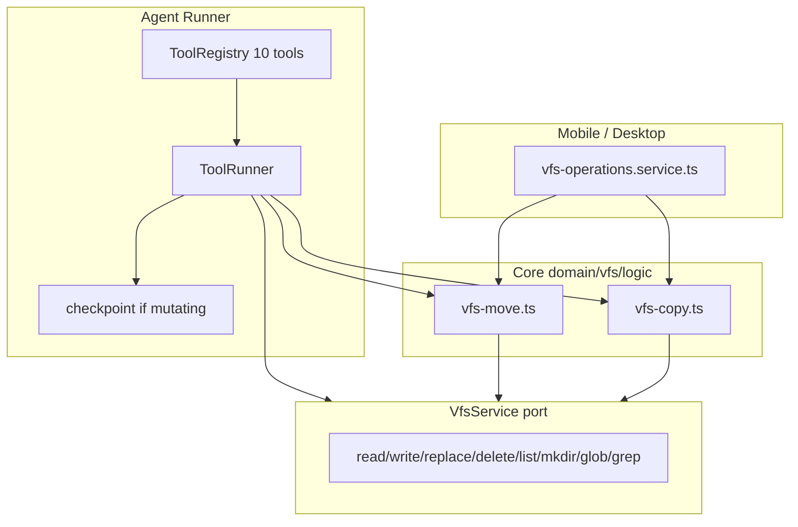

# Agent VFS 工具集（10 工具）技术规格（SPEC）

## 设计目标

- 将 Agent 内置 VFS 工具从 **7 个扩展为 10 个**，覆盖读写、搜索、目录树变更，**不引入 Shell**。
- `vfs.move` 合并 rename/mv；`vfs.delete` 非 recursive 覆盖 rmdir；`vfs.copy` 支持文件与 recursive 目录复制。
- 将 mobile/desktop 重复的 move 逻辑 **下沉到 Core** `domain/vfs/logic/`，Agent 工具与 UI 共用。
- 扩展 mutating 工具集合与 LLM 输出格式化；**不修改** `VfsService` 端口与 CLI 命令。

---

## 现状与约束（代码探索）

| 模块 | 现状 | 本迭代影响 |
|------|------|------------|
| `vfs-tools.ts` | 7 工具；`MUTATING_VFS_TOOL_NAMES` 含 `vfs.delete` 但 **未注册** delete 工具 | 补 3 工具 + 修正 mutating 集合 |
| `VfsService` | `list/mkdir/read/write/replace/glob/grep/delete` 共 8 方法 | **不改端口**；move/copy 为组合实现 |
| `agent-runner.ts` | step 末对 `isMutatingVfsToolName` 触发 checkpoint | 扩展 mutating 名集合即可 |
| mobile/desktop `vfs-operations.service.ts` | 各 ~115 行重复：`renameVfsFile`、`renameVfsDirectory`、`remapPathUnderDir` | 改为 import Core logic |
| `copyVfsTree` | repository 级批量拷贝（session 创建） | **不用于 Agent**；Agent copy 走 VfsService 组合 |
| Agent 工具策略 | `resolveAgentToolRegistry` + `validateAgentToolPolicy` | 注册表变 10 后 T1–T6 自动适配 |
| `format-tool-output.ts` | write/replace → `ok`；其余 JSON | 扩展 `{ ok: true }` 类输出 |
| CLI `nm vfs delete` | 已存在，默认非 recursive | 与 `vfs.delete` 工具默认一致 |
| 测试 | `vfs-tools.test.ts` 覆盖 7 工具；无 delete/move/copy | 扩展 + 新 logic 单测 |

**兼容性原则**

- 现有 7 工具 **name / inputSchema / outputSchema 不变**。
- 未配置 `tools` 的 Agent 自动多 3 个工具（行为扩展，非 breaking）。
- YAML 中若 `allow` 显式枚举旧 7 名，不会自动获得新工具（符合 allow 语义）。

---

## 总体方案

### 工具清单（定稿 10 个）

```
vfs.read      vfs.write     vfs.replace   vfs.delete
vfs.glob      vfs.grep      vfs.list      vfs.mkdir
vfs.move      vfs.copy
```

### 架构



### 各工具契约（新增/强调部分）

#### `vfs.delete`（新增）

```typescript
// input
{ path: string; options?: { recursive?: boolean } }
// output
{ ok: true }
// run: ctx.vfs.delete(path, { recursive: options?.recursive ?? false })
```

- 默认 **非 recursive**（与 CLI、`rmdir` 语义一致；区别于 mobile UI delete 默认 recursive）。
- description 明确：「Delete a file or empty directory; set recursive to remove a directory tree」。

#### `vfs.move`（新增）

```typescript
// input
{ from: string; to: string }
// output
{ ok: true }
```

- 实现：`moveVfsPath(vfs, from, to)`（Core logic）
  - 若 `from` 为文件：`read → write(to) → delete(from)`（等同现 `renameVfsFile`）
  - 若 `from` 为目录：`list recursive` + 逐文件 move + mkdir 目标目录链 + delete 源目录行（等同现 `renameVfsDirectory`）
  - 判定 file vs directory：先 `list(from)` 非 recursive；若返回空且 `read(from)` 成功则为文件；若 `list` 有子项或存在 directory 行则为目录；若均 NOT_FOUND 则失败
  - **简化判定（SPEC 锁定）**：`try read(from)` 成功 → 文件 move；否则 `list(from, { recursive: true })` 非空或存在 `from` directory 行 → 目录 move；否则 NOT_FOUND

#### `vfs.copy`（新增）

```typescript
// input
{ from: string; to: string; options?: { recursive?: boolean } }
// output
{ ok: true }
```

- 实现：`copyVfsPath(vfs, from, to, options)`
  - **文件**：`read(from)` → `write(to, content, { versionCheck: false })`
  - **目录 + `recursive: true`**：`list(from, { recursive: true })` → 对所有 file 执行 read/write 到 `remapPathUnderDir`；对所有 directory 行 `mkdirIgnoreExists` 于目标树
  - **目录 + 默认非 recursive**：失败并提示需 `recursive: true`（`ToolError` FAILED + 可读 message，或 VfsError 包装）
  - **不删除源**

#### Mutating 集合（更新）

```typescript
export const MUTATING_VFS_TOOL_NAMES = new Set([
  "vfs.write",
  "vfs.replace",
  "vfs.delete",
  "vfs.mkdir",
  "vfs.move",
  "vfs.copy",
]);
```

---

## 最终项目结构

```
packages/core/src/
  domain/vfs/logic/
    vfs-move.ts              # moveVfsPath, remapPathUnderDir, normalizeDirPath, mkdirIgnoreExists
    vfs-copy.ts              # copyVfsPath（依赖 remapPathUnderDir）
  domain/tool/builtin/
    vfs-tools.ts             # +delete/move/copy；更新 mutating
  domain/tool/logic/
    format-tool-output.ts    # { ok: true } → "ok"

packages/core/test/
  vfs/vfs-move.test.ts
  vfs/vfs-copy.test.ts
  tool/vfs-tools.test.ts     # +delete/move/copy cases

apps/mobile/src/services/
  vfs-operations.service.ts  # import moveVfsPath from core；删除重复实现

apps/desktop/src/main/services/
  vfs-operations.service.ts  # 同上

packages/core/src/index.ts   # export moveVfsPath, copyVfsPath, remapPathUnderDir（供 UI）
```

可选（非必须）：`apps/mobile/src/components/agent/AgentEditorForm.tsx` 提示文案更新为「10 个 vfs.* 工具」。

---

## 变更点清单

### Core — 新增

| 文件 | 职责 |
|------|------|
| `domain/vfs/logic/vfs-move.ts` | 从 mobile 提取并泛化：`moveVfsPath`、`remapPathUnderDir`、`normalizeDirPath`、`mkdirIgnoreExists` |
| `domain/vfs/logic/vfs-copy.ts` | `copyVfsPath`：文件 copy + recursive 目录 copy |
| `test/vfs/vfs-move.test.ts` | 文件/目录 move、NOT_FOUND |
| `test/vfs/vfs-copy.test.ts` | 文件 copy、recursive 目录、非 recursive 目录失败 |

### Core — 修改

| 文件 | 改动 |
|------|------|
| `domain/tool/builtin/vfs-tools.ts` | 注册 delete/move/copy；`createVfsTools` 返回 10 项；更新 mutating 集合 |
| `domain/tool/logic/format-tool-output.ts` | `{ ok: true }` 格式化为 `"ok"` |
| `test/tool/vfs-tools.test.ts` | delete/move/copy 集成测；registry 长度 10 |
| `test/agent/agent-tool-policy.test.ts` | `vfsRegistryNames()` 期望 10（动态 list 已自适应，确认 T1 仍过） |
| `src/index.ts` | export `moveVfsPath`, `copyVfsPath`, `remapPathUnderDir` |

### Apps — 修改

| 文件 | 改动 |
|------|------|
| `apps/mobile/.../vfs-operations.service.ts` | `renameVfsFile` → `moveVfsPath`（文件）；`renameVfsDirectory` → `moveVfsPath`；删除本地重复 helper |
| `apps/desktop/.../vfs-operations.service.ts` | 同上 |

### 明确不改

- `VfsService` port、`DefaultVfsService`、CLI vfs 命令
- `DefaultAgentRunner` 签名（仅 mutating 集合变化）
- Agent YAML schema

---

## 详细实现步骤

### M1 — Core move/copy logic + 单测

1. 创建 `vfs-move.ts`：从 `apps/mobile/src/services/vfs-operations.service.ts` 迁移逻辑，改为纯 `VfsService` 依赖，导出 `moveVfsPath`。
2. 创建 `vfs-copy.ts`：实现 `copyVfsPath`（复用 `remapPathUnderDir`、`mkdirIgnoreExists`）。
3. 编写 `vfs-move.test.ts`、`vfs-copy.test.ts`（内存 SQLite + sessionVfs，对齐 PRD R4–R6）。

### M2 — Agent 工具注册

1. 在 `vfs-tools.ts` 增加 `delete` / `move` / `copy` 三个 `Tool` 定义（zod schema 见上）。
2. 更新 `MUTATING_VFS_TOOL_NAMES`（含 mkdir）。
3. 扩展 `format-tool-output.ts`。
4. 扩展 `vfs-tools.test.ts`（R1–R3、mutating R7）。
5. `index.ts` 导出新函数。

### M3 — UI 去重

1. mobile/desktop `vfs-operations.service.ts` 改为调用 Core `moveVfsPath`。
2. 保留 `createVfsFile` / `deleteVfsEntry` 等 UI 便捷函数（delete 仍可调 `vfs.delete`，UI 默认 recursive 行为**不变**）。

### M4 — 回归

1. `npm test`（core 全量 + mobile/desktop 若有 vfs 相关测）。
2. 手工：`nm agent run` 或 mobile Agent 调用 move/copy/delete（可选 smoke）。

---

## 测试策略

### 单元 / 集成（Core）

- logic 层与 tool 层分开测：logic 不经过 ToolRunner；tools 测 schema + runner 集成。
- 错误路径：`NOT_FOUND`、`DIRECTORY_NOT_EMPTY`、copy 目录未 recursive。
- checkpoint：可选在 `agent-runner.test.ts` 增 1 例「move 后 capture」（若现有 write 覆盖足够可省略）。

### 测试用例

| ID | Given | When | Then |
|----|-------|------|------|
| A1 | 空 registry | registerVfsTools | list.length === 10 |
| A2 | `/f.txt` | vfs.delete non-recursive | 文件消失 |
| A3 | `/d/f.txt` | vfs.delete `/d` non-recursive | 失败；子文件仍在 |
| A4 | `/d/f.txt` | vfs.delete `/d` recursive | 子树消失 |
| A5 | `/a.md` | vfs.move → `/b.md` | 内容迁移 |
| A6 | `/src/**` | vfs.move `/src` → `/dst` | 树迁移；src 清空 |
| A7 | `/src/x.md` | vfs.copy recursive → `/dst` | 双份存在 |
| A8 | `/src` 目录 | vfs.copy 无 recursive | 失败 |
| A9 | mutating 集合 | isMutatingVfsToolName | read/list/glob/grep 为 false |
| A10 | allow 仅 read | call vfs.move | NOT_FOUND |
| A11 | mobile rename | moveVfsPath | 与 A5/A6 同路径结果 |

---

## 风险与回滚方案

| 风险 | 缓解 | 回滚 |
|------|------|------|
| file/directory 判定边缘（路径既是文件又有子路径） | 遵循 VFS 首期约定（同路径不可冲突）；单测覆盖 | 回退 move 仅支持文件 |
| move/copy 中途失败导致半棵树 | 与现 rename 相同；后续可事务化（本迭代不做） | 文档说明；用户 checkpoint 回滚 |
| Agent delete 默认 non-recursive 与 UI delete 默认 recursive 不一致 | 工具 description + prompt 说明；UI 不改 | 工具 default 改 recursive（不推荐） |
| 注册表 7→10 影响显式 allow 列表 | 文档说明需人工更新 YAML | 无自动迁移 |

**功能回滚**：从 `createVfsTools` 移除 3 个新工具并 revert logic 提取；UI 可保留 Core import 或恢复本地副本。

---

## 不在本迭代

- Shell / 命令解释器
- `VfsService.move` / `VfsService.copy` 端口级原生 API
- CLI `nm vfs move|copy` 子命令
- LLM 工具别名层

---

**请确认本 SPEC 后再进入编码。**
