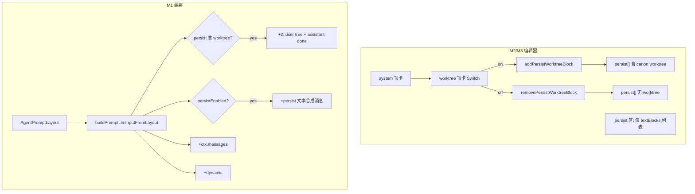

# Agent 工作树块 UI 与双消息注入 技术规格（SPEC）

> **PRD**：`.apm/kb/docs/Iterations/agent-worktree-block-ui/prd.md`  
> **Supersede**：`vfs-user-ops-unified-tool-turn` 中 worktree **单消息 + role 下拉 + persist 菜单添加** 的 UI/运行时表述；快照刷新仍遵循 `message-worktree-refresh-tighten`  
> **建议分支**：`feature/agent-worktree-block-ui`

## 设计目标

1. **UI**：system 下方独立工作树顶卡（Switch 对齐 system）；persist/dynamic「添加」仅文本块；双端 parity。
2. **Wire 不变**：worktree 仍为 `persist[]` 内 `type: worktree`（键 `canon`）；顶卡 Switch 映射块有无；**无**顶层 `worktreeEnabled` 字段。
3. **运行时**：存在 worktree 块 → 固定注入 **user 文件树 + assistant `【done】`**；**与 `persistEnabled` 解耦**；忽略 wire `role`。
4. **默认关**：新建 Agent、`createDefaultAgentEditorPrompts`、`examples/agents.yaml` writer **均无** worktree 块。
5. **不修改**：worktree 快照 markDirty、`{{$filetree}}` 宏、chat 区 `tool_turn_bridge` 落库逻辑。

## 总体方案



### 组装顺序（LLM messages 数组）

相对 `buildPromptLlmInputFromLayout` 输出 `messages`（**不含** API `system` 字段）：

| 序号 | 条件 | 内容 |
|------|------|------|
| 1 | `persist` 含 worktree 块 | `user`：`worktreeDisplay` |
| 2 | 同上 | `assistant`：`TOOL_TURN_BRIDGE_TEXT`（`【done】`） |
| 3 | `persistEnabled === true` | 遍历 `persist` 中 **`type: "text"`** 块（保持数组内相对顺序） |
| 4 | 始终 | `ctx.messages`（非 hidden） |
| 5 | `dynamicEnabled === true` | dynamic 文本块（含 lifecycle 过滤） |

> **顺序变更说明**：worktree 双消息**固定紧接在 persist 文本区之前**（数组最前），不再混排在 `persist[]` 遍历顺序中。旧 YAML 若 `persona` 在 `canon` 之后，升级后变为「worktree 对 → persona」（与旧「persona → canon」不同）；属可接受行为变更（PRD 未要求保留混排顺序）。

### 预览 segment 顺序（`buildPromptAssemblyFromLayout`）

相对 `buildPromptAssemblyFromLayout` 输出 `segments`（Prompt 预览 / CLI 文本 / token 计数共用）：

| 序号 | 条件 | segment `id` | `role` | `body` |
|------|------|--------------|--------|--------|
| 1 | `layout.system` 非空 | `system` | `system` | `layout.system` |
| 2 | `persist` 含 worktree 块 | `prompt-worktree-${block.name}` | `user` | `worktreeDisplay` |
| 3 | 同上 | `prompt-worktree-${block.name}-done` | `assistant` | `TOOL_TURN_BRIDGE_TEXT` |
| 4 | `persistEnabled === true` | `persist-${block.name}` | `block.role` | `block.content`（仅 `type: "text"`） |
| 5 | 始终 | `chat-${message.id}-*` | 消息 role | 格式化正文 |
| 6 | `dynamicEnabled === true` | `dynamic-${block.name}` | `block.role` | 宏展开后正文 |

> **与 LLM 对齐**：序号 2–3 与「组装顺序」表序号 1–2 一一对应；**不受** `persistEnabled` 门控（与 persist 文本 segment 解耦）。旧预览 id `persist-worktree-${name}` 单段合并语义废弃，改为上表两段。

### `computeLlmExportZonesFromLayout`

`persistCount` = **前缀 persist 区消息总数**：

```text
persistCount = (hasWorktree ? 2 : 0) + (persistEnabled ? textBlockCount : 0)
```

`dynamicCount` 逻辑不变。

## 最终项目结构

```
packages/core/src/
  service/prompt/render-prompt.ts              # 双消息 + 解耦 + assembly 预览两段
  domain/prompt/logic/validate-agent-prompt-layout.ts  # 末块校验排除 worktree
  config-forms/agent/agent-editor-state.ts     # HINT、excludeWorktree 计数、废弃 role API
  service/chat/impl/append-tool-turn-bridge.ts # TOOL_TURN_BRIDGE_TEXT（只读引用）

packages/core/test/
  prompt/render-prompt.test.ts
  prompt/validate-agent-prompt-layout.test.ts
  prompt/agent-prompt-layout-assembly.test.ts
  prompt/normalize-for-llm-export.test.ts
  config-forms/agent-editor-state.test.ts
  agent/agent-runner-template-blocks.test.ts

examples/agents.yaml                            # 移除 writer.persist.canon

apps/desktop/renderer/features/settings/
  AgentDefinitionEditorForm.tsx                 # 顶卡 + 列表仅 text
  AgentEditorView.tsx                           # 同上（双份同步）

apps/mobile/src/components/agent/
  AgentEditorForm.tsx                           # 顶卡 + 列表仅 text

apps/cli/test/
  agents-bundle.test.ts                         # T8 改写

apps/desktop/test/                              # 可选
  agent-prompt-worktree-ui.test.tsx

apps/mobile/__tests__/                          # 可选
  agent-editor-form.worktree.test.tsx
```

## 变更点清单

| 模块 | 文件 | 变更 |
|------|------|------|
| Core 组装 | `render-prompt.ts` | `syntheticWorktreePair`；worktree 与 persist 文本分路；`buildPromptAssemblyFromLayout` 预览两段 |
| Core zones | `render-prompt.ts` | `computeLlmExportZonesFromLayout` 按上式计 `persistCount` |
| Core 校验 | `validate-agent-prompt-layout.ts` | 末块 assistant **仅 text**；`persistEnabled` 时至少一块 **text**（worktree-only 不允许开启 persist） |
| Core 表单 | `agent-editor-state.ts` | 更新 `WORKTREE_BLOCK_HINT`、`PROMPT_REGION_LABELS.layoutOrder`；`updatePersistWorktreeRole` 标记 `@deprecated`；`countFormPromptSources` 在 **persist 文本块**删除 guard 时传 `excludeWorktree: true` |
| 种子 | `examples/agents.yaml` | 删除 `writer.prompts.persist.canon` |
| Desktop UI | `AgentDefinitionEditorForm.tsx`、`AgentEditorView.tsx` | system 下顶卡；`textBlocks` 列表；菜单去 worktree |
| Mobile UI | `AgentEditorForm.tsx` | 同上 |

## API 契约

### Wire（不变）

```yaml
prompts:
  persistEnabled: false   # 可选
  persist:
    canon: { type: worktree }   # 可选；存在即「工作树开」
    persona: { type: text, role: user, content: "..." }
```

- `role` 在 worktree 块上 **仍可读写**（兼容旧 YAML），**运行时忽略**。
- 至多一个 worktree 块（现有校验保留）。

### 合成消息 ID

| 消息 | id | role | content |
|------|-----|------|---------|
| 文件树 | `prompt:worktree:${block.name}` | `user` | `worktreeDisplay` |
| done | `prompt:worktree:${block.name}:done` | `assistant` | `TOOL_TURN_BRIDGE_TEXT` |

`metadata`：与现有 `syntheticTemplateMessage` 一致（无特殊 kind）；**不**使用 `tool_turn_bridge` kind（该 kind 仅 chat 落库桥接）。

### 注入门控

| 块类型 | 条件 |
|--------|------|
| worktree 对 | `layout.persist.some(b => b.type === "worktree")` |
| persist 文本 | `layout.persistEnabled === true` |
| dynamic 文本 | `layout.dynamicEnabled === true`（现有 lifecycle 规则） |

### 编辑器状态

| UI | 读写 |
|----|------|
| worktree Switch `checked` | `splitPersistBlocksForEditor(persist).worktree != null` |
| Switch ON | `addPersistWorktreeBlock(persist)` |
| Switch OFF | `removePersistWorktreeBlock(persist)`（**禁止**调用 `guardPromptBlockDeletion`） |
| persist 列表 | 仅渲染 `textBlocks`；`movePersistTextBlock` / `deletePersistTextBlock`（删除文本块时 **才** 走 guard，且 `countFormPromptSources(..., { excludeWorktree: true })`） |

### 文案常量

```typescript
// agent-editor-state.ts — 替换 WORKTREE_BLOCK_HINT
// 「开启后每轮在会话前注入：用户侧项目文件树 + 助手侧 done 确认（【done】）。」
// 不提及 role、canon、末块 assistant。
```

## 兼容性与迁移

| 场景 | 行为 |
|------|------|
| 旧 DB/YAML 含 `persist.canon` | 直接加载；Switch 开；双消息注入；**无**迁移脚本 |
| 内置 `examples/agents.yaml` | **删除** canon；新装环境默认关 |
| wire `role: assistant` on canon | 加载保留；运行时仍 user+done |
| `persistEnabled=true` 仅 worktree、无文本 | **校验失败**（至少一块 persist **文本**）；保存时校验错误信息已足够指引用户；专用 toast **不在本迭代**（非 blocking，留后续）；用户可（a）添加文本块，或（b）关闭持久区 Switch，或（c）关闭工作树顶卡后保存（移除 canon）——**无需** wire 迁移，再保存即通过校验 |
| 关 worktree Switch | 从 `persist[]` **移除** worktree 块（非仅 UI 关断） |

## 详细实现步骤

### M1 — Core

- Step 1 — phase-render-dual — blocking: yes — qa: auto：在 `render-prompt.ts` 实现 `appendWorktreePairIfPresent`（user + done）；`buildPromptLlmInputFromLayout` / `buildPromptAssemblyFromLayout` 按「组装顺序」表与「预览 segment 顺序」表分路；删除对 `block.role` 的运行时读取。`done` 文案引用 `TOOL_TURN_BRIDGE_TEXT`（`packages/core/src/service/chat/impl/append-tool-turn-bridge.ts`，经 `@novel-master/core/chat` 导出）。
  - **验收清单**：`persistEnabled=false` 且 persist 含 worktree 块时，`buildPromptLlmInputFromLayout` **与** `buildPromptAssemblyFromLayout` **均**输出连续 user 树 + assistant done 两段（T-WT4、T-WT4b、T-WT6）；预览 segment id 为 `prompt-worktree-${name}` / `prompt-worktree-${name}-done`。
- Step 2 — phase-export-zones — blocking: yes — qa: auto：更新 `computeLlmExportZonesFromLayout`；同步 `normalize-for-llm-export` 相关测试。
- Step 3 — phase-validate — blocking: yes — qa: auto：`validateAgentPromptLayout` 末块校验仅 `type==="text"`；`persistEnabled` 时 `textBlocks.length >= 1`。
- Step 4 — phase-editor-state — blocking: yes — qa: auto：更新 `WORKTREE_BLOCK_HINT`；`PROMPT_REGION_LABELS.layoutOrder` 改为含工作树（如 `系统 → 工作树 → 持久区 → 会话历史 → 动态区`）；`updatePersistWorktreeRole` 标 `@deprecated`。`countFormPromptSources(..., { excludeWorktree: true })` **仅**用于 persist **文本块**删除 guard；工作树顶卡 Switch on/off **禁止**调用 `guardPromptBlockDeletion`。
- Step 5 — phase-seed — blocking: yes — qa: auto：删除 `examples/agents.yaml` 中 `writer.persist.canon`；改写 `apps/cli/test/agents-bundle.test.ts` T8。
- Step 6 — phase-core-tests — blocking: yes — qa: auto：通过 T-WT1～T-WT19（见下表）。

### M2 — Desktop UI

- Step 7 — phase-desktop-ui — blocking: yes — qa: auto：`AgentDefinitionEditorForm.tsx` 与 `AgentEditorView.tsx` 同步：system 下工作树顶卡；persist 列表用 `textBlocks`；persist/dynamic「添加」直链新增文本块，已移除 ContextMenu 二级菜单；移除 role/排序/嵌套 worktree 子卡。工作树 Switch off 直接 `removePersistWorktreeBlock`，**不**经 `guardPromptBlockDeletion`；persist 文本删除仍走 guard 且 `excludeWorktree: true`。

### M3 — Mobile UI

- Step 8 — phase-mobile-ui — blocking: yes — qa: auto：`AgentEditorForm.tsx` 同 Step 7 语义；persist/dynamic「添加」直链新增文本块，已移除 BottomSheet 二级菜单。`deletePersist` 改用 `deletePersistTextBlock`（替代手写 `blocks.filter`）；工作树 Switch off 直接 `removePersistWorktreeBlock`，**不**经删除 guard。

### 可选增强

- Step 9 — phase-desktop-ui-test — blocking: no — qa: auto：新增 `agent-prompt-worktree-ui.test.tsx`（T-WT23）。
- Step 10 — phase-mobile-ui-test — blocking: no — qa: auto：新增 `agent-editor-form.worktree.test.tsx`（T-WT24）。
- Step 11 — phase-manual-preview — blocking: no — qa: manual_user：Desktop/Mobile 打开 Writer Agent，开工作树 Switch，Prompt 预览见 user 树 + assistant done（合并后用户验收）。

## 测试策略

### 验证命令

```bash
# M1 门禁
npm run build -w @novel-master/core
npm run test:fast -w @novel-master/core -- \
  test/prompt/render-prompt.test.ts \
  test/prompt/validate-agent-prompt-layout.test.ts \
  test/prompt/agent-prompt-layout-assembly.test.ts \
  test/prompt/normalize-for-llm-export.test.ts \
  test/config-forms/agent-editor-state.test.ts \
  test/agent/agent-runner-template-blocks.test.ts

npm run build -w @novel-master/cli
npm test -w @novel-master/cli -- test/agents-bundle.test.ts

# M2/M3
npm run build:main -w @novel-master/desktop
npm test -w @novel-master/desktop
npm run build -w @novel-master/mobile
npm test -w @novel-master/mobile
```

### 测试用例

| ID | blocking | 映射 Step | 描述 |
|----|----------|-----------|------|
| T-WT1 | yes | 3 | persist 开：文本末块非 assistant → 失败（worktree 不参与末块判断） |
| T-WT2 | yes | 3 | persist 开：文本末块 assistant + 存在 worktree → 通过 |
| T-WT3 | yes | 3 | persist 开：仅 worktree、无文本 → 失败 |
| T-WT4 | yes | 1 | 有 worktree → `buildPromptLlmInputFromLayout` messages 连续 user(WT) + assistant(`TOOL_TURN_BRIDGE_TEXT`) |
| T-WT4b | yes | 1 | 有 worktree → `buildPromptAssemblyFromLayout` 连续两段 segment（id `prompt-worktree-${name}` / `prompt-worktree-${name}-done`）；`persistEnabled=false` 时预览仍含双段 |
| T-WT5 | yes | 1 | 无 worktree → 无双消息 |
| T-WT6 | yes | 1 | `persistEnabled=false` + worktree → 仅双消息，无 persist 文本 |
| T-WT7 | yes | 1 | wire `role: assistant` on canon → 仍 user+done |
| T-WT8 | yes | 1 | 全 layout 顺序：worktree 对 → persist 文本 → chat → dynamic |
| T-WT9 | yes | 2 | `persistCount` 含 worktree 的 2 条；export merge 正确 |
| T-WT10 | yes | 4 | `createDefaultAgentEditorPrompts` persist 无 worktree |
| T-WT11 | yes | 4 | `addPersistWorktreeBlock` / `remove` round-trip |
| T-WT12 | yes | 4 | `definitionToForm` 含 canon → 表单可 derive Switch 开 |
| T-WT13 | yes | 4 | `WORKTREE_BLOCK_HINT` 新文案断言 |
| T-WT14 | yes | 5 | `examples/agents.yaml` writer 无 `persist.canon` |
| T-WT15 | yes | 5 | `agents-bundle.test.ts` writer 无 worktree |
| T-WT16 | yes | 6 | 改写原 T5/R3：`persistEnabled=true` + 仅 worktree 块 + 会话 1 条 user 消息 → `history.length === 3`；`history[0].id === "prompt:worktree:canon"`、`messageBodyText(history[0]) === worktreeDisplay`；`history[1].id === "prompt:worktree:canon:done"`、`messageBodyText(history[1]) === TOOL_TURN_BRIDGE_TEXT`；`history[2]` 为会话 user 消息。R3 多步：每步 `history` 均含上述两条 worktree 合成消息 |
| T-WT17 | no | 9 | Desktop 顶卡默认关、菜单无「工作树」 |
| T-WT18 | no | 10 | Mobile 同上 parity |
| T-WT19 | no | 11 | manual_user：真机 Prompt 预览双段可见 |

### PRD 验收矩阵

| PRD | 测试 |
|-----|------|
| A1–A2 | Step 7/8 + T-WT17/18 |
| A3 | Step 7/8 |
| A4–A6 | T-WT10–T-WT12 |
| A7 | T-WT14–T-WT15 |
| B1–B3 | T-WT4–T-WT4b、T-WT6、T-WT16 |
| B4 | T-WT7、T-WT12 |
| C1 | T-WT17/18 或 manual |
| C2 | T-WT1–T-WT3 |
| D1 | 不新增失败（现有 worktree 刷新测不动） |

## 风险与回滚方案

| 风险 | 缓解 | 回滚 |
|------|------|------|
| persist 文本与 worktree 顺序变更 | SPEC 已文档化；T-WT8 锁定新顺序 | revert `render-prompt.ts` |
| `persistCount` 错位导致 export merge 错误 | T-WT9 + `normalize-for-llm-export` | revert zones 计算 |
| Desktop 双表单漏改 | Step 7 明确两文件；同 diff checklist | — |
| `persistEnabled=true` 仅 worktree 历史数据 | T-WT3 拒绝保存；编辑器提示用户加文本块、关 persist 或关工作树后重存（SPEC 兼容性表） | — |
| 删除 guard 误拦工作树关断 | 顶卡 Switch off **禁止** `guardPromptBlockDeletion`；`excludeWorktree` 仅 persist 文本删除 | — |

> **实现注（persist-only-worktree 保存 UX）**：本迭代不实现专用保存 toast；`buildAgentDefinitionFromForm` / `validateAgentPromptLayout` 返回的校验错误信息已足够，专用 toast 留后续迭代（非 blocking）。

**回滚**：按 M3→M2→M1 revert PR；wire 未变，旧客户端读新数据仍合法（仅多/少双消息行为差异）。

---

## Context Bundle（供 code-dev-loop）

```yaml
iteration_name: agent-worktree-block-ui
requirement_path: .apm/kb/docs/Iterations/agent-worktree-block-ui/prd.md
spec_path: .apm/kb/docs/Iterations/agent-worktree-block-ui/spec.md
explore_summary: wire 不变；render-prompt 双消息+解耦；UI split textBlocks；默认关+去 canon
impact_files:
  - packages/core/src/service/prompt/render-prompt.ts
  - packages/core/src/domain/prompt/logic/validate-agent-prompt-layout.ts
  - packages/core/src/config-forms/agent/agent-editor-state.ts
  - examples/agents.yaml
  - apps/desktop/renderer/features/settings/AgentDefinitionEditorForm.tsx
  - apps/desktop/renderer/features/settings/AgentEditorView.tsx
  - apps/mobile/src/components/agent/AgentEditorForm.tsx
constraints:
  - TOOL_TURN_BRIDGE_TEXT 复用
  - 无 worktreeEnabled wire 字段
  - 快照刷新策略不改
blocking_steps: [1,2,3,4,5,6,7,8]
```
