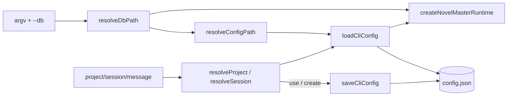

# CLI 默认 Project / Session 技术规格（SPEC）

## 设计目标

- 在 **CLI 层**（`apps/cli`）引入与 DB 同目录的 **`config.json`**，持久化 `currentProjectId` / `currentSessionId`。
- 提供 **`nm project use`**、**`nm session use`**；**create** 成功后自动写入 current。
- 所有需要 `--project` / `--session` 的子命令：flag **>** config **>** 明确报错。
- **零 `@novel-master/core` 变更**（校验用已有 `ProjectService.get` / `SessionService.get`）。

## 现状与约束（代码探索）

| 项 | 现状 | 本 feature |
|----|------|------------|
| `apps/cli/src/main.ts` | `project vfs` 在 main 内 `require --project`；`session`/`message` 在各自 commands 内校验 | 统一改为 scope resolver |
| `project/commands.ts` | `requireProjectFlag` 仅读 flag；`create` 只 `console.log(id)` | + `use`；create/delete 联动 config |
| `session/commands.ts` | 入口 `requireProject(flags)`；`requireSession` 仅 flag | resolver；`use`；create/delete 联动 config |
| `message/commands.ts` | 入口强制 `--session` | resolver |
| `runtime.ts` | `resolveDbPath`：`NOVEL_MASTER_DB` > `--db` > `./.novel-master/novel.db` | + `resolveConfigPath(dbPath)` |
| `vfs/parse-args.ts` | 已有 `--project` / `--session` flag 解析 | 复用，不改解析器 |
| core | `ProjectService.get` / `SessionService.get` 已存在 | `session use` 用 `get` 取 `projectId` |
| 测试 | `chat-smoke-e2e.test.ts`、`vfs-e2e.test.ts` | 新增 `cli-context-e2e.test.ts` |

**兼容性**：纯 CLI 增强；无 DB schema 变更。旧脚本显式传 `--project`/`--session` 行为不变。

---

## 总体方案

### 数据流



### 配置文件

**路径**：`join(dirname(resolve(dbPath)), "config.json")`

与 `runtime.ts` 中 `mkdir(dirname(dbPath))` 一致；DB 在 `./.novel-master/novel.db` 时 config 为 `./.novel-master/config.json`。

**Schema**（`apps/cli/src/config/cli-config.ts`）：

```typescript
export interface CliConfig {
  readonly currentProjectId?: string;
  readonly currentSessionId?: string;
}
```

**读写**

- `loadCliConfig(path): Promise<CliConfig>` — 文件不存在 → `{}`；JSON 解析失败 → 抛 `CliConfigError`（可判定 message）。
- `saveCliConfig(path, patch: Partial<CliConfig>): Promise<void>` — 读-合并-写；**原子写**：`config.json.<pid>.tmp` → `rename` 到 `config.json`（同目录）。
- 空字符串与 `undefined` 均视为「未设置」；写入时删除键或写 `""`（实现统一为一种，推荐 **省略键**）。

### Scope 解析（`apps/cli/src/config/resolve-scope.ts`）

```typescript
export class CliScopeResolver {
  constructor(
    private readonly config: CliConfig,
    private readonly hints: { configPath: string },
  ) {}

  /** flag --project > config.currentProjectId */
  resolveProjectId(flags: ReadonlyMap<string, string | true>): string;

  /** flag --session > config.currentSessionId */
  resolveSessionId(flags: ReadonlyMap<string, string | true>): string;

  /** 两者均 resolve；用于 session vfs / records / snapshot */
  resolveProjectSession(
    flags: ReadonlyMap<string, string | true>,
  ): { projectId: string; sessionId: string };
}
```

**错误文案（锁定）**

| 缺失 | 消息要点 |
|------|----------|
| project | `Missing --project <id> (or run: nm project use --project <id>)` |
| session | `Missing --session <id> (or run: nm session use --session <id>)` |

### Runtime 扩展（`apps/cli/src/runtime.ts`）

`NovelMasterRuntime` 增加字段：

```typescript
export interface NovelMasterRuntime {
  // ...existing
  readonly configPath: string;
  readonly scope: CliScopeResolver;

  /** 合并写入 config 并刷新内存中的 resolver 视图 */
  setCliContext(patch: Partial<CliConfig>): Promise<void>;
}
```

`createNovelMasterRuntime`：

1. `dbPath = resolve(resolveDbPath(argv))`
2. `configPath = resolveConfigPath(dbPath)`
3. `config = await loadCliConfig(configPath)`
4. 构造 `scope = new CliScopeResolver(config, { configPath })`
5. `setCliContext` 实现：`saveCliConfig` + 更新闭包内 config 对象（或重建 resolver）

### 子命令行为（锁定）

#### `nm project use`

```text
nm project use --project <id>
```

- `projects.get(id)` 不存在 → `ChatError` NOT_FOUND 透传。
- 写入 `{ currentProjectId: id }`。
- **若** `currentSessionId` 已设且该 session 的 `project_id !== id` → **清除** `currentSessionId`（PRD 推荐方案）。
- 若 session 属于同一 project → 可保留 session（实现：总是清除更简单且安全 → **spec 锁定：project use 始终清除 currentSessionId**）。

#### `nm session use`

```text
nm session use --session <id>
```

- `sessions.get(id)` → 取 `session.projectId`。
- 写入 `{ currentProjectId: session.projectId, currentSessionId: id }`。

#### `nm project create`

- 成功后 `setCliContext({ currentProjectId: p.id, currentSessionId: undefined })`（清除 session，避免跨 project 残留）。

#### `nm session create`

- `projectId = scope.resolveProjectId(flags)`（可省略 `--project` 当 config 有 current）。
- 成功后 `setCliContext({ currentProjectId: projectId, currentSessionId: s.id })`。

#### `nm project delete` / `copy`

- `id = scope.resolveProjectId(flags)`（可省略 `--project`）。
- **delete**：若 `id === config.currentProjectId` → 清除 `currentProjectId` 与 `currentSessionId`。
- **copy**：不自动 use 新项目（仅 `create`/`use` 改 current）；输出新 id。

#### `nm session delete` / `copy`

- `sessionId = scope.resolveSessionId(flags)`；project 仍通过 `resolveProjectId` 用于 list/create 等。
- **delete**：若删 current session → 清除 `currentSessionId`；若删的 session 属于 current project 且为 current session，已覆盖。

#### `nm message *` / `nm project vfs` / `nm session *`

- 全部改用 `runtime.scope`，不再本地 `requireProjectFlag`。

#### `main.ts` — `project vfs`

```typescript
// 替换 flags.get("project") 硬校验
const projectId = rt.scope.resolveProjectId(parseCliArgs(rest).flags);
await runProjectVfs((id) => rt.projectVfs(id), projectId, rest);
```

---

## 最终项目结构

```text
apps/cli/src/
  config/
    cli-config.ts          # CliConfig 类型、load/save、resolveConfigPath
    resolve-scope.ts       # CliScopeResolver
    cli-config-errors.ts   # CliConfigError（可选，或复用 Error）
  runtime.ts               # 扩展 NovelMasterRuntime
  main.ts                  # project vfs 用 scope
  project/commands.ts      # use + scope + create/delete config
  session/commands.ts      # use + scope + create/delete config
  message/commands.ts      # scope
  test/
    cli-context-e2e.test.ts
```

---

## 变更点清单

| 路径 | 变更 |
|------|------|
| `apps/cli/src/config/cli-config.ts` | **新增** |
| `apps/cli/src/config/resolve-scope.ts` | **新增** |
| `apps/cli/src/runtime.ts` | `configPath`、`scope`、`setCliContext` |
| `apps/cli/src/main.ts` | `project vfs` 使用 `scope.resolveProjectId` |
| `apps/cli/src/project/commands.ts` | `use`；resolver；create/delete config 联动 |
| `apps/cli/src/session/commands.ts` | `use`；resolver；create/delete config 联动 |
| `apps/cli/src/message/commands.ts` | resolver |
| `apps/cli/test/cli-context-e2e.test.ts` | **新增** |
| `.apm/kb/docs/monorepo.md` | 补充 use / config 说明（实现后） |
| `packages/core` | **无** |

---

## 详细实现步骤

### 阶段 1：config 模块

1. 实现 `resolveConfigPath`、`loadCliConfig`、`saveCliConfig`（原子写）。
2. 单测（可选）：`node:test` 测 tmpdir 读写合并；或仅 e2e 覆盖。

### 阶段 2：Scope resolver + runtime

1. `CliScopeResolver` + 错误文案。
2. 扩展 `createNovelMasterRuntime` 返回 `configPath`、`scope`、`setCliContext`。
3. `setCliContext` 写盘后更新内存 config（供同进程后续子命令——单进程单次 `nm` 内一般只一条命令，主要为 write 后一致）。

### 阶段 3：use + create 联动

1. `project use` / `session use`。
2. `project create` / `session create` 自动 `setCliContext`。
3. `project delete` / `session delete` 清理 config。

### 阶段 4：全命令接入 resolver

1. `main.ts` `project vfs`。
2. `session/commands.ts` 全部 `requireProject`/`requireSession` 替换。
3. `message/commands.ts` 替换。
4. `project delete`/`copy` 支持省略 `--project`。

### 阶段 5：测试与文档

1. `cli-context-e2e.test.ts` 覆盖 PRD 用例 1–7。
2. 更新 `monorepo.md` CLI 速查。
3. `npm run build` / `npm test -w @novel-master/cli`。

---

## 测试策略

### 辅助函数（`apps/cli/test/helpers.ts`，可选）

```typescript
export function readCliConfig(dir: string): Promise<CliConfig>;
export function runNm(args: string[], env?: { NOVEL_MASTER_DB?: string }): SpawnResult;
```

### 测试用例

| ID | 场景 | 断言 |
|----|------|------|
| T1 | `project create --name A` | `<dbdir>/config.json` 含 `currentProjectId` |
| T2 | `session create` 无 `--project`（config 有 project） | config 含 `currentSessionId` |
| T3 | `message append` 无 `--session` | exit 0；`message list` 可见 |
| T4 | `message list --session S2` 覆盖 config | 仅 S2 消息 |
| T5 | `project vfs write /template/x.md` 无 `--project` | read 成功 |
| T6 | `project use` 换 project | `currentSessionId` 被清除 |
| T7 | `--db sub/db.sqlite` | config 在 `sub/config.json` |
| T8 | `session delete` 删 current | config 无 `currentSessionId` |
| T9 | 无 config 时 `message list` | 非 0；stderr 含 `use` 提示 |

运行：

```bash
npm test -w @novel-master/cli
```

---

## 风险与回滚方案

| 风险 | 缓解 |
|------|------|
| config 与 DB 不同步（删实体后 id 残留） | delete 时清理；可选后续 `use` 时 `get` 校验 |
| 多终端同时写 config | 首期接受 last-write-wins；文档说明单用户本地场景 |
| `project use` 清除 session 误伤 | PRD 已锁定；Usage 中说明 |
| Windows `rename` 覆盖 | 先 `unlink` 目标再 `rename`，或 `writeFile` 同路径（SQLite 同目录可接受） |

**回滚**： revert CLI 改动；`config.json` 可留弃，不影响 core/DB。

---

## CLI 用法（实现后）

```bash
nm project create --name Demo          # 自动 current project
nm session create --title "main"       # 自动 current session（project 来自 config）
nm project use --project <otherId>     # 切换 project（清除 current session）
nm session use --session <sessionId>   # 切换 session（并写入所属 project）

nm message list                        # 无需 --session
nm project vfs list /template          # 无需 --project
nm session vfs read /note.md           # 无需 --project --session（二者来自 config）

# 显式 flag 仍优先
nm message list --session <explicitId>
```
