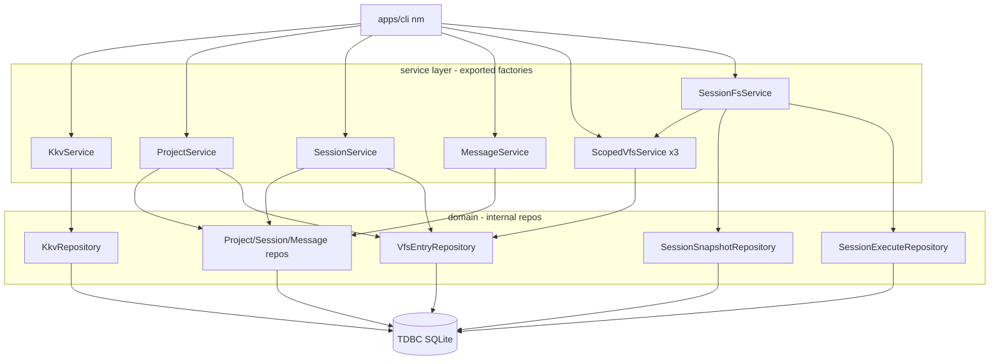

# Chat / Project / 域 VFS 技术规格（SPEC）

## 设计目标

- 在 `@novel-master/core` 扩展 **KKV**、**Project / Session / Message** 领域模型与 service，复用现有 **`vfs_entry` + `VfsService` + `SqliteVfsEntryRepository`**，不改动 `infra/tdbc`、`infra/sql-template`。
- 用**物理路径前缀**实现全局 / project / session 三域隔离；对外仅暴露**逻辑路径**（以 `/` 为根）。
- **Session** 提供 **execute 批次**、**执行记录回滚**、**路径级快照**；版本对 session 调用方默认隐藏，可 per-call 关闭校验。
- CLI（`nm`）新增 `project` / `session` / `message` / `kkv` 及域 VFS 子命令；**保留** `createVfsService` 无范围限制工厂供 `vfs-test-sync` 等内部工具使用。
- 首期 **Node + better-sqlite3**；不修改 `apps/mobile`；repository / impl **不导出**。

## 现状与约束（代码探索）

| 项 | 现状 | 本迭代影响 |
|----|------|------------|
| `packages/core/src` | `infra/*`、`domain/vfs`、`service/vfs`、`bootstrap/vfs`、`errors/vfs-errors.ts` | 新增 `domain/kkv`、`domain/chat`、`domain/session-fs`、`service/*` 对应模块；扩展 `bootstrap` |
| `VfsService` | `list/read/write/replace/glob/grep/delete`；更新需 `expectedVersion`（`versionCheck` 可关） | 域 VFS 包装路径；session execute 自动带 version |
| `vfs_entry` | 单表 `path TEXT PK`；`normalizePath` POSIX | 物理路径写入 `projects/{id}/…`；逻辑路径映射 |
| `createVfsService` | 直连全表 | **保持**；新增 `createScopedVfsService` / `createSessionFsService` |
| bootstrap | 各模块仅 `*-schema.ts`；**唯一入口** `bootstrapNovelMaster`（单事务跑齐 DDL） | 已删除 `bootstrapVfs` / `vfs-bootstrap.ts` |
| `apps/cli` | `runtime` → `bootstrapNovelMaster` | 与 kkv/chat/session-fs 一致 |
| 测试 | core `test/vfs/*`；cli `test/vfs-e2e.test.ts` | 新增 chat/kkv/session-fs 单测；cli e2e 扩展 |
| `scripts/vfs-test-sync` | 使用无范围 `createVfsService`，路径如 `/a.md` | **不破坏**：继续用无范围工厂 |
| PRD | session 创建复制 project template；fork 复制消息；project copy 不含 session | 见下文语义 |

**兼容性原则（2025-05 实现决策：无历史数据，不保留旧路径兼容）**

- `nm vfs`（全局）与全部新 repository：**强制** GlobalScoped，逻辑路径仅 `/template/…`；cli e2e、`vfs-test-sync` 等一律改为 `/template/...` 或 scoped 工厂。
- 新 repository（kkv、chat、session-fs）及 **VfsEntryRepository 改造**：SQL 经 **`SqlTemplateParser` + `queryTemplate` / `executeTemplate`** 拼接，禁止裸字符串拼接用户输入。
- 新表 DDL 均为 **`IF NOT EXISTS`**。

---

## 总体方案

### 架构总览



### 物理路径布局（单表 `vfs_entry`）

| 域 | 逻辑路径示例 | 物理路径（`vfs_entry.path`） |
|----|--------------|------------------------------|
| 全局 | `/template/test.md` | `/template/test.md` |
| project `P` | `/template/test.md` | `/projects/P/template/test.md` |
| session `S`（属 `P`） | `/test.md` | `/projects/P/sessions/S/test.md` |

`meta/` 目录（PRD 树状图）首期**仅作为 VFS 路径约定**，不单独建表；若需存 project/session 元数据，使用 **chat 表字段** + 可选 `/projects/P/meta/…` VFS 文件。

**域路径校验（ScopedVfsService）**

| Scope | 允许的逻辑路径 |
|-------|----------------|
| `global` | 必须以 `/template/` 开头（含 `/template` 作为 list 目录） |
| `project` | 必须以 `/template/` 开头 |
| `session` | 任意规范化绝对路径（`/foo.md`、`/sub/x.md`）；**禁止** `..` 逃逸（已有 `normalizePath`） |

映射实现：`domain/vfs/vfs-path-mapper.ts`（纯函数，无 IO）：

```typescript
export type VfsScope =
  | { kind: "global" }
  | { kind: "project"; projectId: string }
  | { kind: "session"; projectId: string; sessionId: string };

export function toPhysicalPath(scope: VfsScope, logical: string): string;
export function toLogicalPath(scope: VfsScope, physical: string): string;
export function assertLogicalPathAllowed(scope: VfsScope, logical: string): void;
```

`ScopedVfsService` 实现 `VfsService`：入参/出参均为**逻辑路径**；内部委托 `DefaultVfsService` + mapper。

### 数据表（DDL 摘要）

**`kkv_entry`**

| 列 | 类型 | 说明 |
|----|------|------|
| `module` | `TEXT` | 分桶（PRD 第一 key） |
| `key` | `TEXT` | 桶内 key |
| `value` | `TEXT NOT NULL` | UTF-8 值 |
| PK | `(module, key)` | |

**`chat_project`**

| 列 | 类型 | 说明 |
|----|------|------|
| `id` | `TEXT PK` | UUID v4 |
| `name` | `TEXT NOT NULL` | 展示名 |
| `created_at_ms` | `INTEGER` | |
| `updated_at_ms` | `INTEGER` | |

**`chat_session`**

| 列 | 类型 | 说明 |
|----|------|------|
| `id` | `TEXT PK` | UUID |
| `project_id` | `TEXT NOT NULL` | FK → `chat_project.id` |
| `title` | `TEXT` | 可选 |
| `created_at_ms` | `INTEGER` | |
| `updated_at_ms` | `INTEGER` | |

索引：`idx_chat_session_project ON chat_session(project_id)`。

**`chat_message`**

| 列 | 类型 | 说明 |
|----|------|------|
| `id` | `TEXT PK` | UUID |
| `session_id` | `TEXT NOT NULL` | FK → `chat_session.id` |
| `seq` | `INTEGER NOT NULL` | 会话内单调序号（append 时 `MAX+1`） |
| `role` | `TEXT NOT NULL` | `user` \| `assistant` \| `system` \| … |
| `content_json` | `TEXT NOT NULL` | `{ "content"?: string, "parts"?: … }` |
| `provider` | `TEXT` | 可选，如 `openai` |
| `raw_json` | `TEXT` | 厂商原始扩展 |
| `created_at_ms` | `INTEGER NOT NULL` | |

唯一：`(session_id, seq)`。列表按 `seq ASC`。

**`session_vfs_snapshot`**（路径级版本）

| 列 | 类型 | 说明 |
|----|------|------|
| `id` | `INTEGER PK AUTOINCREMENT` | 全局快照行 id |
| `session_id` | `TEXT NOT NULL` | |
| `logical_path` | `TEXT NOT NULL` | session 域逻辑路径 |
| `snapshot_rev` | `INTEGER NOT NULL` | 同 `(session_id, logical_path)` 内递增（对外可格式化为 `v{n}`） |
| `content` | `TEXT` | deleted 时为 NULL |
| `status` | `TEXT NOT NULL` | `active` \| `deleted` |
| `vfs_version` | `INTEGER` | 对应 `vfs_entry.version` 写后值（便于回滚写回） |
| `created_at_ms` | `INTEGER` | |
| `created_by` | `TEXT NOT NULL` | `user` \| `assistant` \| `system` |

索引：`(session_id, logical_path, snapshot_rev)`。

**`session_execute_batch`**

| 列 | 类型 | 说明 |
|----|------|------|
| `id` | `TEXT PK` | UUID |
| `session_id` | `TEXT NOT NULL` | |
| `created_at_ms` | `INTEGER` | |
| `created_by` | `TEXT NOT NULL` | 批次 actor |

**`session_execute_action`**

| 列 | 类型 | 说明 |
|----|------|------|
| `batch_id` | `TEXT` | FK |
| `seq` | `INTEGER` | 批次内顺序 |
| `function` | `TEXT` | `read` \| `write` \| `delete` |
| `logical_path` | `TEXT` | |
| `payload_json` | `TEXT` | write 的 content 等 |

**`session_execute_checkpoint`**

| 列 | 类型 | 说明 |
|----|------|------|
| `batch_id` | `TEXT` | |
| `logical_path` | `TEXT` | |
| `snapshot_rev` | `INTEGER` | 执行**前**状态快照 rev（用于回滚恢复） |
| `vfs_version` | `INTEGER` | 执行前 vfs version（可空：路径不存在） |
| `created_at_ms` | `INTEGER` | |
| `created_by` | `TEXT` | |

`bootstrapNovelMaster(conn)`：单事务内执行 `VFS_SCHEMA_STATEMENTS` + kkv + chat + session-fs DDL（`IF NOT EXISTS`）。导出 `NOVEL_MASTER_SCHEMA_STATEMENTS`。

### 领域服务语义（锁定）

| 操作 | 行为 |
|------|------|
| **session.create(projectId)** | 插入 `chat_session`；`copyVfsTree`：`/projects/P/template/` → `/projects/P/sessions/S/`（逻辑 `/template/x` → session 逻辑 `/x`） |
| **message.fork(sessionId, upToMessageId)** | 新建 session `S'`（**不**走 template 复制）；**深拷贝**源 session 的 session 域 VFS 树；复制 `seq <= upTo` 的消息为新 id、新 seq 1..n |
| **project.copy(projectId)** | 新 project 行；复制 `/projects/P/template/**` → `/projects/P'/template/**`；**不**复制 sessions/messages/session 数据 |
| **session.copy(sessionId)** | 新 session 行（同 project）；复制 VFS 树 + 全部 messages（新 message id，保留 seq 顺序） |
| **session.delete** | 删 session 行、messages、该 session 下 vfs 路径前缀、`session_vfs_snapshot`、execute 相关行（事务） |
| **project.delete** | 删 project、其下所有 session 级联、vfs `/projects/P/` 前缀（事务） |

> **说明**：`message.fork` 的 VFS 行为未在 PRD 写明；采用「复制源 session 文件状态 + 消息截断」以支持对话分支时保留编辑上下文。若仅需 template 初始态，可改为 fork 时只 `createSession` template 复制（实现更简单但会丢文件编辑）。

### SessionFsService（`execute`）

**端口** `service/session-fs/session-fs.port.ts`：

```typescript
export type SessionFsActor = "user" | "assistant" | "system";

export type SessionFsAction =
  | { function: "read"; path: string }
  | { function: "write"; path: string; content: string }
  | { function: "delete"; path: string };

export interface SessionFsExecuteOptions {
  versionCheck?: boolean; // default true；false 时 write 同 VfsService
}

export interface SessionFsExecuteResult {
  batchId: string;
  results: ReadonlyArray<
    | { function: "read"; path: string; content: string }
    | { function: "write"; path: string; version: number }
    | { function: "delete"; path: string }
  >;
}

export interface SessionFsService {
  execute(
    sessionId: string,
    projectId: string,
    actions: SessionFsAction[],
    actor: SessionFsActor,
    options?: SessionFsExecuteOptions,
  ): Promise<SessionFsExecuteResult>;

  listBatches(sessionId: string): Promise<...>;
  rollbackBatch(sessionId: string, projectId: string, batchId: string): Promise<void>;

  listSnapshots(sessionId: string, logicalPath: string): Promise<...>;
  rollbackSnapshot(
    sessionId: string,
    projectId: string,
    logicalPath: string,
    snapshotRev: number,
  ): Promise<void>;
}
```

**执行流程（单事务）**

1. 创建 `session_execute_batch`。
2. 对每个 action（顺序）：
   - **checkpoint**：若路径存在，`read` 当前内容与 version，写入 `session_execute_checkpoint`（保存执行前 `snapshot_rev`：对该路径先追加一条「执行前状态」到 `session_vfs_snapshot` 若尚无当前状态记录——或 checkpoint 直接存 content/version 快照，表结构以上述为准）。
   - **read**：Scoped session `read`；记录 action；**不**改 vfs。
   - **write**：`read` 取 version → `write` with `expectedVersion`（`versionCheck` 来自 options，默认 true）；成功后对该 logical_path 追加 `session_vfs_snapshot`（`status=active`）。
   - **delete**：delete 前 snapshot `status=deleted`；再 `delete`。
3. 提交。

**版本隐藏**：`SessionFsService` 内部处理 `expectedVersion`；`nm session vfs write` 走 session-fs 或 ScopedVfs + `--no-version-check` 默认策略：**默认不要求 CLI 传 version**（与 PRD 一致）。实现：`write` 前自动 `read`；若无行则 insert；有行则带当前 version。

**rollbackBatch**：按 checkpoint 逆序恢复 vfs（`write`/`delete` 还原）；删除 batch 之后写入的 snapshot 行（或标记失效）——SPEC 实现选「按 checkpoint 写回 vfs_entry + 调整 snapshot」并在单测锁定。

**rollbackSnapshot**：将指定 `snapshot_rev` 的 content/status 写回 `vfs_entry`（不存在则 insert / delete）。

### KkvService / Chat Services

遵循现有 **port + impl + factory** 模式（对齐 `createVfsService`）：

| 工厂 | 返回类型 |
|------|----------|
| `createKkvService(conn)` | `KkvService` |
| `createProjectService(conn)` | `ProjectService` |
| `createSessionService(conn)` | `SessionService` |
| `createMessageService(conn)` | `MessageService` |
| `createScopedVfsService(conn, scope)` | `VfsService` |
| `createSessionFsService(conn, sessionId, projectId)` | `SessionFsService` |
| `bootstrapNovelMaster(conn)` | `Promise<void>` |

**错误**：`errors/chat-errors.ts`、`errors/kkv-errors.ts`（`NOT_FOUND`、`CONFLICT` 等）；VFS 继续用 `VfsError`。

### VFS 树复制（内部）

`domain/vfs/vfs-tree-copy.ts`（或 service 内私有）：

```typescript
export async function copyVfsTree(
  repo: VfsEntryRepository,
  fromPrefix: string,
  toPrefix: string,
  options?: { mapPath?: (relative: string) => string },
): Promise<void>;
```

- `list` + `scanContents` 或 `WHERE path LIKE fromPrefix/%`（可在 repository 增加 `listUnderPrefix(prefix)` 以减少往返）。
- session 创建：`fromPrefix=/projects/P/template/`，`toPrefix=/projects/P/sessions/S/`，`mapPath`: 去掉 `template/` 段（`/template/a.md` → `/a.md` 相对 session 根）。

---

## 最终项目结构

```text
packages/core/src/
  bootstrap/
    vfs/                          # 已有
    kkv/kkv-schema.ts
    chat/chat-schema.ts
    session-fs/session-fs-schema.ts
    novel-master-bootstrap.ts     # bootstrapNovelMaster 聚合
  domain/
    vfs/
      vfs-path-mapper.ts          # 新增
      vfs-tree-copy.ts            # 新增
      repositories/               # 已有；可选 listUnderPrefix
    kkv/
      model/
      repositories/*.port.ts + impl/
    chat/
      model/                      # Project, Session, Message
      repositories/*.port.ts + impl/
    session-fs/
      model/
      repositories/*.port.ts + impl/
  service/
    vfs/
      scoped-vfs.service.ts       # 新增 impl
      create-scoped-vfs-service.ts
      # create-vfs-service.ts 不变
    kkv/
    chat/                         # project / session / message
    session-fs/
  errors/
    chat-errors.ts
    kkv-errors.ts

packages/core/test/
  kkv/
  chat/
  vfs/scoped-vfs.service.test.ts
  session-fs/

apps/cli/src/
  runtime.ts                      # bootstrapNovelMaster
  main.ts                         # 路由
  kkv/commands/
  project/commands/ + project/vfs/
  session/commands/ + session/vfs/ + session/vfs-records/ + session/vfs-snapshot/
  vfs/                            # 全局：改用 createScopedVfsService(global)
```

---

## 变更点清单

| 路径 | 变更 |
|------|------|
| `packages/core/src/bootstrap/novel-master-bootstrap.ts` | **新增** 聚合 DDL |
| `packages/core/src/bootstrap/kkv/*`、`chat/*`、`session-fs/*` | **新增** schema |
| `packages/core/src/domain/vfs/vfs-path-mapper.ts` | **新增** |
| `packages/core/src/domain/vfs/vfs-tree-copy.ts` | **新增** |
| `packages/core/src/domain/vfs/repositories/vfs-entry.port.ts` | 可选 `listUnderPrefix` |
| `packages/core/src/service/vfs/scoped-vfs.service.ts` | **新增** |
| `packages/core/src/domain/kkv/**`、`service/kkv/**` | **新增** |
| `packages/core/src/domain/chat/**`、`service/chat/**` | **新增** |
| `packages/core/src/domain/session-fs/**`、`service/session-fs/**` | **新增** |
| `packages/core/src/index.ts` | 导出新 factories、类型、错误 |
| `apps/cli/src/main.ts` | 子命令路由 |
| `apps/cli/src/runtime.ts` | `bootstrapNovelMaster`；导出 `createRuntime(conn?)` |
| `apps/cli/src/vfs/*` | 全局 scoped；路径示例调整 |
| `apps/cli/test/*` | e2e：chat、kkv、scoped vfs、session-fs |
| `apps/cli/test/vfs-e2e.test.ts` | 路径改为 `/template/...` |
| `.apm/kb/docs/monorepo.md` | 补充 `nm project` 等（实现后） |

**不修改**：`infra/tdbc`、`infra/sql-template`、`packages/tdbc-driver-*`、`apps/mobile`。

---

## 详细实现步骤

### 阶段 1：Bootstrap + KKV

1. 添加 `kkv-schema.ts`、`novel-master-bootstrap.ts`（先只含 kkv + 调用已有 `bootstrapVfs`）。
2. 实现 `SqliteKkvRepository`、`DefaultKkvService`、`createKkvService`。
3. core 单测：set/get/list/delete、模块隔离。
4. CLI：`nm kkv list|get|set|delete`；`runtime` 改用 `bootstrapNovelMaster`。

### 阶段 2：Chat 实体 + CRUD

1. `chat-schema.ts` 三表 + 索引。
2. Repositories + `ProjectService` / `SessionService` / `MessageService`。
3. `SessionService.create` 集成 `copyVfsTree`（template → session）。
4. core 单测：CRUD、seq 顺序、delete 级联。
5. CLI：`nm project|session|message` 子命令（JSON 行或 tab 输出，与现有 vfs 风格一致）。

### 阶段 3：Scoped VFS + 域 CLI

1. `vfs-path-mapper.ts` + `ScopedVfsService`。
2. `createScopedVfsService`；单测：三域 list/read/write 隔离、非法路径 `INVALID_PATH`。
3. CLI：`nm vfs` → global scoped；`nm project vfs --project <id>`；`nm session vfs --project <id> --session <id>`（flag 名在实现时与 `parse-args` 统一）。
4. 更新 `vfs-e2e.test.ts` 路径前缀。

### 阶段 4：Project copy + Session copy + Message fork

1. `copyVfsTree` 复用；`ProjectService.copy`、`SessionService.copy`。
2. `MessageService.fork`（VFS 深拷贝 + 消息复制）。
3. core 集成测试对齐 PRD 验收。
4. CLI：`project copy`、`session copy`、`message fork --up-to <id>`。

### 阶段 5：Session FS（快照 + 执行记录）

1. `session-fs-schema.ts` 四表。
2. `SessionFsService` 实现 execute / rollback / snapshot list|rollback。
3. core 单测：批次 write+delete 回滚、snapshot 多版本、actor 字段。
4. CLI：`nm session vfs records list|rollback`；`nm session vfs snapshot list|rollback --file <path> [--rev n]`。

### 阶段 6：收尾

1. `index.ts` 导出整理；`npm run build` / `test` 全绿。
2. 更新 `monorepo.md` CLI 速查。
3. `apm kb index rebuild`。

---

## 测试策略

### 层级

| 层级 | 范围 |
|------|------|
| core 单测 | repository SQL、mapper、scoped vfs、session-fs 回滚 |
| core 集成 | 内存 SQLite：`open` → `bootstrapNovelMaster` → services |
| cli e2e | `spawnSync` 调用 `nm`（与 `vfs-e2e.test.ts` 同模式） |

### 测试用例

**KKV**

- 同 module 不同 key 隔离；跨 module 同名 key 独立。
- delete 不存在 → `NOT_FOUND`（或项目统一错误码）。

**Session 创建 + template**

- project 写入 `/template/a.md`、`/template/sub/b.md` → create session → session list 含 `/a.md`、`/sub/b.md`，内容一致。
- 创建后改 project template → session 内容不变。
- 空 template → session list 为空。

**Scoped VFS**

- global write `/template/g.md`；project list 不可见 `g`（除非在同 project 下写入）。
- session write `/note.md`；project/global read 同逻辑路径失败。

**Message fork**

- M1,M2,M3 → fork up to M2 → S' 仅 M1,M2；S 仍含 M3；S' append 不影响 S。

**Project copy**

- P 有 template + session → P' 有 template、无 session。

**Session FS**

- execute write + delete → rollback batch → read 恢复。
- 同文件多次 write → snapshot list 多条 → rollback 到 rev N。
- global/project 调用 snapshot API → 错误或未注册命令。

**CLI smoke**

- `nm project create`、`nm session create --project`、`nm message append`、`nm kkv set` 一条 happy path 串联。

---

## 风险与回滚方案

| 风险 | 缓解 |
|------|------|
| 全局 `nm vfs` 仅允许 `/template/*` 破坏旧脚本 | `createVfsService` 保持全路径；文档标明 `nm vfs` 为 scoped；e2e/sync 按需选用工厂 |
| 单表 `vfs_entry` 膨胀 | 首期可接受；后期可按 prefix 归档或分库 |
| fork VFS 语义与产品预期不符 | SPEC 已锁定「复制源 session VFS」；PRD 变更时可切换为仅 template |
| session rollback 与 snapshot 一致性复杂 | 单测覆盖多步 execute + rollback；实现优先 checkpoint 存执行前 vfs 状态 |
| `message.fork` / `session.copy` 大会话性能 | 首期全量复制；大文本用 SQLite 同库批量 INSERT SELECT |

**回滚**：功能为纯新增表与命令；回滚代码后旧库仍可用（新表闲置）。若需降级 CLI，保留 `vfs` 全局命令走 `createVfsService` 即可。

---

## CLI 路由（定稿）

```text
nm project list|create|delete|copy [--name] [--project <id>]
nm session list|create|delete|copy --project <id> [--session <id>] [--title]
nm message list|append|delete|fork --session <id> [--message <id>] [--role] [--content|--file] [--up-to <id>]
nm kkv list|get|set|delete --module <M> [--key] [--value]

nm vfs ...                              # global scoped；--db / NOVEL_MASTER_DB
nm project vfs ... --project <id>
nm session vfs ... --project <id> --session <id>
nm session vfs records list|rollback --project <id> --session <id> [--batch <id>]
nm session vfs snapshot list|rollback --project <id> --session <id> --file <logicalPath> [--rev <n>]
```

全局 `vfs` 子命令实现**复用** `apps/cli/src/vfs/commands/*`，仅替换注入的 `VfsService` 实例。

---

## 导出 API（`packages/core/src/index.ts` 增量）

- `bootstrapNovelMaster`
- `createKkvService`、`createProjectService`、`createSessionService`、`createMessageService`
- `createScopedVfsService`、`createSessionFsService`
- 类型：`KkvService`、`ProjectService`、`SessionService`、`MessageService`、`SessionFsService`、`VfsScope`（若导出）
- 错误：`ChatError`、`KkvError`（`VfsError` 已有）

**不导出**：各 `Sqlite*Repository`、`Default*Service` 具体 impl 类。
