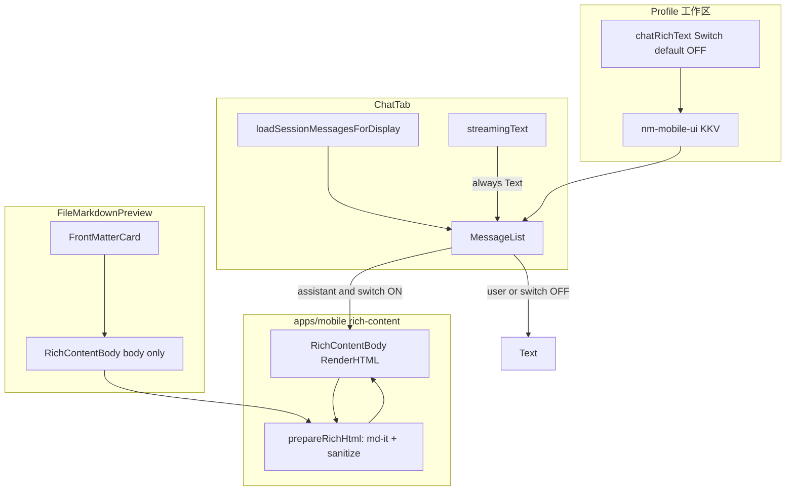

# 富文本渲染（聊天开关 + 工作区 .md）技术规格（SPEC）

> 需求：[prd.md](./prd.md)  
> 相关：`mobile-fix-v2/spec.md`（`MessageList`、`FileMarkdownPreview`、`llmStream` 偏好范式）  
> **建议分支**：`feature/chat-rich-render`

## 设计目标

- 聊天**助手**消息：工作区开关（**默认关**）控制 MD+HTML 渲染；关时保持纯 `Text`（display 正则不变）。
- 工作区 **`.md` 预览**：**始终** Markdown 预览（现网行为）；正文升级为与聊天相同的 **HTML/CSS 增强** 渲染，**不受**聊天开关影响。
- **单一渲染管线**（`RichContentBody`），避免聊天与文件预览两套行为分叉。
- 流式阶段仍为纯文本；结束后 `reloadMessages` 再渲染历史助手消息。
- 可消毒、可回滚、可测；不修改 Core / `llm` 通道。

---

## 现状与约束（代码探索）

| 模块 | 现状 | 本期 |
|------|------|------|
| `MessageList.tsx` | `renderBubble` → RN `<Text>{body}</Text>`；`textParts.join('\n\n')` | 助手 + 开关开 → `RichContentBody`；其余 `Text` |
| `ChatTabScreen.tsx` | `loadSessionMessagesForDisplay` 已应用 display 正则；`streamingText` 增量纯文本 | 读 `chatRichText` 偏好并传入 `MessageList` |
| `FileMarkdownPreview.tsx` | `.md` → `splitMarkdownFrontMatter` + `react-native-markdown-display`；非 md → `Text` | 正文改 `RichContentBody`；FM 卡片不变 |
| `FileEditorScreen.tsx` | 预览模式挂载 `FileMarkdownPreview` | 无接口变更（透传 `path`/`content`） |
| `ProfileTabScreen.tsx` | `llmStream` + `ProfileSwitchItem` | 增加「富文本消息」开关 |
| `app-ui-keys.ts` | `APP_UI_KEY_LLM_STREAM` 等 | + `APP_UI_KEY_CHAT_RICH_TEXT`，默认 `'false'` |
| `regex-apply-channel.ts` | `loadSessionMessagesForDisplay` | **不改**；富文本在 UI 层消费已正则化的 `text` |
| `VfsFileManager` | 打开文件走 `FileEditor` 栈路由 | 本期不新增列表直读；预览仍经编辑器 |

**依赖与边界**

- 已安装：`react-native-markdown-display@7`（仅 `FileMarkdownPreview` 使用）。
- **未安装**：`react-native-render-html`（本期新增，用于 HTML + 内联 `style` / `class`；避免聊天 `FlatList` 内嵌 `WebView`）。
- `react-native-markdown-display` 基于 markdown-it，默认 **不开启** `html: true`，对 `<div style>` / `<style>` 支持不足 → 不宜单独承担 PRD「尽量完整 HTML」目标。
- Metro：富文本组件放在 `apps/mobile`，**不**在 `index.js` 顶层 import 全量 `@novel-master/core`。
- RN `0.85.3`：选用 `react-native-render-html@6.3.x`（与当前 RN 社区常用组合一致；实现前 `npm ls` 确认 peer）。

---

## 总体方案



### 渲染管线（统一）

1. **输入**：UTF-8 字符串（聊天 `textParts` 拼接或 `.md` 正文，已去 Front Matter）。
2. **`prepareRichHtml(content)`**（`apps/mobile/src/components/rich-content/prepare-rich-html.ts`）  
   - 使用 **markdown-it**（`html: true`, `linkify: true`）将 Markdown（含内嵌 HTML）转为 HTML 字符串。  
   - **`sanitizeRichHtml(html)`**：剥离 `script`/`iframe`/`object`/`on*` 事件属性等（`sanitize-html` 或 `dompurify` + RN 兼容配置，实现时二选一）。  
   - **`<style>` 块**：`react-native-render-html` 的 TRE/css-processor 可处理文档内部分样式；若真机验收不通过，再在 `prepareRichHtml` 增加「提取 `<style>` → 合并到 `classesStyles`」的增量逻辑（M2 兜底，写入风险节）。  
3. **`RichContentBody`**：`RenderHTML` + `contentWidth`（`useWindowDimensions` 减气泡水平 padding）+ `baseStyle`/`tagsStyles` 来自 `buildRichContentStyles(tokens, variant)`。  
4. **超长回退**：`content.length > RICH_CONTENT_MAX_CHARS`（建议 `12_000`）→ 只渲染纯 `Text` + 可选一行灰色提示「内容过长，已显示原文」。

### 聊天开关（仅助手）

| KKV | 值 |
|-----|-----|
| 模块 | `nm-mobile-ui` |
| Key | `chatRichText`（`APP_UI_KEY_CHAT_RICH_TEXT`） |
| 默认 | `'false'` |

- `readChatRichTextEnabled` / `writeChatRichTextEnabled`（镜像 `llm-stream-pref.ts`）。
- `MessageList` 新 prop：`assistantRichTextEnabled: boolean`（默认 `false`）。
- 条件：`!isUser && assistantRichTextEnabled && body.length <= MAX` → `RichContentBody`；流式 tail **始终** `Text`（现有 `streamingText` 分支不改逻辑）。

### 工作区 `.md`（不跟开关）

- `FileMarkdownPreview` 在 `body` 非空时**始终**使用 `RichContentBody`（`variant="file-preview"`）。
- 非 `.md` 路径仍为 `Text`（现网）。
- `buildMarkdownStyles` 从 `FileMarkdownPreview` **迁出**到 `build-rich-content-styles.ts`，供 `RichContentBody` 与测试复用；`FileMarkdownPreview` 删除对 `react-native-markdown-display` 的直接依赖（若全量迁移后无引用可保留 dep 至后续清理，或本 PR 移除未使用依赖）。

---

## 最终项目结构

```
apps/mobile/
  package.json                          # + react-native-render-html, markdown-it, sanitize-html
  src/
    storage/
      app-ui-keys.ts                    # APP_UI_KEY_CHAT_RICH_TEXT
      app-ui-prefs.ts                   # 导出键名（可选）
      chat-rich-text-pref.ts            # read/write
    components/
      rich-content/
        RichContentBody.tsx             # RenderHTML 封装
        prepare-rich-html.ts            # md → html → sanitize
        sanitize-rich-html.ts
        build-rich-content-styles.ts    # tokens + variant
        rich-content-limits.ts          # MAX_CHARS
      chat/
        MessageList.tsx                 # 条件渲染 RichContentBody
      vfs/
        FileMarkdownPreview.tsx         # body → RichContentBody
    screens/tabs/
      ProfileTabScreen.tsx              # Switch
      ChatTabScreen.tsx                 # 读偏好 → MessageList
  __tests__/
    chat-rich-text-pref.test.ts
    prepare-rich-html.test.ts
    sanitize-rich-html.test.ts
  __fixtures__/rich-content/              # 验收样例（md + html）
    sample-assistant.md
    sample-assistant.html-snippet.md
.apm/kb/docs/Iterations/chat-rich-render/
  prd.md
  spec.md
```

**Core**：无改动（display 正则、消息模型保持不变）。

---

## 变更点清单

| 文件 | 变更 |
|------|------|
| `apps/mobile/package.json` | 增加 `react-native-render-html`、`markdown-it`、`sanitize-html`（版本锁定后 `package-lock`） |
| `app-ui-keys.ts` / `app-ui-prefs.ts` | 新 key + default |
| `chat-rich-text-pref.ts` | 新建 |
| `rich-content/*` | 新建渲染管线 |
| `MessageList.tsx` | `assistantRichTextEnabled`；助手气泡富文本；`React.memo` 子组件 `AssistantMessageBody` |
| `ChatTabScreen.tsx` | state + `useFocusEffect` 读偏好；传入 `MessageList` |
| `ProfileTabScreen.tsx` | `ProfileSwitchItem`「富文本消息」 |
| `FileMarkdownPreview.tsx` | 正文改用 `RichContentBody` |
| `app-ui-keys.test.ts` | 断言新 default |

---

## 详细实现步骤

### 步骤 1 — 偏好与开关

1. `APP_UI_KEY_CHAT_RICH_TEXT = 'chatRichText'`，`APP_UI_DEFAULTS` 为 `'false'`。
2. 实现 `chat-rich-text-pref.ts`。
3. `ProfileTabScreen`：在「流式输出」下增加开关，文案示例：  
   - 标题：**富文本消息**  
   - 副标题：开 → 助手回复解析 Markdown/HTML；关 → 纯文本  
4. 单测 `chat-rich-text-pref.test.ts`。

### 步骤 2 — 富文本核心模块

1. `rich-content-limits.ts`：`RICH_CONTENT_MAX_CHARS = 12_000`。
2. `sanitize-rich-html.ts`：禁止标签/属性白名单（`script`, `iframe`, `object`, `embed`, `form`, `input`, `on*`）。
3. `prepare-rich-html.ts`：markdown-it → sanitize；导出纯函数便于单测。
4. `build-rich-content-styles.ts`：从现 `buildMarkdownStyles` 迁移并扩展 `tagsStyles`（`div`, `span`, `table` 等基础排版）；`variant` 微调字号（聊天气泡略小）。
5. `RichContentBody.tsx`：  
   - `useMemo(() => prepareRichHtml(content), [content])`  
   - `RenderHTML` + `contentWidth`  
   - 超长 → `Text` 回退  
   - `React.memo` 包裹

### 步骤 3 — 工作区 `.md` 预览

1. `FileMarkdownPreview`：`body` 渲染改为 `<RichContentBody content={body} tokens={tokens} variant="file-preview" />`。
2. Front Matter / 未闭合 `---` 提示逻辑**不动**。
3. 手动验收：开关**关**状态下打开 `.md` 预览，仍为排版视图（非整页源码）。

### 步骤 4 — 聊天列表

1. `ChatTabScreen`：  
   ```ts
   const [assistantRichTextEnabled, setAssistantRichTextEnabled] = useState(false);
   useFocusEffect(() => { readChatRichTextEnabled(appUi).then(setAssistantRichTextEnabled); });
   ```  
2. `MessageList`：新增 prop；`renderBubble` 内分支：  
   - user → `Text`（白字）  
   - assistant + off → `Text`  
   - assistant + on → `RichContentBody`（`variant="chat-assistant"`，文字色 `tokens.text`）  
3. 流式 `renderBubble(false, streamingText)` **保持** `Text`。  
4. `reloadMessages` / display 正则：**不修改**。

### 步骤 5 — 样例与文档

1. 添加 `__fixtures__/rich-content/` 样例（含 `# 标题`、列表、`` `code` ``、`<div style="color:red">`、带 `class` 片段）。  
2. `apps/mobile/README.md` 增加一节：富文本开关、样例路径、真机验收步骤。  
3. `apm kb index rebuild`（文档已由本任务执行）。

### 步骤 6 — 依赖与构建验证

1. `npm install` in workspace root（mobile 包依赖）。  
2. `npm test -w @novel-master/mobile`  
3. `npm run preandroid -w @novel-master/mobile`（或 `tsc`/`lint`）确认无 peer 冲突。

---

## 测试策略

### 单元测试（Jest，`apps/mobile/__tests__`）

| 用例 | 断言 |
|------|------|
| `chat-rich-text-pref` | 缺省为 `false`；write `true` 后再 read |
| `sanitize-rich-html` | `<script>alert(1)</script>` 被移除；`<p onclick=...>` 剥离事件属性 |
| `prepare-rich-html` | `# h1` → 含 `<h1`；内嵌 `<div style="...">` 保留（消毒后） |
| `app-ui-keys` | `APP_UI_DEFAULTS.chatRichText === 'false'` |

### 手工验收（Android + iOS 各 1 台）

| # | 步骤 | 期望 |
|---|------|------|
| H1 | 富文本开关默认关，助手消息含 `<div style="color:red">x</div>` | 见源码字符 |
| H2 | 打开开关，重进会话，同一条消息 | 红色「x」排版（视觉对照样例） |
| H3 | 用户消息含 `# title` | 仍为纯文本 `# title` |
| H4 | 流式生成中 | 纯文本增量；结束后刷新为富文本（开关开） |
| H5 | display 正则替换 + 开关开 | 先替换再渲染 |
| H6 | 开关关，`.md` 预览验收样例 | 有 MD 排版 + HTML 样式增强 |
| H7 | 开关开/关 各一次，`.md` 预览 | 预览效果**一致**（不受聊天开关影响） |
| H8 | 非 `.md` 文件预览 | 纯文本 |
| H9 | 关开关，长会话快速滚动 | 无明显卡顿 |

### 回归

- `npm test -w @novel-master/core`（确保未误改 core）  
- `npm test -w @novel-master/mobile`

---

## 风险与回滚方案

| 风险 | 缓解 | 回滚 |
|------|------|------|
| `FlatList` 内 `RenderHTML` 性能 | 默认关；`memo`；超长回退；避免流式解析 | 关开关即恢复纯文本 |
| `<style>` / 复杂 `class` 真机不一致 | M2 增强 style 提取；验收样例驱动 | 文档记录限制；可临时回退 `markdown-display` 仅 md |
| 消毒过严导致内容缺失 | 单测 + 样例对比；放宽白名单需评审 | 调整 `sanitize` 配置 |
| 新依赖 peer 冲突 | 锁定版本；`preandroid` CI | 移除 dep，恢复 `markdown-display` 仅 vfs |
| **安全** | 禁止 script/iframe/事件属性；不执行 JS | 默认关减少暴露面 |

**回滚步骤（紧急）**

1. `Profile` 默认已是关；可将 `RichContentBody` 在 `MessageList` 中 feature-flag 为 false（硬编码）.hotfix。  
2. `FileMarkdownPreview` 恢复 `Markdown` 组件一行回退。  
3. 卸载 `react-native-render-html` 依赖（若完全撤销功能）。

---

## 兼容性与迁移

- **无数据库 / Core API 迁移**；旧客户端缺 key 时读 default `false`。  
- **用户消息、tool 卡片、thinking 卡片**：无行为变化。  
- **与 `react-native-markdown-display`**：预览正文迁移后，若包内无其他引用，可在后续 chore 中移除依赖（非本期必须）。

---

## 实现计划（并入里程碑）

| 阶段 | 内容 | 验证 |
|------|------|------|
| M1 | 步骤 1–2 + 单测 | Jest 绿 |
| M2 | 步骤 3–4 + 样例 | H1–H9 抽样 |
| M3 | 样式微调、`<style>` 兜底、README | 产品对照样例签字 |

---

**请确认本 `spec.md` 后再开始编码。** 若你希望聊天与工作区使用不同消毒强度，或坚持保留 `react-native-markdown-display` 作为 MD 快路径，请指出后更新 SPEC。
