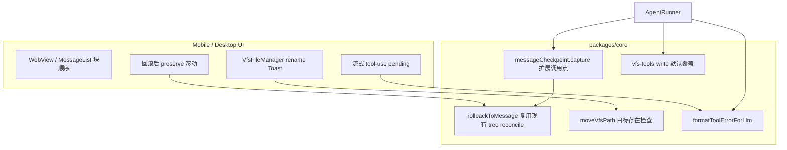

# 聊天回滚、VFS 与工具体验修复 技术规格（SPEC）

> PRD：`.apm/kb/docs/Iterations/chat-rollback-vfs-tool-fixes/prd.md`

## 设计目标

- **回滚不跳屏**：Mobile WebView transcript 在 tail 缩短（回滚删消息）后，以 **距底部偏移** 恢复视口，避免 `flex-end` 布局下保留 `scrollTop` 导致「跳到当前页上方」。
- **重命名冲突**：Core `moveVfsPath` 在同目录目标已存在时 **失败且不改动源项**；Mobile 展示 Toast。
- **全消息 checkpoint**：user / assistant 消息在落库后的正确时刻调用 `messageCheckpoint.capture`，使 `rollbackToMessage` 的 `resolveRollbackTargetTree` 能还原锚点时刻完整 worktree。
- **工具失败可读**：LLM 看到的 `tool_result.content` 含 **底层 VfsError / 原因**，而非仅 `Tool failed: write`。
- **write 覆盖写**：builtin `write` 默认允许覆盖已存在文件（`versionCheck` 默认 `false`）。
- **块顺序 + 流式 loading**：thinking → 正文 → 工具调用；流式阶段转发 `tool-use` 事件，在 result 到达前显示 pending/loading。

## 现状与约束（代码探索）

| 模块 | 现状 | 问题 / 本迭代 |
|------|------|----------------|
| `ChatTranscriptWebView` | 消息变更时 `sendSessionSnapshot('preserve')` | 回滚后列表缩短，需配合 WebView 正确恢复滚动 |
| `main.ts` `applySnapshot` preserve 分支 | `clampScrollTop(scroller, prevScrollTop)` 保留 **距顶部** scrollTop | `#rows` 使用 `justify-content: flex-end`，tail 删除后同一 scrollTop 对应错误视口 → **跳屏** |
| `chat-transcript/scroll.ts` | 已有 `offsetFromBottom` / `scrollTopForOffsetFromBottom` | RN 缓存语义是 **距底部 px**；preserve 应使用此语义 |
| `MessageList.tsx`（legacy RN） | `renderAssistantBubble` 顺序：thinking → **tools** → **body** | 与 PRD 相反 |
| `main.ts` `renderAssistantBubbleInner` | 同上：thinking → tools → body | WebView transcript 同 bug |
| `desktop/.../MessageList.tsx` | thinking → tools → body | Desktop 同 bug |
| `DefaultMessageCheckpointService.capture` | 扫描 session 全量 file heads 写入 checkpoint | 逻辑可用；**调用点不足** |
| `DefaultAgentRunner` | 仅 `hadMutatingTools` 后 capture | assistant 纯文本、user 消息均无 checkpoint |
| `DefaultMessageRollbackService` | `pathsToReconcile = tailPointers ∪ targetTree.keys()` + restore/delete | 有锚点完整 tree 时语义已满足 PRD；缺 checkpoint 时回退 prior/空树 |
| `vfs-move.ts` `moveVfsFile` | `write(to, …, {versionCheck:false})` 再 `delete(from)` | 目标已存在时 **覆盖** 原文件，源文件被删 → 重命名冲突灾难 |
| `vfs-tools.ts` `write` | `versionCheck ?? true` | 已存在路径二次 write **失败**（`CONFLICT: expectedVersion required`） |
| `ToolRunner` + `agent-runner` | 失败时 `Error: ${outcome.error.message}` | `ToolError.message` 仅为 `Tool failed: ${name}`，**cause（VfsError 等）未展开** |
| 流式事件 | `wrapStreamForBus` 仅转发 `text-delta` / `thinking-delta` | `tool-use` 事件未进 bus；stream tail 无工具 pending UI |
| `VfsFileManager` rename | 直接 `renameVfsFile/Directory`，无 try/catch Toast | 需展示 Core 错误 |

**关键代码位置**

```
packages/core/src/service/message-checkpoint/impl/message-rollback.service.ts
packages/core/src/service/message-checkpoint/impl/message-checkpoint.service.ts
packages/core/src/service/agent/impl/agent-runner.ts
packages/core/src/domain/vfs/logic/vfs-move.ts
packages/core/src/domain/tool/builtin/vfs-tools.ts
packages/core/src/domain/tool/logic/format-tool-output.ts  (新增 formatToolErrorForLlm)
apps/mobile/src/web/chat-transcript/main.ts
apps/mobile/src/components/chat/ChatTranscriptWebView.tsx
apps/mobile/src/components/chat/MessageList.tsx
apps/mobile/src/components/vfs/VfsFileManager.tsx
apps/desktop/renderer/features/chat/MessageList.tsx
```

## 总体方案



### 1. 回滚滚动（Mobile transcript）

**根因**：`#rows { justify-content: flex-end }` 下，删除底部消息后内容高度变小；保留 `scrollTop` 会使视口相对内容上移。

**方案**：`applySnapshot` 的 `preserve` 分支改为：

1. 渲染前记录 `prevOffsetFromBottom = offsetFromBottom(scroller)`（已有 `offsetFromBottom` 函数）。
2. `renderRows()` 后：
   - 若 `wasNearBottom` → `stickToBottom`（不变）。
   - 否则 → `scroller.scrollTop = scrollHeight - clientHeight - prevOffsetFromBottom`（与 `scrollTopForOffsetFromBottom` 一致）。

**可选增强**（回滚专用）：`ChatTabScreen.handleRollbackFromMessage` 成功后，向 transcript 发送 `scrollIntent: 'restore'` 且 `restoreScroll` 使用回滚前 `lastScrollRef` 快照；与 preserve 修复二选一或叠加，**以 offset-from-bottom 修复为主**。

legacy `MessageList` 已有 T5 shrink clamp 测试；回滚若走 legacy 路径，行为已较合理，本迭代 **验收以 WebView transcript 为准**。

### 2. 重命名冲突（Core + Mobile）

在 `moveVfsPath` 入口（normalize `from`/`to` 后）增加 **目标占用检查**：

```typescript
async function assertMoveTargetAvailable(vfs, from, to): Promise<void>
```

- 若 `to === from`（规范化后）→ 直接 return（no-op）。
- 尝试 `vfs.read(to)` 成功 → 抛出 `vfsAlreadyExists(to)`（目标是文件）。
- 若 `read` 为 `NOT_FOUND` / `IS_DIRECTORY`：对 `to` 做 `list(to, {recursive:false})` 或 `findByPath` 语义探测：
  - 存在 directory 行或子项 → `vfsAlreadyExists(to)`。
- **不执行** write/delete。

`moveVfsFile` / `moveVfsDirectory` 仅在校验通过后运行。

Mobile `VfsFileManager` rename `onSubmit`：`try/catch` + `showToast(toastMessage('重命名失败', err))`；对 `ALREADY_EXISTS` 可映射友好文案「名称不能重复」。

### 3. 全消息 checkpoint + 回滚对齐

**调用策略**（避免重复 capture）：

| 时机 | 调用 |
|------|------|
| user 消息 `append` 成功后 | `messageCheckpoint.capture(sessionId, projectId, messageId)` |
| assistant 消息含 `tool_use` | 工具执行完毕后 capture（**去掉** `hadMutatingTools` 限制，改为 **每轮 tool 步骤结束都 capture**） |
| assistant 消息无 `tool_use`（终轮或纯文本） | `append` 后立即 capture |

**注入点**：

- `apps/mobile/src/services/agent-run.service.ts` — user append 后。
- `apps/desktop/src/main/services/agent-run.service.ts` — 同上。
- `packages/core/src/service/agent/impl/agent-runner.ts` — assistant 无 tool 分支 + tool 步骤后（替换现有 `hadMutatingTools` 条件）。
- （可选一致）`apps/cli` agent/model 命令 user append 后；不影响 Mobile 验收，但保持 Core 行为一致。

`capture` 在 session 无文件时仍 **跳过**（现有行为）；回滚时 `resolveRollbackTargetTree` 回退 prior checkpoint 或空树。

**回滚对齐**：现有 `DefaultMessageRollbackService` 在锚点有 checkpoint 时，对 `tail ∪ targetTree` 路径执行 restore/delete，**无需改 reconcile 算法**；补齐 checkpoint 后 PRD 用例自然满足。更新/新增测试覆盖「user 消息锚点 + 手动改文件后发送」场景。

### 4. 工具失败原因（LLM tool message）

新增 `formatToolErrorForLlm(error: unknown): string`（`format-tool-output.ts` 或 `tool-errors.ts`）：

1. `ToolError` → 优先取 `cause`：`VfsError.message`、`Error.message`、否则 `String(cause)`。
2. 前缀统一 `Error: `（与现有一致）。
3. `INVALID_ARGUMENT` 可附带 zod issues 摘要。
4. `agent-runner` 中 `toolResults` 构建改用此函数。

### 5. write 覆盖写

`vfs-tools.ts` `write.run`：

```typescript
const versionCheck = input.options?.versionCheck ?? false;
```

- 已存在文件：默认覆盖（`versionCheck: false` → `vfs.write` 走 update 分支）。
- 需乐观锁时，调用方显式传 `versionCheck: true` + `expectedVersion`（现有测试保留）。

更新 `packages/core/test/tool/vfs-tools.test.ts`：增加「无 options 二次 write 覆盖成功」用例；调整与默认行为冲突的断言。

### 6. 消息块顺序 + 流式 tool loading

**落库态顺序**（三处同改）：

1. `apps/mobile/src/components/chat/MessageList.tsx` — `renderAssistantBubble`：thinking → body → tools；调整 `showDividerBelow`（thinking 下方：有 body 或 tools；tools 仅在 body 上方时无 divider below body）。
2. `apps/mobile/src/web/chat-transcript/main.ts` — `renderAssistantBubbleInner`：thinking → body → tools。
3. `apps/desktop/renderer/features/chat/MessageList.tsx` — 同上。

**流式 tool loading**：

1. **Core**：`wrapStreamForBus` 转发 `tool-use` → 新事件 `EVENT_AGENT_STREAM_TOOL_USE`（payload: `{ sessionId, id, name, input }`）；在 `event-types.ts` / `index.ts` 导出。
2. **Mobile**：
   - `ChatComposer` / `ChatTabScreen` 订阅 tool-use，维护 `streamingTools: ToolCallView[]`（status `pending`）。
   - `buildTranscriptRows` / stream row：`stream.tools` 传入 WebView；`renderStreamBubbleInner` 传入 tools。
   - `streamDelta` 协议扩展 `kind: 'tool-use'` 或独立 `streamToolUse` 消息（Bridge 类型同步）。
   - `EVENT_AGENT_STEP_COMMITTED` `phase: 'tool_results'` 或 `flushAgentStepUi` 时清空 `streamingTools`（result 已落库，改读 DB）。
3. **Desktop**：
   - `ConversationPanel` 订阅 tool-use，在 `MessageList` streaming 区域渲染 thinking（若有）→ 正文 → pending tools。
   - step committed 后清空 pending，列表从 messages 重载。

WebView 已有 `.tool-status.pending` + spinner；复用即可。

## 最终项目结构

```
packages/core/src/
  domain/tool/logic/format-tool-output.ts       # +formatToolErrorForLlm
  domain/vfs/logic/vfs-move.ts                 # +assertMoveTargetAvailable
  domain/tool/builtin/vfs-tools.ts             # write 默认 versionCheck false
  domain/events/model/event-types.ts           # +EVENT_AGENT_STREAM_TOOL_USE
  service/agent/impl/agent-runner.ts           # capture 扩展 + 错误格式化 + bus tool-use
  test/tool/vfs-tools.test.ts
  test/message-checkpoint/rollback.test.ts     # +user checkpoint 用例
  test/vfs/vfs-move.test.ts                    # 新建或扩展现有 move 测试

apps/mobile/src/
  web/chat-transcript/main.ts                  # 块顺序 + preserve 滚动 + stream tools
  components/chat/ChatTranscriptBridge.ts      # stream tool 协议
  components/chat/ChatTranscriptWebView.tsx    # streamingTools state
  components/chat/MessageList.tsx              # 块顺序
  components/chat/message-blocks.ts            # buildTranscriptRows stream.tools
  components/vfs/VfsFileManager.tsx            # rename catch + toast
  services/agent-run.service.ts                # user capture
  screens/tabs/ChatTabScreen.tsx               # streamingTools wiring（如需）

apps/desktop/
  renderer/features/chat/MessageList.tsx       # 块顺序 + stream tools
  renderer/features/chat/ConversationPanel.tsx # tool-use 订阅
  src/main/services/agent-run.service.ts       # user capture
```

## 变更点清单

| 文件 | 变更 |
|------|------|
| `vfs-move.ts` | 目标存在检查；冲突抛 `ALREADY_EXISTS` |
| `vfs-tools.ts` | `write` 默认 `versionCheck: false` |
| `format-tool-output.ts` | `formatToolErrorForLlm` |
| `agent-runner.ts` | 错误格式化；checkpoint 时机；bus 转发 tool-use |
| `event-types.ts` / `index.ts` | 新 stream 事件 |
| `agent-run.service.ts` (mobile/desktop) | user append 后 capture |
| `main.ts` | preserve 用 offset-from-bottom；块顺序；stream tools |
| `ChatTranscriptWebView.tsx` / `Bridge.ts` | stream tool 桥接 |
| `MessageList.tsx` (mobile/desktop) | 块顺序；desktop stream tools |
| `VfsFileManager.tsx` | rename 错误 Toast |
| `message-blocks.ts` | `buildTranscriptRows` 支持 stream tools |
| 测试文件 | 见下节 |

## 详细实现步骤

### Phase A — Core 行为（条目 2、3、4、5）

1. **vfs-move**：实现 `assertMoveTargetAvailable`；`moveVfsPath` 首行调用；补 `vfs-move` 单测（文件/目录重名、成功路径、自指 no-op）。
2. **vfs-tools write**：默认 `versionCheck: false`；更新 `vfs-tools.test.ts`。
3. **formatToolErrorForLlm**：实现并单测（`ToolError` + `VfsError` cause、`INVALID_ARGUMENT`）。
4. **agent-runner**：替换 tool result 错误字符串；调整 checkpoint：
   - tool 步骤后：始终 capture（有 `assistantMessage` 且 `messageCheckpoint` 存在）。
   - 无 tool 结束：capture 后 break。
5. **user capture**：mobile/desktop `agent-run.service` 在 user append 后调用 capture。
6. **rollback 测试**：新增「user 发送前手动写文件 → user 消息 capture → 后续改动 → 回滚到 user」；更新 R2 文档注释说明依赖 user checkpoint 可选行为。

### Phase B — Mobile UI（条目 1、2、6）

1. **main.ts preserve 滚动**：按「总体方案 §1」改写；补 `chat-transcript-scroll.test.ts` 用例（tail shrink + offset restore）。
2. **块顺序**：`MessageList.tsx` + `main.ts` `renderAssistantBubbleInner`。
3. **流式 tools**：事件订阅 → state → Bridge → `renderStreamBubbleInner` 传入 pending tools。
4. **VfsFileManager**：rename try/catch + Toast。

### Phase C — Desktop UI（条目 4、6）

1. **MessageList** 块顺序调整。
2. **ConversationPanel** 订阅 `EVENT_AGENT_STREAM_TOOL_USE`（或 IPC 转发），streaming 区渲染 pending tools。
3. 确认 tool result 持久化后 LLM 输入含 `formatToolErrorForLlm` 输出（Core 改动的集成验证）。

### Phase D — 验收与回归

1. 跑 `packages/core` 相关测试。
2. Mobile `__tests__/message-blocks.test.ts`、`build-transcript-rows.test.ts` 更新顺序断言。
3. 手工：回滚 mid-list 不跳屏；重命名冲突；Agent write 覆盖；流式 tool loading。

## 测试策略

### 单元 / 集成（Core）

| 用例 | 文件 |
|------|------|
| move 到已存在文件失败，源文件仍在 | `vfs-move.test.ts` |
| move 到已存在目录失败 | 同上 |
| write 无 options 覆盖已存在文件 | `vfs-tools.test.ts` |
| formatToolErrorForLlm 展开 VfsError | `format-tool-output.test.ts` |
| user 消息后 capture 含手动 VFS 状态 | `capture.test.ts` |
| 回滚到 user 锚点恢复该时刻文件集 | `rollback.test.ts` |
| agent-runner 失败 tool_result 含路径错误 | `agent-runner.test.ts` |

### Mobile 单测

| 用例 | 文件 |
|------|------|
| `buildChatListItems` / transcript 行顺序 thinking-body-tools | `message-blocks.test.ts` / `build-transcript-rows.test.ts` |
| preserve tail shrink 使用 offsetFromBottom | `chat-transcript-scroll.test.ts` |
| `renderAssistantBubbleInner` 顺序（如抽测 JS 或通过 snapshot） | 可选 |

### Desktop

| 用例 | 说明 |
|------|------|
| MessageList 渲染顺序 | 组件测试或手工 |
| 流式 pending tool | 手工 / 后续 e2e |

### 手工验收（Android 优先）

1. 下滚到中间，长按回滚 → 锚点消息仍在视口附近，不跳到列表上方。
2. 同目录重命名冲突 → Toast，两文件都在。
3. 工作区改文件 → 发 user 消息 → 再改文件 → 回滚到该 user 消息 → worktree 与发送时一致。
4. Agent `write` 覆盖已有文件成功；故意非法路径 → 下一轮 LLM 上下文可见具体 Error。
5. 流式回复：thinking 在上、正文居中、工具在下；tool_call 后见 spinner 直至 result。

## 风险与回滚方案

| 风险 | 缓解 |
|------|------|
| checkpoint 调用增多 → DB 写入与 GC 压力 | `capture` 仍跳过空 worktree；`sweepSessionRevisions` 已在 delete/rollback 后运行；观察性能测试 |
| write 默认覆盖导致 Agent 误覆盖 | PRD 明确产品行为；需乐观锁时显式 `versionCheck: true` |
| 流式 tool-use 事件协议变更 | Bridge `v` 字段保持不变，仅扩展 message type；旧 WebView bundle 需随 App 发版 |
| preserve 滚动公式在极短内容下偏差 | `Math.max(0, …)` 钳位；nearBottom 仍贴底 |
| user capture 在无文件时不写 checkpoint | 与现有一致；回滚仍用 prior tree |

**回滚**：各 Phase 可独立 revert；Core checkpoint 扩展仅增调用、不改 schema；vfs-move 检查为纯增量校验。
