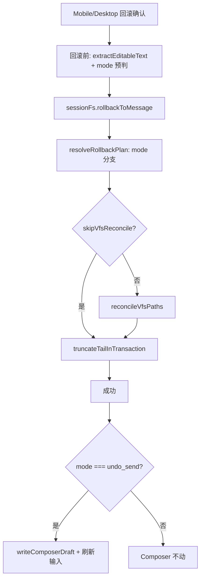

# 聊天 User 回滚重做（Undo Send）技术规格（SPEC）

> **PRD**：`.apm/kb/docs/Iterations/chat-user-rollback-redo/prd.md`  
> **Supersede（部分）**：
> - [`message-rollback-remove-session-log/spec.md`](../message-rollback-remove-session-log/spec.md) — plain text user 锚点 **不再保留**；含锚点截断 + VFS prior@`seq-1`
> - [`rollback-failure-degraded-fallback/spec.md`](../rollback-failure-degraded-fallback/spec.md) — plain user 路径下 `skipVfsReconcile` 截断边界改为 **含锚点**；降级确认文案分化  
> **保持**：assistant / 非 plain user 回滚、`resolveRollbackAnchorMessage` tool turn 边界、revision backfill / VFS 降级链、Mobile 回滚后贴底 scroll  
> **建议分支**：`feat/chat-user-rollback-redo`

## 设计目标

1. **三分支回滚语义**：plain text user → Undo Send（含锚点删除 + VFS 发送前 prior + Composer 恢复）；assistant / 不可恢复 user → 现网 Rewind（保留锚点、删后续、Composer 不动）。
2. **Core 为权威**：模式判定与 `extractEditableTextFromMessage` 下沉 Core；CLI 自动跟随；双端 UI re-export 或对照单测防漂移。
3. **最小侵入**：`truncateTailInTransaction`、`deleteAfterSeq`、`RollbackOptions` 签名不变；仅 `resolveRollbackPlan` 入参/分支与 VFS target 解析变化。
4. **双端 parity**：确认文案、降级文案、Composer 恢复行为对齐；IPC 不扩展（Composer 纯 Renderer 职责）。

## 需求来源

| 项 | 路径 |
|----|------|
| PRD | `.apm/kb/docs/Iterations/chat-user-rollback-redo/prd.md` |
| 前置 PRD | `message-rollback-remove-session-log`、`message-checkpoint-v2`、`rollback-failure-degraded-fallback` |

## 总体方案

### 回滚模式判定

```text
clicked = messages.findById(messageId)
anchor = resolveRollbackAnchorMessage(allMessages, messageId) ?? clicked
mode = isPlainUserUndoSendEligible(anchor) ? 'undo_send' : 'rewind'
```

**`isPlainUserUndoSendEligible`（Core 定案，不可仅用 `isPlainUserText`）**：

| 条件 | 结果 |
|------|------|
| `role !== 'user'` | false |
| `hasToolResult(message)` | false |
| `readMessageMetadata(message)?.kind === 'user_vfs_action'` | false |
| `extractEditableTextFromMessage(message) != null` | true → eligible |

> **反例**：`user_vfs_action` 底层行含 XML text，`isPlainUserText` 为 true，但 **必须** 走 `rewind`（PRD：同 Assistant）。

### 截断与 VFS 边界

| mode | `truncateAfterSeq` | tail 消息 | VFS target |
|------|-------------------|-----------|------------|
| `undo_send` | `anchor.seq - 1` | `seq >= anchor.seq` | `findCheckpointMessageIdAtOrBefore(sessionId, anchor.seq - 1)` **仅 prior**（跳过 anchor direct checkpoint） |
| `rewind` | `anchor.seq` | `seq > anchor.seq` | 现网 `resolveRollbackTargetTree(anchor.id, anchor.seq)` |

`anchor.seq === 1` 时：`truncateAfterSeq = 0` → 删除全部消息；VFS `maxSeq = 0` → 无 prior → 空树。

`skipVfsReconcile: true`：**仅跳过** `reconcileVfsPaths`；`truncateAfterSeq` / tail 范围 **与完整回滚相同**（plain user 仍含锚点删除）。

### 架构



### Composer 恢复（UI）

- **时机**：Core 调用 **成功** 后（含 `skipVfsReconcile` 降级成功）。
- **文本来源**：回滚 **前** 从内存中目标消息 `extractEditableTextFromMessage`（Core 导出）；Core 删除锚点后 UI 不可再读 DB。
- **覆盖草稿**：plain user 成功回滚须覆盖 Mobile `chat-composer-draft` 与 Desktop session 级输入 state。
- **输入解锁**：plain user 删锚点后 `reloadMessages` → `deriveComposerSendState` → `lastMessageIsPlainUserText === false`（依赖 Core 截断正确）。

## 最终项目结构

```text
packages/core/src/
  domain/chat/logic/
    editable-text-from-message.ts          # 新增：extract + isPlainUserUndoSendEligible
  domain/message-checkpoint/logic/
    resolve-target-tree.ts                 # +resolveRollbackTargetTreeForMode 或 plan 内分支
  service/message-checkpoint/
    impl/message-rollback.service.ts       # RollbackPlan.mode；三分支 afterSeq / tail / targetTree
  domain/chat/logic/rollback-confirm-copy.ts  # 新增（可选集中）：确认/降级文案
  public/chat.ts                           # 导出新 helper
  test/message-checkpoint/
    rollback.test.ts                       # R2/R2b/R3 翻转；+U1–U3、N1–N2
    rollback-degraded.test.ts              # +DF-U1–U3
    rollback-undo-send.test.ts             # 新增：资格判定 + prior tree
    rollback-to-message.test.ts            # user 用例翻转
  test/chat/editable-text-from-message.test.ts  # 新增

apps/mobile/src/
  components/chat/message-edit.ts          # editableTextFromMessage → re-export Core
  components/chat/ChatComposer.tsx         # +draftRestoreToken
  screens/tabs/chat-tab/useChatTabMessages.ts  # 分支确认文案；回滚前缓存 text；成功后写 draft
  screens/tabs/chat-tab/ChatConversationPanel.tsx  # 透传 draftRestoreToken
  __tests__/rollback-confirm-copy.test.ts  # 新增（或 Core 单测）
  e2e/specs/chat.rollback.e2e.ts         # 翻转 + Composer 断言

apps/desktop/renderer/features/chat/
  ChatComposer.tsx                         # 半受控：value + onChange（或 draftText）
  ConversationPanel.tsx                  # lift composerText；分支确认；executeRollback 写输入
  message-edit.ts                          # re-export Core
  test/rollback-composer.test.ts           # 新增（可选）

apps/cli/src/session/commands.ts           # 无改代码（跟随 Core）；+集成测
```

## 变更点清单

### Core

#### 1. `editable-text-from-message.ts`（新）

```typescript
export function extractEditableTextFromMessage(message: ChatMessage): string | null;
export function isPlainUserUndoSendEligible(message: ChatMessage): boolean;
```

- `extractEditableTextFromMessage`：与现网 `apps/*/message-edit.ts` 规则一致（仅 `text` 块，`\n\n` 拼接，trim 后非空）。
- `isPlainUserUndoSendEligible`：见上表；**必须**排除 `user_vfs_action`。

#### 2. `message-rollback.service.ts`

`RollbackPlan` 扩展：

```typescript
type RollbackMode = 'undo_send' | 'rewind';

type RollbackPlan = {
  mode: RollbackMode;
  anchor: ChatMessage;
  truncateAfterSeq: number;
  tailMessageIds: string[];
  pathsToReconcile: Set<string>;
  targetTree: Map<string, number>;
  // ...existing
};
```

`resolveRollbackPlan` 变更要点：

- `mode` 由 `isPlainUserUndoSendEligible(anchor)` 决定（anchor 经 `resolveRollbackAnchorMessage` 解析后）。
- `undo_send`：
  - `truncateAfterSeq = anchor.seq - 1`
  - `tailMessageIds` = `allMessages.filter(m => m.seq >= anchor.seq).map(m => m.id)`
  - `targetTree` = 仅 prior：`findCheckpointMessageIdAtOrBefore(sessionId, anchor.seq - 1)` → `loadFileTree`；无则 `new Map()`
  - **不**调用 `checkpoints.loadFileTree(sessionId, anchor.id)`
- `rewind`：保持现网逻辑。
- `pathsToReconcile`：`undo_send` 时 `tailPointers` 含锚点 checkpoint 路径；`directTargetTree` 空树 diff 逻辑按 prior tree 键集计算（与现网 `directTargetTree != null` 分支等价，改为 `targetTree.size > 0` 或显式 flag）。

`rollbackToMessage` 事务内：

```typescript
await truncateTailInTransaction(..., { afterSeq: plan.truncateAfterSeq, ... });
```

#### 3. `resolve-target-tree.ts`（可选抽取）

新增 `resolvePriorRollbackTargetTree(checkpoints, sessionId, maxSeq)`，供 `undo_send` 与单测复用；`resolveRollbackTargetTree` **不变**（rewind 路径继续用）。

#### 4. `rollback-confirm-copy.ts`（新，推荐）

集中双端确认文案，避免 Mobile/Desktop 漂移：

```typescript
export type RollbackConfirmKind = 'primary' | 'degraded' | 'backfill';

export function resolveRollbackConfirmMessage(
  mode: RollbackMode,
  kind: RollbackConfirmKind,
  ctx?: { missingPaths?: string[] },
): string;
```

| kind | rewind | undo_send |
|------|--------|-----------|
| primary | 将删除此消息**之后**的对话，并撤销相关文件修改。是否继续？ | 将删除此消息**及之后**的对话，并撤销相关文件修改。是否继续？ |
| degraded | 可仅删除此消息**之后**的对话，工作区文件将保持现状。 | 可仅删除此消息**及之后**的对话，工作区文件将保持现状。 |
| backfill | 沿用 `formatRollbackRevisionBackfillAlertMessage`；末句「回滚至锚点」在 undo_send 时改为「回滚至发送前状态」 |

`formatRollbackRevisionBackfillAlertMessage`：增加可选 `mode?: RollbackMode` 参数，或 backfill 文案由 `resolveRollbackConfirmMessage` 统一生成。

#### 5. `public/chat.ts`

导出 `extractEditableTextFromMessage`、`isPlainUserUndoSendEligible`。

### Mobile

#### 6. `message-edit.ts`

```typescript
export { extractEditableTextFromMessage as editableTextFromMessage } from '@novel-master/core/chat';
// applyTextEditToMessage 保留本地
```

#### 7. `useChatTabMessages.ts` — `handleRollbackFromMessage`

1. 解析 `target = messages.find(id)`；`mode = isPlainUserUndoSendEligible(target) ? 'undo_send' : 'rewind'`；`restoreText = extractEditableTextFromMessage(target)`。
2. `Alert.alert` 正文使用 `resolveRollbackConfirmMessage(mode, 'primary')`。
3. 降级 Alert 使用 `resolveRollbackConfirmMessage(mode, 'degraded')`。
4. 成功后：`reloadMessages(true)`；若 `mode === 'undo_send' && restoreText` → `writeChatComposerDraft(sessionId, restoreText)` + `setDraftRestoreToken(t => t+1)`（或等价）。
5. 降级成功路径 **同样** 执行 Composer 恢复（PRD：含锚点截断后须恢复原文）。

#### 8. `ChatComposer.tsx`

新增 prop：

```typescript
draftRestoreToken?: number;
```

`useEffect` 依赖 `[sessionId, draftRestoreToken]`：`setText(readChatComposerDraft(sessionId))`。

#### 9. `ChatConversationPanel.tsx`

从 `useChatTabMessages` 接收 `draftRestoreToken` 透传 `ChatComposer`。

### Desktop

#### 10. `ConversationPanel.tsx` + `ChatComposer.tsx`

**方案（定案）**：`ConversationPanel` 持有 `composerText` + `setComposerText`；`ChatComposer` 改为受控：

```typescript
value: string;
onChange: (text: string) => void;
```

- `sessionId` 变更时：`setComposerText('')`（补齐 Mobile draft 切换语义）。
- `executeRollback`：回滚前缓存 `restoreText` / `mode`；成功后 `mode === 'undo_send'` → `setComposerText(restoreText)`。
- `confirmState` 扩展 `rollbackMode?: RollbackMode` 供 `confirmMessage` 分支。

IPC **不改**；`handleMessagesRollback` 透传 `RollbackOptions` 不变。

### CLI

`apps/cli/src/session/commands.ts` **无代码变更**；新增集成测验证 plain user / assistant 截断差异。

## 兼容性与迁移说明

| 项 | 说明 |
|----|------|
| API 签名 | `rollbackToMessage(sessionId, projectId, messageId, options?)` **不变**；模式由 message 内容推导，无新 `RollbackOptions` 字段 |
| DB schema | 无 migration |
| 历史测试 | plain user 用例语义翻转；assistant / tool turn / degraded assistant **非回归** |
| E2E | `chat.rollback.e2e.ts` 用例 1/2 期望从「锚点保留」改为「锚点删除 + Composer 原文」 |
| 与「编辑」 | 编辑仍 `updateContent` 不截断；回滚仍截断 tail，二者互斥 |

## 详细实现步骤

- Step 1 — phase-core-eligibility — blocking: yes — qa: auto：新增 `editable-text-from-message.ts` + `editable-text-from-message.test.ts`（含 `user_vfs_action` 排除、tool_result 排除）→ `public/chat.ts` 导出
- Step 2 — phase-core-rollback-mode — blocking: yes — qa: auto：`message-rollback.service.ts` 引入 `RollbackMode`、`truncateAfterSeq`、prior-only targetTree、tail 含锚点；`rollback.test.ts` 翻转 R2/R2b/R3，新增 U1–U3、N1–N2
- Step 3 — phase-core-degraded — blocking: yes — qa: auto：`rollback-degraded.test.ts` 新增 DF-U1–U3；`rollback-to-message.test.ts` 翻转 user 用例；确认 `skipVfsReconcile` 在 undo_send 下 `afterSeq = seq-1`
- Step 4 — phase-core-confirm-copy — blocking: yes — qa: auto：新增 `rollback-confirm-copy.ts` + 单测；扩展 `formatRollbackRevisionBackfillAlertMessage` 支持 undo_send 末句
- Step 5 — phase-mobile-ui — blocking: yes — qa: auto：Mobile `message-edit` re-export；`useChatTabMessages` 分支文案 + Composer 恢复；`ChatComposer` `draftRestoreToken`；`ChatConversationPanel` 透传
- Step 6 — phase-desktop-ui — blocking: yes — qa: auto：Desktop `ChatComposer` 受控化；`ConversationPanel` lift state + 回滚恢复 + 确认文案分支
- Step 7 — phase-cli-test — blocking: yes — qa: auto：CLI session rollback 集成测（plain user 含锚点删除 vs assistant 保留锚点）
- Step 8 — phase-e2e — blocking: yes — qa: auto：更新 `chat.rollback.e2e.ts`；可选更新 `chat.rollback-vfs.e2e.ts` VFS 边界
- Step 9 — phase-verify-core — blocking: yes — qa: auto：`packages/core` 全量 `npm test`
- Step 10 — phase-verify-apps — blocking: yes — qa: auto：`apps/desktop` + `apps/mobile` 相关单测绿
- Step 11 — phase-verify-full — blocking: yes — qa: auto：根目录 `npm test` 绿（既有环境 fail 按 waiver 记录）
- Step 12 — phase-manual-smoke — blocking: no — qa: manual_user：双端 plain user 回滚 → Composer 有原文可改可发；assistant 回滚输入不动；user_vfs_turn 保留锚点

## 测试策略

### 测试矩阵（T → Step）

| ID | Step | 场景 | 断言 |
|----|------|------|------|
| T-C1 | 1 | `user_vfs_action` 行 | `isPlainUserUndoSendEligible === false` |
| T-C2 | 1 | plain user 多 text 块 | `extractEditableTextFromMessage` 与 UI 旧实现一致 |
| T-C3 | 1 | 纯 tool_result user | eligible false |
| T-R1 | 2 | undo_send：user₁→asst₁→user₂ 回滚 user₁ | messages 无 user₁ 及之后；VFS = user₁ 发送前 |
| T-R2 | 2 | undo_send：首条 plain user | messages 空；VFS 空树 |
| T-R3 | 2 | rewind：assistant 锚点 R1 | 锚点保留；无回归 |
| T-R4 | 2 | rewind：user_vfs_turn 锚点 | 锚点保留；VFS 现网 |
| T-R5 | 2 | rewind：tool turn assistant | tool_result 边界；3 条保留 |
| T-D1 | 3 | undo_send + skipVfsReconcile | 锚点删除；VFS 不变 |
| T-D2 | 3 | undo_send + revision backfill 成功 | 含锚点删除 + prior VFS |
| T-D3 | 3 | rewind + skipVfsReconcile DF2 | assistant 锚点保留（非回归） |
| T-M1 | 5 | Mobile 确认文案 undo_send | 含「及之后」 |
| T-M2 | 5 | Mobile 回滚成功写 draft | `readChatComposerDraft === anchorText` |
| T-M3 | 5 | Mobile assistant 回滚 | draft 不变 |
| T-W1 | 6 | Desktop 受控 Composer 恢复 | `composerText === anchorText` |
| T-W2 | 6 | Desktop assistant 回滚 | `composerText` 不变 |
| T-CLI1 | 7 | CLI plain user rollback | DB 无锚点消息 |
| T-CLI2 | 7 | CLI assistant rollback | 锚点保留 |
| T-E1 | 8 | E2E plain user 回滚 | 列表无锚点；Composer 显示原文 |
| T-E2 | 8 | E2E assistant 回滚 | 锚点仍在 |
| T-E3 | 8 | E2E 回滚前草稿覆盖 | Composer 为锚点原文非旧草稿 |

### 非回归护栏

- `resolve-rollback-anchor.test.ts` 全绿
- `rollback.test.ts` R1、R4、R9、R10、tool turn
- `rollback-degraded.test.ts` DF1、DF2（assistant）、DF3–DF6
- `message-action-items.test.ts` 双端菜单项不变
- `truncate-tail-in-transaction.test.ts` 全绿

## 风险与回滚方案

| 风险 | 缓解 | 回滚 |
|------|------|------|
| `user_vfs_action` 误判为 undo_send | `isPlainUserUndoSendEligible` 显式排除 metadata.kind；T-C1 | revert Core eligibility |
| Desktop Composer 受控化回归 | Step 6 单测 T-W1/W2；发送/空发/桥接路径手测 | revert Desktop ChatComposer + Panel |
| 双端文案漂移 | Core `rollback-confirm-copy.ts` 集中；T-M1 | revert 文案 helper |
| plain user 首条 undo 删光 VFS 未 checkpoint 文件 | PRD 已接受 prior/空树语义；T-R2 覆盖 | 产品决策，非实现回滚 |
| backfill 文案「回滚至锚点」误导 undo_send | Step 4 分化末句 | revert `formatRollbackRevisionBackfillAlertMessage` 扩展 |
| E2E 脆弱 | 先 Core 单测绿再 E2E；Composer 断言用 testID | 暂跳过 E2E Composer 断言 |

**分阶段回滚**：Step 1–4 可单独 revert Core；Step 5–6 UI 可独立 revert；无 DB migration。

**整包回滚**：revert 分支；恢复 `rollback.test.ts` / E2E 旧断言。
