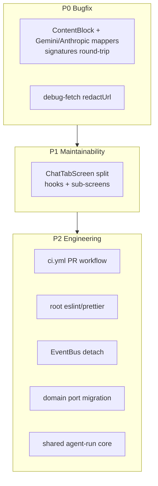

# 代码库审计整改 技术规格（SPEC）

> 需求：[prd.md](./prd.md)  
> 调查基准：2026-06 代码库 18 项审计核查结论

## 设计目标

- 修复 **Gemini `thought_signature` + Anthropic `signature` / `redacted_thinking`** 多轮断裂（P0），不破坏 OpenAI 路径。
- **最小 diff** 整改工程化与架构债；ChatTabScreen 拆分保持 UX 与 IPC/导航契约不变。
- 所有 Core schema 变更 **向后兼容**（旧 `content_json` 无新字段仍可读）。
- 分 PR 交付，每 PR 可独立 `npm test` 绿。

---

## 现状与约束（代码探索）

| 项 | 现状 | 影响 |
|----|------|------|
| Thinking signature (Gemini) | `ThinkingBlock` 仅 `{ type, text }`；`geminiPartsToBlocks` 不读 `thought_signature`；`blocksToGeminiParts` 出站仅 `{ text, thought: true }` | Gemini 2.5+ FC、Gemini 3 多轮 400 |
| Thinking signature (Anthropic) | `anthropic-content-mapper.ts` 入站 `thinking` 仅取 `thinking` 文本，**忽略 `signature`**；出站 `{ type: "thinking", thinking: text }`；`redacted_thinking` **未映射**（`default` 跳过）；`anthropic-sse-parser.ts` 无 `signature_delta` 处理 | Claude extended thinking + tool 多轮 400 或推理断裂 |
| debug-fetch | `redactHeaders` 处理 `authorization`/`x-api-key`；**URL 原样 log** | Gemini `?key=` 泄露 |
| ChatTabScreen | `apps/mobile/src/screens/tabs/ChatTabScreen.tsx` **1773 行** | 维护、review、冲突成本高 |
| preload | `main.ts` 强制 `preload.cjs`；`smoke.test.js` 断言无 ESM `import` | ESM 问题已缓解，需防回归 |
| EventBus | `ChatComposer`/`useAgentStream` 有 cleanup；`main.ts` **未保存** `attachEventBusForwarder` 返回值；`DefaultEventOrchestrator.attachToBus` 无 detach | rebootstrap 可能重复订阅 |
| Domain→Service | 3 处：`restore-path.ts`→`VfsService`；`kkv-model-suggestion.repository.ts`→`KkvService`；`compaction-condition-trigger.port.ts`→`render-prompt` | 分层违规 |
| agent-run 重复 | `apps/mobile/.../agent-run.service.ts` 204 行；`apps/desktop/.../agent-run.service.ts` 234 行，结构镜像 | 双份修 bug |
| SSE buffer | `openai/anthropic/gemini-sse-parser.ts` 相同 `buffer += chunk; split("\n")` | 重复 ~15 行 ×3 |
| Anthropic version | `anthropic.adapter.ts` 三处 `"2023-06-01"` 字面量 | 升级需改多处 |
| Lint/CI | 仅 `apps/mobile` 有 eslint/prettier；`.github/workflows/` 仅 `release.yml` | PR 无自动检查 |
| Desktop tests | `apps/desktop/test/` ~14 文件；core ~133 | Desktop 回归薄弱 |
| React.memo | 全库 2 处；`style={{` **213** 处 | 性能债，增量处理 |
| core index | `packages/core/src/index.ts` **555** 行桶导出 | 树摇与编译慢 |
| domain repo impl | `domain/*/repositories/impl/*.ts` 多处 | 理想应在 infra |
| greet | `core/index.ts` + `cli/main.ts` | 脚手架残留 |
| `[debug-chat]` | **0 匹配** | 关闭，无改动 |
| Fetch 整流器 | `createSseChunkEmitter` 仅 `postSseViaXhr`；`postSseViaFetch` 直传 chunk | **有意设计**（见 mobile-sse-stream-resilience spec） |

---

## 总体方案



**分 PR 顺序**：M1(signature+redact) → M2(ChatTab) → M3(CI+lint) → M4(architecture) → M5(cleanup)。

---

## 最终项目结构

```
packages/core/src/
  domain/chat/model/content-block.ts          # + thinkingSignature; + RedactedThinkingBlock
  infra/llm-protocol/logic/
    debug-fetch.ts                            # + redactUrl()
    gemini-content-mapper.ts                  # parse/emit thought_signature
    gemini-sse-parser.ts                      # extract thought_signature from stream parts
    anthropic-content-mapper.ts               # parse/emit signature + redacted_thinking
    anthropic-sse-parser.ts                   # signature_delta accumulation
    sse-line-buffer.ts                        # NEW: shared feedSseLines
    anthropic-api-version.ts                  # NEW: constant
  service/agent/logic/
    agent-run-shared.ts                       # NEW: resolveCurrent*, run scope helpers
  infra/events/event-orchestrator-lifecycle.ts  # optional: detach helper

apps/mobile/src/screens/tabs/
  ChatTabScreen.tsx                           # ≤800 lines, re-export orchestrator
  chat-tab/
    useChatTabScope.ts                        # NEW
    useChatTabMessages.ts                     # NEW
    useChatTabStream.ts                       # NEW
    ChatSessionListPanel.tsx                  # NEW
    ChatConversationPanel.tsx                 # NEW

apps/desktop/src/main/
  main.ts                                     # store + call bus cleanups
  services/agent-run.service.ts               # thin wrapper → core shared

.github/workflows/
  ci.yml                                      # NEW: pull_request

eslint.config.js                              # NEW at repo root (or extend mobile config)
```

---

## 变更点清单

| 文件 / 区域 | 变更类型 | 优先级 |
|-------------|----------|--------|
| `content-block.ts` | `ThinkingBlock.thinkingSignature?`；`ToolUseBlock.thinkingSignature?`；`RedactedThinkingBlock` | P0 |
| `gemini-content-mapper.ts` | 入站/出站 `thought_signature` round-trip | P0 |
| `gemini-sse-parser.ts` | 流式解析 `thought_signature` | P0 |
| `anthropic-content-mapper.ts` | 入站/出站 `signature`；`redacted_thinking` 原样 round-trip | P0 |
| `anthropic-sse-parser.ts` | `content_block_start` thinking 块 + `signature_delta` 累积 | P0 |
| `gemini.adapter.ts` / `anthropic.adapter.ts` | 非流式响应走完整 mapper | P0 |
| `debug-fetch.ts` | `redactUrl(url: string)` | P0 |
| `ChatTabScreen.tsx` + `chat-tab/*` | 拆分 | P1 |
| `.github/workflows/ci.yml` | PR CI | P2 |
| `package.json` (root) | `lint`, `format:check` scripts | P2 |
| `event-orchestrator.service.ts` | `detachFromBus()` | P2 |
| `main.ts` | cleanup on quit/rebootstrap | P2 |
| domain 3 文件 | port 迁移 | P2 |
| `agent-run-shared.ts` + mobile/desktop services | 去重 | P2 |
| `sse-line-buffer.ts` + 3 parsers | 抽取 | P2 |
| `anthropic.adapter.ts` | 用常量 | P2 |
| `index.ts` / `greet` | 删除 greet；文档子路径 export（增量） | P2 |
| `llm-sse-transport.ts` | 注释 fetch 路径不用 emitter | P3 |

---

## 详细实现步骤

### PR-1：Thinking signature 多协议闭环（P0）

#### 1. 扩展 ContentBlock（`content-block.ts`）

域层使用**厂商中立**字段名 `thinkingSignature`（opaque，不参与 UI 展示逻辑）：

```ts
export interface ThinkingBlock {
  readonly type: "thinking";
  readonly text: string;
  /** Opaque round-trip signature (Gemini thought_signature / Anthropic signature). */
  readonly thinkingSignature?: string;
}

export interface RedactedThinkingBlock {
  readonly type: "redacted_thinking";
  /** Anthropic redacted_thinking.data — opaque, must round-trip verbatim. */
  readonly data: string;
  readonly thinkingSignature?: string;
}

export interface ToolUseBlock {
  // ...existing
  readonly thinkingSignature?: string;
}
```

- 字段 **optional**；旧 `content_json` 无新字段仍可读。
- UI / `message-blocks.ts`：`redacted_thinking` 可映射为「思考（已脱敏）」占位，**不**解析 `data` 内容。

#### 2. Gemini 路径

**入站**（`gemini-content-mapper.ts` `geminiPartsToBlocks`）：
- 读 `part.thought_signature` / `part.thoughtSignature`。
- 写入 `thinking` / `tool_use` 块的 `thinkingSignature`。

**出站**（`blocksToGeminiParts`）：
- `thinking` → `{ text, thought: true, thought_signature?: sig }`。
- `tool_use` → 含 `functionCall` 的 part 上附带 `thought_signature`（parallel FC 仅首个 part 带签名 — 以 [Google 文档](https://ai.google.dev/gemini-api/docs/thought-signatures) 样例为准）。

**流式**（`gemini-sse-parser.ts`）：`processGeminiResponseChunk` 提取 part 级 `thought_signature`。

#### 3. Anthropic / Claude 路径

**现状缺口**（`anthropic-content-mapper.ts`）：

```54:55:packages/core/src/infra/llm-protocol/logic/anthropic-content-mapper.ts
      case "thinking":
        return { type: "thinking", thinking: block.text };
```

```129:137:packages/core/src/infra/llm-protocol/logic/anthropic-content-mapper.ts
      case "thinking": {
        const text = typeof item.thinking === "string" ? item.thinking : ...
        blocks.push({ type: "thinking", text });
        break;
      }
```

`redacted_thinking` 落入 `default` 分支被跳过。

**入站**（`anthropicContentToBlocks`）：
- `thinking`：读 `item.signature` → `thinkingSignature`；`display: "omitted"` 时 `thinking` 可为空但 **signature 必填回传**。
- `redacted_thinking`：映射为 `RedactedThinkingBlock`，保留 `data`（及可选 `signature`）。

**出站**（`blocksToAnthropicContent`）：
- `thinking` → `{ type: "thinking", thinking: block.text, signature?: block.thinkingSignature }`（有 signature 则带；text 可为 `""`）。
- `redacted_thinking` → `{ type: "redacted_thinking", data: block.data }`（原样）。
- **块顺序**：同一 assistant 轮内保持存储顺序 — thinking / redacted_thinking **必须在** `tool_use` 之前（与 [Anthropic tool use + thinking 文档](https://platform.claude.com/cookbook/extended-thinking-extended-thinking-with-tool-use) 一致）；`chatMessagesToAnthropic` 按 `msg.content.blocks` 顺序映射即可。

**流式**（`anthropic-sse-parser.ts`）：
- `content_block_start` 且 `block.type === "thinking"`：新建 accumulator（text + signature 缓冲）。
- `content_block_delta`：
  - `thinking_delta` → 追加 text（现有逻辑）。
  - **`signature_delta`** → 追加 signature 字符串（Claude 4+ 流式在 `content_block_stop` 前下发）。
- `content_block_stop`：flush 为 `ThinkingBlock`（含 `thinkingSignature`）。
- `content_block_start` 且 `block.type === "redacted_thinking"`：按块类型 flush 为 `RedactedThinkingBlock`。

**非流式**（`anthropic.adapter.ts`）：`chatNonStream` 的 `content[]` 已走 `anthropicContentToBlocks`，扩展 mapper 即可。

#### 4. 持久化与 prompt 路径

- 无需 DB migration：`content_json` 存 blocks 数组。
- `buildPromptLlmInput` → `chatMessagesToGeminiContents` / `chatMessagesToAnthropic` 使用完整 `msg.content.blocks`（已满足）。
- OpenAI 路径：出站继续 strip `thinking`（现有行为不变）。

#### 5. 测试（`packages/core/test/infra/llm-protocol/`）

| 文件 | 用例 |
|------|------|
| `gemini-thought-signature.test.ts` | parse + round-trip；parallel FC 首 part 签名 |
| `anthropic-thinking-signature.test.ts` | **新建**：非流式 `thinking`+`signature` round-trip；`redacted_thinking` round-trip；`chatMessagesToAnthropic` 第二轮含 signature |
| `anthropic-sse-parser.test.ts` | 扩展：`signature_delta` 分片拼接；thinking 在 tool_use 之前 |
| `anthropic-blocks.test.ts` | 回归：无 signature 的旧 payload 仍解析 |

**Wire 字段对照**：

| 厂商 | 响应字段 | 域模型 | 请求回传字段 |
|------|----------|--------|--------------|
| Gemini | `thought_signature` | `thinkingSignature` | `thought_signature` |
| Anthropic | `signature` | `thinkingSignature` | `signature` |
| Anthropic | `redacted_thinking.data` | `RedactedThinkingBlock.data` | `redacted_thinking` 原对象 |

### PR-2：debug-fetch URL 脱敏（P0）

1. **`debug-fetch.ts`** 新增：
   ```ts
   function redactUrl(url: string): string {
     try {
       const u = new URL(url);
       if (u.searchParams.has("key")) {
         u.searchParams.set("key", "***");
       }
       return u.toString();
     } catch {
       return url.replace(/([?&]key=)[^&]+/gi, "$1***");
     }
   }
   ```
2. `createLoggingFetch` 中 `console.log(LOG_TAG, "→", method, redactUrl(url))`。
3. 测试：`packages/core/test/infra/llm-protocol/debug-fetch.test.ts`（新建）断言 redact 行为。

### PR-3：ChatTabScreen 拆分（P1）

**原则**：先抽 **无 UI 的 hooks**，再抽 **纯展示子组件**，最后瘦身上层 `ChatTabScreen`。

| 新模块 | 职责 | 从 ChatTabScreen 迁出 |
|--------|------|------------------------|
| `useChatTabScope.ts` | project/session、drawer 开关、subview 状态 | `useMobileScope` 之上的本地 UI 状态 |
| `useChatTabMessages.ts` | `chatMessages`、分页、`reloadMessages`、`prependOlder` | ~lines 140–400 区间 |
| `useChatTabStream.ts` | stream buffer、imperative flush、agent heartbeat refs | stream-buffer + eventBus 相关 |
| `ChatSessionListPanel.tsx` | 会话列表、SegmentedControl、批量删会话 | sessions subview |
| `ChatConversationPanel.tsx` | MessageList / WebView、composer 区、workspace panel | conversation subview |

- `ChatTabScreen.tsx` 保留：导航 header 绑定、`useFocusEffect`、顶层 layout 组合。
- **不改** `ChatComposer`、`ChatTranscriptWebView` 公共 API。
- 每抽一块跑 `npm test -w @novel-master/mobile`（如有）+ 手工 smoke。

### PR-4：CI + Lint（P2）

1. **`.github/workflows/ci.yml`**：
   ```yaml
   on:
     pull_request:
       branches: [main]
   jobs:
     test:
       runs-on: ubuntu-latest
       steps:
         - uses: actions/checkout@v4
         - uses: actions/setup-node@v4
           with: { node-version: "22", cache: npm }
         - run: npm ci
         - run: npm run build -w @novel-master/core
         - run: npm run test:core:fast
         - run: npm run build -w @novel-master/desktop
         - run: npm test -w @novel-master/desktop
         - run: npm run lint --if-present
   ```
2. 根 `package.json` 增加：
   ```json
   "lint": "npm run lint --workspaces --if-present",
   "format:check": "npm run format:check --workspaces --if-present"
   ```
3. 为 `packages/core`、`apps/desktop`、`apps/cli` 添加最小 eslint flat config（extends `@typescript-eslint/recommended`，**首期允许 warn 存量**）。
4. `apps/mobile` 已有配置：补 `format:check`: `prettier --check .`。

### PR-5：EventBus 生命周期（P2）

1. `DefaultEventOrchestrator`：
   - 保存 `subscriptions: Array<{ unsubscribe }>`；
   - `detachFromBus()` 遍历 unsubscribe 并 `busAttached = false`。
2. `create-event-orchestrator.ts`：export detach 或返回 `{ orchestrator, detach }`。
3. `apps/desktop/src/main/main.ts`：
   ```ts
   let detachBusForwarder: (() => void) | undefined;
   let detachWorktreeSync: (() => void) | undefined;
   // bootstrapMainServices:
   detachBusForwarder = attachEventBusForwarder(runtime.eventBus);
   detachWorktreeSync = attachSessionWorktreeSync(runtime.eventBus);
   // before-quit + rebootstrap path:
   detachBusForwarder?.(); detachWorktreeSync?.();
   ```
4. 测试：`forward-event-bus` 已有 detach；加 integration test 双击 attach 不双发。

### PR-6：Domain 反向依赖（P2）

| 文件 | 改法 |
|------|------|
| `restore-path.ts` | 将 `VfsService` 改为 `VfsRestorePort`（domain port，方法最小集）；impl 在 service 层注入 |
| `kkv-model-suggestion.repository.ts` | 依赖 `KkvReaderPort`（`get`/`set` 子集）定义在 `domain/kkv/ports/` |
| `compaction-condition-trigger.port.ts` | 将 `render-prompt` 类型依赖改为 domain 层 `PromptRenderInput` 类型，或移 trigger 评估至 service |

- 跑 `grep -r "@/service/" packages/core/src/domain` → 0。

### PR-7：agent-run 共享（P2）

1. 新建 `packages/core/src/service/agent/logic/agent-run-shared.ts`：
   - `resolveCurrentAgentId(runtime: AgentRunRuntimePort)`
   - `resolveCurrentAgentDefinition(...)`
   - `resolveApplicationModelIdForRun(...)`
   - `AgentRunRuntimePort`：最小接口（`state`, `agentRegistry`）。
2. Mobile/Desktop `AgentRunError` 可保留本地或提升至 core errors。
3. 平台差异（`desktopLog`、`parseApplicationModelId`）留在 desktop 薄层。

### PR-8：SSE buffer + Anthropic 常量 + greet（P2/P3）

1. **`sse-line-buffer.ts`**：
   ```ts
   export function feedSseLines(
     state: { buffer: string },
     chunk: string,
     onLine: (line: string) => void,
   ): void { /* shared split logic */ }
   ```
2. 三 parser 改为调用 `feedSseLines`；跑现有 parser 测试无 diff。
3. **`anthropic-api-version.ts`**：`export const ANTHROPIC_API_VERSION = "2023-06-01" as const;`
4. 删除 `greet`：`core/index.ts`、`cli/main.ts`（若 cli 演示用，改 `console.log(PACKAGE_NAME)`）。

### PR-9：文档与防回归（P3）

1. `apps/desktop/README.md`：强调 preload **必须** CJS。
2. `llm-sse-transport.ts` 模块头：注明 fetch 路径不使用 `SseChunkEmitter` 的原因（链到 `mobile-sse-stream-resilience` spec）。
3. `.apm/kb/docs/monorepo.md`：repository impl 目标目录为 `infra/*/repositories`（增量迁移）。

### 明确不做（本迭代）

- `postSseViaFetch` 加整流器。
- 全量 inline style 清理。
- 一次性迁移所有 `domain/*/repositories/impl`。

---

## 测试策略

### 单元测试（core）

| 用例 | 文件 |
|------|------|
| Gemini `thought_signature` parse + round-trip | `gemini-thought-signature.test.ts` |
| Anthropic `signature` + `redacted_thinking` round-trip | `anthropic-thinking-signature.test.ts` |
| Anthropic SSE `signature_delta` | `anthropic-sse-parser.test.ts` 扩展 |
| debug-fetch URL redact | `debug-fetch.test.ts` |
| SSE line buffer 与三 parser 等价 | 现有 `*-sse-parser.test.ts` |
| agent-run-shared resolve | `agent-run-shared.test.ts` |
| EventOrchestrator detach | `event-orchestrator.dag.test.ts` 扩展 |

### Desktop

| 用例 | 文件 |
|------|------|
| preload CJS 回归 | 现有 `smoke.test.js` |
| bus forwarder 不重复 | 新 `forward-event-bus.test.ts`（main 层 mock bus） |

### Mobile

| 用例 | 方式 |
|------|------|
| ChatTab 拆分回归 | 现有 `e2e/specs/chat.*.e2e.ts` |
| 手工 | 流式 + WebView transcript + 批量删 |

### CI

- PR 必绿：`test:core:fast` + `desktop test` + `lint`（warn 可配置）。

---

## 风险与回滚方案

| 风险 | 回滚 |
|------|------|
| signature schema 导致旧 APK 解析失败 | 字段 optional；旧客户端忽略未知 JSON key / 未知 block type |
| Anthropic `signature` 超长 | 仅存 opaque string，不参与 UI 渲染 |
| ChatTab 拆分回归 | 按 PR  revert 单个子模块；保持 git 小 commit |
| CI 阻断存量 lint | 首期 `continue-on-error: true` on lint job，两周后收紧 |
| Domain port 迁移漏注入 | 集成测试覆盖 restore-path、compaction trigger |

**回滚顺序**：若 M1 上线后仍 400，可临时在 adapter 层增加 feature flag `preserveThinkingSignatures`（默认 true），分别关闭 Gemini / Anthropic 签名回传以隔离问题。

---

## 执行检查清单

- [x] 已读取 `prd.md`
- [x] 已完成相关代码探索
- [x] 已体现现状约束与影响分析
- [x] 已生成 `spec.md`
- [ ] 待用户确认 `spec.md` 后再进入编码
- [ ] 编码完成后 `apm kb index rebuild`
