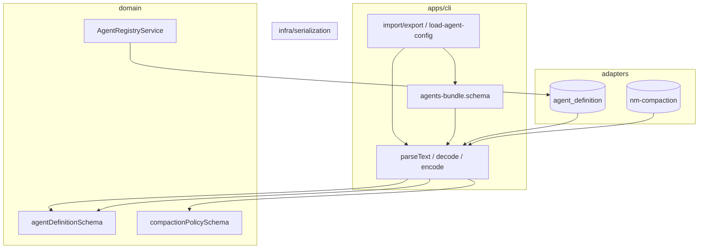

# Agent 注册表 SQL 化 — 技术规格（SPEC）

> **迭代目录名**：`compaction-agent-update`（历史命名；本期 **主交付** 为 Agent 注册表 SQL + **领域/序列化分层整理**。）

## 破坏性变更（本期原则）

**不考虑向后兼容**。不保留 deprecated 别名、环境变量回退、旧路径 re-export、`file-agent-resolver` 双源。

| 变更 | 迁前 | 迁后 |
|------|------|------|
| Agent **运行源** | `{home}/agents.yaml` 或 bundle 文件 | **仅** `agent_definition` 表 |
| `--agent-id` | 可无 / 读 yaml | **必须** DB 已存在；先 `nm agent import` |
| Core 公开 API | `*FromJson`、`deserializeAgentDefinition`、`agentsBundleFromJson` | **删除**；仅用 `parseText` / `decode` / `encode` + schema |
| `AgentDefinition.schemaVersion` | 在领域类型上 | **删除**（仅 wire schema 可带版本号） |
| `file-agent-resolver.ts` | 默认解析器 | **删除** |
| `NM_AGENT_SOURCE` | — | **不实现** |
| `index.ts` 旧路径 export | 扁平 `domain/agent/*.ts` | **不** re-export；调用方改 import |
| 旧 KKV `nm-compaction/policy` JSON | 手写 / 旧 from-json 形状 | 须能被 `compactionPolicySchema` **decode**；否则 `nm compaction set` 重写（无自动迁移脚本） |

**保留**（非兼容层，而是产品能力）：`--agent-config <path>` 单次读文件 → `decode` → 可选 `--save` 写入 DB；`nm agent import/export` 交换 yaml。

---

## 设计目标

1. **工作区 Agent 注册表**：`agents.yaml` bundle → **`novel.db` / `agent_definition`**（对齐 `domain/provider` 的 1:N SQL + Repository）。
2. **全局压缩策略**：继续 **KKV** `nm-compaction/policy`；仅 **agentId 解析/校验** 改读 DB。
3. **分层纠正**：Domain 只保留 **类型 + Zod schema + 行为**；**YAML/JSON 字符串解析** 与 **`agents.yaml` bundle** 归 **通用 infra** 与 **CLI**；类比 Java 的 `ObjectMapper`（infra）vs `AgentDefinition` class（domain + schema）。

| 范围 | 迁移前 | 迁移后 |
|------|--------|--------|
| Agent 注册表 | `{home}/agents.yaml` | SQL **`agent_definition`** |
| 全局压缩策略 | KKV | **不变** |
| 工作区指针 | KKV | **不变** |
| `--agent-config <path>` | 文件 | **保留**；CLI `parseText` + `decode(schema)` |

**不考虑**：`compaction_policy` SQL 表；prompt 子表；RN / mobile 接真 DB。

---

## 分层原则（本期必须遵守）

```text
┌─────────────────────────────────────────────────────────────┐
│ apps/cli                                                     │
│  文件路径、agents.yaml、migrate/import/export、bundle 外壳   │
│  agents-bundle.schema.ts（仅交换格式，非领域概念）            │
└───────────────────────────┬─────────────────────────────────┘
                            │ AgentDefinition / CompactionPolicy
┌───────────────────────────▼─────────────────────────────────┐
│ packages/core — domain                                         │
│  model/*.ts          纯类型（运行时对象，无 schemaVersion）   │
│  *.schema.ts         Zod：unknown → T（形状 + 不变式）          │
│  session/、compaction/triggers…  行为与端口                    │
│  repositories/       只读写领域对象                             │
└───────────────────────────┬─────────────────────────────────┘
                            │ decode / encode + schema
┌───────────────────────────▼─────────────────────────────────┐
│ packages/core — infra/serialization   （无 agent/compaction 名）│
│  parse-text.ts       string + yaml|json → unknown             │
│  stringify-text.ts   unknown + yaml|json → string             │
│  decode.ts           unknown + ZodSchema → T                  │
│  encode.ts           T + ZodSchema → unknown（持久化列/KKV）    │
└─────────────────────────────────────────────────────────────┘
```

| 层 | 负责 | 不负责 |
|----|------|--------|
| **infra/serialization** | 与业务无关的文本 ↔ unknown ↔ 按 schema 编解码 | 不出现 `agent`、`compaction` 文件名 |
| **domain** | `AgentDefinition`、`CompactionPolicy`、`*Schema`、`validate*`、pipeline | `readFile`、`agents.yaml` 路径、bundle map |
| **service** | Registry、Runner、KKV/SQL adapter（内部 `encode`/`decode`） | CLI 参数 |
| **CLI** | `import`/`export`、`--agent-config`、bundle 多 agent 外壳 | SQL DDL |

**删除/不再新增**（迁毕后）：

- `domain/**/**-from-json.ts`
- `domain/agent/agents-bundle*.ts`
- `infra/agent-definition-io/**`（由 `infra/serialization` + domain schema 替代）

**公开 API**：`index.ts` 可继续 export 常用 schema 与 `parseText`/`decode`/`encode`；**不再** export `agentsBundleFromJson`（bundle 为 CLI  concern）。

---

## 为何修订（相对首版 SPEC）

| 议题 | 决策 |
|------|------|
| Compaction 迁 SQL | **否**；单例 blob 留 KKV |
| `domain/agent` 混乱 | `compaction/*` 迁 `domain/compaction/`；去掉 bundle/from-json |
| YAML/JSON 耦合在 domain | **通用 serialization** + domain **schema** |
| `infra/.../agent-definition.codec.ts` | **否**；无领域名的 infra |

---

## 存储分层

| 数据形状 | 存储 | 本期 |
|----------|------|------|
| 工作区指针 | KKV | 不改 |
| **1:N 实体**（Agent） | SQL | `agent_definition` |
| **全局单例 blob**（CompactionPolicy） | KKV | 不改 |
| 交换文件 `agents.yaml` | 磁盘 | CLI import/export only |

---

## 背景与边界

- **完成后**：**唯一** `CompactionAgentResolver` 实现读 DB；`nm compaction set` 校验 `agentId` ∈ registry；KKV 仅存 policy blob（编解码走 `encode`/`decode`）。
- **语义保留、API 可破**：`CompactionPipeline` / `AgentRunner` / `buildPromptLlmInput` 对外 **行为** 与现网一致，但 import 路径、导出符号、类型字段允许 breaking。
- Core **不**读 `PersistentState`；**不**读 `{home}/agents.yaml` 作为运行源。

---

## 现状（代码探索）

| 模块 | 现状 | 问题 |
|------|------|------|
| `domain/agent/*-from-json.ts` | JSON 文档 ↔ 领域 | 应改为 `decode`/`encode` + schema |
| `domain/agent/agents-bundle*` | bundle 在 domain | 应迁 **CLI** |
| `infra/agent-definition-io` | YAML 后调 domain fromJson | 应用 **serialization** |
| `domain/agent/compaction/` | trigger/action 在 agent 下 | 迁 `domain/compaction/` |
| `file-agent-resolver.ts` | 读 home yaml | **删除** |

---

## 总体架构



---

## 领域模型（迁后形状）

### `AgentDefinition`（`domain/agent/model/agent-definition.ts`）

- 字段：`name`、`prompts`、`model?`、`runtime?`。
- **移除** 运行时对象上的 `schemaVersion`（版本仅在 wire document 的 Zod 中处理，`.transform()` 剥掉）。

### `CompactionPolicy`（`domain/compaction/compaction-policy.ts`）

- 保持现有 trigger/action 类型；同样 **不** 在领域类型上绑 schemaVersion（由 schema 处理）。

### Schema（留在 domain，不叫 registry）

| 文件 | 作用 |
|------|------|
| `domain/agent/agent-definition.schema.ts` | `agentDefinitionSchema`：`unknown` → `AgentDefinition` |
| `domain/compaction/compaction-policy.schema.ts` | `compactionPolicySchema` |
| `domain/compaction/compaction-policy-template.schema.ts` | 模板（若有 CLI/文档用例） |

**删除**：`agent-definition-from-json.ts`、`compaction-policy-from-json.ts`、`agents-bundle-*`（domain 内）。

### 领域校验

- `validateAgentDefinition(def, opts)` **保留**（业务规则：model 存在于 provider 等）。
- `validatePromptBlocksFromMap` 留在 `domain/prompt`；schema 内可调用。

---

## `infra/serialization`（新增，通用）

```text
packages/core/src/infra/serialization/
├── parse-text.ts       # (source, 'yaml' | 'json') => unknown
├── stringify-text.ts   # (unknown, format) => string
├── decode.ts           # <T>(raw: unknown, schema: ZodType<T>) => T
└── encode.ts           # <T>(value: T, schema: ZodType) => unknown
```

- 错误：统一抛 `ConfigDecodeError` 或复用 `AgentConfigError` / `CompactionPolicyError`（实现择一，**decode 不引用 domain 名**）。
- **无** `agent-definition.codec.ts` 等领域专用文件。

**调用约定**（全仓库）：

```ts
// 等价 Java: mapper.readValue(s, AgentDefinition.class)
const raw = parseText(source, "yaml");
const def = decode(raw, agentDefinitionSchema);
```

持久化（Repository / KKV store）：

```ts
await tx.execute(/* ... */, encode(def, agentDefinitionSchema));
const def = decode(JSON.parse(row.prompts_json), agentDefinitionSchema);
```

---

## CLI 交换格式（`apps/cli`）

```text
apps/cli/src/agent/
├── schemas/
│   └── agents-bundle.schema.ts    # { schemaVersion, agents: Record<id, entry> }
├── import-export.ts               # readFile → parseText → decode(bundleSchema) → upsert*
└── registry-commands.ts           # list/show/import/export/migrate/delete
```

- **`agents.yaml` 外壳** 仅存在于 CLI schema；Core **不** import 该文件。
- `load-agent-config-file.ts`：`parseText` + bundle 或单 agent schema（**仅** `--agent-config` / import 路径，非运行时默认源）。
- **删除** `compaction/file-agent-resolver.ts`、`listBundleAgentIds`；`runtime.ts` 只挂 `createDbCompactionAgentResolver`。

---

## SQLite DDL

`bootstrap/agent/agent-schema.ts` → `NOVEL_MASTER_SCHEMA_STATEMENTS`。

```sql
CREATE TABLE IF NOT EXISTS agent_definition (
  agent_id TEXT PRIMARY KEY,
  model TEXT,
  runtime_json TEXT,
  prompts_json TEXT NOT NULL,
  created_at_ms INTEGER NOT NULL,
  updated_at_ms INTEGER NOT NULL
);
```

| 列 | 编码 |
|----|------|
| `prompts_json` | **固定**：`JSON.stringify(encode(def, agentDefinitionSchema))` 整文档（与 export 单条形状一致） |
| `runtime_json` | `null` 或 `JSON.stringify(def.runtime)`；**不**兼容旧列含义 |

---

## Repository 与 Service

```
domain/agent/repositories/
  agent-definition.port.ts
  impl/sqlite-agent-definition.repository.ts   # 行 ↔ decode/encode + agentDefinitionSchema

service/agent/
  agent-registry.port.ts
  create-agent-registry-service.ts
  impl/agent-registry.service.ts

service/compaction/impl/
  compaction-policy-store.service.ts         # 改：KKV 值 decode/encode + compactionPolicySchema
  db-compaction-agent-resolver.ts
```

| API | 行为 |
|-----|------|
| `listAgentIds` / `get` / `upsert` / `delete` | 仅接触 `AgentDefinition` |
| `upsert` | `validateAgentDefinition` 后 `encode` 写入 |
| compaction `set` | `agentId` ∈ registry |

---

## 数据迁移（CLI）

| 步骤 | 说明 |
|------|------|
| A1 | `nm agent import`：CLI 读 yaml → `agentsBundleSchema` → 逐条 `upsert` |
| A2 | `nm agent export`：`list` → CLI 组 bundle → `stringifyText` |
| A3 | `nm agent migrate`：显式 import（DB 空且 home 有 yaml） |
| A4 | 不删 yaml；**DB 为运行源** |

Compaction：仍 KKV 单 key；值须为 `encode(policy, compactionPolicySchema)` 的 JSON 字符串。**无** 旧 KKV 自动迁移；decode 失败即视为未配置，需用户 `nm compaction set` 重写。

---

## CLI 子命令

| 子命令 | 说明 |
|--------|------|
| `agent list/show/import/export/migrate/delete` | 见上 |
| `agent run/continue` | `--agent-id` → DB；`--agent-config` → CLI parse+decode |
| `compaction *` | KKV 不变；`set` 校验 registry |

---

## 目录：现状 → 目标（完整文件树）

### 搬迁与删除（Phase 0）

| 现路径 | 目标 | 操作 |
|--------|------|------|
| `domain/agent/agent-definition.ts` | `domain/agent/model/agent-definition.ts` | 移；去 `schemaVersion` |
| `domain/agent/agent-run-result.ts` | `domain/agent/model/agent-run-result.ts` | 移 |
| `domain/agent/agent-definition.schema.ts` | `domain/agent/agent-definition.schema.ts` | 移；改为纯 Zod + transform |
| `domain/agent/agent-definition-from-json.ts` | — | **删** |
| `domain/agent/agents-bundle*.ts` | `apps/cli/src/agent/schemas/agents-bundle.schema.ts` | **迁出 core** |
| `domain/agent/agent-session.port.ts` | `domain/agent/session/agent-session.port.ts` | 移 |
| `domain/agent/impl/*-session.ts` | `domain/agent/session/impl/` | 移 |
| `domain/agent/compaction/**` | `domain/compaction/`（triggers、action、ports） | 移 |
| `domain/compaction/compaction-policy-from-json.ts` | — | **删** |
| `domain/agent/model/model-sampling-params.ts` | — | **删** |
| `infra/agent-definition-io/**` | `infra/serialization/**` | **替换** |
| `test/agent/compaction.test.ts` | `test/compaction/compaction-pipeline.test.ts` | 移 |
| `test/agent/agents-bundle-from-json.test.ts` | `apps/cli/test/agents-bundle.test.ts` | 移 |
| `apps/cli/src/compaction/file-agent-resolver.ts` | — | **删** |

### 目标树：`packages/core/src`

```text
packages/core/src/
├── bootstrap/
│   ├── novel-master-bootstrap.ts
│   └── agent/
│       └── agent-schema.ts
├── infra/
│   └── serialization/
│       ├── parse-text.ts
│       ├── stringify-text.ts
│       ├── decode.ts
│       └── encode.ts
├── domain/
│   ├── agent/
│   │   ├── model/
│   │   │   ├── agent-definition.ts
│   │   │   └── agent-run-result.ts
│   │   ├── agent-definition.schema.ts
│   │   ├── validate-agent-definition.ts          # 从 from-json 拆出或保留独立
│   │   ├── session/
│   │   │   ├── agent-session.port.ts
│   │   │   └── impl/
│   │   │       ├── chat-agent-session.ts
│   │   │       └── in-memory-agent-session.ts
│   │   ├── repositories/
│   │   │   ├── agent-definition.port.ts
│   │   │   └── impl/
│   │   │       └── sqlite-agent-definition.repository.ts
│   │   ├── doom-loop.ts
│   │   ├── agent-errors.ts
│   │   └── resolve-application-model-id.ts
│   ├── compaction/
│   │   ├── compaction-policy.ts
│   │   ├── compaction-policy.schema.ts
│   │   ├── compaction-policy-template.schema.ts
│   │   ├── compaction-context.ts
│   │   ├── compaction-model-context.ts
│   │   ├── compaction-trigger.port.ts
│   │   ├── compaction-action.port.ts
│   │   ├── triggers/
│   │   │   ├── composite-trigger.ts
│   │   │   ├── floor-threshold.trigger.ts
│   │   │   └── token-threshold.trigger.ts
│   │   └── action/
│   │       └── default-compaction-action.ts
│   └── prompt/
│       └── …                                       # load-prompt-blocks 若保留：用 parseText+schema
├── service/
│   ├── agent/
│   │   ├── agent.port.ts
│   │   ├── agent-registry.port.ts
│   │   ├── create-agent-runner.ts
│   │   ├── create-agent-registry-service.ts
│   │   └── impl/
│   │       ├── agent-runner.ts
│   │       └── agent-registry.service.ts
│   └── compaction/
│       ├── …ports / create-compaction-pipeline.ts
│       └── impl/
│           ├── compaction-policy-store.service.ts
│           └── db-compaction-agent-resolver.ts
├── errors/
│   ├── agent-config-errors.ts
│   └── compaction-policy-errors.ts
└── index.ts                                        # export schemas + serialization + 领域类型

packages/core/test/
├── agent/
│   ├── agent-definition.test.ts                  # decode + schema
│   ├── agent-definition-validate.test.ts
│   ├── agent-session.test.ts
│   ├── agent-runner.test.ts
│   ├── doom-loop.test.ts
│   ├── resolve-application-model-id.test.ts
│   ├── sqlite-agent-definition.repository.test.ts
│   └── agent-registry.service.test.ts
├── compaction/
│   ├── compaction-policy.test.ts
│   ├── compaction-policy-store.test.ts
│   ├── compaction-policy-template.test.ts
│   └── compaction-pipeline.test.ts
└── infra/
    └── serialization/
        └── serialization.test.ts                   # parse/decode 往返
```

> `compaction-policy-template-from-json.ts`：若模板仅文档/测试用，改为 `decode` + 独立 `*Schema` 或迁 CLI；**不保留** `*-from-json` 命名。

### 目标树：`apps/cli/src`

```text
apps/cli/src/
├── main.ts
├── runtime.ts
├── agent/
│   ├── commands.ts
│   ├── registry-commands.ts
│   ├── import-export.ts
│   ├── schemas/
│   │   └── agents-bundle.schema.ts
│   ├── resolve-application-model-id.ts
│   └── mock-llm.ts
├── config/
│   └── load-agent-config-file.ts                 # parseText + decode；无 domain from-json
├── compaction/
│   ├── commands.ts
│   └── novel-master-home.ts
└── …

apps/cli/test/
├── agent-registry-e2e.test.ts
└── agents-bundle.test.ts

examples/agents.yaml                                # 注释：nm agent import
```

---

## `index.ts` 导出（破坏性）

**新增**：`parseText`、`stringifyText`、`decode`、`encode`、`agentDefinitionSchema`、`compactionPolicySchema`、`AgentRegistryService` 及 factory、`createDbCompactionAgentResolver`。

**删除**（不保留别名、不 re-export 旧路径）：

- `agentDefinitionFromJson` / `agentDefinitionToJson`
- `agentsBundleFromJson` / `isAgentsBundleDocument`
- `compactionPolicyFromJson` / `compactionPolicyToJson`（改为文档内 `decode`/`encode` 或仅 export schema）
- `deserializeAgentDefinition` / `serializeAgentDefinition`（由 `parseText`+`decode` / `encode`+`stringifyText` 替代）
- `CompactionModelContext` 等路径若随 `domain/agent/compaction` 搬迁则 **只导出新路径**

`apps/cli` 与 monorepo 内引用 **同一 PR 内全部改完**；不照顾外部未跟踪消费者。

---

## 实现步骤

### Phase 0a — `infra/serialization`

1. 新增四文件 + 单测 `serialization.test.ts`。
2. 无 domain 依赖（仅 Zod 类型参数）。

### Phase 0b — Domain 瘦身 + 目录搬迁

1. 实现 `agentDefinitionSchema` / `compactionPolicySchema`（含 `schemaVersion` transform）。
2. 删除 `*-from-json.ts`；改 KKV store、测试为 `decode`/`encode`。
3. 搬迁 `session/`、`domain/compaction/triggers`；删 `model-sampling-params` shim。
4. 删除 `infra/agent-definition-io`；改 `index.ts` 导出。

### Phase 0c — Bundle 迁 CLI

1. `apps/cli/agent/schemas/agents-bundle.schema.ts` + `import-export.ts`。
2. 删 core 内 `agents-bundle*`；测试迁 `apps/cli/test`。
3. 更新 `load-agent-config-file.ts`。

### Phase 1 — Agent SQL + Registry

1. DDL + repository（`encode`/`decode`）。
2. `AgentRegistryService` + factory。
3. AG1、repository 单测。

### Phase 2 — CLI registry + Compaction 接线

1. `registry-commands`、`run --agent-id` → DB。
2. `db-compaction-agent-resolver`；`compaction set` 校验 registry。
3. E1–E3 e2e。

### Phase 3 — 文档与收尾

1. `examples/agents.yaml`、KB、CHANGELOG **Breaking** 列表（上表）。
2. 确认无残留 `from-json` / `file-agent-resolver` / `agent-definition-io` 引用。

### Phase 4 — 同迭代或紧跟（仍可不兼容）

1. `domain/prompt`：`load-prompt-blocks-from-yaml` 迁 `parseText` + prompt block schema。
2. 删除 `assertNoLegacyAgentFields` 等历史字段分支；Zod `.strict()` 只接受当前 wire v1。

---

## 测试策略

| ID | 场景 |
|----|------|
| SER1 | `parseText` yaml/json → `decode` → `encode` 稳定 |
| AG1 | repository round-trip `AgentDefinition` |
| AG2 | compaction `set` 坏 `agentId` → `AGENT_NOT_FOUND` |
| AG3 | CLI `import` `examples/agents.yaml` |
| AG4 | `delete` 被 compaction 引用 → 失败 |
| CP1 | KKV policy round-trip（`decode`/`encode`） |
| E1–E3 | CLI e2e（import、export、compaction show） |

---

## 风险（无兼容回滚路径）

| 风险 | 处理 |
|------|------|
| 升级后 DB 无 agent | 文档 + CLI 明确错误：`nm agent import` |
| 旧 `agents.yaml` 仅存在磁盘 | **不**自动加载；仅 `import` / `migrate` |
| compaction KKV 旧 JSON decode 失败 | 提示 `nm compaction set` 重写 |
| 仓库内 import 遗漏 | PR 内 grep `FromJson`、`file-agent-resolver`、`agent-definition-io` 为零 |

**回滚**：仅 git revert 整迭代；**不**提供运行时 feature flag 双源。

---

## 后续可选

- `compaction_policy` SQL 表（多策略、FK 等需求出现时）。
- 其他配置实体（regex 等）逐步统一为 **schema + decode**，避免新增 `*-from-json`。

---

**生成路径**：`.apm/kb/docs/Iterations/compaction-agent-update/spec.md`

请确认本 SPEC 后再开实现。**本期允许 breaking**；**勿**新增 `compaction_policy` 表、`infra/**/agent-*.codec.ts`、deprecated 别名或 `NM_AGENT_SOURCE`。
