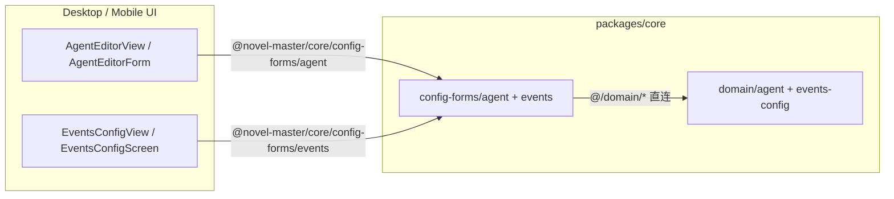

---

## date: 2026-06-12

# config-forms 合并进 core 技术规格（SPEC）

> 需求：[prd.md](./prd.md)  
> 前置：[desktop-ui-polish/spec.md](../desktop-ui-polish/spec.md)（原 `@novel-master/config-forms` 抽取方案 B）

## 设计目标

在 **零产品行为变更** 前提下，将独立 workspace `@novel-master/config-forms` 迁入 `@novel-master/core`，通过 **子路径导出**（与 `./tdbc`、`./sksp`、`./kkv` 一致）对外提供 Agent / 事件配置表单逻辑，并删除独立包与相关 build 链。


| #   | PRD 目标         | 设计要点                                                                               |
| --- | -------------- | ---------------------------------------------------------------------------------- |
| 1   | 消除独立 workspace | 删除 `packages/config-forms/`，根 lockfile 不再含 `@novel-master/config-forms`            |
| 2   | 导入路径统一         | 消费者改为 `@novel-master/core/config-forms` / `.../agent` / `.../events`               |
| 3   | 能力不回归          | 源码 **原样迁移**（11 个 TS 文件 + 3 个测试文件），仅改包内 import 与对外路径                                |
| 4   | 构建简化           | Desktop `prebuild`、Mobile `pre`*、CI release **不再** `-w @novel-master/config-forms` |
| 5   | core 保持轻依赖     | **不**挂入主 barrel `index.ts`；**不**引入 React / RN / AWS SDK                            |


**不在本 SPEC**：`application-model-id` 与 core 重复逻辑去重、`cloud-sync-driver-s3` 合并、CLI 消费 config-forms。

---

## 现状与约束（代码探索）

### 独立包结构与体量

```text
packages/config-forms/
  src/
    index.ts                    # re-export events + agent
    agent/
      agent-editor-state.ts     # 表单 ↔ AgentDefinition
      agent-tool-catalog.ts     # 工具白/黑名单序列化
      index.ts
    events/
      event-config-state.ts     # EventBlockDraft ↔ EventsConfig
      event-config-labels.ts
      validate-event-config-blocks.ts
      default-events-config.ts
      index.ts
    shared/
      application-model-id.ts   # 与 core 同名逻辑副本（刻意避免 barrel）
      depth-slice.ts
  test/
    agent-editor-state.test.ts
    event-config-state.test.ts
    validate-event-config-blocks.test.ts
```

- **11** 个源文件、**3** 个单测文件；唯一依赖 `@novel-master/core`（类型与 schema）。
- 包内 import 使用 **相对路径 + `.js` 后缀**（ESM 惯例）。

### core 现有子路径导出模式

`packages/core/package.json` 已导出 `./tdbc`、`./sksp`、`./nmtp`、`./front-matter`、`./kkv`，构建为 `tsc` + `tsc-alias`（`@/*` → `src/*`），**主入口 `index.ts` 不包含**上述子模块。

### 消费者清单（须全部改 import）


| 端       | 文件                                                |
| ------- | ------------------------------------------------- |
| Desktop | `renderer/features/settings/AgentEditorView.tsx`  |
| Desktop | `renderer/features/settings/EventsConfigView.tsx` |
| Desktop | `renderer/features/settings/ToolPolicyPicker.tsx` |
| Desktop | `renderer/services/regex-test.service.ts`         |
| Desktop | `scripts/fix-settings-utf8.mjs`                   |
| Mobile  | `src/components/agent/AgentEditorForm.tsx`        |
| Mobile  | `src/components/agent/ToolPolicyPicker.tsx`       |
| Mobile  | `src/components/events/EventConfigBlocks.tsx`     |
| Mobile  | `src/screens/stack/EventsConfigScreen.tsx`        |
| Mobile  | `__tests__/validate-event-config-blocks.test.ts`  |


### 构建 / 测试 / CI 引用


| 位置                              | 当前                                                           |
| ------------------------------- | ------------------------------------------------------------ |
| `apps/desktop/package.json`     | `dependencies` + `prebuild` 含 `@novel-master/config-forms`   |
| `apps/mobile/package.json`      | `dependencies` + `prestart`/`pretest`/`preandroid`/`preios`  |
| `apps/mobile/jest.config.js`    | `moduleNameMapper` 三条 alias → `packages/config-forms/dist/*` |
| `.github/workflows/release.yml` | 3 处 `npm run build -w @novel-master/config-forms`            |


### 技术约束

1. **禁止** config-forms 模块 `import from "@novel-master/core"`（迁入后会造成 barrel 自引用风险）；改为 `@/domain/...` 直连类型路径。
2. **保留** `shared/application-model-id.ts` 副本（与 `domain/provider/logic/application-model-id.ts` 行为略有差异：前者 `Error`、后者 `ProviderError`）；本迭代不合并。
3. Mobile Metro **无** config-forms 特殊 alias，依赖 npm `exports` 解析；合并后须保证 `core` build 产出 `dist/config-forms/`**。
4. Mobile Jest 对 `@novel-master/core` 主 barrel 有 **shim**；config-forms 子路径应 **映射到 dist 实体文件**，避免走 barrel。

---

## 总体方案

### 架构（合并后）




- config-forms 作为 core 内 **独立子模块**（`src/config-forms/`），**不** re-export 到主 `index.ts`。
- CLI 继续只 import `@novel-master/core` 主入口时 **不会** 加载 config-forms（子路径按需引用）。

### 目标目录

```text
packages/core/src/config-forms/          # 自 packages/config-forms/src/ 迁入
  index.ts
  agent/...
  events/...
  shared/...

packages/core/test/config-forms/         # 自 packages/config-forms/test/ 迁入
  agent-editor-state.test.ts
  event-config-state.test.ts
  validate-event-config-blocks.test.ts
```

**选型理由**：与 PRD「`config-forms/` 目录」一致；不放入 `service/`（非持久化服务，而是 UI 表单适配层）。

---

## 最终项目结构

合并完成后相关路径：

```text
packages/core/
  package.json                 # + exports ./config-forms, ./config-forms/agent, ./config-forms/events
  src/config-forms/**          # 新增（自原包迁入）
  test/config-forms/**         # 新增（自原包迁入）
  dist/config-forms/**         # build 产物

packages/config-forms/         # 删除

apps/desktop/package.json      # 移除 config-forms 依赖与 prebuild 步骤
apps/mobile/package.json       # 同上
apps/mobile/jest.config.js     # mapper 改指向 core/dist/config-forms
.github/workflows/release.yml  # 移除 config-forms build
```

---

## 变更点清单


| 路径                                       | 操作  | 说明                                            |
| ---------------------------------------- | --- | --------------------------------------------- |
| `packages/core/src/config-forms/**`      | 新增  | `git mv` 自 `packages/config-forms/src/**`     |
| `packages/core/test/config-forms/**`     | 新增  | 迁入测试，import 改为 `../../src/config-forms/...`   |
| `packages/core/package.json`             | 修改  | 增加 3 个 `exports` 子路径                          |
| `packages/core/src/config-forms/**/*.ts` | 修改  | `@novel-master/core` → `@/domain/...` 直连（见下表） |
| `apps/desktop/**`、`apps/mobile/**`       | 修改  | import 路径替换                                   |
| `apps/desktop/package.json`              | 修改  | 移除依赖与 prebuild                                |
| `apps/mobile/package.json`               | 修改  | 移除依赖与 pre* scripts                            |
| `apps/mobile/jest.config.js`             | 修改  | mapper 指向 `packages/core/dist/config-forms/`* |
| `.github/workflows/release.yml`          | 修改  | 删除 config-forms build                         |
| `packages/config-forms/**`               | 删除  | 含 `package.json`                              |
| `package-lock.json`                      | 修改  | `npm install` 刷新                              |


### 包内 import 替换表


| 原 `@novel-master/core` 符号                                              | 迁入后 import 路径                                                                          |
| ---------------------------------------------------------------------- | -------------------------------------------------------------------------------------- |
| `AgentDefinition`, `AgentToolPolicy`, `PromptBlock`, `PromptBlockRole` | `@/domain/agent/model/agent-definition.js` 等（按实际定义文件拆分）                                |
| `EventsConfig`, `EventActionNode`, `EventActionType`                   | `@/domain/events-config/model/events-config.js`、`@/domain/events/model/event-types.js` |


> 实现时以 TypeScript 编译通过为准；**禁止**在 config-forms 内 `import from "@novel-master/core"` 或 `from "@/index"`。

### 对外 import 替换（消费者）


| 原路径                                 | 新路径                                      |
| ----------------------------------- | ---------------------------------------- |
| `@novel-master/config-forms`        | `@novel-master/core/config-forms`        |
| `@novel-master/config-forms/agent`  | `@novel-master/core/config-forms/agent`  |
| `@novel-master/config-forms/events` | `@novel-master/core/config-forms/events` |


---

## 详细实现步骤

### Step 1 — 迁入源码与测试

1. 创建 `packages/core/src/config-forms/`，将 `packages/config-forms/src/`** 整体移入（保留 `agent/`、`events/`、`shared/` 结构）。
2. 创建 `packages/core/test/config-forms/`，移入 3 个 `*.test.ts`。
3. 更新测试 import：
  `from "../src/agent/..."` → `from "../../src/config-forms/agent/..."`  
   （与现有 `test/cloud-sync/coordinator.test.ts` 风格一致。）

### Step 2 — 修正 config-forms 内部依赖

逐文件将 `from "@novel-master/core"` 改为 `@/domain/...` 直连 import；相对路径 `.js` 后缀保持不变。

### Step 3 — 注册 core 子路径导出

在 `packages/core/package.json` 的 `exports` 增加：

```json
"./config-forms": {
  "types": "./dist/config-forms/index.d.ts",
  "import": "./dist/config-forms/index.js"
},
"./config-forms/agent": {
  "types": "./dist/config-forms/agent/index.d.ts",
  "import": "./dist/config-forms/agent/index.js"
},
"./config-forms/events": {
  "types": "./dist/config-forms/events/index.d.ts",
  "import": "./dist/config-forms/events/index.js"
}
```

**不要**修改 `packages/core/src/index.ts` 主 barrel。

### Step 4 — 更新消费者与构建链

1. 全局替换上述 10+ 源文件中的 import 路径。
2. 从 `apps/desktop/package.json`、`apps/mobile/package.json` 移除 `@novel-master/config-forms` 依赖及所有 `-w @novel-master/config-forms`。
3. 更新 `apps/mobile/jest.config.js`：

```javascript
'^@novel-master/core/config-forms/events$': path.join(repoRoot, 'packages/core/dist/config-forms/events/index.js'),
'^@novel-master/core/config-forms/agent$': path.join(repoRoot, 'packages/core/dist/config-forms/agent/index.js'),
'^@novel-master/core/config-forms$': path.join(repoRoot, 'packages/core/dist/config-forms/index.js'),
```

1. 更新 `.github/workflows/release.yml` 三处 build 命令，去掉 `@novel-master/config-forms`。
2. 删除 `packages/config-forms/` 目录。
3. 仓库根执行 `npm install` 刷新 lockfile。

### Step 5 — 验证

按「测试策略」执行；可选 Desktop Agent/事件页、Mobile 对应页手工 smoke。

---

## 测试策略

### 自动化


| 命令                                                                                   | 覆盖                                |
| ------------------------------------------------------------------------------------ | --------------------------------- |
| `npm run build -w @novel-master/core`                                                | 子路径 dist 产物存在                     |
| `npm test -w @novel-master/core`                                                     | 原 config-forms 3 个测试 + 全量 core 回归 |
| `npm test -w @novel-master/mobile -- --testPathPattern=validate-event-config-blocks` | Mobile 事件校验测试                     |
| `npm test -w @novel-master/mobile -- --testPathPattern=cloud-sync`                   | 确认 pretest 链（仅 build core）仍绿      |


Desktop 无 config-forms 专属单测；依赖 core 测试 + 手工 smoke。

### 测试用例

- **T1** `npm run build -w @novel-master/core` 后存在 `dist/config-forms/agent/index.js`、`dist/config-forms/events/index.js`。
- **T2** `npm test -w @novel-master/core` 中 `test/config-forms/*.test.ts` 全部通过（工具策略 round-trip、事件 block 校验、draft 转换）。
- **T3** 仓库根 `git grep '@novel-master/config-forms'` 无匹配（`.apm/kb` 历史文档除外）。
- **T4** Mobile Jest `validate-event-config-blocks.test.ts` 通过（mapper 指向 core dist）。
- **T5** `npm run prebuild -w @novel-master/desktop` 成功且日志无 config-forms workspace。
- **T6** Mobile `pretest` 脚本执行成功（不再 build config-forms）。

### 手工 smoke（建议）

- Desktop：设置 → Agent 编辑 → 改 tools 白名单 → 保存 → 重进一致。
- Desktop：设置 → 事件配置 → 增删 block → 保存 → 重进一致。
- Mobile：同上两处配置页。

---

## 风险与回滚方案


| 风险                                          | 缓解                                                 |
| ------------------------------------------- | -------------------------------------------------- |
| config-forms 内 `@/` import 路径写错导致 core 编译失败 | Step 2 后立刻 `npm run build -w @novel-master/core`   |
| Mobile Jest / Metro 解析子路径失败                 | jest mapper 显式指向 dist；Mobile prestart 已 build core |
| 遗漏消费者 import                                | Step 5 执行 `git grep '@novel-master/config-forms'`  |
| core 主 barrel 意外 re-export config-forms     | Code review 禁止改 `src/index.ts`                     |
| CLI 体积略增                                    | 可接受；子路径未 import 则运行时不会加载                           |


**回滚**：单次 revert 合并 commit（或 restore `packages/config-forms` + 还原 import）；无 DB / 协议迁移，回滚风险低。

---

## 实现顺序与预估


| 步骤                    | 预估      |
| --------------------- | ------- |
| Step 1–3 迁入 + exports | ~30 min |
| Step 4 消费者 + CI       | ~20 min |
| Step 5 测试 + grep 验收   | ~15 min |


**建议分支**：`feature/config-forms-merge-into-core`（自 `main`）。