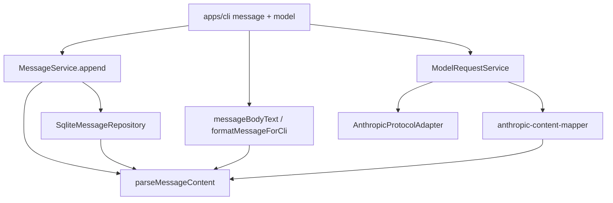

# Content Blocks 统一化 技术规格（SPEC）

## 设计目标

- 将 `MessageContent` 收敛为 **唯一字段** `blocks: ContentBlock[]`，废除 `content` / `parts`；读写 `content_json` 时强校验，旧 shape **报错**（不迁移）。
- 提供可测试的 **纯文本提取**（`messageBodyText`），供 prompt `chat` 块与 CLI 默认展示使用，禁止对整包 `JSON.stringify`。
- CLI `append` / `list` 支持五种 block；Provider 路径以 **Anthropic** 为第一期互通样板（含 `tool_use` 响应解析与可选 session 落库）。
- **不实现**：流式 block 组装、旧库自动迁移、OpenAI/Gemini 全类型往返（仅 text 降级发送 + 明确限制）。

## 现状与约束（代码探索）

| 项 | 路径 / 现状 | 本迭代 |
|----|-------------|--------|
| `MessageContent` | `domain/chat/model/message.ts`：`content?` + `parts?` | 仅 `blocks` |
| 解析 | `sqlite-message.repository.ts`：`JSON.parse` + `as MessageContent` | `parseMessageContent()` 校验 |
| 正文提取 | `domain/prompt/message-body.ts`：`content` 或 `JSON.stringify` | 按 block 类型规则拼接 |
| Prompt | `render-prompt.ts` → `messageBodyText(message)` | 不变调用点，行为变 |
| CLI append | `message/commands.ts`：`{ content: string }` | `{ blocks: [{ type:'text', text }] }` 或 `--blocks` JSON |
| CLI list | 同 `messageBodyText` 回退逻辑 | `formatMessageForCli` |
| `MessageService.append` | 直接写入任意 `MessageContent` | append 前 `assertMessageContent` |
| Provider chat | `model-request.service.ts`：`userContent: string` | 扩展结果含 `blocks`；Anthropic 解析多 block |
| Anthropic adapter | `anthropic.adapter.ts`：请求/响应仅首段 `text` | 请求可发 block 数组；响应解析全部 `content[]` |
| OpenAI/Gemini adapter | 仅 string `content` | 发送时 **仅提取 text blocks**；响应仍为单 `text` block |
| `nm model request` | `model/commands.ts`：打印 `assistantText`，**不写** session | 可选 `--session` 落库 user+assistant |
| 测试 | 大量 `{ content: "..." }` | 统一改为 `textBlocks("...")` 辅助函数 |
| DB schema | `content_json TEXT` | **不变**（仅 JSON shape 变） |
| message-visibility | `hidden` 列与 prompt 过滤 | 不变；与 blocks 正交 |

**PRD 决策锁定**

| 待确认项 | SPEC 决策 |
|----------|-----------|
| image 载荷 | `ImageSource`：`{ kind: 'url', url }` \| `{ kind: 'base64', mediaType, data }`（对齐 Anthropic source 语义，存 NM canonical JSON） |
| thinking 与 prompt | **`messageBodyText` 默认跳过 `thinking` 块**（不进 LLM prompt）；CLI `list` 显示 `[thinking]` + 前 80 字符摘要 |
| 流式 | **本期不做**；`LlmProtocolAdapter.chat` 仍非流式 |
| Provider 范围 | Anthropic 全类型解析 + session 历史映射；OpenAI/Gemini 仅 text |

---

## 总体方案

### 架构分层



### Canonical JSON（`content_json`）

```json
{
  "blocks": [
    { "type": "text", "text": "hello" },
    { "type": "tool_use", "id": "tu_1", "name": "grep", "input": { "pattern": "foo" } }
  ]
}
```

- 顶层 **仅允许** `blocks` 键（外加不允许其它键；`blocks` 必须为非空数组——**允许空数组否？** 锁定：**允许 `[]`**，表示空消息体；append 时若 CLI `--content` 则至少一个 text block）。
- 禁止出现 `content`、`parts` 顶层键（解析时报错）。

### ContentBlock 类型（TypeScript）

新建 `packages/core/src/domain/chat/model/content-block.ts`：

```typescript
export type ContentBlock =
  | TextBlock
  | ImageBlock
  | ToolUseBlock
  | ToolResultBlock
  | ThinkingBlock;

export interface TextBlock {
  readonly type: "text";
  readonly text: string;
}

export interface ImageBlock {
  readonly type: "image";
  readonly source: ImageSource;
}

export type ImageSource =
  | { readonly kind: "url"; readonly url: string }
  | { readonly kind: "base64"; readonly mediaType: string; readonly data: string };

export interface ToolUseBlock {
  readonly type: "tool_use";
  readonly id: string;
  readonly name: string;
  readonly input: Record<string, unknown>;
}

export interface ToolResultBlock {
  readonly type: "tool_result";
  readonly toolUseId: string;
  /** v1：工具结果正文；复杂嵌套留 raw_json */
  readonly content: string;
}

export interface ThinkingBlock {
  readonly type: "thinking";
  readonly text: string;
}

export interface MessageContent {
  readonly blocks: readonly ContentBlock[];
}
```

`message.ts` 改为从 `content-block.ts` 导出 `MessageContent`，删除旧字段。

### 纯文本规则（`messageBodyText`）

实现于 `domain/chat/content/message-body-text.ts`（`domain/prompt/message-body.ts` 改为 re-export，保持 `@novel-master/core` 对外路径不变）。

| block 类型 | `messageBodyText` 输出 |
|------------|------------------------|
| `text` | `text` 原文 |
| `image` | `[image]`（不嵌入 base64） |
| `tool_use` | `[tool_use name={name} id={id}]` |
| `tool_result` | `[tool_result id={toolUseId}]` + 若 `content` 非空则换行后附 `content` |
| `thinking` | **跳过**（不输出） |

- 多个 block 之间用 `\n\n` 连接（过滤掉 thinking 后）。
- 若过滤后为空字符串，返回 `""`（`formatSegment` 仍输出 `role: `）。

### CLI 展示（`formatMessageForCli`）

| block 类型 | 单行摘要 |
|------------|----------|
| `text` | 原文（换行保留） |
| `image` | `[image url=...]` 或 `[image base64 mediaType=...]` |
| `tool_use` | `[tool_use] {name} ({id})` |
| `tool_result` | `[tool_result] {toolUseId}: {content 前 120 字符}` |
| `thinking` | `[thinking] {text 前 80 字符}` |

`nm message list` 默认列：对每条消息调用 `formatMessageForCli(m.content).replace(/\n/g, "⏎")` 或首行 + `\t` 分隔（与现有 TSV 兼容，换行压成可见符号）。

---

## 最终项目结构

```
packages/core/src/domain/chat/
  model/
    message.ts                 # ChatMessage；MessageContent 移至 content-block.ts
    content-block.ts           # 新增：ContentBlock 联合体
  content/
    parse-message-content.ts   # 新增：JSON 校验 + 反序列化
    message-body-text.ts       # 新增：messageBodyText 实现
    format-message-cli.ts      # 新增：formatMessageForCli
    text-blocks.ts             # 新增：textBlocks() 测试/便捷构造
  repositories/impl/
    sqlite-message.repository.ts  # parseContent → parseMessageContent

packages/core/src/domain/chat/content/anthropic-mapper.ts  # 新增（或 infra/llm-protocol/）
packages/core/src/domain/prompt/message-body.ts           # re-export messageBodyText

packages/core/src/errors/chat-errors.ts                 # 可选 MESSAGE_CONTENT_INVALID 文案
packages/core/src/service/chat/impl/message.service.ts  # append 前校验
packages/core/src/infra/llm-protocol/adapter.port.ts    # LlmChatResult + blocks
packages/core/src/infra/llm-protocol/anthropic.adapter.ts
packages/core/src/service/provider/impl/model-request.service.ts

packages/core/test/chat/content-blocks.test.ts          # 新增
packages/core/test/chat/message-body-text.test.ts       # 新增
packages/core/test/provider/anthropic-blocks.test.ts    # 新增

apps/cli/src/message/commands.ts
apps/cli/src/model/commands.ts
```

---

## 变更点清单

### 1. 解析与校验 — `parse-message-content.ts`

```typescript
export function parseMessageContent(json: string): MessageContent;
export function assertMessageContent(value: unknown): asserts value is MessageContent;
```

规则：

1. `JSON.parse` 失败 → `ChatError` `INVALID_ARGUMENT`。
2. 若 `value` 含 `content` 或 `parts` 键 → 报错：`Legacy message content shape is not supported; use { blocks: [...] }`。
3. `blocks` 必须为数组；每项必须有 `type` 且为五种之一；按类型校验必填字段（`text` 非空字符串、`tool_use.id` 等）。
4. 未知 `type` → 报错（不静默忽略）。

`sqlite-message.repository.ts`：

```typescript
function parseContent(json: string): MessageContent {
  return parseMessageContent(json);
}
```

### 2. 便捷构造 — `text-blocks.ts`

```typescript
/** Single text block; for tests and CLI --content shorthand. */
export function textBlocks(text: string): MessageContent {
  return { blocks: [{ type: "text", text }] };
}
```

### 3. `MessageService.append`

```typescript
assertMessageContent(content);
// 禁止空 blocks？锁定：允许 []；CLI 保证 --content 至少一块
```

### 4. Provider — `adapter.port.ts`

```typescript
export interface LlmChatResult {
  readonly assistantText: string;  // = messageBodyText from blocks（兼容旧 CLI）
  readonly blocks: readonly ContentBlock[];
  readonly raw: unknown;
}
```

### 5. Anthropic 映射 — `anthropic-content-mapper.ts`

| 方向 | 职责 |
|------|------|
| `blocksToAnthropicContent(blocks)` | NM → API `content` 数组（image 转 `type:image` + source） |
| `anthropicContentToBlocks(content[])` | API → NM；识别 `text`/`image`/`tool_use`/`tool_result`/`thinking` |
| `chatMessagesToAnthropic(messages: ChatMessage[])` | 按 `role` + blocks 生成 `messages[]`；`tool_result` 块 → `role: user` 且 content 仅含 tool_result |

**Anthropic adapter** `chat()`：

- 若调用方传入 `messages`（新可选字段 on `LlmChatRequest`），用历史；否则保持 `[{ role:'user', content: userContent }]` 且 `userContent` 视为单 text block。
- 响应：对 `raw.content[]` 全文 `anthropicContentToBlocks`；`assistantText` 由 `messageBodyText({ blocks })` 派生。

扩展 `LlmChatRequest`：

```typescript
export interface LlmChatRequest {
  // ...existing
  readonly userContent: string;
  /** When set, used instead of single user message. */
  readonly history?: readonly ChatMessage[];
}
```

`DefaultModelRequestService.request(applicationModelId, userContent, options?)` 增加可选 `history`。

### 6. OpenAI / Gemini（最小）

- 请求：`blocksToOpenAiContent` = 连接所有 `text` block；遇非 text → `ProviderError` `UNSUPPORTED_CONTENT`（或跳过 image 并报错——锁定：**报错**）。
- 响应：`{ blocks: [{ type:'text', text }] }`。

### 7. CLI — `message/commands.ts`

**append**

| 输入 | 行为 |
|------|------|
| `--content <text>` | `textBlocks(text)`（与现行为一致的用户体验） |
| `--blocks <path>` | 读 UTF-8 JSON 文件，解析为 `MessageContent` |
| `--blocks-json <json>` | 内联 JSON |
| 互斥 | `--content` 与 `--blocks*` 不可同时使用 |

**list**：`formatMessageForCli(m.content)` 替代 `m.content.content ?? JSON.stringify`。

### 8. CLI — `model/commands.ts`（Provider 验收路径）

扩展 `nm model request`：

```
nm model request --content <text> [--session <id>] [--modelId ...] [--raw]
```

当 `--session` 存在时：

1. `messages.append(sessionId, 'user', textBlocks(content))`
2. `history = listBySession` + 过滤 `hidden`（与 prompt 一致）
3. `modelRequests.request(modelId, content, { history })`（Anthropic）
4. `messages.append(sessionId, 'assistant', { blocks: result.blocks }, { raw: result.raw })`
5. stdout 仍打印 `assistantText`（除非 `--raw`）

**本期不要求** `tool_result` 自动执行闭环；验收可通过 **手工 append** `tool_use` + `tool_result` blocks，再 `request` 读 history。

### 9. 测试批量替换

所有 `append(..., { content: "x" })` → `append(..., textBlocks("x"))`。

`render-prompt.test.ts` 中 `content: { content }` → `content: textBlocks(content)`。

---

## 详细实现步骤

### Phase 1：Core 模型与解析（packages/core）

1. 新增 `content-block.ts`、`parse-message-content.ts`、`text-blocks.ts`、`message-body-text.ts`、`format-message-cli.ts`。
2. 更新 `message.ts`；`message-body.ts` re-export。
3. 更新 `sqlite-message.repository.ts`、`message.service.ts`。
4. 单元测试：`content-blocks.test.ts`（合法/非法/legacy）、`message-body-text.test.ts`。
5. `npm run build` + 相关测试。

### Phase 2：全量测试修复

6. 替换 `packages/core/test/**` 中所有旧 `MessageContent` shape。
7. `npm test` in `packages/core` 全绿。

### Phase 3：CLI message

8. 更新 `apps/cli/src/message/commands.ts`。
9. 构建 `apps/cli`。

### Phase 4：Provider（Anthropic）

10. `anthropic-content-mapper.ts` + 扩展 `adapter.port` / `anthropic.adapter`。
11. `model-request.service` 返回 `blocks`。
12. `anthropic-blocks.test.ts`（mock 响应含 `tool_use`）。
13. 更新 `model/commands.ts` 的 `--session` 路径。

### Phase 5：OpenAI/Gemini 最小适配

14. 响应统一为 `text` block；非 text 请求报错。

### Phase 6：文档与验收

15. 更新本迭代 PRD 脚注（破坏性变更：清库）。
16. 可选：`.apm/kb/docs/Iterations/content-blocks/test/content-blocks-cli.md`（cli-test skill）。

---

## 测试策略

### 单元测试（packages/core）

| ID | 文件 | 场景 |
|----|------|------|
| U1 | `content-blocks.test.ts` | `parseMessageContent` round-trip 五种 block |
| U2 | 同上 | `{ content: "x" }` → 抛 `INVALID_ARGUMENT` |
| U3 | `message-body-text.test.ts` | text only → `"hello"` |
| U4 | 同上 | text + tool_use + tool_result → 含占位符、无 leading `{` |
| U5 | 同上 | thinking only → `""` |
| U6 | 同上 | image → `[image]` |
| U7 | `message-visibility.test.ts` 等 | 改用 `textBlocks`，回归 hidden |
| U8 | `render-prompt.test.ts` | chat 块输出非 JSON |
| U9 | `anthropic-blocks.test.ts` | mock `content: [{type:tool_use,...},{type:text,...}]` → blocks |
| U10 | `chat.services.test.ts` | fork/copy 保留 blocks 结构 |

### CLI 手工（`content-blocks-cli.md`）

| ID | 步骤 | 期望 |
|----|------|------|
| C1 | `message append --content hi` → `list` | 显示 `hi`，非 JSON |
| C2 | `append --blocks-json '{"blocks":[{"type":"tool_use",...}]}'` → `list` | 显示 `[tool_use] ...` |
| C3 | `model request --session ... --content hello`（Anthropic mock 或真实 key） | session 内 2 条消息，assistant `content_json` 含 blocks |
| C4 | 五种 block 各一条 append + list | 均可读 |

### 构建

```bash
cd packages/core && npm run build && npm test
cd apps/cli && npm run build
```

---

## 风险与回滚方案

| 风险 | 缓解 |
|------|------|
| 破坏性 JSON shape | 发布说明要求新建 DB 或 `DELETE FROM chat_message` |
| Anthropic thinking 字段名变更 | mapper 单测 + 未知字段进 `raw` 仍保留 blocks 中文本类 |
| OpenAI 用户发 image block | 明确错误信息，引导用 Anthropic |
| `nm model request --session` 与 hidden 消息 | history 过滤 `!m.hidden`，与 prompt 一致 |

**回滚**：恢复 `MessageContent` 旧接口 + `message-body` 旧实现 + repository 弱解析；Provider 回退 `assistantText` only。已写入新 shape 的 DB 行需清库。

### 验收检查清单

- [ ] `MessageContent` 无 `content`/`parts`
- [ ] legacy JSON 解析报错
- [ ] `messageBodyText` 无 `JSON.stringify(content)` 路径
- [ ] CLI append/list 五种 block 可演示
- [ ] Anthropic 响应 `tool_use` 落库为 blocks
- [ ] `packages/core` + `apps/cli` build/test 通过
- [ ] message-visibility 无回归
