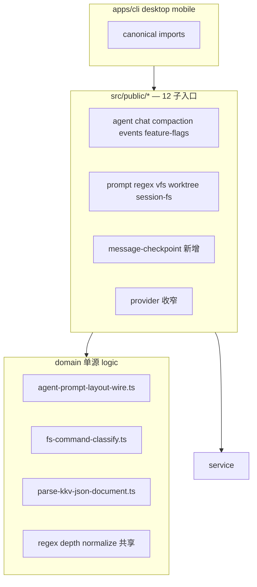

# Core 架构与代码风格优化 技术规格（SPEC）

> **PRD**：[prd.md](./prd.md)  
> **前置**：[core-explore-remediation/readme.md](../core-explore-remediation/readme.md)、[public-api-boundaries/prd.md](../core-explore-remediation/features/public-api-boundaries/prd.md)  
> **基线**：`main` @ `bea00caa`（`test:fast` 995/995）

## 设计目标

| # | PRD 目标 | SPEC 设计要点 |
|---|----------|---------------|
| 1 | 风格基线 | 修复 `hide-message.handler.ts` 格式；公开 API 注释策略：新增/修改 export **中文 JSDoc** |
| 2 | Public API 硬收敛 | 删除 `prompt→config-forms` re-export；移除 `./front-matter`；新增 `./message-checkpoint`；收窄 `provider` 过渡 export |
| 3 | 模块债单源 | wire 序列化、fs 路径分类、regex depth normalize、KKV JSON 解析各 **一处 canonical** |
| 4 | 硬破坏 + migration | apps 同步改 import；`migration.md` 对照表；allowlist 快照更新 |
| 5 | 单波次可验证 | 分 9 个逻辑 commit；末步全量 `test:fast` + apps `build` |

**不在本 SPEC：** compaction token 缓存、chat_grep ReDoS、bootstrap FK、events UI `endDepth` 产品行为、`ChatAgentSession` 从 public 移除（P4）。

---

## 总体方案

### 架构分层（变更后）



### 交付策略

- **分支**：`feature/core-architecture-style`（从 `main` 切出）
- **合并**：单 PR；内部按 §详细实现步骤 的 commit 顺序提交
- **破坏性**：允许删除 export / 删子路径；**禁止**无 migration 记录的静默删除

---

## 最终项目结构

### 新增文件

```text
packages/core/src/domain/prompt/logic/agent-prompt-layout-wire.ts
packages/core/src/domain/tool/logic/fs-command-classify.ts
packages/core/src/infra/kkv/logic/parse-kkv-json-document.ts
packages/core/src/public/message-checkpoint.ts
packages/core/test/infra/sql-template/no-dollar-in-repository-sql.test.ts
packages/core/test/service/events-config/events-config-store-corrupt.test.ts
packages/core/test/domain/regex/regex-rule-update-depth.test.ts
.apm/kb/docs/Iterations/core-architecture-style/migration.md
```

### 删除 / 移除

| 项 | 动作 |
|----|------|
| `package.json` `./front-matter` export | **删除** |
| `public/prompt.ts` L15–19 config-forms re-export | **删除** |
| `public/provider.ts` feature-flags + `registerTokenizerDriver` re-export | **删除**（apps 已用 canonical） |
| `public/prompt.ts` `PromptBlock` 等遗留 type export | **删除**（grep 无 apps 引用；core 测试改内部 import） |
| `shouldIncludePromptTextBlock` | **删除**（零引用） |

### Public 子入口（变更后 12 个）

| 子路径 | 变更 |
|--------|------|
| `./message-checkpoint` | **新增** — checkpoint/rollback 工厂与类型 |
| `./session-fs` | **收窄** — 仅 SessionFs 相关（移除 checkpoint 符号） |
| `./prompt` | **收窄** — 仅 prompt 域/服务，无 config-forms |
| `./provider` | **收窄** — 无 feature-flags、无 tokenizer 注册 |
| `./front-matter` | **删除** |
| 其余 8 个 | 快照更新（若有 export 变动） |

---

## 变更点清单

### A. 代码风格卫生

| 文件 | 变更 |
|------|------|
| `service/events/impl/actions/hide-message.handler.ts` | 恢复紧凑换行（~43 行）；逻辑不变 |
| `service/events/impl/event-orchestrator.service.ts` | 从 `DefaultEventOrchestratorDeps` 移除未使用的 `worktreeSnapshot`、`worktree`、`createSession` |
| `service/events/create-event-orchestrator.ts` | 停止向 orchestrator 注入上述死 deps |
| `public/*.ts`（本迭代触及） | 补充/修正中文 JSDoc；无 mojibake |

### B. Public API

| 文件 | 变更 |
|------|------|
| `src/public/message-checkpoint.ts` | **新建** — 自 `create-message-checkpoint-services` 等 re-export |
| `src/public/session-fs.ts` | 移除 checkpoint/rollback export（迁至 message-checkpoint） |
| `src/public/prompt.ts` | 删除 config-forms 三符号；删除 `PromptBlock*` type export |
| `src/public/provider.ts` | 删除 `DEFAULT_USER_VFS_*`、`refreshUserVfs*`、`isUserVfs*`、`registerTokenizerDriver` |
| `package.json` | +`./message-checkpoint`；−`./front-matter` |
| `docs/public-api.md` | 12 子入口、canonical/deprecated/removed 表 |
| `test/package-exports/*` | 更新快照；`KNOWN_LEAKS = new Set()` |
| `test/package-exports/duplicate-export-consistency.test.ts` | 移除 provider↔feature-flags、provider↔nmtp 行（符号已从 provider 删除） |

### C. quality-backlog 模块 refactor

| 域 | 文件 | 变更 |
|----|------|------|
| **prompt** | `domain/prompt/logic/agent-prompt-layout-wire.ts` | **新建** `persistBlockToWire`、`dynamicBlockToWire` |
| | `validate-agent-prompt-layout.ts` | 改为 import wire 模块 |
| | `agent-definition.schema.ts` | 改为 import wire 模块 |
| | `should-include-prompt-text-block.ts` | **删除** |
| | `domain/prompt/model/prompt-block.ts` | 保留文件；从 `public/prompt.ts` 移除 export |
| **tool** | `domain/tool/logic/fs-command-classify.ts` | **新建** `classifyFsCommand(command) → { mutating, paths }` |
| | `tool-runner.ts` | `extractMutatingPaths` 委托 classify |
| | `extract-mutating-paths.ts` | 委托 classify（保留导出 API） |
| | `tool-use-mutates-workspace.ts` | 使用 `classifyFsCommand(...).mutating` |
| | `fs-command.ts` | `isMutatingFsCommand` 委托 classify（或标记 `@deprecated` 内联调用） |
| **regex** | `regex-rule.schema.ts` | 提取 `normalizeDepthFields(raw)`；`updateRegexRuleSchema` 增加与 create 等价的 `.transform` |
| | `regex-config.service.ts` | update merge 使用已 normalize 的 camelCase 字段 |
| **events-config** | `infra/kkv/logic/parse-kkv-json-document.ts` | **新建** `parseKkvJsonDocument(raw, decodeFn)` |
| | `events-config-store.service.ts` | `getConfig`/`getRawWire` 使用 helper；抛 `EventsConfigError`（新 code `INVALID_JSON` 或复用 `INVALID_SCHEMA`） |
| | `errors/events-config-errors.ts` | 若无则新增 `eventsConfigInvalidJson` helper |
| **tokenizer** | `apps/desktop/.../chat-prompt-tokens.service.ts` | `loadChatPromptTokenStatsFallback` 复用 `buildSessionPromptInput` + `serializePromptLlmInput` + `countPromptLlmInputHeuristicOnly` |
| **tdbc** | `test/infra/sql-template/no-dollar-in-repository-sql.test.ts` | 扫描 `src/domain/**/repositories/**/*.ts` 与 `src/**/sqlite-*.ts`：禁止模板字面量含 `${`（允许 `#{}`） |
| | `infra/sql-template/expression.ts` | `FORBIDDEN_PATTERN` 增加 `constructor`；补逃逸向量单测 |

### D. apps 迁移

| 应用 | 文件 | 旧 import | 新 import |
|------|------|-----------|-----------|
| mobile | `components/vfs/FileMarkdownPreview.tsx` | `@novel-master/core/front-matter` | `@novel-master/core/worktree` |
| cli/desktop/mobile | runtime、types、helpers 等 | `@novel-master/core/session-fs` 的 checkpoint 符号 | `@novel-master/core/message-checkpoint` |
| cli/desktop/mobile | 若仍有从 `provider` 导入 feature-flags | `@novel-master/core/provider` | `@novel-master/core/feature-flags`（多数已完成） |

**session-fs 仍保留的 apps 引用：** `SessionFsService`、`SessionFsError`、`isRollbackVfsDegradableError`、`RollbackOptions`（类型若迁到 message-checkpoint 则同步改）。

---

## Migration 摘要（写入 `migration.md`）

| 能力 | 已删除路径 / 符号 | Canonical |
|------|-------------------|-----------|
| Front matter | `@novel-master/core/front-matter` | `@novel-master/core/worktree` |
| Editor 块操作 | `@novel-master/core/prompt` 的 `movePersistBlock` 等 | `@novel-master/core/config-forms/agent` |
| Message checkpoint | `@novel-master/core/session-fs` 的 `createMessageCheckpointService` 等 | `@novel-master/core/message-checkpoint` |
| Feature flags | `@novel-master/core/provider` 的 `isUserVfsUnifiedToolTurnEnabled` 等 | `@novel-master/core/feature-flags` |
| Tokenizer 注册 | `@novel-master/core/provider` 的 `registerTokenizerDriver` | `@novel-master/core/nmtp` |
| 遗留 PromptBlock 类型 | `@novel-master/core/prompt` | 内部 `domain/prompt/model/prompt-block.js`（非 public） |

**过渡策略（硬破坏）：** 本迭代 **不保留** deprecated re-export；合并即要求 apps 已迁移。

---

## 详细实现步骤

### Step 0 — 分支与基线

```bash
git checkout main && git pull
git checkout -b feature/core-architecture-style
npm run build -w @novel-master/core
cd packages/core && npm run test:fast   # 基线 995/995
```

### Step 1 — 风格卫生（commit 1）

1. 格式化 `hide-message.handler.ts`（单行间距，保留英文模块 JSDoc 或改中文模块头二选一，与相邻 handler 一致）。
2. 精简 `event-orchestrator.service.ts` deps；更新 `create-event-orchestrator.ts` 与所有 `createEventOrchestrator(` 调用方（仅 events 工厂链）。
3. 跑 `test/events/*.test.ts`。

### Step 2 — Domain 单源模块（commit 2）

1. 实现 `agent-prompt-layout-wire.ts`；单测 round-trip wire 形状。
2. 实现 `fs-command-classify.ts`；单测 ls/write/edit/空 command 语义（**文档化** checkpoint 与 runner 对空 command 的差异若保留）。
3. 实现 `parse-kkv-json-document.ts`。
4. 重构 `validate-agent-prompt-layout.ts`、`agent-definition.schema.ts` 使用 wire 模块。
5. 重构 tool 三处使用 `classifyFsCommand`。
6. 跑相关 domain/tool/prompt 单测。

### Step 3 — Regex + events-config（commit 3）

1. `regex-rule.schema.ts` 共享 depth normalize；新增 `regex-rule-update-depth.test.ts`（kebab-case patch 生效）。
2. `events-config-store.service.ts` + 错误 helper；新增 corrupt JSON 单测。
3. 跑 `test/regex/`、`test/events-config/` 或等价路径。

### Step 4 — Desktop tokenizer 回退（commit 4）

1. 改 `chat-prompt-tokens.service.ts` fallback 路径。
2. 若有 desktop 单测则补充；至少 `tsc` build 通过。

### Step 5 — Public API 重组（commit 5）

1. 新建 `public/message-checkpoint.ts`；收窄 `session-fs.ts`、`prompt.ts`、`provider.ts`。
2. 更新 `package.json` exports。
3. 更新 `docs/public-api.md`。
4. 更新全部 allowlist 快照与 `public-no-config-forms.test.ts`（`KNOWN_LEAKS` 为空）。
5. 跑 `test/package-exports/*.test.ts`。

### Step 6 — apps import 迁移（commit 6）

1. mobile `FileMarkdownPreview.tsx` → worktree。
2. cli/desktop/mobile checkpoint import → message-checkpoint。
3. grep 确认零引用 `./front-matter`、prompt editor-state、provider feature-flags/tokenizer。

### Step 7 — 清理死代码（commit 7）

1. 删除 `should-include-prompt-text-block.ts` 及测试引用。
2. 从 `public/prompt.ts` 移除 `PromptBlock` exports；core 测试改 `@/domain/prompt/...` 内部路径。
3. 删除 `shouldIncludePromptTextBlock` grep 为零后执行。

### Step 8 — TDBC 守卫（commit 8）

1. `FORBIDDEN_PATTERN` + 单测。
2. `no-dollar-in-repository-sql.test.ts` 全仓库扫描。

### Step 9 — 文档与全量验证（commit 9）

1. 写入 `migration.md`。
2. 全量验证（见 §测试策略）。

---

## 测试策略

### 门禁命令

| 范围 | 命令 |
|------|------|
| Core | `npm run build -w @novel-master/core` → `cd packages/core && npm run test:fast` |
| CLI | `npm run build -w @novel-master/cli` |
| Desktop | `npm run build -w @novel-master/desktop`（或 `apps/desktop` 下 `npm run build`） |
| Mobile | `npm run build -w @novel-master/mobile` |

### 测试用例（映射 PRD T1–T13）

| ID | 类型 | 描述 |
|----|------|------|
| **S1** | 回归 | `hide-message.handler.test.ts` 全绿；handler 文件行数 < 50 |
| **S2** | 单元 | `agent-prompt-layout-wire.test.ts` — persist/dynamic wire 与 refactor 前快照一致 |
| **S3** | 单元 | `fs-command-classify.test.ts` — write/edit/ls/空 command |
| **S4** | 单元 | `regex-rule-update-depth.test.ts` — update `{ "start-depth": 2 }` 写入 `startDepth: 2` |
| **S5** | 单元 | `events-config-store-corrupt.test.ts` — 损坏 JSON 抛 `EventsConfigError`，非 `SyntaxError` |
| **S6** | 契约 | `public-no-config-forms.test.ts` — `KNOWN_LEAKS.size === 0` |
| **S7** | 契约 | `public-subpath-allowlist.test.ts` — 含 `message-checkpoint`；无 `front-matter` |
| **S8** | 契约 | grep apps：无 `@novel-master/core/front-matter` |
| **S9** | 集成 | `duplicate-export-consistency` — compaction↔config-forms depth 仍同源 |
| **S10** | 安全 | `no-dollar-in-repository-sql.test.ts` — 0 违规 |
| **S11** | 安全 | `expression.test.ts` — `constructor` 类表达式拒绝 |
| **S12** | 手工 | Desktop token 面板：主路径失败时 fallback 计数与主路径同序（可选 spot-check） |

### orchestrator deps 变更验证

- `event-orchestrator.dag.test.ts`、`event-orchestrator.bus.test.ts` 无回归。
- `createEventOrchestrator` 构造签名变更后，desktop/cli/mobile runtime 编译通过。

---

## 风险与回滚方案

| 风险 | 概率 | 缓解 | 回滚 |
|------|------|------|------|
| apps 遗漏 checkpoint import | 中 | Step 6 全 repo grep；apps build 门禁 | revert commit 6 |
| prompt wire 单源行为漂移 | 低 | S2 快照单测 | revert wire 模块，保留双份 |
| tool classify 改变 mutating 判定 | 低 | 现有 tool-runner + user-vfs 测试 | 恢复三份实现 |
| provider export 删除破坏未知消费方 | 低 | grep monorepo + packages/* | 临时恢复 provider re-export |
| 单 PR 审查困难 | 高 | 9 个逻辑 commit；本 SPEC 文件级清单 | 按 commit 二分 revert |

**回滚原则：** 优先 `git revert` 整个 merge commit；若需部分回滚，按 Step 1–9 逆序 revert 单个 commit。

---

## 实现检查清单

- [ ] Step 1–9 按序完成，每步测试通过再提交
- [ ] `migration.md` 与 apps diff 一致
- [ ] PR 描述附 Migration 表 + 测试输出摘要
- [ ] `apm kb index rebuild` 更新 spec 索引
