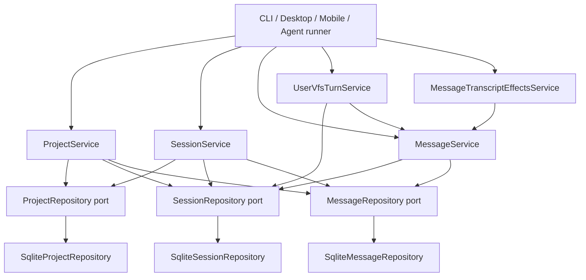

# Chat 领域代码审查

**日期：** 2026-06-21  
**范围：** `packages/core/src/domain/chat/**`、`packages/core/src/service/chat/**`、`packages/core/src/bootstrap/chat/**`、`packages/core/test/chat/**`、`packages/core/src/errors/chat-errors.ts`  
**重点：** 代码风格、可维护性、正确性

---

## 概述

Chat 限界上下文建模 **projects → sessions → messages**，作为 agent dialogue、compaction、rollback、user VFS unified tool turns 及 transcript visibility batching 的对话记录骨干。

| 层 | 文件 | 角色 |
|-------|-------|------|
| Domain model | `model/` 中 6 个文件 | `ChatProject`、`ChatSession`、`ChatMessage`、`ContentBlock`、metadata、pending queue schema |
| Domain logic | `logic/` 中 8 个文件 | Visibility batching、user VFS turn view、fork titles、visible-floor indexing |
| Domain content | `content/` 中 4 个文件 | 严格的 `{ blocks: [...] }` parse/format、plain-text extraction |
| Repositories | 3 个 ports + 3 个 SQLite impls | CRUD、paging、hidden range、pending JSON column |
| Services | `service/chat/` 中 14 个文件 | Project/session/message CRUD、user VFS turn orchestration、transcript effects |
| Bootstrap | `bootstrap/chat/chat-schema.ts` | 三张表的幂等 DDL |
| Errors | `errors/chat-errors.ts` | 含 `NOT_FOUND`、`CONFLICT`、`INVALID_ARGUMENT` 的 `ChatError` |
| Tests | `test/chat/` 中 15 个文件 | Content parsing、visibility、VFS turn flush、services integration、repository paging |

**结论：** 分层良好，在单写者 desktop/CLI 流程下已生产就绪。纯 domain logic 可测试且大多无副作用。主要风险为**事务边界**（append、flush）、**session copy 省略 worktree**、**多 tool 失败时的部分 VFS mutation**，以及**事务内 service 层与 SQLite impls 的耦合**。

---

## 架构与 DDD

### 分层（合规）

```text
bootstrap/chat/chat-schema.ts          → DDL
domain/chat/
  model/                               → entities & wire schemas
  logic/                               → pure functions (visibility, VFS turn view)
  content/                             → parse/format (domain concern)
  repositories/*.port.ts               → persistence ports
  repositories/impl/sqlite-*.ts        → TDBC adapters (documented exception)
service/chat/
  *.port.ts                            → application service interfaces
  impl/*.ts                            → orchestration + transactions
  create-*.ts                          → composition roots
errors/chat-errors.ts                  → domain error type
public/chat.ts                         → facade re-exports
```

**依赖流：**



### DDD 优势

- **Domain 边界的 ports：** `ProjectRepository`、`SessionRepository`、`MessageRepository` 定义持久化而不泄漏 SQL。
- **提取的纯 logic：** Visibility batch（`visibility-batch-range.ts`、`tail-batch-range.ts`）、user VFS turn matching/view（`user-vfs-turn-view.ts`）、fork title generation（`fork-session-title.ts`）与 UI/agent 无关。
- **强制单一 wire shape：** `parseMessageContent` / `assertMessageContent` 在 read 与 append 时拒绝遗留 `{ content, parts }`（`parse-message-content.ts:178-180`）。
- **副作用边界：** `MessageTranscriptEffectsService` 集中 hide/show/truncate + worktree dirty marking（`message-transcript-effects.service.ts:32-84`）。
- **User VFS turn 分离：** 磁盘 mutation（`executeOp` → ToolRunner）vs transcript flush（`flushPendingUserVfsTurns` → synthetic UA pair + checkpoint）是用例层面的清晰拆分（`user-vfs-turn.service.ts:71-167`）。

### 分层缺口

| 问题 | 位置 | 详情 |
|-------|----------|--------|
| Service 在事务中构造 SQLite impls | `message.service.ts:29-35, 122-126, 176-177` | `fork`/`delete` 绕过注入的 ports，直接实例化 `Sqlite*Repository` — 将 application 层与 adapter 耦合 |
| session/project services 中相同模式 | `session.service.ts:27-34`, `project.service.ts:25-32` | `reposFor()` 三处重复，结构相同 |
| 跨领域 view import | `user-vfs-turn-view.ts:14` | Chat view logic 从 `domain/vfs` 导入 `actionXmlToToolUses` — 对 UI preview 可接受，但将 chat 与 VFS action grammar 耦合 |
| message service 中的 VFS orchestration | `message.service.ts:192-196` | fork 上的 `copyVfsTree` — orchestration 合理，但 chat 拥有 fork VFS 策略 |
| 仍导出的 deprecated API | `visibility-batch-range.ts:56-71`, `public/chat.ts:72` | `computeShowRangeFromSelection` 标记 `@deprecated` 但仍 re-export 并测试 |
| `@module` 路径不匹配 | `message-visible-floor.ts:4` | 声明 `domain/chat/message-visible-floor`，文件在 `logic/` 下 |

---

## 代码风格

| 发现 | 位置 | 详情 |
|---------|----------|--------|
| 中英混排模块文档 | `user-vfs-turn-view.ts:1-5`, `visibility-batch-range.ts:1`, `message-visible-floor.ts:1-5`, `parse-message-content.ts:1-5` | Domain logic 文件混用中文头与英文 JSDoc；services 遵循相同模式 |
| 中文行内业务注释 | `session.ts:12`, `user-vfs-turn-constants.ts:7-11`, `append-tool-turn-bridge.ts:11-12` | 周围 API 文档常为英文 — 每层选定一种约定 |
| 三元用法 | 总体克制 | 预览状态中 notable 嵌套三元：`user-vfs-turn-view.ts:246`（`失败` / `成功` / `—`） |
| Lambdas / arrows | 一致 | 适当使用 `.map`/`.filter` callbacks；无过度单行链 |
| 用于 parse narrowing 的 `satisfies` | `parse-message-content.ts:102-167` | 良好的 TypeScript 模式，与 repo 风格一致 |
| Regex attribute parsing | `user-vfs-turn-view.ts:37-43, 59-75` | 逐字段 `match(/kind="…"/)` 而非共享 XML helper — 可读但对 malformed attributes 脆弱 |
| 冗余 wrapper | `sqlite-message.repository.ts:18-20` | `parseContent()` 为 `parseMessageContent` 的一行 alias |
| 未类型化的 `role` | `message.ts:16`, `message.port.ts:26` | 各处 `role: string` — model 边界无 `"user" \| "assistant" \| "tool"` union |

---

## 可维护性

| 发现 | 位置 | 详情 |
|---------|----------|--------|
| `reposFor()` 三处重复 | `message.service.ts:29-35`, `session.service.ts:27-34`, `project.service.ts:25-32` | 相同 factory 模式 — 提取共享 `chatReposForTx(conn)` helper |
| Factory 为单一 service 创建完整 bundle | `create-chat-services.ts:69-81` | `createMessageService(conn)` 调用 `createChatServices(conn)` 并丢弃 projects/sessions — 热点路径上 wiring 浪费 |
| Deprecated delegate | `visibility-batch-range.ts:61-71` | `computeShowRangeFromSelection` 仅包装 `computeTailBatchRangeFromSelection` — caller 迁移后移除 |
| 琐碎 merge function | `merge-pending-vfs-turns.ts:14-17` | 单一 `join("\n")` — 作为具名 burst-flush 概念及专用测试可接受 |
| 未使用的 error code | `chat-errors.ts:9-11` | union 中有 `CONFLICT` 但无 `chatConflict()` helper，chat domain 中无 throw sites |
| Pending JSON save 无 re-validation | `user-vfs-turn.service.ts:62` | Load 路径使用 Zod（`user-vfs-pending.schema.ts:27`）；save 信任 in-memory queue |
| Fork/copy 继承 pending queue | `message.service.ts:187`, `session.service.ts:151` | `userVfsPendingJson` 原样复制 — 若 fork 应清空则可能意外 |
| append 时未 bump session `updatedAtMs` | `message.service.ts:83-108` | Messages 已 append 但父 session timestamp 未变 — 若 UI 按 `updatedAtMs` 排序则 session 排序 stale |
| `chat_message.session_id` 无 DB index | `chat-schema.ts:25-36` | 仅存在 `idx_chat_session_project`；list/page 查询按 `session_id` 过滤（`sqlite-message.repository.ts:50-51`） |
| 无 FK constraints | `chat-schema.ts:15-36` | `project_id` / `session_id` 未声明 REFERENCES — 手动 DB 编辑可能产生 orphan rows |

---

## 正确性

| 严重程度 | 发现 | 位置 | 详情 |
|----------|---------|----------|--------|
| **P1** | `session.copy` 省略 worktree | `session.service.ts:142-169` vs `session.service.ts:86-95` | `create` 将 project worktree 复制到 session scope；`copy` 仅复制 VFS + messages。Copied session 在 prompt materialization 前 worktree 可能为空/stale，直至某处 mark dirty。无测试覆盖 copy 时 worktree parity。 |
| **P1** | `executeOp` 失败时的部分 VFS mutation | `user-vfs-turn.service.ts:88-96` | `runParallel` 执行所有 tools；首次失败返回 `{ ok: false }` 但先前成功的 disk mutations 未 rollback。Pending queue 正确未更新。 |
| **P1** | `flushPendingUserVfsTurns` 非事务性 | `user-vfs-turn.service.ts:125-159` | 两次 `append`、pending clear 与 checkpoint capture 为 separate awaits。序列中途失败可能留下 action 无 ack，或 ack 但 pending 未清。单写者假设可缓解。 |
| **P2** | `append` seq 分配 race | `message.service.ts:94-107` | `nextSeq` + `insert` 在事务外。并发 append 可能在 `(session_id, seq)` UNIQUE（`chat-schema.ts:35`）上冲突并抛出未捕获 constraint error。单写者 desktop 模型下风险低。 |
| **P2** | `raw_json` parse 无 guard | `sqlite-message.repository.ts:30-33` | `JSON.parse(String(row.raw_json))` — 损坏 DB 行会使整个 session 的 list/get 崩溃 |
| **P2** | Fork 不复制 checkpoints | `message.service.ts:176-209` | VFS tree 与 messages 已复制；checkpoint rows 未复制 — forked session rollback 语义与源不同。测试仅验证 VFS/messages/hidden（`chat.services.test.ts:164-185`, `message-visibility.test.ts:68-83`）。 |
| **P2** | `executeOp` 存储 `actionXml` 无 outcome 关联 | `user-vfs-turn.service.ts:98-105` | Tool outcomes 未与 `actionXml` 交叉校验；caller 须保持 XML 与 tool list 一致以供 flush/view |
| **P2** | `assertMessageContent` 变更输入 | `parse-message-content.ts:193` | 过滤空 text 后重新赋值 `blocks` — 若 caller 持有 shared reference 则意外 |
| **P2** | `hideRange` 倒置 bounds 静默 no-op | `message.service.ts:227-233` | `fromSeq > toSeq` 返回 0 changes（`message-visibility.test.ts:102-109`）— 无 `INVALID_ARGUMENT`；callers 须校验 |
| **P3** | `updateHiddenRange` 幂等 filter | `sqlite-message.repository.ts:201-210` | `hiddenFilter` 跳过已 hidden/shown 的行 — 正确；重复时 returned count 可能为 0 |
| **P3** | `listBySessionPage` optional cursor | `sqlite-message.repository.ts:90` | `#{beforeSeq} IS NULL OR seq < #{beforeSeq}` — 首页的正确 SQL |
| **P3** | 允许空 `tool_result.content` | `parse-message-content.ts:127-128` | 默认为 `""` — 与 display formatting 一致 |
| **P3** | read 时丢弃 legacy 空 text blocks | `parse-message-content.ts:73-85` | GLM reasoning-only append 兼容性 |

**Concurrency 假设：** 每 session 单写者（desktop/CLI）。`append` 或 pending queue 无锁 — 多 client 并发 `executeOp` 可能交错 pending entries。

---

## 积极模式

1. **严格 content wire shape** — 遗留 shapes 以可操作错误拒绝（`parse-message-content.ts:178-180`）。
2. **Read 时过滤空 text blocks** — Reasoning-only append rows 不污染 transcript（`parse-message-content.ts:73-85`）。
3. **通过 `nextSeq` 单调 `seq`** — Append 始终分配 next seq（`message.service.ts:94-107`, `sqlite-message.repository.ts:114-122`）。
4. **Transcript effects 统一副作用** — Hide/show/truncate 均 mark worktree dirty（`message-transcript-effects.service.ts:38-84`）。
5. **User VFS turn view 重建** — `matchUserVfsTurnAt` + `buildUserVfsTurnView` 从 stored XML 渲染 tool cards，不持久化 `tool_use` blocks（`user-vfs-turn-view.ts:157-217`）。
6. **Visibility batch 语义已文档化并共享** — 从 head hide（`seq <= max assistant`）、从 tail restore/delete（`seq >= min user`）— desktop/mobile/webview 对齐（`visibility-batch-range.ts:84-119`, `tail-batch-range.ts:44-85`）。
7. **Fork 保留 hidden state** — 显式 spread 保留每条 message 的 `hidden`（`message.service.ts:200-206`）。
8. **Delete 原子 sweep revisions** — Message delete 在单事务中运行 checkpoint cleanup + revision GC（`message.service.ts:122-141`）。
9. **Paging API 一致性** — Tail/page ordering 与 full list 对照验证（`chat.services.test.ts:135-161`）。
10. **Pending queue 的 Zod schema** — Load 时严格 FIFO entry shape（`user-vfs-pending.schema.ts:10-27`）。
11. **Composer helper 清晰** — `hasToolResult` / `isPlainUserText` 清晰区分 tool-result user messages 与 plain text（`message-content-helpers.ts:10-25`）。

---

## 建议

### P0 — 未发现

在常规单写者用法下的主 append/list/hide 路径中，未发现已验证的数据损坏。现有测试套件（15 个文件）覆盖 core service flows、visibility、content parsing 及 user VFS turn integration。

### P1 — 尽快修复

1. **在 `session.copy` 时复制 worktree** — 镜像 `create` 的 `worktree.copyScope`，从源 session scope 到 new session（`session.service.ts:142-169`；参考 `session.service.ts:86-95`）。添加 integration test。
2. **将 `flushPendingUserVfsTurns` 包在事务中** — 原子地 append action + ack、clear pending、capture checkpoint（`user-vfs-turn.service.ts:125-159`）。
3. **文档化或在 `executeOp` 失败时 rollback 部分 VFS** — 返回哪些 tools 成功，或在任一 sibling 失败时补偿成功 mutations（`user-vfs-turn.service.ts:88-96`）。
4. **澄清 fork checkpoint 策略** — 文档化 forked sessions 无 checkpoints 启动，或若需 parity 则复制 checkpoint rows（`message.service.ts:176-209`）。

### P2 — 提升可维护性与加固

5. **为 transaction scopes 注入 repo factories** — 用共享 `chatReposForTx(tx)` 替换 message/session/project services 内联 `Sqlite*Repository` 构造（与 message-checkpoint 中 `truncateTailDepsFromTx` 对齐）。
6. **将 `append` 包在事务中** — `nextSeq` + `insert` 原子化以避免 contention 下 UNIQUE violations（`message.service.ts:94-107`）。
7. **Guard `raw_json` parse** — 在 `rowToMessage` 中 try/catch 或 schema check（`sqlite-message.repository.ts:30-33`）；将损坏行视为 `null` 或 skip 并 log。
8. **移除 deprecated `computeShowRangeFromSelection`** — 迁移 test（`visibility-batch-range.test.ts:52`）与 public export（`public/chat.ts:72`），然后删除 delegate（`visibility-batch-range.ts:56-71`）。
9. **添加 `idx_chat_message_session` index** — 在 `chat-schema.ts:25-36` 中为 list/page 热点路径 `CREATE INDEX … ON chat_message(session_id, seq)`。
10. **统一注释语言** — 英文 module headers；业务规则可选中文。
11. **修正 `@module` 路径** — 包含 `logic/` / `content/` 子目录（`message-visible-floor.ts:4`）。
12. **移除或实现 `CONFLICT`** — 为 duplicate scenarios 添加 `chatConflict()`，或从 union 删除未使用 code（`chat-errors.ts:9-11`）。
13. **考虑 typed `MessageRole`** — 在 model 边界替换 `ChatMessage.role` 上的 bare `string`（`message.ts:16`）。

### P3 — 可选优化

14. `user-vfs-turn-view.ts` 使用共享 XML attribute parser，替代逐字段 regex（`user-vfs-turn-view.ts:37-43`）。
15. 不仅在 load 时 validate pending queue schema，save 时也 validate（`user-vfs-turn.service.ts:62`）。
16. 若 UI 按 activity 排序 sessions，在 message append 时 bump `session.updatedAtMs`。
17. 精简 factory API — `createMessageService` 不应构造未使用的 project/session services（`create-chat-services.ts:69-81`）。
18. 决定 fork/copy pending 策略 — fork 时清空 vs 继承 `userVfsPendingJson`（`message.service.ts:187`, `session.service.ts:151`）。

---

*审查范围：24 个 domain 文件、14 个 service 文件、1 个 bootstrap 文件、15 个 test 文件、1 个 error 模块。交叉引用 agent-runner flush reorder 与 message-checkpoint truncate-tail integration。*
