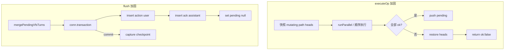

# 用户 VFS Turn 正确性加固 技术规格（SPEC）

> 需求：[prd.md](./prd.md)  
> 探索：[explore.md](./explore.md)  
> 产品基线：[vfs-user-ops-unified-tool-turn/spec.md](../../../vfs-user-ops-unified-tool-turn/spec.md)（UA 两段 + pending burst）

---

## 设计目标

1. **`executeOp` 边界原子性：** 单次用户 VFS 操作在磁盘上与 pending 队列 **同进同退** — 失败时不留「半应用」mutations。
2. **`flushPendingUserVfsTurns` 持久化原子性：** transcript 两条 synthetic 消息与 `user_vfs_pending_json` 清空 **同事务提交**。
3. **最小侵入：** 不改变 unified tool turn 对外 UX；复用现有 VFS head/revision 模型与 `MessageService` 事务惯例。
4. **可测：** 集成测可模拟多 tool 失败与 flush 中途失败，不依赖 Desktop/Mobile。

---

## 现状与差距

### 当前 `executeOp` 流程

```text
findSession → resolveToolCtx
    → toolRunner.runParallel(tools)     // 全部执行，失败写入 outcome
    → first failed? return { ok:false } // pending 不写 ✓
    → else push pending & save
```

| 差距 | 说明 |
|------|------|
| 部分磁盘成功 | `runParallel` 对每个 call 独立 `try/catch`（`tool-runner.ts` L183–189）；先成功的 `write`/`edit`/`fs` 已提交 scoped VFS |
| 多 hunk 真实场景 | `mapUserSaveToToolUses` 可产出 **多个** `edit` tool（`user-vfs-save-mapping.ts` L220–241） |
| 无起始快照 | op 开始前未记录 mutating path head |

### 当前 `flushPendingUserVfsTurns` 流程

```text
load pending → merge → wrapUserVfsActionsForStorage
    → messages.append(action user)      // 独立 autocommit
    → messages.append(ack assistant)    // 独立 autocommit
    → savePendingQueue([])              // 独立 autocommit
    → messageCheckpoint.capture(...)    // 内部单独 transaction
```

| 失败点 | 残留状态 |
|--------|----------|
| 第一次 append 后、第二次前 | 仅有 `user_vfs_action`，无 ack；pending 仍在 → 重试可能 **重复 action** |
| 两次 append 后、clear pending 前 | 2 条消息 + pending 仍在 → flush 再次执行 **重复 UA** |
| clear 后 capture 失败 | 2 条消息 + pending 空 + **无 checkpoint** → 回滚锚点缺失 |

### 关联编排（本迭代不改动实现，仅记风险）

`flushPendingUserVfsTurnsWithTrailingUserReorder`（`run-agent-turn.ts` L120–150）在 flush 前 **delete** 末条 user，flush 后在 `finally` **re-append**。若 flush 事务失败，末条 user 可能已删未恢复 — 归属 agent 编排 follow-up，PRD 已排除。

---

## 总体方案



---

## executeOp：mutating path 补偿回滚

### 策略定案

采用 **起始 head 快照 + 失败 restore**（PRD E1），**不**修改 `ToolRunner.runParallel` 全局行为。

| 步骤 | 行为 |
|------|------|
| 1 | 从 `op.tools` 解析 mutating paths（复用 `extractMutatingPaths` 或 domain 层等价纯函数；与 ToolRunner 同源） |
| 2 | 经 scoped VFS / entry repo 读取各 path **当前 head**（`logicalPath → { headVersion, content?, status }`）；无 path 则跳过 |
| 3 | `runParallel` 执行（保持与 agent 侧并发语义一致；同 path 已有 pathTail 串行） |
| 4 | 若 `outcomes.every(o => o.ok)` → 现有 pending push |
| 5 | 否则 **逆序**（与执行完成顺序相反）对每个 **已成功** mutating outcome 调用 restore helper，将 path 设回步骤 2 快照；若快照为「不存在」则 `delete` path |
| 6 | 返回 `{ ok: false, error: failed.error }`（类型保持向后兼容；可选扩展 `partialFailure?: true` 供日志） |

### restore helper 落位

| 项 | 路径 |
|----|------|
| 纯函数 / 小模块 | `domain/vfs/logic/restore-mutating-path-heads.ts`（新） |
| 输入 | `ScopedVfsService` 或 `VfsEntryRepository` + scope、`readonly Map<path, HeadSnapshot>` |
| 行为 | 对每个 path：`write` 回旧 content+version 或 `delete` 若起始不存在 |

**边界：** 若 restore 自身失败，记录/包装为 `CompositeError`，仍返回 `ok: false`；集成测覆盖「tool 失败 + restore 成功」主路径即可。

### deps 变更

`UserVfsTurnServiceDeps` 增加：

```typescript
readonly conn: TdbcConnection;
```

工厂 `create-user-vfs-turn-service.ts` 传入现有 `conn`（与 `DefaultMessageService` 一致）。

**不在 executeOp 使用 DB 事务包裹 ToolRunner** — VFS mutation 经 revision 层即时提交；补偿回滚与 agent tool 失败策略对齐（无 cross-tool SQLite 事务）。

---

## flushPendingUserVfsTurns：单事务 append + clear

### 策略定案

| 阶段 | 事务 | 内容 |
|------|------|------|
| **A** | `deps.conn.transaction` | merge 结果 → 两次 message `insert`（tx 内 `SqliteMessageRepository`）→ `sessions.setUserVfsPendingJson(null)` |
| **B** | 事务外 | `messageCheckpoint.capture(sessionId, projectId, actionUser.id)` |

**为何 capture 在事务外：** `listSessionFileHeads` 读取 **已提交** 的 VFS heads（executeOp 阶段已写盘）；capture 内部自有 transaction（`message-checkpoint.service.ts` L39–51）。消息与 pending 先原子落库，避免「capture 成功但 pending 未清」。

**capture 失败（PRD E5）：** `flushPendingUserVfsTurns` **reject**；消息与 pending 已一致（2 条 + 空 pending）。**不提供** 本迭代自动 repair API；调用方（Desktop/Mobile send 路径）应 toast 并允许用户重试 agent（checkpoint 缺失时回滚走「最近前序 checkpoint」既有语义）。后续 `message-checkpoint-and-agent` 可统一 retry。

### 实现 sketch

新增 package-private helper（或 `DefaultUserVfsTurnService` 私有方法）：

```typescript
async flushPendingInTransaction(
  tx: TdbcConnection,
  sessionId: string,
  pending: UserVfsPendingQueue,
): Promise<ChatMessage /* action user */> {
  const { actionsXml } = mergePendingVfsTurns(pending);
  const text = wrapUserVfsActionsForStorage(actionsXml);
  const messages = new SqliteMessageRepository(tx);
  const sessions = new SqliteSessionRepository(tx);
  // nextSeq + insert ×2（复制 message.service append 字段赋值，或提取 appendInTx port）
  await sessions.setUserVfsPendingJson(sessionId, null);
  return actionUser;
}
```

**推荐：** 在 `MessageRepository` port 增加 **tx 友好** 的 `insertWithNextSeq` 或在 chat service 层提取 `appendMessageInTx(tx, ...)` 供 `UserVfsTurnService` 与 future `message.append` 事务化共用 — **本迭代最小方案** 可在 `user-vfs-turn.service.ts` 内联 tx insert（与 `message.service` fork 模式相同，接受短期重复）。

### `DefaultUserVfsTurnService.flushPendingUserVfsTurns` 伪代码

```typescript
const pending = await loadPendingQueue(...);
if (pending.length === 0) return { flushed: false };

const actionUser = await this.deps.conn.transaction((tx) =>
  this.flushPendingInTransaction(tx, sessionId, pending),
);

await this.deps.messageCheckpoint.capture(
  sessionId,
  session.projectId,
  actionUser.id,
);

return { flushed: true };
```

---

## 文件变更清单

| 文件 | 变更 |
|------|------|
| `service/chat/impl/user-vfs-turn.service.ts` | execute 快照/回滚；flush 事务 |
| `service/chat/user-vfs-turn.port.ts` | 可选扩展 `UserVfsTurnExecuteResult` 文档 |
| `service/chat/create-user-vfs-turn-service.ts` | 注入 `conn` |
| `domain/vfs/logic/restore-mutating-path-heads.ts` | **新增** restore 纯函数 + 单测 |
| `test/chat/user-vfs-turn.service.test.ts` | E1/E3/E5 场景 |
| `test/vfs/restore-mutating-path-heads.test.ts` | **新增** domain 单测 |

**不改：** `run-agent-turn.ts` trailing reorder、`ToolRunner`、`user-vfs-save-mapping` 映射规则。

---

## 测试计划

| ID | 文件 | 场景 |
|----|------|------|
| T1 | `user-vfs-turn.service.test.ts` | 注册 `test.fail_on_second` mock tool：op 含 2 calls，第二次失败 → path 内容恢复、pending null |
| T2 | 同上 | 2 calls 均成功 → pending 1 条、磁盘变更保留 |
| T3 | 同上 | 注入 `messages.append` 在第二次调用 throw（spy on tx repo）→ flush 后消息数 0、pending 不变 |
| T4 | 同上 | 正常 flush + mock capture 记录 messageId |
| T5 | 同上 | mock capture reject → expect flush throws；messages.length===2；pending null |
| T6 | 回归 | 现有 F1–F4、burst 3、不重跑 ToolRunner、bridge |
| T7 | `restore-mutating-path-heads.test.ts` | 快照 write/delete 组合 restore |

运行：`npm run test:fast`（`packages/core`）。

---

## 验收对照（PRD → 实现）

| PRD | SPEC 章节 |
|-----|-----------|
| E1/E2 | §executeOp 步骤 1–6 |
| E3/E4 | §flush 阶段 A |
| E5 | §capture 失败 |
| E6 | §测试计划 T6 |
| 单写者 | §现状 关联编排；不新增锁 |
| dependency vfs-user-ops | UA 两段、pending、checkpoint 锚点 **不变** |

---

## 实施顺序

1. 新增 `restore-mutating-path-heads` + domain 单测  
2. `executeOp` 快照/回滚 + T1/T2  
3. `flushPendingInTransaction` + deps.conn + T3–T5  
4. 全量 `test:fast` 回归  

预估 **1 PR**，与 Phase 2 其它 chat 项无硬合并依赖。
