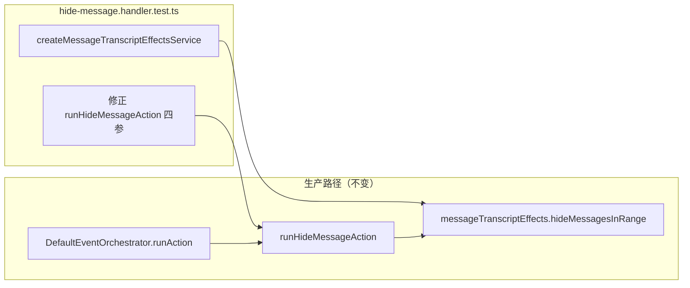

# CI 测试健康恢复（ci-test-health）技术规格（SPEC）

> 需求：[prd.md](./prd.md)  
> 探索：[explore.md](./explore.md)

## 设计目标

- **最小 diff：** 仅修改 `packages/core/test/events/hide-message.handler.test.ts`，不改动 handler 业务逻辑与 orchestrator 接线（已正确）。
- **契约对齐：** 测试调用与 `runHideMessageAction(projectId, sessionId, slice, deps)` 及 `HideMessageHandlerDeps` 一致。
- **真实 effects：** 使用与 `message-transcript-effects.test.ts` 相同的 `createMessageTranscriptEffectsService` 工厂，使 `hidden` 断言有意义。
- **验收：** `npm run test:fast` 893/893 绿。

## 现状与根因（代码探索）

### Handler 契约（已正确，无需改）

```37:83:packages/core/src/service/events/impl/actions/hide-message.handler.ts
export async function runHideMessageAction(
  projectId: string,
  sessionId: string,
  slice: DepthSlice,
  deps: HideMessageHandlerDeps,
): Promise<void> {
  // ...
  await deps.messageTranscriptEffects.hideMessagesInRange(
    projectId,
    sessionId,
    range.fromSeq,
    range.toSeq,
  );
}
```

`HideMessageHandlerDeps`（同文件 L27–33）要求 `messages` **与** `messageTranscriptEffects` 同时存在。

### 生产接线（已正确，无需改）

```232:241:packages/core/src/service/events/impl/event-orchestrator.service.ts
      case "hide-message":
        await runHideMessageAction(
          ctx.projectId,
          ctx.sessionId,
          action.params as DepthSlice,
          {
            messages: this.deps.messages,
            messageTranscriptEffects: this.deps.messageTranscriptEffects,
          },
        );
```

`event-orchestrator.dag.test.ts` 已覆盖「hide-message 委托 effects、orchestrator 不二次 markDirty」且通过。

### 测试失败点

| 位置 | 现状（错误） | 后果 |
|------|--------------|------|
| `hide-message.handler.test.ts:54–59` | 首参 `chatSession`（`ChatAgentSession`），deps 仅 `{ messages }` | `deps.messageTranscriptEffects` 为 `undefined` → L71 TypeError |
| `hide-message.handler.test.ts:88–93` | 同上 | 同上 |

错误堆栈：`hide-message.handler.ts:71` → `Cannot read properties of undefined (reading 'hideMessagesInRange')`。

### 参考实现（同 repo 已通过）

`packages/core/test/chat/message-transcript-effects.test.ts` L8–20：

```typescript
import { createSessionWorktreeSnapshotStore } from "@novel-master/core/worktree";
import { createMessageTranscriptEffectsService } from "../../src/service/chat/create-message-transcript-effects.js";
// ...
const store = createSessionWorktreeSnapshotStore();
const effects = createMessageTranscriptEffectsService(ctx.conn, store);
```

## 总体方案



1. 在测试文件顶部增加 effects 相关 import。
2. 每个 `it` 块内、调用 `runHideMessageAction` 前，创建 `store` + `effects`。
3. 将两处 `runHideMessageAction` 调用改为：`project.id`、`sessionRow.id`、完整 deps。
4. 保留既有 fixture 构造与 `hidden` 断言循环不变。
5. **不修改** `hide-message.handler.ts`（工作区 CRLF/空行 diff 属格式噪音，本 feature 不纳入）。

## 变更点清单

| # | 文件 | 操作 | 说明 |
|---|------|------|------|
| 1 | `packages/core/test/events/hide-message.handler.test.ts` | 修改 | 唯一代码变更文件 |
| — | `packages/core/src/service/events/impl/actions/hide-message.handler.ts` | **不改** | 逻辑已满足契约 |
| — | `packages/core/src/service/events/impl/event-orchestrator.service.ts` | **不改** | L232–241 已正确传参 |
| — | `packages/core/test/events/event-orchestrator.dag.test.ts` | **不改** | 回归哨兵 |

## 详细实现步骤

### 步骤 1：补充 import（文件顶部，约 L5–17 之后）

在现有 import 块末尾新增：

```typescript
import { createSessionWorktreeSnapshotStore } from "@novel-master/core/worktree";
import { createMessageTranscriptEffectsService } from "../../src/service/chat/create-message-transcript-effects.js";
```

**变更前（L5–17）：** 无上述两行。  
**变更后：** 在 L17 `novel-master-fixture` import 之后插入上述 import（保持 import 分组：node → domain/service → helpers → effects）。

### 步骤 2：修复用例 1（L30–67）

**2a. 在 L52 `assert.ok(range)` 之后、L54 调用之前插入：**

```typescript
    const store = createSessionWorktreeSnapshotStore();
    const effects = createMessageTranscriptEffectsService(ctx.conn, store);
```

**2b. 替换 L54–59：**

| 行 | 变更前 | 变更后 |
|----|--------|--------|
| 54–59 | `await runHideMessageAction(chatSession, sessionRow.id, slice, { messages: ctx.messages })` | `await runHideMessageAction(project.id, sessionRow.id, slice, { messages: ctx.messages, messageTranscriptEffects: effects })` |

**保留不变：** L31–51 fixture 构造；L61–66 `listBySession` + `hidden` 断言循环。

### 步骤 3：修复用例 2（L69–101）

**3a. 在 L86 `assert.ok(range)` 之后、L88 调用之前插入：**

```typescript
    const store = createSessionWorktreeSnapshotStore();
    const effects = createMessageTranscriptEffectsService(ctx.conn, store);
```

**3b. 替换 L88–93：**

| 行 | 变更前 | 变更后 |
|----|--------|--------|
| 88–93 | `await runHideMessageAction(chatSession, sessionRow.id, slice, { messages: ctx.messages })` | `await runHideMessageAction(project.id, sessionRow.id, slice, { messages: ctx.messages, messageTranscriptEffects: effects })` |

**保留不变：** L70–85 fixture；L95–100 断言循环。

### 步骤 4：可选清理（非必须）

- `chatSession` 仍用于 `appendText` 写消息，**保留** `ChatAgentSession` import 与实例化。
- 若 linter 对重复 `store`/`effects` 两行报 duplicate，可提取 describe 级 helper（本 feature 优先 inline，与 `message-transcript-effects.test.ts` 一致，不强制 DRY）。

### 步骤 5：验收命令

```powershell
Set-Location d:\Dev\Js\novel-master\packages\core
npm run test:fast
```

预期：`# pass 893` / `# fail 0` / exit code `0`。

**可选窄范围：**

```powershell
npx tsx --test test/events/hide-message.handler.test.ts
```

## 测试策略

| 层级 | 文件 | 目的 |
|------|------|------|
| **直接修复** | `test/events/hide-message.handler.test.ts` | 两条 depth 锚点 / endDepth 集成用例绿 |
| **回归（无需改）** | `test/events/event-orchestrator.dag.test.ts` | orchestrator → handler → effects 委托链 |
| **回归（无需改）** | `test/chat/message-transcript-effects.test.ts` | effects 实现未被误改 |
| **回归（无需改）** | `test/depth/resolve-hide-message-range.test.ts` | depth 算法单测 |
| **全量门禁** | `npm run test:fast` | 893 用例 0 失败 |

### 用例 1 行为预期（不变）

- Fixture：10 条消息，`startDepth: 6`，depth6 为 user → `resolveHideMessageRange` 锚定 assistant 起点。
- 断言：seq ∈ `[range.fromSeq, range.toSeq]` 的 message `hidden === true`，其余 `false`。

### 用例 2 行为预期（不变）

- Fixture：5 条消息，`startDepth: 2, endDepth: 4`。
- 断言：slice 内 min~max seq 区间与 `hidden` 一致。

## 风险与回滚

| 风险 | 可能性 | 缓解 |
|------|--------|------|
| `createMessageTranscriptEffectsService` 与 fixture DB 不兼容 | 低 | 同模式已在 `message-transcript-effects.test.ts` 验证 |
| 误改 handler 引入行为变化 | 无（本 spec 不改 handler） | 保持 handler/orchestrator diff 为零 |
| 893 全量中隐藏失败 | 低 | 失败套件仅 1 个；修完跑全量 `test:fast` |
| 工作区 handler CRLF diff 被误提交 | 中 | 提交前 `git checkout -- hide-message.handler.ts` 或单独格式化 PR |

**回滚：** 还原 `hide-message.handler.test.ts` 单文件即可恢复失败状态（891/893）；无 schema / 迁移 / API 变更，无数据回滚需求。

## 与 PRD 验收映射

| PRD ID | SPEC 验证 |
|--------|-----------|
| T1 | 步骤 5 全量 `test:fast` |
| T2 | 步骤 2–3 修复 + 可选窄范围命令 |
| T3 | 用例 1 L61–66 断言 |
| T4 | 用例 2 L95–100 断言 |
| T5 | `event-orchestrator.dag.test.ts` 随 fast 绿 |
| T6 | `message-transcript-effects.test.ts` 随 fast 绿 |
