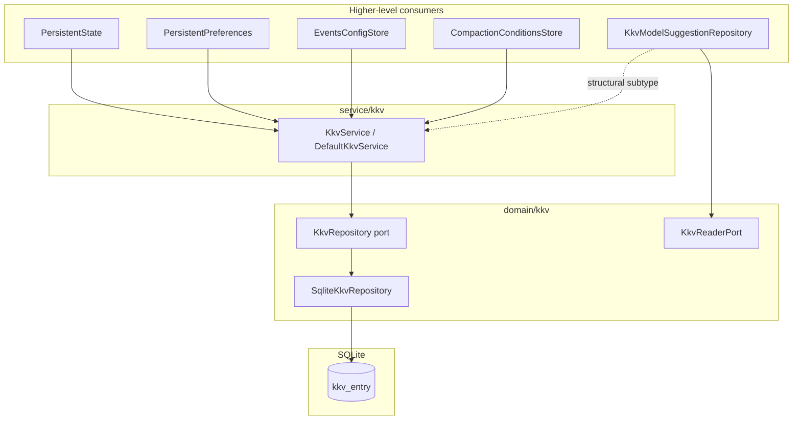

# 代码审查：KKV 域（`packages/core`）

**审查日期：** 2025-06-21  
**范围：**

| 领域 | 路径 |
|------|------|
| 域模型与端口 | `packages/core/src/domain/kkv/**` |
| 应用服务 | `packages/core/src/service/kkv/**` |
| 相关仓储适配器 | `packages/core/src/domain/provider/repositories/impl/kkv-model-suggestion.repository.ts` |
| 测试 | `packages/core/test/kkv/kkv.service.test.ts`、`packages/core/test/provider/kkv-model-suggestion.repository.test.ts` |

**维度：** 代码风格、可维护性、正确性。

---

## 执行摘要

KKV（模块作用域键值）是一个小而边界清晰的持久层：单张 SQLite 表（`kkv_entry`）、薄仓储、将 null 与 throw 语义标准化的服务，以及更高层消费者在命名模块下存储 JSON 文档。设计与 `packages/core` 其余部分一致（TDBC + `SqlTemplateParser`、工厂装配、`KkvError` 与 `isKkvError` duck-typing 以应对测试双模块加载）。

**结论：** 对当前单写者 CLI/desktop 用法已可投产。范围内代码未发现阻塞性正确性 bug。主要风险为架构层面（端口重复、无事务的读-改-写）与测试/文档缺口 — 非正常流程下的运行时失败。

**已运行测试：** `test/kkv/kkv.service.test.ts` + `test/provider/kkv-model-suggestion.repository.test.ts` — **4/4 通过**。

---

## 架构概览



### 分层

| 层 | 职责 | 错误模型 |
|----|------|----------|
| `KkvRepository` | `kkv_entry` 原始 CRUD | `get` → `null`；`delete` → `boolean` |
| `KkvService` | 面向应用的 KKV | 缺失键时 `get`/`delete` → `KkvError NOT_FOUND` |
| `KkvReaderPort` | 仓储用域适配器子集 | 与 `KkvService` 相同 throw 语义（结构子类型隐式） |

### 模块命名（范围外消费者，供上下文）

core 中已知 KKV 模块：`nm-workspace-state`、`nm-preferences`、`nm-events`、compaction-conditions 模块、`nm-model-suggestions`、model-retry-policy 模块。各消费者自有键 schema 与 JSON 编码。

### 公共 API 面

- `@novel-master/core/kkv` 导出 `createKkvService`、`KkvError`、`isKkvError`、`KkvErrorCode`。
- 主包入口**故意不**导出 KKV（已在 `package-exports-t0.test.ts` 验证）。
- `service/kkv/index.ts` 说明产品代码应优先使用 `PersistentState` / `PersistentPreferences`。

---

## 文件清单

| 文件 | 行数（约） | 角色 |
|------|------------|------|
| `domain/kkv/model/kkv-entry.ts` | 13 | 值对象：`{ module, key, value }` |
| `domain/kkv/repositories/kkv.port.ts` | 21 | 仓储端口 |
| `domain/kkv/repositories/impl/sqlite-kkv.repository.ts` | 77 | SQLite 实现 |
| `domain/kkv/ports/kkv-reader.port.ts` | 13 | 域仓储窄端口 |
| `service/kkv/kkv.port.ts` | 21 | 服务端口 |
| `service/kkv/impl/kkv.service.ts` | 40 | 服务实现 |
| `service/kkv/create-kkv-service.ts` | 21 | 工厂 |
| `service/kkv/index.ts` | 14 | 子路径导出 |
| `domain/provider/.../kkv-model-suggestion.repository.ts` | 124 | 基于 KKV 的 JSON 文档仓储 |
| `test/kkv/kkv.service.test.ts` | 43 | 服务集成测试 |
| `test/provider/kkv-model-suggestion.repository.test.ts` | 47 | 建议仓储测试 |

相关但范围外：`bootstrap/kkv/kkv-schema.ts`、`errors/kkv-errors.ts`、`infra/kkv-value-codec.ts`。

---

## 优点

### 1. null 与 throw 语义分离清晰

仓储返回可空/boolean；服务翻译为域错误。与别处模式（如 VFS）一致，SQL 层可测且无需异常 plumbing。

```21:27:packages/core/src/service/kkv/impl/kkv.service.ts
  async get(module: string, key: string): Promise<string> {
    const entry = await this.repo.get(module, key);
    if (entry == null) {
      throw kkvNotFound(module, key);
    }
    return entry.value;
  }
```

### 2. SQL 层幂等 upsert

`SqliteKkvRepository.set` 中 `INSERT ... ON CONFLICT DO UPDATE` 正确，避免仓储内易竞态的 read-then-insert。

### 3. 适配器 NOT_FOUND 处理一致

`KkvModelSuggestionRepository`、`DefaultPersistentState`、`DefaultEventsConfigStore` 均用 `isKkvError(error, "NOT_FOUND")` 处理可选读与幂等删 — 调用方可预期。

### 4. 读取时 schema 校验

模型建议缓存在 `JSON.parse` 后用 `decode(..., modelSuggestionCacheSchema)`，与 events-config 等 wire 文档对齐。

### 5. 域模型精简聚焦

`KkvEntry` 体量合适。无过早抽象（域层无泛型 typed KKV 包装）。

### 6. 文档质量

JSDoc `@module` 标签、工厂说明、`service/kkv/index.ts` 导出边界注释清晰传达意图与 API 边界。

---

## 问题

### 主要

#### M1. `KkvReaderPort` 与 `KkvService` 重复且命名误导

`KkvReaderPort` 暴露 `get`、`set`、`delete` — 非只读。结构上为 `KkvService` 子集（缺 `listKeys`）。仅 `KkvModelSuggestionRepository` 使用；构造函数接受 `KkvReaderPort`，测试与装配传入 `KkvService`。

**影响：** 两套并行端口定义需维护；名称暗示只读；端口未文档化 throw 语义（调用方须知 `get` 在缺失键时 throw）。

**建议：** 重命名为 `KkvStorePort` / `KkvAccessPort` 并在 JSDoc 文档化 throw 行为，或删除端口、域适配器直接依赖 `KkvService`（已借结构子类型隐式接受服务层类型）。

#### M2. 无事务的读-改-写

`KkvModelSuggestionRepository.upsert`、`markStaleExcept` 及所有 JSON 文档消费者均为：`get` → 内存变更 → `set`。并发写者可丢更新（last write wins）。

**影响：** 今日低（单 CLI 进程、顺序 provider fetch）。多写者共享 DB（mobile 同步、并行 worker）时成为正确性风险。

**建议：** 文档化为显式约束，或多写者场景出现时增加乐观版本 / 事务批辅助。当前架构不紧急。

#### M3. `KkvErrorCode` 含未使用的 `CONFLICT`

```8:8:packages/core/src/errors/kkv-errors.ts
export type KkvErrorCode = "NOT_FOUND" | "CONFLICT";
```

无 KKV 路径 throw `CONFLICT`。upsert SQL 中 SQLite `ON CONFLICT` 与该错误类型无关。

**影响：** 死 API 面；误导处理错误的调用方。

**建议：** 在真实冲突场景出现前移除 `CONFLICT`，或实现并测试（如 compare-and-swap）。

---

### 次要

#### m1. 损坏 JSON / schema decode 失败以泛型错误传播

`KkvModelSuggestionRepository.readCache` 中：

```105:114:packages/core/src/domain/provider/repositories/impl/kkv-model-suggestion.repository.ts
  private async readCache(providerId: string): Promise<ModelSuggestionCache> {
    try {
      const raw = await this.kkv.get(MODULE, providerId);
      return decode(JSON.parse(raw) as unknown, modelSuggestionCacheSchema);
    } catch (error) {
      if (isKkvError(error, "NOT_FOUND")) {
        return emptyCache();
      }
      throw error;
    }
  }
```

`JSON.parse` 与 Zod/decode 失败未规范化为域错误。`DefaultEventsConfigStore` 同模式。

**影响：** KKV 值损坏时用户侧 opaque 错误；无自动恢复为空缓存。

**建议：** 考虑共享 `readKkvJsonDocument` 辅助，将 decode 失败映射为类型化错误或默认值（产品决策）。至少文档化行为。

#### m2. `markStaleExcept` 迭代冗余

方法从 `cache.models` 构建 `byId`，再遍历 `cache.models` 标记未见项 stale。等价且更清晰：

```typescript
for (const [id, entry] of byId) {
  if (!seen.has(id)) {
    byId.set(id, { ...entry, stale: true });
  }
}
```

**影响：** 仅可维护性；行为正确。

#### m3. `markStaleExcept` 后模型列表顺序不稳定

`[...byId.values()]` 保留 Map 插入顺序（原缓存顺序 + 新 `seen` id 追加）。若调用方假定按 vendor ID 排序，`listByProvider` 顺序可能与 `ORDER BY` 预期不符。

**影响：** 若展示层未排序，UI 顺序不一致。

#### m4. wire JSON 中重复 `vendorModelId` 未阻止

`modelSuggestionCacheSchema` 允许数组重复项。`upsert` 用 `findIndex`（仅更新首个匹配）；`readCache` → `Map` 静默合并重复。

**影响：** 仅当数据损坏或手工编辑 KKV 时。

**建议：** 为唯一 `vendorModelId` 增加 `.refine()`，或读取时去重。

#### m5. 测试中未使用的 import

两测试文件均 import `testIsolationSuffix` 但未使用。可能从 fixture 模式复制粘贴。

---

### nit / 风格

| ID | 位置 | 说明 |
|----|------|------|
| n1 | `kkv.service.test.ts` | 缺失测试：缺失键上 `get` throw `NOT_FOUND`（仅测了 `delete`）。 |
| n2 | `kkv.service.test.ts` | 缺失测试：`set` 覆盖语义。 |
| n3 | `kkv-model-suggestion.repository.test.ts` | 单条集成测试；`markStaleExcept` 边界（空缓存、仅 seen id、幂等删）无隔离单元测试。 |
| n4 | `SqliteKkvRepository.get` | length 检查后用非空断言 `rows[0]!` — 可接受，可用 early return 变量。 |
| n5 | `provider-model.service` 消费者 | 每模型 `upsert` 再 `markStaleExcept`（整缓存重写）— fetch 时 N+1 KKV 读写。性能注记，非 bug。 |

---

## 正确性深入

### `DefaultKkvService`

| 操作 | 预期 | 实际 | OK |
|------|------|------|-----|
| `listKeys(module)` | 模块内键，有序 | SQL `ORDER BY key` | ✓ |
| `get` 缺失 | Throw `NOT_FOUND` | 经 `kkvNotFound` throw | ✓ |
| `set` | Upsert | SQL upsert | ✓ |
| `delete` 缺失 | Throw `NOT_FOUND` | 检查 `repo.delete` boolean | ✓ |
| 跨模块隔离 | 键按 module 作用域 | PK `(module, key)` | ✓ |

### `SqliteKkvRepository`

| 操作 | 预期 | 实际 | OK |
|------|------|------|-----|
| `get` 缺失 | `null` | 空结果 → `null` | ✓ |
| `delete` 缺失 | `false` | `changes === 0` | ✓ |
| SQL 注入 | 参数化 `#{}` | 使用 `SqlTemplateParser` 绑定 | ✓ |

### `KkvModelSuggestionRepository`

| 方法 | 行为 | OK |
|------|------|-----|
| `listByProvider` | 缓存项映射为 `ModelSuggestion` | ✓ |
| `upsert` | 按 `vendorModelId` 更新或追加 | ✓ |
| `markStaleExcept` | 未见 → `stale: true`；已见 → `stale: false`，刷新 `lastSeenAtMs` | ✓ |
| `deleteByProvider` | 幂等（吞掉 `NOT_FOUND`） | ✓ |
| `readCache` 缺失键 | 返回 `{ schemaVersion: 1, models: [] }` | ✓ |

**`markStaleExcept` 流程**（对照测试验证）：

1. 不在 `seen` 中的模型标记 stale。
2. 在 `seen` 中的模型得 `stale: false` 并更新 `lastSeenAtMs`。
3. 先前不在缓存中的 `seen` id 以 `displayName: null` 追加（边界；正常 fetch 先 upsert）。

---

## 代码风格评估

| 准则 | 评级 | 说明 |
|------|------|------|
| 命名 | 良好 | `module`/`key`/`value` 清晰。`KkvReaderPort` 命名为例外。 |
| 文件布局 | 良好 | 镜像其他域：`model/`、`repositories/`、`ports/`、`impl/`。 |
| JSDoc | 良好 | 模块头与公共契约有文档。 |
| 引用路径 | 良好 | 一致 `@/` 别名。 |
| 错误处理 | 良好 | `isKkvError` duck-type 守卫处理测试 src/dist 双加载。 |
| SQL 风格 | 良好 | 与 core 广泛 TDBC 模板模式一致。 |
| 不可变性 | 良好 | `KkvEntry` 字段 `readonly`；缓存变更写前复制数组。 |

---

## 可维护性评估

| 方面 | 评级 | 说明 |
|------|------|------|
| 耦合 | 中等 | 域适配器依赖服务 throw 语义，无正式适配器接口。 |
| 可扩展性 | 良好 | 新模块 = 新消费者 + 常量；KKV core 无需改。 |
| 可测试性 | 良好 | 工厂 + 内存 SQLite fixture；仓储接受端口接口。 |
| 重复 | 中等 | `KkvReaderPort` ≈ `KkvService`；消费者间重复 NOT_FOUND catch。 |
| 迁移故事 | 范围外 N/A | Bootstrap 建表；范围内文件无 KKV wire 迁移。 |

**建议共享工具（可选，非必须）：**

- `readKkvOptional(kkv, module, key): Promise<string | undefined>`
- `deleteKkvOptional(kkv, module, key): Promise<void>`
- `readKkvJsonDocument<T>(kkv, module, key, schema, defaultDoc): Promise<T>`

可去重 persistent-state、events-config、model-suggestion 仓储中的模式。

---

## 测试覆盖评估

| 领域 | 已覆盖 | 缺口 |
|------|--------|------|
| 模块隔离 | ✓ | — |
| `listKeys` 顺序 | ✓ | 空模块 |
| `delete` NOT_FOUND | ✓ | — |
| `get` NOT_FOUND | ✗ | 应镜像 delete 测试 |
| Upsert 覆盖 | ✗ | — |
| 建议 upsert + stale + delete | ✓（单路径） | 空 provider、重复 upsert、损坏 JSON |
| 仓储端口（`SqliteKkvRepository`） | 经服务隐式 | 无直接单元测试 |

happy path 回归覆盖足够；错误路径与边界覆盖偏薄。

---

## 建议（按优先级）

| 优先级 | 行动 |
|--------|------|
| P1 | 重命名或文档化 `KkvReaderPort`；名称与读/写/删表面对齐。 |
| P2 | 在 `kkv.service.test.ts` 增加 `get` NOT_FOUND 测试。 |
| P3 | 从 `KkvErrorCode` 移除未用 `CONFLICT` 或实现它。 |
| P4 | 简化 `markStaleExcept` 循环；移除未用 `testIsolationSuffix` import。 |
| P5 | 文档化 JSON 文档模块的单写者 / last-write-wins 约束。 |
| P6 | （未来）共享 KKV JSON 读取辅助 + 损坏数据策略。 |
| P7 | （未来）建议缓存 schema 中唯一 `vendorModelId` 约束。 |

---

## 结论

KKV 域有意保持最小，契合项目分层架构。实现质量高：SQL upsert 正确、错误翻译清晰、适配器模式一致。主要可维护性债务为端口重复（`KkvReaderPort` vs `KkvService`）与消费者间分散的 NOT_FOUND/JSON 处理 — 非 KKV 核心栈本身缺陷。

当前单进程用法合并前无需改动；下次触及该区域时处理 P1–P4。
