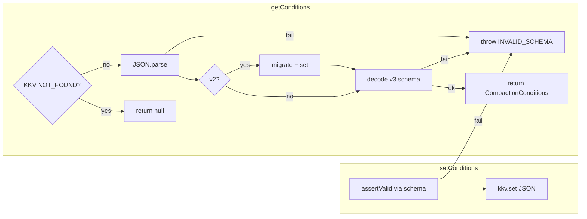

# 压缩条件存储完整性（compaction-conditions-integrity）技术规格（SPEC）

> **PRD**：[prd.md](./prd.md)  
> **CR 基线**：[explore-compaction-conditions.md](./explore-compaction-conditions.md)、[explore-kkv.md](./explore-kkv.md)  
> **现状代码：** `DefaultCompactionConditionsStore`、`compactionConditionsSchema`、`CompactionConditionsError`

## 设计目标

1. **读：** KKV 键存在但 wire 无效 → `CompactionConditionsError("INVALID_SCHEMA")`；键不存在 → `null`。
2. **写：** 任意入口 `setConditions` 必须在持久化前通过 v3 Zod schema（含 `enabled` + trigger 守卫）。
3. **最小 diff：** 仅改 store + 错误辅助 + 测试；不重构 evaluator / CLI / IPC 签名。
4. **与 events-config 对齐：** 读路径 strict decode（参考 `DefaultEventsConfigStore.getConfig`）；写路径校验后再 `JSON.stringify`。

## 现状问题（代码锚点）

| 问题 | 位置 | 现行为 |
|------|------|--------|
| 静默吞错 | `compaction-conditions-store.service.ts:57–58` | `catch { return null }` |
| 无写入校验 | 同文件 `:62–64` | 直接 `kkv.set(JSON.stringify(conditions))` |
| 错误类未用 | `compaction-conditions-errors.ts` | 无 factory / guard；store 不 throw |

## 总体方案



### 语义表

| 场景 | `getConditions()` | `setConditions()` |
|------|-------------------|-------------------|
| 键不存在 | `null` | 校验通过后写入 |
| 合法 v2 | 迁移 → 写回 v3 → 返回 | N/A（set 仅接受 v3 domain） |
| 合法 v3 | decode → 返回 | 校验 → 写入 |
| 非法 JSON / schema | **throw** `INVALID_SCHEMA` | **throw** `INVALID_SCHEMA` |

---

## 文件变更清单

### 1. 错误辅助 — `packages/core/src/errors/compaction-conditions-errors.ts`

**变更：** 增加 factory 与 type guard（对齐 `kkv-errors.ts` 模式）。

```typescript
export function compactionConditionsInvalidSchema(
  message: string,
  details?: Record<string, unknown>,
): CompactionConditionsError {
  return new CompactionConditionsError("INVALID_SCHEMA", message, details);
}

export function isCompactionConditionsError(
  error: unknown,
  code?: CompactionConditionsErrorCode,
): error is CompactionConditionsError {
  if (!(error instanceof CompactionConditionsError)) {
    // duck-type for test dual-load（可选，与 isKkvError 一致）
    if (
      error != null &&
      typeof error === "object" &&
      (error as CompactionConditionsError).name === "CompactionConditionsError"
    ) {
      const c = (error as CompactionConditionsError).code;
      return code == null || c === code;
    }
    return false;
  }
  return code == null || error.code === code;
}
```

**导出：** `packages/core/src/public/compaction.ts` 增加 `isCompactionConditionsError`、`compactionConditionsInvalidSchema` 导出（若仅 store 内部使用，可暂不 public export — **推荐 export**，供 CLI/Desktop 未来细化文案）。

### 2. Store 实现 — `packages/core/src/service/compaction-conditions/impl/compaction-conditions-store.service.ts`

**变更要点：**

1. 删除 `getConditions` 中 blanket `catch { return null }`。
2. 新增私有方法 `parseAndDecode(raw: string): CompactionConditions`：
   - `JSON.parse` → 失败则 `compactionConditionsInvalidSchema("invalid JSON: …")`
   - `isV2Document(parsed)` → `migrateV2ToV3` → **可选** `decode(migrated, compactionConditionsSchema)` 校验迁移产物 → `kkv.set` 写回 → return
   - 否则 `decode(parsed, compactionConditionsSchema)`；捕获 `ConfigDecodeError` 并 rethrow 为 `CompactionConditionsError("INVALID_SCHEMA", err.message)`
3. `setConditions`：
   - 调用 `decode(conditions, compactionConditionsSchema)` 校验（domain 对象即 wire 子集，superRefine 仍生效）
   - 校验通过后 `kkv.set(MODULE, KEY_POLICY, JSON.stringify(validated))`
   - 删除误导注释「Domain object is already validated」

**参考实现 sketch：**

```typescript
import { ConfigDecodeError } from "@/errors/config-decode-errors.js";
import { compactionConditionsInvalidSchema } from "@/errors/compaction-conditions-errors.js";

function rethrowDecodeError(error: unknown): never {
  if (error instanceof ConfigDecodeError && error.code === "INVALID_SCHEMA") {
    throw compactionConditionsInvalidSchema(error.message);
  }
  throw error;
}

private async parseAndDecode(raw: string): Promise<CompactionConditions> {
  let parsed: unknown;
  try {
    parsed = JSON.parse(raw) as unknown;
  } catch (error) {
    throw compactionConditionsInvalidSchema(
      `invalid JSON in nm-compaction-conditions/policy: ${error instanceof Error ? error.message : String(error)}`,
    );
  }
  if (isV2Document(parsed)) {
    const migrated = migrateV2ToV3(parsed);
    let validated: CompactionConditions;
    try {
      validated = decode(migrated, compactionConditionsSchema);
    } catch (error) {
      rethrowDecodeError(error);
    }
    await this.kkv.set(MODULE, KEY_POLICY, JSON.stringify(validated));
    return validated;
  }
  try {
    return decode(parsed, compactionConditionsSchema);
  } catch (error) {
    rethrowDecodeError(error);
  }
}

async getConditions(): Promise<CompactionConditions | null> {
  const raw = await this.getRaw();
  if (raw === undefined) {
    return null;
  }
  return this.parseAndDecode(raw);
}

async setConditions(conditions: CompactionConditions): Promise<void> {
  let validated: CompactionConditions;
  try {
    validated = decode(conditions, compactionConditionsSchema);
  } catch (error) {
    rethrowDecodeError(error);
  }
  await this.kkv.set(MODULE, KEY_POLICY, JSON.stringify(validated));
}
```

**不改动：** `MODULE`/`KEY_POLICY`、`isV2Document`、`migrateV2ToV3`、`clearConditions`、`getRaw`。

### 3. Port — `compaction-conditions-store.port.ts`

**变更：** 无（JSDoc 可选补充：`getConditions` 在 corrupt 时 throw；`null` 仅 NOT_FOUND）。

### 4. Evaluator — `create-compaction-condition-evaluator.ts`

**变更：** **无代码改动**。`getConditions()` throw 将自然传播至 `AgentRunner`；与 PRD fail-fast 一致。

**验证：** 确认 `agent-runner.ts` 未 catch 并吞掉 store 错误（审阅即可）。

### 5. CLI — `apps/cli/src/compaction-conditions/commands.ts`

**变更：** **无必须改动**（`cli-errors.ts` 已识别 `CompactionConditionsError`）。

**可选：** `show` 子命令在 catch `INVALID_SCHEMA` 时 stderr 提示「stored compaction conditions are corrupt; use set --file or clear」（非本 spec 必须）。

### 6. Desktop IPC — `apps/desktop/src/main/ipc/handlers/compaction-conditions.ts`

**变更：** **无**（已有 try/catch → `formatIpcError`）。

### 7. Public API — `packages/core/src/public/compaction.ts`

**变更：** 导出新增 error helpers（若步骤 1 决定 public）。

---

## 测试计划

### 新建 — `packages/core/test/compaction-conditions/compaction-conditions-store.service.test.ts`

使用现有 fixture：`openNovelMasterTestConnection`、`createKkvService`、`createCompactionConditionsStore`。

| 用例 ID | 描述 | 断言 |
|---------|------|------|
| S1 | 空库 `getConditions` | `null` |
| S2 | KKV 写入 `{invalid json` | `getConditions()` throws；`isCompactionConditionsError(e, "INVALID_SCHEMA")` |
| S3 | KKV 写入 `{ "schemaVersion": 3, "enabled": true }` | get throws `INVALID_SCHEMA` |
| S4 | KKV 写入 `{ "schemaVersion": 3, "enabled": false }` | get 返回对象，`enabled === false` |
| S5 | `setConditions({ schemaVersion: 3, enabled: true })` 无 trigger | throws；KKV 仍空或保持原值 |
| S6 | `setConditions` 合法 + `getConditions` round-trip | 字段一致 |
| S7 | v2 迁移（可与现有文件合并或引用） | 不回归 `compaction-conditions-v3-migration.test.ts` |

**实现提示：**

```typescript
import assert from "node:assert/strict";
import { describe, it } from "node:test";
import {
  createCompactionConditionsStore,
  isCompactionConditionsError,
} from "@novel-master/core/compaction";
import { createKkvService } from "../../src/service/kkv/create-kkv-service.js";
import { openNovelMasterTestConnection } from "../helpers/novel-master.js";

const MODULE = "nm-compaction-conditions";
const KEY = "policy";

describe("compaction conditions store integrity", () => {
  // S1–S7 ...
});
```

### 现有测试

| 文件 | 动作 |
|------|------|
| `compaction-conditions-v3-migration.test.ts` | **保持**；迁移路径仍须绿 |
| `token-ratio-trigger.test.ts` | 无改动 |

### 验收命令

```bash
cd packages/core
npm run test:fast
# 或窄范围：
npx node --import tsx --test test/compaction-conditions/*.test.ts
```

---

## 实施步骤

| 步骤 | 任务 | 完成判据 |
|------|------|----------|
| 1 | 扩展 `compaction-conditions-errors.ts`（factory + guard） | 编译通过 |
| 2 | 重构 `DefaultCompactionConditionsStore` 读/写路径 | 本地手动：corrupt KKV throw |
| 3 | 更新 `public/compaction.ts` 导出（若需要） | 导出契约测试无破坏 |
| 4 | 新增 `compaction-conditions-store.service.test.ts` S1–S7 | 新测全绿 |
| 5 | 跑 `test:fast` + 迁移测回归 | 0 failures |
| 6 | 审阅 agent-runner / CLI show 错误传播 | 符合 PRD E1/R2 |

**预估工作量：** 0.5–1 天（含测试）。

---

## 非目标（显式排除）

- 不在本 spec 实现 `assessCompactionConditionsWire`（留给 stored-config-validity 或 Desktop 设置页失效 UI）。
- 不修改 `compactionConditionsSchema` 规则（除非测试暴露迁移产物 edge case，需单独 PR）。
- 不添加 `toWire` / `encode` 到 schema（v3 domain 与 wire 同形，直接 `JSON.stringify(decode(...))` 足够）。

---

## 与 global-compaction-policy 的关系

| global-compaction-policy | 本 feature |
|--------------------------|------------|
| CompactionPolicy 聚合（trigger + action + abstract） | 仅 **conditions** KKV（`nm-compaction-conditions`） |
| 移除 AgentDefinition.compact | 不涉及 |
| CLI `nm compaction` | 现有 `nm compaction-conditions` 不变 |

两者可并行开发；合并时确保 store 校验逻辑不被 policy store 重复实现（未来 policy 若拆分，应复用同一 decode/assert 模式）。

---

**路径：** `.apm/kb/docs/Iterations/core-explore-remediation/features/compaction-conditions-integrity/spec.md`
