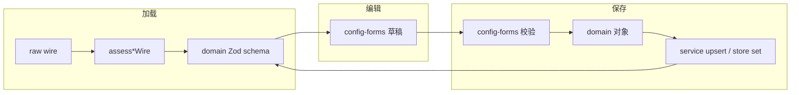
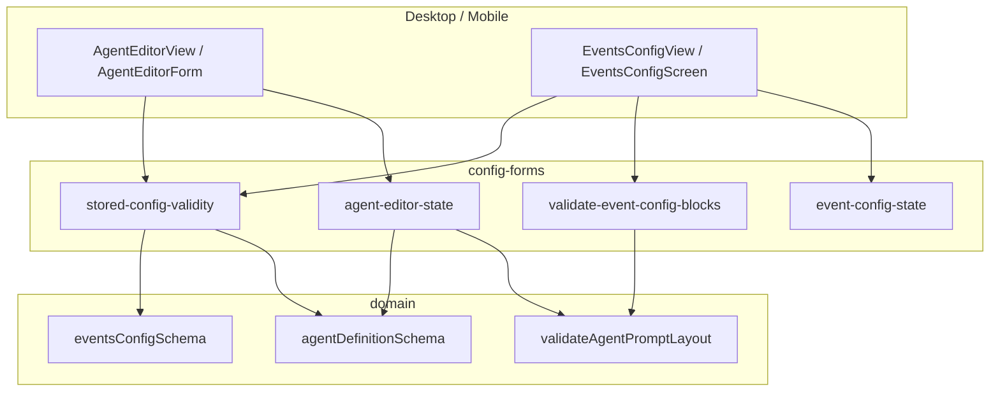

# 代码审查：`config-forms` 模块

**日期：** 2026-06-21  
**范围：** `packages/core/src/config-forms/**`、`packages/core/test/config-forms/**`  
**关联消费者：** `apps/desktop` / `apps/mobile` 设置页 Agent 编辑器、Events 配置、KKV/SQLite 加载路径  
**结论：** 模块职责清晰，表单 ↔ wire ↔ domain 三层边界大体正确；`stored-config-validity` 与 Agent 三区 Prompt 状态机设计成熟。主要风险集中在 **双源校验重复/漂移**、**Events UI 对 depth 的有意裁剪**、以及 **Mobile Agent 编辑器缺少删除前守卫**。

---

## 执行摘要

`config-forms` 是 core 内专供 **Desktop/Mobile 共享表单逻辑** 的薄层：不直接做 I/O，负责 UI 草稿状态、保存前校验、存储 wire 健康度判定，以及中文用户文案。Domain schema（Zod + 纯 logic）仍是 wire 的权威解析器；config-forms 在 UI 边界追加「人类可理解」的规则与归一化。

| 维度 | 评级 | 摘要 |
|------|------|------|
| 与 domain schema 双源校验 | B | Agent 保存路径与 decode 共用 `validateAgentPromptLayout`；Events DAG/depth 在 schema 与 UI 各写一份 |
| UI 数据丢失 | B- | 禁用区域内容保留设计良好；`hide-message` 的 `endDepth` 在 UI 路径被剥离（有意） |
| stored-config-validity | A- | 分类清晰、与 store 集成合理；Agent 无显式 schemaVersion 预检 |
| agent 编辑器状态 | B+ | 三区 layout 状态完整、测试充分；Mobile 删除守卫与 dirty 检测弱于 Desktop |

**优先修复（P1）：**

1. `validate-event-config-blocks.ts` 校验 hide-message 时仅传 `startDepth`，导致 domain 合法的「仅 endDepth」配置在 UI 保存被拒（与 [depth.md](../domain/depth.md) 一致）。
2. Mobile `AgentEditorForm` 未使用 `countEffectiveFormPromptSources` / `hasAnyPromptRegionEnabled` 做删除前守卫，体验与 Desktop 不一致。

**建议改进（P2）：**

3. 抽取共享 `validateEventActionDag`，消除 schema 与 config-forms 的 DAG 逻辑重复。
4. 删除或重导出 `config-forms/events/default-events-config.ts`，统一使用 `domain/events-config/logic/default-events.ts`。
5. `BUILTIN_TOOL_CATALOG` 从 `FILE_TOOL_NAMES` 派生，避免手工同步。
6. `formSnapshotJson` 在 `modelEnabled=false` 时忽略 provider 变更，dirty 检测可能漏报。

---

## 模块结构

```
packages/core/src/config-forms/
├── index.ts                    # 导出 events / agent / shared（不含 stored-config-validity）
├── agent/
│   ├── agent-editor-state.ts   # Agent 表单类型、三区 Prompt、build/definition 互转
│   ├── agent-tool-catalog.ts   # 工具白/黑名单 UI catalog
│   └── allocate-agent-display-name.ts
├── events/
│   ├── event-config-state.ts   # blocks ↔ EventsConfig
│   ├── validate-event-config-blocks.ts
│   ├── event-config-labels.ts
│   ├── default-events-config.ts  # ⚠ 与 domain 默认重复
│   └── event-block-id.ts
├── stored-config-validity/     # wire 健康度（独立 package 子路径）
│   ├── assess-agent-definition-wire.ts
│   ├── assess-events-config-wire.ts
│   ├── build-default-agent-definition.ts
│   ├── labels.ts
│   └── types.ts
└── shared/
    ├── application-model-id.ts
    ├── depth-slice.ts          # 再导出 domain depth logic
    └── ui-labels.ts
```

**公开入口（`package.json` exports）：**

| 子路径 | 用途 |
|--------|------|
| `@novel-master/core/config-forms` | agent + events + shared |
| `@novel-master/core/config-forms/stored-config-validity` | assess / 恢复文案 |
| `@novel-master/core/config-forms/agent` | 编辑器状态 |
| `@novel-master/core/config-forms/events` | 事件块草稿 |

`stored-config-validity` **未**从根 `config-forms/index.ts` 重导出；消费者需显式 import 子路径（Desktop/Mobile 已如此）。

---

## 1. 与 domain schema 的双源校验

### 1.1 设计意图

模块注释与实现体现 **两层校验**：

| 阶段 | Agent | Events |
|------|-------|--------|
| **加载** | `assessAgentDefinitionWire` → `decode(..., agentDefinitionSchema)` | `assessEventsConfigWire` → 版本/V1 形态预检 → `decode(..., eventsConfigSchema)` |
| **编辑** | React state 持有 `AgentEditorFormInput` | `EventBlockDraft[]` |
| **保存前** | `buildAgentDefinitionFromForm` → `validateAgentPromptLayout` | `validateEventConfigBlocks` |
| **持久化** | `AgentRegistryService.upsert` → `validateAgentDefinition`（含 tool 名） | encode + schema（经 store） |



### 1.2 Agent：对齐较好

**保存路径**（`buildAgentDefinitionFromForm`）在组装 `AgentPromptLayout` 后调用 domain 的 `validateAgentPromptLayout`，与 schema decode 内部的 `validateAgentPromptLayoutFromMaps` **规则同源**：

```500:518:packages/core/src/config-forms/agent/agent-editor-state.ts
export function buildAgentDefinitionFromForm(
  input: AgentEditorFormInput,
): { ok: true; definition: AgentDefinition } | { ok: false; message: string } {
  // ...
  const layout = layoutFromFormInput(input);
  let validatedLayout: AgentPromptLayout;
  try {
    validatedLayout = validateAgentPromptLayout(layout);
  } catch (error) {
    if (error instanceof PromptError) {
      return { ok: false, message: error.message };
    }
    throw error;
  }
```

**表单层额外规则**（schema 不覆盖）：

- 名称非空（`请填写 Agent 名称`）
- 任一 Prompt 区域开启时，至少一个有效来源（`至少保留一个 Prompt 块`）——由 `hasAnyPromptRegionEnabled` + `hasEffectivePromptSource` 实现

**工具策略**：`buildToolsPolicyFromSelection` 仅组装结构；**不在 config-forms 校验工具名**。`validateAgentToolPolicy` 推迟到 `upsert`（Desktop IPC / Mobile runtime 均注入 `registeredToolNames`）。这是合理的 **边界分层**，但意味着 UI 可选 catalog 外的名字，保存时才报错。

**加载路径**：`assessAgentDefinitionWire` 完全委托 `agentDefinitionSchema`，legacy key 通过 `AgentConfigError INVALID_SCHEMA` 映射为 `removed_feature`。

#### 发现 A1 — `INVALID_SCHEMA` 一律视为 `removed_feature`

```21:27:packages/core/src/config-forms/stored-config-validity/assess-agent-definition-wire.ts
function isRemovedFeatureError(error: unknown): boolean {
  if (error instanceof AgentConfigError && error.code === "INVALID_SCHEMA") {
    return true;
  }
  // ...
}
```

当前 decode 路径里 `INVALID_SCHEMA` 仅由 legacy 字段抛出，行为正确。若未来在 schema 层复用同 code 表示其他结构错误，UI 会误显示「已移除字段」而非「格式损坏」。**建议：** 为 legacy 使用专用 error code，或收窄 keyword 匹配（与 events 的 `isRemovedFeatureMessage` 类似）。

#### 发现 A2 — `CURRENT_AGENT_SCHEMA_VERSION` 未参与 assess

`types.ts` 定义了 `CURRENT_AGENT_SCHEMA_VERSION = 1`，但 `assessAgentDefinitionWire` 不做显式版本预检（依赖 Zod `z.literal(1)`）。Events 侧则有清晰的 `outdated_version` 分支。**一致性建议：** Agent assess 可增加与 Events 对称的版本分支，便于 UI 展示 `storedSchemaVersion`（当前 Agent invalid 结果无此字段）。

### 1.3 Events：重复与缺口

#### 发现 A3 — DAG 校验双份实现

| 位置 | 函数 | 差异 |
|------|------|------|
| `domain/events-config/model/events-config.schema.ts` | `validateDag` | 无「自依赖」专用文案；环检测用 Kahn |
| `config-forms/events/validate-event-config-blocks.ts` | `validateDag` | 额外检测 `dep === a.type`；中文错误信息 |

两者算法等价，但 **任何 DAG 规则变更需改两处**。建议抽到 `domain/events-config/logic/validate-event-action-dag.ts`，schema 与 config-forms 共用。

#### 发现 A4 — hide-message depth：UI 校验窄于 schema（P1）

Domain `validateDepthSlice` 接受「仅 `startDepth`」「仅 `endDepth`」或两者兼有。Schema decode 完整保留两者。

UI 校验仅转发 `startDepth`：

```102:109:packages/core/src/config-forms/events/validate-event-config-blocks.ts
      try {
        validateDepthSlice({
          startDepth: action.params.startDepth ?? undefined,
        });
      } catch (e: unknown) {
```

**影响：** 用户通过 YAML/CLI 写入 `{ endDepth: 2 }` 的 hide-message，加载后在 UI 保存会被拒；且 `normalizeHideMessageAction` 会在 round-trip 中丢弃 `endDepth`（见 §2）。与 [depth.md](../domain/depth.md) P1 一致。

**修复：** 校验时传入完整 `action.params`（至少 `startDepth` / `endDepth` 两字段）；若产品确认 UI 永不编辑 `endDepth`，则 assess 加载时对仅含 `endDepth` 的 wire 打 `removed_feature` 或只读展示，避免 silent loss。

#### 发现 A5 — 事件数量：UI 严于 schema

- `validateEventConfigBlocks`：`blocks.length === 0` → 失败
- `eventsConfigDocumentSchema`：`events: z.record(...)` 允许 `{}`

UI 强制至少一个事件块是合理的产品约束，但与 schema 不一致。经 UI 保存的配置一定 ≥1 事件；直接写 KKV 的空 events 对象 assess 仍为 valid。

#### 发现 A6 — `validateEventConfigBlocks` 不调用 `eventsConfigSchema`

保存流程（Desktop `EventsConfigView` / Mobile `EventsConfigScreen`）：

1. `validateEventConfigBlocks(blocks)` — 用户可读中文
2. `eventBlocksToConfig` → IPC/store → encode + schema

若 UI 校验通过但 schema 失败（理论上少见），错误会在 store 层暴露而非表单层。当前 action 类型集合与 schema 同步，风险低。可加 **集成测试**：`eventBlocksToConfig` 输出经 `decode(..., eventsConfigSchema)` 必过。

### 1.4 双源校验对照表

| 规则 | Domain schema | config-forms | 一致？ |
|------|---------------|--------------|--------|
| Agent persist 禁宏 | ✓ | ✓（经 validateAgentPromptLayout） | ✓ |
| persistEnabled 末块须 assistant | ✓ | ✓ | ✓ |
| dynamicEnabled ≥2 块 + 首 assistant 末 user | ✓ | ✓ | ✓ |
| Agent tools 名在注册表 | upsert 时 | ✗（表单不验） | 分层 |
| Events 每 event 动作 ≥1 | ✓ min(1) | ✓ | ✓ |
| Events DAG 无环 | ✓ | ✓ | 重复实现 |
| hide-message depth | 完整 DepthSlice | 仅 startDepth | **✗** |
| Events 至少 1 个 event | ✗ | ✓ | UI 更严 |

---

## 2. UI 数据丢失

### 2.1 有意保留（设计正确）

**禁用区域不删内容：** `layoutFromFormInput` 在 `persistEnabled` / `dynamicEnabled` 为 false 时 **省略 wire 布尔**，但仍写入 `persist` / `dynamic` 数组。文案 `PROMPT_REGION_LABELS.persistDisabledHint` 明确告知用户。测试覆盖「开关关时省略 wire 布尔」「内容仍保留」。

**worktree 块 wire 名归一：** `normalizePersistBlock` 将任意 worktree 块名改为 `canon`，避免 UI 暴露 wire 槽位名；属展示层归一，非静默丢字段。

### 2.2 有意丢失（需产品确认 + 测试）

#### 发现 L1 — `endDepth` 在 Events UI 路径被剥离

```12:18:packages/core/src/config-forms/events/event-config-state.ts
/** 事件配置 UI 仅编辑 startDepth；加载/保存时丢弃 endDepth。 */
export function normalizeHideMessageAction(action: EventActionNode): EventActionNode {
  if (action.type !== "hide-message") {
    return action;
  }
  const { endDepth: _end, ...params } = action.params;
  return { ...action, params };
}
```

`configToEventBlocks` 与 `eventBlocksToConfig` 均调用此函数。Desktop/Mobile 事件编辑器 **仅提供 startDepth 输入**（`REGEX_UI_LABELS.startDepth`），与注释一致。

**风险：** 高级用户手动编辑 wire 后，在 UI 打开并保存会 **无警告** 丢失 `endDepth`。Runtime/orchestrator 仍支持完整 slice。

**建议：**

- 加单测：`configToEventBlocks` → 编辑 startDepth → `eventBlocksToConfig` 断言 `endDepth` 已失
- 或在 UI 加载时检测 `endDepth != null`，显示只读提示 / 禁用保存

#### 发现 L2 — `eventBlocksToConfig` 静默跳过空 eventType

```40:46:packages/core/src/config-forms/events/event-config-state.ts
  for (const block of blocks) {
    const key = block.eventType.trim();
    if (key === "") {
      continue;
    }
    events[key] = block.actions.map(normalizeHideMessageAction);
  }
```

`validateEventConfigBlocks` 在保存前拦截空类型；若 UI 绕过校验直接调用 `eventBlocksToConfig`，对应块 **静默消失**。当前 apps 均先校验，风险低。

#### 发现 L3 — 重复 eventType 键后者覆盖

同一 `events` record 中重复 key 时，后者覆盖前者。UI 校验禁止重复 eventType；绕过校验则丢数据。

### 2.3 Agent 表单边界

#### 发现 L4 — `formSnapshotJson` dirty 检测漏字段

```477:490:packages/core/src/config-forms/agent/agent-editor-state.ts
export function formSnapshotJson(input: AgentEditorFormInput): string {
  return JSON.stringify({
    // ...
    ...(input.modelEnabled
      ? { providerId: input.providerId, vendorModelId: input.vendorModelId }
      : {}),
```

`modelEnabled=false` 时修改 `providerId` / `vendorModelId` **不会**改变 snapshot，底部「未保存」状态可能不准确。专属模型关闭后这些字段本不参与 wire，属边缘 UX 问题。

#### 发现 L5 — `maxSteps` 空字符串不写 runtime

`Number("")` → `0`，不满足 `> 0`，故 omit `runtime.maxSteps`。UI 默认展示 20，wire 可能无该字段；与 `buildDefaultAgentDefinitionPreservingName` 显式 `{ maxSteps: 20 }` 行为略不一致，但 runtime 层通常有默认值。

#### 发现 L6 — block id 每次加载重新生成（Events）

`configToEventBlocks` 对每个 event 调用 `newEventBlockId()`。不影响持久化数据，但若 UI 用 block `id` 作 React key 以外的持久化标识，reload 后 identity 变化。当前仅作 UI key，可接受。

---

## 3. stored-config-validity

### 3.1 类型与文案

```8:22:packages/core/src/config-forms/stored-config-validity/types.ts
export type StoredConfigInvalidCode =
  | "outdated_version"
  | "broken_wire"
  | "removed_feature";

export type StoredConfigHealth<T> =
  | { readonly status: "valid"; readonly value: T }
  | {
      readonly status: "invalid";
      readonly code: StoredConfigInvalidCode;
      readonly message: string;
      readonly storedSchemaVersion?: number;
    };
```

`labels.ts` 提供统一中文：`配置已失效`、`配置版本过旧`、`配置含已移除的字段或动作`、`配置格式损坏`，以及恢复 CTA（Events 恢复默认 / Agent 覆盖模板 / 删除）。

### 3.2 Events assess 流程

`assessEventsConfigWire` 分层清晰：

1. 非 object → `broken_wire`
2. `schemaVersion !== 2` → `outdated_version`（带 `storedSchemaVersion`）
3. V1 `parallel`/`sequential` 形态 → `outdated_version`
4. `decode` + schema；`refresh-macros` / unknown action → `removed_feature`

**不做自动迁移**，由 UI 引导用户「恢复默认并保存」——与 [events-config.md](../domain/events-config.md) 一致。

### 3.3 Agent assess 流程

单一路径：`decode(raw, agentDefinitionSchema)`。Legacy 检测依赖 schema 内 `rejectLegacyPromptKeys` / `assertNoLegacyAgentFields` + 上述 `isRemovedFeatureError` 映射。

### 3.4 恢复辅助

`buildDefaultAgentDefinitionPreservingName` 复用 `createDefaultAgentEditorPrompts` + `layoutFromFormInput`，与「新建空白 Agent」prompt 默认值一致，并固定 `runtime.maxSteps: 20`。测试验证 encode/decode 往返。

### 3.5 集成

| 消费者 | 用法 |
|--------|------|
| `DefaultEventsConfigStore.assessStored` | 委托 `assessEventsConfigWire` |
| `SqliteAgentDefinitionRepository.getRawWire` + UI | 先 assess 再 `definitionToForm` |
| Desktop/Mobile 失效面板 | `STORED_CONFIG_LABELS` / `storedConfigInvalidReason` |

`stored-config-validity.test.ts` 含 T-E1–E4、T-A1–A3 及 store/repository 集成用例（需 `npm run build` 后通过 `tsconfig.test.json` 运行）。

### 3.6 发现

| ID | 严重度 | 说明 |
|----|--------|------|
| S1 | 低 | `config-forms/events/default-events-config.ts` 与 `domain/.../default-events.ts` 完全重复；apps 从 `@novel-master/core/events` 引 domain 版，config-forms 版 **无引用** |
| S2 | 低 | `CURRENT_AGENT_SCHEMA_VERSION` 常量 dead code |
| S3 | 信息 | Agent invalid 无 `storedSchemaVersion` 字段，Events 有——列表 UI  asymmetry |

---

## 4. Agent 编辑器状态

### 4.1 核心类型与数据流

```38:53:packages/core/src/config-forms/agent/agent-editor-state.ts
export type AgentEditorFormInput = {
  name: string;
  maxSteps: string;
  modelEnabled: boolean;
  providerId: string;
  vendorModelId: string;
  toolsMode: ToolsMode;
  toolsSelected: readonly string[];
  systemEnabled: boolean;
  systemContent: string;
  persistEnabled: boolean;
  dynamicEnabled: boolean;
  persist: readonly PersistPromptBlock[];
  dynamic: readonly DynamicPromptBlock[];
};
```

**互转 API：**

| 函数 | 方向 |
|------|------|
| `definitionToForm` | `AgentDefinition` → Prompt 相关字段 + 开关 |
| `layoutFromFormInput` | 表单 → `AgentPromptLayout` |
| `buildAgentDefinitionFromForm` | 完整表单 → 校验后的 `AgentDefinition` |
| `formSnapshotJson` | dirty 检测 |
| `toolsSelectionFromDefinition` / `buildToolsPolicyFromSelection` | 工具策略 |

Persist 区采用 **有序数组**（非 wire map），通过 `splitPersistBlocksForEditor` / `movePersistBlock` / `mapPersistTextBlocks` 等保持 worktree 与 text 混排顺序；与 domain 数组模型一致。

### 4.2 Prompt 来源计数器

模块提供三个相似函数，用途不同：

| 函数 | 用途 |
|------|------|
| `countEffectiveFormPromptSources` | 尊重区域开关；用于「区域开启时至少一个来源」 |
| `countFormPromptSources` | 不计开关，含 worktree；用于细粒度删除模拟 |
| `countMinimumPromptSources` | 仅 system + dynamic；允许 persist 全空场景 |

Desktop `AgentEditorView` 使用 `guardPromptBlockDeletion` + `countEffectiveFormPromptSources`：

```432:446:apps/desktop/renderer/features/settings/AgentEditorView.tsx
  const guardPromptBlockDeletion = (
    nextForm: ReturnType<typeof promptRegionForm>,
    proceed: () => void,
  ) => {
    if (!hasAnyPromptRegionEnabled(promptRegionForm())) {
      proceed();
      return;
    }
    if (countEffectiveFormPromptSources(nextForm) < 1) {
      showToast("至少保留一个 Prompt 块");
      return;
    }
    proceed();
  };
```

#### 发现 E1 — Mobile 缺少删除前守卫（P1 体验）

`apps/mobile/src/components/agent/AgentEditorForm.tsx` 的 `deletePersist` / `deleteDynamic` **直接修改 state**，无 `guardPromptBlockDeletion`。用户可在区域开启时删光有效块，直到 `buildAgentDefinitionFromForm` 保存失败才得知。config-forms 已导出所需函数，Mobile 应对齐 Desktop。

### 4.3 Dynamic lifecycle UI 映射

`isDynamicBlockPersistent` / `withDynamicBlockPersistence` 将 UI「常驻」开关映射为 `lifecycle: undefined`（always）vs `"once"`，与 schema 省略 always 的 wire 约定一致。测试覆盖 round-trip。

### 4.4 工具 Catalog

`BUILTIN_TOOL_CATALOG` 注释要求与 `FILE_TOOL_NAMES + chat_grep` 手动同步。`domain/agent/logic/validate-agent-tool-policy.ts` 使用 `FILE_TOOL_NAMES` 作为权威列表。**漂移风险：** 新增内置工具时仅改 vfs-tools 会导致 UI 不可选但 validate 通过（deny 模式）或相反。

**建议：** `export const BUILTIN_TOOL_CATALOG = FILE_TOOL_NAMES.map(...)` 加静态 label/description 表。

### 4.5 其他

- `joinPersistBlocksForLayout` 双 overload 中，旧 API 强制 worktree 在末尾；已 `@deprecated`，新代码应传完整有序数组。
- `parseToolsList` / `buildToolsPolicy` 保留供 YAML 导入；主路径用 `toolsSelected: string[]`。
- `allocateAgentDisplayName`：独立、纯函数，测试覆盖 trim / 占号跳过，无问题。

---

## 5. 测试覆盖

| 文件 | 约测什么 | 缺口 |
|------|----------|------|
| `agent-editor-state.test.ts` | 三区 layout、工具策略、build/definition、宏拒绝、混排 persist | 无 `formSnapshotJson` model 关闭边界 |
| `event-config-state.test.ts` | blocks ↔ config、空 eventType 跳过 | **无 `endDepth` 剥离** |
| `validate-event-config-blocks.test.ts` | 重复 event/action、DAG、依赖 | **无 depth 仅 endDepth** |
| `stored-config-validity.test.ts` | v1/v2 wire、legacy、默认恢复、store 集成 | Agent 非 legacy 的 broken_wire 样例少 |
| `ui-labels.test.ts` | 中文文案、导出入口 | — |
| `allocate-agent-display-name.test.ts` | 占号算法 | — |

**重复：** `apps/mobile/__tests__/validate-event-config-blocks.test.ts` 与 core 测试几乎相同，变更时需双处更新。

**运行：** 测试 import 编译后的 `.js` 路径，需先在 `packages/core` 执行 `npm run build`，再通过 `tsconfig.test.json` 跑 test runner。

---

## 6. 架构图（消费者）



---

## 7. 建议优先级汇总

| 优先级 | 项 | 文件/位置 |
|--------|-----|-----------|
| **P1** | hide-message 校验传入完整 DepthSlice | `validate-event-config-blocks.ts` |
| **P1** | Mobile Agent 删除 Prompt 块前守卫 | `AgentEditorForm.tsx`（用现有 config-forms API） |
| **P2** | 抽取共享 event DAG 校验 | 新 domain logic + schema + config-forms |
| **P2** | 删除重复 `DEFAULT_EVENTS_CONFIG` | `config-forms/events/default-events-config.ts` |
| **P2** | Catalog 从 `FILE_TOOL_NAMES` 派生 | `agent-tool-catalog.ts` |
| **P2** | `normalizeHideMessageAction` 丢 endDepth 单测 + 加载提示 | `event-config-state.ts` + tests |
| **P3** | 收窄 Agent `removed_feature` 判定 | `assess-agent-definition-wire.ts` |
| **P3** | Agent assess 显式 schemaVersion 分支 | `assess-agent-definition-wire.ts` |
| **P3** | `formSnapshotJson` 在 model 关闭时仍跟踪 provider 变更 | `agent-editor-state.ts` |
| **P3** | 根 index 可选重导出 stored-config-validity | `config-forms/index.ts` |

---

## 8. 结论

`config-forms` 成功将 **共享表单逻辑** 留在 core，避免 Desktop/Mobile 分叉；Agent Prompt 三区与 `validateAgentPromptLayout` 的衔接是模块最佳实践。`stored-config-validity` 小、可测、用户文案统一。

主要技术债在 **Events 路径**：DAG/depth 与 domain 的重复与窄化校验，以及 **Mobile Agent 编辑器未完全采用 config-forms 已提供的删除守卫**。按上表 P1 两项修复后，双源校验与 UI 数据一致性可显著提升，且改动面集中在 config-forms 与 Mobile 一层 UI glue。
