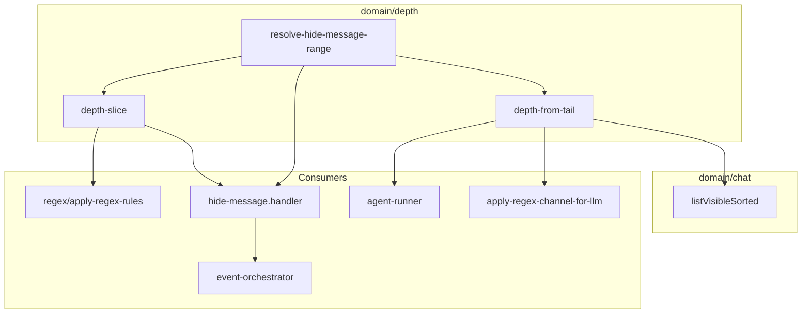

# Depth 域 — 代码审查

**范围：** `packages/core/src/domain/depth/**`、`packages/core/test/depth/**`，以及 `packages/core` 中与 depth 相关的 service/bootstrap 集成。

**审查日期：** 2026-06-21  
**结论：** depth 域本身小而纯、拆分良好。核心 slice/匹配逻辑可靠，有单元测试覆盖。集成大体干净，但一个 handler 集成测试已损坏，一个 config-form 校验器丢弃 `endDepth`，且 `hide-message.handler.ts` 存在工作树格式回归。

---

## 概述

**depth** 域对**可见聊天消息的尾部索引**建模：最新可见消息 depth 为 `0`，更旧消息 depth 递增。支持三方面：

| 模块 | 职责 |
|--------|----------------|
| `depth-from-tail.ts` | 可见消息 → 尾部 depth；过滤隐藏消息 |
| `depth-slice.ts` | 解析、校验、匹配 depth 区间（`startDepth` / `endDepth`） |
| `resolve-hide-message-range.ts` | 将开放式 hide slice 转换为以 assistant 消息为锚的 seq 范围 |

**消费者：**

- **Regex 管道** — 将规则限定到 depth slice（`apply-regex-rules.ts`、`apply-regex-channel-for-llm.ts`、`agent-runner.ts`）
- **事件压缩** — 经 `hide-message.handler.ts` + `event-orchestrator.service.ts` 的 `hide-message` action
- **配置摄入** — `events-config.schema.ts`、`regex-rule.schema.ts`、`config-forms/shared/depth-slice.ts`
- **Public API** — 从 `public/compaction.ts` 再导出

**规模：** 3 个 logic 文件（约 150 LOC）、2 个测试文件（10 个通过的单元测试）、无 model/repository（对纯 logic 子域合适）。

---

## 架构与 DDD

### 优点

- **纯 logic，零 I/O。** 三个模块均为无副作用函数——正确置于 `domain/depth/logic/`。
- **清晰的限界上下文。** Depth 是 regex 与 compression 复用的横切*值概念*；抽离后避免在这些域重复尾部索引数学。
- **边缘薄适配器。** `listVisibleForDepth` 委托给 `domain/chat/logic/message-visible-floor.ts` 的 `listVisibleSorted`，可见性过滤留在 chat 域，depth 拥有索引语义。
- **Service 层仅编排。** `runHideMessageAction` 加载消息、调用 domain 函数，再将持久化委托给 `MessageTranscriptEffectsService` — 分离良好。
- **类型别名复用。** events-config 中 `HideMessageActionParams extends DepthSlice` 使 wire/domain 形状对齐。

### 观察

- **无 `domain/depth/model/` 层。** 当前可接受 — `DepthSlice` 与 `HideMessageSeqRange` 是与 logic 共置的简单 readonly 接口。若 depth 扩展（如 preset、命名范围），提升到 `model/`。
- **无 barrel `index.ts`。** 与本仓库其他精简域一致；import 使用显式 `.js` 路径。
- **与 assistant 角色的语义耦合** 在 `resolve-hide-message-range.ts`，不在通用 slice logic。划分正确：slice 匹配通用；hide compression 增加 transcript 策略。
- **Wire 双命名**（`startDepth` / `start-depth`）在 `depthSliceFromWire` 集中处理，events 与 regex 配置的 Zod schema 镜像两种形式。

### 集成映射



---

## 代码风格

### 与仓库约定一致

- 每个文件有 `@module` JSDoc 标签
- `@/` 路径别名、显式 `.js` 扩展
- 接口与参数使用 `readonly`
- 小命名导出（函数足够时不用 class）
- 错误消息为 plain `Error` 字符串（与邻近域一致）

### 不一致之处

| 问题 | 位置 | 严重度 |
|-------|----------|----------|
| **中英注释混用** | `resolve-hide-message-range.ts`（中文）、`depth-from-tail.ts` / `depth-slice.ts`（英文） | 低 — 混合团队可读性 |
| **重复的 depth 公式** | `messageIdsInSlice` 内联 `n - 1 - i` 而非调用 `depthFromTailIndex` | 低 — DRY |
| **误导性 helper 名** | `listVisibleForDepth` 包装仅 filter 的 `listVisibleSorted`；名称暗示排序 | 低 — 文档问题 |
| **格式回归** | `hide-message.handler.ts` 工作树每行源码间有空行（CRLF 噪音） | 中 — 影响 diff/审查 |

depth 公式重复示例：

```61:61:packages/core/src/domain/depth/logic/depth-slice.ts
    const depth = n - 1 - i;
```

对比：

```11:13:packages/core/src/domain/depth/logic/depth-from-tail.ts
export function depthFromTailIndex(visibleCount: number, indexFromOldest: number): number {
  return visibleCount - 1 - indexFromOldest;
}
```

---

## 可维护性

### 良好

- **Slice 语义单一来源** — `matchDepth`、`validateDepthSlice`、`depthSliceFromWire` 集中 regex、events、config forms 使用的区间逻辑。
- **表面极小** — 易隔离理解与测试。
- **`public/compaction.ts` 的 public 再导出** 为外部包提供稳定 API，无需深入内部路径。
- **Config-forms 再导出**（`config-forms/shared/depth-slice.ts`）避免 forms 包重复校验。

### 缺口

1. **`depth-from-tail.ts` 无直接测试** — `depthFromTailIndex`、`depthByMessageId`、`listVisibleForDepth` 仅经 `resolve-hide-message-range` 测试间接覆盖。
2. **`depthSliceFromWire` 无测试** — kebab/camel 解析与非数字拒绝在单元级未测（schema 集成在其他处部分覆盖）。
3. **`validateDepthSlice` 覆盖薄** — 仅测空 slice；`start > end`、负值、非整数未测。
4. **双边界缺失时 `matchDepth` 可能静默匹配全部** — 当前安全因调用方先校验，但函数本身宽松（应文档化或内部 assert）。
5. **锚点解析算法 O(n log n)** — `[...depths.entries()].sort(...)` 加重复 `visible.find` 对聊天规模 n 可接受，但对 `visible` 单次前向扫描更简单。

### Service 层测试漂移

`test/events/hide-message.handler.test.ts` **与 handler 签名不同步**，运行时失败：

```
TypeError: Cannot read properties of undefined (reading 'hideMessagesInRange')
```

测试问题：

- 将 `chatSession`（`ChatAgentSession`）作为 `projectId` 传入，而非 project id 字符串
- 缺少必需的 `messageTranscriptEffects` 依赖
- 重复 `test/depth/resolve-hide-message-range.test.ts` 已覆盖的 domain 级断言，未增加持久化覆盖

Orchestrator 路径（`event-orchestrator.service.ts`）正确装配两个依赖；handler 测试未做到。

---

## 正确性

### 已验证行为（单元测试通过）

已运行：

```text
npx tsx ... --test test/depth/depth-slice.test.ts test/depth/resolve-hide-message-range.test.ts
# 10/10 pass
```

**尾部索引语义**（最新 = 0）：

- 10 条消息上 `{ startDepth: 6 }` → depth 6–9 的 id（最旧四条）✓
- `{ endDepth: 2 }` → depth 0–2 的 id（最新三条）✓
- `{ startDepth: 0 }` → 全部可见消息 ✓
- 有界 slice `{ startDepth: 2, endDepth: 4 }` → 闭区间 ✓

**Hide 范围解析：**

- 开放式 `{ startDepth: N }` 且 depth N 有 assistant → `fromSeq = anchor.seq`，`toSeq = 匹配最大 seq` ✓
- depth N 为 user → 向更旧消息前推到 depth ≥ N 的首个 assistant ✓
- 范围内无 assistant → `null`（不 hide）✓
- 有界 slice → 匹配 id 的 `minSeq..maxSeq`，忽略角色 ✓

### 前置条件（隐式，大多满足）

| 前置条件 | 是否强制 | 说明 |
|--------------|-----------|-------|
| 可见消息按 `seq` 升序 | 有文档，代码未强制 | SQLite repo 中 `listBySession` 使用 `ORDER BY seq ASC` — 生产路径安全 |
| Depth 在**仅可见** transcript 上计算 | 是 | 索引前排除隐藏消息 — regex 与 hide 一致 |
| 至少一个 slice 边界 | `validateDepthSlice` | 在 `messageIdsInSlice` 与 config 解析器中调用 |

### 正确性风险

#### P0 — Handler 集成测试损坏

`test/events/hide-message.handler.test.ts` 未构造有效 handler 输入。包含此文件的 CI 会失败；测试对 handler + 持久化路径给出虚假信心。

#### P1 — Config form 校验器丢弃 `endDepth`

```103:105:packages/core/src/config-forms/events/validate-event-config-blocks.ts
        validateDepthSlice({
          startDepth: action.params.startDepth ?? undefined,
        });
```

仅转发 `startDepth`。仅含 `endDepth` 的 hide-message 配置（domain 规则有效且测试覆盖）会错误失败，提示 *"depth slice requires at least startDepth or endDepth"*。

修复模式（与其他调用点一致）：

```typescript
validateDepthSlice({
  startDepth: action.params.startDepth ?? undefined,
  endDepth: action.params.endDepth ?? undefined,
});
```

#### P1 — `listAllSessionMessages` 未设置时 agent runner regex 回退

在 `applyLlmRegexChannelToVisible` 中，回退路径从 `listVisibleForDepth(visible)` 构建 depth，其中 `visible` 已是 session 可见子集。当 `visible === listVisibleForDepth(all)` 时**等价**，对 `ChatAgentSession.list()` 成立。若未来调用方传入重排或严格子集，depth map 可能与 `applyRegexChannelForLlm` 全 session 路径不同步。今日概率低；值得一行契约注释或 assert 等长/等序。

#### P2 — `depthSliceFromWire` 类型强制

仅接受 `typeof x === "number"`。JSON/YAML 管道将 `"3"` 强制为 string 会静默产生空 slice 并 opaque 失败校验。上游 Zod schema 对主摄入路径可捕获；`depthSliceFromWire` 的直接调用方应知晓。

#### P2 — 未校验时使用 `matchDepth`

双边界缺失时 `matchDepth` 将范围视为 `[0, ∞)`。生产路径调用方总会校验，但 helper 对新代码易踩坑。

---

## 积极模式

1. **开/闭 slice API** — 仅 `start`、仅 `end` 或两者兼有，闭区间与合理默认（`start → 0`，`end → ∞`）与 compression/regex 产品语义契合。

2. **`resolveHideMessageRange` 中的策略隔离** — 通用 slicing 留在 `depth-slice.ts`；开放式 hide 的 assistant 锚定隔离且测试用中文 case 标题说明业务意图。

3. **Regex 的 Map 式 depth 查找** — `depthByMessageId` + `applyRegexChannelToMessages` 将 O(n) 索引与 O(n) 规则应用解耦；无 depth 项的消息原样通过。

4. **共享可见性原语** — 复用 `listVisibleSorted` 使 depth 索引与 compression trigger、LLM 导出可见性规则对齐。

5. **Wire 兼容** — 单一解析器处理 kebab/camel 双字段名，YAML 编写友好，各调用点无需分支。

6. **精简 public 表面** — `public/compaction.ts` 精确导出下游所需，隐藏内部模块布局。

---

## 建议

### P0 — 修复或重写 `hide-message.handler` 集成测试

**文件：** `packages/core/test/events/hide-message.handler.test.ts`

- 传入真实 `projectId`、`sessionId` 字符串
- 提供 `messageTranscriptEffects`（用 fixture context 的 `DefaultMessageTranscriptEffectsService`，或 `event-orchestrator.dag.test.ts` 式 stub）
- 经 `messages.listBySession` + `hidden` 标志断言后置条件（测试已循环此方式 — 正确装配依赖）
- 若 handler 测试无持久化特有行为，可选合并与 `resolve-hide-message-range.test.ts` 的重叠

**验收：** `npx tsx ... --test test/events/hide-message.handler.test.ts` 通过。

---

### P1 — 修复 config forms 中仅 `endDepth` 的校验

**文件：** `packages/core/src/config-forms/events/validate-event-config-blocks.ts`

将双边界转发给 `validateDepthSlice`（见正确性章节）。

**验收：** 表单校验接受 `{ endDepth: 2 }` hide-message action；仍拒绝空 slice。

---

### P1 — 扩展 domain 单元测试覆盖

**文件：** `packages/core/test/depth/`

添加用例：

| 目标 | 用例 |
|--------|-------|
| `depthFromTailIndex` / `depthByMessageId` | 单消息、空列表、稳定 map 键 |
| `depthSliceFromWire` | kebab 键、camel 键、忽略非数字 |
| `validateDepthSlice` | `start > end`、负值、非整数、仅 `endDepth` |
| `resolveHideMessageRange` | 空 `messageIds`、锚 assistant 在精确 `startDepth` vs 回退 |

测试与现有 `test/depth/` 结构共置。

---

### P1 — 还原 `hide-message.handler.ts` 格式噪音

**文件：** `packages/core/src/service/events/impl/actions/hide-message.handler.ts`

工作树 diff 在每行间引入空行并破坏末尾换行规范。合并前恢复常规格式。

---

### P2 — `messageIdsInSlice` 中 DRY depth 索引

将内联 `n - 1 - i` 替换为 `depthFromTailIndex(n, i)`，索引规则变更时防漂移。

---

### P2 — 澄清 `listVisibleForDepth` 契约

任选：

- 重命名为 `filterVisibleForDepth` / 文档化 *"输入必须是 seq 有序的全 session 列表"*，或
- 若团队偏好 belt-and-suspenders，增加防御性 `sort((a,b) => a.seq - b.seq)`（略增成本，更高健壮性）

JSDoc 与 `message-visible-floor.ts` 中 `listVisibleSorted` 对齐。

---

### P2 — 统一 `resolve-hide-message-range.ts` 注释语言

将模块/函数文档译为英文（或加英文摘要行），与 sibling depth 模块一致，业务规则注释可保留以辅助 compression 作者。

---

### P2 — 为产品作者文档化开放式 hide 语义

在 `resolveHideMessageRange` 附近添加短注释块或外部文档链接，说明：

- 开放式 `{ startDepth: N }` 从 depth N 及之后的**锚定 assistant** 隐藏至 slice 尾部
- 范围内 user 消息一并隐藏（seq 范围，非 per-id）
- 有界 slice 使用字面 min/max seq，无 assistant 锚定

该逻辑不直观，目前仅编码于测试中。

---

## 附录 — 文件清单

| 路径 | 职责 |
|------|------|
| `src/domain/depth/logic/depth-from-tail.ts` | 尾部 depth 索引 + 可见列表 helper |
| `src/domain/depth/logic/depth-slice.ts` | Slice 类型、match、validate、wire 解析、id 选择 |
| `src/domain/depth/logic/resolve-hide-message-range.ts` | Hide-message seq 范围 + assistant 锚 |
| `test/depth/depth-slice.test.ts` | Slice match/validate 测试（6） |
| `test/depth/resolve-hide-message-range.test.ts` | Hide 范围测试（4） |
| `src/service/events/impl/actions/hide-message.handler.ts` | hide-message 编排 |
| `src/service/events/impl/event-orchestrator.service.ts` | 将 handler 接入 event bus |
| `src/service/prompt/apply-regex-channel-for-llm.ts` | LLM regex channel 的 depth map |
| `src/service/agent/impl/agent-runner.ts` | 运行中 regex 的 depth map（回退路径） |
| `src/public/compaction.ts` | Public 导出 |
| `src/bootstrap/regex/regex-schema.ts` | `start_depth` / `end_depth` 列（仅存储） |

**相关但严格范围外：** `config-forms/events/validate-event-config-blocks.ts`（校验 bug）、`test/events/hide-message.handler.test.ts`（损坏的集成测试）。
