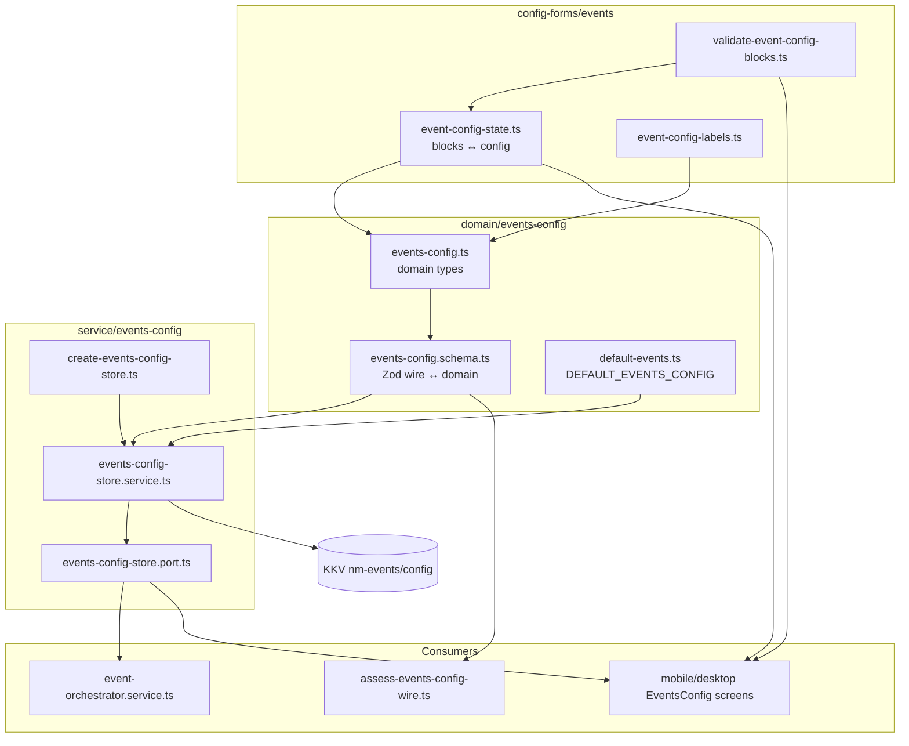

# 代码审查：`events-config` 域

**日期：** 2026-06-21  
**范围：** `packages/core/src/domain/events-config/**`、`packages/core/src/service/events-config/**`、`packages/core/src/config-forms/events/**`，以及 `packages/core/test/**/event*config*` 下相关测试  
**结论：** Domain/service 拆分扎实，wire 校验与 schema/UI 路径测试覆盖良好。主要风险为重复的 defaults/DAG 逻辑及少量 schema–runtime–UI 不一致。

---

## 执行摘要

`events-config` 域对用户定义的事件 action DAG（当前为 `hide-message` 与 `run-agent`）建模，以 schema v2 wire JSON 存于 KKV。架构遵循项目约定：薄 domain 类型、带 encode/decode 往返的 Zod wire schema、KKV store port/impl，以及独立的 `config-forms` 层用于 UI 草稿状态与保存前校验。

**优点：** 类型清晰、严格 wire 解析、legacy action 拒绝、解析时 DAG 环检测，与 `assessEventsConfigWire` 及 event orchestrator 集成合理。

**主要关注点：**

1. **逻辑重复** — 默认配置、DAG 校验、event 类型字符串出现在多处。
2. **死导出** — `config-forms/events/default-events-config.ts` 重复 domain 默认但 apps 未使用。
3. **Schema vs runtime 缺口** — orchestrator 接受每 event 空 action 列表；wire schema 禁止（`min(1)`）。
4. **UI 数据丢失路径** — `normalizeHideMessageAction` 剥离 `endDepth`；绕过校验时 `eventBlocksToConfig` 静默覆盖重复 event 键。

范围内 19 个单元测试全部通过（`events-config/*.test.ts`、`event-config-state.test.ts`、`validate-event-config-blocks.test.ts`）。

---

## 架构概览



**数据流：**

| 层级 | 职责 |
|-------|----------------|
| Domain model | 规范 `EventsConfig`、action 判别联合、可选 `dependency` 边 |
| Schema | Wire kebab/camel 字段、legacy 重命名/移除错误、解析时 DAG 校验 |
| Store | KKV 读/写；未设置时回退 `DEFAULT_EVENTS_CONFIG`；经 wire 健康度 `assessStored()` |
| Config forms | UI block 草稿、本地化标签、保存前校验与用户面向中文消息 |

---

## 文件清单

| 路径 | 行数（约） | 职责 |
|------|-----------------|------|
| `domain/events-config/model/events-config.ts` | 33 | Domain 类型 |
| `domain/events-config/model/events-config.schema.ts` | 232 | Wire schema、encode/decode、DAG 校验 |
| `domain/events-config/logic/default-events.ts` | 24 | KKV 未设置时的内置默认 |
| `service/events-config/events-config-store.port.ts` | 20 | Store 接口 |
| `service/events-config/create-events-config-store.ts` | 15 | 工厂 |
| `service/events-config/impl/events-config-store.service.ts` | 72 | KKV 实现 |
| `config-forms/events/event-config-state.ts` | 49 | Block 草稿 ↔ config |
| `config-forms/events/validate-event-config-blocks.ts` | 119 | UI 保存校验 |
| `config-forms/events/event-config-labels.ts` | 114 | 支持的事件、标签、默认 |
| `config-forms/events/event-block-id.ts` | 7 | 临时 block ID |
| `config-forms/events/default-events-config.ts` | 20 | **重复默认（未使用）** |
| `config-forms/events/index.ts` | 10 | Barrel 再导出 |

**测试：**

| 路径 | 用例 |
|------|-------|
| `test/events-config/events-config.schema.test.ts` | 8 — wire 解析、legacy、DAG、往返 |
| `test/events-config/events-config-store.service.test.ts` | 2 — 默认回退、无效 wire 抛错 |
| `test/config-forms/event-config-state.test.ts` | 3 — block 映射、往返 |
| `test/config-forms/validate-event-config-blocks.test.ts` | 6 — 重复、DAG、agentId |
| `test/config-forms/stored-config-validity.test.ts` | （部分）assess wire 健康度 |
| `test/events/event-orchestrator.dag.test.ts` | （相邻）runtime DAG 执行 |

---

## 代码风格

### 对齐良好的方面

- **模块 JSDoc 标签**（`@module domain/...`）在 domain 与 service 文件间一致。
- **Readonly domain 类型**与判别联合（`EventAction`、`EventActionNode`）与其他 core 域一致。
- **Strict Zod 对象**（document schema 上 `.strict()`）拒绝未知顶层键。
- **命名**遵循现有模式：`*Schema`、`*Store`、`create*Store`、`DEFAULT_*_CONFIG`。
- **中英注释混用**与 `packages/core` 其余部分一致（如 store port 中文 docstring、domain 英文文档）。

### 次要风格说明

| 项 | 位置 | 说明 |
|------|----------|------|
| 重复 import 行 | `events-config.schema.ts:9–11` | 同模块三行 import 可合并为一行 |
| `as const` 冗余 | `event-config-labels.ts:10–14` | 返回类型为 `EventActionNode` 时 `type: "hide-message" as const` 不必要 |
| 已导出但未使用 | `depthWireSchema`、`parseActionNode` | 仅在 schema 文件内引用；仓库无外部消费者 |
| Barrel 导出 depth helper | `config-forms/events/index.ts` | 从 shared 再导出 `matchDepth` / `validateDepthSlice` — 便利但扩大表面 |

整体风格评级：**良好** — 可读，与 compaction-conditions 及其他 KKV 配置域一致。

---

## 可维护性

### 积极模式

1. **Port/impl 分离** — `EventsConfigStore` 可 mock；orchestrator 与 UI 依赖 port，非 KKV。
2. **Wire 单一 schema 来源** — `eventsConfigSchema` 用于 store、public API、`assessEventsConfigWire`。
3. **显式 legacy 处理** — assess 层中 `agent-run` 重命名、`refresh-macros` 移除、v1 形状检测。
4. **UI 层隔离** — 带临时 ID 的 `EventBlockDraft` 使 wire/domain 无 UI 关切。

### 可维护性风险（按影响排序）

#### M1 — 重复的 `DEFAULT_EVENTS_CONFIG`（中）

两个相同常量：

- **规范：** `domain/events-config/logic/default-events.ts` — 使用 `EVENT_SESSION_COMPACTION_REQUESTED` 常量。
- **重复：** `config-forms/events/default-events-config.ts` — 硬编码 `"session.compaction.requested"`。

Apps 与 public API 导入 domain 版本（`@novel-master/core/events`）。config-forms 副本从 barrel 导出但**无消费者**。未来只改一处会造成静默漂移。

**建议：** 删除 `config-forms/events/default-events-config.ts` 并在 barrel 从 domain 再导出，或完全删除该导出。

#### M2 — 三处 DAG 校验（中）

DAG 规则（重复 action 类型、未知 dep、环检测）出现在：

1. `events-config.schema.ts` → `validateDag`（抛错 → Zod issue）
2. `validate-event-config-blocks.ts` → `validateDag`（返回本地化字符串）
3. `event-orchestrator.service.ts` → `prevalidateDag`（返回 `EventActionFailure`）

实现相似但不相同：

| 检查 | Schema | UI 校验器 | Orchestrator |
|-------|--------|--------------|--------------|
| 重复 action 类型 | ✓ | ✓ | ✓ |
| 未知 dependency | ✓ | ✓ | ✓ |
| 环 | Kahn | Kahn | DFS |
| 自依赖 | 环（隐式） | 显式消息 | 环（隐式） |

**建议：** 在 domain 提取共享 `validateEventActionDag(nodes): void | string`（如 `domain/events-config/logic/validate-dag.ts`）。Schema 与 UI 调用；orchestrator 可在 `prevalidateDag` 调用（runtime prevalidation 则仅为 defense-in-depth）。

#### M3 — UI 标签中硬编码 event 类型字符串（低）

`event-config-labels.ts` 使用 `"session.compaction.requested"` 与 `"session.message.received"` 字面量，而 domain 在 `event-types.ts` 定义 `EVENT_SESSION_*` 常量。

**建议：** 在 `event-config-labels.ts` 导入常量以防新增 event 时 typo 漂移。

#### M4 — `eventBlocksToConfig` last-write-wins（低）

```35:47:packages/core/src/config-forms/events/event-config-state.ts
export function eventBlocksToConfig(
  blocks: readonly EventBlockDraft[],
  schemaVersion: 2,
): EventsConfig {
  const events: Record<string, EventActionNode[]> = {};
  for (const block of blocks) {
    const key = block.eventType.trim();
    if (key === "") {
      continue;
    }
    events[key] = block.actions.map(normalizeHideMessageAction);
  }
  return { schemaVersion, events };
}
```

重复 event 类型静默覆盖。正常 UI 流程中 `validateEventConfigBlocks` 会捕获，但程序化调用方可能丢数据。

**建议：** 在 `eventBlocksToConfig` assert 或 throw 重复键，或仅在 validation 路径 dedupe。

#### M5 — UI 边界剥离 `endDepth`（低，有意）

`normalizeHideMessageAction` 中已文档化：UI 仅编辑 `startDepth`。加载带 `endDepth` 的 wire、在 UI 编辑并保存会丢弃 `endDepth`。Runtime/orchestrator 仍支持完整 `DepthSlice`。

**建议：** 若产品意图为仅 start 的 UI 则保持；为 `endDepth` 剥离加测试；高级用户手动编辑 wire 时在 UI 文案注明。

---

## 正确性

### Wire schema（`events-config.schema.ts`）

| 行为 | 评估 |
|----------|------------|
| Kebab/camel agent id（`agent-id` / `agentId`） | ✓ 正确 |
| 经 `depthSliceFromWire` 的 depth kebab 字段 | ✓ 正确 |
| 强制单键 action wire 形状 | ✓ 拒绝 domain 形 `{ type, params }` |
| `dependency` 数组解析 | ✓ 空 dep 归一化为 `undefined` |
| 解析时 DAG 校验 | ✓ 拒绝环与未知引用 |
| `eventNodesSchema.min(1)` | ⚠ 见下文 C1 |
| `actionNodeToWire` 穷尽性 | ✓ 未知类型抛错 |

### Store（`events-config-store.service.ts`）

| 行为 | 评估 |
|----------|------------|
| KKV 键缺失 → 默认 config | ✓ |
| `getRawWire()` 未设置时编码默认 | ✓ 与 assess 路径一致 |
| 无效持久化 JSON → `getConfig()` 抛错 | ✓ 按设计；UI 应先 `assessStored()` |
| `clearConfig()` 吞 NOT_FOUND | ✓ 与 compaction-conditions store 一致 |
| `setConfig` 使用 `encode` + schema | ✓ |

**说明：** 与 `DefaultCompactionConditionsStore` 不同，events config 读取时不自动迁移 v1 wire。无效 v1 经 `assessEventsConfigWire` 暴露为 `outdated_version` — 与 spec 一致（「不做自动迁移」）。

### UI 校验（`validate-event-config-blocks.ts`）

| 行为 | 评估 |
|----------|------------|
| 至少一个 event block | ✓ |
| 非空 event 类型 | ✓ |
| 无重复 event | ✓ |
| 每 event 至少一个 action | ✓ |
| `run-agent` 要求非空 `agentId` | ✓ |
| `hide-message` depth 经共享 `validateDepthSlice` | ✓ |
| 本地化错误的 DAG 规则 | ✓ |

**缺口：** 无仅空白 `agentId` 测试（由 `.trim() === ""` 处理 — OK）。

### Runtime 集成

- **Orchestrator** 从 store 读 `EventsConfig`，在 ready 节点间并行批次运行 DAG，action 失败 fail-fast。Prevalidation 重复 schema 检查 — 安全但冗余。
- **空 event 条目：** 若 `config.events[eventType]` 缺失，`emit` 返回 `{ ok: true }`。若存在且 `nodes.length === 0`，亦 OK。Schema 无法持久化 `[]` — 见 C1。

---

## 问题登记

### C1 — Schema 禁止空 action 列表；runtime 允许（低）

`eventNodesSchema` 每 event 要求 `.min(1)`。Orchestrator 显式处理 `nodes.length === 0`。用户无法经有效 wire 持久化已注册 event 的「无 action」（如对 `session.message.received` 的显式 no-op）。

**影响：** 产品可能在 UI 要求「至少配置一个 action」；wire/API 无法表示有意 no-op。

**建议：** 若需要 no-op event，改为 `.min(0)` 并加 schema 测试；UI 仍可对支持 event 要求 `min(1)`。

### C2 — 未使用的重复默认 config（中，可维护性）

`config-forms/events/default-events-config.ts` 重复 domain 默认。漂移风险；无 import 方。

### C3 — `getConfig()` 抛错 vs `assessStored()` 软无效（信息性）

损坏 KKV 上调用 `getConfig()` 的调用方得异常。设置 UI 正确使用 `assessStored()` / `assessEventsConfigWire`。向新集成方文档化。

### C4 — Schema 不校验 `dependency` 元素类型（低）

`parseDependency` 将 `string[]` cast 为 `readonly EventActionType[]` 而不检查值为 `"hide-message" | "run-agent"`。未知字符串若不在同 event action 集合会在 DAG「unknown dependency reference」失败 — 可接受。`"hide-messages"` 等 typo 有清晰消息。

### C5 — `newEventBlockId` 模块全局计数器（信息性）

`evt-${Date.now()}-${nextBlockId}` 对 UI session 范围足够。理论上同 ms 内调用两次在 increment 前 ID 重复 — 可忽略。

---

## 测试覆盖评估

| 领域 | 覆盖 | 缺口 |
|------|----------|-----|
| Schema parse/encode | 强 | 无 wire 往返 `dependency` 测试 |
| Legacy/移除错误 | 良好 | — |
| Store | 最小 | 缺失：`setConfig`/`clearConfig`、`getRawWire`、`assessStored`、有效往返 |
| Block state | 基础 | 缺失：`normalizeHideMessageAction` 剥离 `endDepth` |
| UI 校验 | 良好 | 缺失：空 blocks 数组、空白 `agentId`、hide-message 缺 depth |
| 集成 | 经 `stored-config-validity.test.ts` + orchestrator DAG 测试 | — |

**建议：** 为 happy-path 持久化/重载与有效 wire 上 `assessStored()` 加 store 测试；为 `endDepth` 归一化加一条测试。

---

## 与同类模式对比

| 方面 | `events-config` | `compaction-conditions` |
|--------|-----------------|-------------------------|
| KKV 模块键 | `nm-events` / `config` | `nm-compaction-conditions` / `policy` |
| 未设置时默认 | 内置默认对象 | `null` |
| 读取时无效 wire | 抛错（decode） | 返回 `null`（catch） |
| v1 迁移 | 无（assess → invalid） | 读取时自动 v2→v3 |
| 工厂模式 | `createEventsConfigStore` | 类似 |

给定设置 UI 中的用户面向重置流程，events-config 更严格的无效 wire 行为合适。

---

## 建议（按优先级）

1. **删除或再导出** `config-forms/events/default-events-config.ts` — domain 单一来源。
2. **提取共享 DAG 校验器** 到 domain logic；在 schema、UI 复用，可选 slim orchestrator prevalidation。
3. **在 `event-config-labels.ts` 使用 `EVENT_SESSION_*` 常量**。
4. **扩展 store 单元测试** — `setConfig` + `getConfig` 往返、`assessStored`、`clearConfig`。
5. **为 `normalizeHideMessageAction` 丢弃 `endDepth` 加测试**。
6. **决定空 action 列表** — 将 schema `min(0|1)` 与 no-op event 产品意图对齐。
7. **考虑在 `eventBlocksToConfig` 对重复 event 键 throw** 以 defense in depth。
8. **精简导出** — 除非未来测试需要，移除未使用的 `depthWireSchema` / `parseActionNode` 导出。

---

## 积极亮点

- 清晰的 v2 wire 格式，对 legacy action 有显式移除/重命名错误。
- `eventsConfigSchema.toWire` + `encode`/`decode` 往返已测且一致使用。
- UI 校验消息可操作且本地化（中文标签绑定 `eventTypeLabel` / `actionTypeLabel`）。
- Store port 为设置健康 UX 文档化 `getRawWire` 与 `assessStored` — 与严格 `getConfig` 分离良好。
- Domain 类型公开导出且不泄漏 KKV 或 Zod 内部。
- Orchestrator 中 DAG 执行（并行 ready 批次）与解析时校验的 dependency 语义一致。

---

## 附录：关键类型形状

```typescript
// Domain action node (post-parse)
type EventActionNode =
  | { type: "hide-message"; params: DepthSlice; dependency?: EventActionType[] }
  | { type: "run-agent"; params: { agentId: string }; dependency?: EventActionType[] };

// Wire action item (one key per object)
{ "hide-message": { "start-depth"?: number, "end-depth"?: number, dependency?: string[] } }
{ "run-agent": { "agent-id": string, dependency?: string[] } }
```

```typescript
// Default when KKV unset
DEFAULT_EVENTS_CONFIG = {
  schemaVersion: 2,
  events: {
    "session.compaction.requested": [
      { type: "hide-message", params: { startDepth: 6 } },
    ],
  },
};
```

---

*审查基于工作区 `d:\Dev\Js\novel-master`，2026-06-21。*
