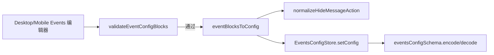

# 事件配置校验一致性（events-config-validation）技术规格（SPEC）

> **PRD**：[prd.md](./prd.md)  
> **调研基线**：`main` @ 2026-06-21（`domain/events-config`、`config-forms/events`、`domain/depth/logic/depth-slice.ts`）  
> **依赖迭代**：[stored-config-validity SPEC](../../../stored-config-validity/spec.md)、[config-forms-merge-into-core SPEC](../../../config-forms-merge-into-core/spec.md)

## 设计目标

1. **DepthSlice 校验对齐：** config-forms 保存路径与 domain `validateDepthSlice`、wire schema 使用相同输入形状。
2. **DAG 规则单源：** 将 event action DAG 校验提取到 `domain/events-config/logic/`，schema 与 UI 共用。
3. **最小行为变更：** 不改变 orchestrator 调度语义、stored-config-validity 失效流程、UI 仅编辑 `startDepth` 的产品策略。
4. **可测：** 新增用例锁定 `endDepth`-only 与 `normalizeHideMessageAction` 有意裁剪。

## 现状代码探索结论

| 区域 | 现状 | 问题 |
|------|------|------|
| `validate-event-config-blocks.ts` L103–105 | 仅传 `startDepth` 给 `validateDepthSlice` | 拒绝合法的仅 `endDepth` hide-message |
| `events-config.schema.ts` L150–196 | 内联 `validateDag` + Kahn | 与 config-forms 重复 |
| `validate-event-config-blocks.ts` L8–58 | 内联 `validateDag` + Kahn + 自依赖中文 | 与 schema 重复 |
| `event-orchestrator.service.ts` L171–224 | `prevalidateDag` DFS 环检测 | 第三份逻辑；可选收敛 |
| `event-config-state.ts` L12–18 | `normalizeHideMessageAction` 剥离 `endDepth` | 有意设计，无单测 |
| `default-events-config.ts` | 重复 `DEFAULT_EVENTS_CONFIG` | 无 import 方，漂移风险 |
| `depth-slice.ts` | `validateDepthSlice` 已支持仅 `endDepth` | domain 正确，forms 未用全 |

### 数据流（保存路径）



**缺口：** `VEC` 的 depth 校验窄于 `SCH`；`VEC` 与 `SCH` 的 DAG 各自实现。

---

## 总体方案

### 1) 修复 hide-message depth 表单校验

**文件：** `packages/core/src/config-forms/events/validate-event-config-blocks.ts`

将 hide-message 分支改为转发完整 params：

```typescript
validateDepthSlice({
  startDepth: action.params.startDepth ?? undefined,
  endDepth: action.params.endDepth ?? undefined,
});
```

错误消息格式保持不变：`「${eventLabel}」· 隐藏消息：${msg}`。

**不改：** `normalizeHideMessageAction` — UI round-trip 仍丢弃 `endDepth`（PRD 范围外）。

---

### 2) 新增共享 DAG 校验模块

**新文件：** `packages/core/src/domain/events-config/logic/validate-event-action-dag.ts`

```typescript
/**
 * Validates action-type DAG for a single event (duplicate types, deps, acyclic).
 * @module domain/events-config/logic/validate-event-action-dag
 */

/** Machine-readable failure for adapters (schema / UI / orchestrator). */
export type EventActionDagFailureCode =
  | "duplicate_action_type"
  | "unknown_dependency"
  | "self_dependency"
  | "cycle";

export class EventActionDagError extends Error {
  readonly code: EventActionDagFailureCode;
  readonly actionType?: string;
  readonly dependency?: string;

  constructor(
    code: EventActionDagFailureCode,
    message: string,
    meta?: { actionType?: string; dependency?: string },
  ) {
    super(message);
    this.name = "EventActionDagError";
    this.code = code;
    this.actionType = meta?.actionType;
    this.dependency = meta?.dependency;
  }
}

export type EventActionDagNode = {
  readonly type: string;
  readonly dependency?: readonly string[];
};

/** Throws EventActionDagError on violation. */
export function validateEventActionDag(nodes: readonly EventActionDagNode[]): void;
```

**算法（与现有 schema/UI 等价 + 显式自依赖）：**

1. 第一遍：收集 `type`，重复 → `duplicate_action_type`（message 含 type）。
2. 第二遍：对每个 `dependency`：
   - 不在集合 → `unknown_dependency`
   - `dep === node.type` → `self_dependency`（**保留** UI 友好分支，不依赖环检测间接报错）
3. Kahn 拓扑排序检测环 → `cycle`。

**英文默认 message（schema / orchestrator 用）：**

| code | message 模板 |
|------|----------------|
| `duplicate_action_type` | `duplicate action type in one event: ${type}` |
| `unknown_dependency` | `unknown dependency reference: ${type} depends on ${dep}` |
| `self_dependency` | `action cannot depend on itself: ${type}` |
| `cycle` | `dependency graph has a cycle` |

与现有 `events-config.schema.ts` throw 文案对齐，便于 schema 测试无 churn。

---

### 3) Schema 适配

**文件：** `packages/core/src/domain/events-config/model/events-config.schema.ts`

- 删除本地 `validateDag` 函数。
- `eventNodesSchema.superRefine` 内：

```typescript
import { EventActionDagError, validateEventActionDag } from "../logic/validate-event-action-dag.js";

// ...
.superRefine((nodes, ctx) => {
  try {
    validateEventActionDag(nodes);
  } catch (e: unknown) {
    ctx.addIssue({
      code: z.ZodIssueCode.custom,
      message: e instanceof Error ? e.message : String(e),
    });
  }
});
```

`parseActionNode` / wire 形状 **不变**。

---

### 4) Config-forms 适配

**文件：** `packages/core/src/config-forms/events/validate-event-config-blocks.ts`

- 删除本地 `validateDag`。
- 新增 `mapDagErrorToUserMessage(error: EventActionDagError, eventLabel: string): string`：

| code | 中文消息 |
|------|----------|
| `duplicate_action_type` | `「${eventLabel}」中动作「${actionTypeLabel(type)}」重复，请删除多余项后再保存` |
| `unknown_dependency` | `「${eventLabel}」· 动作「${actionTypeLabel(type)}」依赖不存在：${dep}` |
| `self_dependency` | `「${eventLabel}」· 动作「${actionTypeLabel(type)}」不能依赖自身` |
| `cycle` | `「${eventLabel}」· 依赖存在循环（DAG 必须无环）` |

- 每个 block 的 actions 校验：

```typescript
try {
  validateEventActionDag(block.actions);
} catch (e: unknown) {
  if (e instanceof EventActionDagError) {
    return mapDagErrorToUserMessage(e, eventLabel);
  }
  throw e;
}
```

**注意：** 保留 block 级「重复 action type」前置检测（L83–88）可选 — 与共享模块重复但提供更细粒度标签；**推荐删除** block 内重复检测，统一由 `validateEventActionDag` 抛出后再映射（避免双路径）。

---

### 5) Orchestrator 可选收敛

**文件：** `packages/core/src/service/events/impl/event-orchestrator.service.ts`

`prevalidateDag` 改为：

```typescript
try {
  validateEventActionDag(nodes);
  return null;
} catch (e: unknown) {
  if (e instanceof EventActionDagError) {
    return {
      actionType: (e.actionType ?? nodes[0]?.type ?? "hide-message") as EventAction["type"],
      error: e.message,
    };
  }
  throw e;
}
```

删除私有 DFS 实现。**验收：** 现有 `event-orchestrator.dag.test.ts` 仍绿。

若时间紧，可标记为 SPEC 内 **Should** 而非 **Must**；PRD 已列为可选。

---

### 6) 删除重复默认配置

**删除：** `packages/core/src/config-forms/events/default-events-config.ts`

**修改：** `packages/core/src/config-forms/events/index.ts`

```typescript
export { DEFAULT_EVENTS_CONFIG } from "@/domain/events-config/logic/default-events.js";
```

确认 `git grep` 无其它文件 import 已删路径。Apps 已从 `@novel-master/core/events` 引 domain 版 — 无消费者变更。

---

### 7) `normalizeHideMessageAction` 文档化（不改行为）

**文件：** `packages/core/src/config-forms/events/event-config-state.ts`

保持现有实现；JSDoc 补充：

> UI 不提供 `endDepth` 编辑；自 wire 加载后经本函数剥离。经 UI 保存会丢失 `endDepth`；runtime/schema 仍支持完整 DepthSlice。

---

## 测试计划

### 新增 / 扩展单测

| 文件 | 用例 |
|------|------|
| `test/config-forms/validate-event-config-blocks.test.ts` | **D1–D4** 仅 `endDepth`、双边界、空 slice、start>end |
| `test/domain/events-config/validate-event-action-dag.test.ts`（新） | 四类 DAG failure + happy path |
| `test/config-forms/event-config-state.test.ts` | **C2** load wire with `endDepth` → round-trip 无 `endDepth` |
| `test/config-forms/validate-event-config-blocks.test.ts` 或新 integration | `eventBlocksToConfig` → `decode(..., eventsConfigSchema)` smoke |

### 回归

- `test/events-config/events-config.schema.test.ts` — DAG 相关用例无 message 非预期变更
- `test/events/event-orchestrator.dag.test.ts` — 若改 orchestrator
- `apps/mobile/__tests__/validate-event-config-blocks.test.ts` — 若仍存在 duplicate，同步用例或改为 import core 测试（与 config-forms-merge 方向一致）

**运行命令（与仓库惯例一致）：**

```bash
npm run build -w @novel-master/core
npm test -w @novel-master/core
# 或 CI 门禁
npm run test:fast
```

---

## 文件变更清单

| 操作 | 路径 |
|------|------|
| **新增** | `packages/core/src/domain/events-config/logic/validate-event-action-dag.ts` |
| **新增** | `packages/core/test/domain/events-config/validate-event-action-dag.test.ts`（或并入 `events-config.schema.test.ts`） |
| **修改** | `packages/core/src/domain/events-config/model/events-config.schema.ts` |
| **修改** | `packages/core/src/config-forms/events/validate-event-config-blocks.ts` |
| **修改** | `packages/core/src/config-forms/events/index.ts` |
| **修改** | `packages/core/test/config-forms/validate-event-config-blocks.test.ts` |
| **修改** | `packages/core/test/config-forms/event-config-state.test.ts` |
| **删除** | `packages/core/src/config-forms/events/default-events-config.ts` |
| **可选修改** | `packages/core/src/service/events/impl/event-orchestrator.service.ts` |

**不修改：** Desktop/Mobile UI 组件、assess 流程、wire schema 字段定义、`normalizeHideMessageAction` 行为。

---

## 与依赖迭代的关系

| 迭代 | 关系 |
|------|------|
| **stored-config-validity** | assess 判定 **失效** 的配置不进入本 SPEC 的保存校验路径；本 SPEC 修复 **valid** 配置在 UI 保存时的误拒与双源漂移 |
| **config-forms-merge-into-core** | 所有改动位于已并入的 `packages/core/src/config-forms/`；无新 workspace |
| **event-config-dag** | DAG 语义（dependency、fail-fast、schema v2）已落地；本 SPEC 为 **校验实现去重**，不改 PRD 级 DAG 产品定义 |

---

## 验收对照（实现完成后）

| PRD ID | SPEC 落点 |
|--------|-----------|
| D1–D4 | `validate-event-config-blocks.test.ts` + depth 转发代码 |
| D5 | 手工：assess valid 的 endDepth-only wire → UI 直接保存成功 |
| G1–G2 | 共享模块测试 + schema + UI 测试 |
| G3 | Code review：仅 `validate-event-action-dag.ts` 含 DAG 算法 |
| G4 | `validate-event-config-blocks.ts` 无本地 Kahn |
| C1 | 删除 `default-events-config.ts`，index re-export |
| C2 | `event-config-state.test.ts` |
| R1–R3 | 全量 core 测试 + orchestrator DAG 测试 |

---

## 非目标（明确排除）

- Events UI 增加 `endDepth` 输入或加载警告 banner
- 修改 `eventNodesSchema.min(1)` 为空列表语义
- `eventBlocksToConfig` 对重复 event 键 throw
- depth 域其它债（`depth-from-tail` 单测、`hide-message.handler` 格式）— 见 [ci-test-health](../ci-test-health/)、[explore-depth.md](./explore-depth.md)
