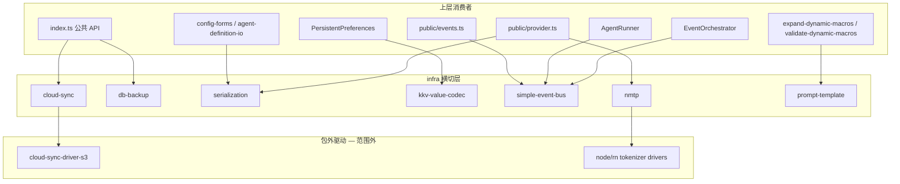
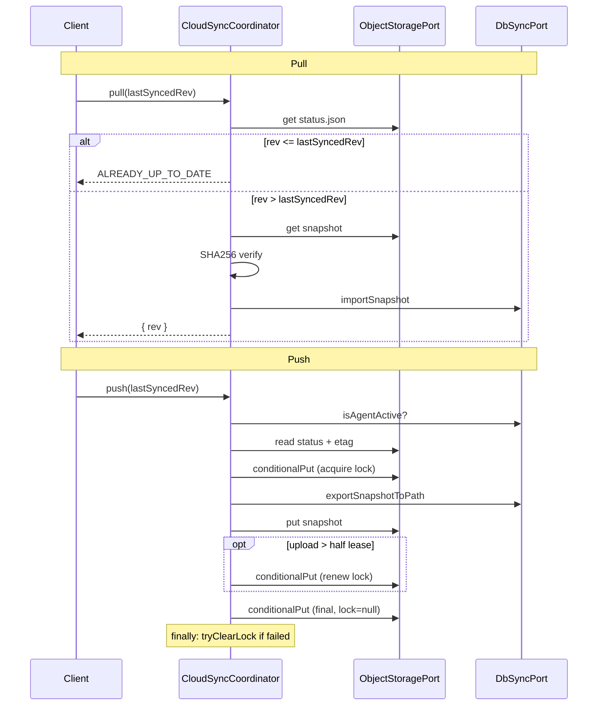

# 代码审查：横切 Infra（`packages/core`）

**审查日期：** 2026-06-21  
**范围：**

| 模块 | 路径 |
|------|------|
| 云同步 | `packages/core/src/infra/cloud-sync/**` |
| 数据库备份 | `packages/core/src/infra/db-backup/**` |
| 序列化 | `packages/core/src/infra/serialization/**` |
| KKV 值编解码 | `packages/core/src/infra/kkv-value-codec.ts` |
| 进程内事件总线 | `packages/core/src/infra/events/simple-event-bus.ts` |
| NMTP 分词器协议 | `packages/core/src/infra/nmtp/**` |
| Prompt 宏模板 | `packages/core/src/infra/prompt-template/**` |
| 测试 | `packages/core/test/cloud-sync/**`、`db-backup/**`、`events/simple-event-bus.test.ts`（及关联：`test/infra/serialization/`、`test/infra/nmtp/`、`test/prompt/macro-render.test.ts`） |

**维度：** 架构边界、正确性、可维护性、测试覆盖、与上层集成。

---

## 执行摘要

横切 infra 层整体**小而清晰**：端口/纯函数/协调器三分法与 `ARCHITECTURE.md` 一致，Core 保持零平台依赖（哈希、文件 I/O、S3 由驱动注入）。七个子模块合计约 **1,100 行**源码，职责边界明确，未发现 P0 级数据损坏 bug。

**总体评级：A-**

| 模块 | 评级 | 一句话 |
|------|------|--------|
| cloud-sync | A- | 租约锁 + ETag CAS 编排扎实；失败路径与孤儿快照需文档化 |
| db-backup | A | FK 顺序正确，集成测试覆盖 dump/scrub/restore/ATTACH |
| serialization | B+ | 薄封装一致；`zodToJsonSchema` 能力有限且无单测 |
| kkv-value-codec | B+ | 极简正确；无独立测试，错误类型与域层不一致 |
| simple-event-bus | B | 够用；handler 异常会中断后续订阅者 |
| nmtp | A- | 注册表模式与 SKSP/TDBC 对齐，测试充分 |
| prompt-template | A- | 轻量宏引擎，扫描/渲染分离；`macro-scan` 缺单测 |

**已运行测试（范围内 + 直接依赖）：** 31/31 通过（cloud-sync 11、db-backup 3、SimpleEventBus 2、serialization 1、NMTP 7、macro-render 7）。

---

## 架构总览

### 分层与依赖

| 规则 | 本层表现 |
|------|----------|
| infra → service | 无违规 |
| infra → domain | `nmtp` 引用 `tokenizer/logic`；`prompt-template` 引用 `errors/prompt-errors` — 合理 |
| 平台依赖 | cloud-sync 通过 deps 注入 crypto/FS；nmtp 仅端口 + 注册表 |
| 公共面 | cloud-sync、db-backup 从主包 `index.ts` 导出；serialization 经主包与 `@novel-master/core/provider`；事件总线经 `@novel-master/core/events` |

---

## 文件清单

| 文件 | 行数（约） | 角色 |
|------|------------|------|
| **cloud-sync** | | |
| `index.ts` | 35 |  barrel 导出 |
| `errors/cloud-sync-errors.ts` | 38 | 统一错误码 |
| `model/cloud-sync-status.ts` | 63 | Zod schema + 类型 |
| `logic/lock.ts` | 56 | 租约锁纯函数 |
| `logic/paths.ts` | 26 | 对象键生成 |
| `ports/object-storage.port.ts` | 23 | S3 抽象 |
| `ports/db-sync.port.ts` | 13 | 快照 import/export |
| `impl/cloud-sync-coordinator.ts` | 228 | Pull/Push 编排 |
| **db-backup** | | |
| `provider-tables.ts` | 20 | 三表常量与类型 |
| `provider-table-snapshot.ts` | 111 | dump/scrub/restore |
| **serialization** | | |
| `encode.ts` / `decode.ts` | 45 | 域 ↔ wire |
| `parse-text.ts` / `stringify-text.ts` | 43 | YAML/JSON 文本 |
| `zod-to-json-schema.ts` | 55 | LLM tool schema |
| **其他** | | |
| `kkv-value-codec.ts` | 19 | boolean 字符串编解码 |
| `events/simple-event-bus.ts` | 45 | 同步 pub/sub |
| `nmtp/logic/registry.ts` | 52 | 驱动注册表 |
| `prompt-template/macro-scan.ts` | 114 | `{{ }}` 扫描 |
| `prompt-template/macro-render.ts` | 103 | 宏替换 |
| `prompt-template/week-cn.ts` | 9 | 中文星期 |

---

## 模块审查

### 1. cloud-sync

#### 设计亮点

1. **端口分离清晰**：`ObjectStoragePort`（远端对象 + 条件 PUT）与 `DbSyncPort`（本地快照 + Agent 守卫）解耦，S3 实现在 `packages/cloud-sync-driver-s3`。
2. **乐观并发控制**：Push 流程「读 status + etag → 写锁（If-Match）→ 上传快照 → 写 final status → finally 清锁」，与多设备场景匹配。
3. **长上传续租**：上传耗时超过 `leaseSeconds * 500` ms（即租约一半）时尝试 `renewLease`，避免大库备份期间锁过期。
4. **Pull 完整性**：SHA256 校验 + `rev > 0` 时要求 `snapshotKey` 存在。
5. **错误模型**：`CloudSyncError` + `isCloudSyncError`，中文用户消息，与产品层一致。

#### Pull / Push 流程

#### 发现与风险

| 严重度 | 问题 | 位置 | 说明 |
|--------|------|------|------|
| P1 | Push 失败后可能留下孤儿快照 | `cloud-sync-coordinator.ts:141-172` | 快照已 `put` 但 final status 写入失败时，对象存储中有 `rev-N.nmbackup` 但 status 仍指向旧 rev；不影响一致性（Pull 仍读 status），但占空间 |
| P1 | `forceOverwriteRemote` 可覆盖远端更新 | `push()` L115-117 | 有意设计，但 UI/CLI 应强确认；测试已覆盖 |
| P2 | `NETWORK` / `AUTH` 错误码未使用 | `cloud-sync-errors.ts` | Core 与 S3 驱动均未映射；网络/鉴权失败以原生 Error 抛出，上层难以统一处理 |
| P2 | `canAcquireLock` 与 CAS 双重检查 | `push()` L120-128 | 预检可早退；真正互斥靠 ETag，合理但略冗余 |
| P2 | 缺 Pull 负路径测试 | 测试 | 无 `CHECKSUM_MISMATCH`、`SNAPSHOT_MISSING`、`INVALID_STATUS` 用例 |
| P3 | `assertConfigured` 仅检查 `deviceId` | L183-187 | `pathPrefix` 空字符串仍可用（根路径 `status.json`），是否 intentional 未文档化 |

#### 测试覆盖

| ID | 场景 | 状态 |
|----|------|------|
| CS-P1 | Pull 成功 | ✅ |
| CS-P2 | ALREADY_UP_TO_DATE | ✅ |
| CS-P3 | NEED_PULL_FIRST | ✅ |
| CS-P4 | LOCK_HELD_BY_OTHER | ✅ |
| CS-P5 | Push 成功 rev++ lock=null | ✅ |
| CS-P6 | 上传失败 finally 清锁 | ✅ |
| — | forceOverwriteRemote | ✅ |
| CS-L1~L4 | 锁有效/过期/构建/续租 | ✅ |
| — | AGENT_ACTIVE / CHECKSUM / parseCloudSyncStatus | ❌ |

---

### 2. db-backup

#### 设计亮点

1. **三表边界明确**：`sksp_secrets`、`llm_provider`、`llm_saved_model` — 导出备份时 scrub（脱敏），导入时 restore。
2. **FK 顺序正确**：`llm_saved_model` → `llm_provider` 有 FK；restore 先父后子，scrub 先子后父。`sksp_secrets` 无 FK 约束（`secret_ref` 为 TEXT），顺序无影响。
3. **ATTACH 副本 scrub**：`scrubProviderTablesInDatabase` 支持在不污染主库的情况下去除导出副本中的密钥，路径用 `?` 绑定防注入。
4. **事务 restore**：`transaction` 包裹 scrub + insert，避免半恢复状态。

#### 发现与风险

| 严重度 | 问题 | 位置 | 说明 |
|--------|------|------|------|
| P2 | ATTACH `alias` 字面量拼接 | L65-69 | `ATTACH DATABASE ? AS ${alias}` — 文档已要求调用方控制 alias；若传入 `"x; DROP..."` 有 SQL 风险 |
| P2 | 动态列 INSERT | `insertTableRows` | 列名取自 dump 首行；schema 迁移后旧快照可能列不匹配 |
| P3 | dump 顺序与 restore 顺序不一致 | `DB_BACKUP_PROVIDER_TABLES` vs `RESTORE_TABLE_ORDER` | 功能正确，但读者需对照两个常量 |

#### 测试覆盖

| ID | 场景 | 状态 |
|----|------|------|
| DB-1 | scrub 清空三表 | ✅ |
| DB-2 | dump → scrub → restore 一致 | ✅ |
| DB-3 | ATTACH 副本 scrub 主库不变 | ✅ |

---

### 3. serialization

#### 设计亮点

1. **encode/decode 对称**：`EncodableSchema.toWire` 与 Zod parse 分离，避免与 Zod v4 `.encode()` 命名冲突。
2. **统一错误**：`ConfigDecodeError` 贯穿 parse/decode/encode。
3. **文本格式**：YAML/JSON 双格式，`stringifyText` JSON 带 trailing newline，利于 diff。

#### 发现与风险

| 严重度 | 问题 | 位置 | 说明 |
|--------|------|------|------|
| P2 | `zodToJsonSchema` 覆盖类型有限 | `zod-to-json-schema.ts` | 仅 optional/object/string/number/boolean/array；其余 fallback 为 `{ type: "object", additionalProperties: true }`，复杂 tool schema 可能误导 LLM |
| P2 | 无 `zodToJsonSchema` 单测 | — | 仅经 agent-definition 等间接使用 |
| P3 | 无模块级 `index.ts` | — | 经主包与 `public/provider.ts` 导出，可接受 |

#### 测试覆盖

| ID | 场景 | 状态 |
|----|------|------|
| SER1 | yaml/json parse → decode → encode 往返 | ✅ |

---

### 4. kkv-value-codec

#### 设计亮点

- 极简 boolean 字符串约定（`"true"` / `"false"`），与 `nm-preferences` 模块一致。
- `PersistentPreferences` 在 `parseBoolean` 失败时转为 `preferencesInvalidValue`，域层错误体验一致。

#### 发现与风险

| 严重度 | 问题 | 位置 | 说明 |
|--------|------|------|------|
| P3 | `parseBoolean` 抛原生 `Error` | L15 | 与其他 infra 域错误类不一致；已被 service 层捕获转换 |
| P3 | 无直接单测 | — | 经 preferences 集成路径间接覆盖 |

---

### 5. simple-event-bus

#### 设计亮点

- 同步、单进程、零依赖，符合 Library infra 定位。
- `subscribe` 返回 `unsubscribe`，空 Set 时清理 Map 键，避免泄漏。
- `clear()` 供测试重置。

#### 发现与风险

| 严重度 | 问题 | 位置 | 说明 |
|--------|------|------|------|
| P1 | handler 异常中断后续订阅者 | `publish()` L41-43 | `AgentRunner` 连续 `publish` 多个 lifecycle 事件；若某一 handler 抛错，同类型后续 handler 收不到（与 [events 域审查](../domain/events.md) 一致） |
| P2 | 无 handler 错误隔离 / 日志 | — | 生产环境 silent failure 风险 |
| P3 | 类型擦除 | L24, L27 | `handler as EventHandler` 为 Set 异构存储的常规妥协 |
| P3 | 缺 `clear()` 测试 | — |  trivial |

#### 集成关系

- `AgentRunner`：`EVENT_AGENT_*` 生命周期与流式 delta。
- `DefaultEventOrchestrator.attachToBus()`：订阅 `SESSION_*` 事件，`void handler(...)` fire-and-forget async。

#### 测试覆盖

| 场景 | 状态 |
|------|------|
| 多 handler 顺序投递 | ✅ |
| unsubscribe 停止投递 | ✅ |

---

### 6. nmtp

#### 设计亮点

1. **零平台依赖**：仅 `TokenizerDriver` 端口 + 全局注册表，与 SKSP/TDBC 模式一致。
2. **`resolveTokenizerDriver`**：0 驱动 → `NOT_REGISTERED`；1 驱动 → 自动；多驱动 → `MULTIPLE_DRIVERS` 或显式 name。
3. **错误提示 actionable**：`REGISTER_HINT` 指向 CLI/Electron/RN 注册函数。

#### 发现与风险

| 严重度 | 问题 | 位置 | 说明 |
|--------|------|------|------|
| P3 | `clearTokenizerDrivers` 标记 `@internal` 但仍导出 | `registry.ts` | 测试需要；与 SKSP 惯例一致 |
| P3 | 全局可变状态 | `drivers` Map | 单进程 CLI 可接受；并行测试需 `clear` |

#### 测试覆盖

7 个 registry 用例全部通过（空/单/多/显式/未知/clear）。

---

### 7. prompt-template

#### 设计亮点

1. **扫描与渲染分离**：`scanMacroActions` 纯解析；`renderMacro` 按 span 拼接，支持 comment 移除。
2. **安全子集**：拒绝 Go template 控制流（`if`/`range`/`|=` 等），`validateDynamicMacros` 在域层白名单 `$time/$week_cn/$filetree`。
3. **`optionalDotFields`**：顶层可选 dot 字段缺失时返回 `""` 而非抛错。
4. **`week-cn.ts`**：独立 locale 格式化，供 `expandDynamicMacros` 使用。

#### 发现与风险

| 严重度 | 问题 | 位置 | 说明 |
|--------|------|------|------|
| P2 | `macro-scan` 无独立单测 | — | 经 `macro-render.test.ts` 与 `validate-dynamic-macros` 间接覆盖 |
| P3 | comment 双路径解析 | `scanMacroActions` vs `parseAction` | `{{/*` 在 scanner 层特殊处理；`/*` 在 parseAction 也有分支，略重复 |
| P3 | 嵌套 `{{` 未支持/未拒绝 | — | 当前为顺序扫描；嵌套场景行为未定义 |

#### 测试覆盖（`test/prompt/macro-render.test.ts`）

7 用例：root 替换、time/week_cn、comment 移除、UNSUPPORTED_SYNTAX、UNKNOWN_FIELD — 均 ✅。

---

## 跨模块主题

### 1. 注册表模式重复（低优先级 DRY）

`nmtp/registry.ts` 与 SKSP、TDBC 驱动注册语义相同。可抽取共享 `createDriverRegistry<T>()`，但当前各 50 行量级，合并收益有限。

### 2. `normalizePrefix` 重复（低优先级）

`cloud-sync/logic/paths.ts` 与 `domain/vfs` 中各有一份相同逻辑的 `normalizePrefix`。行为一致，可考虑抽到 `infra/path-utils`（非阻塞）。

### 3. 错误类型风格不统一（低优先级）

| 模块 | 错误类 |
|------|--------|
| cloud-sync | `CloudSyncError` |
| nmtp | `TokenizerError` |
| serialization | `ConfigDecodeError` |
| kkv-value-codec | 原生 `Error` → service 包装 |
| prompt-template | `PromptError` |

符合各上下文已有约定，无需强行统一。

### 4. 中英混排 JSDoc

cloud-sync、db-backup 中文模块注释；serialization、event-bus、kkv 英文。与 [summary.md](../summary.md) 全库主题一致，不影响运行。

---

## 优先修复建议

### P1 — 建议在云同步/UI 上线前处理

1. **文档化 Push 失败与孤儿快照**：在协调器或产品文档说明「status 未 advance 时旧 snapshotKey 仍有效；孤儿对象可 GC」。
2. **S3 驱动映射 `NETWORK` / `AUTH`**：在 `create-s3-object-storage.ts` catch 中转为 `CloudSyncError`，便于 CLI 统一提示。
3. **SimpleEventBus handler 隔离**（若 lifecycle 事件生产化）：`publish` 内 try/catch 逐 handler，或 orchestrator 层统一包装 — 与 events 域 P0 项联动。

### P2 — 下一迭代

1. 补充 cloud-sync 负路径测试：`CHECKSUM_MISMATCH`、`AGENT_ACTIVE`、`parseCloudSyncStatus` 非法 payload。
2. `zodToJsonSchema` 单测 + unsupported 类型显式 throw 或 warn。
3. `macro-scan.test.ts`：未闭合宏、legacy dot 宏、白名单边界。
4. `kkv-value-codec` 3 行单测（可选）。

### P3 — 可择机

1. 抽取共享 `normalizePrefix`。
2. cloud-sync `assertConfigured` 扩展校验 `pathPrefix`。
3. db-backup `alias` 白名单校验 `[a-zA-Z0-9_]+`。

---

## 测试矩阵汇总

| 模块 | 测试文件 | 用例数 | 通过 |
|------|----------|--------|------|
| cloud-sync | `coordinator.test.ts`, `lock.test.ts` | 11 | 11 |
| db-backup | `provider-table-snapshot.test.ts` | 3 | 3 |
| simple-event-bus | `simple-event-bus.test.ts` | 2 | 2 |
| serialization | `infra/serialization/serialization.test.ts` | 1 | 1 |
| nmtp | `infra/nmtp/registry.test.ts` | 7 | 7 |
| prompt-template | `prompt/macro-render.test.ts` | 7 | 7 |
| kkv-value-codec | — | 0 | — |
| **合计** | | **31** | **31** |

---

## 结论

横切 infra 是 Core 中**质量较高、边界清晰**的一层：cloud-sync 与 db-backup 可直接支撑跨端同步与备份脱敏流程；serialization / prompt-template / nmtp 为配置、Prompt、分词提供稳定底座；SimpleEventBus 简单够用但需与 events 域一并解决 handler 异常传播问题。

**合并建议：** 可合并。上线前优先补齐 cloud-sync 负路径测试与 S3 错误映射；事件总线异常隔离与 [events 域](../domain/events.md) 修复一并规划。

---

*审查方法：静态代码阅读 + 依赖图追踪 + 指定测试文件执行（tsx --test）。驱动包 `cloud-sync-driver-s3` 仅作集成上下文引用，不在本次文件清单内。*
