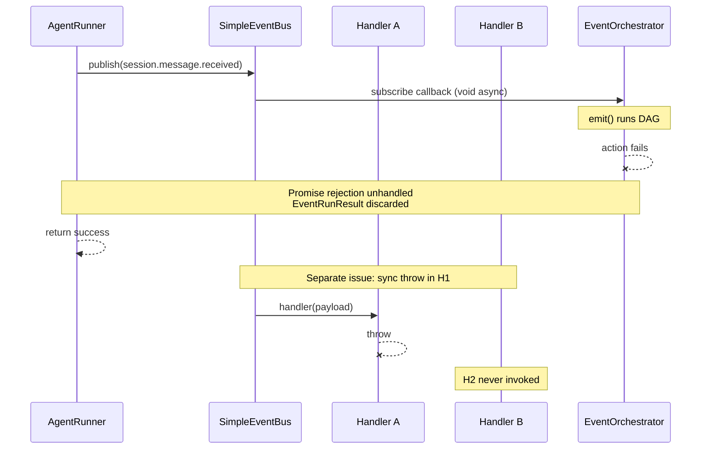
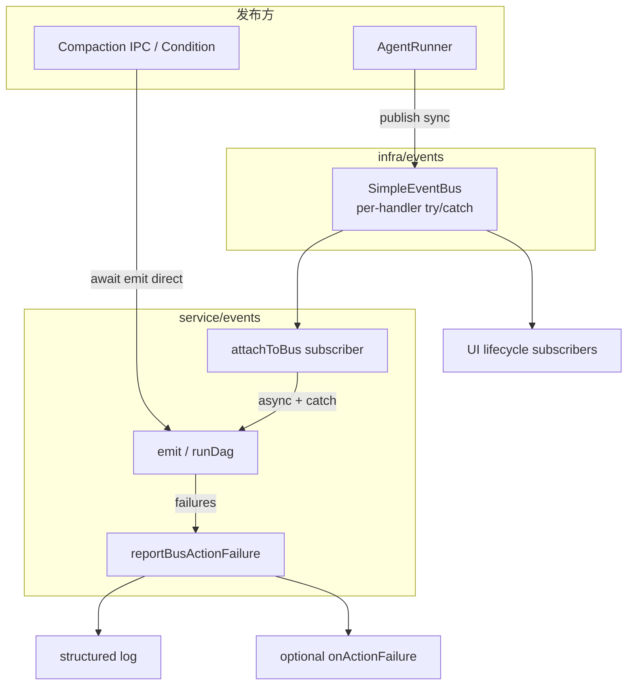

# 事件可靠性（events-reliability）技术规格（SPEC）

> **PRD：** [prd.md](./prd.md)  
> **探索基线：** [explore-events.md](./explore-events.md)、[explore-cross-cutting.md](./explore-cross-cutting.md)  
> **现状代码：** `simple-event-bus.ts`、`event-orchestrator.service.ts`、`agent-runner.ts`、`run-agent.handler.ts`

## 设计目标

1. **Bus 路径失败可观测**：orchestrator 经 `attachToBus` 执行的 action 失败不再变为 unhandled rejection。
2. **订阅者故障隔离**：SimpleEventBus 某一 handler 异常不阻断同 event 其余 handler。
3. **契约显式化**：`publishRunLifecycle` 与 `session.message.received` 发布条件文档化 + 测试锁定。
4. **最小侵入**：保持 bus 同步 API；默认不改变 AgentRunner 返回时序（fire-and-forget）。

## 现状与问题



| 组件 | 当前行为 | 目标行为 |
|------|----------|----------|
| `SimpleEventBus.publish` | for-loop 直接调用 handler；同步 throw 中断循环 | per-handler try/catch；记录后继续 |
| `attachToBus` 订阅 | `(p) => void handler(...)` | `(p) => void handler(...).catch(report)` |
| `AgentRunner.run` | message.received 与 lifecycle 独立 | 不变；补 JSDoc + 测试 |
| 手动 compaction IPC | awaited `emit`，返回 `result.ok` | 不变（回归 R3） |

## 总体方案



### 分层职责

| 层 | 路径 | 变更 |
|----|------|------|
| infra | `packages/core/src/infra/events/simple-event-bus.ts` | handler 隔离 + 可选 `onHandlerError` |
| service | `packages/core/src/service/events/impl/event-orchestrator.service.ts` | bus 订阅 `.catch` + failure 报告 |
| service | `packages/core/src/service/events/create-event-orchestrator.ts` | 透传 `onActionFailure`；导出 detach |
| service | `packages/core/src/service/agent/impl/agent-runner.ts` | JSDoc 澄清 message.received 门控 |
| public | `packages/core/src/public/events.ts` | 导出 detach（若尚未导出） |
| test | `packages/core/test/events/` | 新增 bus 隔离 + orchestrator bus 集成测 |

## 详细设计

### 1. SimpleEventBus handler 隔离

**文件：** `packages/core/src/infra/events/simple-event-bus.ts`

**接口扩展（可选 deps，构造器或 setter）：**

```ts
export interface SimpleEventBusOptions {
  /** Called when a handler throws synchronously. Default: console.error */
  readonly onHandlerError?: (eventType: string, error: unknown) => void;
}
```

**`publish` 实现要点：**

```ts
for (const handler of set) {
  try {
    handler(payload);
  } catch (err) {
    this.onHandlerError?.(eventType, err);
    // continue — do not rethrow
  }
}
```

**约束：**

- 保持 `publish` 同步、`void` 返回。
- async handler 若 fire-and-forget（返回 Promise 但未 await），bus **不**等待；Promise rejection 由订阅方（orchestrator）自行 `.catch`（见 §2）。
- 默认 `onHandlerError`：`console.error('[SimpleEventBus]', eventType, err)` — 测试可注入 spy。

### 2. EventOrchestrator bus 订阅错误报告

**文件：** `packages/core/src/service/events/impl/event-orchestrator.service.ts`

**Deps 扩展：**

```ts
export interface DefaultEventOrchestratorDeps {
  // ...existing
  readonly onActionFailure?: (input: {
    readonly eventType: string;
    readonly ctx: EventEmitContext;
    readonly result: EventRunResult;
  }) => void;
}
```

**`attachToBus` 改写：**

```ts
const runFromBus = (eventType: string, payload: unknown) => {
  const ctx = payloadToEmitContext(payload);
  if (ctx == null) return;
  void this.emit(eventType, ctx)
    .then((result) => {
      if (!result.ok) {
        this.reportActionFailure(eventType, ctx, result);
      }
    })
    .catch((err) => {
      this.reportActionFailure(eventType, ctx, {
        ok: false,
        partialFailure: false,
        failures: [{
          actionType: eventType,
          error: err instanceof Error ? err.message : String(err),
        }],
      });
    });
};

this.deps.eventBus.subscribe(EVENT_SESSION_COMPACTION_REQUESTED, (p) =>
  runFromBus(EVENT_SESSION_COMPACTION_REQUESTED, p),
);
// same for EVENT_SESSION_MESSAGE_RECEIVED
```

**`reportActionFailure` 私有方法：**

1. 调用 `deps.onActionFailure?.(...)`（若配置）
2. 否则 `console.error` structured payload：`eventType`, `projectId`, `sessionId`, `failures`

**不变：**

- `emit()` 公开 API 与 `runDag` fail-fast 语义不变。
- `payloadToEmitContext` null → 静默 skip（无效 payload 仍 no-op）。

### 3. Factory 与 public API

**文件：** `create-event-orchestrator.ts`

```ts
export interface CreateEventOrchestratorDeps {
  // ...existing
  readonly onActionFailure?: DefaultEventOrchestratorDeps["onActionFailure"];
}
```

- `createEventOrchestrator` 继续默认 `attachToBus()`。
- **`detachEventOrchestratorFromBus`** 加入 `public/events.ts` 导出（探索 N6）。

**Runtime 接线（本 feature 可选 follow-up，非阻塞验收）：**

- Desktop/Mobile `create*Runtime` 可传入 `onActionFailure` 写 debug log；UI toast 留给后续。

### 4. AgentRunner 生命周期与 message.received

**文件：** `packages/core/src/service/agent/impl/agent-runner.ts`

**发布条件（文档化，代码不改逻辑）：**

| Event | 条件 |
|-------|------|
| `agent.run.started` | `publishRunLifecycle === true` |
| `agent.stream.*` | `stream && publishRunLifecycle` |
| `agent.step.committed` | `publishRunLifecycle` |
| `agent.run.failed` | `publishRunLifecycle`（catch 非 abort） |
| `session.message.received` | `persistMessages && assistantAppendCount > 0` |
| `agent.run.finished` | `publishRunLifecycle` |

**关键语义：**

- `session.message.received` **不受** `publishRunLifecycle` 门控 —  intentional：compaction actions 应在消息持久化后触发，与 UI lifecycle 展示解耦。
- `run-agent.handler` 保持 `persistMessages: false`, `publishRunLifecycle: false` — nested agent 不二次 emit message.received / lifecycle。

**JSDoc：** 在 `run()` 内 message.received publish 处注明：「下游 orchestrator action 异步执行；本方法成功返回不表示 action 成功。」

**可选 future（本 SPEC 不实现，PRD 已排除默认启用）：**

```ts
// AgentRunOptions — NOT in v1
awaitBusActions?: boolean;
```

若未来启用，runner 在 publish 前持有 orchestrator 引用并 awaited `emit` — 需 DI 变更，超出本 feature。

### 5. EventRunResult.partialFailure 卫生

**推荐（最小 diff）：** 保留字段，更新 `event-run-result.ts` JSDoc：

> `partialFailure` — 保留供未来并行 partial 语义；**当前实现恒为 `false`**（fail-fast 停止调度）。

**备选：** 删除字段 + 全库替换 — 触及 public 类型，本 feature 优先 JSDoc 方案。

### 6. 错误报告格式

统一 log 前缀 `[EventOrchestrator]` / `[SimpleEventBus]`，字段：

```json
{
  "eventType": "session.message.received",
  "projectId": "p1",
  "sessionId": "s1",
  "ok": false,
  "failures": [{ "actionType": "hide-message", "error": "..." }]
}
```

不引入新 `EventsError` 类型（留给后续迭代 M6）。

## 测试计划

| ID | 文件 | 场景 |
|----|------|------|
| T-BUS-1 | `test/events/simple-event-bus.test.ts` | handler A throws → handler B still runs |
| T-BUS-2 | `test/events/simple-event-bus.test.ts` | 注入 `onHandlerError` 被调用 |
| T-ORCH-1 | `test/events/event-orchestrator.bus.test.ts`（新） | attachToBus + publish message.received + failing hide-message → `onActionFailure` 或 log spy；无 unhandledRejection |
| T-ORCH-2 | 同上 | compaction.requested 失败路径对称 |
| T-ORCH-3 | 同上 | 成功 path → 无 failure 报告 |
| T-AR-1 | `test/agent/agent-runner.test.ts` | 现有 message.received emit 回归 |
| T-AR-2 | `test/events/` 或 agent 测 | run-agent handler 不 emit lifecycle / message.received（mock bus spy） |
| T-DET-1 | `test/events/event-orchestrator.bus.test.ts` | attach → detach → re-attach 不 double-fire |

**Harness 提示（T-ORCH-*）：**

```ts
const bus = new SimpleEventBus();
const failures: EventRunResult[] = [];
const orchestrator = new DefaultEventOrchestrator({
  ...baseDeps,
  eventBus: bus,
  onActionFailure: ({ result }) => failures.push(result),
});
orchestrator.attachToBus();
// publish via bus.publish(EVENT_SESSION_MESSAGE_RECEIVED, { projectId, sessionId })
// assert failures.length === 1 && !result.ok
```

使用 `process.on('unhandledRejection', ...)` 断言测试期间无额外 rejection（或 Node test `assert.rejects` 模式）。

## 文件变更清单

| 文件 | 变更类型 |
|------|----------|
| `infra/events/simple-event-bus.ts` | 修改 publish + 可选 options |
| `service/events/impl/event-orchestrator.service.ts` | attachToBus + reportActionFailure |
| `service/events/create-event-orchestrator.ts` | onActionFailure 透传 |
| `service/events/event-run-result.ts` | JSDoc partialFailure |
| `service/agent/impl/agent-runner.ts` | JSDoc only |
| `public/events.ts` | export detach |
| `test/events/simple-event-bus.test.ts` | +2 cases |
| `test/events/event-orchestrator.bus.test.ts` | 新文件 |

**不修改：** `run-agent.handler.ts` 行为、`compaction.ts` IPC、`runDag` 算法。

## 风险与缓解

| 风险 | 缓解 |
|------|------|
| 静默吞错改为 log 后测试噪音 | 测试注入 mock `onHandlerError` / `onActionFailure`；生产默认 console.error |
| async handler rejection 仍可能来自非 orchestrator 订阅者 | 文档约定：async bus handler 必须自管 `.catch`；orchestrator 为本 feature 重点 |
| double-subscribe 跨 rebootstrap | 导出 detach；测试 T-DET-1 |
| 误以为 runner 失败应随 action 失败 | PRD/SPEC 明确语义；不默认改 runner 返回码 |

## 验收命令

```bash
cd packages/core
npx tsx --test test/events/*.test.ts
npm run test:fast
```

**完成定义：** PRD 验收 R1–R7 全部满足；SPEC 测试 T-BUS-* / T-ORCH-* / T-AR-* 绿。

## 与相邻 feature 关系

| Feature | 关系 |
|---------|------|
| ci-test-health | Phase 0 先修 hide-message 测试；本 feature 新增 orchestrator bus 测依赖稳定 handler |
| events-config-validation | 配置校验独立；本 feature 仅运行时可靠性 |
| message-checkpoint-and-agent | checkpoint fire-and-forget 类似主题，不同模块 |
| codebase-audit-remediation | 无代码重叠；并行安全 |
