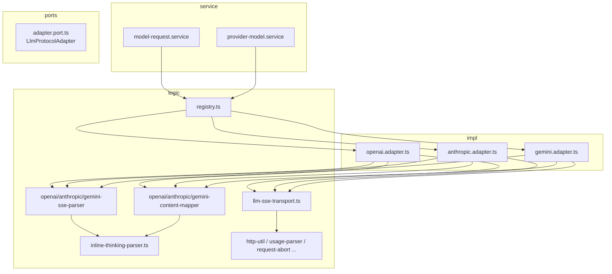

# llm-protocol 代码审查

**日期：** 2026-06-21  
**范围：** `packages/core/src/infra/llm-protocol/**`、`packages/core/test/infra/llm-protocol/**`、`packages/core/test/provider/protocol-*.test.ts`  
**测试：** 111 项通过（`test/infra/llm-protocol/*.test.ts` + `test/provider/protocol-*.test.ts`）

---

## 概述

`llm-protocol` 是 Core 包中 LLM 厂商 HTTP 协议的**基础设施层**：将 OpenAI Chat Completions、Anthropic Messages、Gemini generateContent 三种 wire 格式，统一映射为 NM 内部的 `ContentBlock[]`、`LlmStreamEvent` 与 `LlmTokenUsage`。

整体设计成熟：**端口 + 三适配器 + 共享传输 + 协议专用 parser/mapper**，与 `model-request.service` 通过 `getProtocolAdapter` 集成。流式路径统一走 `postSse`（Node fetch / RN XMLHttpRequest），非流式走 `fetchJson`。inline thinking、tool call 累积、abort 部分结果、RN SSE 节流等边界均有专门模块与测试。

当前未发现会导致主对话路径数据损坏的 P0 级缺陷；主要风险集中在**静默丢弃畸形 SSE**、**三协议行为 parity 不一致**、以及**全局 registry / 重复工具函数**带来的长期维护成本。

---

## 架构

### 分层与依赖方向



### 目录职责

| 路径 | 职责 |
|------|------|
| `ports/adapter.port.ts` | `LlmProtocolKind`、`LlmChatRequest/Result`、`LlmStreamEvent`、`LlmProtocolAdapter` 端口 |
| `impl/*.adapter.ts` | 各协议 `listModels` / `chat`（非流式 / 流式分支） |
| `logic/registry.ts` | 全局适配器注册、`configureLlmFetch` |
| `logic/llm-sse-transport.ts` | `postSse`：fetch 流式 body 或 RN XHR `onprogress` |
| `logic/sse-line-buffer.ts` | 增量 UTF-8 按行切分 |
| `logic/*-sse-parser.ts` | 协议 SSE 事件 → 累积器 + `onStream` |
| `logic/*-content-mapper.ts` | NM `ContentBlock` ↔ wire JSON（纯函数，无 HTTP） |
| `logic/inline-thinking-parser.ts` | `reasoning_content` / `<thought>` / `>thought` 等 inline 推理剥离 |
| `logic/stream-partial-blocks.ts` | abort 时部分 block 组装 |
| `logic/debug-fetch.ts` | 可选 fetch 日志（脱敏 key/header） |

### 流式数据路径（三协议共性）

1. Adapter `chatStream` 调用 `postSse(url, init, onChunk)`（`openai.adapter.ts:186-201`、`anthropic.adapter.ts:173-189`、`gemini.adapter.ts:133-147`）。
2. `onChunk` 进入各 `feed*SseChunk` → `feedSseLines` 按 `\n` 切行 → 解析 `data:` JSON。
3. 正常结束：`finish*Sse`；`signal.aborted`：`finish*Partial` / `openAiStreamAccumulatorsToPartialBlocks`。
4. 适配器统一 `req.onStream?.({ type: "done", result })`（例如 `openai.adapter.ts:226`）。

### 与上层集成

- `packages/core/src/service/provider/impl/model-request.service.ts:12,158` — 默认 `getProtocolAdapter`。
- `packages/core/src/public/provider.ts:73-74` — 对外导出 `configureLlmFetch`、`getProtocolAdapter`。
- `logic/tool-definitions.ts` — `ToolRegistry` → `LlmToolDefinition[]`。

---

## 代码风格

### 优点

- **模块头注释一致**：每个文件有 `@module infra/llm-protocol/...` 与职责说明。
- **类型收窄习惯良好**：广泛使用 `isRecord` + `typeof` 守卫，避免盲目 `as`。
- **端口类型只读**：`LlmChatRequest`、`LlmStreamEvent` 等使用 `readonly`，与领域层风格一致。
- **错误类型统一**：HTTP 失败走 `ProviderError` + `HTTP_ERROR`（`http-util.ts:23-41`），内容不支持走 `UNSUPPORTED_CONTENT`（如 `openai-content-mapper.ts:117-120`）。

### 问题

1. **注释编码损坏（mojibake）**  
   多处箭头/破折号显示为乱码，影响可读性：
   - `openai-content-mapper.ts:4` — `serialization â€?no HTTP`
   - `openai-content-mapper.ts:89,149` — `â†?`
   - `anthropic-content-mapper.ts:17,72,181` — `??`
   - `tool-definitions.ts:2` — `â†?`

2. **`isRecord` 重复定义**  
   至少在 8 个文件中各自实现相同函数（`openai-sse-parser.ts:17-19`、`anthropic-sse-parser.ts:15-17`、`gemini-sse-parser.ts:20-22`、`openai-content-mapper.ts:26-28` 等）。应抽到 `logic/type-guards.ts` 或复用已有领域工具。

3. **中英文混排**  
   `inline-thinking-parser.ts:432`、`stream-inline-thinking-split-mode.ts` 全文中文注释，与同目录英文 JSDoc 不一致；不影响运行，但增加 onboarding 成本。

4. **适配器类结构重复**  
   三个 `*.adapter.ts` 的 `chatStream` 模板几乎相同（`postSse` → catch abort → finish normal/partial → `done` 事件），仅 parser 与 toolNames 不同。可考虑抽象 `streamChatWithSse` 基类或工厂，但当前重复尚在可接受范围。

---

## 可维护性

### 全局 Registry

```17:25:packages/core/src/infra/llm-protocol/logic/registry.ts
function ensureDefaults(fetchFn?: FetchFn): void {
  if (adapters.size > 0) {
    return;
  }
  const fn = fetchFn ?? globalThis.fetch;
  adapters.set("openai", new OpenAiProtocolAdapter(fn));
  ...
}
```

- `getProtocolAdapter(kind, fetchFn)` 在 registry 非空时**忽略** `fetchFn`（`registry.ts:39-48`），仅首次 `ensureDefaults` 生效。
- 测试依赖 `clearProtocolAdapters`（`registry.ts:52-54`），生产依赖 startup 时 `configureLlmFetch`。
- **风险**：多测试套件并行或遗漏 `clear` 时可能串用 fetch mock；文档应明确「单进程单 fetch 配置」假设。

### `inline-thinking-parser` 复杂度

`InlineThinkingStreamSplitter`（`inline-thinking-parser.ts:232-384`）承担 XML 标签、`` ` `` 围栏、畸形 `>thought`、HTML 实体、holdback 后缀等多重逻辑，是模块内最大单文件（约 484 行）。测试覆盖充分（`inline-thinking-parser.test.ts`、`gemini-thought-signature.test.ts` 等），但修改成本高；建议保持「纯函数拆分 + 单测锚定」策略，避免再堆特性。

### `emittedToolIndices` 半实现状态

`OpenAiSseParserState` 含 `emittedToolIndices`（`openai-sse-parser.ts:33,46`），`openAiStreamAccumulatorsToBlocks` 在 finish 时用其避免重复 `tool-use` 事件（`openai-content-mapper.ts:391-398`），但**流式解析过程中从不写入该 Set**——`openAiStreamDeltaToEvents` 不 emit 中途 `tool-use`（`openai-content-mapper.ts:327-354`）。

对比 Anthropic：在 `content_block_stop` 时 emit `tool-use`（`anthropic-sse-parser.ts:105-110`）。  
该字段暗示曾计划流式 tool 事件，现状易造成读者误解。

### Anthropic `finishAnthropicSsePartial` 冗余路径

`finishAnthropicSsePartial`（`anthropic-sse-parser.ts:259-298`）先 `flushActiveBlock` 得到完整 `state.blocks`，再从中抽取 text/thinking/tool_use 合并，再调用 `buildStreamPartialBlocks` 重建，最后 `push(...otherBlocks)`。与 `finishAnthropicSse` 相比，对 text/thinking 做了二次折叠，逻辑难跟；若 abort 语义与正常结束一致，可直接复用 `finishAnthropicSse` + 标记 `aborted` raw。

### 测试组织

| 层级 | 文件数 | 侧重点 |
|------|--------|--------|
| `test/infra/llm-protocol/` | 20 | parser/mapper/transport 单元测试 |
| `test/provider/protocol-*.test.ts` | 4 | 适配器 HTTP mock、端到端 stream 行为 |

覆盖面好，但 **provider 层协议测试偏薄**（Anthropic 仅 3 个用例、`protocol-anthropic.test.ts`），Gemini 无 stream abort 适配器级测试（parser 层有 `gemini-partial-stream.test.ts`）。

---

## 正确性

### 流式解析

| 能力 | OpenAI | Anthropic | Gemini | 备注 |
|------|--------|-----------|--------|------|
| 按 chunk 切行 | ✓ `feedSseLines` | ✓ | ✓ | `sse-line-buffer.ts:13-25` |
| 行内断点 | ✓ 测试 SSE-02 | ✓ | ✓ | `openai-sse-parser.test.ts:43-57` |
| `usage` 末包 | ✓ `lastUsageEvent` | ✓ `message_delta` | ✓ `usageMetadata` | OpenAI 需 `stream_options.include_usage`（`openai.adapter.ts:118-119`） |
| thinking 流式 | ✓ `reasoning_content` | ✓ `thinking_delta` + signature | ✓ `thought: true` | |
| inline thinking 流式拆分 | opt-in `NM_INLINE_STREAM_THINKING_SPLIT=1` | 同左（经 OpenAI/Gemini 正文路径） | 同左 | 默认直通 `text-delta`（`stream-inline-thinking-split-mode.ts:19-27`） |
| abort 部分结果 | ✓ | ✓ | ✓ | 三适配器均 `isRequestAborted` + partial finish |
| RN XHR SSE | ✓ `postSse` + emitter | ✓ | ✓ | `llm-sse-transport.ts:134-247`、`sse-chunk-emitter.ts` |

**畸形 SSE JSON 静默丢弃**：三 parser 均在 `JSON.parse` 失败时 `return`（`openai-sse-parser.ts:69-72`、`anthropic-sse-parser.ts:159-162`、`gemini-sse-parser.ts:150-153`）。不会抛错，也不会日志；连续坏行会导致**无内容却 HTTP 200** 的「空回复」，难以排查代理/网关问题。

**OpenAI 流式 Response 非 SSE**：`chatStream` 测试用例 `O5` 直接 `new Response(sse)` 整包 body（`protocol-openai.test.ts:130-134`），未强制 `text/event-stream`；真实 `postSse` 对 content-type 不校验，依赖 parser 容错。

### Tool call

| 行为 | OpenAI | Anthropic | Gemini |
|------|--------|-----------|--------|
| 非流式 tool_use block | ✓ `openAiChoiceToBlocks` | ✓ | ✓ `geminiPartsToBlocks` |
| 流式参数累积 | ✓ `tool_calls[].index` | ✓ `input_json_delta` | ✓ `functionCall.args` 合并 |
| 流式 `tool-use` 事件时机 | **仅 finish** | **block_stop 时** | **仅 finish** |
| 无效 JSON 参数 | 空 `{}` | 空 `{}` | 空 `{}` |
| 出站 tool 名 | 原样 | 点号 → `_` wire 编码 | 原样 |
| tool_result 历史 | `role: tool` | user `tool_result` | `functionResponse` + 合成 model turn |

OpenAI 流式 tool 仅在 `finishOpenAiSse` 后 emit `tool-use`（`openai-sse-parser.test.ts:112-119` 在 finish 后才断言）。若上层 `onStream` 依赖实时 tool 事件（如 UI 高亮），OpenAI/Gemini 与 Anthropic **不一致**。

Anthropic wire 工具名：`resolveAnthropicToolNameWire`（`anthropic.adapter.ts:52-70`）扫描 tools + history，仅在需要时编码；响应 `fromWire` 还原（`anthropic-sse-parser.ts:98`）。

Gemini tool 历史：`chatMessagesToGeminiContents`（`gemini-content-mapper.ts:307-360`）处理 compaction 后 orphan `tool_result`、合成 `model` turn、`toolUseLookupMessages` 解析 id→name，逻辑最复杂，测试在 `gemini-content-mapper.test.ts`。

### 协议 Parity（功能矩阵）

| 功能 | OpenAI | Anthropic | Gemini |
|------|--------|-----------|--------|
| `listModels` | ✓ `/models` | ✓ `/v1/models` | ✓ `?key=` |
| system prompt | `messages[system]` | `system` 字段 | `systemInstruction` |
| 多模态出站 image | ✓ | ✓ | **抛 UNSUPPORTED_CONTENT**（`gemini-content-mapper.ts:221-225`） |
| thinking 出站 | **抛错**（`openai-content-mapper.ts:116-120`） | ✓ 带 signature | ✓ |
| text-only 快捷路径 | ✓ `chatTextOnly` | ✗ | ✗ |
| 默认 `max_tokens` | 靠 sampling | **硬编码 4096**（`anthropic.adapter.ts:126`） | 靠 `generationConfig` |
| API key 传递 | Bearer header | `x-api-key` | **URL query `key=`**（`gemini.adapter.ts:41,99-102`） |
| stream usage | `include_usage` | `message_delta.usage` | `usageMetadata` |

OpenAI **独有** `useTextOnlyShortcut`（`openai.adapter.ts:43-50`）：纯文本、无 tools/system 时走简化请求，Anthropic/Gemini 无对等优化。

### 错误处理

**Abort 检测**（`request-abort.ts:33-50`）覆盖：`signal.aborted`、`AbortError.name`、以及 `ProviderError` 消息含 `abort`。三适配器在 `postSse` catch 中吞掉 abort 错误（`openai.adapter.ts:202-206`），再按 `signal.aborted` 选 partial finish——若仅 error 为 abort 而 signal 未标记，可能走正常 finish（边缘竞态）。

**HTTP 错误**：`assertOk` 截断 body 500 字符（`http-util.ts:36-40`）；XHR 路径在 `onload` 后检查 status（`llm-sse-transport.ts:219-229`），与 fetch 路径一致。

**空流 body**：fetch 且 `response.body == null` 时明确抛错（`llm-sse-transport.ts:264-270`），引导 RN 走 XHR。

**`buildStreamPartialBlocks`**：`thinking` 用 `trim` 判断、`text` 用 `length > 0`（`stream-partial-blocks.ts:36-40`）。仅空白字符的 text 块会被保留（与正常 finish 路径 `blocksFromReplyStrings` 的 `trim` 不一致，`openai-content-mapper.ts:45-46`）。

---

## 优点

1. **端口设计清晰**：`LlmProtocolAdapter` + `LlmStreamEvent` 将 NM 与厂商格式解耦，上层只关心统一事件（`adapter.port.ts:26-35,70-85`）。
2. **RN SSE 可靠性**：XHR + `createSseChunkEmitter` 32ms 节流（`sse-chunk-emitter.ts:7-17`）解决 RN 事件循环饥饿，并有 TRANS 系列传输测试。
3. **inline thinking 处理全面**：覆盖 `reasoning_content`、Gemini `thought`、XML/畸形标记、流式 holdback（`inline-thinking-parser.ts`），且默认关闭流式拆分以降低误伤。
4. **Gemini tool 会话完整性**：合成 model turn、`toolUseLookupMessages`、orphan tool_result 降级为文本（`gemini-content-mapper.ts:117-176,345-350`）对 compaction 场景务实。
5. **测试密度高**：parser 级 SSE 编号用例（SSE-01…）、partial stream、thought signature、XHR mock 等，111 项全绿。
6. **调试友好**：`debug-fetch.ts` 脱敏 URL/header/body 摘要；`NM_DEBUG_LLM_FETCH` 与 SSE 日志（`llm-sse-transport.ts:87-93`）。

---

## 建议

### P0（上线前应处理或明确接受）

当前**无**已确认的 P0 数据损坏项。若产品要求「流式 tool 事件三协议一致」或「畸形 SSE 必须可观测」，下列项应升级为 P0：

| # | 项 | 位置 | 说明 |
|---|-----|------|------|
| — | （暂无强制 P0） | — | 主路径测试充分；风险见 P1 |

### P1（应尽快修复 / 统一）

| # | 项 | 位置 | 建议 |
|---|-----|------|------|
| 1 | 畸形 SSE JSON 静默丢弃 | `openai-sse-parser.ts:69-72`、`anthropic-sse-parser.ts:159-162`、`gemini-sse-parser.ts:150-153` | `NM_DEBUG` 下 `console.warn` 含 payload 前缀；或累计坏行计数，finish 时若零内容且存在坏行则抛 `ProviderError` |
| 2 | 流式 `tool-use` 事件 parity | `openai-content-mapper.ts:327-354` vs `anthropic-sse-parser.ts:105-110` | 文档化差异，或在 OpenAI/Gemini finish 前于参数 JSON 可解析时 emit；至少删除/实现 `emittedToolIndices` 半途逻辑 |
| 3 | Anthropic `max_tokens` 硬编码 4096 | `anthropic.adapter.ts:126` | 默认与 OpenAI sampling 对齐（如 16k），或 sampling 未设时从 `mergeSamplingWithDefaults` 注入 |
| 4 | Gemini API key 在 URL | `gemini.adapter.ts:41,99-102` | 优先 header（若网关支持）；日志路径已用 `redactUrl`（`debug-fetch.ts:31-40`），但 access log 仍可能泄露 |
| 5 | 无效 tool JSON → 空 input | `openai-content-mapper.ts:376-382` 等 | finish 时若 `argumentsJson` 非空但 parse 失败，抛 `ProviderError` 或带 `rawArguments` 的 warning block，避免静默丢参 |
| 6 | `finishAnthropicSsePartial` 冗余 | `anthropic-sse-parser.ts:259-298` | 简化为与 `finishAnthropicSse` 共享核心，仅改 `streamRaw.aborted` 标记 |
| 7 | Provider 层 Anthropic 测试过少 | `test/provider/protocol-anthropic.test.ts` | 补充 stream、abort、thinking signature、tool 流式与 OpenAI 对等的 M1 类用例 |

### P2（改进质量 / 技术债）

| # | 项 | 位置 | 建议 |
|---|-----|------|------|
| 1 | `isRecord` 重复 | 多文件 | 抽到 `logic/type-guards.ts` |
| 2 | 注释 mojibake | `openai-content-mapper.ts:4,89,149` 等 | 统一 UTF-8 箭头 `→` / em dash |
| 3 | `getProtocolAdapter` 忽略后续 `fetchFn` | `registry.ts:17-20,39-48` | 文档说明；或 `configureLlmFetch` 为唯一入口并 deprecate 第二参数 |
| 4 | OpenAI text-only 快捷无 Anthropic/Gemini 对等 | `openai.adapter.ts:43-50,131-160` | 评估是否在另两协议加纯文本 fast path |
| 5 | `createAnthropicToolNameWire` 碰撞 | `anthropic-tool-names.ts:27-37` | 多点工具映射同一 wire 名时抛错或显式后缀 |
| 6 | Gemini `functionCall` 合成 id | `gemini-content-mapper.ts:269-272` | 用稳定 id（如 hash）替代 `name-${blocks.length}` |
| 7 | partial vs normal text 空白语义 | `stream-partial-blocks.ts:39` vs `openai-content-mapper.ts:45` | 统一 trim 规则 |
| 8 | `fetchJson` 未传 `providerId` | 各 adapter `fetchJson` 调用 | 错误上下文带上 provider 标识 |
| 9 | 适配器 `chatStream` 模板重复 | 三个 `*.adapter.ts` | 可选 thin helper 减少 drift |
| 10 | `inline-thinking-parser` 体积 | `inline-thinking-parser.ts` | 按「完成态 split / 流式 splitter / leak strip」拆文件 |

---

## 附录：关键文件索引

| 文件 | 行号区间（要点） |
|------|------------------|
| `ports/adapter.port.ts` | 11-85 协议端口与请求/结果类型 |
| `logic/registry.ts` | 17-54 全局注册与测试清理 |
| `logic/llm-sse-transport.ts` | 305-328 `postSse` 入口与传输选择 |
| `logic/sse-line-buffer.ts` | 13-25 增量行缓冲 |
| `impl/openai.adapter.ts` | 85-228 chat 分支与 stream |
| `impl/anthropic.adapter.ts` | 98-210 chat 与 tool wire |
| `impl/gemini.adapter.ts` | 62-168 contents 与 stream |
| `logic/openai-sse-parser.ts` | 55-105 feed/finish |
| `logic/anthropic-sse-parser.ts` | 145-298 事件处理与 partial |
| `logic/gemini-sse-parser.ts` | 86-302 chunk 与 functionCall |
| `logic/openai-content-mapper.ts` | 151-457 历史映射与 stream 累积 |
| `logic/gemini-content-mapper.ts` | 307-360 历史与 tool_result |
| `logic/inline-thinking-parser.ts` | 124-221 完成态清洗 |
| `logic/request-abort.ts` | 33-50 abort 判定 |
| `logic/usage-parser.ts` | 18-83 三协议 usage 解析 |
