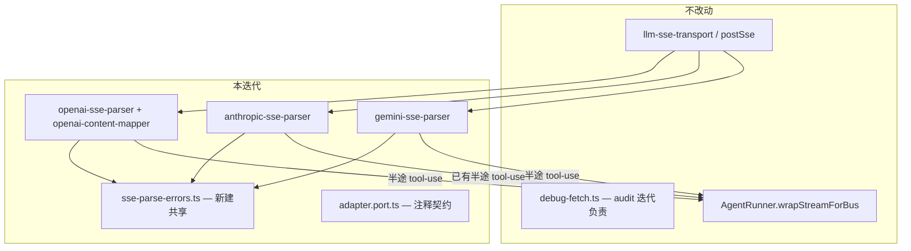

# LLM 流式解析加固（llm-streaming-hardening）技术规格（SPEC）

> **PRD：** [prd.md](./prd.md)  
> **Explore：** [explore.md](./explore.md)  
> **前置 dependency：** [llm-protocol-anthropic-gemini-parity/spec.md](../../../llm-protocol-anthropic-gemini-parity/spec.md)（三协议 `postSse` + parser + abort partial 已落地）  
> **互补（不重复实现）：** [codebase-audit-remediation/spec.md](../../../codebase-audit-remediation/spec.md) — debug-fetch URL 脱敏、`feedSseLines` 抽取、thinking signature 等 **不在本 SPEC 变更清单内**。

## 设计目标

1. **畸形 SSE 可诊断：** parser 层计数 + 可选 debug warn + finish 时「零 block + 有坏行 → 抛错」。
2. **流式 `tool-use` 契约统一：** 以 Anthropic `content_block_stop` 的用户可感知时机为基准——**参数 JSON 完整可解析时** emit；OpenAI/Gemini 补齐半途 emit；finish 去重。
3. **无效 tool JSON 不静默：** 非空字符串 parse 失败时抛 `ProviderError`（本迭代选型，见下）。
4. **最小 diff：** 仅 touch parser/mapper 与测试；不改 `AgentRunner`、Mobile、传输层（除非测试 mock 需要）。

## 总体方案

### 架构（变更面）



### 三协议流式行为矩阵（目标态）

| 能力 | OpenAI | Anthropic | Gemini |
|------|--------|-----------|--------|
| text-delta | ✓ delta.content | ✓ text_delta | ✓ text parts |
| thinking-delta | ✓ reasoning_content | ✓ thinking_delta | ✓ thought parts |
| tool-use emit 时机 | **参数 JSON 可 parse 时**（增量后 try parse） | ✓ content_block_stop（不变） | **参数 JSON 可 parse 时** |
| tool-use finish 去重 | ✓ `emittedToolIndices` | N/A（block 级已 emit） | ✓ `emittedFunctionCallKeys`（新建 Set） |
| 畸形 SSE 计数 | ✓ | ✓ | ✓ |
| 零 block + 坏行 | ProviderError | ProviderError | ProviderError |
| abort partial | 不变 | 不变 | 不变 |

---

## 模块设计

### 1. 共享：`logic/sse-parse-errors.ts`（新建）

集中畸形行处理，避免三 parser 复制逻辑。

```ts
/** Parser state slice shared by all SSE parsers. */
export interface SseParseDiagnostics {
  malformedLineCount: number;
}

export function isSseParseDebugEnabled(): boolean {
  // 优先 NM_DEBUG_LLM_SSE=1；fallback NM_DEBUG_LLM_FETCH=1（与 transport 调试一致）
  // 不读取/修改 debug-fetch 的 redact 逻辑
}

export function recordMalformedSseLine(
  diag: SseParseDiagnostics,
  payload: string,
): void {
  diag.malformedLineCount += 1;
  if (isSseParseDebugEnabled()) {
    const prefix = payload.length > 120 ? payload.slice(0, 120) + "…" : payload;
    console.warn("[llm-sse] malformed JSON line:", prefix);
  }
}

export function assertSseParseSucceededOrThrow(
  diag: SseParseDiagnostics,
  blocks: readonly unknown[],
  protocol: LlmProtocolKind,
): void {
  if (blocks.length === 0 && diag.malformedLineCount > 0) {
    throw new ProviderError(
      `${protocol}: stream ended with no content after ${diag.malformedLineCount} malformed SSE line(s)`,
      "MALFORMED_SSE", // 新增 code；若 enum 不便扩展则用 HTTP_ERROR + 固定 message 前缀
    );
  }
}
```

**接入点：**

| 文件 | 变更 |
|------|------|
| `openai-sse-parser.ts` | `OpenAiSseParserState` 含 `malformedLineCount`；`JSON.parse` catch → `recordMalformedSseLine`；`finishOpenAiSse` / partial 出口前 `assertSseParseSucceededOrThrow` |
| `anthropic-sse-parser.ts` | 同上 |
| `gemini-sse-parser.ts` | 同上 |

**不改动：** `sse-line-buffer.ts` 的 `feedSseLines` 实现（即使 audit 尚未抽取，本迭代也不二次重构）。

### 2. 流式 `tool-use` parity

#### 2.1 OpenAI（`openai-content-mapper.ts`）

在 `openAiStreamDeltaToEvents` 的 tool_calls 累积循环末尾，对每个 `index`：

```ts
function tryEmitOpenAiToolUseIfComplete(
  state: OpenAiSseParserState,
  index: number,
  onStream?: (event: LlmStreamEvent) => void,
): void {
  if (state.emittedToolIndices.has(index)) return;
  const acc = state.toolCalls.get(index);
  if (acc == null || acc.name === "" || acc.argumentsJson === "") return;
  let input: Record<string, unknown>;
  try {
    input = JSON.parse(acc.argumentsJson) as Record<string, unknown>;
  } catch {
    return; // 尚未完整；等后续 delta 或 finish 处理 invalid
  }
  state.emittedToolIndices.add(index);
  onStream?.({ type: "tool-use", id: acc.id, name: acc.name, input });
}
```

- `openAiStreamAccumulatorsToBlocks`：finish 时仅对 **未在 `emittedToolIndices` 中** 的 index emit（兼容 never-parseable 的 edge case）。
- **无效 JSON（非空但永不 parse 成功）：** finish 时对每个 such index 调 `throwInvalidToolArgumentsError(acc.argumentsJson, "openai")`，**不** push `input: {}` block（或 push block 前抛错——二选一；本 SPEC 选型 **抛错**，与 PRD T4 一致）。

#### 2.2 Gemini（`gemini-sse-parser.ts`）

- `GeminiSseParserState` 新增 `emittedFunctionCallKeys: Set<string>`（key = `acc.id` 或 stable name+ordinal）。
- 在 `mergeFunctionCallPart` 后调用 `tryEmitGeminiToolUseIfComplete`（逻辑同 OpenAI）。
- `emitToolUsesFromAccumulators`：skip 已在 Set 中的项；invalid JSON 在 finish 抛错。

#### 2.3 Anthropic（`anthropic-sse-parser.ts`）

- **逻辑不变**；`flushActiveBlock` 内 tool_use 半途 emit 保持。
- finish 时 invalid `partial_json`：若 block 已 emit 但 JSON 非法，在 `content_block_stop` 路径改为抛错（当前 catch 变 `{}` 的行为改为 `throwInvalidToolArgumentsError`）。

#### 2.4 端口文档（`adapter.port.ts`）

在 `LlmStreamEvent` 的 `tool-use` 分支增加 JSDoc：

> 流式对话中，当某次 tool call 的 **input 对象已完整且 JSON 解析成功** 时 emit，每种协议每个 tool call 至多一次。Anthropic 在 content block 结束；OpenAI/Gemini 在 arguments 字符串首次成为合法 JSON 时。Stream 正常结束前可能已收到 `tool-use`；`done` 事件仍携带完整 `blocks`。

**上层影响：** `AgentRunner.wrapStreamForBus` 已转发 `tool-use` → `EVENT_AGENT_STREAM_TOOL_USE`，**无需改代码**；OpenAI/Gemini 用户将更早看到工具指示（与 Anthropic 对齐）。

### 3. 无效 tool JSON 统一错误

新建 `logic/tool-arguments-parse.ts`：

```ts
export function parseToolArgumentsJson(
  raw: string,
  protocol: LlmProtocolKind,
): Record<string, unknown> {
  if (raw === "") return {};
  try {
    return JSON.parse(raw) as Record<string, unknown>;
  } catch {
    throw new ProviderError(
      `${protocol}: invalid tool arguments JSON (${truncate(raw, 80)})`,
      "INVALID_TOOL_ARGUMENTS",
    );
  }
}
```

- 半途 emit：`JSON.parse` 失败 **silent return**（参数未完整）。
- finish / block_stop：**必须**走 `parseToolArgumentsJson`（非空即校验）。

---

## 最终项目结构（增量）

```
packages/core/src/infra/llm-protocol/logic/
├── sse-parse-errors.ts          # NEW
├── tool-arguments-parse.ts      # NEW
├── openai-sse-parser.ts         # MOD: diagnostics + finish assert
├── openai-content-mapper.ts     # MOD: midway tool-use + finish invalid JSON
├── anthropic-sse-parser.ts      # MOD: diagnostics + invalid JSON on stop
├── gemini-sse-parser.ts         # MOD: diagnostics + midway tool-use + emitted set
└── adapter.port.ts              # MOD: JSDoc only

packages/core/test/infra/llm-protocol/
├── sse-parse-errors.test.ts     # NEW
├── tool-arguments-parse.test.ts # NEW
├── openai-sse-parser.test.ts    # EXT: M1/M3/T1/T4
├── anthropic-sse-parser.test.ts # EXT: M2/T3/T4
├── gemini-sse-parser.test.ts    # EXT: M2/T2/T4
└── openai-sse-parser.test.ts    # malformed SSE 编号 SSE-MAL-*

packages/core/test/provider/
└── protocol-anthropic.test.ts   # EXT: stream tool parity (T5)
```

### 明确不 touch（避免与 audit / parity 重复）

| 路径 | 负责迭代 |
|------|----------|
| `logic/debug-fetch.ts` | codebase-audit-remediation |
| `logic/sse-line-buffer.ts` 结构重构 | codebase-audit-remediation（已存在则仅使用） |
| `logic/inline-thinking-parser.ts` signature | codebase-audit-remediation |
| `impl/*.adapter.ts` chatStream 模板 | 本迭代 **不改**（除非 finish 抛错冒泡需 adapter catch 调整——预期 parse 错误自然向上抛） |
| `anthropic.adapter.ts` max_tokens | 后续 / quality-backlog |
| `gemini.adapter.ts` URL key | 后续 |

---

## 变更点清单

| 文件 | 类型 | 说明 |
|------|------|------|
| `sse-parse-errors.ts` | 新增 | 畸形行计数、debug warn、finish assert |
| `tool-arguments-parse.ts` | 新增 | 非空 invalid JSON 抛错 |
| `openai-sse-parser.ts` | 修改 | 接入 diagnostics；finish assert |
| `openai-content-mapper.ts` | 修改 | `tryEmitOpenAiToolUseIfComplete`；finish 用 shared parse |
| `anthropic-sse-parser.ts` | 修改 | diagnostics；tool stop invalid JSON 抛错 |
| `gemini-sse-parser.ts` | 修改 | diagnostics；midway emit + emitted set |
| `adapter.port.ts` | 修改 | `LlmStreamEvent` 契约 JSDoc |
| `ProviderError` code enum | 修改 | 新增 `MALFORMED_SSE`、`INVALID_TOOL_ARGUMENTS`（若已有扩展点） |

---

## 测试策略

### 单元测试（parser 层）

| ID | 文件 | 场景 |
|----|------|------|
| SSE-MAL-01 | `openai-sse-parser.test.ts` | 仅坏行 → finish 抛 `MALFORMED_SSE` |
| SSE-MAL-02 | 三 parser 各 1 | 坏行 + 合法 text → 有 block，计数 1，不抛错 |
| SSE-MAL-03 | `sse-parse-errors.test.ts` | debug env 开/关 warn |
| TU-01 | `openai-sse-parser.test.ts` | 两片 arguments → 第二片后、finish 前 1 次 tool-use |
| TU-02 | `gemini-sse-parser.test.ts` | 同上 functionCall args |
| TU-03 | `anthropic-sse-parser.test.ts` | 回归 content_block_stop emit |
| TU-04 | 三 parser | 非空非法 JSON → `INVALID_TOOL_ARGUMENTS` |
| TU-05 | `openai-sse-parser.test.ts` | finish 不重复 emit（emittedToolIndices） |

### Provider 层

| ID | 文件 | 场景 |
|----|------|------|
| P-ANT-01 | `protocol-anthropic.test.ts` | HTTP mock stream + tool_use 多 chunk → midway tool-use 事件 |
| P-ANT-02 | 同上 | 与 `protocol-openai.test.ts` tool stream 用例结构对齐 |

### 回归

- 跑 `npm run test:fast`：全量 893+ 用例绿。
- 现有 abort partial、thinking-delta、RN transport 用例 **零 diff**（除非 tool-use 时机 intentionally 提前——更新断言顺序，不删覆盖）。

---

## 分 PR 建议

| PR | 内容 | 风险 |
|----|------|------|
| PR-1 | `sse-parse-errors.ts` + 三 parser diagnostics + SSE-MAL-* 测试 | 低；可能暴露网关坏流导致原先「空回复」变显式错误（**预期改进**） |
| PR-2 | tool-use midway emit + invalid JSON + provider anthropic 测试 | 中；Mobile 工具指示可能提前出现——与 Anthropic 一致，属产品对齐 |

---

## 风险与回滚

| 风险 | 缓解 |
|------|------|
| 网关间歇坏行导致误抛 `MALFORMED_SSE` | M3 混流不抛；仅「零 block + 有坏行」抛；可后续加阈值 |
| OpenAI 模型输出 trailing garbage 使 JSON 延迟 parse | 半途 try parse 失败 silent，直到合法或 finish 抛 INVALID |
| 与 audit 并行改同一 parser 文件冲突 | SPEC 列明不 touch debug-fetch；PR 尽量小且 parser 分 PR |
| `ProviderError` 新 code 上层未处理 | 与现有 HTTP_ERROR 一样冒泡至 Agent run 失败 UI；单测锁定 message |

**回滚：**  revert PR-2 仅恢复 finish-only tool-use；revert PR-1 恢复静默丢弃（不推荐）。

---

## 验收勾连（PRD → 测试）

| PRD ID | 测试 ID |
|--------|---------|
| M1–M2 | SSE-MAL-01, anthropic/gemini 等价 |
| M3 | SSE-MAL-02 |
| M4 | SSE-MAL-03 |
| T1–T3 | TU-01 – TU-03 |
| T4 | TU-04 |
| T5 | P-ANT-01, P-ANT-02 |
| R1 | `npm run test:fast` |
| R2 | 现有 protocol-openai / gemini abort 套件 |

---

**生成路径：** `.apm/kb/docs/Iterations/core-explore-remediation/features/llm-streaming-hardening/spec.md`
