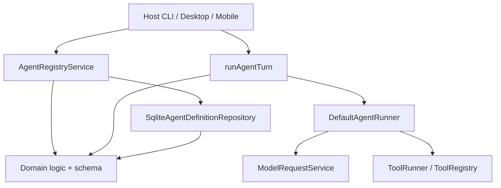

# Agent 领域代码审查

## 概述

Agent 领域定义**工作区 agent 配置**（显示名称、prompt layout、可选 model pin、runtime limits、tool allow/deny 策略），将其持久化到 SQLite（`agent_definition.prompts_json`），并编排**多步 agent runs**：build prompt → LLM request → tool execution → doom-loop guards → 重复直至 completion、max steps、cancellation 或 error。

宿主通过 `AgentRegistryService`（CRUD）、`runAgentTurn`（dialogue parity）、`createAgentRunner`（custom flows）及事件 actions（带 ephemeral overlay 的 `run-agent`）交互。

## 架构与 DDD 评估

**优势**

- 清晰的分层：domain 层 `model/`（types + Zod wire schema）、`logic/`（纯 validation/resolution）、`repositories/` + `session/` ports，含 SQLite 与 in-memory 实现。
- Service 层负责编排（`DefaultAgentRunner`、`runAgentTurn`），不向 domain logic 泄漏 infra。
- 严格 wire schema 在 parse 时拒绝遗留 key（`prompts.blocks`、`preferredModelId`、嵌套 `model` block）。
- Tool policy validation 在 upsert/run 边界通过 `registeredToolNames` 注入。

**分层缺口**

| 区域 | 位置 | 说明 |
|------|----------|------|
| 公开 API 导出 service impls | `packages/core/src/public/agent.ts:34-36` | `ChatAgentSession`、`createAgentRunner` 模糊了已发布 surface 上的 domain/service 边界。 |
| UI form logic 在 core 中 | `packages/core/src/config-forms/agent/**` | 大型 editor state 模块（约 530 行）与 domain 并列；对共享 desktop/mobile forms 可接受，但扩大 core bundle 范围。 |
| 名称唯一性 + trim | `agent-registry.service.ts:41-51` | 业务规则在 service 中，而非 domain `validateAgentDefinition`。 |
| `config-forms` 重复 tool catalog | `agent-tool-catalog.ts:5-17` vs `FILE_TOOL_NAMES` | Catalog 须与 builtin tools 手动保持同步。 |

**依赖流（简化）**

## 代码风格发现

| 发现 | 位置 | 详情 |
|---------|----------|--------|
| `@module` 路径与文件路径不匹配 | `validate-agent-definition.ts:4` | 文档为 `domain/agent/validate-agent-definition`，文件在 `logic/` 下。 |
| 同上 | `agent-definition.schema.ts:4` | 文档为 `domain/agent/agent-definition.schema`（缺少 `model/`）。 |
| 同上 | `doom-loop.ts:4` | 文档为 `domain/agent/doom-loop`（缺少 `logic/`）。 |
| 中英混排错误信息 | `agent-registry.service.ts:71` | `DUPLICATE_NAME` 消息为中文；`AGENT_NOT_FOUND` 为英文。 |
| 同上 | `run-agent-turn.ts:167,175` | 面向用户的 `AgentTurnError` 消息为中文；其余 runtime errors 为英文。 |
| port 中的中文行内注释 | `agent-definition.port.ts:13-15` | `getRawWire` / `exists` 注释为中文，周围 JSDoc 为英文。 |
| catch 缩进不一致 | `agent-runner.ts:361-374` | `runError` 分支缩进与 `cancelled` 分支不一致（仅影响可读性）。 |
| `agent-runner.ts` 中的 CRLF | 整个文件 | 行尾与多数 sibling 文件使用的 LF 不同。 |

三元/arrow 用法总体克制且可读。Domain 函数体量小且 appropriately pure。

## 可维护性发现

| 发现 | 位置 | 详情 |
|---------|----------|--------|
| `DEFAULT_MAX_STEPS = 20` 三处重复 | `agent-runner.ts:73`, `run-agent-turn.ts:272`, `run-agent.handler.ts:98` | 三处相同默认字面量；`runAgentTurn` 还绕过 runner 内部默认解析。 |
| `cliModelId` 已声明但未接线 | `agent.port.ts:20`, `resolve-application-model-id.ts:25-29` | `AgentRunOptions.cliModelId` 与 domain resolver 支持 CLI override；`resolveApplicationModelIdForRun`（`agent-run-shared.ts:69-72`）与 `runAgentTurn` 从未传入。仅在 domain 层测试（`resolve-application-model-id.test.ts:6-14`）。 |
| 死代码 `stopReason: "error"` 变体 | `agent-run-result.ts:22` | Runner 从不设置 `stopReason = "error"`；失败时抛出（`agent-runner.ts:361-373`）。 |
| 未使用的 `AgentConfigError` codes | `agent-config-errors.ts:10-15` | `INVALID_COMPACT`、`PROTOCOL_MISMATCH`、`AGENT_IN_USE` 已定义，但在已审查的 agent domain 或 services 中无引用。 |
| 保留的 deprecated option | `run-agent-turn.ts:85-86` | `awaitMessageCheckpoint` 标记 deprecated；core 中无剩余用法。 |
| Deprecated form helpers | `agent-editor-state.ts:63-78`, `joinPersistBlocksForLayout` overload at `167-178` | 遗留 YAML import / 旧 persist API 仍被导出。 |
| 重复的 tool name 列表 | `agent-tool-catalog.ts:5-17` | 与 `FILE_TOOL_NAMES` + `chat_grep` 并行；tools 变更时有 drift 风险。 |
| `assertUniqueDisplayName` 吞掉 decode errors | `agent-registry.service.ts:64-69` | `repository.get` 失败时回退为以 `otherId` 作为 display name — 在唯一性检查期间掩盖损坏行。 |
| Registry list + get N+1 | `agent-registry.service.ts:58-69` | 每次 upsert 加载所有 agent definition。对小工作区可接受，但扩展性差。 |

## 正确性 / Bug 风险

| 严重程度 | 发现 | 位置 | 详情 |
|----------|---------|----------|--------|
| **P1** | `session.message.received` 忽略 `publishRunLifecycle` | `agent-runner.ts:377-379` | 即使 `publishRunLifecycle === false`，当 `assistantAppendCount > 0` 时仍会发布 `EVENT_SESSION_MESSAGE_RECEIVED`。其他 lifecycle events 正确门控于 `publishRunLifecycle`（`agent-runner.ts:95-97,268,347,381`）。事件触发的 `run-agent` 设置 `publishRunLifecycle: false`（`run-agent.handler.ts:101`）但仍发出此事件。 |
| **P1** | Doom-loop 错误消息硬编码 threshold | `agent-runtime-errors.ts:30-34` | `agentDoomLoop` 始终显示「3 times」，而 `assertNoDoomLoop` 接受可配置 `threshold`（`doom-loop.ts:36-37`, `agent-runner.ts:113-114`）。当 `runtime.doomLoopThreshold` ≠ 3 时具有误导性。 |
| **P2** | 用 `JSON.stringify` 比较 tool inputs | `doom-loop.ts:24-25` | `sameInput` 比较序列化 JSON；键序不同但值相同的对象被视为不同调用。对 LLM 输出 unlikely，但理论上较弱。 |
| **P2** | 损坏 agent blocks 导致 display-name 无法复用 | `agent-registry.service.ts:64-69` | 若 agent id `writer` 的 `prompts_json` 损坏，upsert 另一个 display name 为 `writer` 的 agent 会抛出 `DUPLICATE_NAME`，因为回退使用 `otherId`。操作者无法在不删除损坏行的情况下 reclaim 该名称。 |
| **P2** | 静默 checkpoint 失败 | `agent-runner.ts:337-339` | `void messageCheckpoint.capture(...).catch(() => undefined)` — VFS mutation checkpoint 丢失不可见。 |
| **P2** | Ephemeral overlay `hideRange` 跳过 overlay | `ephemeral-overlay-agent-session.ts:50-52` | 仅委托给 `base.hideRange`；overlay messages 无法 hide。今日风险低，因 compaction 路径使用 persisted session，且 `persistMessages: false` 跳过 compaction（`agent-runner.ts:174`）。 |
| **P2** | 隐式 current-agent 回退 | `agent-run-shared.ts:38-39` | state 无 current agent id 时，使用 `listAgentIds()[0]`，除 repo 中 SQL `ORDER BY agent_id ASC` 外无排序保证。存在多个 agent 时可能令人意外。 |
| **P2** | 空 `tools.allow` → 零 tools | `resolve-agent-tool-registry.ts:19-20`, test `agent-tool-policy.test.ts:45-55` | 有意为之，但通过 UI 易误配（`buildToolsPolicyFromSelection` 且 `mode: "allow"`、`toolsSelected` 为空 → `{ allow: [] }`）。Agent 运行时无 tools。 |
| **P2** | Allow-list 在 resolve 时未与 registry 求交 | `resolve-agent-tool-registry.ts:19-20` | `policy.allow.map(normalize...)` 未过滤至 `allNames`；registry 中不存在的名称被静默省略。Validation 通常阻止 unknown names；若跳过 validation，LLM 看到的 tools 可能少于 allow list 所示。 |
| **P3** | `resolveSummaryApplicationModelId` 要求 workspace | `resolve-application-model-id.ts:36,45-49` | `workspaceModelId: string` 为必填（非 optional），而 dialogue resolver 将其视为 optional — 契约不一致。 |
| **P3** | `toolUseWindow` cap 启发式 | `agent-runner.ts:308-310` | Window 在 `doomLoopCrossRoundWindow * 4` 处 trim；非仅由 `crossRoundWindow` 推导。可用但未文档化。 |

**Race / concurrency**：隐含每 session 单 runner 假设；`AgentSession.append` 无锁。同 session 并发 runs 可能交错 messages（宿主责任）。

**Type safety**：通过 Zod + strict schemas 总体强。`getRawWire` 按设计返回 `unknown`（`agent-definition.port.ts:14`）。

## 积极模式

- **Schema 边界的 legacy migration**：`rejectLegacyPromptKeys` / `assertNoLegacyAgentFields`（`agent-definition.schema.ts:42-66,109-127`）快速失败并给出可操作消息。
- **Doom-loop 覆盖**：threshold、cross-round window、alternation patterns 的单元测试（`doom-loop.test.ts`）。
- **Tool policy**：互斥、legacy name normalization（`vfs.read` → `read`）、已移除 tools 的 migration hints（`validate-agent-tool-policy.ts:11-18,33-38`）。
- **Ephemeral overlay session**：事件触发 agent 不持久化 turns 的清晰分离（`ephemeral-overlay-agent-session.ts`, `run-agent.handler.ts:100`）。
- **VFS turns 的 trailing-user reorder**：`flushPendingUserVfsTurnsWithTrailingUserReorder`（`run-agent-turn.ts:120-151`）防止 U-U-A message ordering bugs。
- **Delete 无需 decode**：`exists()` + `delete()` 绕过损坏 JSON（`agent-registry-delete-invalid.test.ts`）— 可操作性好。
- **Stream bus deferral**：`wrapStreamForBus` 使用 `queueMicrotask` 避免在 stream callback 期间同步 publish（`agent-runner.ts:434-458`，在 `agent-runner-stream-bus.test.ts` 中测试）。
- **Wire round-trip 测试**：YAML encode/decode、lifecycle `once` omission（`agent-definition-io.test.ts`）。

## 建议

### P0 — 未发现

在常规配置下的主对话路径中，未发现会损坏数据或静默崩溃的已验证 logic bugs。影响最大的问题为行为不一致与可操作性缺口。

### P1 — 尽快修复

1. **将 `EVENT_SESSION_MESSAGE_RECEIVED` 门控于 `publishRunLifecycle`**（`agent-runner.ts:377-379`）— 与其他 lifecycle events 对齐，或文档化 intentional exception。
2. **使 doom-loop 错误消息反映配置的 threshold** — 将 threshold 传入 `agentDoomLoop` 或动态格式化消息（`agent-runtime-errors.ts:30-34`, `doom-loop.ts:46`）。
3. **在 run 路径中接线 `cliModelId`** — 扩展 `resolveApplicationModelIdForRun` / `runAgentTurn` 以接受 CLI override 并传入 `runner.run`，或若宿主始终 pre-resolve 则移除未使用的 `AgentRunOptions.cliModelId`。

### P2 — 提升可维护性 / 边界情况

4. **集中 `DEFAULT_MAX_STEPS`** — 从 domain 或 runner 单一导出，供 `runAgentTurn` 与 `run-agent.handler` 使用。
5. **加固 corrupt agents 的 duplicate-name 检查** — decode 失败时 skip 或暴露 `decodeError`，而非以 `otherId` 作为 name 比较（`agent-registry.service.ts:64-69`）。
6. **在 upsert 时校验非空 allow/deny** — mode 为 allow 时拒绝 `tools.allow: []`（或在 UI 中明确视为「no tools」）。
7. **记录或暴露 checkpoint capture 失败** — 替换静默 `.catch(() => undefined)`（`agent-runner.ts:337-339`）。
8. **移除或实现死 API surface** — `stopReason: "error"`、未使用的 `AgentConfigError` codes、deprecated `awaitMessageCheckpoint`。
9. **与 `FILE_TOOL_NAMES` 同步 tool catalog** — 从 registry 或 shared constant 推导 `BUILTIN_TOOL_CATALOG`（`agent-tool-catalog.ts`）。
10. **修正 `@module` JSDoc 路径**以匹配 `logic/` / `model/` 目录。

### P2 — 文档 / UX

11. **文档化 state 中无 current agent 时的隐式回退**（`agent-run-shared.ts:38-39`）。
12. **统一错误消息语言**（中文 vs 英文）以符合产品约定。

### P3 — 可选优化

13. 若观察到 doom-loop false negatives，用 stable deep equality 替换 `JSON.stringify` input 比较。
14. 若将来需要 overlay compaction，在 ephemeral overlay 上实现 `hideRange`。
15. 规范化 `agent-runner.ts` 中的行尾。

---

*审查范围：`packages/core/src/domain/agent/**`、`packages/core/src/service/agent/**`、`packages/core/src/bootstrap/agent/**`、`packages/core/test/agent/**`、`packages/core/src/errors/agent*.ts`、`packages/core/src/public/agent.ts`、`packages/core/src/config-forms/agent/**` 下的所有文件。交叉引用 `run-agent.handler.ts` 以了解 runner 集成。*
