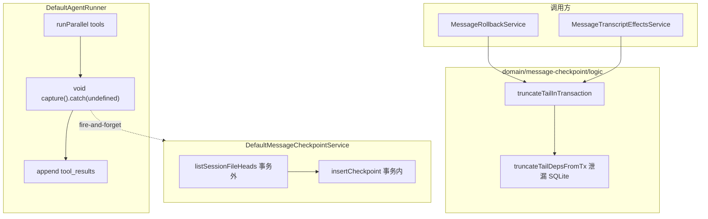
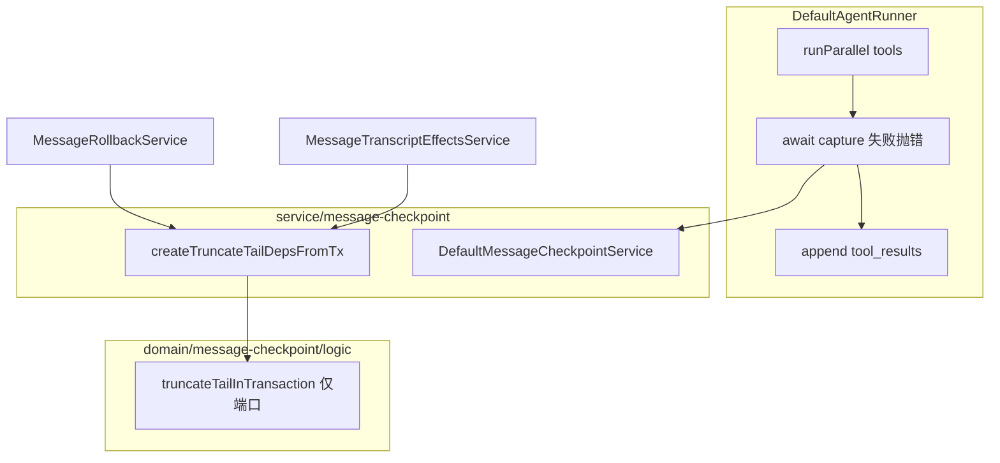

# Message Checkpoint 与 Agent 集成加固 技术规格（SPEC）

> **PRD**：[prd.md](./prd.md)  
> **前置 SPEC**：[message-checkpoint-v2/spec.md](../../../message-checkpoint-v2/spec.md)  
> **代码基线**：`packages/core`（2026-06-21 CR 审查时点）

---

## 设计目标

1. **消除 capture 静默失败**：`DefaultAgentRunner` 同步 await capture，失败进入可观测错误路径。
2. **修复 truncate-tail 分层**：infra 仓储装配迁出 `domain/`，域函数保持纯端口依赖。
3. **零 v2 语义漂移**：不改变 checkpoint 边界、rollback reconcile、GC 规则。
4. **最小 diff**：不引入 schema 迁移、不重构 rollback 计划解析。

---

## 现状与差距

### 架构（当前）



| 差距 ID | 位置 | 问题 |
|---------|------|------|
| G1 | `agent-runner.ts:337-339` | `void capture(...).catch(() => undefined)` 吞错 |
| G2 | `truncate-tail-in-transaction.ts:7-45` | 域模块构造 `Sqlite*Repository` |
| G3 | `message-checkpoint.service.ts:30-50` | VFS scan 在 insert 事务外（**本 SPEC 仅文档化**） |
| G4 | `truncate-tail-in-transaction.ts:57-58` | 未使用的 `_tx` 参数易误导 |
| G5 | `run-agent-turn.ts:85-86` | deprecated `awaitMessageCheckpoint` 无引用 |

### 关键代码引用

**Agent capture（待改）：**

```331:340:packages/core/src/service/agent/impl/agent-runner.ts
        if (
          vfsMutated &&
          persistMessages &&
          assistantMessage != null &&
          this.deps.messageCheckpoint != null
        ) {
          void this.deps.messageCheckpoint
            .capture(sessionId, projectId, assistantMessage.id)
            .catch(() => undefined);
        }
```

**Capture 服务（保持不变，除可选注释）：**

```25:51:packages/core/src/service/message-checkpoint/impl/message-checkpoint.service.ts
  async capture(
    sessionId: string,
    projectId: string,
    messageId: string,
  ): Promise<void> {
    const files = await listSessionFileHeads(
      this.deps.entries,
      projectId,
      sessionId,
    );
    if (files.length === 0) {
      return;
    }

    await this.deps.conn.transaction(async (tx) => {
      const checkpoints = new SqliteMessageCheckpointRepository(tx);
      await checkpoints.insertCheckpoint({ ... });
    });
  }
```

**Truncate-tail 分层泄漏（待迁）：**

```37:45:packages/core/src/domain/message-checkpoint/logic/truncate-tail-in-transaction.ts
export function truncateTailDepsFromTx(tx: TdbcConnection): TruncateTailDeps {
  return {
    messages: new SqliteMessageRepository(tx),
    checkpoints: new SqliteMessageCheckpointRepository(tx),
    sessions: new SqliteSessionRepository(tx),
    revisions: new SqliteVfsRevisionRepository(tx),
    entries: new SqliteVfsEntryRepository(tx),
  };
}
```

---

## 总体方案

### 目标架构



### 定案摘要

| 议题 | 定案 |
|------|------|
| Capture 失败 | **await + rethrow**（保留原始错误栈）；不降级为 warn-only |
| Capture 时机 | tool parallel settled 后、`session.append(tool_results)` **之前**（与现顺序一致，仅 void→await） |
| TOCTOU（G3） | 单写 desktop 可接受；在 `message-checkpoint.service.ts` 模块注释与 PRD 对齐，**本迭代不改** |
| deps 工厂位置 | 新文件 `service/message-checkpoint/truncate-tail-wiring.ts`（或并入 `create-message-checkpoint-services.ts` 导出 `createTruncateTailDepsFromTx`） |
| `_tx` 参数 | **删除** `truncateTailInTransaction` 首参 `_tx`；签名改为 `(deps, params)` |
| `awaitMessageCheckpoint` | **删除** 选项及 `run-agent-turn` 传递 |

---

## 详细变更

### 1. AgentRunner — 同步 capture（G1）

**文件：** `packages/core/src/service/agent/impl/agent-runner.ts`

```typescript
if (
  vfsMutated &&
  persistMessages &&
  assistantMessage != null &&
  this.deps.messageCheckpoint != null
) {
  try {
    await this.deps.messageCheckpoint.capture(
      sessionId,
      projectId,
      assistantMessage.id,
    );
  } catch (error) {
    // 结构化日志（使用项目现有 logger 门面，若无则 console.error + 固定 prefix）
    log.error("checkpoint_capture_failed", {
      sessionId,
      projectId,
      messageId: assistantMessage.id,
      error,
    });
    throw error;
  }
}
```

**行为：**

- capture 失败 → 当前 agent 步 abort，**不** append tool_results（避免「对话已继续但无 checkpoint」）。
- `persistMessages === false`（ephemeral overlay）路径不变：不进入 if。
- 不新增 `AgentRunError` code 除非现有分类需要；优先 **原样 rethrow** 以满足 C2 可断言性。

**文档：** `create-agent-runner.ts` / `agent.port.ts` 在 `messageCheckpoint` 字段加 `@remarks`：mutating 步内同步 capture，失败中断 run。

### 2. Truncate-tail wiring 迁出 domain（G2、G4）

#### 2.1 新增 service 模块

**文件（推荐）：** `packages/core/src/service/message-checkpoint/truncate-tail-wiring.ts`

```typescript
import { truncateTailInTransaction } from "@/domain/message-checkpoint/logic/truncate-tail-in-transaction.js";
// re-export types TruncateTailParams, TruncateTailDeps from domain

export function createTruncateTailDepsFromTx(tx: TdbcConnection): TruncateTailDeps {
  return {
    messages: new SqliteMessageRepository(tx),
    checkpoints: new SqliteMessageCheckpointRepository(tx),
    sessions: new SqliteSessionRepository(tx),
    revisions: new SqliteVfsRevisionRepository(tx),
    entries: new SqliteVfsEntryRepository(tx),
  };
}

export { truncateTailInTransaction };
```

**或** 将 `createTruncateTailDepsFromTx` 放入 `create-message-checkpoint-services.ts` 并 export — 二选一，避免重复工厂。

#### 2.2 精简域模块

**文件：** `packages/core/src/domain/message-checkpoint/logic/truncate-tail-in-transaction.ts`

- **删除** 所有 `Sqlite*` import 与 `truncateTailDepsFromTx`。
- **修改** 签名：

```typescript
export async function truncateTailInTransaction(
  deps: TruncateTailDeps,
  params: TruncateTailParams,
): Promise<void> { ... }
```

- 保留 `TruncateTailDeps`、`TruncateTailParams` 类型于域层（端口类型合法）。

#### 2.3 更新调用方

| 文件 | 变更 |
|------|------|
| `service/message-checkpoint/impl/message-rollback.service.ts` | import `createTruncateTailDepsFromTx`, `truncateTailInTransaction` from wiring；`await truncateTailInTransaction(createTruncateTailDepsFromTx(tx), params)` |
| `service/chat/impl/message-transcript-effects.service.ts` | 同上 |
| `test/message-checkpoint/truncate-tail-in-transaction.test.ts` | import 路径改 wiring |

**注意：** `message.service.ts` 的 `delete` 路径 **不**使用 `truncateTailInTransaction`（单条删 + sweep），无需改动。

### 3. 移除 deprecated `awaitMessageCheckpoint`（G5）

| 文件 | 变更 |
|------|------|
| `service/agent/logic/run-agent-turn.ts` | 删除 `RunAgentTurnOptions.awaitMessageCheckpoint` |
| 全库 grep | 确认无引用后删除传递 |

### 4. 文档化 G3（可选小改）

**文件：** `message-checkpoint.service.ts` — 在 `capture` 上增加 `@remarks`：

> `listSessionFileHeads` runs outside the insert transaction. Acceptable under single-writer desktop; concurrent session writers may capture stale heads.

---

## 测试策略

### 新增 / 修改用例

| ID | 文件 | 场景 |
|----|------|------|
| T1 | `test/agent/agent-runner-checkpoint.test.ts`（新）或扩展现有 agent 测 | mock `messageCheckpoint.capture` reject → runner 抛错；**未**调用 `session.append` tool_results |
| T2 | 同上 | capture resolve → append 正常；与现步序一致 |
| T3 | `truncate-tail-in-transaction.test.ts` | import 改 wiring；三条现有用例绿 |
| T4 | `test/message-checkpoint/capture.test.ts` | 可选：repository throw → capture 向外抛（若 T1 未覆盖 service 层） |
| T5 | 回归 | `rollback.test.ts`、`rollback-degraded.test.ts`、`performance.test.ts` 全绿 |

### 验收命令

```bash
npm run test:fast --workspace=packages/core
# 或窄跑：
npm test --workspace=packages/core -- message-checkpoint agent-runner-checkpoint truncate-tail
```

### 非功能

- capture await 不修改 P1/P2 性能测试阈值（仍 4× CI slack）。
- 不新增 DB migration。

---

## 变更点清单

| 区域 | 文件 | 变更类型 |
|------|------|----------|
| Agent | `service/agent/impl/agent-runner.ts` | await capture + log + throw |
| Agent | `service/agent/logic/run-agent-turn.ts` | 删 deprecated option |
| Agent | `create-agent-runner.ts` / `agent.port.ts` | 文档 remarks |
| Checkpoint service | 新 `truncate-tail-wiring.ts` 或扩 `create-message-checkpoint-services.ts` | 新增 factory |
| Domain | `logic/truncate-tail-in-transaction.ts` | 删 SQLite、删 `_tx` 参数 |
| Rollback | `impl/message-rollback.service.ts` | import 改 wiring |
| Chat | `impl/message-transcript-effects.service.ts` | import 改 wiring |
| Test | `truncate-tail-in-transaction.test.ts` + 新 agent checkpoint 测 | 更新 / 新增 |

---

## 实施步骤

1. **Phase A — Wiring 迁移（可独立 PR）**  
   新增 `createTruncateTailDepsFromTx` → 改 rollback + hideRange + truncate 测试 → 删域内 factory → `test:fast` 绿。

2. **Phase B — Agent capture**  
   void→await + log/throw → 新 agent 测 → 全量回归。

3. **Phase C — 清理**  
   删 `awaitMessageCheckpoint` → grep 无残留 → 补 module 注释（G3）。

建议 **A 先于 B** 合并，降低并行冲突；也可单 PR 交付（改动面小）。

---

## 风险与回滚

| 风险 | 缓解 |
|------|------|
| Capture 抛错中断 Agent 对话 | 比静默错误树更可接受；UI 已有 run 失败展示 |
| hideRange / rollback import 遗漏 | grep `truncateTailDepsFromTx` 全库为 0（域内） |
| 测试 mock 脆弱 | T1 使用 injectable `MessageCheckpointService` fake |

**开发回滚：**  revert 单 PR；无 schema 变更，无数据迁移。

---

## 与 v2 SPEC 的关系

| v2 已定案 | 本 SPEC |
|-----------|---------|
| capture 在 mutating tool settled 后 | **保持**；仅 void→await |
| truncate 与 rollback 同事务 | **保持** |
| path reconcile / anchor 策略 | **不修改** |
| `listIdsAfterSeq` 优化 | **后续** iteration（M2） |

---

## 请确认

确认 PRD 中「capture 失败中断 Agent 步」与「truncate 工厂迁至 service」定案后，按 Phase A→C 实施。
