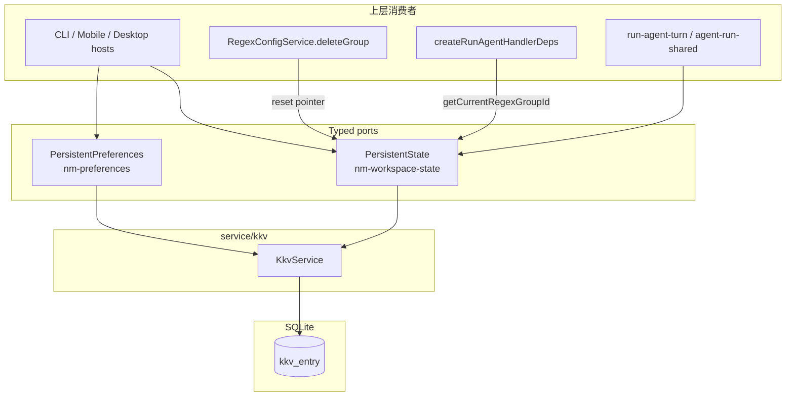

# 代码审查：`persistent-state` + `persistent-preferences`（`packages/core`）

**审查日期：** 2026-06-21  
**范围：**

| 领域 | 路径 |
|------|------|
| 工作区指针 | `packages/core/src/service/persistent-state/**` |
| 行为偏好 | `packages/core/src/service/persistent-preferences/**` |
| 单元测试 | `packages/core/test/persistent-preferences/**`、`packages/core/test/persistent-state/**`、`packages/core/test/persistent/**` |

**审查维度：** KKV 键空间、JSON/值损坏、与 regex/events 指针集成、可维护性。

**已运行测试：** `persistent-state.test.ts` + `persistent-preferences.test.ts` + `multi-consumer-contract.test.ts` — **17/17 通过**。

---

## 执行摘要

`PersistentState` 与 `PersistentPreferences` 是 KKV 之上的**薄 typed port 层**：前者在 `nm-workspace-state` 存 6 个纯字符串工作区指针，后者在 `nm-preferences` 存布尔偏好（`"true"` / `"false"`）及 CLI 可写的原始键值。两者均不读写 legacy `global-config`，与 `events-config`（`nm-events` 单键 JSON 文档）形成清晰分工。

**结论：** 对当前单写者 CLI/desktop 用法**设计合理、实现正确**。范围内未发现 P0 数据损坏 bug。主要风险为**不对称的指针生命周期**（regex 删组会清指针，agent 无对称清理）、**preferences 原始 API 绕过类型校验**、以及 **persistent-state 键常量未集中导出**（与 preferences 的 `preference-keys.ts` 不一致）。

| 维度 | 评级 | 说明 |
|------|------|------|
| KKV 键空间 | 强 | 模块隔离清晰；legacy 迁移边界有测试 |
| 值损坏处理 | 良好 | 无 JSON；布尔有显式错误；指针无格式校验（by design） |
| regex/events 集成 | 良好 | 读路径一致；删组清指针；stale 在消费层处理 |
| 可维护性 | 良好 | 重复 CRUD 样板；state 键 SSoT 弱于 preferences |
| 测试覆盖 | 中等 |  happy path 充分；若干边界与对称性缺口 |

---

## 架构概览



### 与 KKV 其他消费者的对比

| 模块 | 消费者 | 值形态 | 损坏语义 |
|------|--------|--------|----------|
| `nm-workspace-state` | PersistentState | 纯 string（ID） | 任意字符串可读；无 schema |
| `nm-preferences` | PersistentPreferences | `"true"`/`"false"` 或 raw string | 布尔读失败 → `PreferencesError` |
| `nm-events` | EventsConfigStore | 单键 JSON 文档 | `JSON.parse` + Zod decode；有 `assessStored` |
| `global-config` | （legacy，已弃用） | 混合 | **PersistentState 不读取** |

---

## 文件清单

| 文件 | 行数（约） | 角色 |
|------|------------|------|
| `persistent-state/persistent-state.port.ts` | 41 | 6 指针 get/set/reset 接口 + 产品约束文档 |
| `persistent-state/impl/persistent-state.service.ts` | 122 | KKV 实现 |
| `persistent-state/create-persistent-state.ts` | 21 | 工厂 |
| `persistent-preferences/persistent-preferences.port.ts` | 32 | 2 布尔偏好 + list/raw API |
| `persistent-preferences/impl/preference-keys.ts` | 15 | 键常量 SSoT（已公开导出） |
| `persistent-preferences/impl/persistent-preferences.service.ts` | 116 | KKV + 布尔编解码 |
| `persistent-preferences/create-persistent-preferences.ts` | 23 | 工厂 |
| `test/persistent-state/persistent-state.test.ts` | 64 | 指针 CRUD |
| `test/persistent-preferences/persistent-preferences.test.ts` | 73 | 布尔偏好 + 损坏值 |
| `test/persistent/multi-consumer-contract.test.ts` | 41 | 多实例共享 + legacy 隔离 |

---

## 1. KKV 键空间

### 1.1 `nm-workspace-state`（PersistentState）

| 键 | 常量 | 语义 | 写入方约束（port 文档） |
|----|------|------|-------------------------|
| `currentProjectId` | `KEY_CURRENT_PROJECT_ID` | 当前项目 | 通用 |
| `currentSessionId` | `KEY_CURRENT_SESSION_ID` | 当前会话 | 通用 |
| `currentProviderId` | `KEY_CURRENT_PROVIDER_ID` | CLI provider 选择 | **仅 CLI**（`nm provider use`） |
| `currentModelId` | `KEY_CURRENT_MODEL_ID` | 工作区 LLM 模型 | App 为产品权威；可读/写/reset |
| `currentRegexGroupId` | `KEY_CURRENT_REGEX_GROUP_ID` | 活动 regex 组 | 通用；删组时由 RegexConfigService 清 |
| `currentAgentId` | `KEY_CURRENT_AGENT_ID` | 活动 Agent | 通用；无删 agent 时自动清指针 |

键名采用 **camelCase 扁平键**（与 `global-config` legacy 键名相同，但**模块不同**）。实现中常量定义在 `persistent-state.service.ts` 内部，**未**像 preferences 一样单独文件或从 `@novel-master/core` 导出。

### 1.2 `nm-preferences`（PersistentPreferences）

| 键 | 常量 | 类型 | 默认值（未设置时） |
|----|------|------|-------------------|
| `session-fs.versionCheck` | `PREF_KEY_SESSION_FS_VERSION_CHECK` | boolean | `true` |
| `chat.llmStream` | `PREF_KEY_CHAT_LLM_STREAM` | boolean | `true` |

键名采用 **`domain.feature` 点分命名**，与 CLI `nm preferences set/get` 一致。`PREFERENCES_MODULE` 与两个 `PREF_KEY_*` 已从主包入口导出，供 CLI E2E 与测试直接引用。

### 1.3 Legacy 隔离

`multi-consumer-contract.test.ts` 明确验证：在 `global-config` 写入 `currentProjectId` 时，`PersistentState.getCurrentProjectId()` 返回 `undefined`；新写入落在 `nm-workspace-state`。这与 port 文档「missing keys → `undefined`；不读 legacy」一致，迁移边界清晰。

### 1.4 发现与建议

| 严重度 | 问题 | 建议 |
|--------|------|------|
| 低 | workspace 键常量未集中/未导出 | 新增 `workspace-state-keys.ts` 并导出，与 `preference-keys.ts` 对称；CLI/测试避免硬编码字符串 |
| 低 | `setPreference` 可写入任意键 | 符合 v1「CLI raw 写」设计；文档中强调产品 UI 应只用 typed 方法 |
| 信息 | 每工厂各自 `createKkvService(conn)` | 无状态服务，可接受；非性能问题 |

---

## 2. JSON 损坏与值完整性

### 2.1 PersistentState：无 JSON，无格式校验

指针值以 **原始 string** 存取，不经 `JSON.parse`。因此不存在 events-config 类「JSON 语法损坏」问题。

```96:109:packages/core/src/service/persistent-state/impl/persistent-state.service.ts
  private async get(key: string): Promise<string | undefined> {
    try {
      return await this.kkv.get(MODULE, key);
    } catch (error) {
      if (isKkvError(error, "NOT_FOUND")) {
        return undefined;
      }
      throw error;
    }
  }

  private async set(key: string, value: string): Promise<void> {
    await this.kkv.set(MODULE, key, value);
  }
```

**语义：**

- 缺失键 → `undefined`（`NOT_FOUND` 吞掉）
- `reset*` → `delete`；对已删键幂等
- **`set*` 不校验** 空字符串、空白、或 ID 是否存在——由上层 CLI/host 负责

**与消费层交互：**

- `resolveActiveCompiledRules`：`activeGroupId == null || === ""` → `[]`
- `resolveCurrentAgentId`：`fromState != null && !== ""` 才采用 state，否则 registry 首项
- 空字符串指针等价于「未设置」在部分路径成立，但 **DB 中仍占一条 KKV 记录**（与 `undefined` 读语义不一致）

| 严重度 | 问题 | 建议 |
|--------|------|------|
| 低 | 可持久化 `""` 指针 | `set*` 内 `trim` + 空串 reject 或转为 `reset`；或文档明确禁止 |
| 信息 | 无「损坏值」测试 | 对 state 可测 `""` 与 whitespace 的消费行为（agent/regex 路径） |

### 2.2 PersistentPreferences：布尔编解码 + 显式错误

布尔通过 `infra/kkv-value-codec.ts` 存为 `"true"` / `"false"`（**非 JSON**）。

```79:92:packages/core/src/service/persistent-preferences/impl/persistent-preferences.service.ts
  private async getBooleanPref(
    key: string,
    defaultValue: boolean,
  ): Promise<boolean> {
    const raw = await this.getRaw(key);
    if (raw === undefined) {
      return defaultValue;
    }
    try {
      return parseBoolean(raw);
    } catch {
      throw preferencesInvalidValue(key, "boolean", raw);
    }
  }
```

- 键不存在 → 返回 documented default（`true`）
- 非法值（如 `"not-a-bool"`）→ `PreferencesError` code `INVALID_VALUE`（**有测试**）
- `reset*` → delete 键，读时回到 default

**与 compaction-conditions / events-config 对比：** preferences 在**读 typed getter** 时 fail-fast，优于「损坏即当 default/null」的静默降级模式。

| 严重度 | 问题 | 建议 |
|--------|------|------|
| 低 | `llmStream` 非法值无单测 | 复制 `versionCheck` 的 invalid boolean 测试 |
| 低 | `getPreference` / `setPreference` 无类型约束 | CLI 专用；`list` 可能展示损坏 raw 值 |
| 信息 | `list()` 在 list/get 竞态时静默 skip | 合理；单写者场景可接受 |

---

## 3. 与 regex / events 指针集成

### 3.1 数据流

```
currentRegexGroupId (KKV)
    ├─ run-agent-turn: runtime.state.getCurrentRegexGroupId()
    ├─ createRunAgentHandlerDeps: getActiveRegexGroupId → state.getCurrentRegexGroupId()
    └─ resolveActiveCompiledRules(regexConfig, activeGroupId) → [] if stale/missing
```

Regex **组数据**在 SQLite（`regex_group` / `regex_rule`）；**活动组指针**仅在 KKV。这与 [regex 域审查](../domain/regex.md) 描述一致。

### 3.2 写路径与生命周期

**删组清指针（已实现）：**

```88:96:packages/core/src/service/regex/impl/regex-config.service.ts
  async deleteGroup(groupId: string): Promise<void> {
    await this.getGroup(groupId);
    await this.deps.groups.delete(groupId);
    if (this.deps.state) {
      const current = await this.deps.state.getCurrentRegexGroupId();
      if (current === groupId) {
        await this.deps.state.resetCurrentRegexGroupId();
      }
    }
  }
```

- `createRegexConfigService(conn, state?)`：`state` 可选；**未注入则删组不清指针**
- 测试 `R8: deleteGroup resets current pointer when state injected` 覆盖 happy path

**Stale 指针（消费层防御）：**

```16:31:packages/core/src/domain/regex/logic/resolve-active-regex-rules.ts
export async function resolveActiveCompiledRules(
  config: ActiveRegexRulesSource,
  activeGroupId: string | undefined,
): Promise<CompiledRegexRule[]> {
  if (activeGroupId == null || activeGroupId === "") {
    return [];
  }
  try {
    await config.getGroup(activeGroupId);
  } catch (e: unknown) {
    if (e instanceof RegexError && e.code === "NOT_FOUND") {
      return [];
    }
    throw e;
  }
  return config.listCompiledRulesForGroup(activeGroupId);
}
```

指针指向已删组 → **静默无规则**，不抛错。用户可能不知 regex 未生效，但 agent run 不会崩溃。

### 3.3 Events：`run-agent` action

```60:62:packages/core/src/service/events/create-event-orchestrator.ts
    getWorkspaceModelId: () => input.state.getCurrentModelId(),
    regexConfig: input.regexConfig,
    getActiveRegexGroupId: () => input.state.getCurrentRegexGroupId(),
```

`runRunAgentAction` 将 `activeRegexGroupId` 传入 `runner.run`，与正常 agent turn 路径对齐。Events 配置本身在 `nm-events`，**不**存储 regex/agent 指针——职责分离正确。

### 3.4 Agent 指针（不对称）

| 指针 | 设置 | 删实体时清指针 | Stale 行为 |
|------|------|----------------|------------|
| `currentRegexGroupId` | state / CLI | ✅ `deleteGroup` + state | `[]` rules |
| `currentAgentId` | state / CLI | ❌ 无对称 hook | `AgentRunResolveError`（若 registry 也无 fallback） |

`resolveCurrentAgentId` 在 state 空时回退 registry 第一个 id；若 state 指向已删 agent 且非空，则 `resolveCurrentAgentDefinition` 抛错。与 regex 的「静默降级」策略**不一致**，但错误更显式。

| 严重度 | 问题 | 建议 |
|--------|------|------|
| 中 | Agent 删除未清 `currentAgentId` | AgentRegistry 删除时注入 `PersistentState` 并重置（mirror regex R8） |
| 低 | `createRegexConfigService` 不传 state 时指针泄漏 | 文档 + bootstrap 保证 prod 始终注入 |
| 信息 | events run-agent 不读 `currentAgentId` | 符合设计：action params 显式 `agentId` |

---

## 4. 可维护性

### 4.1 优点

1. **Port 文档即契约**：provider/model 的平台差异、legacy 不读、v2 扩展策略（typed methods only）写在 port 上。
2. **Preferences 键 SSoT**：`preference-keys.ts` + 主包导出，CLI E2E 与 core 测试共用常量。
3. **错误模型一致**：`NOT_FOUND` → `undefined` / 幂等 reset；布尔损坏 → 域错误。
4. **薄实现**：两个 service 均 ~120 行，逻辑透明，无过度抽象。
5. **KKV 使用指引**：`service/kkv/index.ts` 明确产品代码应优先 typed ports。

### 4.2 重复与不对称

**State vs Preferences 实现重复：**

两者均有相同的 `getRaw` / `deletePref` / `NOT_FOUND` 处理模式。可提取 package-private 辅助（如 `kkv-string-store.ts`），但当前体量下**提取收益有限**，属低优先级 DRY。

**键常量不对称：**

| | Preferences | State |
|---|-------------|-------|
| 常量文件 | `preference-keys.ts` | 内联于 service |
| 公开导出 | ✅ index.ts | ❌ |
| CLI 硬编码风险 | 低 | 中（若未来 CLI 直接写 KKV） |

**Port 扩展策略：**

`PersistentPreferences` 注释「v2 extends via explicit typed methods (no raw UI writes)」——与 `getPreference`/`setPreference` 并存。新偏好应加 typed getter/setter + `preference-keys` 常量，避免 UI 走 raw API。

### 4.3 公共 API

主包 `@novel-master/core` 导出：

- `createPersistentState` / `PersistentState`
- `createPersistentPreferences` / `PersistentPreferences`
- `PreferencesError`
- `PREFERENCES_MODULE`, `PREF_KEY_*`

KKV 子路径**故意不**作为产品 API（见 kkv 审查）。PersistentState 无对应 workspace 键导出。

---

## 5. 测试覆盖

### 5.1 已有测试

| 套件 | 用例数 | 覆盖点 |
|------|--------|--------|
| `persistent-state.test.ts` | 6 | 6 指针 round-trip；missing；reset；regex/agent 指针 |
| `persistent-preferences.test.ts` | 8 | 默认 true；round-trip；reset；invalid boolean；list 排序；llmStream v2 |
| `multi-consumer-contract.test.ts` | 3 | 同连接多实例；legacy `global-config` 隔离 |
| `regex-config.service.test.ts` (R8) | 1 | 删组清 regex 指针 |

**grep `persistent-state` in test/：** 除上述外，`test/helpers/novel-master.ts` 装配 fixture；`test/service/agent/*` 使用 mock state（非集成）。

### 5.2 缺口

| 优先级 | 缺口 | 说明 |
|--------|------|------|
| P2 | `chat.llmStream` invalid boolean | 与 versionCheck 对称 |
| P2 | `setPreference` / `getPreference` round-trip | raw API 无 core 单测（CLI E2E 有部分覆盖） |
| P3 | 空字符串 pointer 行为 | state set + agent/regex 消费 |
| P3 | `list()` 多键排序 | 仅单键场景 |
| P3 | preferences 两实例 llmStream 共享 | multi-consumer 只测 versionCheck |

---

## 6. 建议优先级汇总

| 优先级 | 项 | 动作 |
|--------|-----|------|
| P1 | — | 范围内无阻塞项 |
| P2 | Agent 删后 stale `currentAgentId` | Agent 删除路径重置指针（若存在对称 registry delete） |
| P2 | workspace 键 SSoT | 提取 `workspace-state-keys.ts` 并按需导出 |
| P3 | 空串指针 | set 时 normalize 或文档约束 |
| P3 | 测试补全 | llmStream invalid boolean；raw preference API |
| P3 | DRY 辅助 | 可选 shared KKV string helpers |

---

## 7. 结论

`persistent-state` 与 `persistent-preferences` 是 core 中**职责清晰、边界干净**的 KKV 消费者：模块命名与 legacy 隔离明确，preferences 对布尔损坏 fail-fast，regex 指针在删组与 stale 解析两层均有防护，events `run-agent` 正确复用工作区 regex/model 指针。

主要改进空间在**跨域生命周期对称性**（agent 指针）、**键常量工程化**（对齐 preferences），以及**少量边界测试**——均属增强项，不影响当前主路径投产判断。

**总体评级：B+**（与 [kkv 域](../domain/kkv.md)、[regex 域](../domain/regex.md) 一致）。
