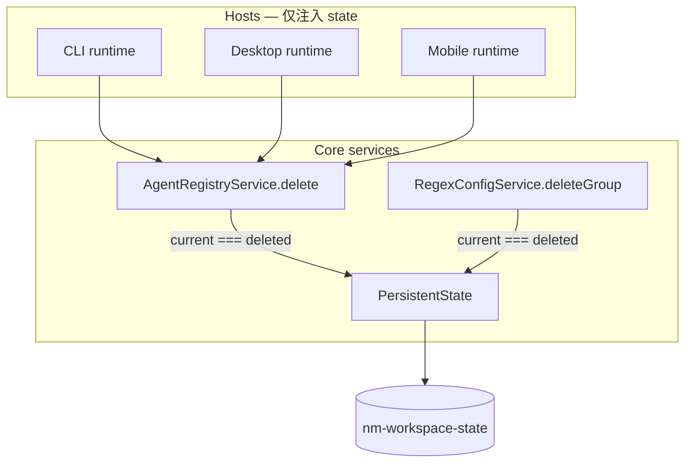

# 工作区指针生命周期对称性（persistent-state-lifecycle）技术规格（SPEC）

## 设计目标

- 在 **Core `AgentRegistryService.delete`** 中实现与 **`RegexConfigService.deleteGroup`** 对称的 `currentAgentId` 清理。
- 三端 runtime 与 CLI 统一通过 **`createAgentRegistryService(conn, state)`** 注入共享 `PersistentState`。
- 提取 **`workspace-state-keys.ts`** 作为 `nm-workspace-state` 键名 SSoT，对齐 `preference-keys.ts` 工程化水平。
- **不改变** `PersistentState` port 方法签名与 KKV module 名；**不改变** `resolveCurrentAgentId` / `resolveCurrentAgentDefinition` 算法。

**与 PRD 对齐：** 删当前 Agent 时 **仅 reset 指针**，不在 Core 内写入另一个 agent id。

---

## 现状（代码锚点）

### Regex 参考实现（目标镜像）

```88:96:packages/core/src/service/regex/impl/regex-config.service.ts
  async deleteGroup(groupId: string): Promise<void> {
    await this.getGroup(groupId);
    await this.deps.groups.delete(groupId);
    if (this.deps.state) {
      const current = await this.deps.state.getCurrentRegexGroupId();
      if (current === groupId) {
        await this.deps.state.resetCurrentRegexGroupId();
      }
    }
  }
```

工厂：`createRegexConfigService(conn, state?)`，JSDoc 注明 delete 副作用。测试：`regex-config.service.test.ts` **R8**。

### Agent 现状缺口

```76:81:packages/core/src/service/agent/impl/agent-registry.service.ts
  async delete(agentId: string): Promise<void> {
    if (!(await this.repository.exists(agentId))) {
      throw new AgentConfigError("AGENT_NOT_FOUND", `agent not found: ${agentId}`);
    }
    await this.repository.delete(agentId);
  }
```

- 工厂仅 `createAgentRegistryService(conn)`，无 `state`  deps。
- CLI `registry-commands.ts` `delete` 仅 `registry.delete`，**无指针维护**。
- Desktop `handleAgentRegistryDelete` 在 host 层 reset（待移除重复）。
- Mobile `AgentList` 删当前项时 reset 或 `setCurrentAgentId(remaining[0])`（待收敛为依赖 Core reset + `resolveCurrentAgentId`）。

### Stale 消费（不变）

```31:60:packages/core/src/service/agent/logic/agent-run-shared.ts
export async function resolveCurrentAgentId(runtime: AgentRunRuntimePort): Promise<string | undefined> {
  const fromState = await runtime.state.getCurrentAgentId();
  if (fromState != null && fromState !== "") {
    return fromState;
  }
  const ids = await runtime.agentRegistry.listAgentIds();
  return ids[0];
}
// resolveCurrentAgentDefinition: state 指向已删 agent → AgentRunResolveError
```

本 feature 通过 delete 时 reset，避免主路径进入 stale 分支。

---

## 总体方案



| 层 | 职责 |
|----|------|
| Core `AgentRegistryService` | 删 agent 后条件 reset `currentAgentId` |
| Core `RegexConfigService` | （已有）删 group 后条件 reset `currentRegexGroupId` |
| Host CLI / Desktop / Mobile | 工厂传入 `state`；删除 UI/命令**不**再重复 reset |
| `resolveCurrentAgentId` | state 空 → registry 首项（现有逻辑） |

---

## 详细设计

### 1. `DefaultAgentRegistryService` deps

**文件：** `packages/core/src/service/agent/impl/agent-registry.service.ts`

```typescript
export interface DefaultAgentRegistryServiceDeps {
  readonly repository: AgentDefinitionRepository;
  /** When set, deleting the current agent clears the workspace pointer. */
  readonly state?: PersistentState;
}
```

- 构造函数改为接收 `deps: DefaultAgentRegistryServiceDeps`（或保持 `(repository, state?)` 二参，与 regex deps 对象风格**统一为 deps 对象**——实现时二选一，推荐 mirror regex 的 `DefaultRegexConfigServiceDeps` 结构）。
- `delete` 末尾追加（在 `repository.delete` 成功之后）：

```typescript
if (this.deps.state) {
  const current = await this.deps.state.getCurrentAgentId();
  if (current === agentId) {
    await this.deps.state.resetCurrentAgentId();
  }
}
```

**顺序：** 先删 SQL 行，再读指针并 reset（与 regex 一致）。`getCurrentAgentId` 与 delete 前读等价，因指针存于独立 KKV 键。

**错误：** `AGENT_NOT_FOUND` 时**不** touch 指针（与 regex `getGroup` 失败一致）。

### 2. 工厂

**文件：** `packages/core/src/service/agent/create-agent-registry-service.ts`

```typescript
export function createAgentRegistryService(
  conn: TdbcConnection,
  state?: PersistentState,
): AgentRegistryService {
  const repository = new SqliteAgentDefinitionRepository(conn);
  return new DefaultAgentRegistryService({ repository, state });
}
```

JSDoc 复制 regex 工厂措辞：`when provided, delete resets current pointer`。

### 3. Runtime 接线

| 文件 | 变更 |
|------|------|
| `apps/cli/src/runtime.ts` | `createAgentRegistryService(conn, state)` |
| `apps/desktop/src/main/runtime/create-desktop-runtime.ts` | 同上 |
| `apps/mobile/src/runtime/create-mobile-runtime.ts` | 同上 |

`state` 必须与 `createRegexConfigService(conn, state)` **同一实例**。

### 4. Host 删除逻辑收敛

| 位置 | 变更 |
|------|------|
| `apps/cli/src/agent/registry-commands.ts` | `delete` 分支不变调用 `registry.delete`；依赖 Core 清指针；可选：delete 后 log 提示 pointer reset（非必须） |
| `apps/desktop/src/main/ipc/handlers/agent-registry.ts` | 移除 `handleAgentRegistryDelete` 内 `getCurrentAgentId` / `resetCurrentAgentId` 块 |
| `apps/mobile/src/components/agent/AgentList.tsx` | `handleDelete` / batch delete：移除删后 `setCurrentAgentId` / `resetCurrentAgentId`；保留 `reload()` |
| `apps/mobile/src/components/agent/AgentEditorForm.tsx` | 若存在「删当前 agent」路径的 pointer 维护，同样移除（仅保留 `registry.delete`） |

**Mobile 行为说明：** reset 后 `resolveCurrentAgentId` 取 registry 首项，与原先 `setCurrentAgentId(remaining[0])` 在常见 list 顺序下等价；若产品需「删后仍显式 persist 首项到 state」，属 host 增强，**本 SPEC 不实现**（与 regex reset-only 一致）。

### 5. `workspace-state-keys.ts`

**新文件：** `packages/core/src/service/persistent-state/impl/workspace-state-keys.ts`

```typescript
/** KKV module for CLI/workspace pointers (not `global-config`). */
export const WORKSPACE_STATE_MODULE = "nm-workspace-state";

export const KEY_CURRENT_PROJECT_ID = "currentProjectId";
export const KEY_CURRENT_SESSION_ID = "currentSessionId";
export const KEY_CURRENT_PROVIDER_ID = "currentProviderId";
export const KEY_CURRENT_MODEL_ID = "currentModelId";
export const KEY_CURRENT_REGEX_GROUP_ID = "currentRegexGroupId";
export const KEY_CURRENT_AGENT_ID = "currentAgentId";
```

**`persistent-state.service.ts`：** 删除内联常量，改为 import；`MODULE` → `WORKSPACE_STATE_MODULE`。

**导出：** 在 `packages/core/src/index.ts`（或现有 persistent-state 公开面）追加：

```typescript
export {
  WORKSPACE_STATE_MODULE,
  KEY_CURRENT_PROJECT_ID,
  KEY_CURRENT_SESSION_ID,
  KEY_CURRENT_PROVIDER_ID,
  KEY_CURRENT_MODEL_ID,
  KEY_CURRENT_REGEX_GROUP_ID,
  KEY_CURRENT_AGENT_ID,
} from "./service/persistent-state/impl/workspace-state-keys.js";
```

与 `PREF_KEY_*` 同级；**不**导出 `DefaultPersistentState` 内部实现细节。

### 6. 公开 API / port 文档

**`agent-registry.port.ts`：** `delete` 方法增加 `@remarks`：当 registry 工厂注入 `PersistentState` 且删除 id 为当前 agent 时，清空 `currentAgentId`。

**`persistent-state.port.ts`：** 在 `currentAgentId` 段落补充：与 `currentRegexGroupId` 相同，实体删除由对应 Config/Registry 服务维护指针（非 PersistentState 自身职责）。

---

## 测试计划

### Core 新增

**文件：** `packages/core/test/agent/agent-registry.service.test.ts`

| ID | 用例 | 断言 |
|----|------|------|
| AG5a | `createAgentRegistryService(conn, state)`，upsert A/B，`setCurrentAgentId(A)`，`delete(A)` | `getCurrentAgentId()` === `undefined` |
| AG5b | 同上，`setCurrentAgentId(A)`，`delete(B)` | `getCurrentAgentId()` === `"A"` |
| AG5c | 无 state 的 registry，`setCurrentAgentId` 经独立 state，`delete(A)` | 指针仍为 `"A"` |

可选：**`agent-run-shared.test.ts`** 集成：delete 当前 agent 后 `resolveCurrentAgentId` 返回 registry 首项（需 fixture 同时建 registry + state）。

### 回归

- `packages/core/test/regex/regex-config.service.test.ts` R8
- `packages/core/test/persistent-state/persistent-state.test.ts`
- `packages/core/test/persistent/multi-consumer-contract.test.ts`
- `npm run test:fast`（`packages/core`）全绿

### Host（手工 / 可选 E2E）

| 步骤 | 预期 |
|------|------|
| CLI：`nm agent import ...` → `use A` → `delete A` → `agent run` | 使用 registry 首 agent，无 stale 错误 |
| Desktop：删当前 Agent | 顶栏 / run 正常 |
| Mobile：删当前 Agent | 列表 reload 后顶栏名与 run agent 一致 |

---

## 文件变更清单

| 路径 | 操作 |
|------|------|
| `packages/core/src/service/agent/impl/agent-registry.service.ts` | 修改：deps + delete 清指针 |
| `packages/core/src/service/agent/create-agent-registry-service.ts` | 修改：可选 `state` |
| `packages/core/src/service/agent/agent-registry.port.ts` | 修改：JSDoc |
| `packages/core/src/service/persistent-state/impl/workspace-state-keys.ts` | **新增** |
| `packages/core/src/service/persistent-state/impl/persistent-state.service.ts` | 修改：引用 keys |
| `packages/core/src/index.ts`（或等价 export 聚合） | 修改：导出 workspace keys |
| `packages/core/test/agent/agent-registry.service.test.ts` | 修改：AG5 |
| `apps/cli/src/runtime.ts` | 修改：注入 state |
| `apps/desktop/src/main/runtime/create-desktop-runtime.ts` | 修改 |
| `apps/mobile/src/runtime/create-mobile-runtime.ts` | 修改 |
| `apps/desktop/src/main/ipc/handlers/agent-registry.ts` | 修改：移除重复 reset |
| `apps/mobile/src/components/agent/AgentList.tsx` | 修改：移除重复 pointer 逻辑 |
| `apps/mobile/src/components/agent/AgentEditorForm.tsx` | 修改（若有删 agent pointer 逻辑） |

**Core 零变更：** `resolveCurrentAgentId`、`PersistentState` port 方法、KKV schema、`nm-workspace-state` module 名。

---

## 风险与回滚

| 风险 | 缓解 |
|------|------|
| 双写：host 仍 reset 而 Core 也 reset | 幂等；实施时删除 host 逻辑 |
| Mobile 删后 UI 短暂空白 | `reload()` 后 `resolveCurrentAgentId` 取首项；与现网等价 |
| 第三方直接 `createAgentRegistryService(conn)` 无 state | 与 regex 相同；文档注明 prod 必须注入 |
| 导出 workspace keys 加宽 public API | Phase 4 契约迭代可再收敛；本 feature 与 preferences keys 对齐 |

回滚：还原 factory 单参 + service delete 块 + host pointer 逻辑即可；无 migration。

---

## 实施顺序

1. 新增 `workspace-state-keys.ts` 并 refactor service（无行为变更）。
2. Agent registry deps + delete + factory + AG5 测试。
3. 三端 runtime 注入 `state`。
4. 移除 Desktop / Mobile / CLI host 重复逻辑。
5. `npm run test:fast` 全绿 + 手工 smoke。

---

**生成路径：** `.apm/kb/docs/Iterations/core-explore-remediation/features/persistent-state-lifecycle/spec.md`

确认 PRD + SPEC 后进入编码；实现 PR 标题建议：`fix(core): reset currentAgentId on agent delete (mirror regex group lifecycle)`。
