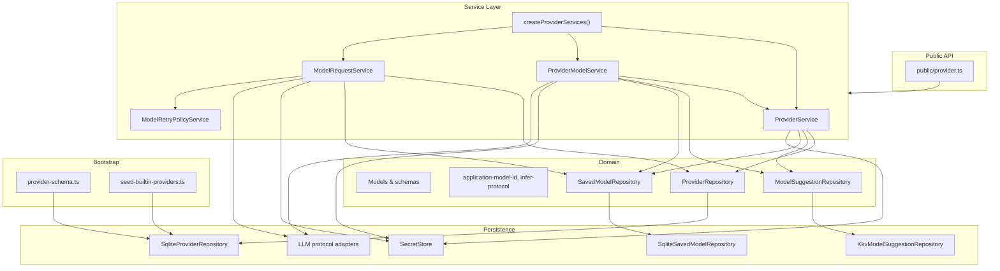

# 代码审查：`provider` 域

**日期：** 2026-06-21  
**范围：** `packages/core` provider 域、服务层、bootstrap、测试与公共 API  
**审查重点：** 代码风格、可维护性、正确性

---

## 执行摘要

provider 域**结构良好**，遵循项目的分层架构（域模型 → 仓储端口 → 服务实现 → 工厂/bootstrap）。持久化实体（`LlmProvider`、`SavedModel`）、临时建议（`ModelSuggestion` / KKV 缓存）与运行时请求编排（`ModelRequestService`）之间的分离清晰。

**总体评估：** 基础扎实，happy path 与若干集成场景测试覆盖较广。在将该模块视为稳定之前，应修复若干**正确性缺陷**与**一致性缺口**——最突出的是内置 provider ID 的协议推断，以及 settings patch 上的一些校验漏洞。

| 领域 | 评级 | 说明 |
|------|------|------|
| 架构 | ✅ 良好 | 清晰的 ports/adapters；SQLite 与 KKV 划分合理 |
| 代码风格 | ⚠️ 参差 | 大体一致；一个文件存在严重格式漂移 |
| 可维护性 | ⚠️ 参差 | 存在重复与死依赖；公共 API 面较宽 |
| 正确性 | ⚠️ 有问题 | 协议推断 bug；patch 校验缺口 |
| 测试覆盖 | ✅ 良好 | 18 个测试文件；推断与仓储边界情况有缺口 |

---

## 架构概览



### 职责划分

| 层级 | 职责 |
|------|------|
| **域模型** | `LlmProvider`、`SavedModel`、`SavedModelSettings`、采样参数、建议缓存 wire 形态 |
| **域逻辑** | Application model ID 解析/格式化/规范化；轻量协议推断 |
| **仓储** | SQLite 持久化 provider 与 saved models；KKV 存储临时 model suggestions |
| **服务** | Provider CRUD、拉取/保存模型、带重试与采样合并的 chat 请求 |
| **Bootstrap** | DDL + 幂等内置 provider 种子 |

### 关键标识符

- **Application model ID：** `{providerId}/{vendorModelId}`（仅在第一个 `/` 处拆分）
- **API key secret ref：** 经 `providerApiKeyRef()` 为 `provider/{providerId}/apiKey`
- **内置 provider ID：** `openai`、`anthropic`、`google`、`openrouter`

---

## 文件清单

### 域（`src/domain/provider/` — 21 个文件）

| 路径 | 角色 |
|------|------|
| `model/provider.ts` | `LlmProvider` 实体、`providerApiKeyRef()` |
| `model/saved-model.ts` | Saved model 实体 |
| `model/saved-model-settings*.ts` | Settings 类型、默认值、JSON 解析/序列化、Zod schema |
| `model/model-sampling-params*.ts` | 按协议区分的 sampling 联合类型 + schema |
| `model/protocol-sampling-defaults.ts` | UI/预算默认值、合并辅助函数 |
| `model/model-suggestion*.ts` | Suggestion 实体 + KKV 缓存 schema |
| `model/token-counter-mode-options.ts` | UI/CLI token counter mode 列表 |
| `logic/application-model-id.ts` | 解析、格式化、规范化 vendor model ID |
| `logic/infer-llm-protocol-from-model-id.ts` | Provider ID → 协议 kind（导出辅助函数） |
| `repositories/*.port.ts` | 仓储接口 |
| `repositories/impl/sqlite-*.ts` | SQLite 实现 |
| `repositories/impl/kkv-model-suggestion.repository.ts` | KKV suggestion 缓存 |

### 服务（`src/service/provider/` — 11 个文件）

| 路径 | 角色 |
|------|------|
| `provider.port.ts` | Provider CRUD 端口 + DTO |
| `provider-model.port.ts` | Suggestions、saved models、settings |
| `model-request.port.ts` | Chat 请求端口 |
| `model-retry-policy.port.ts` | 全局重试策略存储 |
| `impl/provider.service.ts` | 默认 provider CRUD |
| `impl/provider-model.service.ts` | 模型拉取/保存/settings |
| `impl/model-request.service.ts` | Adapter 分发 + 重试循环 |
| `impl/model-retry-policy.service.ts` | KKV 支持的重试策略 |
| `logic/resolve-token-counter-mode-for-model.ts` | 基于 saved settings 的薄解析器 |
| `create-provider-services.ts` | 装配工厂 |
| `create-model-retry-policy-service.ts` | 重试策略工厂 |

### Bootstrap（`src/bootstrap/provider/` — 2 个文件）

| 路径 | 角色 |
|------|------|
| `provider-schema.ts` | `llm_provider`、`llm_saved_model` DDL |
| `seed-builtin-providers.ts` | 四个内置项的幂等插入 |

### 测试（`test/provider/` — 18 个文件）

覆盖 provider CRUD、模型拉取/保存/settings、application model ID、采样合并、重试/中止、协议 adapter（OpenAI/Anthropic/Gemini）、KKV suggestions、bootstrap seed、token counter mode 解析。

### 公共 API（`src/public/provider.ts`）

重新导出域类型、服务工厂、采样辅助函数、tokenizer 工具与 LLM 协议 infra——**较宽**的对外面，面向 CLI/mobile 消费者。

---

## 优点

1. **边界清晰。** Provider 配置、saved model 配置、临时 suggestions 与运行时请求通过显式 port 分离。

2. **Schema 版本化 JSON。** `SavedModelSettings` 与 `ModelSuggestionCache` 使用 `schemaVersion: 1` + 严格 Zod schema——良好的向前兼容模式。

3. **内置 provider 护栏。** `DefaultProviderService` 阻止对内置 ID 的 create/delete/rename-protocol；seed 为幂等（`INSERT … WHERE NOT EXISTS`）。

4. **删除时级联清理。** 删除自定义 provider 会移除 suggestions、saved models、DB 行与 secret ref。

5. **重试策略设计。** 瞬时 HTTP 失败（429、5xx）以 backoff + jitter 重试；abort 信号会短路重试。无效存储策略会降级为默认值，而非阻断请求。

6. **Vendor model ID 规范化。** 处理带前缀 ID（`zhipu/glm-4-flash`）、application ID 与 OpenAI 风格 `models/` 路径——测试充分。

7. **采样合并语义。** 请求服务仅在 `enabled` 且 `options.sampling` 省略时应用 saved sampling；显式调用方覆盖优先。

---

## 代码风格

### 一致的模式（良好）

- 多数域/服务实现文件有 JSDoc `@module` 标签
- 实体接口与服务 DTO 使用 `readonly`
- 域失败使用带判别 `code` 的 `ProviderError`
- 持久化 JSON 文档使用严格 Zod schema（`.strict()`）
- SQL 经 `SqlTemplateParser` + 参数化模板（无字符串拼接）

### 不一致之处

| 问题 | 位置 | 详情 |
|------|------|------|
| 缺少 `@module` / 文件头 | `repositories/provider.port.ts`、`saved-model.port.ts`、`model-suggestion.port.ts`、服务 `*.port.ts` | 其他域（如 chat、vfs）对 port 文档一致 |
| 注释语言混杂 | `infer-llm-protocol-from-model-id.ts` | 中文 JSDoc，而 provider 域其余为英文 |
| trivial 辅助函数重复 | `saved-model-settings-from-json.ts`、`decode.ts` | 两者定义相同的 `zodMessage()` 包装 |
| 错误类型不一致 | Settings JSON vs KKV 缓存 | `savedModelSettingsFromJson` 抛 `ProviderError`；KKV 缓存用 `decode()` → `ConfigDecodeError` |

### 严重风格缺陷

**`provider-model.service.ts` 格式异常**——几乎每行之间都有空行（约 235 行逻辑却占 ~470 行）。读起来像意外损坏（错误 merge 或 formatter 误触），影响 diff 审查。其他服务文件（`provider.service.ts`、`model-request.service.ts`）间距正常。

**建议：** 将 `provider-model.service.ts` 重新格式化，与同级服务文件一致。

---

## 可维护性

### 死代码 / 冗余代码

1. **`DefaultProviderModelServiceDeps` 中未使用的 `providerRepo` 依赖。** 服务仅调用 `deps.providers.get()`（`ProviderService` 包装）。`createProviderServices()` 仍向 `DefaultProviderModelService` 注入 `providerRepo`，但从未读取。

2. **`saved-model-settings.schema.ts` 中的 `savedModelSettingsSchema` transform** 与 `saved-model-settings-from-json.ts` 中的 `documentToSettings()` 重复。外部仅使用 `savedModelSettingsDocumentSchema`；transform 导出似乎未使用（grep：仅定义处）。

3. **`ProviderModelService` 上 `create()` 包装 `save()`** 无行为差异——可接受的别名，但若 port 允许可文档化或合并。

### 公共 API 面

`public/provider.ts` 导出约 110 行，涵盖：

- 核心 provider 域（合适）
- Tokenizer registry driver、tiktoken 辅助（infra）
- LLM 协议 registry、debug fetch（infra）
- 来自 `domain/feature-flags/` 的特性开关（横切）

这使消费者与 infra 内部耦合。若 `@novel-master/core` 单体 SDK 有意如此则可接受，但会增加破坏性变更风险，并使「provider 域」边界模糊。

**建议：** API 稳定时考虑拆分 `public/provider.ts` 与 `public/tokenizer.ts` / `public/llm-protocol.ts`。

### 性能考量（非阻塞）

- **`fetch()` 逐条 upsert 模型。** 每次 `upsert()` 读取完整 KKV 缓存、变更、写回 → 大模型列表为 O(n²) I/O。对典型 provider 目录可接受；若 OpenRouter 规模列表变常见，值得批量写入。
- **`fetch()` 在 upsert 循环中每条模型调用 `Date.now()`**；单次 fetch 一个时间戳即可。

### 依赖方向

总体正确：域不导入服务层。公共 API 中一例：`resolveTokenCounterModeForModel` 位于服务层但从 `public/provider.ts` 导出——作为应用辅助函数合理。

---

## 正确性

按严重程度排序的问题。

### 🔴 高 — 协议推断遗漏内置 provider ID

**文件：** `logic/infer-llm-protocol-from-model-id.ts`

```typescript
const PROTOCOL_BY_PROVIDER_ID = {
  openai: "openai",
  anthropic: "anthropic",
  gemini: "gemini",  // ← key is "gemini"
};
// unknown → fallback "anthropic"
```

内置 seed 使用 **`google`** 作为 provider ID、**`gemini`** 作为 protocol。**`openrouter`** 使用 **`openai`** protocol。两者均不在 map 中。

**影响：** `inferLlmProtocolFromApplicationModelId("google/gemini-2.0-flash")` 与 `…("openrouter/…")` 返回 **`anthropic`**。在 `agent-runner.ts` 中用于 `normalizeForLlmExport()` —— Gemini 与 OpenRouter 模型的消息规范化 zone 错误。

**修复：** 映射 `google → gemini`、`openrouter → openai`。长期优先：从 `ProviderRepository` 按 `providerId` 解析 protocol，而非硬编码 map（自定义 provider 已在 DB 存 protocol）。

**测试缺口：** `inferLlmProtocolFromApplicationModelId` 无单元测试。

---

### 🟠 中 — Settings patch 缺少 sampling 校验

**文件：** `impl/provider-model.service.ts` → `updateSettings()`

校验 `contextWindowTokens` 与 `tokenCounterMode`，但 **`patch.sampling` 原样接受**，无 Zod 校验或 protocol 对齐检查。

**影响：**

- 无效 sampling 形态可持久化到 SQLite，仅在请求时失败（或静默误用）。
- 用户可在 Anthropic provider 模型上保存 `protocol: "openai"` 的 sampling。

**修复：** 持久化前对合并后的 settings 运行 `savedModelSettingsDocumentSchema`（或部分 patch schema）；可选地交叉检查 sampling protocol 与 `provider.protocol`。

---

### 🟠 中 — 损坏的 DB JSON 抛出非域错误

**文件：** `repositories/impl/sqlite-saved-model.repository.ts`

```typescript
settings: savedModelSettingsFromJson(JSON.parse(settingsJson) as unknown),
```

- 畸形 JSON → 原始 `SyntaxError`
- 无效 schema → `ProviderError`（良好）
- 损坏 KKV suggestion 缓存 → `decode()` 的 `ConfigDecodeError`（不一致）

**修复：** 用 try/catch 包装 `JSON.parse` → 统一为 `ProviderError("INVALID_ARGUMENT", …)`，便于服务边界处理。

---

### 🟠 中 — SQLite protocol 列未校验

**文件：** `repositories/impl/sqlite-provider.repository.ts`

```typescript
protocol: String(row.protocol) as LlmProtocolKind,
```

DDL `CHECK (protocol IN (...))` 保护新行，但读取时 cast 信任 DB。手动改 DB 可能产生无效 protocol → adapter registry 运行时失败。

**修复（可选）：** 读取时校验或使用窄解析函数。

---

### 🟡 低 — `editSaved` / `deleteSaved` 跳过 vendor ID 规范化

**文件：** `impl/provider-model.service.ts`

`save()` 经 `normalizeVendorModelId()` 规范化；`editSaved()`、`deleteSaved()`、`updateSettings()`、`resetContextWindowToDefault()` 使用原始 `vendorModelId` 参数。

**影响：** 调用方传入 `providerId/vendorModelId` 或带前缀 ID 可能得到 `NOT_FOUND` / `MODEL_NOT_SAVED`，尽管规范化 ID 下已有 saved 行。

**修复：** 各方法开头规范化（与 `save()` 相同）。

---

### 🟡 低 — `ModelRetryPolicyService.setPolicy` 抛出通用 `Error`

**文件：** `impl/model-retry-policy.service.ts`

校验失败抛出 `new Error(...)` 而非 `ProviderError("INVALID_ARGUMENT", …)`，与 provider 栈其余部分不一致。

---

### 🟡 低 — Sampling schema 缺少值域

**文件：** `model-sampling-params.schema.ts`

`temperature`、`top_p`、`topP` 接受任意数字（含负值或 NaN）。API 会在 HTTP 层拒绝；更早校验可改善 UX。

---

### 设计说明（非 bug）

- **`inferLlmProtocolFromApplicationModelId` 回退到 `anthropic`** 掩盖无效 model ID——对 export 路径方便，但掩盖拼写错误。
- **重试将未知非 `ProviderError` 视为可重试** —— 对瞬时网络故障合理；若 adapter 抛意外错误可能重试非幂等调用（`maxRetries` 较低可缓解）。

---

## 测试覆盖评估

### 覆盖良好

| 领域 | 测试文件 |
|------|----------|
| Provider CRUD + 内置护栏 | `provider-service.test.ts` |
| 模型拉取、保存、settings | `provider-model.service.test.ts` |
| Application model ID | `application-model-id.test.ts` |
| Saved settings JSON schema | `saved-model-settings.schema.test.ts` |
| 请求采样合并 | `model-request-saved-model-settings.test.ts` |
| 重试 + 中止 | `model-request-retry.test.ts` |
| 协议 adapter | `protocol-*.test.ts`、`anthropic-blocks.test.ts`、`model-request-tools-stream.test.ts` |
| KKV suggestions | `kkv-model-suggestion.repository.test.ts` |
| Bootstrap seed | `bootstrap-seed.test.ts` |
| Token counter mode | `resolve-token-counter-mode.test.ts` |
| 采样默认值 | `protocol-sampling-defaults.test.ts` |

### 缺口

| 缺口 | 建议测试 |
|------|----------|
| `inferLlmProtocolFromApplicationModelId` | 表驱动：`google/*` → gemini、`openrouter/*` → openai、unknown → fallback |
| `SqliteSavedModelRepository` 损坏 JSON | 插入无效 `settings_json`，读取时期望域错误 |
| `updateSettings` 无效 sampling patch | 拒绝畸形/跨 protocol sampling |
| `editSaved` 带前缀 vendor ID | 规范化或文档化拒绝行为 |
| `DefaultModelRetryPolicyService` | 无效 setPolicy + 损坏存储 JSON → null policy |
| 直接 `SqliteProviderRepository` | 可选；目前经集成测试间接覆盖 |

---

## 建议（按优先级）

### P0 — 依赖多 provider export 前修复

1. **修复协议推断 map** —— 添加 `google`、`openrouter`；补充单元测试。
2. **重新格式化 `provider-model.service.ts`** —— 恢复正常行距。

### P1 — 加固持久化与 patch

3. **在 `updateSettings()` 用现有 Zod schema 校验合并 settings。**
4. **在所有 `ProviderModelService` 变更方法中规范化 `vendorModelId`。**
5. **用域错误包装 SQLite settings 的 `JSON.parse`。**

### P2 — 可维护性清理

6. **从 `DefaultProviderModelServiceDeps` 移除未使用的 `providerRepo`**（或若分层意图是跳过 list-item  enrichment 则改用它而非 `ProviderService`）。
7. **合并 settings 解析** —— 使用 `savedModelSettingsSchema` 或共享 `decode()` + 将错误映射为 `ProviderError`。
8. **port 文件头与 `@module` 约定对齐。**
9. **统一 `infer-llm-protocol-from-model-id.ts` 注释语言。**

### P3 — 锦上添花

10. 在 `fetch()` 中批量 KKV 缓存写入。
11. 在 Zod 中收紧 sampling 参数范围。
12. API 稳定时拆分臃肿的 `public/provider.ts`。
13. 在重试策略校验中使用 `ProviderError`。

---

## 关键流程（参考）

### 模型拉取 → 保存 → 请求

```
fetch(providerId)
  → ProviderService.get (existence)
  → SecretStore.get(apiKey)
  → adapter.listModels()
  → for each model: suggestions.upsert()
  → suggestions.markStaleExcept(seen)

save(providerId, vendorModelId)
  → normalizeVendorModelId
  → optional suggestion displayName
  → defaultSavedModelSettings(vendorModelId)
  → savedModels.insert

request(applicationModelId, content, options)
  → parseApplicationModelId
  → savedModels.find (must exist)
  → providers.findById + apiKey
  → merge sampling from saved settings if enabled
  → adapter.chat with retry loop
```

### Provider 删除（自定义）

```
delete(id)
  → reject if isBuiltin
  → suggestions.deleteByProvider
  → savedModels.deleteByProvider
  → providers.delete
  → secretStore.delete(secretRef)
```

---

## 结论

provider 域是**连贯、有测试支撑**的模块，符合项目架构约定。最高优先级修复是 **`google` 与 `openrouter` provider ID 的协议推断**，当前会在下游产生错误的 LLM export 行为。次要工作应聚焦 **settings patch 校验**、**损坏持久化 JSON 的一致错误处理**与** housekeeping**（格式化、死依赖、schema 重复）。

bootstrap DDL、内置 seed 幂等性与核心 CRUD 不变量未发现阻塞问题。
