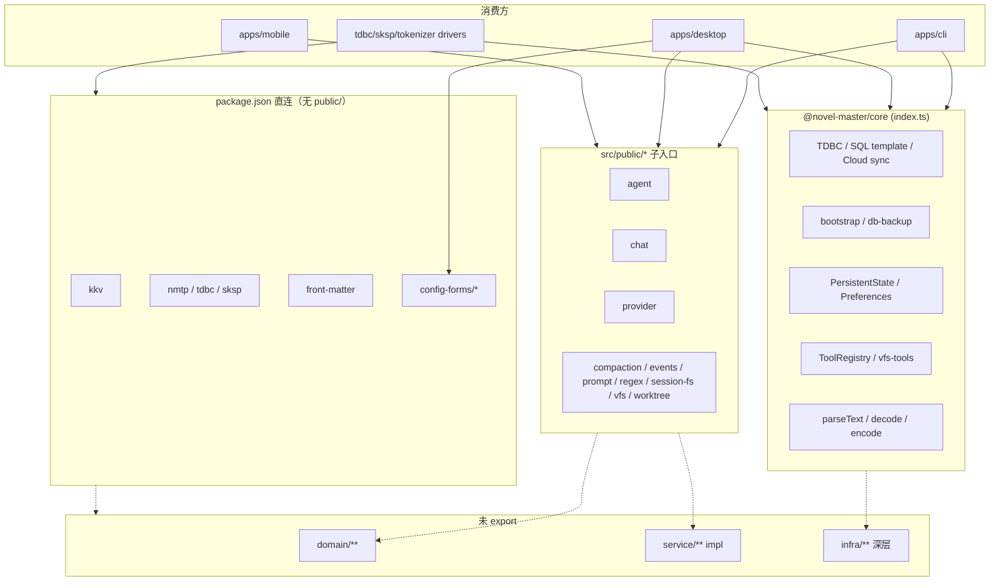

# 代码审查：`@novel-master/core` Public API 与 Package Exports

**日期：** 2026-06-21  
**范围：** `packages/core/src/public/**`、`packages/core/package.json` exports、`packages/core/src/index.ts`、`packages/core/test/package-exports*.test.ts`  
**重点：** export 边界泄漏、domain/infra 混 export、破坏性变更风险

---

## 执行摘要

`@novel-master/core` 采用**双层公开面**：

| 层级 | 路径 | 角色 |
|------|------|------|
| 主入口 | `@novel-master/core` | 平台/bootstrap：TDBC、序列化、云同步、Tool 运行时、持久化端口 |
| 领域子入口 | `@novel-master/core/{agent,chat,…}` | 各限界上下文的类型、逻辑与服务工厂 |
| 辅助子路径 | `kkv`、`tdbc`、`sksp`、`nmtp`、`front-matter`、`config-forms/*` | 内部接线或 infra 细分，**未**统一经 `public/` 收口 |

整体设计意图清晰：**主入口承载跨端基础设施，领域工厂不进主入口**（`package-exports-t0.test.ts` 有断言）。但实践中存在三类问题：

1. **边界泄漏** — `public/*.ts` 直接 re-export `config-forms`、`service/*` 实现类、跨域服务（如 `session-fs` 导出 checkpoint）。
2. **domain/infra 混 export** — 尤以 `provider`、`events`、`prompt` 为甚；同一能力多路径暴露（tokenizer 驱动、`matchDepth`）。
3. **破坏性变更风险偏高** — 子入口表面过宽、守卫测试覆盖面窄；大量 domain 类型与 schema 已成为事实上的公共契约。

**总体评估：** B。分层方向正确，T0 测试与 T9 token-counter 禁令体现了边界意识；需在收敛 export 面与补强契约测试之间做有计划的权衡。

---

## 导出架构

---

## 主入口 `src/index.ts`

主入口**不**经过 `public/`，直接聚合 infra、bootstrap、tool、序列化与持久化端口。

### 导出分组

| 分组 | 来源层 | 代表符号 | 设计意图 |
|------|--------|----------|----------|
| SQL 模板 | `infra/sql-template` | `SqlTemplateParser`, `executeTemplate` | SKSP 等驱动内嵌 SQL |
| TDBC | `infra/tdbc` | `open`, `registerDriver`, `TdbcConnection` | 跨端 DB 协议 |
| Bootstrap | `bootstrap` | `bootstrapNovelMaster`, `NOVEL_MASTER_SCHEMA_STATEMENTS` | 建表 DDL 契约 |
| DB 备份 | `infra/db-backup` | `scrubProviderTables`, `restoreProviderTableSnapshot` | 项目导入导出 |
| 云同步 | `infra/cloud-sync` | `CloudSyncCoordinator`, `parseCloudSyncStatus` | 跨端同步 |
| 持久化 | `service/persistent-*` | `createPersistentState`, `PersistentPreferences` | **产品层应优先使用** |
| KKV 错误 | `errors/kkv-errors` | `KkvError`（无 `createKkvService`） | 错误类型共享，工厂隔离 |
| Tool 运行时 | `domain/tool` + builtin | `ToolRegistry`, `registerBuiltinTools`, `createVfsTools` | Agent/CLI 共用 |
| 序列化 | `infra/serialization` | `decode`, `encode`, `parseText`, `ConfigDecodeError` | YAML/JSON wire |

### 主入口边界（已测试）

`test/package-exports-t0.test.ts` 断言主入口**不得**导出：

- `createKkvService`
- 全部 `public/` 子入口工厂：`createAgentRegistryService`、`createMessageService`、`createCompactionConditionsStore`、`createEventsConfigStore`、`buildPromptAssemblyFromLayout`、`createProviderServices`、`createRegexConfigService`、`createSessionFsService`、`createScopedVfsService`、`createWorktreeService`

该策略在 desktop `types.ts` 中体现为：主入口取 `TdbcConnection` / `PersistentState`，领域服务从子路径 `import type`。

### 主入口风险点

| 项 | 风险 | 说明 |
|----|------|------|
| `NOVEL_MASTER_SCHEMA_STATEMENTS` | 高 | DDL 字符串数组作为公共契约；列变更即破坏驱动/测试 |
| Tool 全量导出 | 中 | 主入口暴露 builtin 工具名常量、mutation 检测；与 `agent` 子入口 tool policy 交叉 |
| `KkvError` vs `./kkv` | 低 | 错误类在主入口，工厂在子路径；语义分裂但可接受 |
| 无 `public/` 收口 | 中 | 主入口变更无 `public/` 层缓冲，直接等于 package 契约 |

---

## `package.json` exports 全表

共 **21** 条 export（含主入口）。

### 经 `public/` 收口（10）

| 子路径 | 源文件 | 消费热度 |
|--------|--------|----------|
| `./agent` | `src/public/agent.ts` | 高 — CLI、desktop、mobile |
| `./chat` | `src/public/chat.ts` | 高 |
| `./provider` | `src/public/provider.ts` | 高 |
| `./vfs` | `src/public/vfs.ts` | 高 |
| `./worktree` | `src/public/worktree.ts` | 高 |
| `./prompt` | `src/public/prompt.ts` | 高 |
| `./events` | `src/public/events.ts` | 中 |
| `./session-fs` | `src/public/session-fs.ts` | 中 |
| `./regex` | `src/public/regex.ts` | 中 |
| `./compaction` | `src/public/compaction.ts` | 中 |

### 绕过 `public/` 的 export（11）

| 子路径 | 指向 | 角色 | 泄漏评估 |
|--------|------|------|----------|
| `./kkv` | `service/kkv` | 运行时内部 KKV 工厂 | **有意隔离**；注释写明非主 API |
| `./tdbc` | `infra/tdbc` | 与主入口重复 | 驱动包可用主入口；子路径冗余 |
| `./sksp` | `infra/sksp` | Secret key 协议 | infra 直连，合理 |
| `./nmtp` | `infra/nmtp` | Tokenizer **驱动注册** 窄接口 | 与 `provider` 重复部分符号 |
| `./front-matter` | `domain/worktree/logic/front-matter` | Markdown front matter | **domain 直连**，无 `public/` |
| `./config-forms` | `config-forms/index` | UI 表单 barrel | desktop renderer 专用 |
| `./config-forms/agent` | … | Agent 编辑器状态/标签 | |
| `./config-forms/events` | … | Events 配置表单 | |
| `./config-forms/shared` | … | 共享标签/depth 辅助 | |
| `./config-forms/stored-config-validity` | … | wire 有效性评估 | |

---

## 各 `public/` 子入口审查

### `./agent` — 表面最宽

| 类别 | 导出示例 | 层级 |
|------|----------|------|
| Domain model/schema | `AgentDefinition`, `agentDefinitionSchema` | domain |
| Domain logic | `validateAgentDefinition`, `resolveApplicationModelId`, doom-loop | domain |
| Service 工厂 | `createAgentRunner`, `createAgentRegistryService` | service |
| **实现类** | `InMemoryAgentSession`, `ChatAgentSession` | domain impl + **service impl** |
| Turn 编排 | `runAgentTurn`, `AgentTurnError`, `AgentRunResolveError` | service logic |

**问题：**

- `ChatAgentSession` 是 SQLite 会话适配器，位于 `service/agent/impl/`；公开后 CLI、测试直接 `new ChatAgentSession(...)`，实现细节成为契约。
- `runAgentTurn` 及 `AgentTurnRuntimePort` 暴露完整 turn 管线；与 `createAgentRunner` 并存，调用方可能绕过 runner 生命周期（事件、tool 策略）。
- 与主入口 `ToolRegistry` / `registerBuiltinTools` 形成交叉依赖面。

**破坏性变更风险：** 高（session 实现、turn 端口、schema 字段）。

---

### `./chat` — 域模型 +  transcript 工具集

| 类别 | 导出示例 | 备注 |
|------|----------|------|
| Model | `ChatMessage`, `ContentBlock`, `userVfsPending*` | 类型契约稳定需求高 |
| Content 解析 | `parseMessageContent`, `textBlocks` | |
| User-VFS turn | `buildUserVfsTurnView`, `mergePendingVfsTurns` | 与 vfs 子入口交叉 |
| Visibility batch | `computeHideRangeFromSelection`, `tailBatchDeleteAfterSeq` | UI/CLI 批量操作 |
| Service | `createMessageService`, `createUserVfsTurnService` | |

**问题：** 导出大量 **transcript 编辑辅助函数**（visibility、tail batch），属 UI/CLI 行为逻辑，非所有消费方需要；但 mobile/desktop 已深度依赖。

**破坏性变更风险：** 中高（消息 wire 格式、visibility 算法）。

---

### `./provider` — domain/infra 混 export 最严重

| 来源层 | 导出示例 |
|--------|----------|
| domain/provider | `parseApplicationModelId`, `LlmProvider`, sampling defaults |
| domain/feature-flags | `isUserVfsUnifiedToolTurnEnabled` |
| service/provider | `createProviderServices`, `createModelRetryPolicyService` |
| infra/sksp | `SecretStore` type |
| infra/llm-protocol | `LlmStreamEvent`, `configureLlmFetch`, `getProtocolAdapter`, `toolsFromRegistry` |
| infra/tokenizer | `countPromptLlmInput`, `HeuristicTokenCounter`, `registerTokenizerDriver`, … |
| infra/serialization | `zodToJsonSchema` |
| infra | `formatLocalDateTime` |

**问题：**

1. **单一子路径承担 LLM 协议 + tokenizer + provider CRUD**，边界模糊；mobile/desktop 从 `./provider` 拉取 token 计数与 fetch 配置。
2. **Tokenizer 驱动符号三处可用：** `@novel-master/core/nmtp`（`registerTokenizerDriver`）、`@novel-master/core/provider`（全套 + 驱动）、主入口无驱动注册。
3. `parseTokenCounterModePref` 等偏好校验 helper 故意只在 `provider` 暴露（`token-counter-mode-no-public-path.test.ts`），但仍在公共面包。

**破坏性变更风险：** 高（LLM 适配器、tokenizer 驱动端口、sampling schema）。

---

### `./prompt`

| 类别 | 导出 | 层级问题 |
|------|------|----------|
| Domain | `AgentPromptLayout`, `validateAgentPromptLayout`, `normalizeForLlmExport` | 正常 |
| **config-forms 泄漏** | `movePersistBlock`, `normalizePersistBlock`, `updatePersistWorktreeRole` | 来自 `config-forms/agent/agent-editor-state.ts` |
| Service | `buildPromptAssemblyFromLayout`, `buildPromptLlmInputFromLayout` | 正常 |

**问题：** `agent-editor-state` 是 **UI 编辑器状态机**（含 `TOOL_MODE_OPTIONS`、`PROMPT_BLOCK_ROLES` 等），经 `public/prompt` 与 `config-forms/agent` 双路径暴露。mobile `AgentEditorForm` 从 `./prompt` 导入 `movePersistBlock`，desktop 从 `config-forms` 导入——**同一逻辑两个公共路径**。

**破坏性变更风险：** 中高（layout schema + 编辑器辅助）。

---

### `./events`

| 类别 | 导出 | 层级 |
|------|------|------|
| Infra | `SimpleEventBus`, `EventBus` | infra/events |
| Domain | `EVENT_*` 常量、payload 类型 | domain/events |
| Domain config | `EventsConfig`, `eventsConfigSchema` | domain/events-config |
| Service | `createEventOrchestrator`, `createEventsConfigStore` | service |

**问题：** `SimpleEventBus` 是 infra 实现，runtime 全局单例；公开合理但将 infra 与 domain 事件类型绑在同一子路径。

**破坏性变更风险：** 中（事件名、payload 字段、orchestrator 依赖）。

---

### `./compaction`

| 类别 | 导出 | 备注 |
|------|------|------|
| **跨域 depth** | `matchDepth`, `validateDepthSlice`, `depthByMessageId` | 来自 `domain/depth`，非 compaction-conditions 专属 |
| Compaction | `CompactionConditions`, `createCompactionConditionsStore` | 正常 |

**问题：** `matchDepth` / `validateDepthSlice` 同时在：

- `@novel-master/core/compaction`
- `@novel-master/core/config-forms/events`
- `@novel-master/core/config-forms/shared`

mobile `regex-test.service` 从 **compaction** 导入 depth；desktop 同源逻辑从 **config-forms/events** 导入——**三路径同一实现**，增加「改哪条 export」的不确定性。

**破坏性变更风险：** 中（depth 语义 + compaction store wire）。

---

### `./regex`

| 类别 | 导出 | 层级问题 |
|------|------|----------|
| Domain | `RegexRule`, `compileRegexRule`, `applyRegexRules` | 正常 |
| Service | `createRegexConfigService` | 正常 |
| **跨 service** | `applyRegexChannelForLlm` | 来自 `service/prompt/` |

**问题：** prompt 管线函数经 regex 子路径泄露，regex 消费方可能误认其属于 regex 域。

---

### `./session-fs`

| 类别 | 导出 | 层级问题 |
|------|------|----------|
| Session FS | `createSessionFsService`, `SessionFsError` | 正常 |
| **Message checkpoint** | `createMessageCheckpointService`, `createMessageRollbackService` | 来自 `service/message-checkpoint` |

**问题：** 两个限界上下文（session-fs 与 message-checkpoint）共用一个子路径；desktop `types.ts` 从 `./session-fs` 取 `MessageCheckpointService`。命名与子路径语义不一致。

**破坏性变更风险：** 中（rollback 选项、checkpoint wire）。

---

### `./vfs` — 域逻辑与服务较完整

导出 domain path mapper、zip I/O、user-vfs save mapping、三个 service 工厂。domain/infra 分离相对清晰（`VfsZipError` 在 errors，logic 在 domain）。

**问题：** 表面较宽（`copyVfsPath`, `replaceVfsSubtree` 等低级操作公开），CLI/VFS 命令与 mobile 文件管理器依赖，收缩难度大。

---

### `./worktree`

| 类别 | 导出 | 层级问题 |
|------|------|----------|
| Domain | `WorktreeListRow`, `evaluateFileDisplay`, `parseMarkdownFrontMatter` | 正常 |
| Service | `createWorktreeService`, `createTemplatePullService` | 正常 |
| **Prompt 交叉** | `createSessionWorktreeSnapshotStore`, `SessionWorktreeSnapshotStore` | service/prompt |

**问题：** worktree 子路径承载 prompt 用的 snapshot store；与 `./front-matter` 子路径（同包内 front matter 解析）功能相关但路径分裂。

**注：** `./front-matter` export 指向 `domain/worktree/logic/front-matter.js`，**仓库内无消费方**（grep 无匹配），属于潜在死 export 或预留路径。

---

## 边界泄漏专题

### L1 — 实现类 / 内部服务直达公共 API

| 符号 | 公开路径 | 实际位置 | 消费方 |
|------|----------|----------|--------|
| `ChatAgentSession` | `./agent` | `service/agent/impl/` | CLI `agent/commands.ts` |
| `InMemoryAgentSession` | `./agent` | `domain/agent/session/impl/` | compaction 测试 |
| `SimpleEventBus` | `./events` | `infra/events/` | 全部 runtime |
| `applyRegexChannelForLlm` | `./regex` | `service/prompt/` | — |
| `movePersistBlock` 等 | `./prompt` | `config-forms/agent/` | mobile AgentEditorForm |

### L2 — 跨域聚合子路径

| 子路径 | 聚合的域 |
|--------|----------|
| `./session-fs` | session-fs + message-checkpoint |
| `./worktree` | worktree + template-pull + prompt snapshot |
| `./compaction` | compaction-conditions + depth |
| `./provider` | provider + feature-flags + llm-protocol + tokenizer + sksp type |

### L3 — 多路径重复 export（同一实现）

| 能力 | 路径 |
|------|------|
| TDBC `open` / `registerDriver` | 主入口 + `./tdbc` |
| Tokenizer 驱动注册 | `./nmtp` + `./provider` |
| `matchDepth` / `validateDepthSlice` | `./compaction` + `config-forms/events` + `config-forms/shared` |
| Agent 编辑器块操作 | `./prompt` + `config-forms/agent` |
| Front matter 解析 | `./worktree` (`parseMarkdownFrontMatter`) + `./front-matter`（无消费方） |

### L4 — `kkv` 半公开

- `createKkvService` **仅** `./kkv`；`KkvError` 在主入口。
- desktop/mobile runtime 将 `kkv` 标为「仅 AppUiPreferences」但仍进入公共 export 表。
- 与 `PersistentState` / `PersistentPreferences` 文档意图一致，但 **KKV 仍是事实上的二级公共 API**。

---

## Domain / Infra 混 Export 矩阵

| 子入口 | Domain | Service | Infra | Config-forms | 混 export 严重度 |
|--------|--------|---------|-------|--------------|------------------|
| agent | ●●● | ●●● | — | — | 中（service impl 类） |
| chat | ●●● | ●● | — | — | 低 |
| compaction | ●● | ● | — | — | 中（depth 跨域） |
| events | ●● | ●● | ● | — | 中 |
| prompt | ●●● | ●● | — | ● | **高** |
| provider | ●● | ●● | ●●● | — | **高** |
| regex | ●●● | ● | — | — | 中（prompt 函数） |
| session-fs | — | ●●● | — | — | 中（跨域） |
| vfs | ●●● | ●● | — | — | 低 |
| worktree | ●●● | ●● | — | — | 中（prompt 交叉） |
| **主入口** | ● (tool) | ● | ●●● | — | 中（设计如此） |

---

## 破坏性变更风险

### 高风险面（变更前需 changelog / 迁移说明）

1. **Wire schema** — `agentDefinitionSchema`、`eventsConfigSchema`、`compactionConditionsSchema`、`savedModelSettingsFromJson` 等经子入口公开；字段增删影响 CLI YAML、desktop 存储、mobile 配置。
2. **`NOVEL_MASTER_SCHEMA_STATEMENTS`** — 主入口 DDL；与 bootstrap 测试、驱动 conformance 绑定。
3. **`ChatAgentSession` / `runAgentTurn`** — 实现与端口变更影响 CLI agent 命令与事件 handler 测试。
4. **LLM / Tokenizer 栈** — `configureLlmFetch`、`registerTokenizerDriver`、`countPromptLlmInput`；驱动包与三端 runtime 均依赖。
5. **消息与 content block 类型** — `ChatMessage`、`ContentBlock`、`parseMessageContent`；mobile transcript、desktop message-blocks 硬依赖。

### 中风险面

- Transcript visibility / tail batch 算法（`chat`）
- VFS path mapper 与 zip 格式（`vfs`）
- Worktree 显示规则与 snapshot store（`worktree`）
- `config-forms/stored-config-validity` 的 wire 评估函数（desktop Agent 编辑器）

### 现有守卫与缺口

| 测试 | 覆盖 | 缺口 |
|------|------|------|
| `package-exports-t0.test.ts` | 主入口不导出 10 个 `create*` 工厂 + `createKkvService` | 未枚举主入口**允许**导出清单；未测 `config-forms` / `nmtp` |
| `token-counter-mode-no-public-path.test.ts` | 禁止 `readTokenCounterModeFromPreferences`；主入口不导出 pref helper | 仅 1 组禁令；未泛化为 export allowlist |

**建议的契约测试方向（未实现）：**

- 主入口 export 快照测试（allowlist）
- 各 `public/*.ts` 禁止 import `config-forms`（lint 或 arch 测试）
- 重复 export 路径符号一致性（`matchDepth` 仅保留一条公共路径）
- `./front-matter` 有消费方或从 exports 移除

---

## 与领域审查的交叉引用

| 主题 | 领域报告 | 与 public API 的关联 |
|------|----------|---------------------|
| 遗留 `PromptBlock` | [prompt.md](./domain/prompt.md) | 未在 `public/prompt` 导出，但 `AgentPromptLayout` 已替代 |
| feature-flags 脚手架 | [feature-flags.md](./domain/feature-flags.md) | `isUserVfsUnifiedToolTurnEnabled` 经 `./provider` 公开 |
| depth `endDepth` 校验缺口 | [depth.md](./domain/depth.md) | `matchDepth` 三路径公开，config-form 与 compaction 消费方不同 |
| KKV 无事务 RMW | [kkv.md](./domain/kkv.md) | `./kkv` 仍为 runtime 二级 API |
| message-checkpoint fire-and-forget | [message-checkpoint.md](./domain/message-checkpoint.md) | checkpoint 工厂在 `./session-fs` 公开 |

---

## 建议（按优先级）

### P1 — 契约与文档

1. **编写 export 意图文档**（可并入 README 或 `AGENTS.md`）：主入口 vs 子入口 vs `kkv`/`config-forms` 的使用边界。
2. **扩展 export 快照测试**：至少固定主入口 allowlist + 禁止 `public/*` 依赖 `config-forms`。

### P2 — 收敛重复路径（渐进）

3. **`matchDepth`**：约定唯一公共路径（建议 `compaction` 或新建 `./depth`），`config-forms` 仅 re-export 不新增路径。
4. **Tokenizer 驱动**：消费方统一 `@novel-master/core/nmtp` 注册；`provider` 保留计数/registry，文档标明驱动注册去 `nmtp`。
5. **`front-matter`**：若无计划使用，从 `exports` 移除；或并入 `worktree` public。

### P3 — 结构性拆分（大改动，需迁移期）

6. **`session-fs`**：checkpoint/rollback 迁至 `./message-checkpoint` 或 `./chat` 子路径，保留 re-export 过渡期。
7. **`prompt`**：将 `movePersistBlock` 等迁至 `config-forms/agent` 唯一路径；`public/prompt` 仅保留渲染/校验 domain API。
8. **`provider`**：拆分为 `./provider`（CRUD/model）与 `./llm` 或沿用 `nmtp` 命名空间分离 infra。

### P4 — 实现类降权

9. **`ChatAgentSession`**：公共 API 保留 `AgentSession` 端口 + `createAgentRunner`；CLI 改为 runner 注入，不直接 `new` 实现类（长期）。

---

## 附录：子入口工厂一览

| 子路径 | 工厂 / 主入口函数 | 主入口是否导出 |
|--------|-------------------|----------------|
| `./agent` | `createAgentRunner`, `createAgentRegistryService` | 否 ✓ |
| `./chat` | `createProjectService`, `createSessionService`, `createMessageService`, `createUserVfsTurnService`, `createMessageTranscriptEffectsService` | 否 ✓ |
| `./compaction` | `createCompactionConditionsStore`, `createCompactionConditionEvaluator` | 否 ✓ |
| `./events` | `createEventsConfigStore`, `createEventOrchestrator` | 否 ✓ |
| `./prompt` | `buildPromptAssemblyFromLayout`, `buildPromptLlmInputFromLayout`, … | 否 ✓ |
| `./provider` | `createProviderServices`, `createModelRetryPolicyService` | 否 ✓ |
| `./regex` | `createRegexConfigService` | 否 ✓ |
| `./session-fs` | `createSessionFsService`, `createMessageCheckpointService`, `createMessageRollbackService` | 否 ✓ |
| `./vfs` | `createVfsService`, `createScopedVfsService`, `createVfsZipIoService` | 否 ✓ |
| `./worktree` | `createWorktreeService`, `createTemplatePullService`, `createSessionWorktreeSnapshotStore` | 否 ✓ |
| `./kkv` | `createKkvService` | 否 ✓ |

---

**审查者：** Cursor agent（explore 阶段）  
**方法：** 静态阅读 `public/*`、`index.ts`、`package.json`、export 测试及 monorepo 消费方 grep
