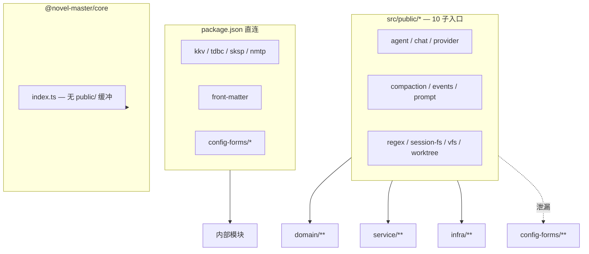

# Public API 边界收敛（public-api-boundaries）技术规格（SPEC）

> **PRD**：[prd.md](./prd.md)  
> **调研基线：** explore @ 2026-06-21（`packages/core/src/public/*`、`index.ts`、`package.json` exports、`test/package-exports-t0.test.ts`）

## 设计目标

| # | PRD 目标 | 设计要点 |
|---|----------|----------|
| 1 | 固化 export 契约 | allowlist 快照 + 既有 denylist；变更快照 = 显式 API 变更 |
| 2 | 架构守卫 | `public/*` 禁止新增 `config-forms` 依赖；豁免清单递减 |
| 3 | 收敛重复路径 | 文档 + canonical 表；re-export 保留；可选 `@deprecated` JSDoc |
| 4 | 零破坏 | 不删符号、不删 exports（除零消费 `./front-matter`）；消费方 import 不变 |
| 5 | 可分期交付 | P1 纯测试+文档可独立合并；P2/P3 按路径拆 PR |

**不在本 SPEC 首版实现：** `provider` 拆 `./llm` 子路径、`ChatAgentSession` 从 public 移除、checkpoint 新子路径（仅 backlog 与文档预留）。

---

## 现状与约束（代码探索）

### Export 拓扑



### `package.json` exports（21 条）

| 类别 | 子路径 | 源 |
|------|--------|-----|
| 主入口 | `.` | `dist/index.js` |
| public 收口 | `./agent` … `./worktree`（10） | `dist/public/*.js` |
| infra 直连 | `./tdbc`、`./sksp`、`./nmtp` | `dist/infra/*` |
| 其它 | `./kkv`、`./front-matter`、`./config-forms`（+4 子路径） | 各内部模块 |

### 既有契约测试

| 文件 | 策略 | 缺口 |
|------|------|------|
| `test/package-exports-t0.test.ts` | 主入口 denylist（10 工厂 + `createKkvService`）；子入口 smoke | 无 allowlist |
| `test/infra/tokenizer/token-counter-mode-no-public-path.test.ts` | T9：禁止 `readTokenCounterModeFromPreferences` 公开 | 单点禁令，未泛化 |

### 已知泄漏与重复路径（收敛 backlog）

| 类型 | 符号 / 能力 | 路径 | 备注 |
|------|-------------|------|------|
| L1 泄漏 | `movePersistBlock` 等 | `./prompt` ← `config-forms/agent` | 豁免至 P3 |
| L1 泄漏 | `ChatAgentSession` | `./agent` | P4 backlog |
| L2 跨域 | checkpoint 工厂 | `./session-fs` | P3 backlog |
| L3 重复 | `matchDepth`, `validateDepthSlice` | `./compaction` + `config-forms/events` + `config-forms/shared` | P2 canonical → compaction |
| L3 重复 | `registerTokenizerDriver` | `./nmtp` + `./provider` | P2 canonical → nmtp |
| L3 重复 | TDBC `open` | 主入口 + `./tdbc` | 文档：驱动用 `./tdbc` 或主入口均可 |
| L3 重复 | front matter | `./worktree` + `./front-matter` | `./front-matter` 零消费 |

### 技术约束

1. **ESM + exports map：** 测试须通过 `@novel-master/core` 包名解析（与 T0 一致），禁止仅测源文件 re-export 链。
2. **快照稳定性：** allowlist 按 **export 名称排序** 后字符串化，避免对象键序抖动。
3. **type-only export：** 快照仅统计 runtime `import * as M` 可见的 named export；`export type` 若不可运行时探测，改用 `tsc --declaration` 或补充 `export *` 探测脚本（见 §测试实现）。
4. **豁免递减：** `public/prompt.ts` 对 `config-forms` 的 import 在守卫测试中 `@ts-expect-error` 或 `ALLOWLIST_LEAKS` 常量登记，P3 移除后删豁免。

---

## 总体方案

### 分阶段交付


| 阶段 | 交付物 | 消费方 import 变更 |
|------|--------|-------------------|
| P1 | 快照测试、架构守卫、一致性测试、`public-api.md` | 无 |
| P2 | canonical 表、JSDoc `@deprecated`、front-matter 决策 | 无（推荐路径可选改） |
| P3 | `./message-checkpoint` 或 `./chat` 新 export + session-fs re-export | 无（旧路径保留 ≥1 版本） |
| P4 | agent CLI 改 runner 注入 | CLI 内部 |

---

## P1 详细设计：契约测试

### 1) 测试文件布局

```text
packages/core/test/package-exports/
  main-entry-allowlist.test.ts      # 主入口 allowlist 快照
  public-subpath-allowlist.test.ts  # 10 × public 子入口快照
  public-no-config-forms.test.ts    # 架构守卫 + 豁免清单
  duplicate-export-consistency.test.ts
  helpers/
    export-snapshot.ts              # 共用：collectNamedExports(mod)
```

### 2) `collectNamedExports`

```typescript
/** 收集模块 runtime named exports（不含 default）。 */
export function collectNamedExports(mod: Record<string, unknown>): string[] {
  return Object.keys(mod)
    .filter((k) => k !== "default")
    .sort();
}
```

- 对 **type-only** 符号：若 `import *` 不可见，在 SPEC 实施时二选一：
  - **A（推荐）：** 快照仅覆盖 runtime exports；另建 `public-subpath-types.test.ts` 用 `tsc` 或预生成 `dist/*.d.ts` 解析（二期）；
  - **B：** 首版仅 runtime，文档注明 type export 不在快照内。

首版采用 **A 的 runtime 部分 + B 的文档说明**，与 T0 smoke 对齐。

### 3) 主入口 allowlist

- 固定文件：`test/package-exports/snapshots/main-entry-allowlist.json`
- 测试逻辑：

```typescript
import * as core from "@novel-master/core";
import snapshot from "./snapshots/main-entry-allowlist.json" with { type: "json" };

const actual = collectNamedExports(core as Record<string, unknown>);
assert.deepEqual(actual, snapshot.sort());
```

- **更新流程：** 有意新增/删除主入口 export → 改 `index.ts` → 同步 JSON → PR 描述 API 变更。

### 4) Public 子入口 allowlist

对 `./agent`、`./chat`、…、`./worktree` 各生成 `snapshots/public-<name>-allowlist.json`。

```typescript
const SUBPATHS = [
  "agent", "chat", "compaction", "events", "prompt",
  "provider", "regex", "session-fs", "vfs", "worktree",
] as const;

for (const name of SUBPATHS) {
  const mod = await import(`@novel-master/core/${name}`);
  // assert vs snapshot
}
```

### 5) 架构守卫：`public-no-config-forms.test.ts`

```typescript
import { readFileSync, readdirSync } from "node:fs";
import { join } from "node:path";

const PUBLIC_DIR = join(import.meta.dirname, "../../src/public");
const KNOWN_LEAKS = new Set(["prompt.ts"]); // config-forms/agent/agent-editor-state

for (const file of readdirSync(PUBLIC_DIR).filter((f) => f.endsWith(".ts"))) {
  const src = readFileSync(join(PUBLIC_DIR, file), "utf8");
  const importsConfigForms = /from\s+["'].*config-forms/.test(src);
  if (importsConfigForms && !KNOWN_LEAKS.has(file)) {
    assert.fail(`${file} must not import config-forms`);
  }
}
```

### 6) 重复 export 一致性

```typescript
import * as compaction from "@novel-master/core/compaction";
import * as cfEvents from "@novel-master/core/config-forms/events";
import * as cfShared from "@novel-master/core/config-forms/shared";
import * as nmtp from "@novel-master/core/nmtp";
import * as provider from "@novel-master/core/provider";

assert.equal(compaction.matchDepth, cfEvents.matchDepth);
assert.equal(compaction.validateDepthSlice, cfShared.validateDepthSlice);
assert.equal(nmtp.registerTokenizerDriver, provider.registerTokenizerDriver);
```

### 7) 扩展 T0 denylist

在 `package-exports-t0.test.ts` 或新文件保留既有断言，可选追加：

- 主入口不得导出 `SimpleEventBus`（若当前未导出则固化为 denylist）
- 主入口不得导出 `readTokenCounterModeFromPreferences`（与 T9 合并引用）

---

## P1 详细设计：Export 意图文档

**路径：** `packages/core/docs/public-api.md`

**结构提纲：**

1. **双层模型** — 主入口 vs `public/*` vs 辅助子路径
2. **主入口职责表** — TDBC、bootstrap、serde、Tool、PersistentState、KkvError（无 KKV 工厂）
3. **子入口职责表** — 10 个 public 模块各自 domain 边界
4. **辅助路径表** — `kkv`（App 偏好）、`config-forms`（UI 表单）、`nmtp`/`sksp`/`tdbc`（驱动）
5. **Canonical 路径表（P2 起维护）**

| 能力 | Canonical | 过渡 re-export |
|------|-----------|----------------|
| depth slice 工具 | `@novel-master/core/compaction` | `config-forms/events`, `config-forms/shared` |
| tokenizer 驱动注册 | `@novel-master/core/nmtp` | `@novel-master/core/provider` |
| agent 编辑器块操作 | `@novel-master/core/config-forms/agent` | `@novel-master/core/prompt`（deprecated） |
| front matter 解析 | `@novel-master/core/worktree`（`parseMarkdownFrontMatter`） | `./front-matter` 待移除 |
| message checkpoint | `@novel-master/core/session-fs`（当前） | P3：`./message-checkpoint` 或 `./chat` |

6. **变更流程** — 改快照 → changelog → 消费方 grep

可选：根 `AGENTS.md` 增加一行链接至该文档。

---

## P2 详细设计：路径收敛（非破坏）

### 1) `./front-matter` 决策

**探索结论：** monorepo grep 无 `@novel-master/core/front-matter` 消费方。

| 选项 | 动作 | 风险 |
|------|------|------|
| A 移除 export | 删 `package.json` 条目 | 外部未知消费方 |
| B 保留 + 文档 | `public-api.md` 标记 `@internal` / 预留 | 零代码变更 |

**推荐：A**，因 private monorepo + 零消费；PR 描述「潜在 breaking 仅影响未跟踪 fork」。若维护者要求绝对非破坏，选 B。

### 2) JSDoc `@deprecated`（仅 re-export 点）

在 `src/public/prompt.ts` 对来自 config-forms 的 re-export 增加：

```typescript
/** @deprecated 请改用 `@novel-master/core/config-forms/agent` 的 `movePersistBlock`。 */
export { movePersistBlock, ... } from "../config-forms/agent/agent-editor-state.js";
```

不改变导出符号名或签名。

### 3) config-forms depth re-export

`config-forms/events/index.ts` 与 `config-forms/shared/depth-slice.ts` **改为**：

```typescript
export { matchDepth, validateDepthSlice } from "@/domain/depth/logic/depth-slice.js";
// 或 re-export from compaction 的底层 domain 路径，与 compaction public 同源
```

目标：一致性测试通过且单一实现源（`domain/depth`）。

---

## P3/P4 Backlog（文档预留，不阻塞 P1）

| 项 | 设计方向 | 过渡策略 |
|----|----------|----------|
| session-fs / checkpoint | 新增 `./message-checkpoint` export | `session-fs.ts` re-export 6 个月 |
| provider 拆分 | `./provider` 仅 CRUD/model；infra 归 `./nmtp` 或新 `./llm` | provider 保留 deprecated re-export |
| ChatAgentSession | public 仅 `AgentSession` 端口 + factories | CLI 改注入；类移 `@internal` |
| prompt 去 config-forms | 删除 `public/prompt` 中 editor-state re-export | 先 mobile/desktop 改 import |

---

## 文件变更清单（P1 实施）

| 文件 | 变更 |
|------|------|
| `test/package-exports/helpers/export-snapshot.ts` | 新增 |
| `test/package-exports/snapshots/*.json` | 新增（11 个 allowlist） |
| `test/package-exports/main-entry-allowlist.test.ts` | 新增 |
| `test/package-exports/public-subpath-allowlist.test.ts` | 新增 |
| `test/package-exports/public-no-config-forms.test.ts` | 新增 |
| `test/package-exports/duplicate-export-consistency.test.ts` | 新增 |
| `docs/public-api.md` | 新增 |
| `test/package-exports-t0.test.ts` | 可选：注释指向新套件，保留 smoke |

**P1 不修改：** `src/public/*.ts`、`package.json` exports（除 P2 front-matter 决策 PR）。

---

## 测试策略

| 套件 | 命令 | 预期 |
|------|------|------|
| 全量 fast | `npm run test:fast`（`packages/core`） | 0 failures |
| 仅 export 契约 | `npm run test:fast -- test/package-exports/` | 全绿 |
| monorepo 构建 | 根目录各 app `build` | 无 import 变更下通过 |

**回归关注：** 快照测试对 **任意** 新 export 敏感；重构若仅移动内部文件而不改 `public/*` re-export 链，快照不应变化。

---

## 验收映射（PRD → SPEC）

| PRD ID | SPEC 落点 |
|--------|-----------|
| A1–A3 | §P1 allowlist 测试 + snapshots |
| A4 | §public-no-config-forms + KNOWN_LEAKS |
| A5–A6 | §duplicate-export-consistency |
| A7 | §public-api.md |
| A8 | §测试策略 monorepo build |
| A9 | §P2 front-matter 决策 |
| A10 | §P2 JSDoc deprecated |

---

## 风险与缓解

| 风险 | 缓解 |
|------|------|
| 快照过脆，内部 refactor 频繁失败 | 仅对 `public/*` 与 `index.ts` 边界快照；内部模块移动不影响 |
| type-only export 未覆盖 | 文档声明；二期 d.ts 快照 |
| 移除 `./front-matter` 影响 fork | PR 标注 breaking；首选 grep 全 monorepo |
| P3 拆分 session-fs 与 checkpoint feature 冲突 | PRD 已声明软关联；P3 单独立项 |

---

*实施顺序：P1 PR（测试+文档）→ 用户确认 P2 front-matter 决策 → P2 PR（deprecated + config-forms re-export 同源）。*
