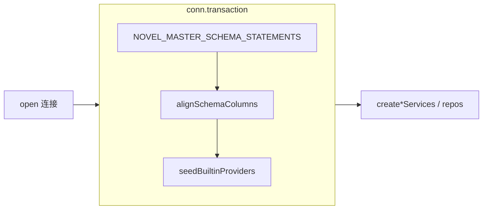

# Bootstrap + Schema-Align 代码审查

**日期：** 2026-06-21  
**范围：**

| 类别 | 路径 |
|------|------|
| 聚合引导 | `packages/core/src/bootstrap/novel-master-bootstrap.ts` |
| 各域 DDL | `packages/core/src/bootstrap/**/*-schema.ts` |
| 列对齐 | `packages/core/src/bootstrap/schema-align/**` |
| Provider 种子 | `packages/core/src/bootstrap/provider/seed-builtin-providers.ts` |
| 测试 | `packages/core/test/bootstrap/**`（及相关 `test/vfs/bootstrap.test.ts`、`test/provider/bootstrap-seed.test.ts`） |

**审查维度：** DDL 一致性、外键/索引、迁移策略、seed、schema-column-alignments、测试覆盖。

**已运行测试：** `test/bootstrap/*.test.ts`、`test/vfs/bootstrap.test.ts`、`test/provider/bootstrap-seed.test.ts` — **12/12 通过**。

---

## 执行摘要

Bootstrap 采用**单事务、幂等、声明式**策略：`CREATE IF NOT EXISTS` 建表 → `alignSchemaColumns` 对 legacy 库 `ADD COLUMN` → `seedBuiltinProviders` 插入内置 LLM 端点。历史 `migrate-*.ts` 模块已移除，由 DDL + 列对齐清单替代。

**总体评估：** 设计清晰，与「单写者桌面/CLI」场景匹配；T-B3 对四条 legacy 列对齐路径覆盖扎实。未发现 P0 级 schema 损坏 bug。

| 领域 | 评级 | 说明 |
|------|------|------|
| DDL 一致性 | ✅ 良好 | 仓储读写列与 DDL/对齐清单一致；`version`/`head_version` 双列为有意演进 |
| 外键 | ⚠️ 有意省略 | 仅 provider、regex 有 FK；chat/checkpoint/vfs 靠服务层级联 |
| 索引 | ✅ 基本够用 | 查询热点有索引；`message_checkpoint_file` 按 session 扫表时无辅助索引 |
| 迁移策略 | ✅ 明确 | 仅 ADD COLUMN，不 DROP/不 KKV 搬迁；边界在文件头注释中写明 |
| Seed | ✅ 良好 | `WHERE NOT EXISTS` 幂等，不覆盖用户编辑 |
| 列对齐 | ✅ 良好 | 四条 legacy 列与 canonical DDL 双轨维护，回填逻辑正确 |
| 测试 | ⚠️ 有缺口 | T-B3 强；全表清单、FK、索引无自动化校验 |

---

## 架构与执行顺序



`bootstrapNovelMaster` 在单次事务内顺序执行，可安全重复调用。各模块 DDL 按依赖安全顺序拼入 `NOVEL_MASTER_SCHEMA_STATEMENTS`：

| 顺序 | 模块 | 语句来源 | 表数 |
|------|------|----------|------|
| 1 | vfs | `vfs-schema.ts` | 1 + 索引 |
| 2 | vfs-revision | `vfs-revision-schema.ts` | 1 + 索引 |
| 3 | message-checkpoint | `message-checkpoint-schema.ts` | 2 + 索引 |
| 4 | kkv | `kkv-schema.ts` | 1 |
| 5 | chat | `chat-schema.ts` | 3 + 索引 |
| 6 | session-fs | `session-fs-schema.ts` | 0（已迁至 checkpoint） |
| 7 | worktree | `worktree-schema.ts` | 2 + 2 索引 |
| 8 | sksp | `sksp-schema.ts` | 1 |
| 9 | provider | `provider-schema.ts` | 2 |
| 10 | regex | `regex-schema.ts` | 2 + 索引 |
| 11 | agent | `agent-schema.ts` | 1 |

**合计 16 张实体表**（不含 `sqlite_master` 等系统表）。

---

## DDL 一致性（表 ↔ 仓储）

### 全表清单与仓储映射

| 表 | DDL 文件 | 主要仓储/消费者 | 列对齐 |
|----|----------|-----------------|--------|
| `vfs_entry` | `vfs-schema.ts` | `SqliteVfsEntryRepository` | `entry_kind`, `head_version` |
| `vfs_revision` | `vfs-revision-schema.ts` | `SqliteVfsRevisionRepository` | — |
| `message_checkpoint` | `message-checkpoint-schema.ts` | `SqliteMessageCheckpointRepository` | — |
| `message_checkpoint_file` | 同上 | 同上 | — |
| `kkv_entry` | `kkv-schema.ts` | `SqliteKkvRepository` | — |
| `chat_project` | `chat-schema.ts` | `SqliteProjectRepository` | — |
| `chat_session` | `chat-schema.ts` | `SqliteSessionRepository` | `user_vfs_pending_json` |
| `chat_message` | `chat-schema.ts` | `SqliteMessageRepository` | `hidden` |
| `worktree_dir_rule` | `worktree-schema.ts` | `SqliteWorktreeRepository` | — |
| `worktree_file_rule` | `worktree-schema.ts` | 同上 | — |
| `sksp_secrets` | `sksp-schema.ts` | SKSP 基础设施 / `db-backup` | — |
| `llm_provider` | `provider-schema.ts` | `SqliteProviderRepository` | — |
| `llm_saved_model` | `provider-schema.ts` | `SqliteSavedModelRepository` | — |
| `regex_group` | `regex-schema.ts` | `SqliteRegexGroupRepository` | — |
| `regex_rule` | `regex-schema.ts` | `SqliteRegexRuleRepository` | — |
| `agent_definition` | `agent-schema.ts` | `SqliteAgentDefinitionRepository` | — |

### 关键列对照

**Chat**

- `chat_session`：`SESSION_COLUMNS` 与 DDL 完全一致（`id, project_id, title, user_vfs_pending_json, created_at_ms, updated_at_ms`）。
- `chat_message`：仓储 SELECT/INSERT 覆盖 `hidden`；`parse hidden: Number(row.hidden) === 1` 与 `INTEGER NOT NULL DEFAULT 0` 一致。
- `chat_message` 上 `UNIQUE (session_id, seq)` 在 SQLite 中会生成索引，满足按 session 排序列表查询。

**VFS**

- Canonical DDL 同时包含 `version` 与 `head_version`；仓储 INSERT 写入两列，读时 `head_version` 优先映射到域 `version`。
- Legacy 仅 `version` 时，对齐步骤 ADD `head_version` 并 `UPDATE head_version = version`（T-B3 A4 验证）。
- `entry_kind` 默认 `'file'`；仓储将非 `directory` 均视为 `file`。

**Provider**

- `protocol` CHECK 约束：`openai | anthropic | gemini`；种子数据中 Google 使用 `gemini`，与 CHECK 一致。
- `headers_json NOT NULL DEFAULT '{}'`；种子 INSERT 显式写 `'{}'`。

### 双轨维护风险（低）

`SCHEMA_COLUMN_ALIGNMENTS` 中的四列**同时出现在**各域 `*-schema.ts` 的 `CREATE TABLE` 中。新库由 DDL 创建；旧库由 `ALTER TABLE ADD COLUMN` 补齐。逻辑正确，但**新增列时需改两处**（DDL + alignments），缺少静态校验或单源代码生成。

### 次要风格问题

- `sksp-schema.ts` 的 DDL 字符串末尾带 `;`，其它模块多数无分号 — SQLite 均接受，仅风格不一。
- `session-fs-schema.ts` 为空数组并附注释，表明 checkpoint v2 后 session-fs 表已移除 — 占位保持模块边界清晰。

---

## 外键（FK）

### 已声明 FK

| 子表 | 引用 | 删除行为 |
|------|------|----------|
| `llm_saved_model.provider_id` | `llm_provider(id)` | `ON DELETE CASCADE` |
| `regex_rule.group_id` | `regex_group(group_id)` | `ON DELETE CASCADE` |

Provider 模块内两张表在同一 `PROVIDER_SCHEMA_STATEMENTS` 中按正确顺序创建，FK 可解析。

### 未声明 FK（应用层级联）

| 关系 | 应用层处理 |
|------|------------|
| `chat_session.project_id` → `chat_project` | `ProjectService.delete` 先删 messages、session-fs、VFS 前缀，再 `sessions.deleteByProject` |
| `chat_message.session_id` → `chat_session` | `SessionService.delete` / `ProjectService.delete` 调用 `messages.deleteBySession` |
| `message_checkpoint(*)` → chat | 无集中 FK 清理；依赖 session 删除路径中的 `deleteSessionFsData` |
| `vfs_revision.path` → `vfs_entry.path` | VFS 服务在 delete/GC 时协调；revision 表可存在无 head 行的历史 |

在单写者、服务层统一入口的前提下，这是**可接受的设计选择**（避免 SQLite FK 启用/排序依赖、简化 legacy 对齐）。风险：绕过服务层直接 SQL 删除会产生孤儿行；对外部工具/手工 SQL 不友好。

**建议（低优先级）：** 在架构文档中明确「不依赖 DB FK」的约定，或仅为 `chat_message.session_id` 增加 FK（需评估 legacy 库对齐后启用 `PRAGMA foreign_keys` 的影响）。

---

## 索引

### 现有索引

| 索引名 | 表 | 列 | 用途 |
|--------|-----|-----|------|
| `idx_vfs_entry_path_prefix` | `vfs_entry` | `path` | LIKE 前缀列表 |
| `idx_vfs_revision_path` | `vfs_revision` | `path` | GC / restore 按 path |
| `idx_message_checkpoint_session` | `message_checkpoint` | `session_id` | 按 session 查 checkpoint |
| `idx_chat_session_project` | `chat_session` | `project_id` | `listByProject` |
| `idx_worktree_dir_scope` | `worktree_dir_rule` | `scope_key` | 按 scope 列规则 |
| `idx_worktree_file_scope` | `worktree_file_rule` | `scope_key` | 同上 |
| `idx_regex_rule_group_sort` | `regex_rule` | `(group_id, sort_order)` | 组内排序列表 |
| （隐式） | `chat_message` | `UNIQUE(session_id, seq)` | 按 session 顺序读 |
| （隐式） | 各表 PK | PRIMARY KEY | 点查 |

### 潜在缺口

- **`message_checkpoint_file`**：主键为 `(session_id, message_id, logical_path)`。`hasAnyCheckpointForSession` 等走 `message_checkpoint` 表；若未来大量按 `session_id` 单独扫 file 表，可考虑 `idx_mcf_session`。**当前负载下非阻塞。**
- **`kkv_entry`**：仅 `(module, key)` PK；按 `module` 前缀列举依赖全表或 module 等值 — KKV 体量小，可接受。

Legacy fixture `legacy-db-fixtures.ts` 中 `idx_chat_session_project`、`idx_vfs_entry_path_prefix` 与 canonical DDL 索引名一致，对齐后不会重复创建错误索引。

---

## 迁移策略

### 明确边界（`novel-master-bootstrap.ts` 文件头）

- ✅ 幂等 `CREATE IF NOT EXISTS`
- ✅ 声明式 `ADD COLUMN`（`alignSchemaColumns`）
- ✅ 内置 provider 种子
- ❌ 不 `DROP` 列
- ❌ 不 KKV 搬迁
- ❌ 不做 wire 格式迁移
- ❌ 极旧未升级库（缺表、缺 RENAME 前列等）不在支持范围

### 与历史 migrate 的关系

`bootstrap-no-migrate.test.ts`（T-B2）扫描 `packages/core/src` 下全部 `.ts`：

- 禁止路径包含 `/migrate-` 的文件
- 禁止 `import` migrate 模块

当前源码中无违规。迁移职责已收缩为「DDL + 列对齐清单」。

### `alignSchemaColumns` 行为

```text
for each alignment in SCHEMA_COLUMN_ALIGNMENTS:
  columns = pragma_table_info(table)
  if table 不存在 → skip（新库由 DDL 建表）
  if column 已存在 → skip
  else ADD COLUMN → optional afterAdd(tx)
```

- `afterAdd` 仅在**本次实际 ADD** 后执行，避免重复 bootstrap 全表 UPDATE。
- `tableColumnNames` 使用 `pragma_table_info('${table}')` 字符串拼接；表名来自常量清单，**无注入面**，但若未来改为动态表名应改参数化或白名单。

---

## schema-column-alignments 详审

| # | 表 | 列 | ADD DDL | afterAdd | 与 canonical DDL 一致 |
|---|-----|-----|---------|----------|------------------------|
| 1 | `chat_message` | `hidden` | `INTEGER NOT NULL DEFAULT 0` | — | ✅ |
| 2 | `chat_session` | `user_vfs_pending_json` | `TEXT NULL` | — | ✅ |
| 3 | `vfs_entry` | `entry_kind` | `TEXT NOT NULL DEFAULT 'file'` | — | ✅ |
| 4 | `vfs_entry` | `head_version` | `INTEGER NOT NULL DEFAULT 1` | `UPDATE head_version = version` | ✅ |

### Legacy 行为验证（T-B3）

| 用例 | 场景 | 结论 |
|------|------|------|
| A1 | v1.0.7 `chat_session` 无 pending 列 | `listByProject` 不抛错，列已补齐 |
| A2 | legacy 行数据 | 保留；新列 `null` |
| A3 | `chat_message` 无 `hidden` | 读回 `hidden: false` |
| A4 | `vfs_entry` 无 `entry_kind`/`head_version` | `head_version` 回填为原 `version`；`entry_kind` 为 `file` |
| A5 | 连续 bootstrap 三次 | 幂等，无重复列 |
| A6 | 空库 | 列由 DDL 创建，与 T-B1 一致 |
| A7 | pending JSON | `setUserVfsPendingJson` / `getUserVfsPendingJson` round-trip |

测试夹具 `legacy-db-fixtures.ts` 与对齐清单意图一致：模拟 v1.0.7 chat 与旧 vfs 表结构。

### 测试构造模式说明

T-B3 用例普遍执行：`execLegacy*` → `execBootstrapSchemaDdl`（仅 DDL，不 align）→ 可选 INSERT → `bootstrapNovelMaster`。该顺序正确模拟「旧表已存在、`CREATE IF NOT EXISTS` 不改列、全量 bootstrap 才 align」的生产路径。

---

## Seed（`seed-builtin-providers.ts`）

### 内置端点

| id | protocol | base_url |
|----|----------|----------|
| `openai` | openai | `https://api.openai.com/v1` |
| `anthropic` | anthropic | `https://api.anthropic.com` |
| `google` | gemini | `https://generativelanguage.googleapis.com/v1beta` |
| `openrouter` | openai | `https://openrouter.ai/api/v1` |

### 幂等语义

```sql
INSERT ... SELECT ... WHERE NOT EXISTS (SELECT 1 FROM llm_provider WHERE id = #{id})
```

- 已存在同 id 行时**不更新**（保留用户改的 `base_url`、`display_name`、`secret_ref` 等）。
- `is_builtin = 1`，`secret_ref = NULL`，`headers_json = '{}'`。
- `created_at_ms` / `updated_at_ms` 使用单次 `Date.now()` — 四条种子时间戳相同，可接受。

### 测试

- `test/provider/bootstrap-seed.test.ts`：二次 bootstrap 后仍 4 条，顺序 `anthropic, google, openai, openrouter`（按 id 排序）。
- 位于 `test/provider/` 而非 `test/bootstrap/`，与 bootstrap 测试分散。

### 与 db-backup 的关系

`DB_BACKUP_PROVIDER_TABLES` 包含 `sksp_secrets`、`llm_provider`、`llm_saved_model`。导入备份会保留用户 provider 配置；种子逻辑与备份语义一致（不强制覆盖内置行）。

---

## 测试覆盖评估

| 套件 | 标识 | 覆盖点 | 缺口 |
|------|------|--------|------|
| `bootstrap-ddl-smoke.test.ts` | T-B1 | 空库 3 表存在 | 未覆盖其余 13 表 |
| `bootstrap-no-migrate.test.ts` | T-B2 | 无 migrate 文件/import | 不验证列清单与 DDL 同步 |
| `schema-align-columns.test.ts` | T-B3 | 4 列对齐 + 幂等 + round-trip | 无「仅 align、无 DDL」路径 |
| `vfs/bootstrap.test.ts` | — | vfs 表幂等 | 窄 |
| `provider/bootstrap-seed.test.ts` | — | seed 幂等 | 未测用户编辑后不被覆盖 |

**建议补强（均为低优先级）：**

1. 单测断言 `NOVEL_MASTER_SCHEMA_STATEMENTS` 执行后 16 表均存在（可自 `provider-tables` + 其它常量表名合并清单）。
2. 可选：解析 `SCHEMA_COLUMN_ALIGNMENTS` 与 `CREATE TABLE` 文本的列名交集测试（防双轨漂移）。
3. 将 seed 幂等测试迁入 `test/bootstrap/` 或增加 `bootstrap-seed` 交叉引用注释。

---

## 发现项汇总

### 中 — 设计权衡（非 bug）

1. **Chat / checkpoint / vfs 无 DB 级 FK** — 级联删除在 `SessionService`、`ProjectService` 事务内实现；直接 SQL 或未来多写者场景下可能出现孤儿行。
2. **DDL 与 alignments 双轨** — 新增列需两处同步，暂无自动化 guard。

### 低

3. **T-B1 冒烟范围窄** — 仅 `agent_definition`、`chat_session`、`vfs_entry`；回归漏表风险靠人工与其它域测试间接覆盖。
4. **`message_checkpoint_file` 无 session 级辅助索引** — 当前查询路径主要走 `message_checkpoint`；扩展查询模式时需复查。
5. **Bootstrap 相关测试文件分散** — `test/bootstrap`、`test/vfs`、`test/provider` 三处。
6. **`vfs_entry.version` 与 `head_version` 并存** — 演进遗留；仓储与对齐已统一语义，但增加认知负担。
7. **`pragma_table_info` 字符串拼接** — 当前安全；风格上可改为固定 SQL 映射。

### 信息

8. **`SESSION_FS_SCHEMA_STATEMENTS` 为空** — checkpoint v2 后 intentional；注释已说明。
9. **极旧库不在支持范围** — 产品/文档层面需与用户对齐升级预期。

---

## 结论与建议

Bootstrap + schema-align **已达到当前产品阶段的投产标准**：事务边界清晰、幂等、legacy 四条列路径有集成测试背书，seed 不破坏用户数据。

**优先建议（可选）：**

| 优先级 | 动作 |
|--------|------|
| P2 | 扩展 T-B1 为全 16 表存在性检查 |
| P2 | 文档化「无 FK、服务层级联」约定（可链到 `ARCHITECTURE.md`） |
| P3 | 列对齐与 DDL 列名的静态一致性测试 |
| P3 | 评估 `chat_message.session_id` FK（若启用 `foreign_keys`） |

**无需立即修改项：** align 回填逻辑、seed 幂等、T-B2 migrate 禁令、provider/regex FK CASCADE。

---

## 相关文档

- 迭代索引：[readme.md](../../readme.md)
- Chat：[`chat-user-vfs-turn`](../chat-user-vfs-turn/explore.md)
- VFS：[`vfs-list-like-escape`](../vfs-list-like-escape/explore-vfs.md)
- Provider：[`provider-builtin-protocol`](../provider-builtin-protocol/explore.md)
- Message checkpoint：[`message-checkpoint-and-agent`](../message-checkpoint-and-agent/explore-message-checkpoint.md)
