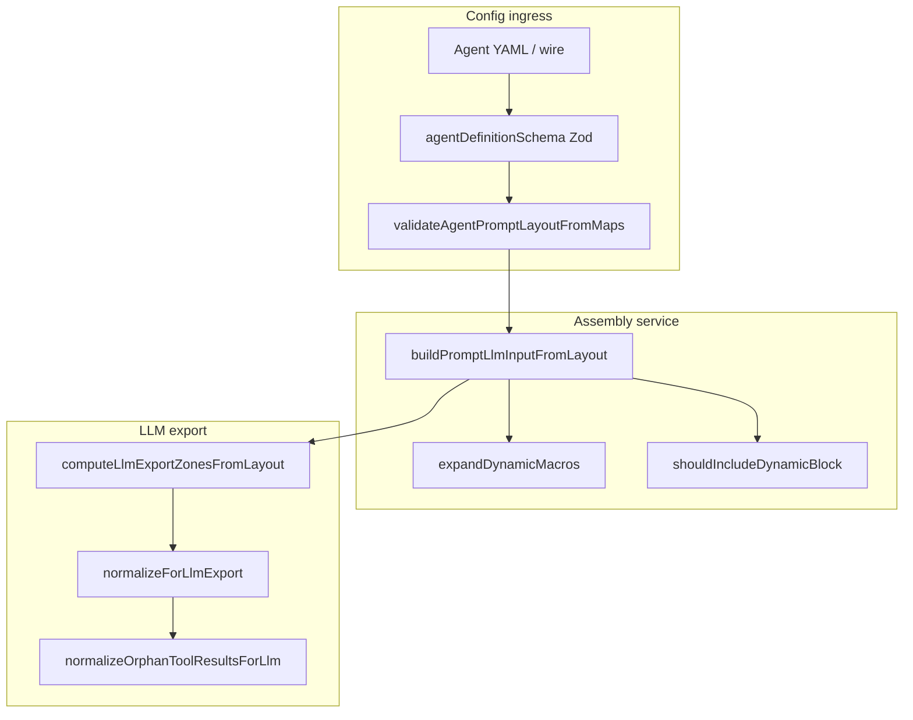

# 代码审查：Prompt 域

**范围：** `packages/core/src/domain/prompt/**`、`packages/core/src/service/prompt/**`、相关测试、`public/prompt.ts`、`errors/prompt-errors.ts`  
**审查日期：** 2026-06-21  
**重点：** 代码风格、可维护性、正确性

---

## 执行摘要

Prompt 子系统实现**三区 agent 布局**（`system` 字段 + `persist` + 运行时 `chat` + `dynamic`），管线清晰：配置校验 → 装配 → LLM 导出规范化 → 视图时变换。设计合理，热路径测试充分，与 `agent-runner` 集成干净。

**总体评估：** 对当前 agent-layout 模型已可投产。主要关切为 `prompts.blocks` 迁移后遗留的**遗留面**、**重复的 wire 转换逻辑**、模块间**本地化不一致**。已审查路径未发现阻塞性正确性 bug。

| 领域            | 评级 | 说明                                              |
|-----------------|------|---------------------------------------------------|
| 架构            | 良好 | 域/服务分离大体遵守                               |
| 正确性          | 良好 | 区数学、生命周期、合并规则一致                    |
| 可维护性        | 一般 | 遗留代码 + 重复辅助增加漂移风险                   |
| 代码风格        | 一般 | 中英混用；部分薄包装                              |
| 测试覆盖        | 良好 | 区 helper 与 snapshot store 位置有缺口            |

---

## 架构概览



**各层职责（按实现）：**

| 层   | 位置                         | 角色                                              |
|------|------------------------------|---------------------------------------------------|
| Model | `domain/prompt/model/*`          | `AgentPromptLayout`、遗留 `PromptBlock`、context 类型 |
| Logic | `domain/prompt/logic/*`          | 校验、宏、生命周期、LLM 区合并                     |
| Service | `service/prompt/*`               | 装配编排、regex/tool 视图变换、snapshot 缓存 |
| Public | `public/prompt.ts`               | 消费者稳定导出                      |

`agent-runner` 运行时管线：

1. 刷新 worktree snapshot → 构建 `PromptRenderContext`
2. 对可见消息应用 regex LLM channel
3. `buildPromptLlmInputFromLayout`（persist 合成 + chat + dynamic）
4. `computeLlmExportZonesFromLayout` + `normalizeForLlmExport`
5. `normalizeOrphanToolResultsForLlm` → 模型请求

顺序正确：区合并在已装配消息上操作；orphan tool 规范化为最终视图安全网。

---

## 优点

### 1. 布局校验单一 decode 路径

`validateAgentPromptLayout` 将内存 layout 重序列化为 wire map 并调用 `validateAgentPromptLayoutFromMaps`。表单保存、upsert、YAML decode 因此共享同一规则集 — 强可维护性模式。

```330:354:packages/core/src/domain/prompt/logic/validate-agent-prompt-layout.ts
export function validateAgentPromptLayout(
  layout: AgentPromptLayout,
): AgentPromptLayout {
  assertUniqueBlockNames(layout.persist, "persist");
  assertUniqueBlockNames(layout.dynamic, "dynamic");
  // ... wire conversion ...
  return validateAgentPromptLayoutFromMaps(
    persistMap,
    dynamicMap,
    layout.system,
    {
      persistEnabled: layout.persistEnabled,
      dynamicEnabled: layout.dynamicEnabled,
    },
  );
}
```

### 2. 区域感知的 LLM 导出合并

`normalizeForLlmExport` 仅在 persist/chat/dynamic 区内合并相邻纯文本消息，保留 VFS 语义段，跳过含 tool 消息，并应用 OpenAI 专用 `tool_turn_bridge` 过滤。规则显式且测试充分。

### 3. 宏策略分层正确

- **Persist：** 校验时拒绝任意 `{{`（`rejectPersistMacros`）
- **Dynamic：** 校验白名单扫描（`validateDynamicMacros`），渲染时展开（`expandDynamicMacros`）
- **遗留 dot 宏：** 可操作的迁移错误（如 `{{.worktree}}` → persist worktree block）

### 4. 装配 parity 契约

`prompt-assembly-parity.test.ts` 断言 `serializePromptLlmInput` 等于 `formatPromptLlmInputForCliFromLayout`，防止 CLI 预览与 tokenizer 漂移。

### 5. 生命周期语义一致

`shouldIncludeDynamicBlock` 与遗留 `shouldIncludePromptTextBlock` 同规则：`once` 仅在 `agentStepIndex === 0`，默认 `always`。Dynamic 生命周期测试覆盖 step 0/1 与 `dynamicEnabled: false`。

### 6. Worktree snapshot 与 live 宏不对称为有意设计

- Persist **worktree block** 用 `ctx.worktreeDisplay`（会话 snapshot，步内稳定）
- Dynamic **`{{$filetree}}`** 在存在 `worktree` 时 live 调用 `worktree.renderFileTree()`

`agent-prompt-layout-assembly.test.ts` 文档化该行为。

---

## 问题

### 严重

无。

### 主要

#### M1. 遗留 `PromptBlock` / `validatePromptBlocks` 路径已孤立

`prompts.blocks` 已从 `agentDefinitionSchema` 移除，但扁平 block 模型与校验器仍在：

- `domain/prompt/model/prompt-block.ts`
- `domain/prompt/logic/validate-prompt-blocks.ts`
- `domain/prompt/logic/should-include-prompt-text-block.ts` — **无生产引用**

`validatePromptBlocks` 仅被 `test/prompt/validate-prompt-blocks.test.ts` 引用。`PromptBlock` 类型仍从 `public/prompt.ts` 导出，但不在 agent 配置管线中。

**风险：** 后续贡献者可能重新接入旧模型或假定其活跃。  
**建议：** Deprecate 并从公共导出移除，或迁入 `legacy/` 命名空间并开 removal ticket。若无消费者则删除 `shouldIncludePromptTextBlock`。

#### M2. Wire block 序列化器重复

`persistBlockToWire` / `dynamicBlockToWire` 同时出现在：

- `validate-agent-prompt-layout.ts`（311–325 行）
- `agent-definition.schema.ts`（129–151 行）

两副本当前对齐，下一字段增改易漂移。

**建议：** 抽取共享 wire 辅助至如 `domain/prompt/logic/agent-prompt-layout-wire.ts`，两处 import。

#### M3. 公共 API 导出 UI 配置表单辅助

```15:19:packages/core/src/public/prompt.ts
export {
  movePersistBlock,
  updatePersistWorktreeRole,
  normalizePersistBlock,
} from "../config-forms/agent/agent-editor-state.js";
```

这些是编辑器状态变更，非 prompt 域操作。从 `@novel-master/core/prompt` 导出使公共面包耦合 `config-forms` 并模糊层边界。

**建议：** 从 config-forms 或 agent-editor 公共入口再导出；`prompt` 导出聚焦 layout 类型、校验与装配。

#### M4. 双重结构校验（Zod + 域）

`agent-definition.schema.ts` 中 Zod 校验形状（类型、roles enum、strict keys）。语义规则（宏白名单、persist 宏禁止、启用时 region role 顺序、单一 worktree）仅在 `validateAgentPromptLayoutFromMaps`。

该拆分有意 — Zod 无法表达宏扫描 — 但**结构重叠**（role enum、block 类型）存在于两处。Zod 可接受域校验拒绝的内容（如 persist 文本含 `{{$time}}`），解析时可行但入口不同则错误信息不同。

**建议：** 在模块头文档化拆分；考虑从共享常量生成 Zod，或 Zod `.superRefine` 委托宏/region 检查至域函数以统一 wire 解析错误。

### 次要

#### m1. 同一子系统中英混用

| 模块                         | 语言 |
|------------------------------|------|
| `validate-prompt-blocks.ts`    | 英文错误 |
| `validate-agent-prompt-layout.ts` | 中文错误 |
| `validate-dynamic-macros.ts`   | 中文错误 |
| `render-prompt.ts`             | 混合注释 |
| `agent-prompt-layout.ts`       | 中文 doc 注释 |

同一 `PromptError` 类型的用户可见错误随代码路径语言不同。

**建议：** 为用户可见校验消息选定一种语言（可能中文以匹配 agent 编辑器 UX，或英文以保 API 一致）并系统迁移。

#### m2. `expandDynamicMacros` 用字符串预检 `$filetree`

```27:29:packages/core/src/domain/prompt/logic/expand-dynamic-macros.ts
  if (content.includes("$filetree") && ctx.worktree != null) {
    filetree = await ctx.worktree.renderFileTree();
  }
```

常规模板可用，但是 leaky 优化（如 prose 中字面 `"$filetree"` 触发 render；注释宏仍匹配）。鉴于校验白名单影响低。

#### m3. `worktree` 缺失时 `{{$filetree}}` 静默为空

若 dynamic 内容引用 `$filetree` 但 `PromptRenderContext.worktree` 未定义，展开为空串无错误。校验通过；运行时输出静默空白。

**建议：** 在测试/文档中警告；宏 token 存在但服务缺失时可选 dev 构建 log 或 throw。

#### m4. `rejectPersistMacros` 基于子串

persist 内容中任意 `{{` 即校验失败，含非宏字面文本。可能为有意严格；值得在 agent 编写文档中说明。

#### m5. `markSessionWorktreeDirty` 为一行 passthrough

```10:16:packages/core/src/service/prompt/logic/mark-session-worktree-dirty.ts
export function markSessionWorktreeDirty(
  snapshot: SessionWorktreeSnapshotStore,
  projectId: string,
  sessionId: string,
): void {
  snapshot.markDirty(projectId, sessionId);
}
```

无行为仅增加间接。若无未来副作用，调用方可直接 `snapshot.markDirty`。

#### m6. 再导出 shim 上错误的 `@module` 路径

`domain/prompt/logic/message-body.ts` 声明 `@module domain/prompt/message-body` 但文件在 `logic/` 下。运行时无害；文档生成易混淆。

#### m7. 测试中 `formatSegment` 重复

`render-prompt.test.ts` 为 parity 断言重实现 `formatSegment` 逻辑，而非导出测试辅助或函数本身。CLI 格式化变更时有重复风险。

### nit

- `PromptError.offset` 由 infra 宏扫描填充，layout 校验器不填 — 不一致但下游今日未用。
- `DefaultSessionWorktreeSnapshotStore.markDirty` 无条目时 seed 空 snapshot；首次 `getOrRefresh` 前读 `get()` 时 surprising 但正确。
- `applyRegexChannelForLlm` 在 `service/prompt` 下但是 regex 域编排；与 LLM 视图管线同位可接受。

---

## 正确性分析

### 区边界计算

`computeLlmExportZonesFromLayout` 计数：

- `persistCount` = `persistEnabled` 时 `layout.persist.length`
- `dynamicCount` = `dynamicEnabled` 时通过 `shouldIncludeDynamicBlock` 的 dynamic block 数

与 `buildPromptLlmInputFromLayout` 输出结构（persist 前缀、chat 中间、dynamic 后缀）一致。隐藏 chat 消息在 push **前**过滤，中间段长度变化不破坏前缀/后缀区索引 — **正确**。

**缺口：** 无 lifecycle 过滤 dynamic block 时 `computeLlmExportZonesFromLayout` 的专用单元测试（行为仅由集成测试隐含）。

### Region 启用标志

`persistEnabled` / `dynamicEnabled` 为 false（默认）时，block 仍在 layout 模型中但装配跳过。role 顺序校验（末 persist = assistant、dynamic sandwich）**仅在启用时**运行 — 已在 `validate-agent-prompt-layout.test.ts` 测试。正确。

### 合成消息 ID

模板消息用稳定 ID（`prompt:${name}`、`prompt:worktree:${name}`）。测试确认 persist block 在 tool 历史前时不破坏 tool_result 配对（`build-prompt-llm-input-tool-pairing.test.ts`）。

### `normalizeOrphanToolResultsForLlm`

仅对**可见**历史配对；隐藏 `tool_use` 正确视为 orphan。与模块头文档化的 compaction-safe 设计一致。

### 遗留生命周期辅助

`shouldIncludePromptTextBlock` 镜像 flat `PromptBlock` 文本块的 dynamic 生命周期但未使用。若移除遗留模型则一并删除。

---

## 代码风格

**积极模式：**

- 只读域类型与 discriminated union（`PersistPromptBlock`、`PromptBlock`）
- 域逻辑纯函数；仅 I/O 处 async（`expandDynamicMacros`、assembly）
- 一致 `PromptError` 与 discriminant `code`
- 多数文件有 JSDoc `@module` 标签

**不一致：**

- `normalize-for-llm-export.ts` 混用 `@/` 与相对路径（`../../chat/...` vs prompt 内别处 `@/`）
- 部分函数 length 检查后对数组访问用非空断言（`persist[persist.length - 1]!`）— 此处惯用
- 服务文件 `render-prompt.ts` 再导出域类型（`PromptLlmInput`、`PromptRenderContext`）— 便利但重复 `public/prompt.ts` 导出

---

## 测试覆盖

| 领域                              | 测试 | 评估        |
|-----------------------------------|------|-------------|
| Layout 校验 / 宏        | `validate-agent-prompt-layout.test.ts` | 强 |
| 装配顺序 / 生命周期        | `agent-prompt-layout-assembly.test.ts`、`render-prompt-lifecycle.test.ts` | 强 |
| LLM 导出合并 / 区          | `normalize-for-llm-export.test.ts` | 强 |
| CLI/tokenizer parity              | `prompt-assembly-parity.test.ts` | 强 |
| Orphan tool results               | `normalize-orphan-tool-results-for-llm.test.ts` | adequate |
| 合成块与 tool 配对      | `build-prompt-llm-input-tool-pairing.test.ts` | adequate |
| 遗留 flat blocks                | `validate-prompt-blocks.test.ts` | 仅遗留 |
| `computeLlmExportZonesFromLayout` | —     | **缺直接测试** |
| `applyRegexChannelForLlm`         | —（可能经 agent-runner 间接） | 间接 |
| Session snapshot store            | `test/worktree/session-worktree-snapshot.test.ts` | 有但相对范围**位置不当** |
| 宏 infra                       | `macro-render.test.ts` | infra，非域 expand |

---

## 文件清单

### 域模型（`src/domain/prompt/model/`）

| 文件                    | 用途                                      |
|-------------------------|-------------------------------------------|
| `agent-prompt-layout.ts`| 三区 layout 类型                      |
| `prompt-block.ts`       | 遗留 flat block 类型                      |
| `prompt-render-context.ts` | 装配 context + `PromptLlmInput`       |

### 域逻辑（`src/domain/prompt/logic/`）

| 文件                              | 用途                          | 状态        |
|-----------------------------------|----------------------------------|---------------|
| `validate-agent-prompt-layout.ts` | 主 layout 校验器         | Active        |
| `validate-dynamic-macros.ts`      | 宏白名单 / persist 禁止    | Active        |
| `expand-dynamic-macros.ts`        | 运行时宏展开          | Active        |
| `should-include-dynamic-block.ts` | Dynamic 生命周期过滤         | Active        |
| `normalize-for-llm-export.ts`     | 区合并 + provider 后处理 | Active      |
| `validate-prompt-blocks.ts`       | 遗留 flat block 校验器      | **Legacy**    |
| `should-include-prompt-text-block.ts` | 遗留生命周期过滤      | **Dead code** |
| `message-body.ts`                 | 再导出 shim 至 chat 模块    | Active        |

### 服务（`src/service/prompt/`）

| 文件                                         | 用途                                |
|----------------------------------------------|----------------------------------------|
| `render-prompt.ts`                           | 装配 + CLI format + 区计算   |
| `normalize-orphan-tool-results-for-llm.ts`   | Tool 配对视图变换            |
| `apply-regex-channel-for-llm.ts`             | Regex LLM channel 包装              |
| `session-worktree-snapshot.port.ts`          | Snapshot store 端口                    |
| `create-session-worktree-snapshot-store.ts`  | 工厂                                |
| `impl/session-worktree-snapshot-store.service.ts` | 内存实现          |
| `logic/mark-session-worktree-dirty.ts`       | Dirty 标记 passthrough               |

### Public / errors

| 文件                 | 用途                    |
|----------------------|----------------------------|
| `public/prompt.ts`   | 包导出            |
| `errors/prompt-errors.ts` | 类型化 prompt 错误   |

---

## 建议（按优先级）

1. **移除或隔离遗留 flat-block 模型**（`PromptBlock`、`validatePromptBlocks`、`shouldIncludePromptTextBlock`）并去掉未用公共导出。
2. **抽取 persist/dynamic block 共享 wire 序列化器**；schema + 校验器单一 import。
3. **将 config-form 导出迁出** `public/prompt.ts`。
4. **为 lifecycle 跳过的 dynamic block 增加** `computeLlmExportZonesFromLayout` **单元测试**。
5. **统一 prompt 校验器错误消息语言**。
6. **将** `session-worktree-snapshot.test.ts` **移至** `test/service/prompt/`（或文档说明为何在 worktree 下）。
7. **在 agent 编写指南中文档化** persist vs dynamic worktree/filetree 行为（snapshot vs live render）。

---

## 结论

Prompt 域是 agent 三区模型最清晰的表达：校验规则、装配顺序、LLM 导出变换在投产关键路径（`agent-runner`、tokenizer parity、compaction）上一致且已测。技术债集中在**layout 迁移前遗留产物**与**重复 wire 辅助**，而非核心运行时逻辑。

处理 M1–M3 可在不改变运行时行为的情况下显著改善可维护性。其余为打磨与文档。
