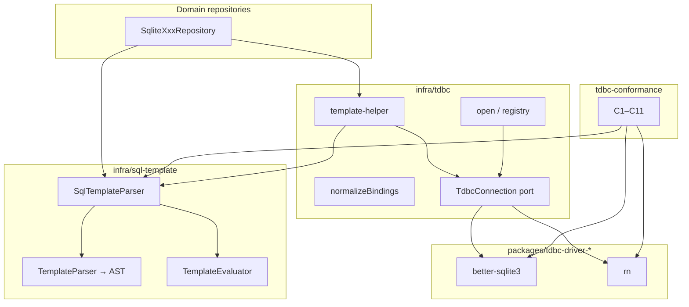

# 代码审查：TDBC + SQL Template 基础设施（`packages/core`）

**审查日期：** 2026-06-21  
**范围：**

| 模块 | 路径 |
|------|------|
| TDBC 协议 | `packages/core/src/infra/tdbc/**` |
| SQL 模板 | `packages/core/src/infra/sql-template/**` |
| TDBC 测试 | `packages/core/test/infra/tdbc/**` |
| SQL 模板测试 | `packages/core/test/infra/sql-template/**` |

**审查维度：** 绑定安全、嵌套事务、错误映射、模板解析、可维护性。

**说明：** TDBC 在 core 中是**零原生依赖的协议层**；`execute` / `transaction` / `SQLITE_ERROR` 等运行时语义由 `tdbc-driver-*` 包实现，并通过 `tdbc-conformance` 验收。本报告以 core 内代码为主，必要时引用驱动/conformance 以评估协议是否可被一致实现。

**已运行测试：** `test/infra/tdbc/*.test.ts` + `test/infra/sql-template/*.test.ts` — **36/36 通过**。

---

## 执行摘要

TDBC + SQL Template 构成一套**分层清晰、与 MyBatis 动态 SQL 对齐**的数据访问基础设施：模板两阶段流水线（语法 → AST → 求值 → `{ sql, parameters }`），TDBC 协议提供异步连接契约与驱动注册，可选 `template-helper` 将二者桥接。当前实现**在既定边界内质量良好**，全仓库仓储层均使用 `#{...}` 参数绑定，未见 `${...}` 动态拼接。

**总体评级：A-**

| 维度 | 评级 | 要点 |
|------|------|------|
| 绑定安全 | B+ | `#{...}` 走预编译占位符；`${...}` 与 `test` 表达式存在理论风险，但当前用法可控 |
| 嵌套事务 | A- | 协议明确禁止嵌套；上层已有 `NESTED_TRANSACTION` 降级模式 |
| 错误映射 | B+ | 双错误类型分工清晰；存在未使用错误码与 helper 层缺口 |
| 模板解析 | A | 解析器健壮，`<` 与标签消歧正确；热路径无 AST 缓存 |
| 可维护性 | A- | 模块边界清楚；少量重复逻辑与测试盲区 |

**范围内未发现 P0 级缺陷。** 主要改进方向：补全安全/边界测试、`${...}` 使用约束文档化、清理死代码、可选 AST 缓存。

---

## 架构概览



### 数据流

1. **解析阶段**（无运行时参数）：`TemplateParser.parse(template)` → `AstNode[]`
2. **求值阶段**（绑定 params）：`TemplateEvaluator.evaluate(ast, params)` → `{ sql, parameters }`
3. **执行阶段**：`connection.execute(sql, parameters)` 或 `queryTemplate` / `executeTemplate`

### 文件职责

| 文件/目录 | 职责 |
|-----------|------|
| `tdbc/ports/*.port.ts` | `TdbcDriver`、`TdbcConnection` 契约 |
| `tdbc/logic/open.ts` | URL 解析（`tdbc:sqlite:…`）与 `open()` |
| `tdbc/logic/registry.ts` | 驱动注册表；单 driver 自动选用 |
| `tdbc/logic/normalize-bindings.ts` | `undefined` → `null`（与 SQLite NULL 对齐） |
| `tdbc/logic/template-helper.ts` | 模板解析结果转发至 connection |
| `tdbc/errors.ts` | `TdbcError` + 6 种 `TdbcErrorCode` |
| `sql-template/parser.ts` | 词法扫描、标签/占位符 AST 构建 |
| `sql-template/evaluator.ts` | AST 遍历、参数收集、动态标签求值 |
| `sql-template/expression.ts` | `<if test="…">` 表达式规范化与求值 |
| `sql-template/placeholder.ts` | `#{…}` / `${…}` 渲染 |
| `sql-template/tags/*` | `<where>`、`<trim>`、`<foreach>` 专用逻辑 |

---

## 1. 绑定安全

### 1.1 做得好的地方

**`#{path}` 预编译绑定。** 求值器将 hash 绑定渲染为占位符（默认 `?`），值进入 `parameters` 数组，由 SQLite prepared statement 绑定——这是正确的防注入路径。

```16:27:packages/core/src/infra/sql-template/placeholder.ts
export function renderBind(
  kind: "hash" | "dollar",
  path: string,
  stack: ContextStack,
  placeholder: string,
): BindResult {
  const value = resolvePath(stack, path);
  if (kind === "hash") {
    return { fragment: placeholder, parameters: [value] };
  }
  const text = value === null || value === undefined ? "" : String(value);
  return { fragment: text, parameters: [] };
}
```

**公开 API 已警示 `${…}` 风险。** `SqlTemplateParser.parse` 的 JSDoc 明确说明 `${…}` 为原始字符串插值，须仅用于可信/白名单值。

**仓储层实际用法安全。** 全 `packages/core/src/domain/**/repositories/impl/` 检索显示：SQL 模板**仅使用 `#{…}`**，未发现 `${…}` 或动态 ORDER BY 拼接。

**`undefined` / `null` 统一为 SQL NULL。** `normalizeBindings` 与 conformance C3 一致；驱动层（如 better-sqlite3）在 `execute`/`query`/`batch` 前调用。

**`<` 与动态标签消歧。** 解析器通过 `isTagStart` 区分 SQL 比较运算符（`a < b`）与 XML 标签，测试 `#17` 覆盖。

### 1.2 风险与缺口

| 严重度 | 问题 | 说明 |
|--------|------|------|
| 中 | `${…}` 无运行时防护 | 语法层面保留 MyBatis 兼容；若未来误用于用户输入列名/排序字段，可致 SQL 注入。建议：lint/CI 规则禁止仓储层出现 `${`；或提供仅 `#{}` 的 strict 模式 |
| 中 | `test` 表达式沙箱可绕过 | `evaluateTest` 使用 `new Function` + 黑名单 `FORBIDDEN_PATTERN`。例如 `(0).constructor.constructor('return globalThis')()` 不含被禁关键字，理论上可逃逸。当前模板均为开发者硬编码，**实际暴露面低** |
| 低 | `template-helper` 未调用 `normalizeBindings` | 参数原样传给 connection；依赖驱动规范化。协议层未强制，mock 测试可能遗漏 `undefined` 行为 |
| 低 | `normalizeBindings` 不校验 `SqlValue` 类型 | 非 SQLite 合法类型（如普通 object）会落到驱动/SQLite 层报错，错误信息可能不直观 |

**表达式黑名单现状：**

```9:9:packages/core/src/infra/sql-template/expression.ts
const FORBIDDEN_PATTERN = /[;{}]|=>|\bfunction\b|\bnew\b|\beval\b|\bimport\b/i;
```

未禁止：括号调用链、`constructor`、`globalThis` 访问路径、方括号属性访问等。对**不可信模板**不够；对**内部仓储模板**可接受。

### 1.3 建议

1. **短期：** 在 `docs` 或 repository 层 README 增加「禁止 `${…}` / 禁止用户可控 test 表达式」约定；可选 ESLint `no-restricted-syntax`。
2. **中期：** 为 `evaluateTest` 增加逃逸向量回归测试；考虑白名单运算符解析替代 `new Function`。
3. **长期：** `SqlTemplateParser` 增加 `strict: true` 选项，解析期拒绝 `${…}` 节点。

---

## 2. 嵌套事务

### 2.1 协议设计

core 在 `TdbcConnection` 端口明确约定：

```39:42:packages/core/src/infra/tdbc/ports/connection.port.ts
  /**
   * Runs `fn` inside a transaction. Nested calls throw `NESTED_TRANSACTION`.
   */
  transaction<T>(fn: (tx: TdbcConnection) => Promise<T>): Promise<T>;
```

TDBC spec 首期策略：**事务深度 = 1，无 SAVEPOINT**。嵌套 `transaction()` 抛 `NESTED_TRANSACTION`（错误码已定义于 `tdbc/errors.ts`）。

### 2.2 core 层覆盖情况

| 项 | core 内状态 |
|----|-------------|
| 错误码 `NESTED_TRANSACTION` | ✅ 已定义 |
| 事务实现 | ❌ 不在 core（由 driver 实现） |
| core 单测 | ❌ 无嵌套事务用例 |
| 跨包验收 | ✅ `tdbc-conformance` C9 覆盖 |

**驱动实现（参考，非本范围）：** `better-sqlite3` 用 `inTransaction` 标志 + `TransactionalConnection.transaction` 直接 reject；外层 `BEGIN`/`COMMIT`/`ROLLBACK` 由父连接管理。

### 2.3 上层消费模式

`revision-aware-vfs.service.ts` 已实现**协议级降级**：捕获 `NESTED_TRANSACTION` 后复用现有 `conn`，避免在外层事务中再次 `BEGIN`：

```143:155:packages/core/src/service/vfs/impl/revision-aware-vfs.service.ts
async function runInTransactionOrConn<T>(
  conn: TdbcConnection,
  fn: (tx: TdbcConnection) => Promise<T>,
): Promise<T> {
  try {
    return await conn.transaction(fn);
  } catch (error) {
    if (error instanceof TdbcError && error.code === "NESTED_TRANSACTION") {
      return fn(conn);
    }
    throw error;
  }
}
```

该模式表明：**禁止嵌套是刻意设计**，上层需显式处理而非期待 SAVEPOINT。

### 2.4 边界问题（驱动层，供协议消费者知晓）

- **`batch()` 在 `transaction()` 内：** better-sqlite3 的 `batchSync` 内部再包一层 `db.transaction()`；若外层已有 TDBC `BEGIN`，SQLite 行为依赖 savepoint 语义——conformance 未覆盖此组合场景。
- **`tx.close()`：** `TransactionalConnection.close()` 委托父连接，会关闭整库连接；端口未禁止，属 footgun。
- **core mock 测试**（`open.test.ts`、`template-helper.test.ts`）中 `transaction: async (fn) => fn(conn)` **不模拟** `NESTED_TRANSACTION`，与真实驱动行为不一致。

### 2.5 建议

1. 在 `tdbc/ports/connection.port.ts` JSDoc 补充：`tx` 上禁止再调 `transaction()`；`close()` 应仅在外层 connection 调用。
2. 考虑将 `runInTransactionOrConn` 提炼为 core 内可选 helper（如 `runInTransactionOrExisting`），减少各 service 重复 catch。
3. conformance 增加 **C12：`transaction` 内 `batch` 全成功/全失败**（可选，驱动包执行）。

---

## 3. 错误映射

### 3.1 TdbcError

```8:14:packages/core/src/infra/tdbc/errors.ts
export type TdbcErrorCode =
  | "UNKNOWN_DRIVER"
  | "INVALID_URL"
  | "CONNECTION_CLOSED"
  | "SQLITE_ERROR"
  | "BATCH_FAILED"
  | "NESTED_TRANSACTION";
```

| 错误码 | 抛出位置（core） | 抛出位置（driver/conformance） |
|--------|------------------|--------------------------------|
| `UNKNOWN_DRIVER` | `registry.resolveDriver` | C11 |
| `INVALID_URL` | `open.parseUrl` | — |
| `CONNECTION_CLOSED` | — | C1 |
| `SQLITE_ERROR` | — | 驱动 wrap |
| `BATCH_FAILED` | — | C8 |
| `NESTED_TRANSACTION` | — | C9 |

**优点：**

- 统一 `Error` 子类，`code`  discriminant 便于 `instanceof` + 分支（见 VFS 降级）。
- 保留 `driver`、`sqliteCode`、`cause`，符合 spec。
- core 自身 URL/registry 错误信息清晰。

**缺口：**

| 严重度 | 问题 |
|--------|------|
| 低 | `template-helper` 不捕获/包装 `SqlTemplateError`；调用栈上两种错误类型并存（通常可接受） |
| 低 | `sqliteCode` 在 core 无文档说明何时填充；依赖驱动实现 |
| 低 | `TdbcError` 与 `SqlTemplateError` 无共同基类或 `isTdbcError` 辅助函数（KKV 域有 `isKkvError` 模式可借鉴） |

### 3.2 SqlTemplateError

```6:11:packages/core/src/infra/sql-template/errors.ts
export type SqlTemplateErrorCode =
  | "UNKNOWN_TAG"
  | "UNCLOSED_TAG"
  | "MALFORMED_TAG"
  | "EXPRESSION_ERROR"
  | "INVALID_COLLECTION";
```

| 错误码 | 使用处 |
|--------|--------|
| `UNKNOWN_TAG` | `parser.ts` |
| `UNCLOSED_TAG` | `parser.ts` |
| `MALFORMED_TAG` | `parser.ts` |
| `EXPRESSION_ERROR` | `expression.ts` |
| `INVALID_COLLECTION` | **未使用（死代码）** |

**优点：**

- 解析错误带 `offset`、`tagName`，便于定位模板 typo（测试 `#15` 验证 `testOffset`）。
- 表达式错误保留 `cause`。

**缺口：**

- `INVALID_COLLECTION` 已声明但 `normalizeCollection` 对非法集静默返回 `[]`，不抛错——与错误码定义不一致。
- `SqlTemplateError` 构造函数接受 `cause` 但未像 `TdbcError` 一样声明 `readonly cause` 字段（仅传给 `super`）。

### 3.3 建议

1. 删除 `INVALID_COLLECTION` 或在 `normalizeCollection` 对非可迭代原始类型抛出（需评估 MyBatis 兼容：当前「非数组 → []」是有意行为）。
2. 为 `SqlTemplateError` / `TdbcError` 各增加 `isXxxError()` 工具（与项目其他域一致）。
3. `template-helper` 文档注明：解析失败抛 `SqlTemplateError`，执行失败抛 `TdbcError`。

---

## 4. 模板解析

### 4.1 解析器（Phase 1）

**设计：** 单遍扫描 + 递归 `parseChildren`；支持标签 `if`、`where`、`foreach`、`trim`、`choose`/`when`/`otherwise`；占位符 `#{…}`、`${…}`。

**亮点：**

- **标签/文本消歧：** 非已知标签的 `<` 作为文本 emit（如 `a < b`、`< 10`）。
- **属性解析：** 双/单引号值；属性名大小写不敏感（`prefixOverrides` → `prefixoverrides`）。
- **`<choose>` 专用解析：** 限制子节点为 `when`/`otherwise`；重复 `otherwise` 报错。
- **错误定位：** 多数 throw 带 `offset`/`tagName`。

**限制（与 MyBatis 对齐的已知取舍）：**

| 限制 | 影响 |
|------|------|
| 无 XML 注释 `<!-- -->` | 模板内不可写 SQL 块注释（可用 `--` SQL 注释） |
| 无自闭合标签 | 必须 `<if …></if>` |
| `#\{[^}]+\}` 路径不含 `}` | 正常；复杂表达式应放 `test` 而非 `#{}` |
| 每次 `parse()` 全量重新解析 | 热路径重复 AST 构建（见可维护性） |

### 4.2 求值器（Phase 2）

**动态标签语义（测试覆盖 #4–#16）：**

| 标签 | 行为 | 测试 |
|------|------|------|
| `<if test>` | 表达式为真才展开子树 | ✅ |
| `<where>` | 去 leading AND/OR，非空则加 `WHERE` | ✅ |
| `<foreach>` | 空集合省略片段；参数顺序与迭代一致 | ✅ 含嵌套 |
| `<trim>` | prefixOverrides 去 token + prefix/suffix | ✅ |
| `<choose>` | 首个真 `when`，否则 `otherwise` | ✅ |

**参数顺序：** `where`/`foreach`/`trim` 均先收集子树 parameters 再合并到父 state，嵌套 foreach 测试 `#16` 验证顺序 `[1,2,3]`——对 IN 查询正确。

**上下文解析：** `resolvePath` 合并 stack 帧；缺失属性 → `undefined`，不抛错（`<if test="missing != null">` 测试 `#5`）。

### 4.3 表达式子系统

- `normalizeExpression`：`and`/`or`/`not` → JS 运算符；**字符串字面量内**不重写（测试覆盖）。
- `bindExpressionToContext`：裸标识符 → `__ctx__.path` / 可选链。
- `evaluateTest`：`Boolean(new Function(...))`。

### 4.4 建议

1. 若模板字符串在仓储中重复出现，考虑导出 `parseTemplateToAst` + 缓存 AST 的工厂模式（`SqlTemplateParser` 当前每次 new `TemplateEvaluator`）。
2. 补充边界测试：空模板、仅空白、`foreach` 的 `index` 属性、`<trim suffixOverrides>`。
3. 文档列出**不支持**的 MyBatis 标签（如 `<set>`、`<bind>`），避免误用。

---

## 5. 可维护性

### 5.1 优点

- **零原生依赖 core：** 协议与模板可独立单测，驱动可插拔。
- **模块内聚：** 标签逻辑拆到 `sql-template/tags/`，端口/逻辑/错误分离。
- **类型清晰：** `AstNode`  discriminated union、`SqlValue`/`Row` 与 spec 一致。
- **测试编号与 spec 用例对应：** `#1`–`#17` 等注释便于追溯需求。
- **与业务集成简单：** 仓储 `private readonly parser = new SqlTemplateParser()` + `executeTemplate`/`queryTemplate` 模式一致。

### 5.2 技术债

| 严重度 | 项 | 位置 |
|--------|-----|------|
| 低 | 上下文合并逻辑重复 | `context.ts` `mergedContext` vs `context-proxy.ts` `mergedContextForExpression` |
| 低 | `SqlTemplateParser.parse` 无 AST 缓存 | 每个 repository 持 parser 实例，但同一 template 字符串每次调用仍 re-parse |
| 低 | 全局可变 driver registry | `registerDriver` / `clearDrivers`；测试需 `beforeEach` 清理 |
| 低 | `resolveDriver` 单 driver 自动选用 | 测试/多包环境可能意外选错 driver（spec  intentional） |
| 低 | 死错误码 `INVALID_COLLECTION` | `errors.ts` |
| 低 | mock `transaction` 过于简化 | 单测未反映 `NESTED_TRANSACTION` |

### 5.3 测试覆盖矩阵

| 区域 | 覆盖 | 缺口 |
|------|------|------|
| URL 解析 | ✅ file、memory、非法 scheme | Windows 绝对路径、query string |
| Registry | ✅ 无 driver、显式 driver | 多 driver 无 options 报错 |
| normalizeBindings | ✅ undefined、missing | 显式 `null` 保留、空数组 |
| template-helper | ✅ execute/query 转发 | 解析失败传播、normalize 链 |
| Parser AST | ✅ 嵌套 if、unknown tag、unclosed、a&lt;b | choose  malformed、foreach 缺属性 |
| Evaluator | ✅ if/where/foreach/trim/choose | set/bind 标签（未实现） |
| Expression | ✅ and/or/not、字面量、undefined 属性 | 沙箱逃逸、FORBIDDEN 边界 |
| Errors | ✅ UNKNOWN/UNCLOSED/EXPRESSION + offset | MALFORMED_TAG 专项 |
| 安全 | ❌ | `${…}` 注入演示、恶意 test |
| TDBC 事务/批处理 | ❌（在 conformance） | core 内无 port 契约测试 |

---

## 6. 优先建议汇总

| 优先级 | 建议 | 工作量 |
|--------|------|--------|
| P1 | 仓储层 CI/lint：**禁止 `${` 出现在 `*.repository.ts` 模板** | 小 |
| P2 | 删除或实现 `INVALID_COLLECTION`；统一 collection 非法时的行为 | 小 |
| P2 | 为 `TdbcError` / `SqlTemplateError` 增加 `isXxxError` | 小 |
| P2 | 补充 `evaluateTest` 沙箱逃逸回归测试（记录已知限制） | 中 |
| P3 | 提炼 `runInTransactionOrConn` 为 core helper | 中 |
| P3 | `SqlTemplateParser` 可选 AST 缓存或暴露两阶段 API | 中 |
| P3 | 合并 `mergedContext*` 重复实现 | 小 |
| P4 | conformance C12：transaction + batch 组合 | 中 |
| P4 | `SqlTemplateParser` strict 模式禁用 `${…}` | 中 |

---

## 7. 结论

`infra/tdbc` 与 `infra/sql-template` 是 **packages/core 数据访问栈的稳固基座**：协议薄、模板求值完整、与 SQLite prepared statement 模型对齐。在当前「开发者编写模板 + 全 `#{}` 绑定 + 驱动 conformance 验收」的前提下，**安全与正确性满足生产要求**。

后续演进应聚焦：**收紧 `${…}` 与表达式沙箱的文档/工具链约束**、**清理死错误码**、**补安全与事务边界测试**，并在热路径考虑 AST 缓存。嵌套事务的「禁止 + 上层 catch 降级」模式已在 VFS 验证可行，建议在 core 文档中升格为一等模式，避免各 service 各自发明 SAVEPOINT 语义。
