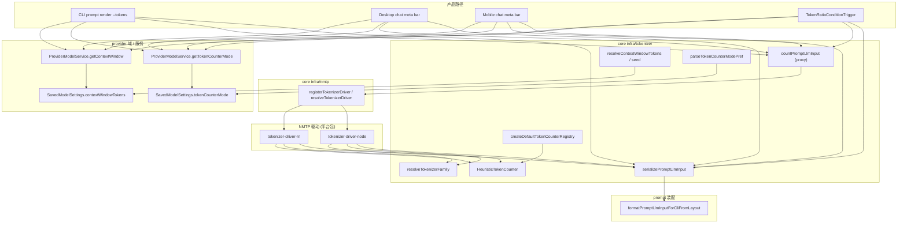

# 代码审查：`infra/tokenizer` 基础设施

**日期：** 2026-06-21  
**范围：** `packages/core/src/infra/tokenizer/**`、`packages/core/src/infra/nmtp/**`（NMTP 驱动注册，与 tokenizer 紧耦合）、`packages/core/test/infra/tokenizer/**`、`packages/core/test/helpers/register-node-tokenizer-driver-for-tests.ts`  
**审查重点：** 与 compaction / provider 计数一致性、性能、可维护性、正确性  
**关联包（引用边界）：** `packages/tokenizer-driver-node`、`packages/tokenizer-driver-rn`（NMTP 驱动实现，非本报告主范围）

---

## 执行摘要

tokenizer 基础设施采用**清晰的分层拆分**：`packages/core` 持有端口、启发式回退、模型名路由表、prompt 序列化桥接与 NMTP 驱动注册；**精确分词**由平台驱动（Node/RN）在运行时注册后执行。`countPromptLlmInput` 在 core 中仅为薄代理，实际逻辑在驱动中——设计意图明确，与 SillyTavern 对齐的 ST parity 测试分布在 driver 包与 `prompt-assembly-parity` 中。

**Compaction token-ratio 与 Chat/CLI token 栏**在 happy path 上共用同一栈：`serializePromptLlmInput` → NMTP `countPromptLlmInput`，且均显式传入 `tokenizerOverride`（来自 saved model `tokenCounterMode`）。主要一致性风险在**错误回退路径**、**registry 端口语义漂移**、以及 **UI 可选 mode 子集**与 schema 全集不一致。

| 领域 | 评级 | 说明 |
|------|------|------|
| 架构 | ✅ 良好 | core 零平台依赖 + NMTP 驱动注册；序列化与 CLI 预览单一路径 |
| compaction/provider 一致性 | ⚠️ 参差 | 主路径对齐；Desktop 回退、遗留 `estimateTokens`、未保存模型 context window 有偏差 |
| 性能 | ⚠️ 可接受 / 有热点 | 每步全量 prompt 装配 + 分词；无缓存；agent 步进可能重复计数 |
| 可维护性 | ⚠️ 参差 | registry 端口与实现脱节；mode 列表多处重复；测试 helper 遗留 |
| 正确性 | ✅ 良好 | 启发式与 ST 比率一致；family 路由有测试；边界语义（严格 `>`）有测 |
| 测试覆盖 | ⚠️ 部分 | core 内集成测偏薄；实质覆盖在 driver 包与 compaction 触发器测试 |

---

## 架构概览



### 职责划分

| 层级 | 职责 |
|------|------|
| **端口** | `TokenCounter`、`TokenCounterRegistry` — 文本/消息计数与（名义上的）模型路由 |
| **启发式实现** | `HeuristicTokenCounter` — `ceil(len / 3.35)`，与 ST `CHARACTERS_PER_TOKEN_RATIO` 对齐 |
| **路由表** | `resolveTokenizerFamily`、`CONTEXT_WINDOW_RULES` — vendor model id 子串匹配 |
| **序列化桥接** | `serializePromptLlmInput` → prompt 服务 `formatPromptLlmInputForCliFromLayout` |
| **计数入口** | `countPromptLlmInput` 委托 NMTP 驱动；`countPromptLlmInputHeuristicOnly` 供无驱动场景 |
| **NMTP** | 驱动注册与 `TokenizerError`；core 不直接依赖 tiktoken / @agnai |
| **Provider 衔接** | `read-token-counter-mode-pref` 校验；`seedContextWindowTokens` 仅在 save/backfill 时使用 |

### 关键设计决策

1. **Registry 在 core 中仅为启发式** — `create-default-registry.ts:42–47` 的 `forVendorModel` / `forApplicationModel` 恒返回 `HeuristicTokenCounter`；精确族选择与编码在驱动内通过 `resolveTokenizerFamily` 完成。
2. **tokenizerOverride 由调用方显式传入** — 产品 runtime 不再注入 `registry.getTokenizerOverride`（见 `tokenizer-driver-node` `count-prompt-llm-input.ts:40–43`）；Compaction、CLI、Desktop、Mobile 均传 `tokenizerOverride`。
3. **Context window 运行时只读持久化值** — `seed-context-window-tokens.ts:4–5` 注明 map 非运行时回退；`getContextWindow` 仅返回 saved settings（`provider-model.service.ts:421–426`）。

---

## 文件清单

### 源码（`src/infra/tokenizer/` — 13 个文件）

| 路径 | 角色 |
|------|------|
| `index.ts` | 公共导出面（含 re-export NMTP） |
| `ports/token-counter.port.ts` | `TokenCounter`、`TokenizerFamily` 类型 |
| `ports/token-counter-registry.port.ts` | `TokenCounterRegistry` 端口 |
| `impl/heuristic-token-counter.ts` | ST 比率启发式实现 |
| `logic/count-prompt-llm-input.ts` | 计数代理、`formatPromptTokenUsageLabel`、启发式-only 回退 |
| `logic/serialize-prompt-input.ts` | CLI parity 序列化桥接 |
| `logic/create-default-registry.ts` | 启发式-only registry 工厂 |
| `logic/resolve-tokenizer-family.ts` | 模型名 → family（ST `getTokenizerModel` 顺序） |
| `logic/resolve-context-window.ts` | 子串表解析 context window |
| `logic/context-window-map.ts` | 静态 context window 规则 |
| `logic/seed-context-window-tokens.ts` | save/backfill 默认 context window |
| `logic/tokenizer-asset-paths.ts` | 各 family 资源相对路径（供驱动加载） |
| `logic/read-token-counter-mode-pref.ts` | `tokenCounterMode` 校验与解析 |

### NMTP（`src/infra/nmtp/` — 与 tokenizer 共用）

| 路径 | 角色 |
|------|------|
| `logic/registry.ts` | 驱动注册表、`resolveTokenizerDriver` |
| `ports/tokenizer-driver.port.ts` | `TokenizerDriver` 端口 |
| `nmtp-error.ts` | `TokenizerError` |

### 测试（`test/infra/tokenizer/` — 6 个文件 + helper）

| 路径 | 覆盖 |
|------|------|
| `heuristic-token-counter.test.ts` | 启发式公式、与 `estimateTokens` 等价 |
| `registry.test.ts` | registry 恒启发式、`resolveTokenizerFamily` 表驱动 |
| `serialize-prompt-input.test.ts` | 基本 assembly 格式 |
| `count-prompt-llm-input.test.ts` | 仅 `NOT_REGISTERED` 错误路径 |
| `token-counter-mode-no-public-path.test.ts` | 全局 preference 读取路径已移除 |
| `registry-test-helpers.ts` | mock provider/saved-model repo（当前 registry 测试未使用） |
| `test/helpers/register-node-tokenizer-driver-for-tests.ts` | 测试用 Node 驱动注册 |

### 跨包测试（不在本目录但覆盖本 infra）

| 路径 | 覆盖 |
|------|------|
| `packages/tokenizer-driver-node/test/count-prompt-llm-input.test.ts` | tiktoken/claude/heuristic 计数 |
| `packages/core/test/compaction-conditions/token-ratio-trigger.test.ts` | compaction 与计数栈集成 |
| `packages/core/test/prompt/prompt-assembly-parity.test.ts` | 序列化与 CLI 预览 parity |

---

## 与 compaction / provider 计数一致性

### ✅ 已对齐的主路径

| 维度 | compaction | Chat / CLI | 证据 |
|------|------------|------------|------|
| Prompt 文本来源 | `countPromptLlmInput` 内 `serializePromptLlmInput` | 同左 | `token-ratio.trigger.ts:46–52`、`serialize-prompt-input.ts:15–20` |
| Tokenizer mode | `resolveTokenizerOverride` → `tokenizerOverride` 参数 | `getTokenCounterMode` / `resolveTokenCounterModeForModel` → 同参数 | `create-compaction-condition-evaluator.ts:53–56`、`commands.ts:103–112`、`chat-prompt-tokens.service.ts:73–84` |
| Context window（比例阈值） | `getContextWindow`（持久化） | UI 百分比同源 | `token-ratio.trigger.ts:38–42`、`provider-model.service.ts:421–426` |
| 阈值语义 | `tokenCount > floor(ratio × window)` 严格大于 | N/A | `token-ratio.trigger.ts:53`、`token-ratio-trigger.test.ts:106–127` |
| CLI 预览 vs 计数 | `formatPromptLlmInputForCliFromLayout` 与 serialize 同源 | parity 测试 | `prompt-assembly-parity.test.ts` |

Compaction evaluator 与 Desktop chat bar 的装配注释均声明与 CLI `prompt render --tokens` 对齐（`chat-prompt-tokens.service.ts:2–4`）。

### ⚠️ 一致性缺口与边界

#### 1. Desktop 错误回退使用不同序列化

**文件：** `apps/desktop/src/main/services/chat-prompt-tokens.service.ts:97–106`

回退路径将**可见消息**用 `role: messageBodyText` 拼接，**未**走 `serializePromptLlmInput`（无 system/persist/dynamic 区、无 regex/VFS 装配）。主路径失败时 UI 可能显示与 compaction / CLI 不同的 token 数。

**影响：** 仅异常路径；正常路径一致。  
**修复：** 回退仍调用 `serializePromptLlmInput`，或启发式计数前复用 `buildSessionPromptInput` 产物。

#### 2. 遗留 `estimateTokens` 与全 prompt 计数语义不同

**文件：** `domain/compaction-conditions/logic/token-estimate.ts:12–14`

`estimateTokens` 对 `messageBodyText` 列表做启发式计数；**token-ratio 触发器已不使用**（改用 `countPromptLlmInput`）。函数仍从 `public/compaction.ts:19` 导出。

**影响：** 外部消费者若用 `estimateTokens` 评估 compaction 阈值会产生系统性偏差。  
**修复：** `@deprecated` JSDoc；文档明确 token-ratio 路径；长期可移除 public 导出。

#### 3. 未保存模型：context window 为 null → ratio 触发器静默禁用

**文件：** `token-ratio.trigger.ts:38–40`、`provider-model.service.ts:421–426`

未 save 的模型无 `contextWindowTokens`；`resolveContextWindowTokens` **不在运行时回退**（`seed-context-window-tokens.ts:4–5`）。Compaction ratio 不触发，但 Chat bar 仍可能显示启发式 token 数（无百分比）。

**影响：** 按设计；用户可能困惑「有 token 数但 compaction 不按比例触发」。  
**修复（产品层）：** 文档或 CLI 提示；可选在 evaluator 层对 unsaved model 用 seed map 作一次性提示（非 infra 默认行为）。

#### 4. UI mode 选项 ⊂ schema 合法全集

**文件：** `domain/provider/model/token-counter-mode-options.ts:10–17` vs `read-token-counter-mode-pref.ts:15–32`

UI/CLI 选择器仅暴露 7 种 mode（`auto`、`heuristic`、`tiktoken`、`claude`、`gemma`、`llama3`、`mistral`），而 schema 允许 `llama`、`yi`、`jamba`、`qwen2`、`command-r`、`command-a`、`nemo`、`deepseek`、`gpt2` 等。API patch 可写入 UI 未列出的 mode，Compaction 与计数会生效，但 UI 无法编辑回退。

**修复：** 扩展 `TOKEN_COUNTER_MODE_OPTIONS` 或从 `VALID_FAMILIES` 生成选项列表（单一来源）。

#### 5. `TokenCounterRegistry` 端口语义与实现脱节

**文件：** `token-counter-registry.port.ts:23–31`、`create-default-registry.ts:30–47`

端口文档描述「按 vendor model 路由 counter」；实现恒为启发式。精确路由在驱动 + `resolveTokenizerFamily` 中。调用方若误以为 `forVendorModel("gpt-4o")` 返回 tiktoken counter 会误判。

**修复：** 更新端口文档标明「registry 仅启发式；精确计数请用 `countPromptLlmInput`」；或移除/弱化 `forApplicationModel` 路由语义。

#### 6. Node vs RN 驱动 tiktoken 开销（跨包）

RN 驱动 tiktoken 路径使用简化 overhead（`tokenizer-driver-rn` `count-prompt-llm-input.ts:78–80`），Node 使用 ST 对齐的 `countOpenAiStyleMessages`（`count-openai-style-message.ts:26–54`）。同一 prompt 在 Mobile 与 Desktop/CLI 上 tiktoken 计数可能略有差异。

**范围：** 驱动包；core infra 需知 parity 非跨平台绝对保证。

---

## 优点

1. **平台无关 core** — tiktoken、@agnai、原生桥接均不在 `infra/tokenizer`；通过 NMTP 注册注入，符合 monorepo 分层。

2. **序列化单一路径** — `serializePromptLlmInput` 显式委托 CLI 格式化函数（`serialize-prompt-input.ts:14–20`），并有 parity 测试，降低「预览与计数漂移」风险。

3. **启发式与 ST 对齐且可测** — `CHARACTERS_PER_TOKEN_RATIO = 3.35`（`heuristic-token-counter.ts:15`）在 Kotlin RN 常量中有镜像注释；测试验证 `countMessages` 与 `estimateTokens` 等价（`heuristic-token-counter.test.ts:22–29`）。

4. **Compaction 使用完整计数栈** — token-ratio 走 `countPromptLlmInput` + 显式 override，与产品 token 栏一致（`token-ratio.trigger.ts:44–52`）。

5. **全局 preference 已移除** — `token-counter-mode-no-public-path.test.ts` 锁定 `readTokenCounterModeFromPreferences` 不得再导出；per-model settings 为唯一产品配置面。

6. **NMTP registry 行为清晰** — 单驱动自动解析、多驱动需显式名、`NOT_REGISTERED` / `MULTIPLE_DRIVERS` 错误码（`registry.ts:34–61`）；`registry.test.ts` 覆盖完整。

7. **Context window 职责分离** — 运行时读 DB、seed map 仅用于默认值种子（`seed-context-window-tokens.ts:3–5`），避免静默覆盖用户设置。

---

## 代码风格

### 一致之处

- 多数文件有 `@module` JSDoc
- 端口与结果类型广泛使用 `readonly`
- 错误类型 `TokenizerError` 带判别 `code`

### 不一致之处

| 问题 | 位置 | 详情 |
|------|------|------|
| 注释语言混排 | `serialize-prompt-input.ts:1–14` | 中文文件头；邻域文件多为英文 |
| 端口文档与实现不符 | `token-counter-registry.port.ts:27–28` | 声称 substring → family 路由，实现不在 registry |
| 误导性测试描述 | `registry.test.ts:17–21` | 注释「precise counting via NMTP driver」但测的是 registry 返回启发式 |
| 死 try/catch | `create-default-registry.ts:34–39` | `forApplicationModel` 解析失败仍返回 heuristic，与成功路径相同 |

---

## 可维护性

### 重复与单一来源缺口

1. **Tokenizer mode 合法值三处维护** — `TokenizerFamily` 联合类型（`token-counter.port.ts:10–25`）、`VALID_FAMILIES`（`read-token-counter-mode-pref.ts:15–32`）、`TOKEN_COUNTER_MODE_OPTIONS`（`token-counter-mode-options.ts:10–17`）。新增 family 需改多处且 UI 易遗漏。

2. **Family 路由表与 asset 路径分离** — `resolve-tokenizer-family.ts` 与 `tokenizer-asset-paths.ts` 需手动保持同步；`tiktoken`/`gpt2`/`heuristic` 无 asset 条目（合理），但 WEB/SP 族需两边一致。

3. **`registry-test-helpers.ts` 遗留** — `mockProviderRepository`、`mockSavedModelRepository`（`registry-test-helpers.ts:48–96`）当前 registry 测试未使用（`emptyRegistryDeps` 返回空对象）。暗示旧版「registry 查 DB 路由」设计已移除，helper 未清理。

4. **`getTokenizerOverride` 钩子悬空** — 端口与 `CreateDefaultTokenCounterRegistryDeps` 保留（`create-default-registry.ts:18–19`），产品路径改传 `tokenizerOverride` 参数；驱动仍 fallback `registry.getTokenizerOverride?.()`（`tokenizer-driver-node`）。保留合理，但应在端口注释中标注「仅测试/遗留 fallback」。

5. **公共 API 面较宽** — `public/provider.ts:80–114` 导出 registry、tiktoken 辅助、NMTP 注册等 infra；与 provider 域边界混合（同 provider 域审查结论）。

### 依赖方向

- ✅ `infra/tokenizer` 不依赖 service 层
- ⚠️ `domain/compaction-conditions/logic/token-estimate.ts:8` 从 infra 导入 `HeuristicTokenCounter`（domain → infra，与 compaction 域审查一致，可接受但非纯 domain）
- ⚠️ `serialize-prompt-input.ts:9–12` 依赖 `service/prompt/render-prompt` — infra 向上依赖 service，为 parity 刻意选择；变更 prompt 服务时需同步 tokenizer 测试

---

## 正确性

### 已验证行为

| 行为 | 位置 | 测试 |
|------|------|------|
| 启发式 `ceil(len/3.35)` | `heuristic-token-counter.ts:21–30` | `heuristic-token-counter.test.ts` |
| Family 子串顺序（如 `llama3` 先于 `llama`） | `resolve-tokenizer-family.ts:86–90` | `registry.test.ts:56–74` |
| 未知模型 → `heuristic`（非 ST 默认 gpt-3.5-turbo） | `resolve-tokenizer-family.ts:123` | `registry.test.ts:61`、driver 测试 |
| `gemini` → `gemma` family | `resolve-tokenizer-family.ts:101–102` | `registry.test.ts:59` |
| Context window 首条匹配 | `resolve-context-window.ts:17–24` | driver 包 `W1` |
| 无驱动时 `countPromptLlmInput` 抛错 | `count-prompt-llm-input.ts:37–40` | `count-prompt-llm-input.test.ts:24–32` |

### 潜在正确性问题

#### 🟡 低 — `mapVendorModelIdToTiktokenModel` 与 `resolveTokenizerFamily` 默认策略不一致

**文件：** `resolve-tokenizer-family.ts:123` vs `mapVendorModelIdToTiktokenModel` `160`

未知 vendor id：`resolveTokenizerFamily` → `heuristic`；但若用户将 `tokenCounterMode` 设为 `tiktoken`，驱动会调用 `mapVendorModelIdToTiktokenModel` 并可能落到 `gpt-3.5-turbo` 编码。行为合理（强制 tiktoken），但两函数默认策略不同，维护时易混淆。

#### 🟡 低 — `formatPromptTokenUsageLabel` 小 context 显示 `0%`

**文件：** `count-prompt-llm-input.ts:75–76`

`count < window` 时 `Math.round` 可得 `0%`（如 `327/128000` → mobile 测试期望 `0% • 327/128K`）。语义正确但 UX 可能误导；非 bug。

#### 🟡 低 — `forApplicationModel` 无效 ID 静默成功

**文件：** `create-default-registry.ts:34–39`

无效 `applicationModelId` 与有效 ID 均返回 heuristic，无区分。当前无调用方依赖区分行为；若未来 registry 恢复 DB 路由需注意。

#### 设计说明（非 bug）

- **整 prompt 包成单条 system message 再 tiktoken** — Node 驱动 `wrapSerializedPromptAsSystemMessage`（`count-openai-style-message.ts:60–64`）与 ST `/openai/count` 路径一致，非 API 真实 message 结构。
- **启发式 `estimated: true`** — 驱动对 heuristic 路径显式标记（`tokenizer-driver-node` `count-prompt-llm-input.ts:52–55`），UI 用 `~` 前缀区分。

---

## 性能

### 热点路径

| 操作 | 位置 | 代价 |
|------|------|------|
| 全 prompt 装配 | 每次 `serializePromptLlmInput` | 遍历 layout 区、宏、VFS、regex 后消息 |
| Agent 每步 compaction 评估 | `agent-runner` → token-ratio trigger | 可能每步调用 `countPromptLlmInput`（见 compaction 域 P2-5） |
| tiktoken `encoding_for_model` | Node 驱动每次 tiktoken 计数 | 创建编码器 + `free()`；无池化 |
| Web/SP tokenizer 加载 | 驱动首次按 family 加载 asset | 冷启动 I/O；依赖 `tokenizerAssetPaths` |
| Family / context 子串扫描 | `resolve-tokenizer-family.ts`、`resolve-context-window.ts` | O(规则数 × 子串数)；模型 id 短，可忽略 |

### 评估

- **桌面/CLI 单会话交互** — 当前实现足够；计数仅在渲染 token 栏或 compaction 检查时触发。
- **长会话 + 低 ratio compaction** — 重复全量装配 + 分词可能成为 CPU 热点；compaction 域已建议按 prompt 快照缓存（`compaction-conditions.md` P2-5）。
- **无序列化/计数缓存** — 同一 layout+ctx 连续计数会重复工作；驱动与 core 均无 memoization。

### 轻微冗余

- `token-estimate.ts:10` 与 registry 各持有一个 `HeuristicTokenCounter` 实例；驱动错误路径 `new HeuristicTokenCounter()`（`tokenizer-driver-node` `count-prompt-llm-input.ts:92`）。影响极小。

---

## 测试覆盖评估

### 覆盖良好

| 领域 | 测试 |
|------|------|
| 启发式公式 | `heuristic-token-counter.test.ts` |
| Family 路由表 | `registry.test.ts` `resolveTokenizerFamily` |
| 序列化基本形态 | `serialize-prompt-input.test.ts` |
| NMTP registry | `test/infra/nmtp/registry.test.ts` |
| 全局 preference 禁令 | `token-counter-mode-no-public-path.test.ts` |
| 精确计数（tiktoken/claude） | `tokenizer-driver-node/test/count-prompt-llm-input.test.ts` |
| Compaction 阈值 / override | `token-ratio-trigger.test.ts` |
| CLI serialize parity | `prompt-assembly-parity.test.ts` |

### 缺口

| 缺口 | 建议 |
|------|------|
| core 内 `countPromptLlmInput` 仅测无驱动 | 在 core 测试注册 Node 驱动后补 1–2 个 smoke（或明确文档：精确计数测在 driver 包） |
| 无 `formatPromptTokenUsageLabel` 单元测试 | core 或 mobile 已有部分；可迁入 `test/infra/tokenizer/` |
| 无 `resolveContextWindowTokens` / `seedContextWindowTokens` core 测试 | driver 包仅 `W1`；补表驱动边界 |
| 无 `tokenizerAssetPaths` 测试 | 确保各 WEB/SP family 有路径 |
| `registry-test-helpers` mock repo 无消费者 | 删除或恢复「registry 需 DB」的集成测 |
| Desktop 回退路径 | 无测试保证与主路径序列化一致 |

---

## 建议（按优先级）

### P1 — 一致性与文档

1. **统一 Desktop token 回退序列化** — `chat-prompt-tokens.service.ts:97–106` 改用 `serializePromptLlmInput` 或复用 `buildSessionPromptInput`。
2. **更新 `TokenCounterRegistry` 端口文档** — 标明启发式-only；精确计数走 `countPromptLlmInput`（`token-counter-registry.port.ts:27–31`）。
3. **单一来源生成 token counter mode 列表** — 合并 `VALID_FAMILIES` 与 `TOKEN_COUNTER_MODE_OPTIONS`，避免 UI/schema 漂移。

### P2 — 可维护性

4. **清理或复用 `registry-test-helpers.ts`** — 移除未用 mock repo，或写 registry+DB 集成测。
5. **`estimateTokens` 标记 deprecated** — `token-estimate.ts:12–14`、`public/compaction.ts:19`。
6. **统一注释语言** — `serialize-prompt-input.ts` 与邻域一致（英文或项目中文约定）。
7. **修正 `registry.test.ts` 注释** — 避免「registry 提供精确计数」误解。

### P3 — 性能（按需）

8. **Compaction 路径 prompt/token 快照缓存** — 消息与 layout 未变时跳过 `countPromptLlmInput`（evaluator / agent-runner 层）。
9. **tiktoken encoding 池化** — 驱动层按 model 缓存 `Tiktoken`（注意 `free()` 生命周期）。

### P4 — 锦上添花

10. API 稳定时拆分 `public/provider.ts` 中 tokenizer 导出至 `public/tokenizer.ts`。
11. 跨平台 tiktoken parity golden — RN 已有 `generate-tokenizer-parity-goldens.mjs`；可扩展 Desktop vs Node 断言。

---

## 关键流程（参考）

### Chat / CLI token 计数

```
buildSessionPromptInput / prompt render ctx
  → resolveApplicationModelId (optional)
  → getTokenCounterMode(applicationModelId)  → tokenizerOverride
  → countPromptLlmInput({ layout, ctx, applicationModelId, registry, tokenizerOverride })
      → resolveTokenizerDriver()
      → driver: serializePromptLlmInput → resolveTokenizerFamily → encode
  → getContextWindow(applicationModelId)  → UI 百分比
```

### Compaction token-ratio

```
shouldRequestCompaction
  → TokenRatioConditionTrigger.shouldTrigger
      → getContextWindow(evaluation.modelContext.applicationModelId)
      → resolveTokenizerOverride → getTokenCounterMode (via evaluator)
      → countPromptLlmInput (同上)
      → tokenCount > floor(contextWindow × tokenRatio)
```

### 模型保存时 context window 种子

```
save(vendorModelId)
  → defaultSavedModelSettings(vendorModelId)
      → seedContextWindowTokens(vendorModelId)
          → resolveContextWindowTokens ?? DEFAULT_CONTEXT_WINDOW_TOKENS
```

---

## 结论

`infra/tokenizer` **架构成熟**：core 保持平台无关，NMTP 驱动承载精确分词，prompt 序列化与 CLI 预览共用单一路径。与 **compaction token-ratio** 及 **provider per-model settings** 在主路径上**计数一致**；需关注 Desktop 异常回退、遗留 `estimateTokens` 语义、以及 registry 端口与实现之间的文档漂移。

测试策略合理地将**重计数逻辑**放在 driver 包与 compaction 集成测试中，但 core 本地测试偏薄。无 P0 级计数错误；优先项为**一致性加固**（回退路径、mode 列表 DRY）与**Compaction 热路径缓存**（若长会话性能成为问题）。

**总体评估：** B+ — 设计清晰、ST parity 意识强；registry 遗留表面与跨路径回退是主要技术债。
