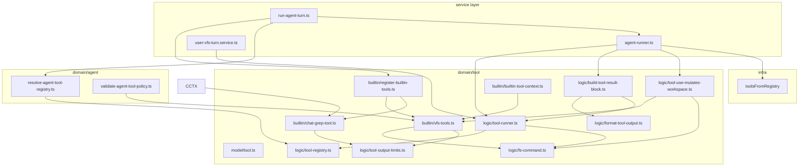

# 代码审查：`tool` 域

**范围：** `packages/core/src/domain/tool/**`、`packages/core/test/tool/**` 及相关服务层  
**日期：** 2026-06-21  
**审查者：** Agent（explore pass）  
**结论：** **批准， minor follow-up** — 架构健全，V2 spec 大体已实现，64/64 tool 测试通过。

---

## 执行摘要

tool 域是结构良好的、协议无关的 LLM 可调用单元执行层。清晰分离：

- **Model**（`Tool<Input, Output, Ctx>`）— schema 校验的可调用契约
- **Logic** — registry、runner、输出限制、格式化、fs 语法、工作区变更检测
- **Builtin** — 7 个 V2 工具（`read`、`write`、`edit`、`fs`、`glob`、`grep`、`chat_grep`）

服务集成（`run-agent-turn`、`DefaultAgentRunner`、`UserVfsTurnService`）模式一致：bootstrap registry → 按 agent policy 过滤 → `ToolRunner.call` / `runParallel` → `buildToolResultBlock` 持久化。

审查路径未发现阻塞性正确性 bug。主要风险是**相关（非相同）路径上的并行变更顺序**、**跨模块重复的 fs 变更启发式**，以及**多 tool 用户 VFS 操作的部分失败语义**。

---

## 架构



### 文件清单

| 路径 | 角色 |
|------|------|
| `model/tool.ts` | 核心 `Tool` 接口 |
| `logic/tool-registry.ts` | 名称唯一的内存 registry |
| `logic/tool-runner.ts` | 输入/输出校验、错误规范化、并行调度 |
| `logic/tool-output-limits.ts` | 共享截断常量与纯辅助函数 |
| `logic/format-tool-output.ts` | 面向 LLM 的成功/错误文本 |
| `logic/build-tool-result-block.ts` | `ToolResultBlock` 组装 + UI `summary` |
| `logic/fs-command.ts` | 严格 `fs` 命令语法 + VFS 执行 |
| `logic/tool-use-mutates-workspace.ts` | Checkpoint 资格谓词 |
| `builtin/vfs-tools.ts` | 6 个文件工具 + policy 名称常量 |
| `builtin/chat-grep-tool.ts` | Session 消息搜索 |
| `builtin/register-builtin-tools.ts` | 注册全部 7 个 builtin |
| `builtin/builtin-tool-context.ts` | `{ vfs, projectId, sessionId, listSessionMessages }` |

### 相关服务层

| 路径 | Tool 用法 |
|------|-----------|
| `service/agent/logic/run-agent-turn.ts` | 探测 registry、校验 agent def、过滤 tools、装配 `BuiltinToolContext` |
| `service/agent/impl/agent-runner.ts` | `runParallel` → `buildToolResultBlock`；变更时 checkpoint |
| `service/chat/create-user-vfs-turn-service.ts` | 用户 VFS 操作专用 registry + runner |
| `service/chat/impl/user-vfs-turn.service.ts` | 经 `runParallel` 的 `executeOp`；flush **不**重跑 tools |
| `domain/agent/logic/resolve-agent-tool-registry.ts` | allow/deny 过滤 |
| `domain/agent/logic/validate-agent-tool-policy.ts` | Policy 校验 + V1→V2 迁移提示 |
| `infra/llm-protocol/logic/tool-definitions.ts` | Registry → LLM JSON schema |

---

## 代码风格

### 优点

- **一致的模块头**，含 `@module`、`@remarks`，适处有 `@throws`。
- **类型化错误**经 `ToolError` + 工厂辅助（`toolNotFound`、`toolInvalidArgument` 等）——调用方可按 `code` 分支。
- **`tool-output-limits.ts` 纯截断辅助**，非显而易见处有显式 WHY 注释（字节预算部分行排除）。
- **弃用 shim**（`VfsToolContext`、`registerVfsTools`、`MUTATING_VFS_TOOL_NAMES`）便于 V1→V2 迁移且不破坏导出。
- **RN 安全 UTF-8 计数**经 `TextEncoder` 而非 Node `Buffer`。

### 问题

| ID | 严重程度 | 发现 |
|----|----------|------|
| S1 | 低 | **注释 locale 混杂。** `tool-runner.ts`（`extractMutatingPaths`）与 `tool-use-mutates-workspace.ts` 用中文注释，同级文件用英文。按包或按文件统一约定。 |
| S2 | 低 | **JSDoc `@module` 路径与文件路径不符。** 如 `tool-registry.ts` 声明 `@module domain/tool/tool-registry` 但位于 `domain/tool/logic/tool-registry.ts`。`tool-runner.ts` 同理。 |
| S3 | 低 | **`createVfsTools()` 返回类型为 `Tool<any, any, BuiltinToolContext>[]`。** 在集合边界丢失 per-tool I/O 类型；注册可接受但削弱 IDE 支持。 |
| S4 | 信息 | **`format-tool-output.ts` 用结构启发式**（键数量 + 字段名）而非判别联合。因输出稳定且有测试而可行，但新 tool 形态需更新多个 formatter。 |

---

## 可维护性

### 优点

- **单一注册入口：** `registerBuiltinTools()` — agent turn、event handler、用户 VFS 工厂一致使用。
- **输出限制集中：** 所有 read/grep/glob/chat_grep/fs ls 工具共享 `tool-output-limits.ts` 常量。
- **协议解耦：** tools 不知 LLM block；`buildToolResultBlock` 桥接 runner 结果与 chat 持久化。
- **Agent policy 正交：** 在复制的 registry 上过滤；基础 tools 不变。

### 问题

| ID | 严重程度 | 发现 | 建议 |
|----|----------|------|------|
| M1 | 中 | **Fs 变更逻辑在 3 处重复。** `extractMutatingPaths`（tool-runner）、`isMutatingFsCommand`（fs-command）、`toolUseMutatesWorkspace`（checkpoint）各自独立解析或分类 fs 命令。新增 subcommand 有漂移风险。 | 提取共享 `getFsCommandPaths(command): string[] \| null` 或各处复用 `parseFsCommand`（一致错误处理）。 |
| M2 | 低 | **`tool-runner.ts` 硬编码 mutating tool 名。** `"write"`、`"edit"`、`"fs"` 字面量而非 `MUTATING_FILE_TOOL_NAMES` / `FILE_TOOL_NAMES`。 | 从 `vfs-tools.ts` import 常量。 |
| M3 | 低 | **成功 summary 逻辑拆在两个 formatter。** `formatToolOutputForLlm`（LLM `content`）与 `build-tool-result-block.ts` 中 `summarizeToolSuccess`（UI `summary`）编码重叠的 tool 特定规则。 | 考虑单一 `describeToolOutput(toolName, output)` 返回 `{ content, summary? }`。 |
| M4 | 低 | **Registry bootstrap 在各服务入口重复。** `run-agent-turn`、`run-agent.handler`、`create-user-vfs-turn-service` 各自 `new ToolRegistry()` + `registerBuiltinTools()`。 | 当前可接受；若后续加 custom tools，引入共享 `createDefaultToolRegistry()` 工厂。 |
| M5 | 信息 | **`ToolRegistry.clear()` 标 `@internal` 但为 public。** 测试 OK；文档说明生产代码不应调用。 | |

---

## 正确性

### 优点

- **执行前输入校验：** Zod `safeParse` → `INVALID_ARGUMENT` 含 issue 详情。
- **输出契约强制：** 可选 `outputSchema` 在测试中捕获实现回归。
- **错误保留：** 非 `ToolError` 失败包装为带 `cause` 的 `FAILED`；已抛 `ToolError`（如 `parseFsCommand`）原样重抛。
- **同路径并行串行化：** `runParallel` 对 mutating 调用按精确路径字符串门控 —— R7 验证（`/race.md` last-write-wins）。
- **保守变更检测：** 无效 `fs` 命令为 checkpoint 视为 mutating。
- **fs 语法拒绝 shell 注入：** `&&`、`\|`、`;` 被拦；未知 subcommand 拒绝。
- **Read 分页：** offset 边界检查；`nextOffset` 续读提示；行 cap 后应用字节 cap。

### 问题

| ID | 严重程度 | 发现 | 影响 |
|----|----------|------|------|
| C1 | 中 | **路径串行化仅精确匹配。** `rm -r /dir` 与 `write /dir/file.txt` 用不同 path key 可并发。VFS 可能见交错 delete/create。 | 实践中少见（LLM 通常同路径），parallel tool_use 下可能。考虑前缀锁或每 session 全局串行所有 mutating fs op。 |
| C2 | 中 | **用户 VFS 多 tool op 部分失败。** `executeOp` 经 `runParallel` 跑全部 tools；任一失败返回 `{ ok: false }` 不入队，但成功 tools 的 VFS 变更已持久化。 | 仅当调用方一次 op 传多 tools 时重要。当前 UI 可能每 op 一个 tool —— 验证并文档化，或 rollback / 事务化。 |
| C3 | 低 | **fs 路径不能含空格。** Tokenizer 为 `trim().split(/\s+/)`。如 `/my docs/file.md` 会误解析。 | 在 tool 描述中说明；或加引号路径支持。 |
| C4 | 低 | **`chat_grep` regex 无超时。** 恶意或意外灾难性回溯（ReDoS）可能卡住 runner。 | Agent 控输入；低优先级。考虑超时后仅字面 fallback 或 max scan 预算。 |
| C5 | 低 | **`isMutatingFsCommand` 仅用 head token。**  loosely 重复 `parseFsCommand` —— 空/空白返回 `false`，但 `toolUseMutatesWorkspace` 将空 fs 命令视为 mutating。Checkpoint 有意保守；API 略不一致。 | 对齐语义或文档化差异。 |
| C6 | 信息 | **Agent checkpoint fire-and-forget。** `agent-runner` 中 `void messageCheckpoint.capture(...).catch(() => undefined)` — checkpoint 失败静默吞掉。 | UX 连续性可接受；确保别处有监控。 |

### 并行执行模型（参考）

```
runParallel(calls, ctx, { concurrency: 8 })
  │
  ├─ read/grep/glob/chat_grep/fs ls  →  concurrent (up to limit)
  │
  └─ write/edit/fs mutate            →  per exact path string:
         await previous tail for each path in {path | from | to}
         execute call
         release gate
```

---

## 测试覆盖

**结果：** `npm run test:fast -- test/tool/*.test.ts` → **64 tests, 0 failures**（2026-06-21）。

| 测试文件 | 重点 | 说明 |
|----------|------|------|
| `tool-registry.test.ts` | register / conflict / unregister | 基础 CRUD |
| `tool-runner.test.ts` | NOT_FOUND, INVALID_ARGUMENT, FAILED, output schema | 核心 runner |
| `tool-runner-parallel.test.ts` | R6/R7 checkpoint、并发、只读并行 | 强集成 |
| `vfs-tools.test.ts` | 完整 V2 文件 tool 流程、截断、版本检查 | 16 个集成用例 |
| `fs-command.test.ts` | Parser + execute 集成 | Shell 拒绝 |
| `tool-output-limits.test.ts` | 全部 cap 辅助 | 单元 |
| `format-tool-output.test.ts` | LLM 格式化 + 错误 unwrap | 含 R2 false-positive 护栏 |
| `build-tool-result-block.test.ts` | Block 形态、ok 标志、summary | R1/R2 |
| `tool-use-mutates-workspace.test.ts` | 变更谓词 | V2 tools 完整 |
| `chat-grep-tool.test.ts` | 隐藏消息、截断 | T7 |

### 覆盖缺口

| 缺口 | 优先级 |
|------|--------|
| 并行 `fs mv` + 对 `from` 路径 `write`（跨路径 race） | 中 |
| `cp`/`mv` 双路径门控的 `extractMutatingPaths` | 低 |
| `UserVfsTurnService` 多 tool 部分失败 | 中（若存在多 tool op） |
| 无 `ok` 字段 legacy 行的 `resolveToolResultOk`（除 R2 外） | 低 |
| 截断 grep/glob JSON 的 `formatToolResultContentForDisplay` | 低 |

`test/tool/` 外相关测试：

- `test/agent/agent-tool-policy.test.ts` — allow/deny、legacy 名提示
- `test/agent/agent-runner.test.ts` — 并行 mutating tools 后 checkpoint、doom loop
- `test/chat/user-vfs-turn.service.test.ts` — U-A-U-A flush、flush 不二次 ToolRunner

---

## 服务层集成审查

### `run-agent-turn.ts`

- 创建 probe registry → `validateAgentDefinition` → `resolveAgentToolRegistry` → `createAgentRunner`。
- `BuiltinToolContext.listSessionMessages` 接到 `messages.listBySession` —— 启用 `chat_grep`。
- **良好：** 校验在昂贵 worktree snapshot 刷新之前……实际上 snapshot 刷新在校验之后。顺序 OK。

### `DefaultAgentRunner`

- Tool 循环：model → 提取 `tool_use` blocks → doom-loop 护栏 → `runParallel` → `buildToolResultBlock` → 追加带结果的 user message。
- `anyToolUseMutatesWorkspace(toolUses)` 时触发 checkpoint —— 与域谓词一致。
- **良好：** 并行结果顺序与 `toolUses` 索引一致。

### `UserVfsTurnService`

- 复用相同 `ToolRunner` + builtins；VFS 变更即时，UA message 延迟到 flush。
- **良好：** flush 明确不重调 ToolRunner（磁盘已更新）。
- **注意：** 见 C2 多 tool op。

---

## 与 Tool System V2 Spec 对齐

参考：`.apm/kb/docs/Iterations/tool-system-v2/spec.md`

| Spec 项 | 状态 |
|---------|------|
| 7 个 V2 tools（replace→edit，legacy ops→fs，+chat_grep） | ✅ 已实现 |
| 输出限制（50KB / 2000 lines / 100 matches / 2000 char lines） | ✅ 集中 + 应用 |
| 严格 fs 语法，无 shell 链 | ✅ |
| 带 `listSessionMessages` 的 `BuiltinToolContext` | ✅ |
| Legacy tool policy 迁移提示 | ✅ `validate-agent-tool-policy.ts` |
| 运行时无 V1 别名 | ✅ `replace` → NOT_FOUND |
| 截断在 tool 层，非 VfsService | ✅ |

---

## 发现汇总

| ID | 领域 | 严重程度 | 标题 |
|----|------|----------|------|
| C1 | 正确性 | **中** | 仅精确路径的并行串行化遗漏父子路径冲突 |
| C2 | 正确性 | **中** | 用户 VFS 多 tool op 失败时可留下部分 VFS 变更 |
| M1 | 可维护性 | **中** | Fs 变更分类在 3 个模块重复 |
| M2 | 可维护性 | 低 | tool-runner 硬编码 tool 名 |
| M3 | 可维护性 | 低 | LLM content 与 UI summary 格式化分离 |
| C3 | 正确性 | 低 | fs 命令路径不能含空格 |
| C4 | 正确性 | 低 | chat_grep regex ReDoS 风险 |
| C5 | 正确性 | 低 | isMutatingFsCommand 与 toolUseMutatesWorkspace 空输入不一致 |
| S1–S4 | 风格 | 低 | 注释混杂、JSDoc 路径、弱聚合类型、启发式 formatter |

---

## 建议（按优先级）

1. **将 fs 路径提取合并为一函数**，供 `tool-runner`、`tool-use-mutates-workspace`、`isMutatingFsCommand` 消费 —— 扩展 `fs` subcommand 时减少漂移。

2. **文档化或强制单 tool 用户 VFS op** —— 若从不用 multi-tool，在 `executeOp` 加校验；若使用，考虑 all-or-nothing 语义。

3. **为 C1 场景加并行集成测试**（如 `rm -r /dir` 与 `write /dir/x` 并发）以 codify 预期行为或驱动 prefix-lock 实现。

4. **Minor 清理：** 统一注释语言、修正 `@module` 路径、在 tool-runner import `MUTATING_FILE_TOOL_NAMES`。

5. **可选：** 合并 `formatToolOutputForLlm` + `summarizeToolSuccess` 为单一 tool 输出描述器，简化未来 tools。

---

## 结论

tool 域对 V2 tool 套件已达生产质量。关注点分离清晰，错误有类型且测试覆盖，服务集成一致。合并前无需改代码；中严重度项（C1、C2、M1） worth 作为 follow-up 加固跟踪而非 blocker。

**建议下次审查触发：** 添加 custom（非 builtin）tools、扩展 `fs` 语法或变更并行执行语义时。
