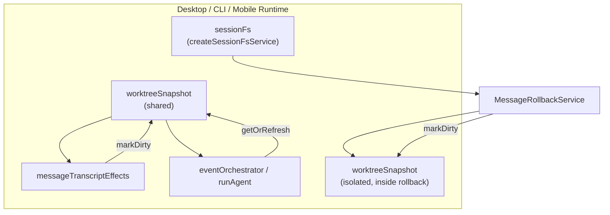
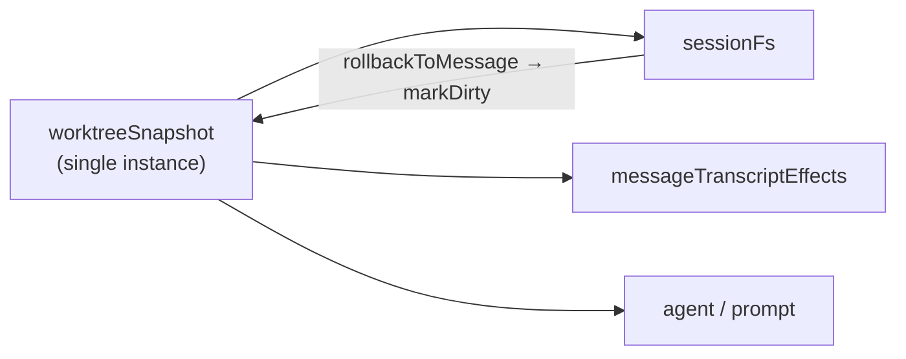
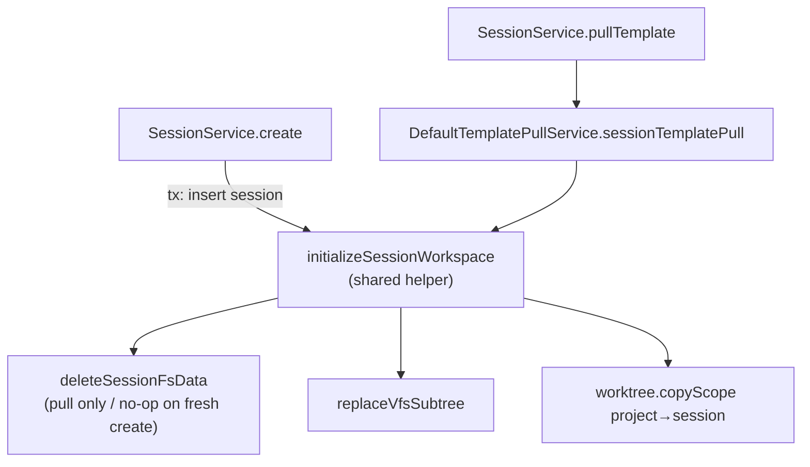
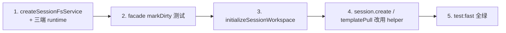

# Session FS 与 Template 服务层修复 技术规格（SPEC）

> **PRD**：[prd.md](./prd.md)  
> **依赖 PRD**：[message-checkpoint-v2/prd.md](../../../message-checkpoint-v2/prd.md)  
> **代码基线**：`packages/core` session-fs + template + chat + prompt snapshot（2026-06-21）  
> **探索材料**：[explore.md](./explore.md)

---

## 设计目标

1. **H1 — 单进程单 store：** 每个 app runtime 仅一个 `SessionWorktreeSnapshotStore`，`sessionFs.rollbackToMessage` 的 `markDirty` 与 agent / prompt / transcript effects 读写同一实例。
2. **H2 — 单实现 replace 初始化：** 「session 工作区 = project template 快照」只有一条 VFS+worktree 代码路径，`create` 与 `sessionTemplatePull` 共用。
3. **薄编排层不变：** 不在 facade 堆业务逻辑；rollback 仍委托 `MessageRollbackService`；template 仍委托 `DefaultTemplatePullService`。
4. **可回归：** facade 级 shared-store 测试 + 现有 template-pull / rollback 套件全绿。

---

## 现状与差距

### 架构（当前）



| 模块 | 路径 | 现状 |
|------|------|------|
| Session FS 工厂 | `service/session-fs/create-session-fs-service.ts` | 仅 `(conn)`；内部 `createMessageRollbackService(conn)` 无 snapshot 参数 |
| Rollback 工厂 | `service/message-checkpoint/create-message-checkpoint-services.ts:36-47` | 支持 `worktreeSnapshot?`；缺省 `createSessionWorktreeSnapshotStore()` |
| Rollback markDirty | `message-rollback.service.ts:109-113` | 事务提交后对 `deps.worktreeSnapshot` markDirty |
| Desktop runtime | `apps/desktop/.../create-desktop-runtime.ts:86,147` | L86 创建 shared store；L147 `createSessionFsService(conn)` **未传入** |
| CLI runtime | `apps/cli/src/runtime.ts:167,221` | 同上 |
| Mobile runtime | `apps/mobile/.../create-mobile-runtime.ts:75,131` | 同上 |
| Session create | `service/chat/impl/session.service.ts:64-97` | `copyVfsTree` + `worktree.copyScope` |
| Session template pull | `service/template/impl/template-pull.service.ts:41-66` | `deleteSessionFsData` + `replaceVfsSubtree` + `copyScope` |
| VFS 语义 | `domain/vfs/logic/vfs-tree-copy.ts` | `copyVfsTree` 合并；`replaceVfsSubtree` = `deleteVfsPrefix` + `copyVfsTree` |

### 关键差距

| ID | 差距 | 影响 |
|----|------|------|
| H1 | `sessionFs` 与 runtime 使用不同 snapshot store | 回滚后 prompt worktree 块 stale |
| H2 | create 用 merge copy，pull 用 replace | 重置工作区语义不一致；逻辑重复 |
| — | `SessionService.pullTemplate` 直接 `new DefaultTemplatePullService` | 非本 SPEC 范围；H2 仅要求 create 复用 pull **逻辑** |

---

## 总体方案

### 目标架构（H1）



### 目标架构（H2）



**推荐实现：** 抽取 `initializeSessionWorkspace(tx, projectId, sessionId, options?: { clearCheckpoints: boolean })`，`sessionTemplatePull` 在事务内 `clearCheckpoints: true`；`create` 在同一事务内 insert 后调用 `clearCheckpoints: false`（或仍先 `deleteSessionFsData` — 新 session no-op）。

**备选（更简单）：** `create` 在 insert 并 commit 后调用 `sessionTemplatePull(session.id)` — **不推荐**：两次事务、事务外 session 可见性、与 explore M6 同类；优先 **单事务 inline helper**。

---

## H1 详细设计：共享 `worktreeSnapshot`

### API 变更

```typescript
// packages/core/src/service/session-fs/create-session-fs-service.ts

export function createSessionFsService(
  conn: TdbcConnection,
  worktreeSnapshot?: SessionWorktreeSnapshotStore,
): SessionFsService {
  return new DefaultSessionFsService({
    messageRollback: createMessageRollbackService(conn, worktreeSnapshot),
  });
}
```

- 参数可选，保持脚本 / 单测默认行为。
- **Production runtime 必须传入** 与 orchestrator 相同的 `worktreeSnapshot` 引用。

### Runtime 接线

| Runtime | 文件 | 变更 |
|---------|------|------|
| Desktop | `apps/desktop/src/main/runtime/create-desktop-runtime.ts` | `sessionFs: createSessionFsService(conn, worktreeSnapshot)` |
| CLI | `apps/cli/src/runtime.ts` | 同上 |
| Mobile | `apps/mobile/src/runtime/create-mobile-runtime.ts` | 同上 |

`worktreeSnapshot` 已在各 runtime 中于 L~75–86 创建一次，并注入 `messageTranscriptEffects`、`createEventOrchestrator`、`runAgent` — **复用同一变量**。

### 测试 helper

```typescript
// packages/core/test/helpers/novel-master.ts
// 若测试需验证 rollback → prompt snapshot，应：
const worktreeSnapshot = createSessionWorktreeSnapshotStore();
sessionFs: createSessionFsService(conn, worktreeSnapshot),
// 并 export worktreeSnapshot 供断言
```

现有 `rollback-to-message.test.ts` 中 markDirty 用例直连 `createMessageRollbackService(ctx.conn, store)` — **保留**；**新增** facade 路径用例（见 §测试）。

### 行为不变量

- `markSessionWorktreeDirty` 仍在 DB 事务**外**调用（与 `message-delete-worktree-narrow-refresh` spec 一致）。
- `skipVfsReconcile: true` 且 tail 截断发生时仍 markDirty（rollback service 现有逻辑）。

---

## H2 详细设计：统一 VFS 初始化

### 语义对照

| 操作 | VFS | Worktree | Checkpoint | Messages |
|------|-----|----------|------------|----------|
| **当前** `session.create` | `copyVfsTree`（merge） | `copyScope` | 不清 | — |
| **当前** `sessionTemplatePull` | `replaceVfsSubtree` | `copyScope` | `deleteSessionFsData` | 不动 |
| **目标** 两者初始化部分 | `replaceVfsSubtree` | `copyScope` | create：不清；pull：清 | pull：不动 |

### 共享 helper 签名（建议）

```typescript
// packages/core/src/service/template/logic/initialize-session-workspace.ts
// 或 template-pull.service.ts 内 private method + export for session.service

export async function initializeSessionWorkspace(
  tx: TdbcConnection,
  projectId: string,
  sessionId: string,
  options: { clearCheckpoints: boolean },
): Promise<void> {
  if (options.clearCheckpoints) {
    await deleteSessionFsData(tx, sessionId);
  }
  const vfs = new SqliteVfsEntryRepository(tx);
  const worktree = new SqliteWorktreeRepository(tx);
  await replaceVfsSubtree(
    vfs,
    `/projects/${projectId}/template`,
    `/projects/${projectId}/sessions/${sessionId}`,
  );
  await worktree.copyScope(
    worktreeScopeKey({ kind: "project", projectId }),
    worktreeScopeKey({ kind: "session", projectId, sessionId }),
    mapProjectWorktreePathToSession,
  );
}
```

### `DefaultTemplatePullService.sessionTemplatePull`

```typescript
async sessionTemplatePull(sessionId: string): Promise<void> {
  const session = await sessions.findById(sessionId);
  if (session == null) throw chatNotFound("session", sessionId);
  await this.conn.transaction(async (tx) => {
    await initializeSessionWorkspace(tx, session.projectId, sessionId, {
      clearCheckpoints: true,
    });
  });
}
```

（可选改进：将 `findById` 移入事务 — 非本 SPEC 必须项。）

### `DefaultSessionService.create`

```typescript
await r.sessions.insert(session);
await initializeSessionWorkspace(tx, projectId, session.id, {
  clearCheckpoints: false,
});
return session;
```

删除 create 内联的 `copyVfsTree` + `copyScope` 重复代码。

### `SessionService.copy`

**不修改** — 仍 `copyVfsTree` 从源 session 复制 VFS/worktree（非 template replace）。

### Checkpoint / 消息边界（与 v2 PRD 对齐）

- Pull 后 `message_checkpoint` 清空 → 用户无法 rollback 到 pull 前的 Agent 文件树（仅消息截断 + 空基线 reconcile）— 与现有 `template-pull.test.ts` 一致。
- Create 不产生 checkpoint 行；Agent 首轮 tool 完成后才 capture。

---

## 公开 API 与文档

| 入口 | 变更 | 说明 |
|------|------|------|
| `@novel-master/core/session-fs` `createSessionFsService` | 增可选第二参 | 非 breaking |
| `SessionFsService` port | 无 | |
| `@novel-master/core/worktree` `createTemplatePullService` | 无 | |
| `public/session-fs.ts` 再导出 checkpoint 工厂 | 无代码变更 | PRD 文档：rollback → `sessionFs`；capture → `messageCheckpoint` |

---

## 测试计划

### 新增

| 文件 | 用例 | 断言 |
|------|------|------|
| `test/session-fs/rollback-to-message.test.ts` 或新文件 | facade + shared store | `createSessionFsService(conn, store)`；rollback 后 store 对该 session dirty |
| `test/worktree/template-pull.test.ts` 或 `test/chat/session-create.test.ts` | create replace 语义 | project template 仅 `/a.md`；create 后 session 无额外孤儿；若先写 session 独有文件再「模拟误路径」— 应用 replace 后孤儿消失（可通过 pull 或统一 create 后断言） |

### 回归（必须绿）

- `test/session-fs/rollback-to-message.test.ts`
- `test/message-checkpoint/rollback.test.ts`、`rollback-degraded.test.ts`
- `test/worktree/template-pull.test.ts`（含 session pull clears checkpoints）
- `test/package-exports-t0.test.ts`

### 验收命令

```bash
cd packages/core && npm run test:fast
```

---

## 实施顺序



1. **H1 可先合并** — 独立、小 diff、P0 正确性。
2. **H2 依赖 helper 抽取** — 可与 H1 同 PR 或紧随其后。

---

## 非目标（follow-up）

| 项 | explore ID | 说明 |
|----|------------|------|
| Template pull 后 markDirty | M3 | pull 替换 worktree 后 snapshot 可能 stale |
| Pull revision GC | M4 | `replaceVfsSubtree` 不经 revision-aware VFS |
| Chat 服务工厂注入 | M5 | `new DefaultTemplatePullService` |
| 事务内 session 校验 | M6 | 并发删除 session 边缘 case |
| 公开 API 拆分 | M1 | checkpoint 工厂仍从 session-fs 导出 |

---

## 风险与缓解

| 风险 | 缓解 |
|------|------|
| create 单事务 helper 与 pull 双段逻辑不一致 | 仅一处 `initializeSessionWorkspace`；pull 仅多 `clearCheckpoints: true` |
| 测试 helper 未传 snapshot，掩盖 H1 | 新增 facade 用例；runtime 改完后手工：回滚 → prompt worktree 块刷新 |
| H2 改变 create 在「目标前缀非空」时行为 | 新 session 前缀恒为空；风险极低；测试 lock replace 语义 |

---

## 完成定义（Definition of Done）

- [ ] `createSessionFsService(conn, worktreeSnapshot?)` 实现并导出
- [ ] Desktop / CLI / Mobile runtime 传入共享 store
- [ ] Facade shared-store rollback 测试 added
- [ ] `initializeSessionWorkspace` 单一实现；create + `sessionTemplatePull` 共用
- [ ] `npm run test:fast` 全绿
- [ ] PRD 验收表 H1-1–H2-5、T1 满足
